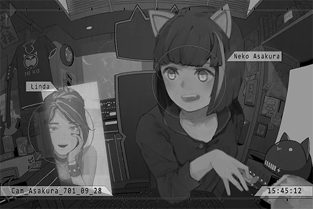

# Cam_Asakura_701_09_28
## Requirements
|Character|Level|
|---------|:---:|
|**Neko** | 23  |

## Unlocked Charts
|             Song              |Character|Diff.|Level|
|-------------------------------|:-------:|:---:|:---:|
|**DJ Mashiro is dead or alive**|  Neko   |Easy |  5  |
|**DJ Mashiro is dead or alive**|  Neko   |Hard |  9  |
|**DJ Mashiro is dead or alive**|  Neko   |Chaos| 14  |

## Log Content
*[Call Starts]*

**Neko** 
Linda\-chan! NEKO hasn't heard your voice in ages! I miss you so much!

**[Linda]** 
*Still exaggerating things as always. Didn't we just meet up last week?*

**Neko** 
Eh\~ So cold! NEKO missed you for real! Ah, right; how was it? Did the interview go well?

**[Linda]** 
*I got accepted! I'll be working at Under Velvet starting next week.*

**Neko** 
WOW! Congratulations! I'm so happy for you! Linda\-chan will be working in the administration department, right? Then we'll get to see so many free performances!

**[Linda]** 
*What else do you think I applied for a job there for? Haha. Shouldn't be too hard to get free performances. However, judging by how busy you are these days, do you even have time to come?*

**Neko** 
No worries. It's not like NEKO wants to stream every day either! It's quite an exhausting thing! And you have to come up with topics to talk about! 
By the way, why don't Linda\-chan come watch NEKO's stream? NEKO feels so lonely...

**[Linda]** 
*You know perfectly well that I'm not interested in this kind of internet culture, right? Music is really all I need in my life. Besides, when it comes to performances, nothing beats a live one, doesn't it?*

**Neko** 
Ummm... Linda\-chan has become an adult\~

**[Linda]** 
*More like you never grew up? 151...*

**Neko** 
Boo boo! Wrong\~! I'm 155 now! NEKO is still in her growth period! I will keep growing taller! Linda\-chan is so mean!

**[Linda]** 
*Hahaha, how old are you now? Reality's brutal, but you gotta accept it\~ 
Speaking of music, haven't seen you perform for a while now. I miss your last performance; you know, the one where you played songs on the UV stage.*

**Neko** 
That's because NEKO has been getting virtual LIVE cases these days. I even turned down a super big invitation not too long ago!

**[Linda]** 
*Virtual ones, eh...*

**Neko** 
Virtual LIVES are pretty awesome\~ You can perform at home, and the audience doesn't have to leave theirs to watch you perform either.

**[Linda]** 
*You do have a point, but I still prefer physical performances. That's why I applied for this job... Speaking of my job, there's a famous band from Node 54 coming this week. I'm a bit nervous\~ Really hope everything can go smoothly...*

**Neko** 
Linda\-chan is very capable; everything's gonna be a\-ok! Teehee\~

**[Linda]** 
*Teehee my a\*\*... Why did you decline that super big invitation though?*

**Neko** 
It's that Æsir guy. He's holding this mega music festival and he invited NEKO to perform. Although NEKO is very interested...

**[Linda]** 
*Æsir!? That's a fantastic honor! Why did you turn it down?*

**Neko** 
Because he invited a boatload of Mono's artists... and he invited PAFF too! NEKO has ZERO intention to be on the same stage with PAFF! Besides, I am 99.99% sure she'll sing the songs NEKO arranged, which makes me even more p\*\*\*ed off!

**[Linda]** 
*Oh... I see. If that's the case, then I can understand. You've been complaining to me about that for so many years now...*

**Neko** 
Ah, but it appears that "Cherry PuNK" is also invited! NEKO really wants to be on stage together with Cherry...

**[Linda]** 
*Indeed. I was so touched when I saw the news of Cherry's comeback! Ah...but there's a bad news. Last week, I caught wind of the news that they are on the verge of being signed by Mono...*

**Neko** 
EHHHHH!? You serious? NOOOOOO! Cherry, don't join Mono! They will squeeze you until you have no value left then trash you! That makes NEKO so conflicted\~ Should I boycott their music or not!?

**[Linda]** 
*You're exaggerating things again... Personally, I don't really mind...*

**Neko** 
Sigh\~ So\~\~ annoying! Eh, when should we meet up again next time? My fans have told NEKO about this delicious ramen shop...

**[Linda]** 
*Hahaha, you shouldn't be asking me. You should be asking yourself. When will you be free, you busy little kitten\~?*

**Neko** 
Ummm... Next Thursday, 07:00 PM! At the main entrance of UV!

**[Linda]** 
*No problem, see you then! 
That's it for now. I gotta prepare for work. Good luck with tonight's stream.*

**Neko** 
OK! Bye\-bye, Linda\-chan\~

*[Call Ends]*

*[Signal Lost]*
