# Neko OS Logs
## <a id="toc"/>List of Logs
- [\[#001\] Cam\_Park03\_689\_06\_13](#naos001)
- [\[#002\] Audio\_Shiraishi\_690\_08\_12](#naos002)
- [\[#003\] Cam\_Class\_I\-6\_696\_12\_01](#naos003)
- [\[#004\] Audio\_St07\_697\_01\_08](#naos004)
- [\[#005\] Cam\_Dash\_697\_06\_07](#naos005)
- [\[#006\] Cam\_NL\_697\_11\_16](#naos006)
- [\[#007\] Audio\_NL\_698\_07\_07](#naos007)
- [\[#008\] Audio\_Asakura\_698\_08\_15](#naos008)
- [\[#009\] Audio\_Arcade\_698\_08\_15](#naos009)
- [\[#010\] Cam\_Velvet\_698\_10\_06](#naos010)
- [\[#011\] Cam\_76St\_698\_11\_02](#naos011)
- [\[#012\] Audio\_Velvet\_698\_11\_19](#naos012)
- [\[#013\] Audio\_Neko\_698\_11\_24](#naos013)
- [\[#014\] Cam\_Asakura\_698\_12\_18](#naos014)
- [\[#015\] Audio\_Arcade\_698\_12\_18](#naos015)
- [\[#016\] Cam\_Studio\_698\_12\_18](#naos016)
- [\[#017\] Audio\_Mono\_698\_12\_19](#naos017)
- [\[#018\] Audio\_Mono\_698\_12\_28](#naos018)
- [\[#019\] Audio\_Mono\_699\_04\_12](#naos019)
- [\[#020\] Cam\_Shiraishi\_699\_04\_20](#naos020)
- [\[#021\] Call\_Linda\_699\_02\_25](#naos021)
- [\[#022\] Audio\_Neko\_699\_05\_01](#naos022)
- [\[#023\] Cam\_Asakura\_699\_05\_18](#naos023)
- [\[#024\] Audio\_Studio\_699\_05\_19](#naos024)
- [\[#025\] Cam\_Dash\_699\_05\_20\_1](#naos025)
- [\[#026\] Cam\_Dash\_699\_05\_20\_2](#naos026)
- [\[#027\] Audio\_Studio\_699\_06\_03](#naos027)
- [\[#028\] Cam\_Asakura\_701\_09\_28](#naos028)
- [\[#029\] Cam\_76st\_702\_06\_11](#naos029)
- [\[#030\] Cam\_NL\_702\_08\_19](#naos030)

## <a id="naos001"/>\[#001\] Cam\_Park03\_689\_06\_13
### Log Content
**Neko** 
Papa, look!

**Kouhei** 
Ho? A castle? It's very pretty.

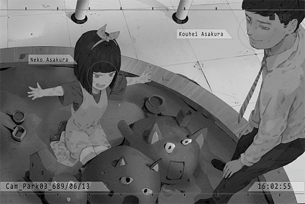

**Neko** 
Yes! NEKO, papa, mama and grandma all lives here. It's really big inside! NEKO is in the biggest room!

**Kouhei** 
... Sorry. Our current house is way too cramped for four people, isn't it?

**Neko** 
It's alright. NEKO will make so\~ much so much money when she grows up! We will live together in a very big place!

**Kouhei** 
No.

**Neko** 
Ehhhhh\~ Why?

**Kouhei** 
Because that's daddy's job, you little brat.

**Saku** 
I'm very satisfied with what we have.

**Neko** 
Ah, mama! Are you done shopping?

**Saku** 
Yes, sorry for making you guys wait. Let's go home. Mommy bought some tasty pork belly.

**Neko** 
Yip\~pee! Pork belly! ...... What is that?

**Kouhei** 
Haha... It's a kind of really delicious meat.

**Saku** 
NEKO, do you want to try making it? I can let you use the cutting knife today.

**Neko** 
Really!? I want to try!!

_\[→Signal Switch to Asakura's\]_

*\[Door Opens\]*

**Mayu** 
Welcome back.

**Neko** 
Grandma! NEKO built a really big castle today!

**Saku** 
Ok, ok\~ Go wash your hands and change your clothes. We don't want dirt in our dinner, do we?

**Neko** 
OK\~\~

**Mayu** 
So NEKO will be making dinner today? Is it alright? Maybe I should do it after all?

**Saku** 
Mom, your waist hasn't fully recovered yet, right? NEKO is seven years old already; we can handle it\~ You take your rest.

**Kouhei** 
Here, ma. Let me help you.

**Mayu** 
Thank you, Kouhei. It's good to have you here.

_\[»»» Fast Forward»»»\]_

**Kouhei** 
Saku, today... that Node 08 company called again. I was thinking...

**Saku** 
This again... I don't understand. Why are you so persistent about this?

**Kouhei** 
I explained many times already.  
The environment there is much better than here! Why shouldn't we move the whole family there?

**Saku** 
NEKO has finally gotten used to a new environment. Mom doesn't move very well either. If we're moving to a place this far away all of a sudden...

**Kouhei** 
That's why I said we should go there! All of our problems can be solved! Did you forget that we were forced to move because our "offering" level was not high enough... 
Please, reconsider this, okay? That company has high expectations for me. I can promise you. We will be so many times happier than we are right now!

**Saku** 
I'm already very happy now! Being with mom, you... and NEKO, all of us together in this small but cozy home...Are you not happy with this?

**Kouhei** 
That's not what I mean... But in Node 03... I worked hard to earn money, only to be forced to hand in all of it to the gang\-controlled Administration Bureau because of that offering nonsense. If we leave here, we won't have to worry about any of this!

**Saku** 
That's why we have to work hard together. I'm also working very hard...

**Kouhei** 
What can you change with those spare changes you make!?

**Saku** 
......

**Kouhei** 
... I... I'm sorry... I...

**Saku** 
... Every day, I... take care of those children who can't afford to go to a doctor. When I see the smiles on their and their families' faces... I feel like I make more than anybody else.

**Kouhei** 
......

**Saku** 
Kouhei, I don't know what your imagination of happiness is, but that's all just your illusion... If you really care about your own achievements and happiness, then go...

**Kouhei** 
... That is it for today. I'm tired from arguing with you.

**Neko** 
......

_\[Signal Lost\]_

[*(Click here to go back to the top)*](#toc)

## <a id="naos002"/>\[#002\] Audio\_Shiraishi\_690\_08\_12
### Log Content
**Saku** 
NEKO? Come over here. Daddy and mommy have something to tell you.

**Neko** 
......?

*\[Door Opens\]*

**Kouhei** 
NEKO, daddy... may be leaving this home.

**Neko** 
... Where are you going?

**Saku** 
Due to his work, daddy is going to Node 08... He might never return here again anymore.

**Neko** 
Never...? Why?

**Kouhei** 
To be honest with you... daddy and mommy divorced.

**Neko** 
Divorce...?

**Saku** 
Kouhei!

**Kouhei** 
NEKO is old enough now. There's no need to tell her such pointless lies anymore.

**Neko** 
Does papa not love mama anymore...?

**Saku** 
......?

**Kouhei** 
... NEKO, when adults divorce, it's sometimes due to more complicated reasons. It has nothing to do with whether we love each other or not.

**Neko** 
... NEKO doesn't want to! NEKO doesn't want papa to go!

**Kouhei** 
......

**Saku** 
NEKO can pick yourself. You can either stay here with mommy and grandma, or you can go to Node 08 with daddy.

**Neko** 
......

**Kouhei** 
NEKO, stay here. Mommy and grandma are here. Be a good child and behave yourself, got it?

**Neko** 
... I don't know... Papa, mama, grandma... NEKO likes everyone. NEKO wants to pick both sides...

**Saku** 
No... This is not picking toys. This time, you have to pick one.

**Neko** 
......

_\[»»» Fast Forward»»»\]_

**Neko** 
......

**Saku** 
This is too difficult for this child after all...

**Neko** 
... NEKO... NEKO wants to go with papa.

**Kouhei** 
...... Eh?

**Saku** 
......

**Neko** 
If NEKO stays here, papa will be all by himself, right? 
... That's, too lonely... NEKO will go with papa!

**Kouhei** 
Papa is going to a place really far away. We may never come back again...

**Saku** 
That's right. Your classmates and friends...

**Neko** 
NEKO can pick herself, right!? NEKO has made her pick already!

**Saku** 
......

**Kouhei** 
......

**Saku** 
I see... 
Then... when you're with daddy, be a good child, ok?

**Neko** 
...... OK.

**Saku** 
_\*Cries\*..._

**Kouhei** 
NEKO... I'm sorry... Thank you!

_\[Signal Lost\]_

[*(Click here to go back to the top)*](#toc)

## <a id="naos003"/>\[#003\] Cam\_Class\_I\-6\_696\_12\_01
### Requirements
|Character|Level|
|---------|:---:|
|**Neko** |  2  |

### Log Content
*\[Class Bell\]*

**Neko** 
Whew\~ It's over!!! I'm exhausted\~

**Classmate A** 
NEKO, are you going to the game center today?

**Neko** 
Ah! Sure, let's go! NEKO is definitely gonna crush the records today!

**Classmate B** 
Haha! You've already filled the high\-scores with your name, haven't you?

**Neko** 
I'm talking about breaking my own records again of course\~ 
Ah, what about Linda? She coming too?

**Classmate A** 
Eh? Forget it. She's a complete loner. She's not going to come with us.

**Classmate B** 
Yeah. Besides, I think that girl is kinda scary.

**Neko** 
Aww, come on. Don't act like that\~ NEKO's gonna ask her!

_\[→Signal Switch\]_

**Neko** 
Lin\~da\~chan! I\~ found\~ you!

**Linda** 
Yikes!? Wha... what do you want?

**Neko** 
NEKO, Amy\-chan and others are gonna go to the arcades. Linda\-chan, come with us!

**Linda** 
Sorry, I have other things to do... Also, what's with the "Linda\-chan"...

**Neko** 
You didn't know? That's how we refer to close friends back in NEKO's hometown. It's cute and catchy, right?

**Linda** 
Oh... All in all, I pass. Besides, we're not that close to begin with, right? Stop calling me that... it's so awkward.

**Neko** 
Eheh\~ how come? Linda\-chan is really cute\~ 
That aside, you should get together with everyone in class more often\~ Since your transfer, you're always by yourself. Everyone is super nice. You don't have to be so shy\~

**Linda** 
Hmm... It's fine. This is more an issue on my part. I'm just more used to being by myself.

**Neko** 
Is that so... When NEKO first transferred here, I also couldn't make any friends. I though Linda\-chan is the same too.

**Linda** 
You're a pretty weird person too... Usually, when people see loners like me, they don't actively approach us for a conversation.

**Neko** 
Eh? Really? But Linda\-chan is so cool! Your style is very unique, and you're also very cute! My classmates are also very interested in you. You should talk to everybody more often\~

**Linda** 
Pfff... Haha, is that so? But, no thanks. I feel like my hobbies don't seem to match up with their's...

**Neko** 
Hobbies... Speaking of that, Linda\-chan seems to be wearing headphones all the time. What are you listening to?

**Linda** 
Hmm... some indie bands. Post\-Rock, Metal\-Core... stuff like that.

**Neko** 
Pot... Core...? I don't quite get it. NEKO's vocabulary is not very big...

**Linda** 
Pffft! Pot is something you use in the kitchen! No wonder you're in class 6.

**Neko** 
Eheh\~ You don't get to say that, Linda\-chan! You're also in class 6! NEKO wants to hear it as well!

**Linda** 
Ummm, I wouldn't recommend that...

**Neko** 
No objections!

**Linda** 
Ah! HEY!

*\[Music\]*

**Linda** 
... How is it? Pretty noisy, right...

**Neko** 
SO DOPE!

**Linda** 
... Eh?

**Neko** 
This is so good! NEKO only listens to electronic music before. I never knew that such amazing music existed!

**Linda** 
You... like it?

**Neko** 
I do! What band is this!? Tell NEKO more about it!

**Linda** 
Ah, it's a band by the name of "Crystal PuNK"! Unfortunately, they already disbanded... They were originally going to host a music festival at the end of this year.

**Neko** 
EHH? What a shame! Such an awesome band too!

**Linda** 
Then you should try this song too. It's from an old band call "GuluJam". CP was heavily influenced by them!

**Neko** 
Wow wow WOW! This is so\~ good!!

**Linda** 
Thank goodness... So there are still people in class who likes music. Other people only find it to be really loud and noisy...

**Neko** 
Hmm... NEKO rarely talks to them about music too. But this is really good stuff! NEKO likes it a lot!

**Linda** 
Then we should watch a performance at "Under Velvet" next time! 
It's Node 08's best Live House!

**Neko** 
You bet!

_\[Signal Lost\]_

[*(Click here to go back to the top)*](#toc)

## <a id="naos004"/>\[#004\] Audio\_St07\_697\_01\_08
### Requirements
|Character|Level|
|---------|:---:|
|**Neko** |  2  |

### Log Content
**Neko** 
Ahahaha! For real?

**Linda** 
Yeah. I even got her autograph after the performance. See!

**Neko** 
Wow... I'm so jealous! NEKO wants to see their live performance too\~

**Linda** 
They mentioned that they will come to Node 08 again at the end of the year. Let's go see them together then!

**Neko** 
Sure! That's a promise!

**Linda** 
The band we are seeing tonight is also really amazing. I'm so excited!

**Neko** 
So am I! It's 09:00 PM at Under Velvet, right? NEKO will be there after I ate dinner.

**Linda** 
Eh? You're not eating dinner with me?

**Neko** 
Ah, sorry about that\~ NEKO promised daddy that I will have dinner at home today.

**Linda** 
I see... You're really close with your father. I am jealous of you on that regard.

**Neko** 
Eh? Does Linda\-chan have a bad relationship with your family?

**Linda** 
Uh\-huh... more or less. They can't quite understand me... However, I'm so grateful that I was able to find a like\-minded friend among my classmates.

**Neko** 
NEKO is also very grateful to have Linda\-chan as a friend!

**Linda** 
Haha, but, are you ok with this? You don't get together with other people a lot these days, right?

**Neko** 
That's fine! Linda\-chan is more interesting\~ And you are cute!

**Linda** 
Haha... where did that come from? 
We've arrived at your home.

**Neko** 
Uh\-huh. See ya tonight\~ Buh\-bye\~

_\[→Signal Switch\]_

*\[Door Opens\]*

**Neko** 
Daddy, NEKO's home\~

*\[Cutting\]*

**Neko** 
Eh? What are you doing?

**Kouhei** 
Making dinner of course.

**Neko** 
EHHH? Stop, STOP! NEKO will do it!

**Kouhei** 
You should let daddy practice every once in a while.

**Neko** 
NO! Why do you want to practice all of a sudden? Move over, move over! The dishes daddy make are almost always terrible!

**Kouhei** 
Haha... That's why I have to practice.

**Neko** 
Sighs\~\~ there's no stopping you, is it? Fine, then at least let NEKO help. Daddy is trying to make a meat stew. right? First of all, the shape of the meat is wrong! The meat won't absorb the sauce if you cut it like that! Also, aren't you supposed to make the stock first? Why did you start with the meat? Argh\~ You're so bad at this...

**Kouhei** 
Well, I am no match for NEKO after all...

**Neko** 
NEKO learned my skills directly from mommy, of course I'm good at this! Here, fill this with water!

**Kouhei** 
Yes, ma'am\~

_\[»»» Fast Forward»»»\]_

*\[Cutting\]*

**Neko** 
... This dish is mommy's signature dish. This is also the first dish she taught NEKO. Feels so nostalgic.

**Kouhei** 
... Yeah, you're right.

**Neko** 
Hey, when you have time... shouldn't we go back to Node 03 to visit mommy and grandma? NEKO and daddy, together.

**Kouhei** 
......

**Neko** 
Don't you miss them?

**Kouhei** 
... Daddy is busy with work. If NEKO wants to go back, it's ok for you to go back yourself. I can buy the ticket for you...

**Neko** 
... It's meaningless if we don't go back together...

**Kouhei** 
......

**Neko** 
Forget it. Enough on this topic. Ah, right. NEKO will be watching a live show with my classmate tonight. I may come home a bit later.

**Kouhei** 
Got it. Be careful, and don't forget to call me if anything happens.

**Neko** 
Ahhhh! Daddy what are you doing!? Fire! The fire!

_\[Signal Lost\]_

[*(Click here to go back to the top)*](#toc)

## <a id="naos005"/>\[#005\] Cam\_Dash\_697\_06\_07
### Requirements
|Character|Level|
|---------|:---:|
|**Neko** |  3  |

### Log Content
**Neko** 
Daddy, over here!

**Kouhei** 
How did the day go? Is everything alright in class?

**Neko** 
Same as always. Got plenty of sleep. Teehee\~

**Kouhei** 
Pay more attention in class... 
Get in the car. Aren't you in a hurry to see that performance or something?

**Neko** 
Yep! Thank goodness that daddy can take me there. If not for this, there's no way I can make it on time.

**Kouhei** 
The classmate who's really close to you... Linda, is she not coming with you?

**Neko** 
Yeah, something else came up for her today. What a shame...

**Kouhei** 
That girl looks like the nasty type. I hope she won't have a bad influence on you.

**Neko** 
Daddy\~ you're spewing nonsense again! NEKO told you many times before! Linda is a very good girl; got it!? Stop saying that about her!

**Kouhei** 
OK\~ OK\~

*\[Door Opens\]*

**Neko** 
Wah! Why is there someone else!?

**Kouhei** 
Ah, sorry. NEKO, can you sit in the back seat? Today, we're also giving my colleague here a ride.

**Neko** 
Eh? Oh, okay...

*\[Door Opens\]*

**Yukiko** 
Sorry for the intrusion...

**Neko** 
N, not at all...

**Kouhei** 
A quick introduction. This is Yukiko. She works for me in the company. Like us, she is also from Node 03. Some business Just so happens to come up, so we're giving her a ride to the branch office. 
Yukiko, this is my daughter, NEKO.

**Neko** 
Yukiko...

**Yukiko** 
Hello, I'll be in your care for the trip. Director... ah, I mean your father, has helped me a lot at work.

**Neko** 
Eh? Oh, oh, hi...

**Yukiko** 
Your daughter is so cute... 
Your father mentions you a lot.

**Neko** 
Eh? Ahaha... Sis Yukiko is really pretty yourself! I didn't know that daddy has a colleague this good\-looking... Maybe NEKO should work there as well in the future!

**Yukiko** 
Haha, thank you. Our company is pretty tough though\~

**Neko** 
If NEKO helps out too, it will definitely be easier! I bet it is really hard working for daddy, right?

**Yukiko** 
Eh? No, that's not the case...

**Kouhei** 
You little...

**Neko** 
What? It's not like NEKO doesn't have a point! Daddy may look capable and reliable, but he is actually super clumsy! He spills things all the time!

**Kouhei** 
Eh...?

**Neko** 
On top of that, his "let me do everything" personality is also super\~ troubling, right? For example, he is always fighting for the chance to cook even though both of us knew how much his cooking sucks\~ NEKO had to clean up his mess every time.

**Kouhei** 
Ok, ok, I get it! Geez, you don't have to tell her everything...

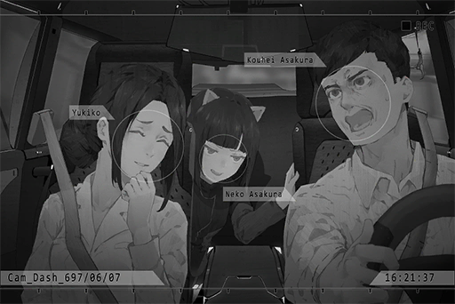

**Yukiko** 
Pffft... You weren't kidding. Your daughter really does know you very well.

**Neko** 
Teehee\~

**Yukiko** 
So, NEKO is good at cooking? I also like cooking a lot.

**Neko** 
For real? NEKO loves cooking too! Because it's something taught by mommy\~ Besides, it's so darn expensive eating out at Node 08!

**Yukiko** 
I agree. I too miss the cheap and tasty restaurants back in Node 03... However, work has been quite busy these days. I can't cook very often, so take\-outs are often the only option.

**Neko** 
Work too busy? Da\~\~\~ddy! Is it your fault!? Are you dumping all your work to her!? 
Drunkard! Couch Potato! Smelly Feet!

**Kouhei** 
Ummm... No, I didn't. NEKO, don't just blurt out things!

**Yukiko** 
Haha... You two are so close to each other.

_\[»»» Fast Forward»»»\]_

**Kouhei** 
We're here. This is the place, right? 
I'll come pick you up after the event is over.

**Neko** 
Gotcha\~! Hehe, NEKO is so hyped up about this!

**Kouhei** 
Be careful yourself when you're messing around here. Stay in contact.

**Neko** 
Uh\-huh! Bye\-bye, sis Yukiko\~ Don't forget our deal. Next time, when you visit NEKO's house, we can cook together!

**Yukiko** 
Of course. I'll look forward to that\~ Goodbye.

*\[Door Opens\]*

**Kouhei** 
She seems to like you a lot.

**Yukiko** 
Thank goodness...

_\[Signal Lost\]_

[*(Click here to go back to the top)*](#toc)

## <a id="naos006"/>\[#006\] Cam\_NL\_697\_11\_16
### Requirements
|Character|Level|
|---------|:---:|
|**Neko** |  4  |

### Log Content
**Kouhei** 
NEKO, wake up. It's two in the aftenoon already. You're going to meld with the bed at this point.

**Neko** 
Mmmm...Hmm? What? Today's a weekend... I still wanna sleep...

**Kouhei** 
No. There's something I need you to help with. Quick, wake up. 
Kenta, come here.

*\[Footsteps\]*

**Neko** 
......? 
Eh...? What is this all about?

**Kouhei** 
You've met him before, right? This is Yukiko's son, Kenta. Daddy need to visit the company offices with Yukiko to deal with some things. Can you take care of him for a short while?

**Kenta** 
......

**Kouhei** 
Kenta, this is big sister NEKO. You'll stay with her for the afternoon. We'll come back very soon, got it?

**Kenta** 
... (Nods)

**Neko** 
... NEKO haven't agreed to this, have I?

**Kouhei** 
NEKO, don't say that.

**Neko** 
These days, daddy and sis Yukiko... Nothing, forget it... 
All in all, NEKO has no idea how to take care of a three\-year\-old kid like him. You guys should find other ways to handle him...

**Kouhei** 
You just have to look over him for a little while. We'll return in a few hours.

**Neko** 
... Bet it's a date again, is it? Big liar...

**Kouhei** 
What did you say?

**Neko** 
Nothing! Do what ever you guys want. If you want to go out, do as you please.

**Kouhei** 
... Then we'll leave it to you.

*\[Door Opens\]*

**Neko** 
Arghhh! Stupid daddy! Smelly Feet! Big dumb liar...

**Kenta** 
......

**Neko** 
... W, what are you looking at? Go watch TV in the living room yourself. NEKO's gonna go back to sleep.

_\[»»» Fast Forward»»»\]_

*\[Glass shatters\]*

**Neko** 
YIKES!? 
What, what happened?

**Kenta** 
_\*Sobs\*... \*Cries\*\~\~_

**Neko** 
... Did you break the glass because you're trying to drink water? Are you hurt!? 
Oh god oh dear... D, don't cry...

_\[»»» Fast Forward»»»\]_

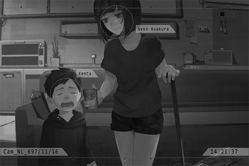

**Neko** 
Whew\~ All cleaned up. Don't come over here though. 
Here, water. You wanted water, right?

**Kenta** 
... (Nods)

**Neko** 
Thank goodness, you're not hurt... 
Man\~ Guess I can't just leave you alone. If you want something, just tell big sister, got it? If anything happens to you, it would cause a boatload of trouble!

**Kenta** 
... _\*Sniff\*_... (Nods)

**Neko** 
Ahhhh, come on, stop crying. You're a boy, aren't you?

**Kenta** 
... _\*Sniff sniff\*_... (Nods)

**Neko** 
Uwaaa... What a pain in the neck...... B, but, he's so adorable... 
Ah! Video games! Do you like video games? Big sister has a lot of fun games!

**Kenta** 
... Yes...

_\[»»» Fast Forward»»»\]_

**Neko** 
Ah, you have to jump here! That's it, that's it!

**Kenta** 
Haha! ! He fly away! Big sister is awesome!

**Neko** 
Hmph\~ of course I am! Alright, time for the next level!

*\[Door Opens\]*

**Kouhei** 
We're home... Ho? Looks like you guys are having a lot of fun.

**Yukiko** 
I'm relived... NEKO, thank you so much for taking care of him.

**Neko** 
... O, oh.

**Yukiko** 
Kenta, did you behave yourself?

**Kenta** 
Yes\~ Mama, look! Big sister is awesome! We are almost at the boss!

**Neko** 
... I'm done here, right? Since you guys are back now, NEKO will be heading out.

**Kenta** 
... Big sister?

**Kouhei** 
Where are you going at this time? It's almost dinner time.

**Neko** 
NEKO has some things to deal with, so I'll be eating out. You three can eat by yourselves... bye.

*\[Door Opens\]*

**Yukiko** 
...... 
Kouhei, I...

**Kouhei** 
No need to worry. She just so happens to be at that age. Give her some time.

_\[Signal Lost\]_

[*(Click here to go back to the top)*](#toc)

## <a id="naos007"/>\[#007\] Audio\_NL\_698\_07\_07
### Requirements
|Character|Level|
|---------|:---:|
|**Neko** |  5  |

### Log Content
*\[Door Opens\]*

**Kouhei** 
I'm home.

**Kouhei** 
......

**[Message]** 
_Didn't you say that you'll be home at six???

Dinner is in the fridge, NEKO will be sleeping first. Do not disturb

NEKO\#Φˋ︿ˊΦ_

**Kouhei** 
......

*\[Door Knock\]*

**Kouhei** 
NEKO, are you asleep?

**Neko** 
... I'm asleep.

**Kouhei** 
... I'm coming in.

**Neko** 
... From now on, if you're not coming back for dinner, at least tell me, ok? If that's the case, NEKO wouldn't bother cooking. What a waste of ingredients.

**Kouhei** 
I'm sorry...

**Neko** 
Anything else? If not, NEKO's gonna sleep.

**Kouhei** 
NEKO, daddy wants to discuss something with you.

**Neko** 
......

**Kouhei** 
Aren't you going to sit up and listen? It's something quite important.

**Neko** 
... Just tell me.

**Kouhei** 
Daddy... and Yukiko... 
might be getting married soon.

**Neko** 
HUH!?

**Kouhei** 
I want to discuss this with you. The hope is that starting next month, she and Kenta will move in and live together with us. The storage room will be cleared out so it can be Kenta's room.

**Neko** 
......

**Kouhei** 
NEKO should know already. Daddy and Yukiko... even though our relationship started out as just boss and subordinate, as time goes on, we gradually developed feelings for each other...

**Neko** 
......

**Kouhei** 
Yukiko and Kenta also like you a lot. If we live together, you wouldn't have to work so hard handling all the minute work in this house. It's better for you as well.

**Neko** 
......

**Kouhei** 
NEKO?

**Neko** 
... Does this even count as a discussion? You guys already made your decision, didn't you?

**Kouhei** 
No, NEKO lives in this house too. If you're not willing to, we will figure out other methods...

**Neko** 
That's not the point! This is marriage! What about mommy!?

**Kouhei** 
... NEKO, daddy and mommy are already...

**Neko** 
Besides, NEKO heard it last time. Sis Yukiko owes some people out there a lot of money, and daddy has been helping her regarding this issue, right!?

**Kouhei** 
......! 
Yes. It's debt left behind by her ex\-husband. She is in a tough situation too...

**Neko** 
Ha?? Daddy, are you stupid!? NEKO knew that! I also knew that you haven't send money back to mommy for a while now, haven't you!? Is this the reason why!?

**Kouhei** 
I...

**Neko** 
Have you never consider the possibility that she chose to be with you only for the money!?

**Kouhei** 
NEKO! Yukiko is not that kind of person! You knew that very well, didn't you!?

**Neko** 
... How would... NEKO know...

**Kouhei** 
......

**Neko** 
... In short, you guys already made the decision, right? Then what's NEKO gonna change?

**Kouhei** 
......

**Neko** 
Do whatever you please. That's all I have to say. NEKO's gonna sleep now.

**Kouhei** 
......

**Kouhei** 
...I'm sorry...

*\[Door Closes\]*

**Neko** 
NEKO is so dumb for coming to Node 08 with daddy...

_\[Signal Lost\]_

[*(Click here to go back to the top)*](#toc)

## <a id="naos008"/>\[#008\] Audio\_Asakura\_698\_08\_15
### Requirements
|Character|Level|
|---------|:---:|
|**Neko** |  6  |

### Log Content
*\[Door Opens\]*

**Yukiko** 
NEKO, welcome back.

**Neko** 
... Oh.

*\[Cutting Vegetables\]*

**Yukiko** 
Ah, you're eating at home tonight, right? We'll be living together from now on. I... I want to prepare a hearty dinner to show my appreciation.

**Neko** 
Oh... I see.

**Yukiko** 
......

_\[»»» Fast Forward»»»\]_

*\[Door Knock\]*

**Kouhei** 
NEKO, time for dinner. 
Yukiko made your favorite dish.

**Neko** 
NEKO... will be there in just a minute.

**Kouhei** 
Okay. We'll wait for you, then we can start.

**Neko** 
......

*\[Slaps face\]*

**Neko** 
... Sis Yukiko is a good person... It'll be alright... Just act normally...

_\[»»» Fast Forward»»»\]_

**Kenta** 
Ah, big sister, it's time to eat!

**Neko** 
I'm coming. Sorry for making you guys wait...

**Kouhei** 
? 
What's wrong? Take a seat.

**Neko** 
...... What is this?

**Yukiko** 
Ah, I want to try making the meat stew... I heard that this is your favorite dish, so I want to see if I can recreate that flavor... However, I'm not very good with sauces. The taste just doesn't feel right... Can you help me taste\-test it?

**Neko** 
... Sis Yukiko... How did you know about the meat stew?

**Yukiko** 
Eh? Why did you ask this all of a sudden...

**Neko** 
How did you know?

**Yukiko** 
Ummm, let me think... It was quite a while ago. Your father brought this huge pot of meat stew to share with us. He said he made it himself... Since it was really delicious, I asked him for the recipe...

**Neko** 
... Daddy, you took the meat stew NEKO help cooked...

**Kouhei** 
Ah... Because the ones I made are just inedible...

**Neko** 
That's mommy's recipe! How can you just give it away to some random stranger!?

**Yukiko** 
... Stranger...

**Kouhei** 
N, NEKO?

**Neko** 
Mommy's meat stew... it... it's the only way NEKO can still be connected to mommy... _\*Sniff\*..._

**Neko** 
You...... you...... Who gave you the right to cook this dish!?

**Yukiko** 
......!!

*\[Slams the table\]*

**Kouhei** 
NEKO! Yukiko made this for you out of goodwill! Apologize to her now...

**Neko** 
NEKO's not eating that!

*\[Hurried Footsteps\]*

**Kouhei** 
NEKO! Where are you going? Get back here!

*\[Slams door\]*

**Kouhei** 
......

**Kenta** 
Uwaaaaaa... big sister is mad...

**Yukiko** 
It's alright, Kenta, it will be alright... Kouhei, you should calm down too. I'm the one to blame. I didn't know this dish meant so much to her... _\*Sobs\*... \*Cries\*..._

**Kouhei** 
...... Yukiko......

_\[Signal Lost\]_

[*(Click here to go back to the top)*](#toc)

## <a id="naos009"/>\[#009\] Audio\_Arcade\_698\_08\_15
### Requirements
|Character|Level|
|---------|:---:|
|**Neko** |  7  |

### Log Content
**Neko** 
_\*Sniffs\*_

*\[Gunshot\]*

**[Arcade Shooter]** 
_Player Aub WIN!_

**Pedestrian A** 
Hahaha! You suck!

**Pedestrian B** 
Damnit! Another match!

_\[»»» Fast Forward 30 Minutes»»»\]_

**[Arcade Shooter]** 
_Player Aub WIN!_

**Pedestrian A** 
Ha, the result's not gonna change no matter how many times we play!

**Pedestrian B** 
Shut up! One more word and I'll shut you up physically!

**Neko** 
Hey... Could you guys not occupy the machine for so long? You've been playing for half\-an\-hour already.

**Pedestrian A** 
Huh!?... Who's talking? Oh! So it came from down there? 
Hey, it's getting late, brat. Shouldn't you be going home now?

**Pedestrian B** 
Yeah! Go home, midget! Bet you can't even hold the gun properly!

*\[Kick\]*

**Pedestrian B** 
Owwww! That hurt!

**Neko** 
Who you calling midget!? Stupid ugly a\*\*holes!

**Pedestrian A** 
You little brat... How dare you!?

**Neko** 
Eek! Let go of me!!

**Pedestrian A** 
Get over here!

_\[→Signal Switch\]_

*\[Things crashing\]*

**Neko** 
Eek!

**Pedestrian B** 
Little kids need to listen to adults and go home, get it?

**Pedestrian A** 
You're a bad, bad child\~ Lemme punch you in the face a few times; that'll teach you a lesson.

**Xenon** 
Hey! Stop it.

**Pedestrian A** 
Hah? Who the heck are you?

**Pedestrian B** 
Is this your kid?

**Xenon** 
...... No.

**Pedestrian A** 
Then this is none of your business!  
What, you wanna play hero? I advise you stay out of this or we'll beat yo a\*\* as well!

**Xenon** 
... That's if you guys can beat me in the first place.

**Pedestrian A** 
Ha? You wanna pick a fight!?

*\[Punch\]*

**Pedestrian B** 
Ha! He's so weak! Look at how far he flew\~!

**Pedestrian A** 
Hey\~? Are you alright? Aren't you trying to be a hero? You can't be one if you suck so bad! Hahaha!

**Xenon** 
......

*\[Motorcycle engine\]*

**Pedestrian B** 
... Hey! Isn't that your bike!?

**Pedestrian A** 
The f\*\*\*! Why did it start itself!? Quick, don't let it get away!!

*\[Hurried Footsteps\]*

**Xenon** 
Whew... 
Are you alright?

**Neko** 
_\*Sniff\*..._

**Xenon** 
It's dangerous for a child to wander around alone this late...

**Neko** 
Who are you calling child!? I don't need your care! Who are you?

**Xenon** 
... Hey, I did help you out, didn't I? Couldn't you at least say thank you?

**Neko** 
When have I ever asked for your help? Nosy idiot... Taunting people when you can't win, pfft, LAME\~

**Xenon** 
......

**Neko** 
Go away! NEKO's going home! _\*Sniffs\*..._

**Xenon** 
……NEKO？

_\[Signal Lost\]_

[*(Click here to go back to the top)*](#toc)

## <a id="naos010"/>\[#010\] Cam\_Velvet\_698\_10\_06
### Requirements
|Character|Level|
|---------|:---:|
|**Neko** |  8  |

### Unlocked Charts
|    Song    |Character|Diff.|Level|
|------------|:-------:|:---:|:---:|
|**一啖兩啖**|  Neko   |Easy |  3  |
|**一啖兩啖**|  Neko   |Hard |  7  |
|**一啖兩啖**|  Neko   |Chaos| 11  |

### Log Content
**Neko** 
Li\~n\~da\~ Chan!

**Linda** 
Why did you arrive so late?

**Neko** 
Well\~ I ran into some small issues at my part\-time job... You changed your hair color! It's so stylish!

**Linda** 
Yeah, I got tired of the previous color. NEKO, do you want to try it yourself? My hair designer is really, really good.

**Neko** 
Sure\~ Once NEKO get my salary, I can go get my hair dyed!

**Linda** 
Ah, the food is here. Since you're late, I ordered for you.

**Neko** 
Woah\~ All stuff NEKO likes! I expect no less from Linda\-chan!

**Linda** 
Haha, let's finish this quickly, or else we're gonna miss the performance.

_\[→Signal Switch\]_

**Linda** 
All the bands in the lineup today are ones we've never seen before. I'm so hyped!

**Neko** 
Yeah\~ NEKO is super excited!

**Linda** 
Especially this opening band Xenon; heard that this is the fastest rising new band right now!

**Neko** 
Xe... non? How do you pronounce it? NEKO is terrible with weird words like this...

*\[Audience cheers\]*

**Linda** 
Oh! It's about to start!

**Neko** 
Woah, everyone is wearing helmets! That is so cool!

*\[Music\]*

**Neko** 
Uwaa! WAAAAA! &^\*%(%(%(\#)!!!!

**Linda** 
WOW...!

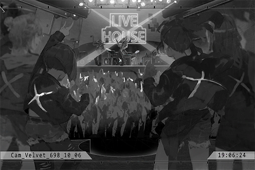

_\[»»» Fast Forward 2 Hours»»»\]_

**Neko** 
Waaaaaa! I'm so glad that I decided to come to this performance! NEKO is so satisfied!!

**Linda** 
Yeah, even though all the performers are new bands, everyone is great. Especially...

**Neko** 
The opening band! Xenon! That scream! That guitar! OH MY GODDD\~ NEKO literally can't control myself right now!

**Linda** 
Stop jumping around. It's so embarrassing... However, he really was impressive. It's very rare for a band to be this good this early into their establishment. Every instrument was given its moment to shine and not a single one was ignored. The balance is phenomenal.

**Neko** 
Yes, I agree! Back during the performance, there are multiple times where NEKO was thinking whether to join the circle pit or not! But it feels kinda scary...

**Linda** 
Haha, NEKO you're too crazy. I personally prefer sitting in the back rows and focus on listening to the music. 
Ah, but I noticed something. Don't you feel like his arrangments are quite similar to CP's previous works? Particularly the guitar solo sections.

**Neko** 
Now that Linda\-chan mentions it... they do sound a bit similar! You noticed this immediately, that's amazing! Hardcore fan indeed!

**Linda** 
Don't flatter me like that, I'll get flustered... 
... However, you're right about me being a hardcore fan. I miss CP so much.

*\[Ringtone\]*

**Linda** 
Ah, you have a call...

**Neko** 
Ugh...

*\[Phone shutting down\]*

**Linda** 
NEKO... that was your dad, right?

**Neko** 
Yeah, but NEKO doesn't want to answer it. Stupid daddy...

**Linda** 
... You guys got into an argument again? Did something happen recently...?

**Neko** 
...... 
Linda\-chan... Sorry about this, but can I sleep at your house tonight? If I go back now, we're just gonna resume arguing again.

**Linda** 
...... 
You can, but just to give you a heads\-up, my bed is a single bed.  
Well, since you're so small, we should be able to fit inside...

**Neko** 
Thank you...

**Linda** 
Also, you should still send them a message telling them about this, right?

**Neko** 
Yes... 
Thank you, Linda\-chan. I'm so grateful to know you! Lend me your clothes, NEKO needs to wipe off her tears. Wahhhh...

**Linda** 
Haha, stop it. Your fake crying is so bad. 
Let's go.

_\[Signal Lost\]_

[*(Click here to go back to the top)*](#toc)

## <a id="naos011"/>\[#011\] Cam\_76St\_698\_11\_02
### Requirements
|Character|Level|
|---------|:---:|
|**Neko** |  9  |

### Unlocked Charts
|   Song   |Character|Diff.|Level|
|----------|:-------:|:---:|:---:|
|**Mammal**|  Neko   |Easy |  4  |
|**Mammal**|  Neko   |Hard |  9  |

### Log Content
**Neko** 
Ugh\~ this sucks. Why does it rain so much these days... Man, even my dinner is all soaked!

**Cat** 
Meow\~

**Neko** 
Eek!? What is that noise?

**Neko** 
Ah, a little kitten... 
Why is it hiding here? Did someone abandon it?

**Cat** 
Meow...

**Neko** 
Poor little fella... Wanna eat this?

**Cat** 
Meow...

_\[»»» Fast Forward»»»\]_

**Cat** 
Meow\~

**Neko** 
Is it tasty? No need to hurry. Take your time. 
You don't have a chip collar... We won't be able to find your owner without that...

**Neko** 
If left in this rain, it'll catch a cold... Also, stray animals without chips will be taken away by the admins... what should I do?

**Agent** 
Little girl, what are you doing, kneeling down in an alleyway? In this massive downpour too.

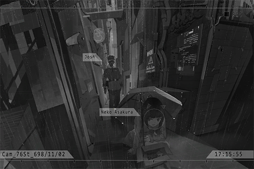

**Neko** 
Yikes! Crap... I was just saying...

**Agent** 
Little girl? Please turn around.

**Neko** 
Ah... NEKO... No, I'm not feeling so well...

**Cat** 
Meow\~

**Neko** 
Ah... Shhhh! You'll be taken away!

**Agent** 
... What's that noise? Is it a cat?

*\[Hurried Footsteps\]*

**Xenon** 
......? 
It's you... what are you doing?

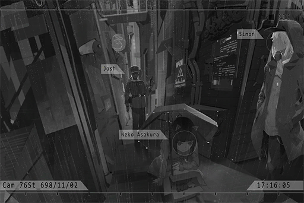

**Neko** 
Ah! This person! This person was trying to molest me!

**Xenon** 
......

**Agent** 
What!? Is that true!?

**Neko** 
Ahhhhh... What the hell am I talking about...

**Xenon** 
...... 
Yes. I was going to ask her for directions, but my hand accidentally touched her chest. It really was an accident.

**Neko** 
... Eh?

**Agent** 
... Sir, please come over here for the scanning procedure. 
This is Quadrant III, 76th street, an alleyway next to the Game Center. There's a report about a suspected sexual harassment incident. Please send LE\-112A drones for support.

**Xenon** 
Take it and leave, now.

**Neko** 
Eh? Ah... got it.

*\[Hurried Footsteps\]*

**Agent** 
Ah! She ran away! So you were indeed molesting her!?

**Xenon** 
I told you it was an accident...

**Agent** 
Don't move! Stand still and let me scan you.

**Xenon** 
......

*\[ID Scan\]*

**[Scanner]** 
_Unable to detect target. Please scan again._

**Agent** 
Eh? Sir, please stand still!

**Xenon** 
I am standing still. That thing's broken, isn't it?

_\[Signal Lost\]_

[*(Click here to go back to the top)*](#toc)

## <a id="naos012"/>\[#012\] Audio\_Velvet\_698\_11\_19
### Requirements
|Character|Level|
|---------|:---:|
|**Neko** | 10  |

### Unlocked Charts
|   Song   |Character|Diff.|Level|
|----------|:-------:|:---:|:---:|
|**Mammal**|  Neko   |Chaos| 14  |

### Log Content
**[Xenon-V]** 
_That's it for tonight's performance! Thank you for coming!_

*\[Audience cheers\]*

_\[»»» Fast Forward»»»\]_

**Linda** 
Xenon was so cool! That performance was so good!

**Neko** 
No kidding\~

**Linda** 
Ah, the bus service is almost ending. We better get moving.

**Neko** 
Ummm... NEKO wants to stay here a bit longer. Linda\-chan, you can go back first.

**Linda** 
Eh? This place will become a bar very soon...

**Neko** 
NEKO will leave before 12:00 am, so no need to worry\~

**Linda** 
Alright... be careful yourself. If you wander around outside past midnight, drones and law enforcement agents will start to harass you.

**Neko** 
I know, I know\~

_\[»»» Fast Forward»»»\]_

**Xenon** 
Hi, milk.

**Bartender** 
Gotcha.

**Neko** 
Hellloo! Mister pervert!

**Xenon** 
... You again?

**Neko** 
What? Why the distasteful look!

**Xenon** 
... Because every time I run into you, I get caught up in some random crap. 
What are you doing here at this time? Aren't you afraid of being caught?

**Neko** 
NEKO was here to see you perform!

**Xenon** 
...... Eh?

**Neko** 
You're Xenon, right? On top of that! You were also Simon from CP! NEKO knew it! No wonder your face seemed so familiar!

**Xenon** 
......

**Bartender** 
Haha, getting recognized by fans again? Told ya; with that long hair of yours, the helmet won't do a thing.

**Xenon** 
Shut up... so what if I am? It's not like I'm going out of my way to hide this information.

**Neko** 
WOW! Right on the money! This is not public knowledge yet, isn't it? That Simon is Xenon! This is big news!

**Xenon** 
It's not that big of a reveal... Also, keep your voice down...

**Neko** 
Why didn't you just continue using the name "Simon"? Your music will be so much more popular! Right now, your popularity is not even half of what CP used to have.

**Xenon** 
... CP has already disbanded. The public has too many imaginations about it that are not related to music. I want a complete restart; a simple focus on music alone. That's all.

**Bartender** 
This bulls\*\*\* reasoning again...

**Neko** 
He\~? Is this the reason behind the disbandment?

**Bartender** 
Haha... Little girl, just give up. He's not gonna talk.

**Neko** 
Who you calling little girl!? NEKO is already 16!

**Xenon** 
... On a side note, that cat last time, what happened afterward?

**Neko** 
Ah, it's still in NEKO's room... But NEKO's house doesn't have a pet registration, and there's someone who's allergic to cats... Right now, I'm pretty much just raising it in secret. So troublesome\~\~\~

**Xenon** 
... I do know someone who might be able to adopt it, but that dude already has a dog...

**Neko** 
Really!? Can you please ask him?

**Xenon** 
Alright. I'll ask.

**Neko** 
You're my savior\~ Or else NEKO's gonna get busted by my family anytime soon... 
Let's exchange iM so we can better communicate with each other!

**Xenon** 
Sure.

*\[iM exchange\]*

**Neko** 
Yeah\~ Xenon's iM get!

**Xenon** 
... Don't send it to some random stranger.

**Neko** 
No worries, I won't! NEKO is very good at keeping secrets\~ Oh, and NEKO won't spill the secret that Xenon is Simon as well!

**Xenon** 
Aren't you spilling it right now...?

_\[Signal Lost\]_

[*(Click here to go back to the top)*](#toc)

## <a id="naos013"/>\[#013\] Audio\_Neko\_698\_11\_24
### Requirements
|Character|Level|
|---------|:---:|
|**Neko** | 11  |

### Log Content
*\[Hurried Footsteps\]*

**Neko** 
Ha...... Ha...... Sorry, I'm a little late.

**Xenon** 
What "a little"... You're the one that said 09:30, right? It's already 10:12 now.

**Neko** 
Muuuu\~ This is not the respond NEKO was hoping for...

**Xenon** 
Where's the cat?

**Neko** 
Ah, it's here\~ NEKO even bought some expensive cat food for it...... They are all here.

**Cat** 
Meow\~

**Xenon** 
Good. Give it to me. 
Then, I'll be taking my leave.

**Neko** 
... Ha!? What do you mean by that?

**Xenon** 
......? 
I'm taking the cat to my friend. What else do you think I'm going to do?

**Neko** 
NEKO took a really\~\~ long trip here! Yet you just took it and left? That's NOT how you do things! At least let NEKO see who are you giving the cat to!

**Xenon** 
... Fine, fine; do as you please. 
I have to warn you now though. We're going to a bar, so you can only stay outside.

**Neko** 
A bar? Are you sure that's okay...?

**Xenon** 
Rest assured, the owner is a good person, I think.

_\[»»» Fast Forward»»»\]_

**Neko** 
Nah\~ are we not there yet? NEKO's feet are aching...

**Xenon** 
Almost there.

**Neko** 
This bar owner you mentioned, is he okay? Can we really trust him to take care of the cat?

**Xenon** 
Hmm? Did I not tell you about this? He's not adopting the cat himself. We're just temporarily leaving it with him. He'll find a owner who is capable of taking care of it. Shouldn't take long; he has a lot of connections.

**Neko** 
I see... 
Oh, and another thing. Why don't we just meet up there? Why do we have to walk all the way from the station...

**Xenon** 
I didn't know that you're coming along as well... Besides, the bar's surrounding area is quite dangerous at night.

**Neko** 
So even Node 08 has dangerous places?

**Xenon** 
In places where regular folks don't usually visit? Yes.

**Neko** 
Compare to where NEKO lived when I was little, this is already much better.

**Xenon** 
You're from Node 03, right? I've heard rumors about the terrible public security there.

**Neko** 
Nonetheless, NEKO only lived there until I was eight. I don't remember much about my life there. The only thing I remember is that daddy and mommy often had arguments about daily life.

**Xenon** 
Then Node 08 just might be a tad bit better... yet it is still far from ideal. Thugs, like the ones who harassed you that day, are still everywhere.

**Neko** 
Ah, speaking of that! NEKO has always been wanting to ask; you were on the verge of getting your butt kicked, right? Then their bike just started driving itself for some reason... Also, that time when you were mistaken as a molester by the law enforcement agent, you got away safely that time too, didn't you? How did you do that?

**Xenon** 
Hmm... some minor skills. I work at A.R.C., so I know a few things about programming and coding.

**Neko** 
Eh!? You serious? How is that possible? How old is Xenon now?

**Xenon** 
Twenty\-two.

**Neko** 
So young! And you're already working at A.R.C!? Yet another big news...

**Xenon** 
It seems like everything is big new to you... Speaking of age, last time, you brought up that you were 16?

**Neko** 
Yep.

**Xenon** 
You shouldn't wander around on the streets this late into the night. Your family will be worried.

**Neko** 
......

**Xenon** 
... Are you having trouble with your family?

**Neko** 
Eh? Yeah... how did you know?

**Xenon** 
Just a guess... then I'll leave it at that. Nevertheless, Node 08 at night is not as safe as you imagined. You're a girl after all; you should be more careful yourself.

**Neko** 
Ok, ok\~ So turns out that Xenon is the type who lectures people a lot...

**Xenon** 
Shut it... we're here.

*\[Music\]*

**Neko** 
JOZ......Cafe? 
Ho\~? A music bar, eh? Feels really nice.

**Xenon** 
You can go in when you are 20. 
Wait here. I'll go bring him out here.

**Neko** 
Hmph! Always treating NEKO like a child...

_\[Signal Lost\]_

[*(Click here to go back to the top)*](#toc)

## <a id="naos014"/>\[#014\] Cam\_Asakura\_698\_12\_18
### Requirements
|Character|Level|
|---------|:---:|
|**Neko** | 12  |

### Unlocked Charts
|   Song   |Character|Diff.|Level|
|----------|:-------:|:---:|:---:|
|**Blah!!**|  Neko   |Easy |  4  |
|**Blah!!**|  Neko   |Hard |  8  |
|**Blah!!**|  Neko   |Chaos| 14  |

### Log Content
*\[Door Opens\]*

**Neko** 
They should be already asleep, right...?

**Kouhei** 
NEKO? Is that you?

**Neko** 
Wah! Crap...

**Kouhei** 
... Woah! What's with the clothes you're wearing?

**Neko** 
... What?

**Kouhei** 
We haven't seen you for days, and you come home looking like this!?  
Coming home at this hour, where were you all this time!?

**Neko** 
You done? NEKO is gonna sleep.

**Kouhei** 
Wait, what's with the attitude? Come here; daddy needs to have a talk with you.

**Neko** 
What is there to talk about!?

**Kouhei** 
Plenty to talk about. 
You're secretly owning a cat in your room, aren't you? Didn't I tell you that Yukiko is allergic to cats?

**Neko** 
So what? I gave it away a long time ago.

**Neko** 
Yukiko, Yukiko... everything is about Yukiko. So damn annoying...

**Yukiko** 
Kouhei? Is NEKO back?

**Kouhei** 
Ah, Yukiko, sorry for waking you up...

**Neko** 
... Ah, right. You guys are sleeping together now. 
NEKO is very tired. If you want to talk, we'll talk tomorrow. I'm going back to my room.

**Kouhei** 
Did you go out with that Linda again?

**Neko** 
... And what does that have to do with you?

**Kouhei** 
What? You are not allowed to go out with her again! From now on, after classes are over, you come home directly! It's all those band stuff that turned you into the mess you are and taught you all this nonsense! From now on, you are not allowed to see any performance again!

**Neko** 
Ha? Come home for what!? See you two act so lovey\-dovey together!? Eww, gross!

**Yukiko** 
......

**Kouhei** 
What is with your attitude... who taught you that!? It's Linda, isn't it? Is this how she treats her parents back at her home too!?

**Neko** 
OK, that's it! Who do you think you are, a psychic!? Linda is not that kind of person!

**Yukiko** 
Ok, ok, that's enough! Both of you, calm down...... Kouhei!

**Kouhei** 
......

**Neko** 
......

**Yukiko** 
NEKO, please don't be angry. Kouhei didn't say that on purpose. We don't really understand young people... It's not like what you're doing is bad; we're just very worried about you...

**Neko** 
Worried? No need for that. You and Kenta are already plenty enough for him to worry about, right?

**Yukiko** 
......

**Neko** 
Who didn't know that you reached out to this home for the money?

**Kouhei** 
NEKO！！

**Neko** 
What!? Am I wrong? NEKO knew all of it already!

**Yukiko** 
NEKO... that's really not the case! I'm very grateful to your father for helping me with my money problems. However, even without that, I still truly love him. I truly want to be a part of this family...

**Neko** 
HA!? Ewwwww! If you just want the money, then stop trying to act like a mother!...  You disgusting whore!!

**Yukiko** 
......!!

*\[Vase Shatters\]*

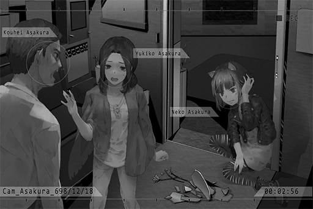

**Neko** 
Ouch......!

**Kouhei** 
APOLOGIZE TO HER RIGHT NOW, NEKO!

**Yukiko** 
Kouhei! Don't do this! NEKO, are you hurt...

**Kouhei** 
How dare you talk to me about money! Do you know how much money I spend to raise you!? And what do you do with my money? You waste it on dying hair, messing around, and buying these nonsensical clothes! Is this how you repay me!?

**Neko** 
NEKO... made that money... with my part\-time job... 

**Kouhei** 
What part\-time job!? The one where you abandoned your studies for!? Very well, if you're so good, I will no longer give you a single penny! If this home is so worthless to you, then leave! GET OUT!

**Neko** 
......!

*\[Hurried Footsteps\]*

*\[Slams Door\]*

**Kouhei** 
Fine! Go! Don't you dare come back again!

**Yukiko** 
Kouhei! Stop it! Go after her, quick! Where did you expect her to go at this time of the night!?

**Kouhei** 
No need!

**Yukiko** 
... NEKO was so angry because of me, so maybe I'm not qualified to say this... 
But, for the sake of defending me, you choose to lose NEKO... lose your only family member. Do you really believe that is the right thing to do?

**Kouhei** 
......

_\[Signal Lost\]_

[*(Click here to go back to the top)*](#toc)

## <a id="naos015"/>\[#015\] Audio\_Arcade\_698\_12\_18
### Requirements
|Character|Level|
|---------|:---:|
|**Neko** | 13  |

### Log Content
**Neko** 
Are you sure that you can't...?

**[Linda]** 
_Sorry... I really can't help you out today..._

**Neko** 
Ah\~\~ Not just today. NEKO might be without a place to live from now on...

**[Linda]** 
_Eh? What happened?_

**Neko** 
Got kicked out by daddy... No, NEKO ran away.

**[Linda]** 
_What!? Why!?_

**Neko** 
Well... all in all, NEKO will figure out a way. Thanks.

**[Linda]** 
_The more I hear, the more concerned I get! Where are you now? The Game Center?_

**Neko** 
Uh\-huh... Don't worry about it! NEKO will be alright!

**[Linda]** 
_Linda! Are you on the phone with NEKO? Her family just called; where is she now?_

**Neko** 
Wah! Is that your mom? Don't tell them where NEKO is no matter what! That's it! Bye\-bye!

**[Linda]** 
_Ah, wa..._

_\[Call Ends\]_

**Neko** 
... What should I do now? The rain is pouring... so I can't go outside either. 
Forget about it. Guess I'll play a few rounds first...

_\[»»» Fast Forward to A.M. 01:41:28»»»\]_

**[Arcade Shooter]** 
_Player NEKO\#ΦωΦ WIN! NEW RECORD!_

**Neko** 
Yeah! Another new record!

**Xenon** 
...... Hey.

**Neko** 
... Xenon!? Why are you here?

**Xenon** 
Isn't that my question? Do you realize what time it is?

**Neko** 
......

**Xenon** 
Have you forgotten what I told you before? Go home.

**Neko** 
...... No.

**Xenon** 
... I'm not messing with you. The drones' patrol routes will reach here later. If you're still here by that time, things are going to get messy.

**Neko** 
_... \*Choking up\*..._

**Xenon** 
Ummm... Are you crying?

**Neko** 
ARGHHHH!! Let's have a match right now!

**Xenon** 
... Ha?

**Neko** 
A match with this! If you beat NEKO, NEKO will go home! If NEKO wins, you leave me alone and let me do whatever I want!

**Xenon** 
Hey, enough is en...

**Neko** 
Are you scared!?

**Xenon** 
... Fine, just one.

_\[»»» Fast Forward»»»\]_

**[Arcade Shooter]** 
_Player NEKO\#ΦωΦ WIN! NEW RECORD!_

**Neko** 
NOICE!

**Xenon** 
... Seriously? So you're the "NEKO\#ΦωΦ" on this high\-score ranking?

**Neko** 
Hmph\~ How is it? NEKO won!

**Xenon** 
Yeah... I lost.

**Neko** 
Therefore...... 
... le, let NEKO go to your home!

**Xenon** 
...... Haa??

**Neko** 
Xenon lives alone, right?

**Xenon** 
... Do you know what you're talking about? My place is a workshop. It doesn't even have a place for you to sleep.

**Neko** 
NEKO doesn't want to go home. The rain is pouring outside; are you planning to leave NEKO here all by myself?

**Xenon** 
Hey, I'm serious about...

**Neko** 
... T, the one who won was NEKO, right?

**Xenon** 
......

**Neko** 
The drones' patrol routes will reach here later, right?

**Xenon** 
......

_\[Signal Lost\]_

[*(Click here to go back to the top)*](#toc)

## <a id="naos016"/>\[#016\] Cam\_Studio\_698\_12\_18
### Requirements
|Character|Level|
|---------|:---:|
|**Neko** | 13  |

### Unlocked Charts
|  Song  |Character|Diff.|Level|
|--------|:-------:|:---:|:---:|
|**リラ**|  Neko   |Easy |  4  |
|**リラ**|  Neko   |Hard |  8  |

### Log Content
*\[Door Opens\]*

**Neko** 
Wow! This is a nice workshop!

**Xenon** 
It's alright. 
Hey, your hands are still wet, so don't touch anything. Here, towel.

**Neko** 
Okay\~ 
This really is a workshop. Where do you sleep?

**Xenon** 
On the couch you're sitting on right now. You can sleep on it tonight. Let's get things straight first. The first thing we do tomorrow morning is escort you home...

**Neko** 
Wow\~ It's PAFF's album. NEKO also has one!

**Xenon** 
Not listening at all...

**Neko** 
Woah! A Kurg synthesizer! This model was just released last month!

**Xenon** 
Yeah. Bought it a while ago, but I still haven't quite figure out how to use it yet.

**Neko** 
Can NEKO try it out?

**Xenon** 
I don't mind... do you know how to use it though?

*\[Synthesizer\]*

**Neko** 
Hmmmm, so good! This sound is so good! The new modulation is awesome!

**Xenon** 
... Not bad. You played with synthesizers before?

**Neko** 
Yep, although NEKO only has a digital version back at home.

*\[Optic guitar activation\]*

**Neko** 
Hawawa! What is that!? So cool!

**Xenon** 
I made this. I'm still testing it out, therefore it doesn't have a name yet... probably something like the "Optic guitar"?  
You wanna have a quick Jam?

**Neko** 
Absolutely! Bring it!

_\[»»» Fast Forward»»»\]_

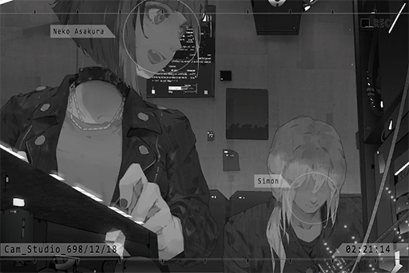

**Neko** 
Man\~ that was fun! I never thought I could Jam with Xenon!

**Xenon** 
I'm quite surprised myself as well. I didn't know that you compose music.

*\[Ringtone\]*

**Neko** 
......

*\[Phone shutting down\]*

**Xenon** 
... What's wrong?

**Neko** 
... Family member.

**Xenon** 
You... ran away from home, didn't you?

**Neko** 
......

**Xenon** 
I can tell by just looking at you. I did something similar in the past too. 
Does it have something to do with them opposing your music interests?

**Neko** 
No... Actually...

_\[»»» Fast Forward»»»\]_

**Xenon** 
I see... Therefore, you suspected that Yukiko only got close to your father for his money?

**Neko** 
... I don't know... 
On top of that, NEKO couldn't accept her, because she is not mommy... 
Yet daddy is adoring her like a fool...

**Xenon** 
... Back when I was around your age, I also left home for a while due to some personal stubbornness. 
Now when I look back at it, that was the most worthwhile, as well as the most regrettable decision I ever made in my life.

**Neko** 
... What do you mean?

**Xenon** 
No, nothing... 
In short, you're at the age where you more or less want your values to clash with your surroundings or even with society. That itself is not an issue; however, the important thing is to learn a lesson from the decisions you made. What you shouldn't do is treat these decisions as mere ways to run away from an undesirable situation.

**Neko** 
......

**Xenon** 
After all, from what I've heard, your family still loves you very much. That alone makes you so much luckier than many others. Don't make them worried.

**Neko** 
Okay.... it feels like Xenon is lecturing people again...

**Xenon** 
Sorry, that's just how my personality is. You don't have to listen to me.

**Neko** 
It's fine. NEKO was previously a bit lost. Now, after hearing you talk, I have a better idea about what to do now.

**Xenon** 
Is that so?

**Neko** 
Despite that, NEKO still feels that even if I calm down now, I still don't quite know how to face it. Perhaps a temporary leave from home is better for all of us.

**Xenon** 
... Would you be alright?

**Neko** 
Rest assured! NEKO has some money saved up from my part\-time job and selling my singles online. If I continue down this road, I should be able to make a living by myself. Ah, but before I can find a place to live, NEKO will be crashing at your workshop!

**Xenon** 
Hey, I didn't agree to this...

**Neko** 
Ah! Look! "Monophonic Entertainment" is looking for music arrangers! Isn't this PAFF's company!? Seems legit!

**Xenon** 
Not listening at all...

_\[Signal Lost\]_

[*(Click here to go back to the top)*](#toc)

## <a id="naos017"/>\[#017\] Audio\_Mono\_698\_12\_19
### Requirements
|Character|Level|
|---------|:---:|
|**Neko** | 14  |

### Log Content
*\[Notification\]*

**[PC]** 
_Chris Pinkman, you have a new voice mail._

**Chris** 
Another one? It has been so busy since we announced the public audition... 
Sighs\~ and I have to deal with Sis Helena and her loads of demands...

**Chris** 
Lemme see... Neko Asakura, 17 years old... What a weird name.... Hoho! She is cute! 
Play voice mail.

**[PC]** 
_Playing audio attachment from Neko Asakura._

**[Neko]** 
_Hello hello\~ This is NEKO. NE, KO\~ NEKO saw on iM that you guys are recruiting arrangers, right? NEKO is interested! Listen to NEKO's work! Then reply to NEKO! 
OVER!_

**[PC]** 
_Replay complete._

**Chris** 
...... 
Hmm, huh? That's it? Where's the work?

*\[Notification\]*

**[PC]** 
_Chris Pinkman, you have a new voice mail. 
Playing audio attachment from Neko Asakura._

**[Neko]** 
_Hello hello\~ NEKO again! NEKO forgot to attach the work! Ahahaha! Gimme a minute! OVER!_

**[PC]** 
_Replay complete._

**Chris** 
......

**Chris** 
So.... where the heck is the work? Also what's with the OVER thing...

*\[Notification\]*

**[PC]** 
_Chris Pinkman, you have a new voice mail._

**Chris** 
......

**[PC]** 
_Playing audio file: 
《Sunday\_Night\_Blue\_Demo》_

*\[Music\]*

**Chris** 
... Hoho! Interesting! Is she really just 17? There's a very good chance this will sell like hotcakes!

**Chris** 
Wait a second... Hehehe, I just thought of a great group... Better go ask sis Helena now!

_\[Signal Lost\]_

[*(Click here to go back to the top)*](#toc)

## <a id="naos018"/>\[#018\] Audio\_Mono\_698\_12\_28
### Requirements
|Character|Level|
|---------|:---:|
|**Neko** | 14  |

### Unlocked Charts
|  Song  |Character|Diff.|Level|
|--------|:-------:|:---:|:---:|
|**リラ**|  Neko   |Chaos| 12  |

### Log Content
*\[Door Opens\]*

**Neko** 
Morning\~ Hello everyone, NEKO is here!

**Chris** 
Umm, you're almost ten minutes late... Also, it's already the afternoon, not morning.

**Neko** 
You're so noisy. PAFF is not here either. 
We're discussing the arrangements with her today, right? I'm so excited\~

**Chris** 
About that, A... Miss PAFF will not be coming today.

**Neko** 
Not coming!? WHY??

**Chris** 
She had a schedule conflict... Wait, didn't I mention this on the notification? 
Let me introduce to you. This is sis Helena. She'll be discussing the details about this arrangement collaboration with you.

**Helena** 
Nice to meet you, Miss Asakura. I'm Helena Black. I'm PAFF's agent.

**Neko** 
Ah, greetings! You don't have to refer to NEKO by my last name. You can just call me NEKO! 
Waaaa, my first time seeing a real agent! You're so beautiful!

**Chris** 
Eh, so I don't count...?

**Helena** 
... Haha, hello NEKO. 
Apologies, PAFF has a filming scheduled today, so she couldn't come. Later today I'll have her write you a mail to say hello to you.

**Neko** 
No problem, no problem! Wow, super idol indeed! I'm more and more excited about this collab! 
Sis Helena, if we have the opportunity, can I meet her? The real PAFF must be so sweet and tasty. Slurp\~ Muhaha\~

**Chris** 
Why does that sound a bit dangerous...

**Helena** 
Haha, that is certainly doable. 
Then, regarding this collaboration, I would like to know more about NEKO's creative style and methods...

**Neko** 
No problemo! NEKO brought a lot of unannounced DEMOs today. Enought for a whole album collab!

**Helena** 
Good to hear that. Let's start our discussion right away. Here, take a seat.

**Neko** 
Sure! Thank you, sis Helena!

**Chris** 
Ummm... what about me?

**Helena** 
Get two coffees from the beverage counter. 
I'll have the usual, double Espresso, black.

**Neko** 
NEKO want a ice caramel macchiato, light ice. No mixing though, or you drink it yourself.

**Chris** 
...... 
OK......

_\[Signal Lost\]_

[*(Click here to go back to the top)*](#toc)

## <a id="naos019"/>\[#019\] Audio\_Mono\_699\_04\_12
### Requirements
|Character|Level|
|---------|:---:|
|**Neko** | 15  |

### Log Content
_\[Call Starts\]_

**[Neko]** 
_Hi hi, NEKO here\~_

**Chris** 
What "HI hi"? You messed up big time! You need to delete that post on iM right away!

**[Neko]** 
_Eh\~? What's the deal this time..._

**Chris** 
About the collab single with company T a while ago, they haven't even announced it yet. Why did you post it on your own iM already!?

**[Neko]** 
_Eh\~? I can't? That's a collab song with NEKO, isn't it? Why can't NEKO post it?_

**Chris** 
Idiot! That collab song has a contract! We are required to cooperate with the promotion schedule. What makes you think you can just go off\-track like that?

**[Neko]** 
_Muuu\~ but deleting something already posted feels really weird..._

**Chris** 
That's your problem... In short, delete it now, before things get really messy!

**[Neko]** 
_Ok, ok. Then exactly when can I post it?_

**Chris** 
We send you the promotion schedule whenever we have a meeting. You didn't read any of them, did you?

**[Neko]** 
_What a pain in the neck... Why are there so many weird rules in the company? NEKO made that song..._

**Chris** 
What's weird about that... Speaking of iM, I advise you stop gossiping about other artists on it. You didn't even keep them anonymous...

**[Neko]** 
_NEKO did not do that!_

**Chris** 
But you totally did! Some artists are already filing complaints to us. If it's company information, try your best to not leak it. Please keep yourself under control online as well. Have you forgotten about the previous plagiarizing incident...

**[Neko]** 
_Haaa!? Isn't he the one who plagiarized NEKO!? NEKO's Demo was composed last year; he just announced it earlier! The incident was a thing because too many people don't know what the hell they are talking about! 
Besides, if we get to the bottom of this, we got our materials from the same sample pack. Plagiarism my a\*\*..._

**Chris** 
You can't expect an average person to know that, can you...? 
Regardless, pay more attention to what you do. If this keeps happening, it makes it hard for me to promote you...

**[Neko]** 
_NEKO don't really give a damn about that promotion stuff. It's not like NEKO actually want to be an artist or something. As long as I get the money for my music, I'll be fine._

**Chris** 
......

**[Neko]** 
_If you don't have anything else to say, NEKO will go back to work. I'm arranging PAFF's song now; need to focus! Byebye\~_

_\[Call Ends\]_

**Chris** 
... Sighs\~ how troublesome...

_\[Signal Lost\]_

[*(Click here to go back to the top)*](#toc)

## <a id="naos020"/>\[#020\] Cam\_Shiraishi\_699\_04\_20
### Requirements
|Character|Level|
|---------|:---:|
|**Neko** | 16  |

### Log Content
*\[Door Opens\]*

**Neko** 
Mommy! Grandma! NEKO is back\~

**Mayu** 
Wow\~ NEKO, is that you!?

**Saku** 
NEKO!? What did you come back all of a sudden!?

**Neko** 
Hehe\~ I bought the ticket the moment I saved up enough money! I want to give you two a big surprise!

**Saku** 
You child... how could you not tell us that you're coming back! 
Mommy will go clear out your room now.

**Neko** 
Eh\~ You don't need to do that. NEKO will be going back the day after tomorrow. I still have work to do.

**Saku** 
We're just about to eat dinner. Need to cook your share now.

**Neko** 
......

**Saku** 
What's wrong? Why are you standing still at the door? Go wash your hands.

**Neko** 
_... \*Cries\*_... Uwaaaaaa\~ Mommy! Grandma! NEKO miss you so much!

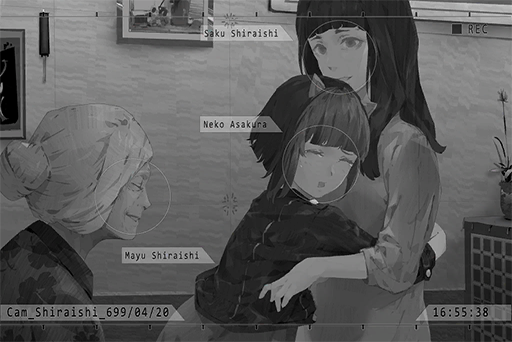

_\[»»» Fast Forward»»»\]_

**Neko** 
... Then NEKO kicked him in the balls and yelled, "Who you calling midget!?". Then got yanked outside! Then I got saved by this random weird person!

**Mayu** 
That sounds so dangerous...

**Saku** 
You're still doing things this recklessly?

**Neko** 
No need to worry, NEKO is strong! Daddy was always mumbling about Node 08 being better. NEKO don't see how it's better? There are still weird people everywhere!

**Saku** 
Haha...

*\[Collecting dishes\]*

**Saku** 
Ah, mom, let me wash it.

**Neko** 
Eh, let NEKO do it\~

**Mayu** 
It's alright\~ Mother and daughter should spend more time together after being apart for so long. Besides, the doctor has suggested that I should exercise more often.

**Neko** 
Thanks, grandma\~

**Saku** 
NEKO, why did you have the time to come back? What about the Academy?

**Neko** 
Ah... I've been taking a break from that. NEKO is working part\-time and renting a house outside right now... Ah! NEKO is a music arranger for Monophonic Entertainment now! Mommy, have you heard of PAFF? NEKO arranged songs for her! Pretty good, right?

**Saku** 
I knew that. Your dad told me about it.

**Neko** 
Eh......?

**Saku** 
Honestly... you can't just leave the Academy like that.

**Neko** 
Daddy... still keeps in contact with mommy? NEKO thought... So mommy also knew about sis Yukiko...?

**Saku** 
I do.

**Neko** 
Mommy... are you okay with this? Daddy is such a big liar. Back then he said it was all about work and environment... NEKO was even worried about him being lonely... He also stopped sending money back, right?

**Saku** 
Yes, he no longer does that. He has a new family now; mommy doesn't want to take money from him anymore. 
We're doing fine on our own. No need to worry about us\~

**Neko** 
Eheh!? Mommy, you're too nice! Why aren't you angry at daddy for

**Saku** 
NEKO, do you think that daddy has changed?

**Neko** 
Eh...? I don't know...

**Saku** 
Personally, I feel like he hasn't changed one bit. He is still that headstrong, careless blockhead who wants to shoulder everything. Am I correct?

**Neko** 
... Yes...

**Saku** 
Mommy has known him ever since we were both students. Back then, he actually had feelings for me already. Despite that, he waited until we were both adults before he confessed to me in a really sloppy manner... 
He has no idea how anxious I was waiting for him.

**Neko** 
I can totally imagine that...

**Saku** 
NEKO, people don't change that easily. At the very least, the daddy I knew won't change that easily. In our lives, we will meet all kinds of different people. Every single person is worthy for us to give, to love, to care. However, there is only so much one person can give. We can only choose what we feel like is the best on the spot, and not regret the things we give afterward.

**Neko** 
Hmm... NEKO don't really understand...

**Saku** 
_\*Chuckles\*_\~ Simply put, just keep one thing in mind. Whether it's daddy or mommy, our love for you will never change; because no matter what happens, you are the one person that is most worthy of our devotion.

**Neko** 
......

**Saku** 
NEKO, what do you think about that Yukiko person?

**Neko** 
Well... it pains me a little to say this, but she and mommy... are a bit similar, I think? You're both beautiful, gentle, mindful... really good at cooking, although not as good as mommy... 
She's also very kind to NEKO...

**Saku** 
Then it should be fine.

**Neko** 
But NEKO still can't quite accept it... I don't know how to face them.

**Saku** 
Make the decision yourself, just like when you're little. Remember that? If you want to come back to Node 03, you can do so at any time. Daddy will also understand your decision.

**Neko** 
NEKO... still needs to think about it. It's a lot of fun making music there, and I made a lot of good friends...

**Saku** 
All in all, this will always be your home. Mommy will help you keep your room shiny and spotless.

**Neko** 
Hmm... Thank you, mommy.

_\[Signal Lost\]_

[*(Click here to go back to the top)*](#toc)

## <a id="naos021"/>\[#021\] Call\_Linda\_699\_02\_25
### Requirements
|Character|Level|
|---------|:---:|
|**Neko** | 17  |

### Log Content
_\[Call Starts\]_

**[Linda]** 
_Hello, NEKO? What's the matter?_

**Neko** 
Lin\~da\~Chuwan\~\~\~

**[Linda]** 
_... An argument with your family again?_

**Neko** 
Nope! By the way, why did you start the conversation with the presumption that NEKO is going to complain about things!?

**[Linda]** 
_Am I wrong?_

**Neko** 
Ehh... Well, you're right. It's about the company...

**[Linda]** 
_Lemme guess; Miss super idol did something again, didn't she?_

**Neko** 
No kidding! Today, we bumped into each other when taking the elevator. She didn't apologize to NEKO at all! She is so arrogant! NEKO is still hurting even now!

**[Linda]** 
_Woah, everything alright?_

**Neko** 
No problemo\~ NEKO has a very hard head!

**[Linda]** 
_Umm, I was concerned about PAFF._

**Neko** 
Lin\~da\~Chii\~\~\~ You're so mean!

**[Linda]** 
_Ahaha, so she didn't say sorry at all?_

**Neko** 
I think she turned around to look at me... but then she walked away in a hurry. Sis Helena is very nice to me though. She's a really good person!

**[Linda]** 
_Then that's not too bad. I mean, it's not uncommon for artists to have eccentric personalities, right? Without the help of their agents, it's hard for them to communicate with people... Just imagine me in the past; that's more or less it._

**Neko** 
Ahaha, that's true. Linda\-chan used to not talk to other people at all.

**[Linda]** 
_You, on the other hand, love to talk to other people, whether it's back then or right now._

**Neko** 
That's how we became super BFFs! Teehee\~

**[Linda]** 
_Teehee my a\*\*. 
Say, this is just my opinion, but judging from your many complaints, collaborating with her is exhausting and the company isn't exactly friendly. Why don't you just quit this thing altogether?_

**Neko** 
I thought about it... but sis Helena is really nice to NEKO. PAFF... even though I have problems with her, I can't deny that her singing is truly amazing. 
It's really hard to find a top\-level vocalist. So many people think they're good, but all they know how to do is show off some fancy crap with no substance!

**[Linda]** 
_That I can understand... PAFF's singing is just... breathtaking. It's like she's singing right into my soul and feelings._

**Neko** 
The vicious Linda\-chan complimented a pop singer!? Is NEKO dreaming right now!?

**[Linda]** 
_...... Then how about I give you a slap to wake you up? I was concerned that you'll force yourself through the job despite not enjoying it! _

**Neko** 
Teehee.

**[Linda]** 
_Teehee my a\*\*._

**Neko** 
Rest assured, Linda\-chan. Even if I leave Mono, NEKO can feed myself with my music wherever I go. Besides, I also got to know a lot of great musicians and be friends with them! I'll be fine. 
Nevertheless, before that happens, NEKO's name will appear on PAFF's album first. Guhehehehe...

**[Linda]** 
_Haha, you're laughing like a perverted old man again. 
I'm so envious of you for knowing your path already. I'm also at the time where I need to consider my next step. I can't rely on part\-time jobs for my whole life..._

**Neko** 
If it's Linda\-chan, a band perhaps? Become an uber\-popular lead singer! Collab with NEKO! Release a platinum EP! 
Muhahaha, what a perfect plan\~

**[Linda]** 
_I don't have PAFF's talent. 
In addition, it's not like I have to do everything myself. To me, simply watching performances is more than enough to satisfy me._

**Neko** 
Hoho...

**[Linda]** 
_But still, thanks for the suggestion, NEKO. I'll think about it... Maybe there is something I can do in that industry._

**Neko** 
There definitely will be! Fight, Linda\-chan!

**[Linda]** 
_... Haha, whenever I chat with you, I feel like my mood always lightens up._

**Neko** 
... Same thing for NEKO. I don't feel so mad anymore.

**[Linda]** 
_Good to hear that. 
I have a morning shift tomorrow. Gotta sleep first. Goodnight!_

**Neko** 
Gotcha. NEKO's gonna sleep too. Goodnight\~

_\[Call Ends\]_

[*(Click here to go back to the top)*](#toc)

## <a id="naos022"/>\[#022\] Audio\_Neko\_699\_05\_01
### Requirements
|Character|Level|
|---------|:---:|
|**Neko** | 18  |

### Log Content
*\[Rips contract\]*

**Neko** 
NEKO will no longer do anything for a s\*\*\*hole company like yours! I will never be your ghost producer ever again! I look like a fool! 
I've already paid for the liquidated damages, so that's it! Goodbye!

_\[»»» Fast Forward»»»\]_

**Neko** 
UGH! I'm so mad! Trash Company!! 
Only idiots will produce music for your stupid faces! BLEHHHHH\~!!

**Neko** 
......

**Neko** 
...

**Yukiko** 
......NEKO?

**Neko** 
...... Sis Yukiko? Why are you here?

**Yukiko** 
I went to the supermarket to buy ingredients for dinner... Ah, so this is the company NEKO makes music for?  
What a coincidence.

**Neko** 
......

**Yukiko** 
NEKO... Are you crying?

**Neko** 
I, I'm not! I'm just yawning...

**Yukiko** 
I saw you rushing out of the company... Umm, did something happen? Maybe I can help...

**Neko** 
... Nothing. It's none of your business.

**Yukiko** 
... You're right. I'm sorry. I shouldn't bother you. I just hope everything goes smoothly for NEKO. After all, NEKO's music is really amazing.

**Neko** 
... Sis Yukiko, you've heard NEKO's music?

**Yukiko** 
Yes, it's very unique. 
... It was Kouhei who played them for me.

**Neko** 
Huh? Daddy? What does he know about NEKO's music? Isn't he the one who's always whining about these things being "bad for you" and hates it whenever NEKO does them?

**Yukiko** 
He only said those things to vent his anger... NEKO knew that, didn't you? 
In reality, he often talks about how the music is the proud work of his daughter. Even though he couldn't recognize a single note, he still tries his best to understand your music.

**Neko** 
...... 
He is so dumb...

**Yukiko** 
NEKO... Kouhei is not angry anymore. We all genuinely want you to come back.

**Neko** 
......

**Yukiko** 
You don't have to live in the house, but... maybe you can visit us from time to time, so we can catch up on what you're doing. We can have a quick chat, or cook together again... Kenta misses you very much too.

**Neko** 
... NEKO was making music and working part\-time because I want to go back to Node 03. I need money for the trip. Now that I quit work, NEKO will be going back very soon...

**Yukiko** 
Ah... so something indeed happened between you and the company? 
... Are you... returning to Node 03?

**Neko** 
W, what? You got a problem with that?

**Yukiko** 
... No. That's fine too. 
Whenever you do decide to visit, come play with Kenta. He has been sulking every day since you left...

**Neko** 
Kenta......

**Neko** 
......

**Neko** 
Sis Yukiko, can I ask you a question...?

**Yukiko** 
Sure.

**Neko** 
You... Just what did you see in my dad? Your ages differ by so much. Sis Yukiko is so pretty. My dad, on the other hand, is unattractive, and useless, and his feet smell... Why did you still...

**Yukiko** 
......

**Yukiko** 
NEKO, I understand that no matter what I say, it would be hard for you to believe. However, I really, really do love Kouhei. Also, it has nothing to do with my debts...

**Neko** 
......

**Yukiko** 
My ex\-husband was the worst kind of partner... Even until now, both Kenta and I still suffer hardships because of him. 
I was ready to accept that this is going to be my life. There's no way to escape and I would have to raise Kenta all by myself... Yet your father is willing to try his best to help us... He even gave us a proper "family", something I never even bothered to dream about...

**Yukiko** 
I am truly... truly grateful... _\*Sniffs\*..._

**Neko** 
Sis Yukiko...

**Yukiko** 
I'm sorry, NEKO... I know this is very selfish of me, but I don't want to see Kouhei give up his own family in order to give us one...

**Neko** 
......

**Neko** 
... All in all, NEKO has already made up her mind to return to my mom. Daddy really loves you, right? Then he should be just fine even without NEKO...

**Yukiko** 
... That's not true...

**Neko** 
That's it for now. NEKO will go back in a few days to clean out my stuff.

**Yukiko** 
... I see. Then at the very least, have a meal together with us before you go, okay?

**Neko** 
W, we'll see about that... I have to go now, bye\-bye.

*\[Footsteps\]*

**Neko** 
......

**Neko** 
Mom... NEKO can't decide...

_\[Signal Lost\]_

[*(Click here to go back to the top)*](#toc)

## <a id="naos023"/>\[#023\] Cam\_Asakura\_699\_05\_18
### Requirements
|Character|Level|
|---------|:---:|
|**Neko** | 19  |

### Log Content
**Neko** 
Eh? The door is not closed? What's going on...?

**Man A** 
Miss Yukiko, we've been looking for you for so long... So this is where you moved to?

**Yukiko** 
......

**Neko** 
Yikes... Who are these people...?

**Man B** 
Trying to commit debt evasion? That's not right\~

**Man A** 
Heard that you married the person living here. Where is he?

**Yukiko** 
He... he's on a business trip. P, please, don't get him involved. The money... I've been paying it back properly all this time...

**Man A** 
Hmph!? That's just the principal, right? What about the interest? What do you think we are, some kind of charity organization!?

**Yukiko** 
About the interest... I really couldn't...

**Man B** 
Hey hey hey\~ 
Have you forgotten about the contract you signed? We have it right here. This is your signature, isn't it?

**Man A** 
In short, we're gonna get in trouble if we keep letting you off the hook like this. We have to solve this problem today somehow.

**Man B** 
Do you know that human trafficking is also a pretty good business here now? Especially little kids like this.

**Kenta** 
Wahhh! Mama!

**Yukiko** 
Stop!!

*\[Slap\]*

**Yukiko** 
Kya!

**Man A** 
Shut it! The amount you guys owed is way too much. Don't you dare inform the admins. The things your ex\-husband did, you do realize what's going to happen to you if those things are discovered, right?

*\[Kick\]*

**Man B** 
Uargh!!

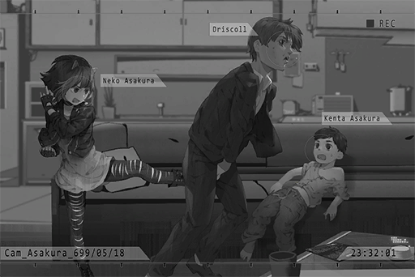

**Neko** 
Let go of him! You ugly bastard!

**Kenta** 
Big sister! Wahhhhhh\~

**Neko** 
Kenta! Sis Yukiko! Are you guys alright!?

**Yukiko** 
......

**Neko** 
She fainted... Who the hell are you people!? What are you doing in someone else's home!?

**Man A** 
My oh my... now this is unexpected. Miss Yukiko, when did you have such a cute daughter? She's gonna sell at a much better price than the little boy.

**Neko** 
I'm not her daughter, dumba\*\*! Now get out!

**Man A** 
Can't do. Since we here, we have to leave with something today...!

**Neko** 
Hmmm! UMmmm......! 
zzZ...

**Man A** 
Got her. Hey! How long are you going to lie down there? Get up!

**Man B** 
Ah! Okay!

**Man A** 
Miss Yukiko, we'll take this girl as interest. We won't be bothering you for a while. Please remember to pay back the remaining principal\~

**Yukiko** 
Ugh... please... don't...

**Kenta** 
WAHHHHHH\~\~

_\[Signal Lost\]_

[*(Click here to go back to the top)*](#toc)

## <a id="naos024"/>\[#024\] Audio\_Studio\_699\_05\_19
### Requirements
|Character|Level|
|---------|:---:|
|**Neko** | 19  |

### Log Content
*\[Door Knock\]*

**Xenon** 
Umm... Who's there? It's the middle of the night...

*\[Door Opens\]*

**Xenon** 
NEKO......？

**Neko** 
......

*\[Collapses\]*

**Xenon** 
Woah!

_\[»»» Fast Forward»»»\]_

**Xenon** 
You awake?

**Neko** 
Ugh... Ow, that hurt...

**Xenon** 
You scraped your knee. Since it's not a serious injury, I just sort of patched it up...

**Neko** 
... NEKO has been kidnapped!!

**Xenon** 
......? 
The heck? You ran here yourself...

**Neko** 
Not you! Bad people!

**Xenon** 
...... Huh?

**Neko** 
Ran away!

**Xenon** 
......?

**Neko** 
Ah! I have to call home ASAP! Lend me your phone!

**Xenon** 
Hey...

_\[»»» Fast Forward»»»\]_

**Neko** 
Ok... Uh\-huh... NEKO is fine... 
Got it... I will be back in a moment, bye.

*\[Door Opens\]*

**Neko** 
I'm done. Here's your phone.

**Xenon** 
......

**Neko** 
Well, NEKO's gotta go.

**Xenon** 
Hey, aren't you going to tell me what happened? Although I more or less figured out the gist of it through your phone call.

**Neko** 
Why are you eavesdropping!? Eww, gross... 
Well... this is a problem for NEKO's family to deal with. We can't bother you with this...

**Xenon** 
It sounds like that group you're dealing with has something to do with cybercrime. If that's the case, the admins and I would have to interfere.

**Neko** 
You can't inform the admins!

**Xenon** 
... Why?

**Neko** 
If the admins knew about this... it would trouble sis Yukiko too... NEKO doesn't want that to happen.

**Xenon** 
......

**Neko** 
All in all, that's it for now...

**Xenon** 
It's a financial company by the name of "Horizon", right?

**Neko** 
... Eh? I think so...

**Xenon** 
I knew about that company. They are involved in a wide variety of businesses as one of the gangs' many faces on society. However, the usury business is one that hasn't been properly acknowledged yet. Therefore, it's mostly done by minor gang members through the internet. Recently, that has spread onto cyTus as well.

**Neko** 
......

**Xenon** 
... If you don't want to inform the admins, I can still think of a couple of ways to deal with them. Want to hear me out?

**Neko** 
But, I don't want to drag you into all this...

**Xenon** 
No need to worry. Just hear me out first. To be honest, I don't have to do anything at all.

_\[Signal Lost\]_

[*(Click here to go back to the top)*](#toc)

## <a id="naos025"/>\[#025\] Cam\_Dash\_699\_05\_20\_1
### Requirements
|Character|Level|
|---------|:---:|
|**Neko** | 20  |

### Log Content
*\[Car Engine Stops\]*

**Kouhei** 
We're here... This is the place.

**Neko** 
Daddy, are you sure about this? NEKO is more agile. Maybe we should let NEKO go...

**Kouhei** 
NO! I cannot let you do something this dangerous.

**Neko** 
......

**Kouhei** 
I'll be going then. So I press this, then press this and this. Is that right?

**Neko** 
Uh\-huh... NEKO will be in the car. If the situation goes wrong, NEKO will inform the admins immediately.

**Kouhei** 
Got it. 
NEKO... Thank you.

**Neko** 
... W, why are you thanking me?

**Kouhei** 
For willing to stand up for Yukiko... Also, sorry for yelling at you back then.

**Neko** 
Ha!? N, NEKO's not doing this for anybody else! I'm just doing this because I'm mad about being kidnapped! 
E, enough! Get moving! Go kick their butts!

_\[»»» Fast Forward»»»\]_

**Neko** 
Daddy, can you hear me? NEKO will be telling you the controls from here. 
Daddy? Dad?... AH! Crap... He forgot his earbuds...

*\[Door Opens\]*

**[Man A]** 
_Hmm? Mister, is there something you want? We are already closed for the day..._

**[Kouhei]** 
_...... You... you guys, are the ones who were threatening Yukiko, right?_

**[Man B]** 
_... Huh? Who the f\*\*\* are you? Aha! Could it be that you're her current husband?_

**[Man C]** 
_Are you here to pay her debts for her? Then you better bring enough. The money that woman owed us is no small number..._

**[Kouhei]** 
_I, I warn you guys... leave her alone. We will not pay this wretched illegal company a single cent anymore!_

*\[Flips switch\]*

**[Kouhei]** 
_...... Eh?_

**Neko** 
Daddy you idiot! You pressed the wrong one! Ah! Look out!

*\[Heavy Blow\]*

**[Kouhei]** 
_Argh!_

**[Man A]** 
_You want a death wish, old geezer!?_

**[Man B]** 
_Old man, if you want to mess with us, I advise you come prepared. Looks like you're gonna have to pay the price with your blood and organs!_

**Neko** 
This is bad... Should probably inform...

**[Kouhei]** 
_ALL OF YOU, FREEZE!_

*\[Flips switch\]*

*\[Glass explodes\]*

**[Man C]** 
_......! What!? What is going on...!?_

*\[Flips switch\]*

**[Man B]** 
_UGH! My head! My head is so hot! It's burning!_

**[Man A]** 
_URGHHH! AAHHHH!_

**[Man C]** 
_WAAAAHHHHHH!!_

**[Kouhei]** 
_You people... you all implanted the cyTus chip, right? If you dare move a finger, I will blow your brains out!_

**[Kouhei]** 
_"X"... As fellow cybercriminals, that name should ring a bell, right?_

**[Man B]** 
_......!?_

**[Kouhei]** 
_Exactly. I am X.  
I was already retired from this stuff... but you people crossed the line by messing with my family. I had no choice but to take matters into my own hands again._

**[Man C]** 
_Impossible... You're that... legendary hacker..._

**[Kouhei]** 
_I just destroyed all your transaction networks. Your names, addresses, lifestyles, family and friend information are all in my hands now..._

**[Man B]** 
_Please stop! My head... it's throbbing... I'm gonna die!_

**[Kouhei]** 
_Your heads must be burning, right? Did you realize that the cyTus chip model you guys implanted has an overcharge loophole? I can split your heads in half whenever I feel like it. It could be when you eating, sleeping or even when you're taking a s\*\*\*. If you have the balls to get the chips removed, I have plenty of other methods to torment you people._

**[Man B]** 
_Eek\~ We, we understood! We apologize! We didn't know that you are X..._

**[Kouhei]** 
_Leave my dear daughter and family alone!  
You worthless sacks of s\*\*\*!!_

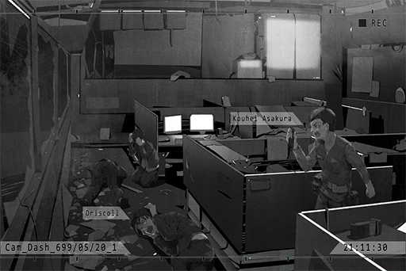

**[Man C]** 
_U... Understood! We are very sorry!!_

**Neko** 
Daddy...

_\[Signal Lost\]_

[*(Click here to go back to the top)*](#toc)

## <a id="naos026"/>\[#026\] Cam\_Dash\_699\_05\_20\_2
### Requirements
|Character|Level|
|---------|:---:|
|**Neko** | 21  |

### Log Content
**Kouhei** 
Judging by their frightened faces... They probably wouldn't dare to bother us anymore from now on. 
What exactly is this "X" thing your friend told you about? The bad guys seem terrified of it...

**Neko** 
NEKO don't really know the details too, but it seems to work quite well...

**Kouhei** 
Daddy had some serious misjudgments about your friends. NEKO has some pretty amazing friends...

**Neko** 
Yeah... By the way! What were you thinking rushing in there without earbuds! And you pressed the wrong button! NEKO was super nervous during all that!

**Kouhei** 
Sorry... Because I want to spew some pretty cringy lines...

**Neko** 
Eh...? Even without earbuds, NEKO can still see you on\-screen. I can hear all the sounds as well.

**Kouhei** 
EH!? For real? Man, so you heard them all? God, that was so embarrassing...

**Neko** 
Not at all... Rather, I feel like... daddy was kinda cool back there.

**Kouhei** 
......

**Neko** 
B\-U\-T! If it's NEKO posing as X, it would be at least ten times cooler! It will definitely look better than that sloppy performance you put out there!

**Kouhei** 
Haha, that was already my best shot. Cut me some slack...

**Neko** 
AH! Daddy, your head is still bleeding! Quick, we have to get you to the hospital!

**Kouhei** 
No big deal; it's just a small scratch... Compare to that, there's a more important place we must be at right now. If we don't hurry, we're not going to make it.

**Neko** 
...... Ha?

_\[»»» Fast Forward»»»\]_

**Neko** 
Nah! Aren't we almost home? Is it really ok for you to not go to the hospital!? 
You said something about going to a more important place... then you just grabbed this box. What's inside?

**Kouhei** 
No need to panic. You'll know very soon.

_\[→Signal Switch\]_

*\[Door Opens\]*

**Yukiko** 
Kouhei! NEKO!

**Kouhei** 
NEKO, bring the box over here. 
Open it.

**Neko** 
Huh......? Eh? Cake!?

**Kouhei** 
Today is your birthday, right? We've only got half\-an\-hour left. Let's celebrate!

**Neko** 
......

**Yukiko** 
Happy birthday, NEKO!

**Kenta** 
Big sister, Happy birthday!

**Neko** 
_... \*Sniffs\*..._

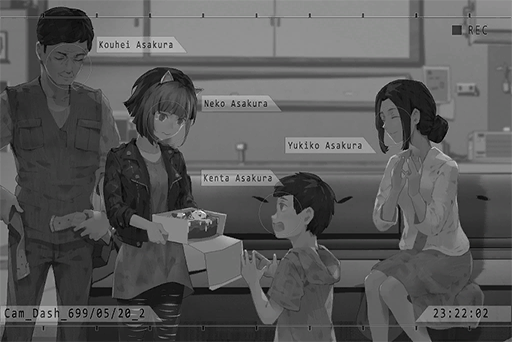

**Kouhei** 
This is also daddy's apology to you. I'm sorry for the terrible things I said to you...

**Neko** 
......

**Yukiko** 
NEKO, I have to apologize to you too. It was me who interfered with this family...  
I didn't consider your feelings. On top of that, I dragged both of you into my troubles...

**Neko** 
......

**Yukiko** 
You've already made your decision... about going back to Node 03, right?

**Kouhei** 
......

**Neko** 
Yeah... That day, NEKO came back just to grab some stuff before I leave. Somehow, I got involved with this incident...

**Yukiko** 
It's a shame that we couldn't live together with you. However, we will always keep your room for you.

**Neko** 
Come on... Sis Yukiko, if you put it that way, there's no way NEKO can leave...

**Yukiko** 
......Eh?

**Neko** 
NEKO has decided! I am not leaving! I'm moving back in! Daddy, you're okay with this, right?

**Kouhei** 
......Eh? Of course I'm okay with it!

**Neko** 
This household is so weak; what are you guys gonna do without NEKO!? 
One parent gets knocked out cold with one blow! The other is always on business trips and is never home! Who's going to protect Kenta then? Right?

**Kenta** 
Big sister...

**Neko** 
NEKO also promise... that I will not make you guys worry anymore. I'm sorry...

**Yukiko** 
NEKO... Thank you! Thank you so much! _\*Sobs\*......_

**Neko** 
_...\*Sniffs\*... _Alright! That's enough crying! It's a bad omen to cry on someone else's birthday party! Let's blow out the candles!

_\[Signal Lost\]_

[*(Click here to go back to the top)*](#toc)

## <a id="naos027"/>\[#027\] Audio\_Studio\_699\_06\_03
### Requirements
|Character|Level|
|---------|:---:|
|**Neko** | 22  |

### Unlocked Charts
|   Song   |Character|Diff.|Level|
|----------|:-------:|:---:|:---:|
|**Log In**|  Neko   |Easy |  3  |
|**Log In**|  Neko   |Hard |  6  |
|**Log In**|  Neko   |Chaos| 13  |

### Log Content
*\[Eats Snacks\]*

**Xenon** 
Hey, I thought I told you not to eat snacks in here? Take it outside.

**Neko** 
NO! It's too stuffy outside!

**Xenon** 
I've turned on the AC, go outside.

*\[Door Opens\]*

**Neko** 
Mu\-ki\~\~\~ You're the one who said you're making a new song. That's why NEKO came to help. 
What's with your attitude?

**Xenon** 
Be quiet. If you ruin the equipment then we won't be able to make anything.

**Neko** 
Muuuu... 
Ah, right! The money for this composition, can you transfer it to NEKO first? I was planning to return to the Academy, only to then discover that I couldn't afford the tuition at all... And I don't want to rely on that dumb dad of mine so soon after I went back...

**Xenon** 
I could, but didn't you made some money from Mono and your part\-time jobs? Where did those go?

**Neko** 
Thanks to the liquidated damage payments, not a single dollar left... Damnit... Stupid Mono! Stupid PAFF!

**Xenon** 
... You used to be her fan, aren't you?

**Neko** 
Not anymore! 
Aw man\~ NEKO originally planned to start sending some money back to Node 03 in place of dad... I previously said I was moving back, and then I regretted it all of a sudden. I hope mom won't be too disappointed about this...

**Xenon** 
... If you want to make money, our company has been recruiting beta testers for a new project recently. You can treat it as an extracurricular activity...  Do you want to try?

**Neko** 
Eh? What kind of project?

**Xenon** 
Develop a virtual internet streaming service based on the iM platform. The users can interact with each other in a virtual space using the virtual internet. If the viewers like the content, they can also subscribe and sponsor the users. If it's you... perhaps you can manage to create a pretty interesting channel?

**Neko** 
Hoho\~ Sounds like so much fun! NEKO wants to try it out!

**Xenon** 
Then I'll send you the information. You'll have to come in for an interview yourself. I'm not from that department.

**Neko** 
Got it! Thanks\~

**Xenon** 
Oh, and another thing... what happened to those people afterward? They still bothering you?

**Neko** 
Eh? You mean the debt collectors? Nope\~ Not only that, they even sent an apology letter to sis Yukiko! Talking about how they hope X could forgive them and things like that. So that name really has this kind of power? It... feels so cool!

**Xenon** 
... I didn't expect them to be that terrified either. However, judging by the range of their activities, you shouldn't have to be concerned anymore.

**Neko** 
Also, about the script you gave us... even though dad seems really into it, but about the cyTus chip exploding stuff... is that true or not?

**Xenon** 
Of course it's fake. If the chips really do explode, they wouldn't even get to the point where the admins get involved. They won't even make it past the Q.A. process within A.R.C. itself. What happened back there was a simple remote\-controlled overcharge that increases the temperature of the devices. It's pretty much just a scary prank.

**Neko** 
I see... NEKO was wondering whether I should remove the chip after seeing that too...

**Xenon** 
Let me guess, you didn't because you couldn't survive a day without the internet?

**Neko** 
Teehee\~ Bingo!

**Xenon** 
All in all, good to see that you're safe.

**Neko** 
......

*\[Eats Snacks\]*

**Xenon** 
What's wrong? If you're done eating, go back and continue.

**Neko** 
...... Thank you.

**Xenon** 
Huh?

**Neko** 
N, NEKO says thank you!

**Xenon** 
......? 
For what?

**Neko** 
N, nothing..... Just... for all sorts of things...

**Xenon** 
What? I didn't do anything though? 
Come on in; we need to finish the remaining sections.

*\[Door Opens\]*

**Neko** 
You did help NEKO out... At least let NEKO say thank you...

_\[Signal Lost\]_

[*(Click here to go back to the top)*](#toc)

## <a id="naos028"/>\[#028\] Cam\_Asakura\_701\_09\_28
### Requirements
|Character|Level|
|---------|:---:|
|**Neko** | 23  |

### Unlocked Charts
|             Song              |Character|Diff.|Level|
|-------------------------------|:-------:|:---:|:---:|
|**DJ Mashiro is dead or alive**|  Neko   |Easy |  5  |
|**DJ Mashiro is dead or alive**|  Neko   |Hard |  9  |
|**DJ Mashiro is dead or alive**|  Neko   |Chaos| 14  |

### Log Content
_\[Call Starts\]_

**Neko** 
Linda\-chan! NEKO hasn't heard your voice in ages! I miss you so much!

**[Linda]** 
_Still exaggerating things as always. Didn't we just meet up last week?_

**Neko** 
Eh\~ So cold! NEKO missed you for real! Ah, right; how was it? Did the interview go well?

**[Linda]** 
_I got accepted! I'll be working at Under Velvet starting next week._

**Neko** 
WOW! Congratulations! I'm so happy for you! Linda\-chan will be working in the administration department, right? Then we'll get to see so many free performances!

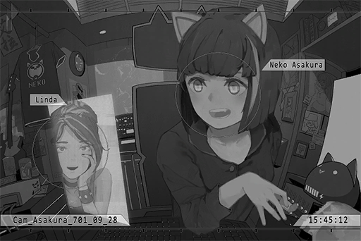

**[Linda]** 
_What else do you think I applied for a job there for? Haha. Shouldn't be too hard to get free performances. However, judging by how busy you are these days, do you even have time to come?_

**Neko** 
No worries. It's not like NEKO wants to stream every day either! It's quite an exhausting thing! And you have to come up with topics to talk about! 
By the way, why don't Linda\-chan come watch NEKO's stream? NEKO feels so lonely...

**[Linda]** 
_You know perfectly well that I'm not interested in this kind of internet culture, right? Music is really all I need in my life. Besides, when it comes to performances, nothing beats a live one, doesn't it?_

**Neko** 
Ummm... Linda\-chan has become an adult\~

**[Linda]** 
_More like you never grew up? 151..._

**Neko** 
Boo boo! Wrong\~! I'm 155 now! NEKO is still in her growth period! I will keep growing taller! Linda\-chan is so mean!

**[Linda]** 
_Hahaha, how old are you now? Reality's brutal, but you gotta accept it\~ 
Speaking of music, haven't seen you perform for a while now. I miss your last performance; you know, the one where you played songs on the UV stage._

**Neko** 
That's because NEKO has been getting virtual LIVE cases these days. I even turned down a super big invitation not too long ago!

**[Linda]** 
_Virtual ones, eh..._

**Neko** 
Virtual LIVES are pretty awesome\~ You can perform at home, and the audience doesn't have to leave theirs to watch you perform either.

**[Linda]** 
_You do have a point, but I still prefer physical performances. That's why I applied for this job... Speaking of my job, there's a famous band from Node 54 coming this week. I'm a bit nervous\~ Really hope everything can go smoothly..._

**Neko** 
Linda\-chan is very capable; everything's gonna be a\-ok! Teehee\~

**[Linda]** 
_Teehee my a\*\*... Why did you decline that super big invitation though?_

**Neko** 
It's that Æsir guy. He's holding this mega music festival and he invited NEKO to perform. Although NEKO is very interested...

**[Linda]** 
_Æsir!? That's a fantastic honor! Why did you turn it down?_

**Neko** 
Because he invited a boatload of Mono's artists... and he invited PAFF too! NEKO has ZERO intention to be on the same stage with PAFF! Besides, I am 99.99% sure she'll sing the songs NEKO arranged, which makes me even more p\*\*\*ed off!

**[Linda]** 
_Oh... I see. If that's the case, then I can understand. You've been complaining to me about that for so many years now..._

**Neko** 
Ah, but it appears that "Cherry PuNK" is also invited! NEKO really wants to be on stage together with Cherry...

**[Linda]** 
_Indeed. I was so touched when I saw the news of Cherry's comeback! Ah...but there's a bad news. Last week, I caught wind of the news that they are on the verge of being signed by Mono..._

**Neko** 
EHHHHH!? You serious? NOOOOOO! Cherry, don't join Mono! They will squeeze you until you have no value left then trash you! That makes NEKO so conflicted\~ Should I boycott their music or not!?

**[Linda]** 
_You're exaggerating things again... Personally, I don't really mind..._

**Neko** 
Sigh\~ So\~\~ annoying! Eh, when should we meet up again next time? My fans have told NEKO about this delicious ramen shop...

**[Linda]** 
_Hahaha, you shouldn't be asking me. You should be asking yourself. When will you be free, you busy little kitten\~?_

**Neko** 
Ummm... Next Thursday, 07:00 PM! At the main entrance of UV!

**[Linda]** 
_No problem, see you then! 
That's it for now. I gotta prepare for work. Good luck with tonight's stream._

**Neko** 
OK! Bye\-bye, Linda\-chan\~

_\[Call Ends\]_

_\[Signal Lost\]_

[*(Click here to go back to the top)*](#toc)

## <a id="naos029"/>\[#029\] Cam\_76st\_702\_06\_11
### Requirements
|Character|Level|
|---------|:---:|
|**Neko** | 23  |

### Log Content
**Neko** 
Long time no see, game center! I wonder if my records have been broken or not......? Maybe I should stream here next time, the views will skyrocket through the roof!

**Neko** 
... This place, so nostalgic...

**？？？** 
Ummm...

**Neko** 
Ah!? Xe... No, that's not him... 
Who's that?

**？？？** 
Umm, excuse me. If we mistook you for someone else, we will apologize. But, umm... You're NEKO, right?

**Neko** 
Oh, ... Y, yeah...... Is NEKO really that famous...?

**Sam** 
Hey, baby, it really is her! 
It's so nice to meet you here, NEKO! I am Sam! This is my girlfriend Rinko! Both of us follow your streams regularly!

**Rinko** 
Greetings, NEKO! Eh, Sam\~ you're too intense. See, you even scared NEKO!

**Neko** 
I, I'm fine... I'm just a little... flustered. Ehehe...

**Rinko** 
There are a ton of NEKO fans out there! Every time you stream, the room gets filled almost instantly! You can't get in after three minutes! You were even ranked No.1 on the top 10 streamers of Node 08!

**Sam** 
NEKO. this guy is a really hardcore fan. You can check his phone; it's filled with your content. VODs, live streams... stuff like that.

**Neko** 
Ehehehe\~ Is that so...

**Rinko** 
Hehe, the real NEKO is so different from your online persona! You're so shy and so cute\~ We were worried that you're going to greet us with one of your sick burns or something... but even if you did, we are totally fine with that too!

**Neko** 
Eh......? Ahahaha, I tend to get more carried away on the internet\~

**Sam** 
Ah, NEKO, may we take a photo with you?

**Neko** 
A photo? Eheh\~ but NEKO doesn't have any makeup on now... I'm just here to play video games...

**Rinko** 
No need to worry! You are still super cute even without makeup! Your skin is so smooth!

**Sam** 
Then I'll take a photo for you two first. Stand still\~ 
Ok, three, two, one, say cheese\~\~

*\[Takes Photo\]*

**Rinko** 
Let's take a selfie with my phone as well\~ Is that ok?

**Neko** 
Uh\-huh. Sure!

*\[Takes Photo\]*

**Sam** 
How does the photo look? Is this okay for you, NEKO!?

**Neko** 
Ha\~ NEKO's still\-sleepy face looks so dorky...

**Sam** 
Not at all! It's really adorable! Switch, switch! I want a selfie too!

**Rinko** 
I will not allow you to harass NEKO though!

**Sam** 
Who do you think I am, you?

**Rinko** 
NEKO, thank you! Keep fighting! We will always be NEKO fans! We'll post the photos on iM later!

**Neko** 
O, okay. Thank you!

**Neko** 
......

**Neko** 
Hawawa... Got recognized again... Is this how it feels like to be an idol? Man\~ I'm gonna have to put on disguises when I go out in the future...

_\[Sig>̵̧̀͘͠}̧̀̕҉>̛́ Lost\]_

[*(Click here to go back to the top)*](#toc)

## <a id="naos030"/>\[#030\] Cam\_NL\_702\_08\_19
### Requirements
|Character|Level|
|---------|:---:|
|**Neko** | 24  |

### Unlocked Charts
|                  Song                  |Character|Diff.|Level|
|----------------------------------------|:-------:|:---:|:---:|
|**Re:incRnaTiØN ～夕焼ケ世界ノ決別ヲ～**|  Neko   |Easy |  6  |
|**Re:incRnaTiØN ～夕焼ケ世界ノ決別ヲ～**|  Neko   |Hard |  9  |
|**Re:incRnaTiØN ～夕焼ケ世界ノ決別ヲ～**|  Neko   |Chaos| 15  |

### Log Content
**Neko** 
Nyan nyan nyan\~  
It's stream time again!

**Audience** 
YEAAHHH she's here

**Audience** 
FIRST!

**Audience** 
What game R U playing today

**Neko** 
A mysterious anonymous person has been telling NEKO that if I stream at this time, I will receive some exclusive BIG news about Æsir!

**Neko** 
Is it true? Or is it another one of those fake news BS?

**Audience** 
Hasn't that DJ gone dark for a long time now

**Audience** 
Signing up right now. NEKO my waifu 
_\[User is now banned.\]_

**Neko** 
NEKO is looking forward to this myself as well!

**Neko** 
Let's us wait and see what's coming!

**Audience** 
Let the donations rain\~\~\~

**Neko** 
What's gonna happen? Anybody want to take a guess?

**Audience** 
Probably nothing

**Audience** 
Fake news +1

**Audience** 
I'm a simple person; I see NEKO, I press like

**Neko** 
Woah\~ Look at this viewer count! We may be breaking the record again this time!

**Neko** 
Why are you people taking screenshots!? Prepare your butts for the big moment!

*\[Ringtone\]*

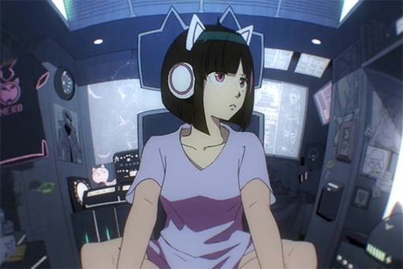

_\[Call Starts\]_

**Neko** 
Hello\~? Who are you?

_\[Sig>̵̧̀͘͠}̧̀̕҉>̛́ Lost\]_

[*(Click here to go back to the top)*](#toc)

