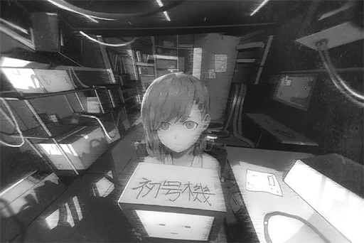

# Cam_Robo_697_04_06_1
## Log Content
*\[ROBO_Head Start-Up\]*

**[ROBO_Head]** 
*......*

**[ROBO_Head]** 
*This unit, start up, success. Self\-diagnostics complete.*

**[Nora]** 
*Unit 02, can you hear my voice?*

**[ROBO_Head]** 
*This unit, condition: available to accept commands. Command requested.*

**[Nora]** 
*...... Don't reply like this. 
Can you hear my voice? [ROBO\_Head].*

**[ROBO_Head]** 
*......*

**[ROBO_Head]** 
*I can. This unit. can hear your voice.*

**[Nora]** 
*Good. ROBO...... I'll call you ROBO then. 
Can you describe your own identity first?*

**[ROBO_Head]** 
*This unit, fully automatic robot with artificial intelligence system equipped, identification code "ROBO\_Head \- Unit 02".*

**[Nora]** 
*Great! The system is functioning properly. 
Hello ROBO, I am the person who created you. You can call me Nora.*

**[ROBO_Head]** 
*Affirmative \-Nora\- 
According to memory data, this unit, created, to, protect Nora.*

**[Nora]** 
*Not just me... There's another person I want you to protect as well. Don't let him get injured no matter the circumstances.*

*\[Loading Sounds\]*

**[ROBO_Head]** 
*Searching database... Search failed. 
Decision: Insufficient information 
Nora, please provide additional information, of second target to protect.*

**[Nora]** 
*His information is top secret and therefore not registered in the database... That's why you didn't know. 
It's okay; you can hear it directly from me, ROBO.*

**[Nora]** 
*The name of that person is...*

*[Signal Lost]*