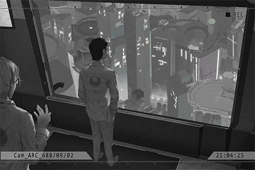

# Cam_ARC_688_09_02
## Unlocked Charts
|       Song       |Character|Diff.|Level|
|------------------|:-------:|:---:|:---:|
|**Drop The World**|  Nora   |Easy |  4  |
|**Drop The World**|  Nora   |Hard |  8  |

## Log Content
**[Leo]** 
*Phoenix, based on the aforementioned reasons, you are relieved of your position as Director of the A.R.C. technology department, effective immediately. You can go clear out your office now.*

**Noah** 
Fellow committee members! Please wait! This is too...

**Phoenix** 
Noah, it's okay.

**[Leo]** 
*... The meeting is now over.*

*\[Door Opens\]*

**Noah** 
Director!

**Phoenix** 
That's more or less it. I'll go clear out my stuff.

**A.R.C. Employee A** 
So that Phoenix really got fired...

**A.R.C. Employee B** 
It's just a matter of time. He really went overboard this time, going directly against the higher\-ups like that.

**A.R.C. Employee A** 
Isn't the person following him a very likely candidate for the next director? 
Maybe he's the one who ratted  on Phoenix...

**Noah** 
What are you people mumbling about!?

**Phoenix** 
Noah! I'm sorry, I have a bit too much stuff. Can you give me a hand here?

**Noah** 
Ok...

*[→Signal Switches]*

**Noah** 
Being insulted like that... How come you're not angry about it at all!?

**Phoenix** 
Saying that you're the rat, that is certainly too harsh. I don't believe that you're the one who told on me.

**Noah** 
That's not what I'm talking about! Firing you just like that, I can't accept it!  
There must be other methods, right? The other members of the team will definitely help out as well!

**Phoenix** 
Back during the HR meeting, of the multiple accusations made against me by the higher\-ups, can you rebut even a single one of them? 

**Noah** 
Ummm... I... But, director, your ideals...

**Phoenix** 
Everything they said is an undeniable fact. Since they can't accept my way of doing things, there is no point for me to continue staying here either.

**Noah** 
Node 08's A.R.C. is the most technologically advanced and most resource\-rich organization in the entire world. Where else can director go after you leave here?

**Phoenix** 
Haha, you're still too young, Noah. How old are you this year? 24?

**Noah** 
Just turned 24...

**Phoenix** 
*\*Chuckles\**, Several mistakes you made there. First of all, this is not the most resource\-rich place in the world. What you see is merely the surface. Secondly, if you really think I have nowhere to go once I leave here, you're seriously underestimating me.

**Noah** 
I would never... Director is the one person I worship the most on my career path as a researcher! 
Then where do you plan to go after this? Please, let me come with you too!

**Phoenix** 
Hmm... At first, I was considering taking you and other talented folks in the team with me. However, I decided to scrap that idea.

**Noah** 
Eh? Why? I'm sure the other members will be more than willing to follow you too. 
None of us would want to stay in a team without director...

**Phoenix** 
Noah, you still got a family to feed, don't you?

**Noah** 
Oh...

**Phoenix** 
This... What I'm going to tell you next will be a shared secret between us. The path I plan to walk next... will be extremely brutal. You can even say that there's nothing honorable about it...

**Noah** 
... Eh?

**Phoenix** 
Our research of the "Virus" is something that can no longer be done here. The company's stance is firm; and to be fair, I can understand where they are coming from too. Therefore, I would also advise you to stay out of this from now on.

**Noah** 
I can't do that!? You've been working so hard on it for so many years...

**Phoenix** 
I will find the breakthrough point on the other side of the world.

**Noah** 
It can't be...

**Phoenix** 
Exactly; only in "that place" will I no longer be restricted by laws and morals. I can perform my research with no limitations at all. This is something I have to conquer on my own.

**Noah** 
...... 
... I... I also...

**Phoenix** 
Don't fool yourself. For someone who gets nightmares after dissecting a frog, I don't think you can handle the things I'm going to do in the future.

**Noah** 
......

**Phoenix** 
... Do you still remember the incident eight years ago? The one where a drone lost control and accidentally killed a civilian?

**Noah** 
Yes. I remember the victim's name is Carly... something?

**Phoenix** 
Carly Pauline. The drone that malfunctioned was a model LE\-110 that belonged to the Administration Bureau. 
On the same day, in the forbidden area just outside of 08, an exploration team member, Jack Edwards, died from the "Virus"...

**Noah** 
Jack Edwards... I remember seeing this name on the medical records...

**Phoenix** 
Back then, the two news reports were released almost simultaneously. However, almost nobody cared about the death of this exploration team member. The only news people seemed to care about was the one where a drone murdered a human.

**Noah** 
Indeed. Back then, not even I knew about this incident...

**Phoenix** 
You know what's ironic? The information that later helped fix the malfunctions in LE\-110 was discovered by none other than Jack Edwards. The modified LE\-112s are still in service at the Administration Bureau to this very day as well. So far, they haven't had any issues and has protected many civilians.

**Noah** 
Wha...

**Phoenix** 
The mass public tends to not think about the hidden meanings behind these kinds of incidents. They only care about the things that are happening in front of their eyes... Back then, the ensuing panic, the mistrust towards technology, all that are major obstacles for the advancement of science. That's a responsibility we must shoulder as well.

**Noah** 
......

**Phoenix** 
We humans have the power of "knowledge". That's why it's our duty to make the world a better place. For the purpose of a long\-term goal, I chose a path that is not only extreme and dangerous but could also involve crimes. However, even though that's my choice, it does not mean the things we are doing here is simply obsolete.

**Noah** 
......

**Phoenix** 
A.R.C.'s technology is still a trusted and hopeful beacon for the current society. 
Noah, you're a young man with great potential. You shouldn't go on this mad journey with me. After my departure, you will be the most capable member of the team. Please, take care of them for me.

**Noah** 
Director...

*[Signal Lost]*