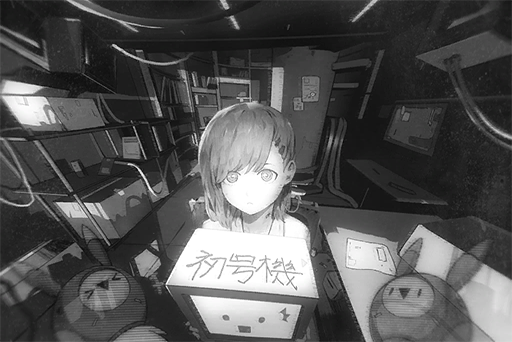

# Cam_Robo_697_04_06_03
## Requirements
|Character|Level|
|---------|:---:|
|**Nora** |  5  |

## Log Content
**[Nora]** 
*That child... was me.*

**[ROBO_Head]** 
*Searching database... Search complete. 
Summary on "The Ender" virus in forbidden area: Mortality rate 99.97%. No record of complete recovery. 
Nora survived, please explain, reason.*

**[Nora]** 
*I don't really know why... But Phoenix often said that I am special. 
Phoenix allowed me to live here because of that as well.*

**[ROBO_Head]** 
*Nora, how do you view, Phoenix?*

**[Nora]** 
*... Without him, I would've already been eaten by wild beasts. He gave me food, clothes, a place to live and he is very kind to me too... This wheelchair is also something he made for me. I am very thankful to him.*

**[ROBO_Head]** 
*Nora's replay, delay of 2.375 seconds.  
This unit, determine, this delay, sign of hesitation. 
May I ask for additional information, reason, of hesitation?*

**[Nora]** 
*......*

**[ROBO_Head]** 
*If Nora doesn't want to answer, this unit, will stop questioning.*

**[Nora]** 
*Thank you, ROBO. 
Is there anything else you would like to know?*

**[ROBO_Head]** 
*This unit, want to know more, about Nora.*

**[Nora]** 
*So it's easier for you to protect me?*

**[ROBO_Head]** 
*Negative. 
This unit, only wants to know.*

**[Nora]** 
*Only... wants to know?*

**[ROBO_Head]** 
*Affirmative.*

**[Nora]** 
*... You really are special yourself too. 
But I... It's not often that I get to talk so much... I don't know where to begin...*

**[ROBO_Head]** 
*......*

*\[Music\]*

**[Nora]** 
*Wow! ROBO...?*

**[ROBO_Head]** 
*Data shows: After music, lighting and applaud from audience, signs of nervousness in human emotion, can be soothed. 
If Nora still nervous, this unit, will give Nora, applause too.*

*\[Metal banging\]*

**[Nora]** 
*... Haha.*

**[Nora]** 
*The light... Okay. 
Then I'll... start from my name, one of the first things Phoenix gave me.*

*[Signal Lost]*
