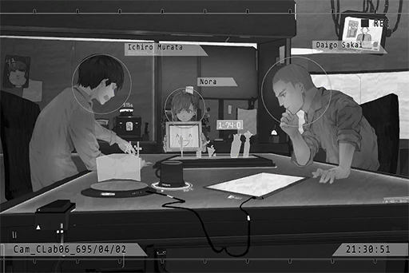

# Cam_CLab06_695_04_02
## Requirements
|Character|Level|
|---------|:---:|
|**Nora** |  9  |

## Log Content

**[Nora]** 
*Hahaha! Ichiro, you are so dumb!*

*\[Nora Emotion\]*

**Member I** 
Argh\~ I lost again! It's practically impossible to beat Nora!

**Member D** 
How are you feeling right now after being utterly destroyed by a five\-year\-old?

**Member I** 
Shut up! If you're so good, why don't you challenge her! She is definitely not your average five\-year\-old...

**[Nora]** 
*If so, how about we stop playing chess and switch to a game that relies solely on luck? That way, it's fair to everybody.*

**Member D** 
Ho? Not a bad idea. Lemme find one.

**Member I** 
If it's only about luck then I won't lose!

**Member D** 
That I can't disagree with... your luck scares me sometimes... I can never understand why someone as dumb as you ever got a job in this place.

**[Nora]** 
*Haha, that's mean.*

**Member I** 
Damnit... 
Oh, right! Have you heard Nora's new song? It's really dope!

**[Nora]** 
*That song's still unfinished...*

**Member D** 
Then show it to me after you've finished it. I am looking forward to it a lot. 
Nora is truly amazing. She can compose music AND she is knowledgeable in mechanical engineering.

**[Nora]** 
*Both mechanical engineering and programming are taught to me by Phoenix. I hope I can grow up to be someone like him. If I can be a musician as a side gig, even better.*

*\[Nora Emotion\]*

**Member I** 
Grow up...

**Member D** 
Hmm, you definitely can. We will offer you our wholehearted support.

**Member I** 
Ah... that's right! Nora's going to be even more amazing after she grows up!

**Phoenix** 
Hey, break time's over. Get back to work. Nora, you're sleeping in the silent chamber tonight. You should rest early.

**[Nora]** 
*... OK.*

*\[Nora Emotion\]*

**Member I** 
Can't help it then. We'll play again tomorrow!

**[Nora]** 
*Sure. I will not lose!*

*[→Signal Switch to Nora'sRoom]*

**Phoenix** 
The setting is complete. You can enter the silent chamber now.

**[Nora]** 
*It's really hard to sleep in this. It's cramped and dark inside...*

**Phoenix** 
I know. This is all to stabilize your symptoms of nosebleed and epilepsy that occasionally occur during your sleep. Just hang in there. Do you still get nightmares these days?

**[Nora]** 
*Uh\-huh... I still do sometimes, but they are a lot less scary now.*

**Phoenix** 
Try and see if you can remember the contents of your dream. It is also helpful for our research. Maybe we can discover something from your dreams. 
Alright, time for you to sleep.

**[Nora]** 
*OK, understood. 
I want to drink some water before I sleep... Ah, I left my water bottle in the break room. can I go get it?*

**Phoenix** 
Sure. Can you go on your own?

**[Nora]** 
*Yes.*

*[→Signal Switch to CLab06]*

**[Nora]** 
*Water bottle water bottle...*

**Member I** 
Poor Nora... I don't know what to reply after hearing that.

**Member D** 
You mean the "grow up to be like Phoenix" part? Ha... She has no idea about the crap ton of horrible things director has done.

**Member I** 
Despite that, at least she still has her dreams.

**Member D** 
You're way too sentimental. If you want to stay here, you should keep your emotions in check. If not, you're going to constantly feel terrible.

**Member I** 
Don't you have even some feelings for her!?

**Member D** 
... We are simply following our orders to take care of her. Don't think too much.

**Member I** 
We only have a few months left. Judging by our current progress, there's a very high chance that she'll be scrapped...

**[Nora]** 
*... Scrapped!?*

**Member D** 
I don't want to as well... We've already tried our best. After all, she is nothing more than a mere test specimen...

*\[Bottle drops\]*

**Member D, Member I** 
!?

**[Nora]** 
*... I'm here... to get my water bottle.*

**Member I** 
Nora!

**[Nora]** 
*I'm going to bed now! Goodnight.*

**Member D, Member I** 
......

*[Signal Lost]*
