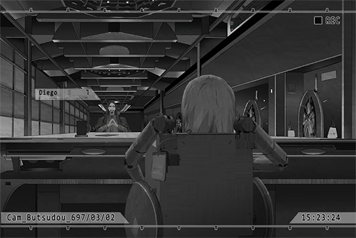

# Cam_Butsudou_697_03_02
## Requirements
|Character|Level|
|---------|:---:|
|**Nora** | 13  |

## Log Content
*\[Door Opens\]*

**Lam** 
Go in. I'm surprised that you didn't even bring a single bodyguard.

**Diego** 
Manson, we're old friends. What is there for me to be scared about?

**Lam** 
You have a point. Take a seat.

**Diego** 
Greetings, Kyuu Hou Kai's "The Eye of Horus". Turns out you're such a cute little girl. I am flabbergasted.

**Nora** 
......

**Phoenix** 
You only have ten minutes. You better not waste any time.

**Diego** 
Of course. 
Then... I would like to know the trends of Node 08 Administration Bureau's gang purge. Can you do that?

**Lam** 
Concerned about the safety of your gang members? I expect no less from the Consigliere of the Baro Brotherhood.

**Diego** 
You can look at it that way... All\-knowing eye, I shall be in your care.

**Nora** 
...... (Nods)

*[»»» Fast Forward»»»]*

*\[Prints document\]*

**Nora** 
...... (Hands out document)

**Lam** 
... This is the white paper for Node 08 Administration Bureau's gang purging operations. Secrets don't get more secretive than this.

**Diego** 
This is perfect... 
Not just the deployment strategy of the agents, even the baits they spread online are all listed here.

**Lam** 
As long as they avoid these fake transactions, your people will be safe and sound.

**Diego** 
Or, I could utilize these baits...

**Lam** 
What?

**Diego** 
Nothing... I'm very impressed. This is the exact information I am looking for. My long trip to Node 03 is already well worth the price.

**Phoenix** 
Just a quick reminder; this document is not allowed to be taken out of this room. You better memorize the whole thing before your time is up.

**Diego** 
No need to worry, Mr. Phoenix. I've memorized it all. 
On a side note, there's still some time left, right?

**Phoenix** 
Two minutes.

**Diego** 
Then I would like to ask another favor to the All\-knowing eye. I want to take a look at the access record of one of Baro's firearms management files. The serial number is BW0875\-32A.

**Phoenix** 
Access record?

**Diego** 
Yes. A few days ago, there was an unauthorized copy of the files. However, due to the highly\-classified nature of the files, I was unable to track it. I want to know the gang member who accessed the files.

**Nora** 
...... (Nods)

*[»»» Fast Forward»»»]*

**Nora** 
...... (Hands out document)

**Diego** 
It's Liang, eh... He is a trusted subordinate of our Boss, and he is also under my direct command. So he's the one... I get it now. 
Apologizes. Please allow me to send a quick message.

**Phoenix** 
......

*\[Message Sent\]*

**Lam** 
Hey. Don't try to act sneaky in front of my eyes. What order did you give and who did you give it to?

**Diego** 
Nothing serious. Just some... family business. Rest assured, it's business that has nothing to do with Mogura. 
My time should be almost up, right? Thank you very much for your help.

**[Nora]** 
*......*

**Diego** 
In the future, Baro's going to require your help. We have our roots here. We will definitely carry on Mogura's soul in Node 08 and create even greater benefits.

**Lam** 
Certainly. I have great expectations for you. Don't let me down.

*\[Door Opens\]*

**Nora** 
... *\*Sobs\**...

**Phoenix** 
Nora? Why are you crying?

**[Nora]** 
*Out of curiosity, I took another look with my ability... That Liang, just now, he's already...*

**Phoenix** 
... Already dead, right?

**Phoenix** 
... It appears that this Diego guy already has several people he's suspecting under watch. He orders the execution of the target the moment he knows the truth.

**[Nora]** 
*... Why?*

**Phoenix** 
Probably to use Liang's treason as a way to frame Baro's boss and seize this opportunity to take over the entire gang.

**[Nora]** 
*It's all my fault...\*Sobs\*...*

**Phoenix** 
... You shouldn't think like that. Even without you, these people are going to die someday. As long as we're mortal, we cannot escape death. Whether we're good or evil, our end will always be the same. 
Nora, get some rest. Don't look at the aftermaths of your fortune telling. Also, in times where you are not in this booth, don't use your ability.

**[Nora]** 
*... Got it...*

*[Signal Lost]*
