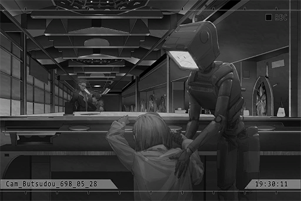

# Cam_Butsudou_698_05_28
## Requirements
|Character|Level|
|---------|:---:|
|**Nora** | 19  |

## Unlocked Charts
|         Song          |Character|Diff.|Level|
|-----------------------|:-------:|:---:|:---:|
|**Jakarta PROGRESSION**|  Nora   |Chaos| 14  |

## Log Content
*\[Door Opens\]*

**Lam** 
Go in.

**[ROBO_Head]** 
*Mr. Kusu Hayato. Greetings. 
You have, one minute.*

**Lam** 
This is the first time I see someone buying just one minute.

**Hayato** 
This is all I can afford... 
So the fortune telling is done using this robot...?

**[ROBO_Head]** 
*This unit, a proxy agent. This one here, the one you are going to talk to.*

**Hayato** 
... So this little girl... is "The Eye of Horus"?

**[Nora]** 
*......*

**[ROBO_Head]** 
*Timer start. Please ask your question.*

**Hayato** 
I... A very important friend of mine went missing. I want to know where she is. No matter the result, please tell me! Her name is "Kaori Minamiya". This is her photo... The last time I saw her was four years ago on the night of April 25th. We were performing on Wolong Street...

**[ROBO_Head]** 
*Message received.*

**[Nora]** 
*......*

**Hayato** 
......

**[Nora]** 
*...... Ugh... She's... not here...*

**Hayato** 
......

**[Nora]** 
*......!?*

**Hayato** 
Hey!? Are you alright!? Your nose is bleeding!

**[ROBO_Head]** 
*Time is up. Thank you for using the service of the All\-knowing eye. The exit is at the rear right.*

**Hayato** 
Eh...? I haven't gotten anything...

**[Nora]** 
*Huff... Puff...*

**Lam** 
Alright. This is your one minute.

**[Nora]** 
*W... wait a second. I'm willing... to see a bit more for this young man.*

**[ROBO_Head]** 
*Reminder: Customer funds insufficient.*

**[Nora]** 
*It's okay.*

**[ROBO_Head]** 
*Warning: Level of ability use reaching Nora's critical point.*

**[Nora]** 
*ROBO, it's okay... 
This person... is different from the other people who came to get their fortune told. 
I want to help him... Besides, just now...*

**[ROBO_Head]** 
*If Nora said so, this unit understand.*

**[Nora]** 
*Are you okay with it? Uncle Lam.*

**Lam** 
... Whatever you please.

**Hayato** 
Really!? Thank you so much...!

**[Nora]** 
*......*

*[»»» Fast Forward 5 Minutes»»»]*

**[Nora]** 
*... Ugh... Argh...*

**Hayato** 
Hey! Forget about it! You look really pale! 
I'm fine now! You can stop looking!

**[ROBO_Head]** 
*Warning: Level of ability use exceeding Nora's limit. Please stop immediately!*

**[Nora]** 
*Just... a little more...*

*\[Things knocked down\]*

**Hayato** 
Hey! Are you alright!?

**Lam** 
Hey brat, what are you doing? Stay where you are and don't move a finger.

**Hayato** 
She fainted!

**Lam** 
I'll check her out. You sit there and wait. 
... Is she alright?

**[ROBO_Head]** 
*Situation: Life\-threatening conditions, negative. Consciousness, clouded.*

**[Nora]** 
*Umm... I'm fine. 
Mr. Kusu...*

**Hayato** 
Ah, yes!

**[Nora]** 
*This person you're looking for... who is she...?*

**Hayato** 
Eh? She's my childhood friend. We grew up together. She's a very normal girl... 
Did you see anything? What are the results!?

**[Nora]** 
*Apologies... This fortune telling process is very different from anything I've experienced before... The things I saw were very limited. Nevertheless, I can tell you, that she's still alive at this moment.*

**Hayato** 
... For real!? Thank goodness!

**[Nora]** 
*... Node 08. She is right there...*

**Hayato** 
Node 08!?

**[Nora]** 
*Yes... This is the most... I was able to see...*

*[Signal Lost]*
