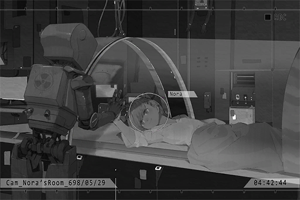

# Cam_Nora_698_05_29
## Requirements
|Character|Level|
|---------|:---:|
|**Nora** | 21  |

## Unlocked Charts
|    Song    |Character|Diff.|Level|
|------------|:-------:|:---:|:---:|
|**Eternity**|  Nora   |Easy |  3  |
|**Eternity**|  Nora   |Hard |  7  |
|**Eternity**|  Nora   |Chaos| 11  |

## Log Content
**[Nora]** 
*Umm...*

**[ROBO_Head]** 
*Observation: Nora has awakened. Proceed with follow\-up diagnosis. 
Nora, question. How many fingers do you see?*

**[Nora]** 
*... Two. By the way, you're not even a medical robot. What the heck are you doing? Haha... I'm fine... Ugh!*

**[ROBO_Head]** 
*Consciousness normal. Intracranial pressure, still too high. 
Decision: rest required. 
Nora, please close your eyes. This unit will activate the silent chamber isolation system...*

**[Nora]** 
*Wait a minute...*

**[ROBO_Head]** 
*Nora's physical condition, at critical point. Rest required...*

**[Nora]** 
*It's okay... Please, ROBO... 
Can you... talk with me for a bit?*

**[ROBO_Head]** 
*... Instruction received, Nora.*

*\[ROBO_Head sits down\]*

**[Nora]** 
*Back then... I fainted while using my ability, right?*

**[ROBO_Head]** 
*Affirmative. 
Nora, lost consciousness back there. Similar symptoms as previous incidents. However, cranial nerves suffered extremely severe pressures. Exceeded past critical points. If not for Phoenix's emergency treatment, could be life\-threatening.*

**[Nora]** 
*No, this time... it's very different from anything I've experienced...*

**[ROBO_Head]** 
*Please describe in detail.*

**[Nora]** 
*I... I haven't even told Phoenix about this either. Sometimes, when I'm using my ability, I'll see the following scenery... It's like I dived into a deep, deep ocean. It was really dark around me, with the exception of some bizarre lights flowing around. There's usually nothing in that space... but not this time. I saw...*

**[ROBO_Head]** 
*Nora saw, what?*

**[Nora]** 
*... A person... crying...*

**[ROBO_Head]** 
*Nora's description, multiple logical fallacies detected. Possible explanation: dreams or hallucinations. 
High intracranial pressure often leads to dizziness and cognitive disorder for humans. This unit, decision, Nora's condition, 99% match with this description.*

**[Nora]** 
*I see...*

**[ROBO_Head]** 
*This unit, strong suggestion: This unit, decision, Nora is no longer suitable to perform fortune telling. Should quit immediately.*

**[Nora]** 
*...... 
ROBO... Are you... angry?*

**[ROBO_Head]** 
*... Decision unavailable.*

**[Nora]** 
*You have emotions. I know that very well.*

**[ROBO_Head]** 
*... Nora is fully aware of the dangers her conditions possess, yet still continues to use her ability beyond the critical point. This unit's main purpose is to protect Nora's life from potential dangers. Yet Nora constantly indulged in actions that go against said purpose. 
This unit, can't understand.*

**Nora** 
......

**[Nora]** 
*ROBO, do you know where people will go after they died?*

*\[Loading Sounds\]*

**[ROBO_Head]** 
*From scientific angle, after human dies, the body will be disintegrated into nutrients. Will then supply other creatures within the soil with resources to live. 
This is, part of the cosmic energy cycle.*

**[Nora]** 
*You're referring to the physical body, but the physical body does not represent humans as a whole.*

**[ROBO_Head]** 
*The other part Nora mentioned, according to data, speculate to be human consciousness. However, as of now, humans yet to discover storage unit for consciousness within human body. Preservation, difficult.*

**[Nora]** 
*Perhaps, but I have this feeling... That the answer... is not too far away from me.*

**[ROBO_Head]** 
*This unit, don't really understand, what Nora wants to express.*

**[Nora]** 
*I'm sorry... I don't really understand myself too... 
Maybe I just want to tell you, that death... does not erase a person's trace from the world completely. People can "live" in other forms, not just physically.*

**[Nora]** 
*The spirit, the mind, the memories... All of them are proof of a person's existence...*

**[ROBO_Head]** 
*......*

**[Nora]** 
*Haha... What am I mumbling about? Bunch of nonsense... I must be really exhausted.*

**[ROBO_Head]** 
*This unit, activate silent chamber for Nora...*

**[Nora]** 
*Sorry, but just a few more minutes...*

**[ROBO_Head]** 
*......!*

**Nora** 
...... (Nods)

**[ROBO_Head]** 
*......*

**[Nora]** 
*As I expected, you can understand what I meant, ROBO... I'm so glad that I have you by my side.*

**[ROBO_Head]** 
*... Nora, please enjoy your sleep.*

*\[Silent chamber activated\]*

**[ROBO_Head]** 
*......*

*\[ROBO_Head emotion\]*

**[ROBO_Head]** 
*......*

*[Signal Lost]*
