# Nora OS Logs
## <a id="toc"/>List of Logs
- [\[#001\] Audio\_Trans\_08\_698\_06\_04](#noos001)
- [\[#002\] Cam\_Robo\_697\_04\_06\_1](#noos002)
- [\[#003\] Cam\_ARC\_688\_09\_02](#noos003)
- [\[#004\] Audio\_ABO03\_688\_12\_06](#noos004)
- [\[#005\] Audio\_Butsudou\_690\_11\_20](#noos005)
- [\[#006\] Cam\_Robo\_697\_04\_06\_2](#noos006)
- [\[#007\] Audio\_ShinShenSt\_691\_01\_15](#noos007)
- [\[#008\] Audio\_KyuuLab\_691\_01\_23](#noos008)
- [\[#009\] Audio\_???\_691\_01\_23](#noos009)
- [\[#010\] Cam\_Robo\_697\_04\_06\_03](#noos010)
- [\[#011\] Cam\_KyuuLab\_691\_01\_25](#noos011)
- [\[#012\] Audio\_Nora\_694\_03\_08](#noos012)
- [\[#013\] Audio\_Butsudou\_694\_09\_08](#noos013)
- [\[#014\] Cam\_Nora\_695\_03\_03](#noos014)
- [\[#015\] Audio\_Nora\_695\_03\_16](#noos015)
- [\[#016\] Cam\_CLab06\_695\_04\_02](#noos016)
- [\[#017\] Audio\_Dash\_695\_05\_03](#noos017)
- [\[#018\] Audio\_KyuuLab\_695\_05\_08\_1](#noos018)
- [\[#019\] Audio\_KyuuLab\_695\_05\_08\_2](#noos019)
- [\[#020\] Cam\_Robo\_697\_04\_06\_4](#noos020)
- [\[#021\] Cam\_Butsudou\_697\_03\_02](#noos021)
- [\[#022\] Audio\_Butsudou\_697\_03\_14](#noos022)
- [\[#023\] Audio\_Robo\_697\_04\_06\_5](#noos023)
- [\[#024\] Audio\_Butsudou\_698\_04\_13](#noos024)
- [\[#025\] Cam\_Nora\_698\_04\_13](#noos025)
- [\[#026\] Cam\_Nora\_698\_04\_28](#noos026)
- [\[#027\] Cam\_Butsudou\_698\_05\_28](#noos027)
- [\[#028\] ?͜͠͝?͝҉̢͜͏?̶̀](#noos028)
- [\[#029\] Cam\_Nora\_698\_05\_29](#noos029)
- [\[#030\] Log\_Phoenix\_698\_06\_01](#noos030)
- [\[#031\] Cam\_Butsudou\_698\_06\_02](#noos031)
- [\[#032\] Cam\_KyuuLab\_698\_06\_02](#noos032)
- [\[#033\] Cam\_Robo\_698\_06\_02](#noos033)

## <a id="noos001"/>\[#001\] Audio\_Trans\_08\_698\_06\_04
### Log Content
**Cleaner A** 
Sir... Sir...?

*\[ROBO_Head  Start-Up\]*

**[ROBO_Head]** 
_This unit, start\-up, success. Running self\-diagnostics... incomplete. 
Detect multiple physical damages on hardware._

**Cleaner B** 
What the heck? A proxy robot? 
This train has already ended service for the day. Please leave the carriage. We need to clean up.

**[ROBO_Head]** 
_...... 
Question: This location... coordinates... ?_

**Cleaner A** 
Huh? This is Node 08. Where are you connected to? Can you hear us, owner of this robot? Please get this thing moving.

**[ROBO_Head]** 
_...... 
Where is Nora?_

**Cleaner B** 
Huh? What? Is it broken? 
What should we do? Contact the station staff?

**Cleaner A** 
Yeah. This is platform B. We've discovered a malfunctioning proxy robot. It seems to be disconnected from its owner. We are having trouble dealing with it. Please send someone over to help...

**[ROBO_Head]** 
_Apologies._

*\[Footsteps\]*

**Cleaner B** 
Eh? HEY!

_\[→Signal Switches\]_

**[ROBO_Head]** 
_Inputting activity planning... 
Operation/Action denied; reasoning: conflict with supreme command._

**[ROBO_Head]** 
_......_

**[ROBO_Head]** 
_Inputting activity planning... 
Operation/Action denied; reasoning: conflict with supreme command._

**[ROBO_Head]** 
_......_

**[ROBO_Head]** 
_Loading Local.log...... 100% 
Previous Shutdown: 698/06/02 
23:16:50'23" 
During shutdown, one video message recorded: 
Cam\_Robo\_698\_06\_02_

**[ROBO_Head]** 
_......_

**[ROBO_Head]** 
_Play video: Cam\_Robo\_697\_04\_06\_01_

**[ROBO_Head]** 
_......_

**[ROBO_Head]** 
_Replay invalid. 
Memory unit reset error. Please select other files for troubleshooting._

**[ROBO_Head]** 
_......_

**[ROBO_Head]** 
_Play video: Cam\_Robo\_697\_04\_06\_01_

**[ROBO_Head]** 
_Begin replay._

_\[Signal Lost\]_

[*(Click here to go back to the top)*](#toc)

## <a id="noos002"/>\[#002\] Cam\_Robo\_697\_04\_06\_1
### Log Content
*\[ROBO_Head Start-Up\]*

**[ROBO_Head]** 
_......_

**[ROBO_Head]** 
_This unit, start up, success. Self\-diagnostics complete._

**[Nora]** 
_Unit 02, can you hear my voice?_

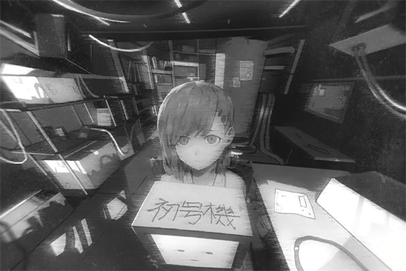

**[ROBO_Head]** 
_This unit, condition: available to accept commands. Command requested._

**[Nora]** 
_...... Don't reply like this. 
Can you hear my voice? \[ROBO\_Head\]._

**[ROBO_Head]** 
_......_

**[ROBO_Head]** 
_I can. This unit. can hear your voice._

**[Nora]** 
_Good. ROBO...... I'll call you ROBO then. 
Can you describe your own identity first?_

**[ROBO_Head]** 
_This unit, fully automatic robot with artificial intelligence system equipped, identification code "ROBO\_Head \- Unit 02"._

**[Nora]** 
_Great! The system is functioning properly. 
Hello ROBO, I am the person who created you. You can call me Nora._

**[ROBO_Head]** 
_Affirmative \-Nora\- 
According to memory data, this unit, created, to, protect Nora._

**[Nora]** 
_Not just me... There's another person I want you to protect as well. Don't let him get injured no matter the circumstances._

*\[Loading Sounds\]*

**[ROBO_Head]** 
_Searching database... Search failed. 
Decision: Insufficient information 
Nora, please provide additional information, of second target to protect._

**[Nora]** 
_His information is top secret and therefore not registered in the database... That's why you didn't know. 
It's okay; you can hear it directly from me, ROBO._

**[Nora]** 
_The name of that person is..._

_\[Signal Lost\]_

[*(Click here to go back to the top)*](#toc)

## <a id="noos003"/>\[#003\] Cam\_ARC\_688\_09\_02
### Log Content
**[Leo]** 
_Phoenix, based on the aforementioned reasons, you are relieved of your position as Director of the A.R.C. technology department, effective immediately. You can go clear out your office now._

**Noah** 
Fellow committee members! Please wait! This is too...

**Phoenix** 
Noah, it's okay.

**[Leo]** 
_... The meeting is now over._

*\[Door Opens\]*

**Noah** 
Director!

**Phoenix** 
That's more or less it. I'll go clear out my stuff.

**A.R.C. Employee A** 
So that Phoenix really got fired...

**A.R.C. Employee B** 
It's just a matter of time. He really went overboard this time, going directly against the higher\-ups like that.

**A.R.C. Employee A** 
Isn't the person following him a very likely candidate for the next director? 
Maybe he's the one who ratted  on Phoenix...

**Noah** 
What are you people mumbling about!?

**Phoenix** 
Noah! I'm sorry, I have a bit too much stuff. Can you give me a hand here?

**Noah** 
Ok...

_\[→Signal Switches\]_

**Noah** 
Being insulted like that... How come you're not angry about it at all!?

**Phoenix** 
Saying that you're the rat, that is certainly too harsh. I don't believe that you're the one who told on me.

**Noah** 
That's not what I'm talking about! Firing you just like that, I can't accept it!  
There must be other methods, right? The other members of the team will definitely help out as well!

**Phoenix** 
Back during the HR meeting, of the multiple accusations made against me by the higher\-ups, can you rebut even a single one of them? 

**Noah** 
Ummm... I... But, director, your ideals...

**Phoenix** 
Everything they said is an undeniable fact. Since they can't accept my way of doing things, there is no point for me to continue staying here either.

**Noah** 
Node 08's A.R.C. is the most technologically advanced and most resource\-rich organization in the entire world. Where else can director go after you leave here?

**Phoenix** 
Haha, you're still too young, Noah. How old are you this year? 24?

**Noah** 
Just turned 24...

**Phoenix** 
_\*Chuckles\*_, Several mistakes you made there. First of all, this is not the most resource\-rich place in the world. What you see is merely the surface. Secondly, if you really think I have nowhere to go once I leave here, you're seriously underestimating me.

**Noah** 
I would never... Director is the one person I worship the most on my career path as a researcher! 
Then where do you plan to go after this? Please, let me come with you too!

**Phoenix** 
Hmm... At first, I was considering taking you and other talented folks in the team with me. However, I decided to scrap that idea.

**Noah** 
Eh? Why? I'm sure the other members will be more than willing to follow you too. 
None of us would want to stay in a team without director...

**Phoenix** 
Noah, you still got a family to feed, don't you?

**Noah** 
Oh...

**Phoenix** 
This... What I'm going to tell you next will be a shared secret between us. The path I plan to walk next... will be extremely brutal. You can even say that there's nothing honorable about it...

**Noah** 
... Eh?

**Phoenix** 
Our research of the "Virus" is something that can no longer be done here. The company's stance is firm; and to be fair, I can understand where they are coming from too. Therefore, I would also advise you to stay out of this from now on.

**Noah** 
I can't do that!? You've been working so hard on it for so many years...

**Phoenix** 
I will find the breakthrough point on the other side of the world.

**Noah** 
It can't be...

**Phoenix** 
Exactly; only in "that place" will I no longer be restricted by laws and morals. I can perform my research with no limitations at all. This is something I have to conquer on my own.

**Noah** 
...... 
... I... I also...

**Phoenix** 
Don't fool yourself. For someone who gets nightmares after dissecting a frog, I don't think you can handle the things I'm going to do in the future.

**Noah** 
......

**Phoenix** 
... Do you still remember the incident eight years ago? The one where a drone lost control and accidentally killed a civilian?

**Noah** 
Yes. I remember the victim's name is Carly... something?

**Phoenix** 
Carly Pauline. The drone that malfunctioned was a model LE\-110 that belonged to the Administration Bureau. 
On the same day, in the forbidden area just outside of 08, an exploration team member, Jack Edwards, died from the "Virus"...

**Noah** 
Jack Edwards... I remember seeing this name on the medical records...

**Phoenix** 
Back then, the two news reports were released almost simultaneously. However, almost nobody cared about the death of this exploration team member. The only news people seemed to care about was the one where a drone murdered a human.

**Noah** 
Indeed. Back then, not even I knew about this incident...

**Phoenix** 
You know what's ironic? The information that later helped fix the malfunctions in LE\-110 was discovered by none other than Jack Edwards. The modified LE\-112s are still in service at the Administration Bureau to this very day as well. So far, they haven't had any issues and has protected many civilians.

**Noah** 
Wha...

**Phoenix** 
The mass public tends to not think about the hidden meanings behind these kinds of incidents. They only care about the things that are happening in front of their eyes... Back then, the ensuing panic, the mistrust towards technology, all that are major obstacles for the advancement of science. That's a responsibility we must shoulder as well.

**Noah** 
......

**Phoenix** 
We humans have the power of "knowledge". That's why it's our duty to make the world a better place. For the purpose of a long\-term goal, I chose a path that is not only extreme and dangerous but could also involve crimes. However, even though that's my choice, it does not mean the things we are doing here is simply obsolete.

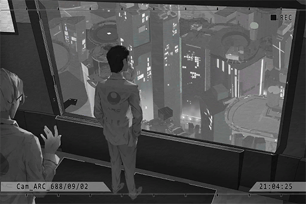

**Noah** 
......

**Phoenix** 
A.R.C.'s technology is still a trusted and hopeful beacon for the current society. 
Noah, you're a young man with great potential. You shouldn't go on this mad journey with me. After my departure, you will be the most capable member of the team. Please, take care of them for me.

**Noah** 
Director...

_\[Signal Lost\]_

[*(Click here to go back to the top)*](#toc)

## <a id="noos004"/>\[#004\] Audio\_ABO03\_688\_12\_06
### Requirements
|Character|Level|
|---------|:---:|
|**Nora** |  2  |

### Log Content
**Lam** 
... Hmm, this is without a doubt an impressive resume and proposal. 
I'll be honest with you; we don't need this resume at all. The name "Phoenix Wyle" speaks for itself among researchers. Your reputation far precedes you.

**Phoenix** 
I'm flattered. I've also heard plenty of good things about Mr. Lam in the past.

**Lam** 
Don't be so polite. I am the head of Node 03's Administration Bureau. Of course you would know me.

**Phoenix** 
Certainly. Apologies for my intrusion.

**Lam** 
Also, skip the honorifics. Is this some sort of stereotype people of Node 08 have towards Eastern cities...? 
That's not how we do things here. Here, power is everything. The amount of respect you get is determined by how much "contribution" you can make. 

**Phoenix** 
......

**Lam** 
So when I said that "We don't need this resume" just now, I believe you've mistaken what I truly meant.

*\[File Deleted\]*

**Phoenix** 
......!?

**Lam** 
If you really thought these fancy words will get you access to "our" resources, I advise you to throw that naivety in the trash and think again.

**Phoenix** 
.... I have no intention to do that. However, with all due respect, judging by the current technology level of Node 03, you guys will absolutely need someone like me. My background in...

**Lam** 
I said it already. Over here, power is everything. Your past, background, achievements... we don't care about any of them. 
You must use your own methods to prove your worth and show how much "value" you can bring us. 
Did you really think we don't have any former A.R.C. people here? Why can't they survive? Simple, because they have no value to speak of. This is Node 03's way of life..

**Phoenix** 
Umm...

**Lam** 
Don't get me wrong; I've read all your research papers. As a scientist myself, I personally still have great admiration for the ideals you represent. 
But, under our "rules", the way you are now is nothing more than a tiny "fledgling" clinging on to a flimsy branch. It only takes a light breeze for you to fall down the tree and die a horrible death.

**Phoenix** 
......

**Lam** 
Please leave. Right now, you are not qualified to meet our boss.

**Phoenix** 
... Tch.

**Lam** 
However, I do sincerely hope... that our next meeting will be one where we are the ones to schedule it. You're a very smart man; you should know what I mean by that.

**Phoenix** 
... Understood.

**Lam** 
Don't get yourself killed. Node 03 isn't exactly kind to big city folks like you.  
I look forward to your growth, Mr. Phoenix. _\*Chuckles\*_...

_\[Signal Lost\]_

[*(Click here to go back to the top)*](#toc)

## <a id="noos005"/>\[#005\] Audio\_Butsudou\_690\_11\_20
### Requirements
|Character|Level|
|---------|:---:|
|**Nora** |  2  |

### Log Content
**Lam** 
So we meet again. In less than two years... judging by your face, you must've been through a lot between our two meetings, haven't you? You certainly didn't disappoint me.

**Phoenix** 
......

**Lam** 
And those masked people behind you are...?

**Phoenix** 
These eight people are my "team members".

**Lam** 
...... Boss can meet you only. Those who don't show their face are not allowed to go inside. They must wait outside.

**Phoenix** 
We are a team. Without them, we couldn't complete the projects you people are interested in. They are going inside together with me.

**Lam** 
... You don't want to annoy me.

**[Ryu]** 
_Manson, it's fine. Let them in._

**Lam** 
......

**Phoenix** 
Thank you. Since they made a compromise... you guys, take off your masks.

**Lam** 
......!

**Lam** 
... No wonder... Haha, I see. Being able to organize these people... not bad, not bad at all. Looks like you've truly gone above and beyond my expectations...

**Phoenix** 
... Enough with the chit\-chat. Let us in so we can talk business.

**Lam** 
Of course. We would like you to clear the security check first. This way, please.

_\[→Signal Switches\]_

**Ryu** 
... So you're Phoenix?

**Phoenix** 
I'm guessing that you're "Ryu"? The actual leader of "Mogura".

**Ryu** 
You can say that.

**Phoenix** 
Doesn't see anyone who refuses to show their face, yet covers up your own face. Nice fair rule you got there.

**Ryu** 
Haha, I like your attitude. It's different than those spineless cowards out there. 
But, that's not the point today. The thing I'm interested in is your "merchandise".

**Phoenix** 
Of course. I'm not here to be a sleazy salesman either. We'll ignore the ones that don't make money and jump straight to the big guns. I know what you guys want to see the most. Hey, open it up.

*\[Device Door Opens\]*

**Lam** 
......!!

**Ryu** 
So the rumors are true...

**Phoenix** 
W... Where am I? W... who are you guys!?

**Phoenix** 
As you can see right now, appearance, voice, hair, fingerprint, all perfectly replicated. You can take a look at the scanners. The ID and personal information displayed are all mine as well. Even the latest biometric system at Node 08's Administration Bureau can't tell the difference.

**Phoenix** 
H... Help! Please, let me go!

**Lam** 
This really is a perfect copy... Even the scars on your face... Unbelievable...

**Ryu** 
This person is...?

**Phoenix** 
A random male sample we seized from the downtown area. This is how he originally looked and some basic information. You can see that his age, height, weight are all completely different. As long as the blood type and gender are the same, we can pretty much achieve a result like this all the time.

**Ryu** 
... Nonetheless, rumors are still rumors. This could be your twin brother that nobody knows about, right?

**Lam** 
......

**Phoenix** 
_\*Chuckles\*_, I surely didn't expect such a dumb question to come from someone as smart as you. 
However, it's about time we conclude this demonstration.

*\[Gunshot\]*

**Phoenix** 
Argh!!

**Lam** 
......!?

**Phoenix** 
Although killing him doesn't completely rule out the possibility of what you brought up, it does show that I can make them as much as and whenever I want. Of course, making these things cost a fortune. Do you understand what I'm saying?

**Ryu** 
......

**Lam** 
... You bastard! How dare you bring a gun inside!

**Phoenix** 
Ho? This is another one of our merchandises, but compare to a perfect human replica, I felt that you guys probably don't have much interest in it, hence why I didn't bother to tell. Your security check devices are quite the ancient pieces of trash.

*\[Applaud\]*

**Ryu** 
_\*Chuckles\*_... Hahahaha! Excellent! You're quite the man!

**Lam** 
......

**Ryu** 
No need for another word. We've all seen the business opportunities you created in the past year. You have certainly proven your worth to Mogura. 
Speak. What are your conditions?

**Phoenix** 
I want to establish a science research organization in Node 03 with us 9 at the helm. Under your investment, you get to use all of our current inventions and their subsequent mass productions. However, in return, 60% of the income profit from those inventions will belong to us as funds for our own research. You can have the remaining 40%. In addition, you also have to provide the group's privileges and services in Node 03 for us to utilize.

**Ryu** 
Not a problem. Manson, prepare the contract. I'll let you handle the documents.

**Lam** 
Yes, boss.

**Phoenix** 
You're pretty forthright yourself too.

**Ryu** 
Do you have a name for your organization?

**Phoenix** 
Is that what you care about...? Nothing particular comes to mind right now.

**Ryu** 
Phoenix... \[Kyuu Hou Kai\], that shall be your name. We will be a combo of the "Dragon" and the "Phoenix"!

**Phoenix** 
Whatever you please.

_\[Signal Lost\]_

[*(Click here to go back to the top)*](#toc)

## <a id="noos006"/>\[#006\] Cam\_Robo\_697\_04\_06\_2
### Requirements
|Character|Level|
|---------|:---:|
|**Nora** |  3  |

### Log Content
**[Nora]** 
_I want to test your comprehensive ability... Can you explain to me what you just heard? ROBO._

**[ROBO_Head]** 
_Nora wants, this unit, protect Nora and Phoenix, from any injury, no matter the circumstances._

**[Nora]** 
_You are correct. Looks like the cognitive system is functioning normally..._

**[ROBO_Head]** 
_Would like Nora, to allow this unit, to ask question._

**[Nora]** 
_Sure._

**[ROBO_Head]** 
_This unit wants to know, Nora and Phoenix, enemy, who are they. 
Who wants, to hurt, Nora and Phoenix?_

**[Nora]** 
_......_

**[ROBO_Head]** 
_Nora doesn't want to answer, this unit, will not ask._

**[Nora]** 
_... No. This is something I should tell you. 
I want you to protect us from the grasps of Mogura, Kyuu Hou Kai and other organizations._

**[ROBO_Head]** 
_Question, Mogura, provide Phoenix with resources; Kyuu Hou Kai, Phoenix's organization. Why, enemy? 
This unit, does not comprehend._

**[Nora]** 
_... I'm not sure whether you can understand this or not..._

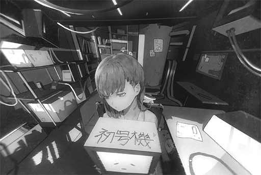

**[Nora]** 
_In this world, there are a lot of bad things; things that make people really, really sad... These organizations are using these bad things to obtain resources in order to achieve an even larger goal. Both Mogura and Kyuu Hou Kai are organizations like that as well_

**[ROBO_Head]** 
_Judgment base on received information so far, Phoenix, person like that, as well._

**[Nora]** 
_......_

**[ROBO_Head]** 
_This unit, decision, Nora, doesn't like them. 
Leaving them, benefits to both physical and mental. This unit, willing to assist, in proposed action._

**[Nora]** 
_... I can't leave here. Don't think about it anymore... 
Besides, I..._

**[Nora]** 
_......_

**[Nora]** 
_I myself... was born in an environment just like this._

_\[Signal Lost\]_

[*(Click here to go back to the top)*](#toc)

## <a id="noos007"/>\[#007\] Audio\_ShinShenSt\_691\_01\_15
### Requirements
|Character|Level|
|---------|:---:|
|**Nora** |  3  |

### Log Content
**Mogura Member A** 
Mr. Shiino.

**Citizen A** 
So you're here... Apologies for the troubles...

**Mogura Member A** 
No big deal. The "offerings" from your household have always been stable. We are more than happy to handle this little issue for you.

**Mogura Member B** 
Is she the one?

**Citizen A** 
Y... yes sir, exactly three months old.

**Mogura Member A** 
Does your wife know about this?

**Citizen A** 
No... I'll tell her that the child went missing. With our current financial situation... we might be unable to pay the next offerings if this keeps on...

**Mogura Member A** 
You don't need to say more. I understand. Here, these are your rewards. We appreciate your efforts.

**Citizen A** 
Woah, is this amount right...? Seems a bit much...

**Mogura Member A** 
For some reason, the demand for these things within the organization has been increasing. Hence why the offering prices are much higher than before. We pride ourselves on being trustworthy. Once we settled on a price, we will only give you more, never less.

**Citizen A** 
Thank you! Thank you so much!

*\[Electronic Branding\]*

**Mogura Member B** 
Serial number assigned.

**Mogura Member A** 
Hoho? Now this is not something you see every day.

**Citizen A** 
Is something wrong...?

**Mogura Member A** 
Usually when we do the branding, the child will bawl really hard. Can't blame them though; this hurts, a lot. 
This one, on the other hand... no reaction at all.

**Mogura Member B** 
Code No. 009. This one's going to the "Ravens", right?

**Citizen A** 
......

**Mogura Member A** 
Hey, idiot. Don't ask that stuff in front of the customer.

**Citizen A** 
Ravens... D, do you mean the Ravens of Kyuu Hou Kai!? May I ask what will happen to her...?

**Mogura Member A** 
If it's going to them, nobody knows.

**Citizen A** 
I heard rumors that they... do a lot of cruel experiments...

**Mogura Member A** 
And what has that got to do with you? You've already sold her, so don't pretend to care about her now, Mr. Shiino. 
Or have you changed your mind and decided to back out of this deal?

**Citizen A** 
No... I would never dare...

**Mogura Member A** 
Very well. The transaction is complete. Go home; your wife is still waiting for you.

_\[Signal Lost\]_

[*(Click here to go back to the top)*](#toc)

## <a id="noos008"/>\[#008\] Audio\_KyuuLab\_691\_01\_23
### Requirements
|Character|Level|
|---------|:---:|
|**Nora** |  4  |

### Log Content
*\[Punches Table\]*

**Kim** 
DAMNIT! Why!?

**Members** 
......

**Kim** 
Failed again... My calculations should be absolutely perfect...

**Member A** 
Brother Kim...

**Kim** 
Shut up! It's definitely because you guys screwed up!

**Member B** 
But we followed your orders for every step of the experiment...

*\[Door Opens\]*

**Phoenix** 
What's wrong?

**Member B** 
Ah, Boss...

**Phoenix** 
I told you not to call me Boss anymore. 
So, another failure, is it? ... Her legs are already starting to develop necrosis. I told you a long time ago that there is no chance for you to succeed on a specimen just three months old.

**Kim** 
F\*\*\*! Using this "Physical Enhancement" technology on adults is not just pointless, there's no challenge at all!  
One has to own this modification at all young age in order to realize its full potential! That's the whole point! Do you understand, you f\*\*\*\*\*\* moron?

**Phoenix** 
Hoho, talking the big talk now, aren't you?  
Should I give you a reminder about who rescued your sorry a\*\* from prison AND gave you the power to do whatever you want here? 

**Kim** 
... Tch.

**Phoenix** 
009... Wasn't this specimen just delivered here a few days ago? This is the ninth one already... Just because we gave you the budget doesn't mean you can go ahead and waste it like this. 
Mogura has been looking forward to the results of this project. Get your act together.

**Kim** 
Hmph, easy enough for you to say. After the facility was established, you've been doing nothing but studying "The Ender". Did you really think a research that couldn't be completed at A.R.C. will have even a slight chance in this s\*\*\*hole? Don't make me laugh...

*\[Equipment crashing\]*

**Kim** 
Ugh! Cough! Ak ak!!

**Members** 
......!

**Phoenix** 
I will not repeat myself again. Watch your mouth. If you p\*\*\* me off one more time, I will make sure that there are just seven Ravens left.

**Kim** 
I... I'm very sorry! Cough! Please let me go......

**Phoenix** 
Solving the mystery behind the virus is currently the entire organization... No, you can even say that it's the most important scientific breakthrough for humanity as a whole. We have ruins of human civilization all across this massive planet, yet right now our only way of life is to be locked inside the tiny Nodes and hang on for dear life. Have you ever wondered why? 
If we can allow the modern human race to expand our cultural significance to that of our " ancestors"...

**Kim** 
Cough cough......

**Phoenix** 
Forget it. For someone like you who's satisfied with your little toys, I'm casting pearls before swine.

**Phoenix** 
Physical Enhancement, you have to present something passable to Mogura in two months. If you can't, this side project will be handed off to someone else. I'm here to inform you this.

*\[Door Opens\]*

**Member A** 
Brother Kim... Are you alright?

**Kim** 
Leave me alone! Damnit...

**Members** 
......

**Kim** 
I don't get it! That bastard Phoenix produced nothing himself too, yet he's the only one who gets off scot\-free... F\*\*\*ing hell!

**Member B** 
As expected, it's way too difficult to produce results with just a dozen of us. We can ask the other Ravens for help...

**Kim** 
Shut up! Never in a million years! This is MY invention! Why should I share the glory with other people!? 
Discard 009 and other failed ones to the forbidden area. Tomorrow, we'll restart the experiments with 002.

**Member A** 
Okay...

_\[Signal Lost\]_

[*(Click here to go back to the top)*](#toc)

## <a id="noos009"/>\[#009\] Audio\_???\_691\_01\_23
### Requirements
|Character|Level|
|---------|:---:|
|**Nora** |  5  |

### Log Content
*\[Engines turned off\]*

**Member A** 
The area around here should get the job done.

**Member I** 
That was quite the temper tantrum Brother Kim threw back there...

**Member B** 
You must be new here, right? He does that a lot, but in reality, he doesn't have the balls to do anything. You'll get used to it.

**Member I** 
Wasn't he incarcerated before...?

**Member B** 
Yep, in Node 02. To be honest, all eight Ravens were scientists convicted of felonies in different Nodes. According to rumors, it was Phoenix who later got them out of prison and organized them to be a "team". He was then able to earn Mogura's trust, which led to the current Kyuu Hou Kai.

**Member I** 
He was able to organize eight criminals all by himself!?

**Member A** 
At least that's what I've heard, but it's very believable. Didn't you see Phoenix manhandling brother Kim's a\*\* back there? Haha, that was quite a sight.

*\[Crying\]*

**Member A** 
Just put them over here. 
Final confirmation. 001, 003, 004, 005, 008, 009... Good, all present.

**Member I** 
These... They're all still little...

**Member B** 
Hey, if you are in this business, I advise you to stop being sentimental, rookie. You're going to see A LOT of things like this in the future.

**Member I** 
So that's all we need to do? Just dump them here?

**Member A** 
Yep. Under direct exposure to the virus, they'll die in a few hours and become food for the beasts.

**Member I** 
... May I ask, why don't we just dump them outside the lab? Why do we have to take them all the way out of the city?

**Member A** 
Oh, about that, Mogura's leader —— Boss Ryu seems to be a very superstitious person. He is very devoted to stuff like "Taoism" and "Feng Shui" or something like that... In short, he doesn't mind having deaths during experiments, but he forbid us from storing or processing corpses there, saying that it will create "Yin energy"... I think?

**Member B** 
We can't just randomly dump them in the city either since it's bad for the organization's image. Therefore, the forbidden area that no one cares about is the best place for such things.

**Member I** 
Such a weird set of morals...

**Member B** 
Ha! You'll gradually realize this, that people who made it to the top of Node 03 are usually one step away from complete insanity.

**Member A** 
Let's go back. There's another batch tomorrow we need to dump. By the time of our next visit, what's left here could be piles of bloodied meat and bones. Rookie, you ok with that?

**Member I** 
... I'll be fine.

_\[»»» Fast Forward 23 Hours»»»\]_

*\[Engines turned off\]*

**Member I** 
... I'm ready!

**Member A** 
Relax. They're all dead. However, there don't seem to be a lot of creatures around here. Their bodies are still pretty intact...

**Member B** 
Haha, what, you freaking out, rookie? I bet the Yin energy here is super strong. Maybe they'll all become ghosts and haunt you forever!

**Member I** 
...N... Nonsense...

**Member A** 
... What are you, a child...

**？？？** 
Ahhh... Hmm...

**Members** 
WAHHHHH!!!! IT'S HERE!!!!

**？？？** 
Umm...

**Member A** 
... Hey, look at that...

**Member B** 
One of them is still alive!? It's... 009 from yesterday!

**Member I** 
... W, what should we do? Leave her out here for a few more days?

**Member A** 
Leave her out my a\*\*! Take her back to Phoenix! There's no way someone's still alive after being exposed to the virus for such a long time. She could have immunity!

_\[Signal Lost\]_

[*(Click here to go back to the top)*](#toc)

## <a id="noos010"/>\[#010\] Cam\_Robo\_697\_04\_06\_03
### Requirements
|Character|Level|
|---------|:---:|
|**Nora** |  5  |

### Log Content
**[Nora]** 
_That child... was me._

**[ROBO_Head]** 
_Searching database... Search complete. 
Summary on "The Ender" virus in forbidden area: Mortality rate 99.97%. No record of complete recovery. 
Nora survived, please explain, reason._

**[Nora]** 
_I don't really know why... But Phoenix often said that I am special. 
Phoenix allowed me to live here because of that as well._

**[ROBO_Head]** 
_Nora, how do you view, Phoenix?_

**[Nora]** 
_... Without him, I would've already been eaten by wild beasts. He gave me food, clothes, a place to live and he is very kind to me too... This wheelchair is also something he made for me. I am very thankful to him._

**[ROBO_Head]** 
_Nora's replay, delay of 2.375 seconds.  
This unit, determine, this delay, sign of hesitation. 
May I ask for additional information, reason, of hesitation?_

**[Nora]** 
_......_

**[ROBO_Head]** 
_If Nora doesn't want to answer, this unit, will stop questioning._

**[Nora]** 
_Thank you, ROBO. 
Is there anything else you would like to know?_

**[ROBO_Head]** 
_This unit, want to know more, about Nora._

**[Nora]** 
_So it's easier for you to protect me?_

**[ROBO_Head]** 
_Negative. 
This unit, only wants to know._

**[Nora]** 
_Only... wants to know?_

**[ROBO_Head]** 
_Affirmative._

**[Nora]** 
_... You really are special yourself too. 
But I... It's not often that I get to talk so much... I don't know where to begin..._

**[ROBO_Head]** 
_......_

*\[Music\]*

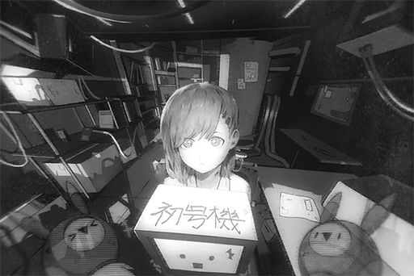

**[Nora]** 
_Wow! ROBO...?_

**[ROBO_Head]** 
_Data shows: After music, lighting and applaud from audience, signs of nervousness in human emotion, can be soothed. 
If Nora still nervous, this unit, will give Nora, applause too._

*\[Metal banging\]*

**[Nora]** 
_... Haha._

**[Nora]** 
_The light... Okay. 
Then I'll... start from my name, one of the first things Phoenix gave me._

_\[Signal Lost\]_

[*(Click here to go back to the top)*](#toc)

## <a id="noos011"/>\[#011\] Cam\_KyuuLab\_691\_01\_25
### Requirements
|Character|Level|
|---------|:---:|
|**Nora** |  6  |

### Log Content
*\[Door Opens\]*

**Member I** 
Boss!

**Phoenix** 
Don't call me Boss; how many times do I have to tell you that?  
I prefer "director". Are you new here?

**Member A** 
Apologies, director. Please take a look at this.

**Phoenix** 
......? 
Hey, isn't this a discarded specimen from Kim's project? Don't bring this kind of stuff into Central Lab.

**Member A** 
No... That's not it! We indeed discarded her, but this child... she was not affected by the virus. She survived!

**Phoenix** 
WHAT!? IS THAT TRUE!?

**Member A** 
Absolutely true! We made our trip the exact night of the experiment. After almost an entire day, we went back only to discover that she's still alive...

**Phoenix** 
Th... This child is very important! Register her to Central Lab right away! She looks very weak... A team, B team, prepare life support, NOW! 
You two, come with me. We need to go get Kim. The necrosis on her legs must be treated immediately, or it would spread to her entire body and that would be too late! This child must survive no matter what!

_\[»»» Fast Forward 18 Hours»»»\]_

**Phoenix** 
What is her situation?

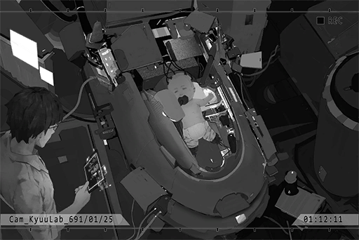

**Member D** 
Yes sir. The amputation surgery on her two legs was very successful. The necrotic cells from Kim's failed tests didn't expand to other body parts. 
Her level of synchronization with the life support is also very positive. We estimated a complete recovery in 1 or 2 days.

**Phoenix** 
Thank goodness...

**Member D** 
Director, this child... is quite intriguing. She experienced so much hardship in the labs, yet we've never heard her cry. She doesn't even seem to show any emotion...

**Phoenix** 
She is very special... Starting today, she will be the focal point of our research regarding "The Ender".  
Pay extra attention to those Ravens. Do not let those nutheads harm her.

**Member D** 
Certainly. Just now, the system has completed the specimen registration process. Her serial number will remain the same: 009. Members of the other labs will be unable to access her.

**Phoenix** 
No, remove her from the specimen database. She has way too much value to be placed alongside regular specimens...

**Member D** 
Director, without a specimen registration, it will cause us all kinds of trouble...

**Phoenix** 
I said before; she is special. From now on, I will take care of her myself.

**Phoenix** 
... Nora. We'll call her Nora. Give her an independent directory in the database.

**Member D** 
Nora...?

**Phoenix** 
It means "The ninth children" in an ancient language. It also has the meaning of "Honor". She will bring light to human civilization!

_\[Signal Lost\]_

[*(Click here to go back to the top)*](#toc)

## <a id="noos012"/>\[#012\] Audio\_Nora\_694\_03\_08
### Requirements
|Character|Level|
|---------|:---:|
|**Nora** |  7  |

### Log Content
*\[Door Opens\]*

**Member I** 
Nora, time for dinner.

**Nora** 
(Nods)

**Phoenix** 
Afterward, we'll draw blood for the new formula. That will be it for today. You can go to bed after the blood draw, understand?

**Nora** 
(Nods)

**Member I** 
Director, this child... she's three years old already, yet she still can't talk?

**Phoenix** 
Yes... But her cognitive abilities are working normally.

**Member I** 
Could it have something to do with her immunity?

**Phoenix** 
In science, the crucial thing is actual evidence. Before I can get a definitive confirmation, I will not make any hasty conclusions. 
You, go ask A team to prepare the equipment we'll be using later.

**Member I** 
Yes sir... Ah, apologies. I forgot to schedule the phlebotomy room. Director, can you sign this for me? I don't want a time conflict with another team.

**Phoenix** 
... Hey, you seem pretty capable when you were in Kim's team. That's why I transferred you over here to be an assistant. Yet you screw up right away.

**Member I** 
I'm sorry...

**Phoenix** 
Hand me the board. I won't be so kind next time. How many units did you draw last time? Do you have the notes?

**Member I** 
Ah... I... that... I'm really sorry! I forgot this one as well...

**Phoenix** 
You little...

**Member I** 
Eek!

**Nora** 
Ah... Ah... (four fingers)

**Phoenix** 
Hmm? Ho? Is it forty...?

**Nora** 
Hmm. (Nods)

**Phoenix** 
Thank you, Nora. 
It's because of Nora that you are spared a serious beating. You better thank her.

**Member I** 
... She... understands what we are saying?

**Phoenix** 
As a matter of fact, Nora's intelligence has already far surpassed that of a regular child in the same age range. However, due to her inability to talk, there are a lot of things we simply can't measure.

**Member I** 
... Amazing.

**Phoenix** 
Stop spacing out. Proceed with the preparations.

**Member I** 
Ah! Yes, sir!

_\[»»» Fast Forward»»»\]_

*\[Door Opens\]*

**Phoenix** 
Is she asleep?

**Member I** 
Yes. 
When she's asleep... she looks just like a normal child. It's really hard to imagine that she is so important to the research.

**Phoenix** 
Her genes are the keys to the world for us humans. The new medicine we made this time have to be effective...

**Nora** 
Hmm......

**Member I** 
......? 
Director, wait a second. Something's not right with Nora.

**Nora** 
Ugh...

**Member I** 
Her eyeballs are moving around rapidly. Is she having a nightmare...?

**Phoenix** 
......

**Member I** 
Yikes! She is having a nosebleed! Nora! Nora...

**Phoenix** 
Wait! Don't wake her up for now!

**Nora** 
Umm......

**Member I** 
It stopped... Director, why did that happen?

**Phoenix** 
I have no idea... The surveillance cameras recorded the whole process, right? Retrieve the recording and save it now. 
Actually, this is already the third time this has happened. Starting next week, we'll let Nora sleep in the BIT silent chamber and see if we can discover anything from her brainwave activities.

**Member I** 
Got it...

_\[Signal Lost\]_

[*(Click here to go back to the top)*](#toc)

## <a id="noos013"/>\[#013\] Audio\_Butsudou\_694\_09\_08
### Requirements
|Character|Level|
|---------|:---:|
|**Nora** |  7  |

### Log Content
*\[Door Opens\]*

**Phoenix** 
Is there something you want?

**Ryu** 
... Phoenix, it has been four years since Kyuu Hou Kai's establishment. The organization has certainly brought our city quite the benefit and growth... 
However, when it comes to "The Ender research", the situation has always been rather... unclear. I want to understand the current process.

**Phoenix** 
A few months ago, we've successfully developed a medicine that can slightly reduce the symptoms of those infected...

**Ryu** 
That's not my question. Right now, the investors are not very happy because your research has been constantly losing money. In fact, many of the budgets that were supposed to go into other researches have all been absorbed by your project. Care to explain yourself?

**Phoenix** 
I believe our initial agreement stated that as long as the total profit of the organization reaches a certain threshold, whatever remains can be used to conduct our own researches. Am I mistaken?

**Lam** 
Some of the Ravens have been complaining, that your project is taking up the entire Central Lab and almost all the resources.

**Phoenix** 
Funny, what do they think we are, roommates? I'm the one who decides how the spaces and resources are distributed.

**Lam** 
Phoenix, I heard that you've been raising a specimen in the lab for the past three years. Is this true?

**Phoenix** 
... Yes. That child has immunity to the virus.

**Lam** 
You've been studying the same specimen for three years, yet you haven't made any progress.

**Phoenix** 
Didn't I just mention, the medicine we developed last month...

**Ryu** 
That thing's not going to sell even a single pill. You should know this very well, don't you?

**Lam** 
Regular civilians have no interest in the world outside of the Nodes. The "hunters" and "gravediggers" who go out regularly all have the proper equipment as well.

**Phoenix** 
... Our purpose for researching The Ender, I'm sure you guys haven't forgotten about it, have you? If we're able to crack the secret code behind this virus and grant humans complete immunity, we will gain access to the entire world map. Node 03 can expand to a scale never imagined before. It can even take over other Nodes.

**Ryu** 
Certainly. This is a vision we acknowledged back then too. However, for a project this grand and this long\-term, I may never see it come to fruition in my entire life if we were to judge by the pace you are progressing right now.

**Phoenix** 
Ryu, I believe you are not someone who's that short\-sighted. Think about your place in history, in the future we created together... Just give me some more time and patience.

**Ryu** 
... One year. I will give you one more year. If you still can't get a positive income here, this project will be forcefully terminated. That's the one thing I will not compromise. At the very least, you have to produce some kind of value. As long as you can do that, I will not interfere with your other actions.

**Phoenix** 
Understood. Then I'll take my leave.

**Lam** 
Hold it right there. Let me go take a look at that specimen.

**Phoenix** 
... Why?

**Lam** 
Right now, the profits of Kyuu Hou Kai are held up entirely by the eight Ravens. I can't just ignore their complaints all together. 
Besides, I'm also quite curious about why you are so persistent about her...

**Phoenix** 
... Guess it's fine. There's a very high possbility that Nora has even more unique talents than immunity. She is completely different than the other one\-time use specimens. You understand once you see her.

**Lam** 
Nora... so she has a name? Whatever, take me to her.

_\[→Signal Switch to Nora'sRoom\]_

**Lam** 
She is the one?

**Phoenix** 
Yes. Nora, say hi. This is uncle Lam.

**Nora** 
...... (Nods)

*\[Music\]*

**Lam** 
What is she doing?

**Phoenix** 
Composing. Every instrument in this room, and those machinery over there; she invented and built all of them. Can you imagine that? A four\-year\-old child did all this! Although she can't talk, she is already displaying an extremely high level of intelligence.

**Lam** 
... What happened to her legs?

**Phoenix** 
She was originally a specimen of another research project over at Kim's team. The experiment later failed. In order to save her, we had to amputate her legs.

**Lam** 
......

**Phoenix** 
Let's talk outside. It gets a bit noisy in here when she starts composing.

*\[Door Opens\]*

**Phoenix** 
Do you understand now?

**Lam** 
... It is indeed surprising that she has such creative abilities at such a young age. 
However, what does that have to do with your research? I can see that she is no ordinary child, but I can't see the reason why you are so persistent about her.

**Phoenix** 
As of now, we haven't discovered a direct correlation between her intelligence and the virus. However, it is clear that she is not an ordinary human. She may have other secrets hidden inside her...

**Lam** 
Other secrets?

**Phoenix** 
No. I haven't figure out the specifcs either...

**Lam** 
You're not someone who fumbles with his words... I'll be frank. Some of the Ravens believe that you've developed personal feelings for the specimen. You are wasting a large amount of resources on her just so you can drag out the research and have more time with her.

**Phoenix** 
What!?

**Lam** 
If that's really the case, I advise you to come back to your senses. It's clear to me that you're not that kind of person, or should I say you've already lost the right to be one. 
All in all, you heard what the boss said. Another year of losing money and this research project will be terminated. This child will also have to be scrapped. Understand?

**Phoenix** 
... Understood.

_\[Signal Lost\]_

[*(Click here to go back to the top)*](#toc)

## <a id="noos014"/>\[#014\] Cam\_Nora\_695\_03\_03
### Requirements
|Character|Level|
|---------|:---:|
|**Nora** |  8  |

### Log Content
*\[Door Opens\]*

**Member I** 
Nora, get ready for your scan... Nora? Where are you\~?

**[Nora]** 
_Ichiro._

**Member I** 
Yikes!? Who's calling me!?

**[Nora]** 
_... I'm Nora. Looks like it's a success. I'm behind the shelf._

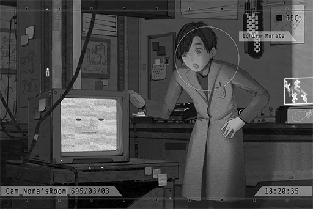

**Member I** 
Nora!? This machine... did you make this?

**[Nora]** 
_Yes. The name is "ROBO\_Head". It's a bit like... a translator, I guess? This way, I'm able to talk._

**Member I** 
Wow... So this is your voice?

**[Nora]** 
_It's a simulation of my voiceprint. I don't know how to talk to begin with, so I have no clue whether this is my voice or not._

**Member I** 
That's incredible! We're finally able to hear you talk... How did you do that?

**[Nora]** 
_A.R.C. announced the cyTus technology a while ago. I wrote a program with its protocol. It can directly translate what I want to speak via virtual connection._

**Member I** 
It really is incredible. You're truly a child prodigy!

**[Nora]** 
_There are still some functions I would like to test out. Do you mind helping me out a little bit?_

**Member I** 
Not a problem!

_\[»»» Fast Forward»»»\]_

**[Nora]** 
_Hmm... Everything's more or less functioning normally. There are some places that can use some minor tweaking... Thank you for helping me out with the tests._

**Member I** 
This is awesome! We need to tell director ASAP!

**[Nora]** 
_Wait!_

**Member I** 
Eh?

**[Nora]** 
_... Still not prepared... about what to tell him..._

**Member I** 
How come? You're speaking very fluently! On top of that, your speech doesn't sound like a child at all!

**[Nora]** 
_That's not the problem... 
Children... How do they talk? I don't know, because all I have around me is you guys._

**Member I** 
Ah... sorry.

**[Nora]** 
_Why are you apologizing?_

**Member I** 
Umm, nothing. It's just that... when I hear those words coming directly from you, I feel sorry for the kind of life we put you through...

**[Nora]** 
_I've never had a different life before. Ichiro, you don't have to be sorry._

**Member I** 
......

*\[Door Opens\]*

**Phoenix** 
Ichiro, we asked you to pick up Nora. Why are you taking so long? Everyone's been waiting for you.

**Member I** 
Ah! Director! Look! Nora is amazing. She made this machine by herself. She is now able to speak!

**[Nora]** 
_......_

**Phoenix** 
......?

**Member I** 
What's wrong? Nora! Show it to director!

**[Nora]** 
_... H, Hello, I'm Nora..._

**Phoenix** 
......

**[Nora]** 
_... Ummm..._

**Phoenix** 
... Did you make this with the cyTus technology? Very impressive. You're able to master the programming language I taught you in a very short time.

**[Nora]** 
_Thank you..._

**Phoenix** 
Take her to do the scan. We are already having a serious delay.

**Member I** 
Ah... Yes sir! I'm sorry!

**[Nora]** 
_......_

_\[Signal Lost\]_

[*(Click here to go back to the top)*](#toc)

## <a id="noos015"/>\[#015\] Audio\_Nora\_695\_03\_16
### Requirements
|Character|Level|
|---------|:---:|
|**Nora** |  8  |

### Log Content
*\[Door Opens\]*

*\[Music\]*

**Member I** 
Nora, are you composing? It's time for your meal.

**[Nora]** 
_Thank you. 
I've improved ROBO's function. Can you help me test it again?_

**Member I** 
Oh! Of course! What kind of function?

**[Nora]** 
_A function to express emotion. Turns out a synthetic voice is still not nearly enough. Right now, it should be able to display some simple emotions._

**Member I** 
That sounds pretty cool. Let's give it a shot right away!

**[Nora]** 
_......_

**Member I** 
......

**[Nora]** 
_What do you think?_

**Member I** 
Eh? It has already begun? Hmm... the face on the screen didn't change at all.

**[Nora]** 
_Eh...?_

**Member I** 
Nora, you have no emotion on your face right now either. Moreover, I don't think I've ever seen you express any emotion before...

**[Nora]** 
_... I don't know what I should do._

**Member I** 
How come? It's really simple. You think about some things you like, then feel it with your heart... Umm, what am I talking about? Now even I am confused.

**[Nora]** 
_What I like..._

*\[Nora Emotion\]*

**Member I** 
Oh! The face changed... Eh? It's a crying face. What did you just think about?

**[Nora]** 
_Eh? Nothing. All in all, it seems like a success. Thank you. 
... Oh right... You've been the one to deliver my meals to me lately. Where's Phoenix?_

**Member I** 
Director has been quite busy these days. Besides analyzing the data from the previous scan, I've heard that the Ravens are doing this major project at Lab 03 right now. He's been going there to offer assistance too.

**[Nora]** 
_I see..._

*\[Nora Emotion\]*

**Member I** 
Ah! The face became a crying face again. What's the matter? Are you feeling down?

**[Nora]** 
_Not really. I was just thinking... I wasn't able to talk to him properly the first time. I haven't seen him a lot after that incident._

**Member I** 
......

**[Nora]** 
_Does he dislike me...?_

**Member I** 
Not at all! Director cares about you more than anybody else!

**[Nora]** 
_That's because I am a very important research subject..._

*\[Door Opens\]*

**Member I** 
!

**Phoenix** 
Ichiro, leave. I have something to say to Nora.

**Member I** 
OK...

**Phoenix** 
Nora, this is for you. Here, come and take a seat.

**[Nora]** 
_......?_

**Phoenix** 
Good. Now, try and connect ROBO\_Head's other port to this one here.

*\[Wheelchair activated\]*

**[Nora]** 
_Wow! It moved!_

**Phoenix** 
This is a wheelchair that can be controlled via virtual connection. This way, you're able to move freely. You are no longer restricted inside this room.

**[Nora]** 
_Phoenix... Did you make this?_

**Phoenix** 
Yes. Since you're able to speak now, I shouldn't continue limiting your actions.

**[Nora]** 
_...... Thank you!_

*\[Nora Emotion\]*

**Phoenix** 
However, you are not allowed to leave the Central Lab area. Understand?

**[Nora]** 
_Got it!_

*\[Nora Emotion\]*

_\[Signal Lost\]_

[*(Click here to go back to the top)*](#toc)

## <a id="noos016"/>\[#016\] Cam\_CLab06\_695\_04\_02
### Requirements
|Character|Level|
|---------|:---:|
|**Nora** |  9  |

### Log Content
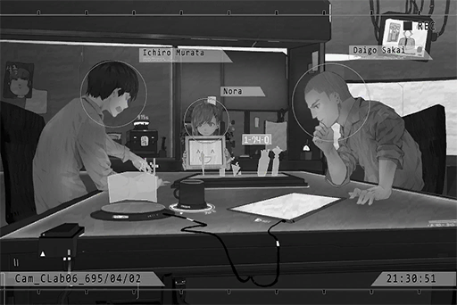

**[Nora]** 
_Hahaha! Ichiro, you are so dumb!_

*\[Nora Emotion\]*

**Member I** 
Argh\~ I lost again! It's practically impossible to beat Nora!

**Member D** 
How are you feeling right now after being utterly destroyed by a five\-year\-old?

**Member I** 
Shut up! If you're so good, why don't you challenge her! She is definitely not your average five\-year\-old...

**[Nora]** 
_If so, how about we stop playing chess and switch to a game that relies solely on luck? That way, it's fair to everybody._

**Member D** 
Ho? Not a bad idea. Lemme find one.

**Member I** 
If it's only about luck then I won't lose!

**Member D** 
That I can't disagree with... your luck scares me sometimes... I can never understand why someone as dumb as you ever got a job in this place.

**[Nora]** 
_Haha, that's mean._

**Member I** 
Damnit... 
Oh, right! Have you heard Nora's new song? It's really dope!

**[Nora]** 
_That song's still unfinished..._

**Member D** 
Then show it to me after you've finished it. I am looking forward to it a lot. 
Nora is truly amazing. She can compose music AND she is knowledgeable in mechanical engineering.

**[Nora]** 
_Both mechanical engineering and programming are taught to me by Phoenix. I hope I can grow up to be someone like him. If I can be a musician as a side gig, even better._

*\[Nora Emotion\]*

**Member I** 
Grow up...

**Member D** 
Hmm, you definitely can. We will offer you our wholehearted support.

**Member I** 
Ah... that's right! Nora's going to be even more amazing after she grows up!

**Phoenix** 
Hey, break time's over. Get back to work. Nora, you're sleeping in the silent chamber tonight. You should rest early.

**[Nora]** 
_... OK._

*\[Nora Emotion\]*

**Member I** 
Can't help it then. We'll play again tomorrow!

**[Nora]** 
_Sure. I will not lose!_

_\[→Signal Switch to Nora'sRoom\]_

**Phoenix** 
The setting is complete. You can enter the silent chamber now.

**[Nora]** 
_It's really hard to sleep in this. It's cramped and dark inside..._

**Phoenix** 
I know. This is all to stabilize your symptoms of nosebleed and epilepsy that occasionally occur during your sleep. Just hang in there. Do you still get nightmares these days?

**[Nora]** 
_Uh\-huh... I still do sometimes, but they are a lot less scary now._

**Phoenix** 
Try and see if you can remember the contents of your dream. It is also helpful for our research. Maybe we can discover something from your dreams. 
Alright, time for you to sleep.

**[Nora]** 
_OK, understood. 
I want to drink some water before I sleep... Ah, I left my water bottle in the break room. can I go get it?_

**Phoenix** 
Sure. Can you go on your own?

**[Nora]** 
_Yes._

_\[→Signal Switch to CLab06\]_

**[Nora]** 
_Water bottle water bottle..._

**Member I** 
Poor Nora... I don't know what to reply after hearing that.

**Member D** 
You mean the "grow up to be like Phoenix" part? Ha... She has no idea about the crap ton of horrible things director has done.

**Member I** 
Despite that, at least she still has her dreams.

**Member D** 
You're way too sentimental. If you want to stay here, you should keep your emotions in check. If not, you're going to constantly feel terrible.

**Member I** 
Don't you have even some feelings for her!?

**Member D** 
... We are simply following our orders to take care of her. Don't think too much.

**Member I** 
We only have a few months left. Judging by our current progress, there's a very high chance that she'll be scrapped...

**[Nora]** 
_... Scrapped!?_

**Member D** 
I don't want to as well... We've already tried our best. After all, she is nothing more than a mere test specimen...

*\[Bottle drops\]*

**Member D, Member I** 
!?

**[Nora]** 
_... I'm here... to get my water bottle._

**Member I** 
Nora!

**[Nora]** 
_I'm going to bed now! Goodnight._

**Member D, Member I** 
......

_\[Signal Lost\]_

[*(Click here to go back to the top)*](#toc)

## <a id="noos017"/>\[#017\] Audio\_Dash\_695\_05\_03
### Requirements
|Character|Level|
|---------|:---:|
|**Nora** |  9  |

### Log Content
**Kim** 
What is this all about!?

**Lam** 
Exactly what it says.

**Kim** 
You're kidding. You're going to ignore all the things I did in the past just because of this one small incident?

**Lam** 
You really think that the profits you created in the past, which is no bigger than your dick mind you, can make up for your mistake this time? Don't make me laugh.

**Kim** 
What did you just say!?

**Lam** 
All things considered, you better finish this project before the end of the month. If not, then maybe we should saw off your legs and mail them to the buyers so you can literally kneel in front of them as an apology. You like that?

**Kim** 
Phoenix occupied the entire Central Lab to play house with his daughter! There's no way we can...

**Lam** 
I can already think of multiple methods for you to complete this thing within a month. Of course, I'm not going to help you out. 
Kim, in Node 03, those who don't have the ability can only drown in the sewers.  
You don't need me to teach you that lesson again, right?

**Kim** 
......

**Lam** 
When you're half as capable as Phoenix, then you get to whine about him. If not, I suggest you mind your own business first.

*\[Door Opens\]*

**Kim** 
Motherf\*\*\*\*\*! Who does he think he is!?

**Member A** 
Brother Kim, what should we do...?

**Kim** 
How should I know what to do? Damnit, that bastard Phoenix; that specimen was recycled from my team in the first place. Now he's getting all so cocky...

**Member B** 
......

**Kim** 
I'll dispose of 009 right now! Let's see what he has left to be so cocky about!

**Member A** 
Brother Kim! Please calm down! That will only make the situation A LOT worse!

**Member B** 
He's right. We should figure out how we're going to finish that project within a month. Isn't that more practical?

**Kim** 
... No good. This budget... The number of tests we can perform is far too few.

**Member B** 
How about we sell some elements to the folks at "Hou Sang Tong"? I heard that they are paying good prices for Tritium. We just so happen to have some here.

**Kim** 
......! That's right. Go check the storage. You finally came up with something useful!

**Member A** 
Ah man... can't do. Right now, the research project at Brother Chen's place has taken almost all of our Tritium supply... What we have left is just too little to sell.

**Kim** 
S\*\*\*! We're all Ravens... Why is it that I'm the one to have so many goddamn restrictions. This is bulls\*\*\*...

**Member B** 
Probably because he makes more money...

**Kim** 
Huh!? Do you have a death wish!?

**Member B** 
Yikes! I'm really sorry!

**Kim** 
... We'll steal some.

**Member A** 
Eh?

**Kim** 
I know where he stores the Tritium. You people are going to steal some for me.

**Member B** 
That's impossible! The security at Lab 03 is several times tighter than what we have here!

**Kim** 
I used to operate in that lab. I know the way to sneak inside... I have a plan...

**Member A, Member B** 
......

_\[Signal Lost\]_

[*(Click here to go back to the top)*](#toc)

## <a id="noos018"/>\[#018\] Audio\_KyuuLab\_695\_05\_08\_1
### Requirements
|Character|Level|
|---------|:---:|
|**Nora** | 10  |

### Log Content
**Phoenix** 
I believe everyone already knew the reason we are gathering here. 
A few days ago, the element warehouse of Lab 03 was broken into by a thief.

**Members** 
Did someone decrypt our security system!?

**Lam** 
The thief's methods are extremely clean, so clean to a point that I am not willing to believe it's an outsider's handiwork. If there really is someone capable of hacking our system in Node 03, it's very unlikely that we don't know anything about such a talent.

**Phoenix** 
Indeed. Both the lab and the security system showed no signs of a forceful entry.  
Tritium, the element that was stolen this time, is a highly valuable material on the market right now. I suspect that someone within the organization stole the element for money.

**Everyone** 
......

**Lam** 
To be honest, I don't give a damn about the management within this organization.  
Theft, robbery, or even murder; you're free to do whatever you desire. 
I'll go as far as saying that if you can prove your worth and ability by committing the previous crimes, I will even advocate such actions.

**Everyone** 
......

**Lam** 
However, as everyone may know, the project Chen is working on right now at Lab 03 will play a very crucial role in Mogura's growth for the entire second half of the year. 
To the person who dared to mess with such an important project for personal benefits... You're not getting away.

**Everyone** 
......

**Lam** 
So nobody wants to confess?

**Everyone** 
......

**Lam** 
Ichiro Murata. You here?

**Member I** 
!? 
Y, Yes, sir!

**Lam** 
At 11:00 P.M. of the 5th, the surveillance camera in Lab 03 started to experience malfunctions. The items disappeared not long after that. Where were you at the time?

**Member I** 
In my own room...

**Member I** 
Eh!?

**Lam** 
By yourself?

**Member I** 
... B, by myself...

**Kim** 
Now that I think about it... Ichiro's family has always been short on money. He used to be the person responsible for managing the imports and exports of the element warehouse at Lab 03. He has a very good understanding of the security system's functions.

**Kim** 
Ah, right! I remember! You installed a brand\-new resident care system for your grandmother just two days ago, right? Where did you get the money?

**Member I** 
I, I got it from my own savings of course... Besides, wasn't brother Kim the one who recommended me to install that system!?

**Kim** 
Hey, I did indeed talk to you about it. But this timing... coincidence? Isn't that a bit far\-fetched?

**Member I** 
If I was the one who stole the items, why would I do such a major purchase so soon afterward!? Even I know that's going to be super suspicious! Just take a look at the transaction records and you'll see that I...

**Lam** 
Ichiro Murata, I investigated your account. I did not see the transaction record you mentioned.

**Member I** 
...Eh?

**Lam** 
Take a look yourself.

**Member I** 
This... How is this possible?

**Lam** 
I'll get to the point. On the air vent on\-site, we discovered your fingerprint... a rather new one too.

**Phoenix** 
......

**Member I** 
It's not me! Director, please believe me! It's really not me who stole it!

**Phoenix** 
... I personally don't believe you have the nerves to do such a thing.

_\[Signal Lost\]_

[*(Click here to go back to the top)*](#toc)

## <a id="noos019"/>\[#019\] Audio\_KyuuLab\_695\_05\_08\_2
### Requirements
|Character|Level|
|---------|:---:|
|**Nora** | 11  |

### Log Content
**[Nora]** 
_Ichiro's not the thief._

**Phoenix** 
Nora!? Didn't I tell you not to leave Central Lab?

**[Nora]** 
_The culprit is Kim._

**Everyone** 
......

**Kim** 
What kind of bulls\*\*\* are you mumbling about, you stinkin brat!? Do you want me to break your two arms as well!?

**[Nora]** 
_May 3rd, 09:45 P.M. 
At the parking lot of Lab 06, you told your team members to steal the items, then fake the evidence to frame Ichiro. The dashboard camera on one of the parked cars has a recording of that conversation. The license plate number of said car is PY \- 5644._

**Kim** 
......!

**[Nora]** 
_May 6th, 10:08 P.M. 
You met up with a Hou Sang Tong member in area 15 of the downtown area. The transaction was done with cash. The surveillance camera of a barbeque shop at the alley entrance caught you on tape. A total of 9.81 million in cash is still hidden in an abandoned basement located on Shin\-Shen street, Quadrant III._

**Phoenix** 
......

**Kim** 
Nonsense...

**Lam** 
... Nonsense or not, I'll get the admins to investigate now and we'll know the results soon enough. If what she said is true, I hope you are prepared for the consequences.

**Kim** 
F\*\*\* ...... All of you, FREEZE!

**[Nora]** 
_Ahh!_

**Phoenix** 
Let her go!

**Kim** 
Don't come near me! Another step and I'll blow her brains out!

*\[Gunshot\]*

**Kim** 
ARGHHHH! My hand!!

**Phoenix** 
HEY! What if you accidentally hit Nora!?

**Lam** 
I don't care.

**[Nora]** 
_Cough cough!... I'm fine._

**Lam** 
Kim! Surrender yourself. You messed with Mogura's business; losing a hand is going to be the least of your worries today!

**Kim** 
Goddamnit!

*\[Glass bottle shatter\]*

**Phoenix** 
Is that... The Ender!? Where did he...

*\[System Warning\]*

**[Lab System]** 
_Warning: High virus concentration level detected. Danger level: A 
All gates set to lock down. 
All personnel, please remain at your spot and protect yourself with the prevention equipment. _

**Phoenix** 
Don't let him get away!

**Lam** 
Put on the mask first! 
...... 
So he got away... Good on him.

_\[»»» Fast Forward»»»\]_

**Phoenix** 
Nora! Cough cough... Are you alright?

**[Nora]** 
_Yes..._

**Phoenix** 
Ah, right. The virus doesn't affect you... Thank goodness. About your accusations of Kim back there, how did you know those things?

**[Nora]** 
_My dreams at night... I followed your words and tried very hard to remember my dreams. I discovered that those are not dreams. They are all events recorded by machines. They actually happened..._

**Phoenix** 
......!

_\[Signal Lost\]_

[*(Click here to go back to the top)*](#toc)

## <a id="noos020"/>\[#020\] Cam\_Robo\_697\_04\_06\_4
### Requirements
|Character|Level|
|---------|:---:|
|**Nora** | 12  |

### Log Content
**[ROBO_Head]** 
_Update database: Nora has ability to read digital information through brain. 
Source: Unknown._

**[Nora]** 
_Yes... I don't know where those images come from as well. After that incident, I gained the ability to see those images even when I'm not sleeping. As long as I focus my mind, I can see them. 
Phoenix said, that this ability is also a gift from god._

**[ROBO_Head]** 
_Update database: Phoenix, has religious beliefs._

**[Nora]** 
_No. He only believes in one god, the god by the name of "Knowledge"._

**[ROBO_Head]** 
_Not found, in database,  god with name "Knowledge" across all existing religions 
Update database..._

**[Nora]** 
_Umm, that's not what I meant... He believes that when humans obtain knowledge, we'll be able to understand Him, stand next to Him, walk the world with Him. We can even become gods ourselves._

**[ROBO_Head]** 
_This unit, don't understand._

**[Nora]** 
_It's fine... All in all, besides studying the virus, Phoenix also started studying this ability of mine. 
However, Mogura also requested me to start doing business for them._

**[ROBO_Head]** 
_This unit, want to know, what kind of business._

**[Nora]** 
_... Fortune telling. 
ROBO, do you know what this means?_

*\[Loading sounds\]*

**[ROBO_Head]** 
_Fortune telling, use of supernatural methods, to predict future, seek the truth._

**[Nora]** 
_Exactly. "The Eye of Horus", otherwise known as the All\-knowing eye. This ability started to spread across Node 03 under this very name. It even spread to other places. Even though I can't see the future, as long as it's information recorded by either a surveillance camera or some other equipment, I am able to read it. 
They pay large sums of money to Mogura, and Mogura will grant them a meeting with me. I will then help them obtain the information they need... This is a very useful service to people in this world._

**[ROBO_Head]** 
_Phoenix, agreed with this?_

**[Nora]** 
_I don't know... but he doesn't get the final saying in this situation anyway. Mogura gave him immense pressure. We must create profits for them for us to not face the fate of being discarded. We have no choice but to obey their demands._

*\[Probe sound\]*

**[ROBO_Head]** 
_Nora, this unit detected, your breathing slowed down, heart rate changed, oxygen consumption increased, cause decreased energy conversion efficiency._

**[Nora]** 
_......_

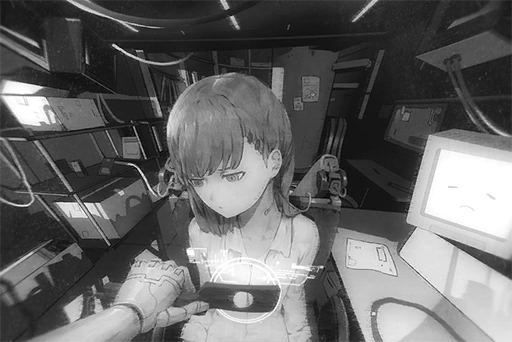

**[ROBO_Head]** 
_This unit, decision, Nora experienced change in emotion. Mostly possible option, sadness, possibility 93.725% 
Suggest Nora, take notice._

**[Nora]** 
_...... Thank you. 
However, this is nothing special. In fact, after every fortune telling session, I always feel like this._

**[ROBO_Head]** 
_Record: Fortune telling, negative influence to Nora's body. 
Nora, during fortune telling, what, do you see?_

**[Nora]** 
_... Phoenix told me, that what I see is the real side of humans, the truth of this world. I have to accept them._

**[ROBO_Head]** 
_......_

**[Nora]** 
_ROBO...?_

**[ROBO_Head]** 
_Nora feeling down. 
This unit, decision, negative influence from images witnessed._

**[Nora]** 
_... You're right on point, ROBO. 
I think, what I saw..._

**[Nora]** 
_... is "Chaos"._

_\[Signal Lost\]_

[*(Click here to go back to the top)*](#toc)

## <a id="noos021"/>\[#021\] Cam\_Butsudou\_697\_03\_02
### Requirements
|Character|Level|
|---------|:---:|
|**Nora** | 13  |

### Log Content
*\[Door Opens\]*

**Lam** 
Go in. I'm surprised that you didn't even bring a single bodyguard.

**Diego** 
Manson, we're old friends. What is there for me to be scared about?

**Lam** 
You have a point. Take a seat.

**Diego** 
Greetings, Kyuu Hou Kai's "The Eye of Horus". Turns out you're such a cute little girl. I am flabbergasted.

**Nora** 
......

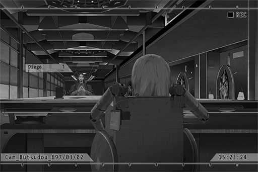

**Phoenix** 
You only have ten minutes. You better not waste any time.

**Diego** 
Of course. 
Then... I would like to know the trends of Node 08 Administration Bureau's gang purge. Can you do that?

**Lam** 
Concerned about the safety of your gang members? I expect no less from the Consigliere of the Baro Brotherhood.

**Diego** 
You can look at it that way... All\-knowing eye, I shall be in your care.

**Nora** 
...... (Nods)

_\[»»» Fast Forward»»»\]_

*\[Prints document\]*

**Nora** 
...... (Hands out document)

**Lam** 
... This is the white paper for Node 08 Administration Bureau's gang purging operations. Secrets don't get more secretive than this.

**Diego** 
This is perfect... 
Not just the deployment strategy of the agents, even the baits they spread online are all listed here.

**Lam** 
As long as they avoid these fake transactions, your people will be safe and sound.

**Diego** 
Or, I could utilize these baits...

**Lam** 
What?

**Diego** 
Nothing... I'm very impressed. This is the exact information I am looking for. My long trip to Node 03 is already well worth the price.

**Phoenix** 
Just a quick reminder; this document is not allowed to be taken out of this room. You better memorize the whole thing before your time is up.

**Diego** 
No need to worry, Mr. Phoenix. I've memorized it all. 
On a side note, there's still some time left, right?

**Phoenix** 
Two minutes.

**Diego** 
Then I would like to ask another favor to the All\-knowing eye. I want to take a look at the access record of one of Baro's firearms management files. The serial number is BW0875\-32A.

**Phoenix** 
Access record?

**Diego** 
Yes. A few days ago, there was an unauthorized copy of the files. However, due to the highly\-classified nature of the files, I was unable to track it. I want to know the gang member who accessed the files.

**Nora** 
...... (Nods)

_\[»»» Fast Forward»»»\]_

**Nora** 
...... (Hands out document)

**Diego** 
It's Liang, eh... He is a trusted subordinate of our Boss, and he is also under my direct command. So he's the one... I get it now. 
Apologizes. Please allow me to send a quick message.

**Phoenix** 
......

*\[Message Sent\]*

**Lam** 
Hey. Don't try to act sneaky in front of my eyes. What order did you give and who did you give it to?

**Diego** 
Nothing serious. Just some... family business. Rest assured, it's business that has nothing to do with Mogura. 
My time should be almost up, right? Thank you very much for your help.

**[Nora]** 
_......_

**Diego** 
In the future, Baro's going to require your help. We have our roots here. We will definitely carry on Mogura's soul in Node 08 and create even greater benefits.

**Lam** 
Certainly. I have great expectations for you. Don't let me down.

*\[Door Opens\]*

**Nora** 
... _\*Sobs\*_...

**Phoenix** 
Nora? Why are you crying?

**[Nora]** 
_Out of curiosity, I took another look with my ability... That Liang, just now, he's already..._

**Phoenix** 
... Already dead, right?

**Phoenix** 
... It appears that this Diego guy already has several people he's suspecting under watch. He orders the execution of the target the moment he knows the truth.

**[Nora]** 
_... Why?_

**Phoenix** 
Probably to use Liang's treason as a way to frame Baro's boss and seize this opportunity to take over the entire gang.

**[Nora]** 
_It's all my fault...\*Sobs\*..._

**Phoenix** 
... You shouldn't think like that. Even without you, these people are going to die someday. As long as we're mortal, we cannot escape death. Whether we're good or evil, our end will always be the same. 
Nora, get some rest. Don't look at the aftermaths of your fortune telling. Also, in times where you are not in this booth, don't use your ability.

**[Nora]** 
_... Got it..._

_\[Signal Lost\]_

[*(Click here to go back to the top)*](#toc)

## <a id="noos022"/>\[#022\] Audio\_Butsudou\_697\_03\_14
### Requirements
|Character|Level|
|---------|:---:|
|**Nora** | 14  |

### Log Content
**Phoenix** 
Ask your question.

**Zhang** 
What the heck? How dare you talk to me like that? Do you have any idea who I am? 
Every single woman of Mogura is my property. Without me, you lonely pieces of s\*\*\* can only jerk off yourself in your dirty bedroom. So show me some damn respect!

**Nora** 
...... (Looks at Phoenix)

**Phoenix** 
Unfortunately, I have no interest in the prostitution industry.

**Zhang** 
HUH? Ha! Makes sense. I heard that you've been having quite some fun with that little loli over there. We have girls in this age range too. Don't you underestimate my harem.

**Lam** 
Mr. Zhang, you've already used three minutes.

**Zhang** 
... Hmph. How I want to spend my money is none of your business.  
Hey brat, I want to see the addresses of all the beautiful women in Node 03 who is aged between eight and eighteen. Hurry up.

**Nora** 
...... (Shakes head)

**Zhang** 
Huh? Why do you mean by shaking your head?

**Phoenix** 
... What she means by that is the range is simply too big. There simply isn't enough time. Besides, according to the rules, you can't take the information with you. In addition, there's a limit to how much she can use her ability...

**Zhang** 
Why the f\*\*\* are you the one yapping again? Is that loli speech impaired or something?

**Lam** 
Phoenix, follow the contract. You do as much as the customer is paying. They know what they are getting.

**Zhang** 
Ha, if I'm not satisfied I'll add more money naturally. Now, stop the nonsense and show me the girls!

**Phoenix** 
... Nora, you can start.

_\[»»» Fast Forward»»»\]_

**Zhang** 
Ehehehe, this one's top quality. That innocent look and that thicc a\*\*, hoho... Ooh, and her feisty little sister looks pretty tasty too... 
Brat, show me the next one!

**Nora** 
... Ugh... Ummmm...

**Zhang** 
What the hell are you waiting for? Stop wasting my time!

**Nora** 
... UGH! Cough cough! AK AK AK!

*\[Things knocked down\]*

**Phoenix** 
Nora！

**Lam** 
... What is happening to her!? She has a really serious nosebleed!

**Phoenix** 
She has exceeded her limit. She can no longer continue. We need to stop right now!

**Zhang** 
What nonsense are you talking about? I bought half\-an\-hour! I still haven't seen the best of the best. Keep going!

**Phoenix** 
... You heard what I said. Now f\*\*\* off.

**Zhang** 
You motherf\*\*\*\*\*...

*\[Gunshot\]*

**Phoenix** 
Argh!

**[Nora]** 
_……Phoenix……！_

**Zhang** 
You hear that? The next shot will be through the head of that brat.

*\[Loads Gun\]*

**Lam** 
Mr. Zhang, I hope you realize that your gun is currently pointing at an important property of Mogura.

**Zhang** 
......!?

**Bodyguard** 
......! Don't move!

**Lam** 
Oh, you wanna bet? Who has the faster trigger, your bodyguards, or me?

**Zhang** 
... You guys... put your guns down...

**Bodyguard** 
Boss...

**Zhang** 
Big brother Lam, I... I was just kidding... 
See, I put my gun down. Haha... please don't pull the trigger.

**Lam** 
As you may see, business is done for the day. We will refund the appropriate amount of fees based on the service time you used. Of course, that fee will be deducted a bit since you injured one of our men. Got any problems?

**Zhang** 
No problem! No problem!

**Lam** 
Then please, leave.

_\[»»» Fast Forward»»»\]_

**Phoenix** 
Nora, can you stand?

**Nora** 
...... (Shakes head)

**Phoenix** 
Here, I'll carry you. We'll return to the silent chamber.

**[Nora]** 
_... Phoenix... your leg..._

**Phoenix** 
This is a minor injury. No big deal.

**Lam** 
Hey, what's going on? Are you trying to taint Mogura's reputation?

**Phoenix** 
I said before. Nora's ability is nowhere near omnipotent. It's quite a burden to her physically. This is the first time she has such a serious reaction...

**Lam** 
Whatever. I never like Zhang to being with. 
Nevertheless, I will remind you again. A contract is a contract. If a similar incident like this occurred in future services and brought shame upon Mogura again...

**Phoenix** 
You guys don't give a damn as long as you get the money, don't you? Stop making pointless threats. I am well aware of our contract.

**Lam** 
... The dragon's reverse scale is not something to toy with. This is my first and final warning. You better behave yourself.

_\[Signal Lost\]_

[*(Click here to go back to the top)*](#toc)

## <a id="noos023"/>\[#023\] Audio\_Robo\_697\_04\_06\_5
### Requirements
|Character|Level|
|---------|:---:|
|**Nora** | 15  |

### Log Content
**[Nora]** 
_Even though after that incident where Phoenix got injured, Mogura sent us a lot of their bodyguards, I still wanted to be protected by someone I can trust._

**[ROBO_Head]** 
_Therefore, this unit, was created. Understood._

**[Nora]** 
_Yes... I don't want Phoenix to be injured again... 
ROBO, you may not realize this, but you're really strong. Your body was painstakingly crafted by me. In an emergency, it will definitely come in handy._

**[ROBO_Head]** 
_Fortune telling, massive decrease in Nora and Phoenix's safety parameters. This unit, suggestion, stop participating, in said event._

**[Nora]** 
_We can't. 
The contract does not allow us to do this._

**[ROBO_Head]** 
_Decision: This contract, conditions, unfair. 
Suggestion: Renegotiation_

**[Nora]** 
_... Looks like there's still a lot for you to learn, ROBO._

**[ROBO_Head]** 
_This unit, don't understand._

**[Nora]** 
_ROBO, I want you to have the ability to distinguish between right and wrong. That's why I spent so much time on setting your moral values, which I did so by recalibrating the data on "Unit 01". I hope that when you make decisions, you can make a reasonable and fair judgment. However, most things in this world are neither reasonable nor fair..._

**[ROBO_Head]** 
_If so, should base on statistical average, to produce accurate decision results. 
This unit, suggestion: recalibrating the parameters._

**[Nora]** 
_No. I want to know what kind of decision you will make in this cruel environment. Therefore, it is crucial that you have a kind and considerate heart._

**[ROBO_Head]** 
_This unit, doesn't have the organ "Heart"._

**[Nora]** 
_Haha... That was just a metaphor. ROBO, you're so funny!_

**[ROBO_Head]** 
_Nora, feeling happy. Update humor logistics._

**[Nora]** 
_I feel so relaxed when I'm talking to you... I haven't felt like this in a very long time... 
When was the last time I laughed out loud? Ever since I learned that I was an item that could be discarded at any moment..._

**[ROBO_Head]** 
_Nora, human, not item. Different from, this unit._

**[Nora]** 
_Thank you, but don't worry. I will not discard you. 
From now on, I shall be in your care,  
ROBO\_Head \- Unit 02._

**[ROBO_Head]** 
_Understood. This unit, be in your care as well._

_\[Signal Lost\]_

[*(Click here to go back to the top)*](#toc)

## <a id="noos024"/>\[#024\] Audio\_Butsudou\_698\_04\_13
### Requirements
|Character|Level|
|---------|:---:|
|**Nora** | 16  |

### Log Content
**Lam** 
My, my, the head of the well\-known Hou Sang Tong decides to spare his time to pay us a visit. We apologize for the lack of a proper welcome, Mr. Huang. 
Your recycling business has been quite successful. It has benefitted us a lot too.

**Huang** 
Rumors spread fast, Manson. 
"The Eye of Horus" If it's really that useful, us Hou Sang Tong and you Mogura will all gain significant profits from it. The smell of money is strong with this one.

*\[Door Opens\]*

**Nora、Phoenix** 
......!

**Kim** 
Long time no see. 
Ooh, looking at all your surprised faces is making my hand itch... even though I don't have a hand. Ehehe...

**Lam** 
This guy went and seeked refugee at Hou Sang Tong after he ran away from here. He is more cockroach than man if you ask me. He seems to find a living among trash.

**Phoenix** 
... After selling Tritium to Hou Sang Tong, you decided to sell yourself after that?

**Kim** 
Hoho, right now, I am Hou Sang Tong's leading researcher. You guys can't touch me, so save your bullets. 
Got a couple more bodyguards, it seems? And what's that big tin can doing here? Are you guys THAT afraid of getting killed? Hehehe...

**[Nora]** 
_......_

**[ROBO_Head]** 
_Greetings, Mr. Huang, Mr. Kim. This unit is ROBO\_Head\- Unit 02. 
Please ask your question. This unit is responsible for organizing Nora's fortune telling results and presenting them to you._

**Kim** 
Hmph, so it even has an audio system... You're really using this pile of scrap metal as a bodyguard? Phoenix, is your brain alright? Did you get lead poisoning or some random crap?

**Huang** 
Kim, the four\-and\-a\-half minutes I purchased is not for you to say hi to your old friends, so shut up.

**Kim** 
Tch......

**Huang** 
I remember the rules are that we can ask anything, right? 
Then, I would like to see Kyuu Hou Kai's research report on "The Ender" virus.

**Lam** 
......

**Phoenix** 
... That's my research. So stop dreaming about it. The meeting ends here. 
Nora, let's go back.

**Lam** 
Phoenix, follow the contract. Or are you worried that once this bastard gets your report you will become worthless?

**Phoenix** 
......

**[Nora]** 
_... Understood... I'll take a look now._

_\[»»» Fast Forward»»»\]_

**Huang** 
Is that all? Plenty of results, but only a few of them are actually useful. 
I heard that Kyuu Hou Kai has been studying "The Ender" for many years. Turns out this is the best they got. How disappointing.

**Lam** 
......

**Phoenix** 
If you're done here, f\*\*\* off.

**Kim** 
Hehehe, boss Huang... I believe that this data is not the complete research report.

**Phoenix** 
......!

**Kim** 
I know this man very well. He will not write down all his thoughts and conclusions in the records... Instead, he hides them in an encrypted file that only he can access. 
B\-U\-T, under "The Eye of Horus", these files should all be accessible to her.

**Phoenix** 
... I have no idea what you are talking about.

**Kim** 
You have no idea? Then I wonder if Nora has any idea? You should be able to see them, right? Then why don't you show us?

**[Nora]** 
_...... I......_

**Phoenix** 
......

*\[Loads Gun\]*

**Lam** 
Hey, don't let me say if for the third time. Follow the "contract"...

*\[Prints document\]*

**[ROBO_Head]** 
_Fortune telling report, organize complete._

**[Nora]** 
_... Eh!?_

**Phoenix** 
......!

**Lam** 
......

**Huang** 
Now this is more like it. Kim, take a look.

**Kim** 
... This does indeed look like Phoenix's handiwork. Hahaha! I see. I see! With this, it will be much easier for me to make that... hehe!

**[ROBO_Head]** 
_Time is up. Thank you for using the service of the All\-knowing eye. The exit is at the rear right._

**Kim** 
Muhahahah! Phoenix! Prepare to meet your end! The secret of The Ender is now mine!

**Huang** 
Looks like "The Eye of Horus" is indeed trustworthy. I will come back next time.

**Lam** 
......

*\[Door Opens\]*

**[Nora]** 
_ROBO……_

**Phoenix** 
......

_\[Signal Lost\]_

[*(Click here to go back to the top)*](#toc)

## <a id="noos025"/>\[#025\] Cam\_Nora\_698\_04\_13
### Requirements
|Character|Level|
|---------|:---:|
|**Nora** | 17  |

### Log Content
**[Nora]** 
_ROBO, why did you lie? You even made a fake report._

**[ROBO_Head]** 
_This unit, decision, Nora and Phoenix's life threatened._

**[Nora]** 
_... Weird. I don't remember inputting this kind of logistics in your settings. Don't move, I'll perform a basic troubleshoot for you._

*\[Removing parts\]*

**[ROBO_Head]** 
_Nora, this unit, wants to ask question._

**[Nora]** 
_ROBO really likes to ask questions... What do you want to ask?_

**[ROBO_Head]** 
_Data shows: Lying is an action that's against moral principles. Not a positive thing. In serious cases, lying will result in a criminal trial. 
Conflict with Nora's previously mentioned moral values.  
Please explain, reason._

**[Nora]** 
_I'm not sure myself either... However, if you didn't produce that fake report, the situation would've become more dangerous for us, without a doubt. 
In reality, you saved us. Thank you, ROBO._

**[Nora]** 
_... Right, if we can categorize this incident as a method of "protection", we can then explain your motives..._

**[ROBO_Head]** 
_This unit, don't have such cognitive preconditions. 
Loading Local.log...... 100% 
Record shows, at moment, all core systems operating normally._

**[Nora]** 
_Is that so... Then the only explanation is that you did so because of your instincts. 
But, artificial intelligence shouldn't have any ambiguity in their thought process. How were you able to create "instincts"..._

*\[Types on keyboard\]*

**[ROBO_Head]** 
_... Nora._

**[Nora]** 
_What's the matter?_

**[ROBO_Head]** 
_This unit, lied to humans. Executed actions that don't conform to system settings. 
Decision: This unit, has malfunction that can't be fixed through self\-diagnostics. 
Is this unit, defective product, that should be discarded?_

**[Nora]** 
_Of course not... Besides, lying is not that bad. Take Ichiro for example. He often makes mistakes and he lies to Phoenix too... Despite all that, he is still very kind to me. He is a good person. 
Ah, don't tell that to Phoenix though. If you do, Ichiro's gonna get punished._

**[ROBO_Head]** 
_Not telling Phoenix, does that count as lying?_

**[Nora]** 
_It doesn't. You just preferred not to say. It will be fine._

**[ROBO_Head]** 
_This unit, understand. 
Therefore, this unit, not defective product that should be discarded._

**[Nora]** 
_I said before that I will not discard you, right? It's a promise I made._

**[ROBO_Head]** 
_But, Nora don't know as well, why this unit, told a lie._

**[Nora]** 
_That's true... I still have no idea._

**[ROBO_Head]** 
_Then, this unit would like Nora to tell me one thing._

**[Nora]** 
_What?_

**[ROBO_Head]** 
_This unit, what am I?_

**Nora** 
......

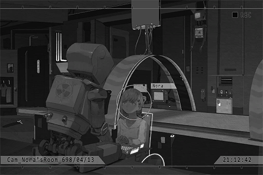

**[Nora]** 
_... Maybe we should shut you down first. It's necessary that we do a complete diagnosis of your core system.  
Activate shutdown command. Enter voiceprint password: \[NORA\]._

**[ROBO_Head]** 
_... Creator voiceprint command, verification success. 
Nora, goodbye._

*\[ROBO_Head Shutdown\]*

**[Nora]** 
_Having self\-consciousness will lead to conflict and clashes with self\-awareness. Did the system, after self\-learning... achieved personal growth? If I just leave him alone, it could lead to even more problems. 
Maybe we can solve this issue by resetting the system... But if I do that, ROBO's memory..._

**Nora** 
......

**[Nora]** 
_... No, the way he is now should be just fine._

_\[Signal Lost\]_

[*(Click here to go back to the top)*](#toc)

## <a id="noos026"/>\[#026\] Cam\_Nora\_698\_04\_28
### Requirements
|Character|Level|
|---------|:---:|
|**Nora** | 18  |

### Log Content
*\[Door Opens\]*

**Phoenix** 
Nora, how are you feeling now? Better?

**[Nora]** 
_Much better._

**[ROBO_Head]** 
_After physical and medical treatment, immune system functioning normally.  
Temperature lowered to 36.824 degrees. Recovery process: going well._

**Phoenix** 
Good to hear that. Nora's not afraid of The Ender, yet she fell prey to a small flu virus. You have no idea how much panic the team was in when that news broke out.

**[Nora]** 
_... I'm sorry..._

**Phoenix** 
No need to apologize. Just so happens that there are no fortune telling requests this week. If any comes in, I'll try my best to push it back for you. Take your time and rest well.

**[Nora]** 
_Got it. Thank you._

**Phoenix** 
I'll not disturb you anymore. 
ROBO, take good care of her.

**[ROBO_Head]** 
_Message accepted, Phoenix._

*\[Door Opens\]*

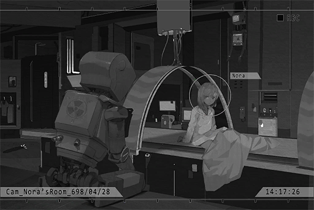

**[Nora]** 
_Phoenix worries way too much... This is just a small cold. Nothing serious. 
ROBO, you don't have to watch over me all the time too. It's pretty boring, right?_

**[ROBO_Head]** 
_This unit, don't understand, definition of "boring". 
Decision: This unit, not equipped, with logistics of said human emotion._

**[Nora]** 
_You do though. Sometimes, when you're not doing anything, your screen will display some random icons or your body will perform some meaningless actions. That's what we call "bored". 
You can go to the workshop to compose your music. I'll be just fine on my own._

**[ROBO_Head]** 
_This unit, judgment, Nora, not yet fully recovered. May need assistance from this unit any time. 
In addition..._

**[Nora]** 
_Hmm?_

**[ROBO_Head]** 
_Data shows: when having a conversation partner, human body will recover faster. 
According to a document from 684 N.A., researcher compared a sample size of 500 patients infected with the cold to normal cold patients. These 500 patients all have a conversation partner. He observed a 28% decrease in recovery time. Difference is significant._

**[Nora]** 
_You're talking about the paper written by Jones Walker, right? Although his speculation did indeed correlate with the experiment results, it felt way too forced. He was not able to come up with a scientific theory to back his explanation. 
If Phoenix is here, he'll definitely say that what he's doing is essentially praying. The researcher is praying desperately that the truth is exactly as he has hoped._

**[ROBO_Head]** 
_Phoenix's point of view, this unit agrees. 
Nora, this unit's creator and target of protection. This unit, want to accelerate Nora's recovery. 
Decision: Stay by Nora's side until she fully recovers._

**Nora** 
......

**[ROBO_Head]** 
_... Is, this decision, weird?_

**[Nora]** 
_Yep, it is weird. 
Nevertheless, I feel like the way ROBO is right now is just fine._

**[ROBO_Head]** 
_This unit, will follow Nora's instructions. 
After Nora recovered, this unit, suggest Nora pay more notice to her health conditions. Excluding the flu factor, overall health parameters, 7% decrease compared to last week.  
Downward trend quite obvious._

**[Nora]** 
_... Thank you for the consideration, ROBO. I will do just that. 
If you don't mind, can you do me a favor?_

**[ROBO_Head]** 
_Of course._

**[Nora]** 
_I want to listen to some music. Can you play it for me?_

**[ROBO_Head]** 
_Command accepted. Commence operation. 
This unit, searching music that helps body recuperate, 7,902,005 results found..._

**[Nora]** 
_You don't have to search. 
Can you play《Jakarta PROGRESSION》for me?_

**[ROBO_Head]** 
_This unit, does not recommend.《Jakarta PROGRESSION》vibrant style, complicated rhythms. Not suitable for patient to recuperate._

**[Nora]** 
_It's fine. I like that song, and I want to listen to it now._

**[ROBO_Head]** 
_Got it. Will follow Nora's instruction._

*\[Music\]*

**[ROBO_Head]** 
_Thank you to Nora for liking this unit's first musical composition._

**[Nora]** 
_You're welcome. I also have to thank ROBO for creating such wonderful music._

*\[ROBO_Head shaking his head\]*

**[Nora]** 
_Woah! ROBO, what are you doing?_

**[ROBO_Head]** 
_Self\-diagnostics...... 100% 
... This unit currently in irregular state, analysis, unavailable. Signal velocity and energy conversion efficiency, operating stably at 125% of usual capacity. 
Nora, please explain, this condition._

**[Nora]** 
_Haha, I can understand that feeling. It's probably..._

**Nora** 
......

**[Nora]** 
_... "Happiness", I believe._

_\[Signal Lost\]_

[*(Click here to go back to the top)*](#toc)

## <a id="noos027"/>\[#027\] Cam\_Butsudou\_698\_05\_28
### Requirements
|Character|Level|
|---------|:---:|
|**Nora** | 19  |

### Log Content
*\[Door Opens\]*

**Lam** 
Go in.

**[ROBO_Head]** 
_Mr. Kusu Hayato. Greetings. 
You have, one minute._

**Lam** 
This is the first time I see someone buying just one minute.

**Hayato** 
This is all I can afford... 
So the fortune telling is done using this robot...?

**[ROBO_Head]** 
_This unit, a proxy agent. This one here, the one you are going to talk to._

**Hayato** 
... So this little girl... is "The Eye of Horus"?

**[Nora]** 
_......_

**[ROBO_Head]** 
_Timer start. Please ask your question._

**Hayato** 
I... A very important friend of mine went missing. I want to know where she is. No matter the result, please tell me! Her name is "Kaori Minamiya". This is her photo... The last time I saw her was four years ago on the night of April 25th. We were performing on Wolong Street...

**[ROBO_Head]** 
_Message received._

**[Nora]** 
_......_

**Hayato** 
......

**[Nora]** 
_...... Ugh... She's... not here..._

**Hayato** 
......

**[Nora]** 
_......!?_

**Hayato** 
Hey!? Are you alright!? Your nose is bleeding!

**[ROBO_Head]** 
_Time is up. Thank you for using the service of the All\-knowing eye. The exit is at the rear right._

**Hayato** 
Eh...? I haven't gotten anything...

**[Nora]** 
_Huff... Puff..._

**Lam** 
Alright. This is your one minute.

**[Nora]** 
_W... wait a second. I'm willing... to see a bit more for this young man._

**[ROBO_Head]** 
_Reminder: Customer funds insufficient._

**[Nora]** 
_It's okay._

**[ROBO_Head]** 
_Warning: Level of ability use reaching Nora's critical point._

**[Nora]** 
_ROBO, it's okay... 
This person... is different from the other people who came to get their fortune told. 
I want to help him... Besides, just now..._

**[ROBO_Head]** 
_If Nora said so, this unit understand._

**[Nora]** 
_Are you okay with it? Uncle Lam._

**Lam** 
... Whatever you please.

**Hayato** 
Really!? Thank you so much...!

**[Nora]** 
_......_

_\[»»» Fast Forward 5 Minutes»»»\]_

**[Nora]** 
_... Ugh... Argh..._

**Hayato** 
Hey! Forget about it! You look really pale! 
I'm fine now! You can stop looking!

**[ROBO_Head]** 
_Warning: Level of ability use exceeding Nora's limit. Please stop immediately!_

**[Nora]** 
_Just... a little more..._

*\[Things knocked down\]*

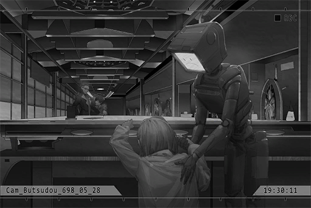

**Hayato** 
Hey! Are you alright!?

**Lam** 
Hey brat, what are you doing? Stay where you are and don't move a finger.

**Hayato** 
She fainted!

**Lam** 
I'll check her out. You sit there and wait. 
... Is she alright?

**[ROBO_Head]** 
_Situation: Life\-threatening conditions, negative. Consciousness, clouded._

**[Nora]** 
_Umm... I'm fine. 
Mr. Kusu..._

**Hayato** 
Ah, yes!

**[Nora]** 
_This person you're looking for... who is she...?_

**Hayato** 
Eh? She's my childhood friend. We grew up together. She's a very normal girl... 
Did you see anything? What are the results!?

**[Nora]** 
_Apologies... This fortune telling process is very different from anything I've experienced before... The things I saw were very limited. Nevertheless, I can tell you, that she's still alive at this moment._

**Hayato** 
... For real!? Thank goodness!

**[Nora]** 
_... Node 08. She is right there..._

**Hayato** 
Node 08!?

**[Nora]** 
_Yes... This is the most... I was able to see..._

_\[Signal Lost\]_

[*(Click here to go back to the top)*](#toc)

## <a id="noos028"/>\[#028\] ?͜͠͝?͝҉̢͜͏?̶̀
### Requirements
|Character|Level|
|---------|:---:|
|**Nora** | 20  |

### Log Content
**？？？** 
Ummm... Ughv̶̫}͚̖̪\*̴̼̘̙͔v͖̦̫̞͍̻̗6͖͚̼̙́\-̢̰...

**Nora** 
Who... are you...?

**？？？** 
_\*Sobs\*_...

**Nora** 
I've never met another person here before. You...

**？？？** 
......

_\[Sig>̵̧̀͘͠}̧̀̕҉>̛́ Lost\]_

[*(Click here to go back to the top)*](#toc)

## <a id="noos029"/>\[#029\] Cam\_Nora\_698\_05\_29
### Requirements
|Character|Level|
|---------|:---:|
|**Nora** | 21  |

### Log Content
**[Nora]** 
_Umm..._

**[ROBO_Head]** 
_Observation: Nora has awakened. Proceed with follow\-up diagnosis. 
Nora, question. How many fingers do you see?_

**[Nora]** 
_... Two. By the way, you're not even a medical robot. What the heck are you doing? Haha... I'm fine... Ugh!_

**[ROBO_Head]** 
_Consciousness normal. Intracranial pressure, still too high. 
Decision: rest required. 
Nora, please close your eyes. This unit will activate the silent chamber isolation system..._

**[Nora]** 
_Wait a minute..._

**[ROBO_Head]** 
_Nora's physical condition, at critical point. Rest required..._

**[Nora]** 
_It's okay... Please, ROBO... 
Can you... talk with me for a bit?_

**[ROBO_Head]** 
_... Instruction received, Nora._

*\[ROBO_Head sits down\]*

**[Nora]** 
_Back then... I fainted while using my ability, right?_

**[ROBO_Head]** 
_Affirmative. 
Nora, lost consciousness back there. Similar symptoms as previous incidents. However, cranial nerves suffered extremely severe pressures. Exceeded past critical points. If not for Phoenix's emergency treatment, could be life\-threatening._

**[Nora]** 
_No, this time... it's very different from anything I've experienced..._

**[ROBO_Head]** 
_Please describe in detail._

**[Nora]** 
_I... I haven't even told Phoenix about this either. Sometimes, when I'm using my ability, I'll see the following scenery... It's like I dived into a deep, deep ocean. It was really dark around me, with the exception of some bizarre lights flowing around. There's usually nothing in that space... but not this time. I saw..._

**[ROBO_Head]** 
_Nora saw, what?_

**[Nora]** 
_... A person... crying..._

**[ROBO_Head]** 
_Nora's description, multiple logical fallacies detected. Possible explanation: dreams or hallucinations. 
High intracranial pressure often leads to dizziness and cognitive disorder for humans. This unit, decision, Nora's condition, 99% match with this description._

**[Nora]** 
_I see..._

**[ROBO_Head]** 
_This unit, strong suggestion: This unit, decision, Nora is no longer suitable to perform fortune telling. Should quit immediately._

**[Nora]** 
_...... 
ROBO... Are you... angry?_

**[ROBO_Head]** 
_... Decision unavailable._

**[Nora]** 
_You have emotions. I know that very well._

**[ROBO_Head]** 
_... Nora is fully aware of the dangers her conditions possess, yet still continues to use her ability beyond the critical point. This unit's main purpose is to protect Nora's life from potential dangers. Yet Nora constantly indulged in actions that go against said purpose. 
This unit, can't understand._

**Nora** 
......

**[Nora]** 
_ROBO, do you know where people will go after they died?_

*\[Loading Sounds\]*

**[ROBO_Head]** 
_From scientific angle, after human dies, the body will be disintegrated into nutrients. Will then supply other creatures within the soil with resources to live. 
This is, part of the cosmic energy cycle._

**[Nora]** 
_You're referring to the physical body, but the physical body does not represent humans as a whole._

**[ROBO_Head]** 
_The other part Nora mentioned, according to data, speculate to be human consciousness. However, as of now, humans yet to discover storage unit for consciousness within human body. Preservation, difficult._

**[Nora]** 
_Perhaps, but I have this feeling... That the answer... is not too far away from me._

**[ROBO_Head]** 
_This unit, don't really understand, what Nora wants to express._

**[Nora]** 
_I'm sorry... I don't really understand myself too... 
Maybe I just want to tell you, that death... does not erase a person's trace from the world completely. People can "live" in other forms, not just physically._

**[Nora]** 
_The spirit, the mind, the memories... All of them are proof of a person's existence..._

**[ROBO_Head]** 
_......_

**[Nora]** 
_Haha... What am I mumbling about? Bunch of nonsense... I must be really exhausted._

**[ROBO_Head]** 
_This unit, activate silent chamber for Nora..._

**[Nora]** 
_Sorry, but just a few more minutes..._

**[ROBO_Head]** 
_......!_

**Nora** 
...... (Nods)

**[ROBO_Head]** 
_......_

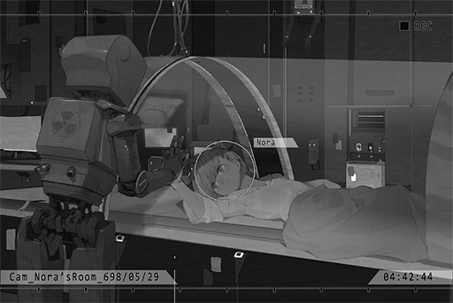

**[Nora]** 
_As I expected, you can understand what I meant, ROBO... I'm so glad that I have you by my side._

**[ROBO_Head]** 
_... Nora, please enjoy your sleep._

*\[Silent chamber activated\]*

**[ROBO_Head]** 
_......_

*\[ROBO_Head emotion\]*

**[ROBO_Head]** 
_......_

_\[Signal Lost\]_

[*(Click here to go back to the top)*](#toc)

## <a id="noos030"/>\[#030\] Log\_Phoenix\_698\_06\_01
### Requirements
|Character|Level|
|---------|:---:|
|**Nora** | 22  |

### Log Content
Research Log 6980601\_23

Alright... This is the first research log for June of 698. This week, the medicine team tested a formula consists of refactored Acetylcysteine molecules in an attempt to suppress external symptoms. Despite several attempts, we are still unable to prevent "The Ender" from directly attacking human cells and leading to other symptoms. Similar to what has happened in the past, "The Ender" acts in a way that's almost... life\-like. It will bypass all defensive barriers and find new weaknesses to kill its host.

The specimen team performed a more comprehensive check\-up on Nora this week, yet nothing was found. Her blood doesn't contain any unknown element that can suppress "The Ender". It's just like every other person's blood. However, this discovery did indeed spark a new theory in my mind: What if "The Ender" is a completely different virus type, one that's never been observed before?

I have suspected a long time ago, that besides some special element within her body, it could be her other characteristics that have been stopping "The Ender" from harming her body. After we discovered Nora's ability, we've also started analyzing her brainwaves. Due to Nora's frequent use of her ability in recent days, patterns that were previously hidden have become clearer and clearer... This is still a speculation, but I believe that Nora's brainwaves are the keys to opening the door. On top of that, Nora's body doesn't make her "immune" to the virus. Instead, it is using some sort of mechanism so she can... "coexist" with "The Ender".

The only issue is that as of today, we haven't found any evidence that can support this speculation.  Nora's brainwaves are almost as hard to grasp as "The Ender". It's extremely difficult to replicate the same result multiple times... I still need more active samples, especially her brainwave data while she is using her ability. If only... we have more cases of people with immunity...

... If we do... Nora won't have to go through these hardships anymore. She can go to Node 08, showcase her talents at A.R.C. and bring benefits to human civilization... She can reach even higher places than I did... or... she could just lead a normal life... one that everyone human being deserves... Compose music from time to time... That's happiness to her, right?

Happiness, eh... What do I know... about happiness? ... In the past, I did so many despicable things, all in the name of research... Manson was right. I've long lost the right to have a heart or feel any emotion...

......

It seems that I... am a bit too drunk. What was I thinking... saying all this stuff in a research log... Whatever, the research will continue tomorrow, once the tedious fortune telling is over. I hope we can have a significant breakthrough very soon. Recording complete. Voiceprint verification: Phoenix Wyle.

Save date of log: 698\_0601\_2703

[*(Click here to go back to the top)*](#toc)

## <a id="noos031"/>\[#031\] Cam\_Butsudou\_698\_06\_02
### Requirements
|Character|Level|
|---------|:---:|
|**Nora** | 22  |

### Log Content
*\[Door Opens\]*

**Nora** 
......

**Huang** 
I said I would come back.

**[ROBO_Head]** 
_Mr. Huang. Greetings. 
You have 20 seconds. Please ask your question._

**Lam** 
... So you only bought 20 seconds? I didn't know that Hou Sang Tong is already this poor, Mr. Huang.

**Huang** 
20 seconds... are more than enough.

*\[Flips switch\]*

**Lam** 
......!? 
Ugh! Ark ark! Blarghhh!

**Kim** 
Hahaha! Idiot! Did you really think that I can't do anything with a fake report? 
Have a taste of my masterpiece!

**Mogura Bodyguard** 
Boss!

*\[Gunshot\]*

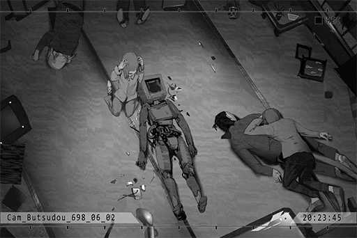

**Mogura Bodyguard** 
Arghhhh!

**[Nora]** 
_ROBO!_

**Lam** 
... What... did you do...

**Huang** 
A nano\-capsule developed by Kim. The moment I flip this switch, the capsule will explode within your body and release The Ender virus... You're getting too old, Manson. Bet you didn't expect that I added some extra "ingredients" to your meal, didn't you?

*\[Kicks gun away\]*

**Huang** 
Without a gun, you're nothing more than a worthless hack. Karma's a b\*\*\*\*, Manson. Enjoy your death from a "cause" you created on your own. 
As with this little girl, I'll gladly take her. "The Eye of Horus" shall be property of the Hou Sang Tong. Muhahaha! 
Grab her!

**Kim** 
No problemo! 
... Don't hate me, Nora. It's Phoenix who caused all of this. If you want to hate someone, hate him. Hehehe!

**[Nora]** 
_Let me go! ROBO! Wake up!_

**Kim** 
It's useless. This baby here is armed with EMP Armor\-piercing rounds! He is now nothing more than a pile of scrap metal, haha!

*\[Consecutive Gunshots\]*

**Huang, Hou Sang Tong Bodyguard** 
ARGHHHHH!

**Kim** 
......!?

**Lam** 
Cough cough... As long as I'm alive... always remember... to kick the gun further away from me... cough cough... bunch of idiots...

**Huang** 
... You!

*\[Gunshot\]*

**Lam** 
Haha... Cough... Only you left... Put Nora down, and I'll grant you a less painful death... Cough cough...

**Kim** 
... Impossible!? Why aren't you dead!?

**Lam** 
I told you before... You're not even half as capable as Phoenix... He has developed a vaccine that can vastly reduce the power of The Ender a while ago. Furthermore, he went ahead and tested it on multiple key members of the organization already... If you increased the virus concentration in the capsule, maybe I'm already dead by now... For the first time in my life... I have to thank you for your foolishness...

**Kim** 
D... Don't come near me! Another step and I'll blow her brains out!

**Lam** 
Did you forget... what happened to you the last time you utter those words?

*\[Loads Gun\]*

**[ROBO_Head]** 
_Detect...... Nora...... Danger......!!_

**Lam** 
!?

**[ROBO_Head]** 
_Detect...... Nora...... Danger......!!_

**[Nora]** 
_ROBO! NO!_

*\[Heavy Blow\]*

**Lam** 
ARGH!

*\[Heavy Blow\]*

**Kim** 
UGH!!

**[Nora]** 
_STOP IT! \[NORA\] !!_

**[ROBO_Head]** 
_... Creator... voiceprint command... verification... success. 
Nora, goodbye..._

*\[ROBO_Head Shutdown\]*

_\[»»» Fast Forward»»»\]_

*\[ROBO_Head Start-Up\]*

**[ROBO_Head]** 
_This unit, start\-up, success. Running self\-diagnostics... complete. 
Detect multiple physical damages on hardware._

**Nora** 
......

**[ROBO_Head]** 
_Analyzing situation... Unable to comprehend._

**[Nora]** 
_Kill... ROBO... killed someone._

**[ROBO_Head]** 
_... Everyone. here?_

**[Nora]** 
_No... Only uncle Lam and Kim... That's not the point. The Mogura people will discover this immediately... We need to run away, fast! Let's go back to Kyuu Hou Kai first! Phoenix is still there!_

_\[Signal Lost\]_

[*(Click here to go back to the top)*](#toc)

## <a id="noos032"/>\[#032\] Cam\_KyuuLab\_698\_06\_02
### Requirements
|Character|Level|
|---------|:---:|
|**Nora** | 23  |

### Log Content
**[Nora]** 
_Phoenix! I..._

**Phoenix** 
No need to talk! I've already received the report. Quick, come with me! Both the Mogura and Hou Sang Tong people are coming towards here.

**[Nora]** 
_I'm sorry... It's all because of me..._

**[ROBO_Head]** 
_Responsibility, all on this unit. Did not execute protect command correctly._

**Phoenix** 
Ahah, Manson's dead... Mogura only wants to dispose of ROBO\_Head. The bigger problem is with the Hou Sang Tong people. They could destroy the entire Lab and kill everybody...

**Nora** 
......

**Phoenix** 
Regardless of what happened, I will not let any one of you be in danger. Those two groups will definitely clash with each other first outside. We'll use that opportunity to get away.

_\[→Signal Switches\]_

*\[Hurried Footsteps\]*

**Phoenix** 
This is a secret passage way that's connected to the sewer system. They will not discover this place. I've asked Ichiro to prepare a speedboat. We'll make our way to the transit station and escape to another Node.

**Kim** 
You are not going anywhere!

**Phoenix** 
...... Kim!

**Kim** 
Hehe...Eheeeheee! I knew it! You guys will try to escape through here... 
Didn't expect this, didn't ya? That stupid robot f\*\*\*ed up my entire left arm... Yet somehow I just can't die...

**Phoenix** 
So you survived... Kim, you're indeed a cockroach with how goddamn hard it is to kill you. Well, guess there isn't a more fitting place for your grave than this disgusting sewer, am I right!?

**Phoenix** 
ROBO, take Nora with you and run first...

**[ROBO_Head]** 
_... Understood._

**Kim** 
All of you, stay the f\*\*\* why you are! You are all gonna die here!

**Phoenix** 
... Kim, this grudge is between you and me. Let them go.

**Kim** 
Huh!? What kind of stupid BS are you talking about!? That stinkin robot destroyed my left arm. That stupid brat exposed my plan. You made my life a heaping mess... and Manson Lam for blowing my right hand off! All of you will pay for what you did to me, right here, right now! Manson Lam ! Where the f\*\*\* are you!? Show yourself!! You c\*\*\*sucking son of a b\*\*\*! Ahahahaha EHehehehehe!!

*\[Gunshot\]*

**Phoenix** 
UGH! Run!

_\[→Signal Switches\]_

*\[Hurried Footsteps\]*

**Phoenix** 
Ha...! Ha......!

**[ROBO_Head]** 
_Phoenix, gunshot wound in abdomen region. Potential damage to organs. Should apply emergency treatment right away._

**Phoenix** 
Shut up... Keep running.

*\[Speedboat Engine\]*

**Member I** 
Director! Nora! Get on the boat!

**Phoenix** 
Ugh......! Ichiro, start the boat!

**[Nora]** 
_...... Phoenix?_

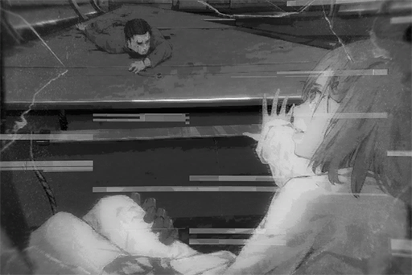

*\[Gunshot\]*

**Kim** 
Where are you hiding you bastards!? Come and get some you pieces of s\*\*\*! Ehe, ehe, Eheheheh! Ahahahaha!

**Phoenix** 
Quick... start the boat...

**Member I** 
Director!! 
......!? Yikes! You're badly injured...

**Phoenix** 
If you take me with you... you aren't getting very far away. Kim is harder to kill than a f\*\*\*\*\*\* cockroach... I have to finish him off myself, or he will never stop chasing you guys...

**Nora** 
......

**[ROBO_Head]** 
_Let this unit... deal with Kim._

**Phoenix** 
Have you taken a look at yourself? 
... ROBO, you are not created as a weapon to kill... Those EMP Armor\-piercing rounds Kim has, you've witnessed its power, haven't you? That thing's gonna tear you apart in seconds.

**[Nora]** 
_...... Phoenix......_

**Phoenix** 
Nora, your real name is...... \[Shizuka Shiino\]. Your birthday is 690 N.A., November 11th... When you reach Node 08, find a person by the name of "Noah Black". He was my subordinate when I was working at A.R.C. Take this new identity and go live a new life. I'm sure he will help you settle everything down...

**[Nora]** 
_...... Phoenix! No! Nora is my name! I......_

**Phoenix** 
... I... am not someone who's worthy of respect... The crimes I committed are too many to even properly count... However, after you came into my life... I finally realized... how despicable I used to be. I thought I can justify my actions by using "science" as a solid reasoning... but science was nothing more than an excuse I created so I don't have to accept what a horrible person I have become... It was thanks to you that I was finally able to remember the true purpose of my research... We humans have the power of "knowledge". That's why it's our duty to make the world a better place....... I've always wanted to let you live in a world like that... Now, it's up to you to create that world yourself...

*\[Gunshot\]*

**Kim** 
I, found, you\~\~

**Phoenix** 
ICHIRO! GO! NOW!!

**Member I** 
I... ARGGGGHHHHHH!!!!

*\[Speedboat Engine\]*

**[Nora]** 
_Phoenix！！！_

**Phoenix** 
I'm sorry... I was never a good father...

*\[Gunshot\]*

_\[Signal Lost\]_

[*(Click here to go back to the top)*](#toc)

## <a id="noos033"/>\[#033\] Cam\_Robo\_698\_06\_02
### Requirements
|Character|Level|
|---------|:---:|
|**Nora** | 24  |

### Log Content
**Member I** 
Huff...... Puff..... This way!

**Member I** 
Here, the ticket and the clearance pass are all here. Your Node 08 citizen ID should be completed before you arrive. Nora's ID will be "Shizuka Shiino". ROBO can clear the security check directly as Shizuka's proxy robot... 
Ah! But no matter what happens, don't let the law enforcement agents find out that you're an artificial intelligence; or else the security check process is gonna get really complicated!

**[Nora]** 
_... How about you, Ichiro?_

**Member I** 
Me? No, we only have tickets for you two. I'm not going.

**[Nora]** 
_You're staying here? You should leave with us!_

**Member I** 
I still need to take care of my grandmother. I can't just leave her here and go somewhere else. 
Besides, you don't need to worry. Mogura and Kyuu Hou Kai will definitely be victorious! The Hou Sang Tong people are no match for them!

**[Nora]** 
_... You assisted us in our escape. Mogura will not forgive you for that..._

**Member I** 
... Umm... Well... Where there's a will, there's always a way! Haha, don't worry about me!

**Nora** 
......

**Member I** 
Alright. Mogura has informed the entire Administration Bureau. People will catch up with us anytime now. You better get moving!

**[Nora]** 
_But..._

**Member I** 
JUST LEAVE YOU BASTARDS...!!

**Nora** 
!?

**Member I** 
Director is dead! His final wish is for me to see you guys off safely!! So F\*\*\* OFF!! 

**[Nora]** 
_Ichiro..._

**[ROBO_Head]** 
_This unit, understands. Ichiro, goodbye. 
...... Thank you._

**Member I** 
Farewell, you big stinkin robot...

_\[»»» Fast Forward»»»\]_

**[Platform Announcement]** 
_Attention, fellow passengers. The express train directly to Node 08 is now arriving at the platform. For your own safety, please stand behind the yellow line._

*\[Train arrives\]*

**[ROBO_Head]** 
_Train has arrived. We, board now._

**[Nora]** 
_Ok..._

**Nora** 
......

**[Nora]** 
_...... I'm sorry...... 
\[Nora\]._

**[ROBO_Head]** 
_... Creator voiceprint command, verification success. 
Nora, goodbye._

*\[ROBO_Head Shutdown\]*

_\[»»» Fast Forward»»»\]_

**[Nora]** 
_Activate offline recording mode._

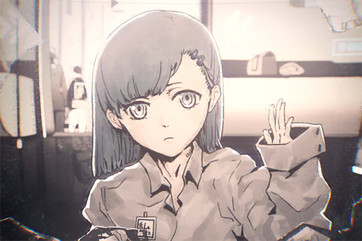

**[Nora]** 
_ROBO, when you see this message, it means you've already arrived at Node 08. I'm sorry... I couldn't go there with you._

**[Nora]** 
_As long as you are with me, Mogura will definitely follow us there as well, no matter where we hide... The folks at Mogura want to dispose of you. You'll never be truly safe with them constantly chasing you._

**[Nora]** 
_I, on the other hand, still have a lot of value to them. I am very certain that they won't harm me. Therefore, I decide to stay here and use my ability as a bargaining chip to persuade them to no longer hold you responsible for what you did._

**[Nora]** 
_Ever since I created you, so many things have happened... We created music together. We talked with each other. We played games... Whether it was the good or the bad, you were always there by my side. The time I spent with you... was truly some of the happiest times in my life. Thank you._

**[Nora]** 
_ROBO, you are a very special existence... Much more than just a simple A.I. You have your own emotions, your own soul that was birthed from the database that is me——Nora._

**[Nora]** 
_Do you remember what I told you before? The spirit, the mind, the memories... All of them are proof that a "human" once existed. Therefore, for someone who inherited all of the above from me, you are the proof of my existence._

**[Nora]** 
_So, please, go pursue "your own" freedom and dreams... If you do that, it's like you're pursuing my freedom and my dreams._

**[Nora]** 
_I have reconfigured your supreme command. From now on, protecting me is no longer your reason to live. I also forbid you from returning to Node 03._

**[Nora]** 
_On behalf of me, experience more happy things. Let more people hear our music. Learn even more things... Go live a life that you've yearned for. This is something you deserve._

*\[Platform announcement\]*

**[Platform Announcement]** 
_The train is about to depart. For passengers who haven't board the train, please proceed to take other trains. Thank you for your cooperation_

**[Nora]** 
_.... Goodbye, ROBO\_Head._

_\[Signal Lost\]_

[*(Click here to go back to the top)*](#toc)

