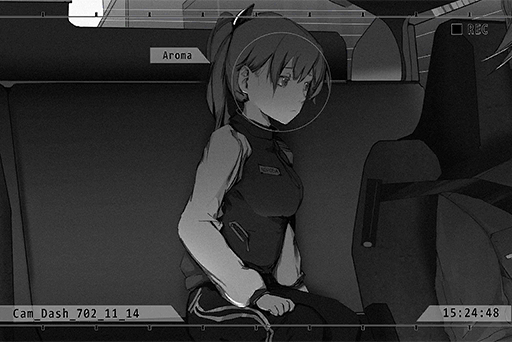

# Cam_Dash_702_11_14
## Requirements
|Character|Level|
|---------|:---:|
|**PAFF** | 67  |

## Log Content
*\[Brakes\]*

**NEKO#ΦωΦ** 
Here! Aroma\-chan, get in, now!!

**PAFF** 
Wahhh!

*\[Door Closes\]*

**NEKO#ΦωΦ** 
All set! Move! Get going!

**Men In Black** 
Wait! Stay where you a...

*\[Engine Sounds\]*

**Pedestrian A** 
There were so many people around that apartment we just passed by.

**Pedestrian B** 
All diehard PAFF fans. They said on iM that they are going to "welcome" her back, but I think they missed her.

**Pedestrian A** 
Dude, I would totally freak out if I was her. No way in hell would I dare show my face!

**Pedestrian B** 
Hehe, maybe she's hiding nearby and observing the crowd...

**Pedestrian A** 
Wait a second. The girl inside that car, is that...

**Pedestrian B** 
N, no way. It can't be...

**PAFF** 
Woah...!

**PAFF** 
That was close... Almost got recognized again...

**PAFF** 
Thank you, Mr. Asakura. Excuse me for all the ruckus...

**???** 
......

**PAFF** 
Ummm... Mr. Asakura?

**PAFF** 
NEKO said the bar is located in Quadrant II...

**PAFF** 
You... do know the directions, right?

**???** 
......

*[Signal Lost]*