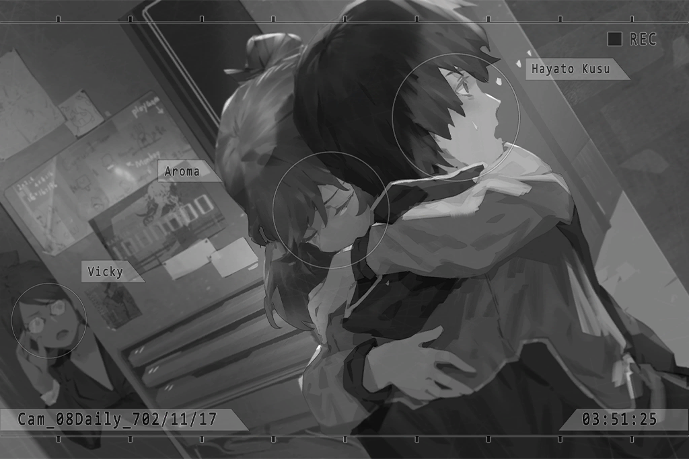

# Cam_08Daily_702_11_17
## Requirements
|Character|Level|
|---------|:---:|
|**PAFF** | 68  |

## Log Content
**Vicky** 
Hi, sorry for pulling you out of your dreams at this time of the night.

**Hayato** 
It's okay. So Sis Vicky has confirmed the things I said?

**Vicky** 
Yes. That girl you mentioned... the name "Kaori Minamiya" does indeed appear in the Missing Persons search website of 03's Administration Bureau. Regarding her disappearance, how much do you know?

**Hayato** 
Not much either, to be honest... The only thing I know is that Kaori went missing after that performance.

**Vicky** 
......

**Hayato** 
We waited for her the whole night, yet she didn't come home... Grandma and I searched for her desperately, but all we found was her broken keyboard. It was as if she just vanished into thin air. No one has heard anything about her ever since.

**Vicky** 
I see...

**Hayato** 
Of course, we reported it to the Bureau as well. But... as Sis Vicky knows very well, our Administration Bureau isn't exactly...

**Vicky** 
Yep. The admins of Node 03 won't move a muscle unless they're getting something out of it. A girl from a poor household gone missing; I bet they didn't even flinch when the case was reported to them.

**Hayato** 
Yes... Grandma wasn't exactly healthy, to begin with. Not long after that, she...

**Vicky** 
... I'm sorry to hear that.

**Hayato** 
Thank you... After that, I finally got a clue which told me that Kaori might be in Node 08. Sis Vicky, have you ever heard of the "Eye of Horus"?

**Vicky** 
......! 
I've heard stories about her when I was investigating rumors in Node 03. Apparently, the person is a psychic who has the ability to see everything... So that's real?

**Hayato** 
Yes. The actual person was a little girl. She told me that the person I'm looking for might be in Node 08, a place the two of us used to refer to as the "music world of our dreams".

**Vicky** 
So, you came all the way here and applied to intern as a reporter. You little... 
You even had the gall to say how passionate you are about photography during the interview...

**Hayato** 
I, I'm so sorry.

**Vicky** 
Forget about it. Not a big deal anyway. 
Then, what does all this have to do with PAFF? Judging by what you said, you seem to think that she is that Kaori?

**Hayato** 
I didn't think that way at first either. However, when I saw her rub her temple during a show, I knew that it had to be the case. That trick is something only Kaori and I know... That's when I knew, that was her!

**Vicky** 
Wait, doesn't that sound a bit too ridiculous? Maybe it's all just a coincidence. Even if she underwent plastic surgery, PAFF... Aroma White's identity data is all registered in the Administration Bureau's system. There's no way they can be the same person.

**Hayato** 
I understand, but...

*\[Doorbell\]*

**Vicky** 
Huh? That's strange. Who would come to the office at this time of the night?

**Hayato** 
Maybe Susan? She might have forgotten the lens or something like that...

**Vicky** 
*\*Sigh\** With her, that's entirely possible. You go answer the door. I need to organize the information you just gave me.

**Hayato** 
Okay.

*\[Doorbell\]*

**Hayato** 
Ah, one second, please...

*\[Door Opens\]*

**Hayato** 
......!?

**Vicky** 
Hey, Hayato? Who is it...

**Vicky** 
...... PAFF!?

**PAFF** 
... Finally...

**Vicky** 
W, why are you here... Wait, are you crying?

**PAFF** 
I finally get to see you again... Hayato!

**Vicky** 
!?

**Hayato** 
......

**Hayato** 
... Kao... ri?

*[Signal Lost]*
