# PAFF OS Logs
## <a id="toc"/>List of Logs
- [\[#001\] Show\_693\_03\_16](#pos001)
- [\[#002\] Cam\_Noah\_693\_03\_16](#pos002)
- [\[#003\] Call\_Chris\_693\_03\_29](#pos003)
- [\[#004\] Cam\_Noah\_693\_05\_11](#pos004)
- [\[#005\] Cam\_Noah\_693\_06\_13](#pos005)
- [\[#006\] Mail\_Chris\_693\_07\_02](#pos006)
- [\[#007\] Cam\_Noah\_693\_08\_14](#pos007)
- [\[#008\] Audio\_NMobile\_693\_08\_14](#pos008)
- [\[#009\] Cam\_NDrivRec\_693\_08\_15](#pos009)
- [\[#010\] Cam094\_ARC\_H\_694\_05\_15](#pos010)
- [\[#011\] Cam\_TunerSan\_702\_09\_25](#pos011)
- [\[#012\] Cam\_Hospital\_693\_08\_16](#pos012)
- [\[#013\] cyTus\_Server 08\_702\_01\_18](#pos013)
- [\[#014\] Audio\_Arena\_702\_07\_27](#pos014)
- [\[#015\] Audio\_ARC\_H\_702\_07\_28](#pos015)
- [\[#016\] Audio\_Noah\_702\_08\_03](#pos016)
- [\[#017\] Audio\_Noah\_702\_09\_01](#pos017)
- [\[#018\] Audio\_Noah\_702\_09\_09](#pos018)
- [\[#019\] Cam\_Daily08\_702\_10\_18](#pos019)
- [\[#020\] Audio\_Xmas\_688\_12\_24\_1](#pos020)
- [\[#021\] Audio\_Xmas\_701\_12\_24](#pos021)
- [\[#022\] Audio\_Xmas\_688\_12\_24\_2](#pos022)
- [\[#023\] Audio\_Academy\_702\_10\_07](#pos023)
- [\[#024\] Image\_Academy\_702\_10\_07](#pos024)
- [\[#025\] Audio\_St07\_702\_10\_20](#pos025)
- [\[#026\] Audio\_Asakura\_702\_10\_07](#pos026)
- [\[#027\] Audio\_Daily08\_702\_10\_23](#pos027)
- [\[#028\] Cam\_Fwy01\_693\_08\_15](#pos028)
- [\[#029\] Audio\_Hospital\_694\_03\_28](#pos029)
- [\[#030\] Audio\_Hospital\_694\_04\_20](#pos030)
- [\[#031\] Audio\_Arc\_692\_08\_13](#pos031)
- [\[#032\] Audio\_Arc\_692\_08\_20](#pos032)
- [\[#033\] Cam\_ARC\_H\_694\_04\_30](#pos033)
- [\[#034\] Cam\_ARC\_H\_694\_05\_12\_1](#pos034)
- [\[#035\] Cam\_ARC\_H\_694\_05\_12\_2](#pos035)
- [\[#036\] Audio\_ARC\_H\_694\_05\_15](#pos036)
- [\[#037\] Audio\_Noah\_695\_06\_05](#pos037)
- [\[#038\] Audio\_ARC\_H\_702\_07\_28](#pos038)
- [\[#039\] Cam\_Noah\_702\_09\_09](#pos039)
- [\[#040\] Audio\_Vicky\_702\_11\_14](#pos040)
- [\[#041\] Cam\_Charity\_687\_05\_13](#pos041)
- [\[#042\] Cam\_Feng\_689\_04\_03](#pos042)
- [\[#043\] Audio\_Asakura\_702\_11\_14](#pos043)
- [\[#044\] Audio\_St08\_702\_11\_14](#pos044)
- [\[#045\] Cam\_Dash\_702\_11\_14](#pos045)
- [\[#046\] Cam\_DragonSt\_694\_04\_25\_1](#pos046)
- [\[#047\] Cam\_08Daily\_702\_11\_17](#pos047)
- [\[#048\] Cam\_Dash\_702\_11\_14](#pos048)
- [\[#049\] Audio\_Noah\_702\_11\_14](#pos049)
- [\[#050\] Cam\_DragonSt\_694\_04\_25\_2](#pos050)
- [\[#051\] Cam\_Dash\_702\_11\_17](#pos051)
- [\[#052\] Audio\_Cafe\_702\_11\_17](#pos052)
- [\[#053\] Cam\_DragonSt\_694\_04\_25\_3](#pos053)
- [\[#054\] Image\_Base\_702\_11\_17](#pos054)
- [\[#055\] Audio\_Cafe\_702\_11\_17](#pos055)
- [\[#056\] Multi\_File\_P056](#pos056)
- [\[#057\] Multi\_File\_P057](#pos057)
- [\[#058\] ???\_???\_??\_??\_??](#pos058)
- [\[#059\] Cam\_Ward\_702\_12\_14](#pos059)
- [\[#060\] Audio\_Ward\_702\_12\_15](#pos060)
- [\[#061\] Audio\_KyuuLab\_702\_12\_20\_1](#pos061)
- [\[#062\] Audio\_KyuuLab\_702\_12\_20\_2](#pos062)

## <a id="pos001"/>\[#001\] Show\_693\_03\_16
### Requirements
|Character|Level|
|---------|:---:|
|**PAFF** | 35  |

### Log Content
**Host** 
Next up, performer no.12... Aroma White. 
Please take your position and introduce yourself.

**PAFF** 
......

**Host** 
Umm... hello?

**PAFF** 
Eh? Ah, I'm sorry. My name is...

*\[Microphone drops\]*

**Host** 
......

**PAFF** 
I, I'm so sorry... I... I'm Aroma.

**Judge A** 
She's screwed. Can she even sing if she's so nervous already...?

**Judge B** 
Yeah... No need to be nervous. How old are you?

**PAFF** 
F... fifteen...

**Host** 
Relax\~ What song are you singing for us today?

**PAFF** 
《Fight Another Day》

**Judge C** 
Good. You can start singing when the green light turns red.

**Judge A** 
This one's no good. She's so nervous that she can barely talk properly.

**Judge C** 
She looks really cute too. What a shame...

*\[Music\]*

**PAFF** 
\*As the walls around me tie me to a fragment of emotion 
The consequences of my being starts to rise 
The fibres of my essence start to float away 
How can I ever stand to fight another day\*

**Judge A** 
......!

**Judge B** 
Holy...! 
Are you serious...

_\[»»» Fast Forward »»»\]_

**Audience** 
......\-

**PAFF** 
...... I... I'm done with my singing. Thank you...

*\[Audience applauds\]*

_\[Switch Signal\]_

**Helena** 
Aroma! Over here!

**PAFF** 
Sister.

**Helena** 
Congratulations on winning second place! Your singing was amazing!

**PAFF** 
But... only the first place can receive a contract.

**Helena** 
Umm...

**PAFF** 
She can sing, dance, is very funny, and she looks beautiful too... unlike me...

**Helena** 
......

**PAFF** 
... It's too hard for me to be like her.

**Helena** 
Your singing is great, way better than hers! The audience really loved you, and the applause was loud and clear too. You did great!

**PAFF** 
Yes...

**Helena** 
You will overcome your nerves someday. We will come back next time. Don't give up, ok? I will help you do this, together.

**PAFF** 
Yes... I will work hard...

**Helena** 
Good! I will always support your dream. Your voice can definitely make it! 
It's getting late. Let's go back.

**PAFF** 
OK!

_\[Signal Lost\]_

[*(Click here to go back to the top)*](#toc)

## <a id="pos002"/>\[#002\] Cam\_Noah\_693\_03\_16
### Requirements
|Character|Level|
|---------|:---:|
|**PAFF** | 37  |

### Log Content
*\[Door opens\]*

**Noah** 
I'm home.

**Helena** 
Just in time. I am making coffee.

**Noah** 
Hmm, add a bit more sugar today. 
Where's Aroma?

**Helena** 
She's taking a bath... Hmm? Looks like she's just got done with that.

**PAFF** 
Ah, Noah... sorry. You can use the bathroom now.

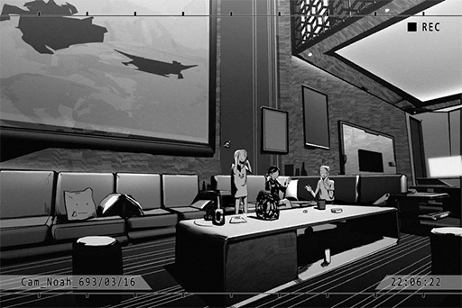

**Noah** 
_\*Chuckles\*_ You don't have to be so cautious. We are living together after all. Just treat me like family.

**PAFF** 
Ok... thank you for letting me live together with you guys. It feels like I'm disturbing you two newlyweds though...

**Noah** 
No need to worry. Having you together with us makes Helena happier too. If I were the only one here, she would probably give me a long face every day. That would be quite the waste of that beautiful face, don't you think?

**Helena** 
Stop your flattering, it's gross... 
Aroma, do you want some coffee?

**PAFF** 
Ah, I'll pour it myself...

**Helena** 
No. You must be exhausted after a whole day at the studio, aren't you? You get some rest; I'll do it.

**Noah** 
Congratulations on second place. You were great!

**[Tuner-san]** 
_Congrats! Congrats_

**PAFF** 
......

**Noah** 
... Don't be disheartened. Compare to the first\-place winner, your performance created even more buzz on iM.

**PAFF** 
Eh?

**Noah** 
See for yourself... 
\[No.12 is so cuuuute!! Her voice is amazing too!\] 
\[Ten times better than the actual winner, stupid organizer and their shady BS\] 
\[I'm in love. Can someone get me her iM account\]...

**PAFF** 
S, stop reading them out loud! It's embarrassing... Also, the first\-place winner is much better than me...

**Noah** 
I saw the live stream. If we were to judge only by singing, then you are indeed the winner.

**Helena** 
Aren't you at work?

**Noah** 
The research department is not really busy these days due to that previous incident... Ah, right; the camera also caught you tearing up. How rare, seeing as you seem to have a poker face 24/7.

**Helena** 
... I, I did not!?

**Noah** 
If you don't believe, check the clip. It's been spreading like wildfire online already.

_\[»»» Fast Forward »»»\]_

**Helena** 
... Another listen and it's still as amazing as the first time. You indeed have the best singing performance.

**PAFF** 
You guys are exaggerating...

**Noah** 
Aroma, have some confidence in yourself. With that singing voice of yours, your dream of being a world\-class singer will come true one day. I guarantee it.

**PAFF** 
... Ok.

**PAFF** 
Even you are saying that... I will try my best, thank you. Feels like Noah is really good at comforting people. Your words calm people down... makes me a little jealous of sister, hehe.

**Helena** 
You're thinking too much. What good does this guy have?

**Noah** 
......

**PAFF** 
What's wrong?

**Noah** 
... Hmm? Ah, nothing. Is the coffee done?

**Helena** 
Should be almost done. I'll go check it out.

**Noah** 
Let me do it.

**Helena** 
You two tired folks should stop trying to take my job. Sit down.

**Noah** 
No, you were even more nervous than Aroma last night. You barely got any sleep, did you? I'll do...

**Helena** 
I SAID, SIT, DOWN.

**[Tuner-san]** 
_Detects Anger Emotion_

**PAFF** 
In times like this, it's best you listen to sister...

**Noah** 
Haha... seems like that's the case.

_\[Signal Lost\]_

[*(Click here to go back to the top)*](#toc)

## <a id="pos003"/>\[#003\] Call\_Chris\_693\_03\_29
### Requirements
|Character|Level|
|---------|:---:|
|**PAFF** | 38  |

### Log Content
**Chris** 
That's more or less the situation. Miss White, what is your reply?

**PAFF** 
I... umm...

**Helena** 
Excuse me, I have some questions I would like to ask.

**Chris** 
Pardon me. You are...?

**Helena** 
I'm Helena, Aroma's older sister. 
I'll be blunt, Monophonic... Entertainment? Never heard of this name before... Your company wants to sign Aroma after seeing the show, is that correct?

**Chris** 
Ah, you're her older sister. Excuse us for the sudden contact. Yes, our CEO on\-site that day. After hearing Aroma's performance, he was blown away...

**Helena** 
No need for all that fluff. You can just cut to the chase.

**Chris** 
Oh... apologies. 
All in all, our CEO really liked Miss White's performance.

**PAFF** 
Thank you...

**Helena** 
However, you mentioned this "special packaging"; what is it? Sounds very vague.

**Chris** 
Our CEO thinks that with Miss White's appearance, elegance and performance traits, she will need to be packaged with the most suitable methods in order to achieve the best results...

**Helena** 
... It's all this unclear information about this part that makes me question you guys. To be honest with you, other agencies have already contacted us...

**PAFF** 
... Eh? Did we...

**Helena** 
Shush! Let me handle it.

_\[»»» Fast Forward »»»\]_

**Helena** 
... That's about it. Their plans are more transparent and clear. For safety concerns, I feel like they are the better choice.

**Chris** 
I understand. Miss White's reputation is at its peak right now. I expected other agencies to act first too... 
But! Our company has the chance to be the most resourceful agency in all of Node08. On top of that, we will devote everything we have to help Miss White. For the sake of her future, partnering with us is certainly the best choice!

**Helena** 
A chance is it...? Then that's not something you can promise, can you? 
However, I can feel your sincerity. Therefore, I will now offer a signing condition as Aroma's guardian.

**Chris** 
...Of course!

**Helena** 
Let me be her agent. I will monitor and participate in all your packaging plans.

**PAFF** 
... Eh!?

**Chris** 
You mean... yourself?

**Helena** 
Yes. I have worked at a public relations company before. My resume and performance are pretty good as well. I can send them to you right now.  
Only if you guys agree to this condition will we even consider signing the contract.

**Chris** 
Umm... I received the documents. Indeed, a very impressive resume... However, I can't make the decision right now. Would you allow me to go back and ask my superiors, then we can continue the negotiation?

**Helena** 
Of course, but let me remind you... based on the recent share of voice on the internet, as well as our ongoing cross\-comparison of other agencies, signing Aroma right now is your best investment. As the share of voice decreases with time, the value you can obtain will also decrease significantly. Please put this into consideration when making your decision.

**Chris** 
Yes, ma'am! I have a feeling... that you will be a great agent.

**Helena** 
I am only a good sister. I will look forward to your reply.

_\[Call Ends\]_

**PAFF** 
... Is that the right thing to do? Shouldn't we be a little nicer...?

**Helena** 
Idiot, how could I just hand you off to some random, out\-of\-nowhere small company like that? 
This is a great opportunity for your dreams to come true. Let me handle it.

_\[Signal Lost\]_

[*(Click here to go back to the top)*](#toc)

## <a id="pos004"/>\[#004\] Cam\_Noah\_693\_05\_11
### Requirements
|Character|Level|
|---------|:---:|
|**PAFF** | 39  |

### Log Content
*\[Sings\]*

**PAFF** 
I have the singing part nailed down already... but I'm still nervous... after I signed, I will probably meet more strangers and fans...

**PAFF** 
... Tuner\-san, project an audience for me.

**[Tuner-san]** 
_Audience projected_

**PAFF** 
Wow... this is so realistic... 
H, hello everyone... My name is...

_\[»»» Fast Forward »»»\]_

**PAFF** 
Hello everyone! I'm Aroma! I, I'm f... fifteen...

**PAFF** 
No good... still really nervous; my voice becomes weird... this is just a projection too...

**[Tuner-san]** 
_Fight on! Fight on!_

**PAFF** 
Yes... can't give up here. Sis Helena is working hard for me as well. I have to keep going... YIKES!?

**Noah** 
... It's me.

**PAFF** 
Noah... you scared me. I thought there was nobody at home...

**Noah** 
I'm sorry. I came back to... get some stuff. Did I scare you?

**PAFF** 
Umm... a little. Have you been standing there... for a long time?

**Noah** 
... No. I just happen to pass by and was wondering who are you talking to.

**PAFF** 
Did you hear me...? That's so embarrassing... 
I am practicing how to speak normally in front of a large crowd...

**Noah** 
You speak very normally right now though?

**PAFF** 
That's because it's you... 
If its other people, especially males...

**Noah** 
... Speaking of this, it reminds me of our first meeting. That time, I visited your home with Helena. You ran away the instant you saw me, like a scaredy cat. Hahaha.

**PAFF** 
Stop it. Don't talk about that... it was so awkward back then.

**Noah** 
You can talk to me normally right now, so I can't be your practice partner anymore. What a shame.

**PAFF** 
Yeah... it's fine. Thank you.

**Noah** 
Your sister is having a meeting at Mono and might return home really late today. How about we have dinner outside today?

**PAFF** 
Eh? Didn't you come back to get something? Don't you have to go back to work?

**Noah** 
Haha... so you really don't want to have dinner with me?

**PAFF** 
Eh? No, that's not what I mean...

**Noah** 
I was kidding. I can schedule my breaks freely after I was promoted to director. I found a pretty good restaurant on the 47th floor. Dinner's on me. Come.

**PAFF** 
Ok... then let me change my clothes. Thank you for the meal!

**Noah** 
You're welcome.

*\[Door closes\]*

**Noah** 
... I will be waiting for you.

_\[Signal Lost\]_

[*(Click here to go back to the top)*](#toc)

## <a id="pos005"/>\[#005\] Cam\_Noah\_693\_06\_13
### Requirements
|Character|Level|
|---------|:---:|
|**PAFF** | 40  |

### Log Content
**[Television]** 
... In today's summit, Dr. Colin Neumann Jr. published his new thesis regarding ancient instruments and the culture surrounding them. His papers created a huge buzz in the academic world. This is Dr. Neumann's third open publication of the year...

**Noah** 
Brilliant. This guy is seriously amazing...

**Helena** 
What are you talking about?

**Noah** 
Colin Neumann, did you not know about him?

**Helena** 
Neumann... I've heard that name somewhere... Oh right, he is one of A.R.C.'s archeology experts. I've read his documents before.

**Noah** 
Correct. The person in the news right now is his son who bears the same name. He is even better than his father. 
To be more specific, this thesis of his is about...

**Helena** 
Ho... is that so? 
Ah, Aroma, you're done with the bath? Then I guess it's my turn.

**Noah** 
Not listening at all...

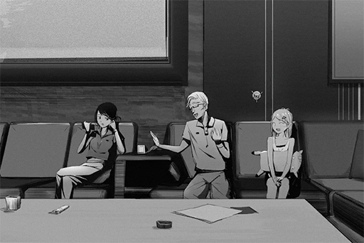

**PAFF** 
Ah, you guys are back? The bathroom is available now. 
Noah, you left work early today again?

**Noah** 
Yes, another step closer to being fired. If that happens, this household will have to rely on future superstar Aroma... oh, I mean, PAFF.

**PAFF** 
Stop that, you're saying weird things again... 
Still can't get used to this new name...

**Helena** 
Stop spouting nonsense, you weirdo. 
I'm going to go take a shower. If I listen to you talk anymore I feel like my ears are going to fall off...

**Noah** 
......

**PAFF** 
Sister, the floor is still a bit wet. Be careful.

_\[»»» Fast Forward»»»\]_

**[Television]** 
_... In the series of papers published by Dr. Neumann, his interpretation of ancient technology has been significantly different from A.R.C.'s previous theories, leading to heated discussions within the community. Rumor has it that some of Dr.Neumann's evidence came from non\-legal sources, making the papers and the doctor himself the topic of many controversies. However, voices that support his theories are gaining more and more ground in the industry..._

**Noah** 
Haha, "significantly different"? How ignorant... they just don't have the balls to admit that "We are a bunch of idiots who are absurdly wrong about everything".

**PAFF** 
Are you saying... that this person is actually correct?

**Noah** 
Indeed. I've read several of his papers; absolute destruction of A.R.C.'s "theories". It was as if what the A.R.C. firmly believed to be "ancient civilization" for years was nothing but a terrible joke. Did you see the expressions of those geezers in the audience? God, they were hilarious.

**PAFF** 
Wow...

**Noah** 
However, to A.R.C., his publications provided them with significant benefits, far outweighing the embarrassment they suffered.

**PAFF** 
How so?

**Noah** 
How should I begin with this... 
The "Old Humans" have much more superior technology than what we currently have. I believe you know about this; don't you, Aroma?

**PAFF** 
Yes. The Academy taught us about it.

**[Tuner-san]** 
_Aroma is a top student at the Academy! Her grades this year rank 3rd among all students!_

**Noah** 
Hoho? That's impressive. 
Then here's a pop quiz for you:  
When did "The Decommission" of Architects occur?

**PAFF** 
Hmm... I believe it's May 25th, 497 N.A.

**Noah** 
Correct! Due to the disappearance of the Architects, most of the Nodes' infrastructure went into paralysis. It almost resulted in a major "Blackout" crisis. In order to analyze and recreate ancient technology so a similar incident won't happen again, we founded A.R.C. Unfortunately, in recent years, not much notable progress had been made. Things finally took a turn for good when Dr. Neumann stepped onto the scene and debunked a lot of the false claims we made. Thanks to him, we are finally able to determine a clear direction for our exploration and research. His contributions saved us at least ten years of messing around and doing nothing.

**PAFF** 
Wow... but the lecturers at the Academy don't seem to like him very much. They told us that he has many criminal records and is not someone we should aspire to be like...

**Noah** 
_\*Sighs\*_... The lecturers at the Academy are probably hired by those stubborn geezers at A.R.C. too. Even your current curriculum has been altered a lot by the Administration Bureau. Did you know that before "The Decommission", the Academy itself was fully automatic, and lecturers were simply not required?

**PAFF** 
Eh? Really? They didn't teach us that... 
Noah, you're so knowledgeable.

**Noah** 
I am the director of A.R.C.'s research department after all.  
If I have to make a guess, your curriculum is going to be rewritten again in a few years. Node 08's technology will experience a brand\-new breakthrough... When that time arrives, it will be living proof that this guy is an extraordinary talent.

**PAFF** 
I think Noah is quite extraordinary too.

**Noah** 
Haha... I'm not at that level.

**PAFF** 
But... recently, Noah has been coming home early quite a lot. Your work... has the previous incident you mentioned been resolved yet? 
I'm a bit worried... Should you talk to sister about this?

**Noah** 
......

**PAFF** 
Noah?

**Noah** 
... Nothing. 
No need to worry, My research is still going on. I truly believe that it can also be an important milestone in technology development. If only those old farts can actually think with their brains...

*\[Door Opens\]*

**Helena** 
Hey! Didn't I tell you not to talk about work in front of Aroma!

**Noah** 
Ah... I got caught up in the mood... I'm sorry.

**Helena** 
Seriously... Stopping instilling people with your random crap. That's why you never get favored by your superiors...

**PAFF** 
... Sister!

**Noah** 
No... it's ok. She is speaking the truth after all. Haha...

_\[Signal Lost\]_

[*(Click here to go back to the top)*](#toc)

## <a id="pos006"/>\[#006\] Mail\_Chris\_693\_07\_02
### Requirements
|Character|Level|
|---------|:---:|
|**PAFF** | 41  |

### Log Content
**Subj.**: Event Schedule Notice 
**From**: Chris Pinkman 
**To**: Aroma White & Helena White
___

MonoCon "NOVA" in\-studio performance event

Time: 693/08/15 17:00 \~ 21:30 
Co\-performers: Alvis Cooper, Candy & Mandy, Hyper Fire

Miss Aroma White 
please arrive before 17:00 for rehearsal

Rundown Detail 
17:00 Rehearsal (Miss White's rehearsal lasts until 17:15) 
18:00 End of rehearsal 
18:10 Buffer time, Admission start (18:10 \~ 18:30 check\-in: Shao) 
18:30 Event start (Venue management, opening, filming: Shao) 
20:00 Miss White's performance 
20:30 Scheduled end of the event 
21:30 Site recovery complete before this time, post on iM

If there are any questions, please let Helena contact me. 
This event is Miss White's first public debut using the name "PAFF" 
Our company has organized her appearance at the event to be a surprise. 
Please don't disclose any information regarding this performance to outside sources

Chris

[*(Click here to go back to the top)*](#toc)

## <a id="pos007"/>\[#007\] Cam\_Noah\_693\_08\_14
### Requirements
|Character|Level|
|---------|:---:|
|**PAFF** | 42  |

### Log Content
*\[Knocks\]*

**Helena** 
Aroma? I'm coming in? 
... Yikes, so dark... Why don't you turn on the lights?

**PAFF** 
......

**Helena** 
Aroma?

**[Tuner-san]** 
_Aroma is feeling down. Aroma is feeling down..._

**Helena** 
......

**Helena** 
Are you lying in bed? I'm squeezing in... 
Haha, it's a bit crowded here.

**PAFF** 
Sister...

**Helena** 
Shhhh... let me guess. 
Tomorrow, you are making your debut for real. That fact is making you very nervous. Am I right?

**PAFF** 
......

**Helena** 
What's the matter? I'm right here.

**PAFF** 
...... Yes......

**Helena** 
Silly child, didn't you practice really hard? Chris told you too; as long as you live up to your usual standards, it will be the most amazing performance ever... I'm not worried one bit.

**PAFF** 
But... when I think of how much sister has done for me... If I fail...

**Helena** 
......

**Helena** 
Aroma, come here.

**PAFF** 
No\~... We're all grown\-ups now. This is weird...

**Helena** 
I've grown up too. No matter what, I will always be 8 years older than you. Come here. Don't think about anything and close your eyes.

_\[»»» Fast Forward»»»\]_

**PAFF** 
Hugging each other like this... it feels nostalgic.

**Helena** 
Do you remember that when you're little, the two of us have to share one tiny bed?

**PAFF** 
We were a poor family... Back then, sister had to work part\-time at multiple jobs. It must be tough.

**Helena** 
It really was tiring. Every time you told me that I can have the bed to myself, only for you to climb back onto the bed in the middle of the night all the time. Oh, and you steal the blanket too.

**PAFF** 
I can't help it. It's really cold at night... By the way, so you do know about it. Back then, you lied to me saying that you didn't know what happened...

**Helena** 
Hmph. I am a light sleeper. Of course I would know.

**PAFF** 
I am sorry...

**Helena** 
I know many other things. Every time I had a nightmare, you would stay by my side, rub my head, and sing songs to me.

**PAFF** 
......

**Helena** 
That singing, it's the kindest, most calming voice I ever heard in my life.  
Whenever I'm feeling depressed, I think about your singing. It makes me feel like I can keep going on. That's how I was able to manage, till this very day. 

**PAFF** 
Sister...

**Helena** 
Your voice is filled with inspiring power. Isn't it your wish to use this power to make more people realize their hopes and dreams?

**PAFF** 
Of course I would! But, if possible... I would like to sing just for sister too...

**Helena** 
...... 
A long time ago, I asked you this question. Now, I am going to ask you the same question again: What is Aroma's favorite thing in the world?

**PAFF** 
Sister.

**Helena** 
Wrong! Not this one, try again.

**PAFF** 
Hmm... singing? 
Yes, it's singing. When I'm singing, I feel... happy.

**Helena** 
See? Compare to me, there are definitely more people out there in the world who needs to be inspired, be touched, and be encouraged by you singing.  
Therefore, worry no more. For yourself and for everyone, sing; sing to your heart's content.

**Helena** 
As for myself, as long as Aroma can stay happy forever, I will be plenty satisfied.

**PAFF** 
... Thank you, sister. Thank you so much... _\*Sobs\*_...

**Helena** 
Silly child, why are you crying? You call yourself a grown\-up, yet you're the same old crybaby... 
It's alright. Enjoy singing and enjoy the stage. Bring power to everyone in the world! You can definitely do it.

**[Tuner-san]** 
_Fight on! Fight on!_

**PAFF** 
Yes... I will try my best.

**Helena** 
Good... Aw, look at you, your face is a mess. Go wash your face. Noah is waiting for us in the living room. Let's have dinner together.

**PAFF** 
Got it... I'll be there soon.

*\[Door Opens\]*

**PAFF** 
Sister... _\*Sobs\*..._

_\[Signal Lost\]_

[*(Click here to go back to the top)*](#toc)

## <a id="pos008"/>\[#008\] Audio\_NMobile\_693\_08\_14
### Requirements
|Character|Level|
|---------|:---:|
|**PAFF** | 43  |

### Log Content
**Noah** 
It's been a while since we three had dinner together. I reserve this table a whole week in advance just for this occasion... This is "L'Atelier de Charlotte", Node 08's most renowned 5\-Star Buffet. Delicacies from all across the world can be found here.  
It's on me tonight. Eat whatever you desire.

**Helena** 
Wow, it must be quite expensive here. Are you alright with that?

**Noah** 
Aroma's making her debut tomorrow. You've been working really hard as well lately, haven't you? If it's for you guys, I said it's money well spent. No need to be concerned about it.

**Helena** 
You're being considerate for once, good. 
Those people at Mono really are a pain in the neck. It's truly exhausting to deal with them... Aroma, you must be hungry too, right? Don't go easy on his wallet.

**[Tuner-san]** 
_Hungry! Hungry!_

**PAFF** 
...... Ok.

**Noah** 
......

_\[»»» Fast Forward»»»\]_

**PAFF** 
......

**Noah** 
So you're back? Let's not wait for you sister and dig in right now. 
... What's with the tiny portions? Is that enough for you?

**PAFF** 
... Where's sister?

**Noah** 
I just saw her walked pass here. She's probably waiting in line for the grilled meats. The ribs there are the signature dish of this restaurant, so there's always a long line. I highly recommend you go try it out yourself later.

**PAFF** 
Sure...

**Noah** 
......

**PAFF** 
......

**Noah** 
... A, Aroma, about that incident a few days ago... I'm sorry! I was just too drunk that day.

**PAFF** 
......

**Noah** 
I was feeling really frustrated that day. The higher\-ups have no idea about the importance of that technology... All in all, I got yell at by my superiors. On my way home, I decided to make a detour and visit a bar. I may had too many drinks there... Did I... I didn't do anything terrible to you, did I?

**PAFF** 
... Noah... so... you don't remember anything?

**Noah** 
I can only recall bits and pieces... I yelled at you, and I think I pushed you as well... I am so sorry!

**PAFF** 
... It was much more than just that...

**Noah** 
Hm? What?

**PAFF** 
... No, nothing...

**Noah** 
No matter what, let me apologize for what I did. I will never do that again! 
Does Helena know about this? I will have to apologize to her as well. 

**PAFF** 
...... NO!

**Other Diners** 
......

**Noah** 
Umm. Sorry for disturbing everyone... We're fine.

**Noah** 
Keep your voice down... Why did you shout all of a sudden?

**PAFF** 
You can't... let sister know about it.

**Noah** 
......

**PAFF** 
Noah, you said you will never do it again. I believe you... Don't tell sister anything about this incident...

**Noah** 
... Understood. I will not talk about it. 
Thank you for your forgiveness, Aroma.

**PAFF** 
It's ok. I know that your job is tough...

**Noah** 
......

**Noah** 
Thank you so much...

**PAFF** 
......

**PAFF** 
... Can you let go of me now...?

**Noah** 
AH! I'm so sorry... I'll go grab a cold drink to calm myself down. Aroma, what would you like to drink?

**PAFF** 
I don't know what options are there... Let me go get it.

**Noah** 
... Got it. Then get me a glass of orange juice with extra ice.

**[Tuner-san]** 
_Note: Orange juice, more ice!_

**PAFF** 
OK.

**Noah** 
......

*\[Smells hand\]*

**Noah** 
... Did I rush it? That's not good... Hehehe.

_\[Signal Lost\]_

[*(Click here to go back to the top)*](#toc)

## <a id="pos009"/>\[#009\] Cam\_NDrivRec\_693\_08\_15
### Requirements
|Character|Level|
|---------|:---:|
|**PAFF** | 44  |

### Log Content
*\[Engine Sound\]*

**Helena** 
The car is here.

**PAFF** 
Yes...

**Helena** 
... Aroma, what did you promised me?

**PAFF** 
That I would enjoy singing and enjoy the stage. Bring power to everyone in the world...

**Helena** 
That's right. We will always be there for you. Here, get in the car.

**[Tuner-san]** 
_Warning! This vehicle does not comply with the safety standards. Confirm to ride?_

**Helena** 
You still haven't fixed the seatbelt yet?

**Noah** 
Ah, crap... I've been too busy lately; didn't have time to fix it. Sorry... We only have three people though; we can just avoid that seat. Helena, how about you take the front passenger seat?

**Helena** 
No, I'm sitting with Aroma in the back. 
Aroma, you sit over there. I'll sit in the broken seat.

**PAFF** 
Sister... isn't that dangerous?

**[Tuner-san]** 
_Danger! Danger!_

**Helena** 
Mono is just a short drive away, no big deal. Scoot over.

**Noah** 
Hey, with this seating arrangement, I'm practically a "Ciber Driver" now...

**Helena** 
What? You got something to say? If something happens to me, blame yourself for being so incapable that you couldn't fix a seatbelt.

**Noah** 
Stop jinxing yourself... Let's go.

_\[»»» Fast Forward»»»\]_

**Helena** 
Don't you have to work today?

**Noah** 
I asked for a day off. This is PAFF's first performance after all; how could I miss it? I'm the man that's going to be her no.1 fan.

**Helena** 
Ewww... gross. If her fans are like you, things are going to be troubling. They may even harass the idol... right, Aroma?

**PAFF** 
Eh!? ... Ah, yeah...

**Helena** 
What's the matter? Are you still nervous?

**Noah** 
......

*\[Ringtone\]*

**Helena** 
Ah, it's from Chris.

**[Chris]** 
_Hi\~ Just calling in for a quick reminder. Practice starts at 10._

**Helena** 
Got it. We are already on our way.

**[Chris]** 
_Is PAFF there?_

**Helena** 
She's right next to me. However, it seems like she's still a bit anxious...

**[Chris]** 
_Oh, I see. Can I talk to her for a bit?_

**Helena** 
OK. Aroma, it's Chris.

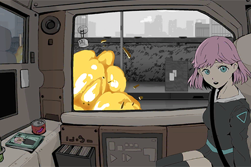

**Helena** 
AROMA！！！

*\[Car Accident\]*

_\[Signal Lost\]_

[*(Click here to go back to the top)*](#toc)

## <a id="pos010"/>\[#010\] Cam094\_ARC\_H\_694\_05\_15
### Requirements
|Character|Level|
|---------|:---:|
|**PAFF** | 45  |

### Log Content
*\[Door Opens\]*

**Helena** 
Is she awake!?

**Medical Staff A** 
Mrs. Helena, you can't come in yet...

**Helena** 
Aroma!

**Medical Staff B** 
Director, the test is not...

**[Noah]** 
_It's fine. Let her in._

**Helena** 
Thank goodness! _\*Sobs\*_......

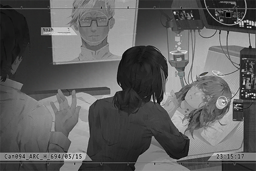

**PAFF** 
...... Ummm......

**Helena** 
What's wrong? It's me.

**PAFF** 
Who... are you...?

**Helena** 
Aroma......?

**PAFF** 
Aroma... is that...me? Who... am I?

**Helena** 
......

**Medical Staff A** 
......

**Medical Staff B** 
......

**[Noah]** 
_... Helena, I'm sorry... There are still some examinations we need to perform. Please leave the room first._

**Helena** 
......

**Medical Staff A** 
Mrs. Helena, please rest assured. At the very least, she can talk normally. Her cognition seems to function properly as well. We will try our best to...

**Helena** 
... Enough.

**Medical Staff A** 
......

**Helena** 
Noah... I believe you.

**[Noah]** 
_... I know. Leave it to me._

_\[Signal Lost\]_

[*(Click here to go back to the top)*](#toc)

## <a id="pos011"/>\[#011\] Cam\_TunerSan\_702\_09\_25
### Requirements
|Character|Level|
|---------|:---:|
|**PAFF** | 48  |

### Log Content
**[News]** 
_Therefore, we hereby announce the following information to fellow fans and friends in the media: After taking all issues into consideration, we have reached an agreement with Miss White's agent, Miss Helena White. We will be terminating the contract between Monophonic Entertainment Inc. and Miss Aroma White, effective immediately. We will no longer be responsible for her future career as an artist. _

**[Reporter]** 
_Miss Helena, any thoughts regarding your missing sister? Do you feel sad?_

**[Helena]** 
_We will not discuss anything that is not related to the contract here. Thank you._

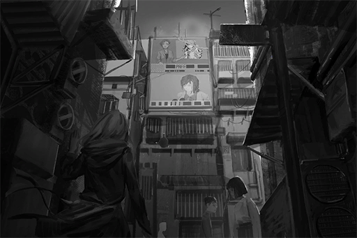

**PAFF** 
...... Sister......

**Pedestrian A** 
Ugh, this news again. I'm getting really tired of it. Also what kind of stupid question is that? That reporter needs to get fired.

**Pedestrian B** 
Whatever, it's just another publicity stunt, isn't it? Once they get all the attention, she'll suddenly pop out of nowhere and make all the money.

**Pedestrian A** 
Haha, that's how showbiz works anyway. So damn predictable.

**PAFF** 
......

_\[»»» Fast Forward»»»\]_

**PAFF** 
Cough... cough cough...

**[Tuner-san]** 
_Aroma has symptoms of a cold. Recommend visiting a doctor ASAP._

**PAFF** 
Can't keep going on like this... Need to find a place to...

**PAFF** 
But where can I go...? There's not even a single person I know who can...

**PAFF** 
... Iris... Maybe she can help me out...

**PAFF** 
Tuner\-san, search for Iris's contact information.

**[Tuner-san]** 
_I'm sorry! No matching information in the contact list._

**PAFF** 
Eh...? How's that possible?

**PAFF** 
Search for the contact information of Iris Baker.

**[Tuner-san]** 
_I'm sorry! No matching information in the contact list._

**PAFF** 
I definitely saved her info... No, right now, I don't even know whether the things I remembered and forgot are real or not...

**PAFF** 
Just what should I do now...? 

_\[»»» Fast Forward»»»\]_

*\[Advertisement Music\]*

**PAFF** 
This song...

**PAFF** 
It's NEKO's song...

**PAFF** 
......

**PAFF** 
Tuner\-san, search for NEKO's contact information.

**[Tuner-san]** 
_Asakura Neko (朝倉 音心), address: Quadrant II, 07 street, No. 9\-2, 19F._

**PAFF** 
......

_\[Signal Lost\]_

[*(Click here to go back to the top)*](#toc)

## <a id="pos012"/>\[#012\] Cam\_Hospital\_693\_08\_16
### Requirements
|Character|Level|
|---------|:---:|
|**PAFF** | 48  |

### Log Content
**Helena** 
...... Ugh......

**Noah** 
Helena! Are you awake!?

**Helena** 
Ugh......

**Noah** 
Doctor! Doctor!

**Bryan** 
Oh? Is she awake? Thank goodness!

**Helena** 
Where am I...?

**Bryan** 
This is 03 hospital. You've been unconscious for an entire day. How are you feeling?

**Helena** 
......! 
Aroma? Where is Aroma!?

**Noah** 
......

**Bryan** 
Rest assured, her conditions are stable. However, she has yet to regain consciousness...

**Helena** 
Where is she!? Take me to her, now!

**Noah** 
Hey, where are you going? You are not in the shape to run around...

**Bryan** 
It's fine. Both of you didn't suffer severe injuries. Your sister is in the ICU. I'll take you there.

_\[Signal Switches\]_

**Helena** 
...... No... this can't be... _\*Bawls\*_!!!!

**Noah** 
......

**Bryan** 
... Even though her injuries are severe, she is still young. With modern medicine and health technology, she will recover in no time.

**Noah** 
I see...

**Bryan** 
What I'm more concerned right now is the injuries to her head. This is a CT scan of her brain. These white dots are small pieces of debris. They happen to be lodged right between crucial nerves. It's practically a miracle that she's still alive now. However, this could also be the reason why she hasn't regain consciousness... We've tried our best to remove as much of the debris as we can, but a surgery on these spots will risk injury to her brain.

**Noah** 
... What about SWT?

**Bryan** 
Judging by that, you seem to be a professional in the field. That makes things easier to explain. 
We've already tried SWT; we even used MKII. However, the composition of the debris is way too complicated. If they break and seep into her blood vessels, there's the risk of blood poisoning...

**Noah** 
What about the Nano arm?

**Bryan** 
... Not even the Nano arm can reach the remaining pieces. There's also the possibility of damaging the nerves. We really can't do anything about...

**Noah** 
Is there really nothing left you can do!? You bunch of worthless fake doctors!!

*\[Equipment crashing\]*

**Helena** 
......Noah!?

**Bryan** 
Mr. Noah... P, please calm down! We really want to save the patient as well!

**Helena** 
Noah! Stop it!

**Noah** 
... I'm sorry... I...

**Bryan** 
......

**Helena** 
It... it's all my fault... If I didn't insist that I sit in the backseat, Aroma would've sat in her original seat. She wouldn't have...

**Noah** 
... If you sit in the front seat, you might've already died from the impact...

**Helena** 
It's still better than what's happening now!!

**Bryan** 
... I understand that both of you are very frustrated. However, please calm down for now. In the current situation, a reckless surgery will only put the patient in harm's way. At the very least, her vital signs are stable right now...

**Helena** 
OK...

**Bryan** 
We will think of other methods to save her. Please believe in us!

**Noah** 
... I'll leave it to you.

_\[Signal Lost\]_

[*(Click here to go back to the top)*](#toc)

## <a id="pos013"/>\[#013\] cyTus\_Server 08\_702\_01\_18
### Requirements
|Character|Level|
|---------|:---:|
|**PAFF** | 49  |

### Log Content
**Aroma** 
Ugh...

**Helena** 
What's wrong? Are you not feeling well?

**Aroma** 
A little... I don't really like to use cyTus...

**Helena** 
Could it be that you're too tired these days? Do you want to log out for a short while?

**Aroma** 
No, I can manage this...

**Helena** 
I'll get Chris to update the connection equipment. Sighs... I wish that guy can tighten up his screw sometimes...

**Aroma** 
It's okay... it's almost my turn, right?

**Helena** 
ROBO\_Head's set is ending soon. He has put on quite the show. The atmosphere is really hyped up. It's up to you now! Before Æsir takes the stage, let the audience revel in your singing.

**Aroma** 
So Æsir still hasn't shown up?

**Helena** 
Yeah, but he is communicating with the on\-site staff regularly. He has confirmed that he'll show up at the designated time. He probably wants to make a grand entrance that catches everyone by surprise! 
Independent creators love this type of unorthodox approach.

**Aroma** 
He's not here for the rehearsal either...

*\[Loud cheers\]*

**Aroma** 
Wow... So many people...

**Helena** 
Indeed, A part of this crowd is your most devoted fans. It seems that ROBO\_Head's performance has concluded.

*\[System notification\]*

**[Staff A]** 
_Excuse me. Miss PAFF, it's about time._

**Helena** 
Is the intro video playing already? How are the effects?

**[Staff B]** 
_Footage is playing normally. Light arrangement is confirmed as well. All set and ready to go. 
90 seconds until Miss PAFF takes the stage. 
We are a professional virtual LIVE operation team. Please rest assured!_

**Aroma** 
Thanks for the hard work.

**[Staff B]** 
_Oh my god... Did you hear that!? PAFF just said "Thanks for the hard work" to me! I'm so touched! My profession switch to this is all worth it!_

**Helena** 
Hey, where's your professionalism?

**[Staff A]** 
_Ahem... Apologies for what just happened. He was too excited. 
Miss PAFF, please stand inside the red circle. Once the video ends, we'll directly teleport you onto the stage._

**Helena** 
Got it. We'll be in your care. 
Aroma, don't be nervous! Fight!

**Aroma** 
Yes.

*\[Teleport\]*

*\[Music and cheers\]*

_\[Sig>̵̧̀͘͠}̧̀̕҉>̛́ Lost\]_

[*(Click here to go back to the top)*](#toc)

## <a id="pos014"/>\[#014\] Audio\_Arena\_702\_07\_27
### Requirements
|Character|Level|
|---------|:---:|
|**PAFF** | 50  |

### Log Content
*\[Door Opens\]*

**Helena** 
Sir, is the makeup done? It's almost time.

**Stylist** 
Ooh, nice timing you got there, Helena. I just finished.

**Helena** 
Is that so? Let me take a look... Woah, your skills are as impressive as always. Every angle is perfect.

**Stylist** 
Haha, no matter how skilled I am, makeup is never perfect on its own. If not for Miss PAFF's flawless appearance, I couldn't have done such a great makeup either.

**Aroma** 
That's not the case... Thank you, sir.

**Stylist** 
You're welcome\~ Since this is a rare physical concert, I'll be at the VIP section. I'll be here when you need to reapply your makeup.

**Helena** 
We'll be in your care.

*\[Door Opens\]*

**Helena** 
Aroma, the performance is about to start very soon. How's everything going? Do you feel any discomfort?

**Aroma** 
I'm feeling fine... No need to worry.

**Helena** 
Thank goodness. Even though the stabilizers have had fewer issues since Noah optimized them, I still don't want you to force yourself...

**[Tuner-san]** 
_Aroma's feeling well! Feeling well!_

**Aroma** 
See. No problem at all.

**Helena** 
I see.

**Aroma** 
Hmm...

**Helena** 
... Come on, today is your big day! You're looking way too gloomy! Smile... Here, I'll help you out.

**Aroma** 
Ahahaha... Aww, sister, that tickles... Hehe!

**Helena** 
Haha, you need to relax to have a good performance. Everything is set. It's up to you put on a show!

**Aroma** 
Of course. However... I want to focus and go through the lyrics one more time.

**Helena** 
No problem. I have to pay a visit to the backstage to see how the preparation is going. When the time arrives, I'll notify you through the broadcast.

**Aroma** 
Understood.

*\[Door Opens\]*

**Aroma** 
... Hmm... Tuner\-san, play the accompanying music for me.

**[Tuner-san]** 
_《Gravity》instrumental, start!_

*\[Accompanying music\]*

**Aroma** 
\*I spy overlying wings swing as I fly 
Beneath the old moon's ray, when the starlights sway...\*

*\[Stabilizer warning\]*

**Aroma** 
......Ugh......

**Aroma** 
Why... is my head starting to hurt again... 
It has been fine recently...

**Aroma** 
......

**Aroma** 
No, I can't let sister and others worry about me... 
It's not that serious. I can do this...

_\[»»» Fast Forward»»»\]_

**[Helena]** 
_Aroma... No, "Miss PAFF", it is time. Please come to the backstage for final preparations._ 
The night of your 7th Anniversary is about to begin.

**Aroma** 
Sister...

**Aroma** 
... I'll be right there.

_\[Signal Lost\]_

[*(Click here to go back to the top)*](#toc)

## <a id="pos015"/>\[#015\] Audio\_ARC\_H\_702\_07\_28
### Requirements
|Character|Level|
|---------|:---:|
|**PAFF** | 50  |

### Log Content
**Aroma** 
......

**Medical Staff A** 
Are you awake? Director!

**[Noah]** 
_Aroma._

**Aroma** 
Noah... Ugh... What happened to me?

**[Noah]** 
_You fainted on stage... Rest assured, the checkup results showed nothing more than mere exhaustion. You'll be fine after some rest and nutrients. Your schedule for the past few days may have taken a serious toll on your body._

**Aroma** 
Where's sister...?

**[Noah]** 
_Resting in the room next door. Because of you, she barely had any rest for the past few days too._

**Aroma** 
_\*Sobs\*_... _\*Sobs\*_...

**[Noah]** 
_What's wrong...?_

**Aroma** 
I'm so happy... that I still remember you guys. I was so afraid that I'll forget everything again when I wake up... _\*Sobs\*_...

**[Noah]** 
_... Rest assured. The scan results showed everything to be normal. Starting today, you siblings should both take some time off. You guys are working too much. 
As with the company's events, I'll find a way to let Chris handle them._

**Aroma** 
I'm sorry... I made you guys worried again. I even caused everyone so much trouble...

**[Noah]** 
_No need to apologize. Nobody will blame you for what happened... In fact, I should be the one apologizing to you. As your attending physician, I failed to take good care of your physical conditions... 
Don't overthink yourself. You need to rest. I'll apply some medication to make you feel more relaxed. Enjoy your sleep._

**Aroma** 
OK...

_\[Signal Lost\]_

[*(Click here to go back to the top)*](#toc)

## <a id="pos016"/>\[#016\] Audio\_Noah\_702\_08\_03
### Requirements
|Character|Level|
|---------|:---:|
|**PAFF** | 50  |

### Log Content
*\[Door Opens\]*

**Helena** 
Aroma, be careful.

**Aroma** 
Sister, I'm fine... You don't have to hold on to me.

**Noah** 
You just got discharged. Let your sister help you out, just in case.

**Helena** 
He has a point. Here, give me your hand.

**Aroma** 
Oh... okay.

**Helena** 
The fans are all worried about you. Look at all these letters and gifts.

**Aroma** 
I saw them. 
Since I already arrived home, I need to report my status to everyone on iM.

_\[»»» Fast Forward»»»\]_

*\[Door Opens\]*

**Helena** 
Aroma, I'm coming in? 
How are you doing? Do you feel any discomfort?

**Aroma** 
I'm doing fine... My head doesn't hurt anymore.

**[Tuner-san]** 
_Time right now: 21:00. Medicine time! Medicine time!_

**Helena** 
Ah, I'll go prepare it for you. You like your water hot but not too hot, right?

**Aroma** 
... Sister, when we were little... where did we live?

**Helena** 
Eh? Quadrant II 02 street... What's the matter? Did you remember something?

**Aroma** 
... Is it Node 03?

**Helena** 
... No, it's Node 08. 
If we have the time, I should take you back for a visit. However, right now, you should rest some more. Don't overthink yourself.

**Aroma** 
Have I ever been to Node 03 before then?

**Helena** 
Eh? Let me think... When you're around fourteen, we did have plans to go there during one of Noah's long breaks... However, the travel agency told us that it's quite dangerous there, so we ended up not going.

**Aroma** 
Is that so...

**Helena** 
Aroma?

**Aroma** 
Ah, nothing...

**Helena** 
... You should stop thinking about these first. You need to let your brain rest. I'll go get your medicine.

**Aroma** 
Thank you.

_\[»»» Fast Forward»»»\]_

*\[Door Opens\]*

*\[Singing\]*

**Aroma** 
\*そろそろ試合終了の鐘を鳴らしてよレフェリー 
いつの間に 氷も溺れたアイスティー\*

**Helena** 
Why are you practicing singing again? Noah told you that you need to rest for now...

**Aroma** 
It's okay... I'm just humming it casually.

**Helena** 
Aroma, you like singing way too much. How troublesome... 
Here, take your medicine. Once you're done with that, you can go to bed early.

**Aroma** 
Thank you.

**Helena** 
What song was that? It was great.

**Aroma** 
Has sister not heard this before?

**Helena** 
Yep. Even though I know nothing about singing, I remember every single one of your songs clearly, including those that are still just DEMOs. 
That melody you were just humming feels really nice. Is it Aroma's own creation?

**Aroma** 
I don't know... It's probably...... I think? The words just come out themselves without me realizing.

**Helena** 
It really is a great song. A very fresh style too. 
It's getting late. We should record it tomorrow. I'll let the composers have a listen.

**Aroma** 
It somehow feels like...

**Helena** 
Hmm?

**Aroma** 
... Nothing. I... I really like this song.

_\[Signal Lost\]_

[*(Click here to go back to the top)*](#toc)

## <a id="pos017"/>\[#017\] Audio\_Noah\_702\_09\_01
### Requirements
|Character|Level|
|---------|:---:|
|**PAFF** | 51  |

### Log Content
*\[Door Knock\]*

**Helena** 
Aroma.

**Aroma** 
......

*\[Door Opens\]*

**Helena** 
Aroma? I'm coming in?

**Aroma** 
......

**Helena** 
You... Are you feeling well? Why do you leave the lights off again? You've been locking yourself in your room a lot lately. I'm really worried. 
Are you still not feeling well?

**Aroma** 
... Is there something you want?

**Helena** 
Eh? Not really... I'm just concerned about you...

**Aroma** 
I'm fine.

**Helena** 
Good to hear that... 
Oh, right... Mono has sent us the notice for the next event. There's a performance on the 15th... Of course, Aroma's physical condition is still the top priority.

**Aroma** 
... As expected...

**Helena** 
I'm sorry about this. I previously told them that you still need a while to recover. However, the higher\-ups feel like you've taken too much time off... Mono has been very busy dealing with the aftermaths of the concert. The constant interviews, phone calls, and rescheduling are starting to take a toll on the company. A lot of the future events have been affected by that incident. 
From my point of view, I can't really ask the company to do more...

**Aroma** 
......

**Helena** 
Ah, I don't mean to blame Aroma. After all, you collapsed on stage because of the amount of work you had to put up with. Your body simply can't take it anymore. 
However, the higher\-ups are persistent this time...

**Aroma** 
......

**Helena** 
Aroma?

**Aroma** 
... No.

**Helena** 
... Umm, this is a pretty simple performance. It should take no more than 30 minutes. We can use old sets... at least show up to let the fans know you're alright...

**Aroma** 
I don't want to go.

**Helena** 
... Please. Your medical numbers have been really stable too. I just can't dodge their request anymore. Please, just this once. I'll find a way to handle future events afterward...

**Aroma** 
I SAID NO!!

*\[Knocks over items\]*

**[Tuner-san]** 
_Item shattered. Please be careful._

**Aroma** 
......

**Helena** 
...... A, Aroma?

**Aroma** 
I'm sorry... I... I don't want to go.

**Helena** 
Is it... Is it because of your body?

**Aroma** 
I... don't know...

**Helena** 
Or is it because you're tired of being an idol? It's fine... Can you talk to me about it...?

**Aroma** 
Stop asking! I don't know!

**Helena** 
......

**Aroma** 
_Sobs_...

**Helena** 
...... 
I understand... I'll go turn down their request and tell them to replace you with someone else.

**Aroma** 
......

**Helena** 
It's okay, Aroma... You don't have to perform at the event. I'll have Chris replace you with Cherry. They can handle the stage this time.

**Helena** 
You... you should get some rest. I will not disturb you anymore, okay?

**Aroma** 
......

**Helena** 
......

*\[Door Opens\]*

**Aroma** 
Sister...

**Aroma** 
What... just what am I... 

_\[Signal Lost\]_

[*(Click here to go back to the top)*](#toc)

## <a id="pos018"/>\[#018\] Audio\_Noah\_702\_09\_09
### Requirements
|Character|Level|
|---------|:---:|
|**PAFF** | 52  |

### Log Content
**Helena** 
......

**Helena** 
I'm... her sister. I'm her sister...!

**Helena** 
... (Breaths deeply)

*\[Door Knock\]*

**Helena** 
Aroma, good morning. Wake up!

**Helena** 
... Are you still asleep? You need to do a morning check up with Noah. You can sleep after we get back from that, ok? Breakfast is also ready.

**Helena** 
......

**Helena** 
... Aroma? ... Why is the door locked again!?

**Helena** 
... 0420...

*\[Door Opens\]*

_\[»»» Fast Forward 10 minutes »»»\]_

**Noah** 
... The window is open. There are footprints on the grass but they are unable to be tracked. The bent grass has dewdrops on them, which means that she has been gone for a while now. On top of that, no other traces are found. 
Aroma... left here by herself.

**Helena** 
Noah! Look...!

**Noah** 
... The stabilizers... did she take them off...?

**Helena** 
Ah... AHHHHHHH! What should we do!? What should we do now!?

**Noah** 
Calm down first! There must be some clues. We need to find her as soon as possible...

**Helena** 
R, right! Tuner\-san! Tuner\-san will definitely have a record!

**Noah** 
She took Tuner\-san with her, and she didn't answer my calls. She even went as far as turning off the location services. This means...

**Helena** 
She doesn't want us to find her... Noah... could it be... that she's...

*\[Things crashing\]*

**Noah** 
Helena! Get a hold of yourself!

**Helena** 
It's my... it's all my fault. Last night, I shouldn't have said that... She must've heard us arguing... It's all because, I said those things...

**Noah** 
Helena... blaming yourself won't change anything. This was a decision we made back then. Therefore, we will face it together.

**Helena** 
...... You're right. I'm sorry, Noah. _\*Sobs\*_...

**Noah** 
Alright, stop crying... There are still plenty of things we must do. 
Excluding the option of informing the admins first, regarding the situation at Mono, how do you plan to handle it?

**Helena** 
We can't just hide this incident, but Mono wouldn't want to make this out to be a big deal either. The best scenario is we find Aroma ourselves. I'll report this to some of the higher\-ups so they can deploy some of Mono's manpower to help the search... I'll also try my best to keep this information between just a few people.

**Noah** 
Understood. You go do that.

**Helena** 
What about you?

**Noah** 
I'll look around here and see if there are any clues I missed.

**Helena** 
Okay. I'll trust you with that, Noah...

**Noah** 
No problem. I'll handle this. Now go.

*\[Door Closes\]*

**Noah** 
......

**Noah** 
Ahhhh... AHHHHH......

*\[Punches table\]*

**Noah** 
I... can't repent my crimes like this, can't it...? All I did was bring even more suffering... I'm sorry...

_\[Signal Lost\]_

[*(Click here to go back to the top)*](#toc)

## <a id="pos019"/>\[#019\] Cam\_Daily08\_702\_10\_18
### Requirements
|Character|Level|
|---------|:---:|
|**PAFF** | 54  |

### Log Content
**Hayato** 
I'm back. Sighs\~ I'm exhausted...

**Susan** 
Thanks for the hard work. Another major news story?

**Hayato** 
Ummm... You know, those things... any case that sis Vicky ignores usually falls on to my shoulders...

**Vicky** 
Somebody calling me?

**Hayato** 
Wah! Sis Vicky! Welcome back!

**Susan** 
Pfft, look at you. Be careful with what you say! Sis Vicky's nose exist to smell out gossip!

**Vicky** 
That's right! Call me the gossip queen Vicky!

**Vicky** 
I was finally able to find it! Hayato! Great job!

**Hayato** 
Eh? Did I do anything...?

**Vicky** 
Hmph... You took care of those worthless news stories for me, which gave me the time to investigate this big one!

**Hayato** 
......

**Vicky** 
This is exclusive stuff! I know where PAFF is!

**Hayato** 
Eh!? For real? Where!?

**Vicky** 
Take a look! This is the VOD of a NEKO stream on iM a while ago!

**[Video]** 
_Meow meow meow (ΦωΦ)/ I'm bored so let's stream\~ 
Heard that many of you are VERY\~ interested in NEKO's room aren't ya\~\~\~ (\*Φ∀Φ)_

**Susan** 
This clip... it's just a stream of her room though? Is something wrong with it?

**Vicky** 
Tch tch tch, you young folks are too naive! Even though it's just one second... but if you enlarge this part! Look! 
What is this!?

**Hayato** 
Umm... I don't really see anything special...

**Vicky** 
Tuner\-san! This is the part on Tuner\-san's head! Almost no one uses Tuner\-san now! Who's the only person you can think of that uses Tuner\-san? PAFF! She is definitely hiding in NEKO's home!

**Susan** 
Umm... I know sis Vicky is amazing, but isn't the reasoning this time a bit too flimsy...? We're not even certain that PAFF had Tuner\-san with her when she disappeared... Besides, many people still use Tuner\-san right now. Not to mention that NEKO is a popular streamer; it could just be another gift from a sponsor...

**Vicky** 
Idiot! This thing went out of production a long time ago! Besides, with NEKO's personality, do you really think she would ever not show off a gift she got?

**Hayato** 
......

**Vicky** 
... Fine, so you guys are still not persuaded? Then I'll present you my trump care! Look!

*\[Items scattered\]*

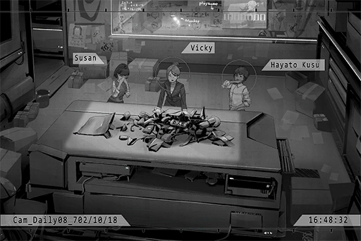

**Susan** 
Yikes! That stinks! What are these, sis Vicky!?

**Vicky** 
Trash! From NEKO's house.

**Hayato** 
HAA!?!? Are you serious...

**Vicky** 
Check out these purchase records! In this day and age, nobody uses paper\-based purchase records anymore! She went as far as asking the seller to give her a paper receipt that doesn't leave a record; this itself is super suspicious! I can smell it; she is buying things in secret!

**Susan** 
You're exaggerating...

**Vicky** 
Look at these! Shampoo, body soap! Judging by the time, the ones she bought before should still have plenty left. Yet she went ahead and bought a different brand! Look at the size of these clothes... all signs show that there are more than four people living in the house right now! The consumer name on the records are all NEKO, so she probably hasn't told her family. On top of that, this 32D bra is definitely not NEKO's or Yukiko's! Who else has 32D boobs? That's right! PAFF!

**Hayato** 
......

**Vicky** 
But wait! There's more! This hair dye is also very suspicious! NEKO asked about this on iM not too long ago. On that post, she said that it's herself who's using it. However, we can see that the whole can is used, yet NEKO's hair color hasn't changed! Therefore, I can make a very bold speculation, that PAFF is currently sporting this light slate grey hair color! To hide herself from the public!

**Hayato** 
... What exactly was sis Vicky doing before this job...?

**Susan** 
No idea... a private investigator maybe...?

**Vicky** 
In short! These clues! They are proof that there's a high possibility of PAFF hiding in NEKO's home! Susan! Come with me this weekend! We're going to set up an ambush at her house! At minimum, we need one or two clear photos!

**Susan** 
Eh\~? I can't... I have family business to tend to this weekend...

**Vicky** 
Then... Hayato!

**Susan** 
Hayato has taken those days off. He has a performance at Under Velvet that night...

**Hayato** 
I'll go.

**Susan** 
...... Eh? Didn't you get somebody to fill in for you already?

**Vicky** 
Hmph, whenever it's news about PAFF, this brat becomes extra motivated.

**Hayato** 
......

**Vicky** 
Then a decision has been made! BUT, you better not cause me any trouble like you did last time.

**Hayato** 
U, understood!

_\[Signal Lost\]_

[*(Click here to go back to the top)*](#toc)

## <a id="pos020"/>\[#020\] Audio\_Xmas\_688\_12\_24\_1
### Requirements
|Character|Level|
|---------|:---:|
|**PAFF** | 53  |

### Log Content
**Shop Owner** 
Helena! Table 3! Stop spacing out!

**Helena** 
Ah...! Yes, sir! I'm sorry!

**Shop Owner** 
What's the matter with you? You don't seem very focused today. We have a lot of customers on Christmas Eve; get yourself together!

**Helena** 
Got it. Sorry...

**Helena** 
Apologies for the wait. Here is your order.

**Customer A** 
Thanks.

**Helena** 
......

**Staff A** 
Your younger sister is staying at home by herself. You're concerned about her, aren't you?

**Helena** 
... I previously promised that I will spend today with her to celebrate Christmas.

**Staff A** 
You should talk to the shop owner. We can handle the rest.

**Helena** 
No... I can't do that. This is not an excuse. I will focus on the job!

_\[»»» Fast Forward »»»\]_

**Staff B** 
Little girl, you can't come in here.

**PAFF** 
...... I, I'm looking for my sister...

**Helena** 
......? 
Aroma!? Why are you here!?

**PAFF** 
Because sister hasn't come back for a long time. I was worried...

**Helena** 
Sorry, sorry! I even promised that I would spend Christmas with you...

**PAFF** 
You didn't even give me a phone call. I thought something bad happened. Thank goodness...

**Helena** 
I am so sorry! However, as you can see, we have a lot of customers now. I really can't pull myself away from the line of duty. I don't even have time to make a phone call...

**PAFF** 
It's okay. I just want to know that sister is safe. There really are a lot of customers. It is Christmas after all.

**Helena** 
Ah... You shouldn't come in here. Go home now. Sister will go back later.

**Shop Owner** 
Ho? Isn't this Aroma? Haven't seen you in a long time\~

**PAFF** 
G, good evening, sir\~

**Shop Owner** 
Good evening. Did you grow taller again? 
Hey, arrange a seat for her.

**Helena** 
Owner? Is it really okay!?

**Shop Owner** 
The routine checks are usually more loose on Christmas Eve. Should be fine.

**Helena** 
But...

**Shop Owner** 
It was me who asked you to work overtime and prevented you from going home to be with her. Let her stay here. You can be more at ease this way too, right?

**Helena** 
Thank you so much! 
Aroma, can you sit here and wait for me? My shift is ending very soon.

**PAFF** 
Understood. Sister, fight\~

**Shop Owner** 
What do you want to drink? Uncle will treat you.

**PAFF** 
Then... o, orange juice...

_\[Signal Lost\]_

[*(Click here to go back to the top)*](#toc)

## <a id="pos021"/>\[#021\] Audio\_Xmas\_701\_12\_24
### Requirements
|Character|Level|
|---------|:---:|
|**PAFF** | 53  |

### Log Content
**Helena** 
Aroma...... Aroma？

**PAFF** 
... Eh? Sister? 
Sorry, I fell asleep...

**Helena** 
It's alright. If you're tired, feel free to rest some more.

**[Tuner-san]** 
_Notice: 10 minutes until performance\~ 10 minutes until performance\~_

**Helena** 
Ah, looks like you're taking the stage soon.

**PAFF** 
Got it. I'll be ready in a minute.

**PAFF** 
Ah, it's so cute. Everyone is waiting in Christmas clothes.

**Helena** 
Because it's a Christmas event. Aroma, your outfit today is very cute as well.

**PAFF** 
Christmas...

**Helena** 
What's wrong?

**PAFF** 
Nothing. It's just... I think I just had a dream about a time when we were both little...?

**Helena** 
Eh? For real!? What did you dream about?

**PAFF** 
Hmm... I'm not very certain, but it seems like sister was working part\-time at a piano bar.

**Helena** 
Oh, so it's "Heaven Note". Is it a shop with a stage for performances?

**PAFF** 
Yes. Now I remember. I think it's Christmas that day as well. I was still a little girl and I visited the shop to see you... I even sang on\-stage later that day.

**Helena** 
Yes! This is great news! You remember another thing from your childhood! I have to tell Noah.

**PAFF** 
That song... I think it's...

**Helena** 
《 Winter Games》, right?

**PAFF** 
Yes. I think I still remember how to sing that song.

**PAFF** 
... Can I sing this song when I take the stage later? I can't really recall the emotion I was in when I sang it back then. If I sing it again, perhaps I will remember that feeling as well.

**Helena** 
Of course you can! Alright, time's up. Say hello to everybody\~

**PAFF** 
Okay.

_\[Signal Lost\]_

[*(Click here to go back to the top)*](#toc)

## <a id="pos022"/>\[#022\] Audio\_Xmas\_688\_12\_24\_2
### Requirements
|Character|Level|
|---------|:---:|
|**PAFF** | 53  |

### Log Content
*\[Collecting Tableware\]*

**Shop Owner** 
Helena, ten\-minute break. Go see your little sister. 
Everybody, hang in there. It's almost over!

**Helena** 
Got it. Thank you! 
Aroma, are you bored?

**PAFF** 
Not at all. When sister is working hard, you look very cool.

**Helena** 
It's not like I purposely want to look cool though. I'm exhausted\~

**PAFF** 
Thanks for the hard work.

**Helena** 
Since I worked overtime tonight, I don't have a shift tomorrow afternoon. So, what do you want to do? Any place you want to go?

**PAFF** 
Not really. Going out means spending money. It's fine just staying at home with sister.

**Helena** 
It's a holiday though. We can still go on a walk somewhere, right? You know, to check out the Christmas decorations and such?

**PAFF** 
Hmm... I feel like it will be very crowded no matter where we go. It's a bit scary...

**Helena** 
Haha, alright. Staying at home it is then.

**Shop Owner** 
What!? You serious?

**Staff A** 
Yes... What should we do...?

**Helena** 
... What's the matter?

**Shop Owner** 
Our resident singer got caught in a massive traffic jam. She might be late for quite some time...

**Helena** 
EH!?

**Shop Owner** 
Damnit, we've got so many customers. A lot of them are here for the performance... The Christmas secret event is supposed to be the climax of today's show!

**Staff A** 
The crowd is getting more and more restless...

**Shop Owner** 
All in all, we can't just leave the stage empty like this. Got to figure out a way somehow!

**Staff A** 
...... 
During the promotion, we didn't specify what the secret event is going to be, did we?

_\[»»» Fast Forward »»»\]_

**PAFF** 
... Eh? Me?

**Shop Owner** 
Please! Aroma's singing is great. 15 min... No! 10! Just stand\-in for 10 minutes and we'll be fine!

**Helena** 
Owner, this child is extremely shy. Telling her to sing on stage is...

**Shop Owner** 
I know! But...... Ah! Right! This, wear this to cover up your face. This way, nobody will know who you are! All you need to do is close your eyes and focus on your singing!

**Helena** 
Owner!

**PAFF** 
... I'll try. 

**Helena** 
Eh?

**PAFF** 
Sir treated me to some orange juice. I want to help...

**Helena** 
Aroma......

_\[»»» Fast Forward »»»\]_

**Customer A** 
Why hasn't anything started! Where is the show?

**Customer B** 
Yeah! I want a refund, old man! Haha!

**Shop Owner** 
Shut your pie holes! Hmph, you guys are going to see the best show ever right now, let me tell you.

*\[Music\]*

**Customer C** 
Eh? A child?

**Customer D** 
Hey! We want to see a sexy lady\~ When has this place become an art class for kids?

**PAFF** 
_\*All the store lights 
Shining so bright 
Warm the chill in the air 
Through their doors stream melodies of winter\*_

**Audience** 
......!

_\[»»» Fast Forward »»»\]_

**PAFF** 
...... (Bows)

*\[Audience Cheers\]*

_\[»»» Fast Forward »»»\]_

**Customer A** 
Wow\~ Tonight's show was incredible!

**Customer B** 
Especially that opening with the little girl wearing a mask! Her voice is beautiful... I wonder who she is?

**Staff A** 
Thank you for coming!

**Shop Owner** 
Thank you so much for the help today. You can leave now. We'll handle the cleanup afterward.

**Helena** 
Thank you. Good work, everyone.

**Shop Owner** 
Aroma, thanks a lot for today! Come visit us again someday.

**PAFF** 
Ok!

**Helena** 
In the end, I wasn't able to spend Christmas with you... sorry.

**PAFF** 
I don't mind... I feel like I already experience a wonderful Christmas. Thank you, sister.

**Helena** 
Good to hear that\~ Aroma, Merry Christmas.

**PAFF** 
Yes... Merry Christmas.

_\[Signal Lost\]_

[*(Click here to go back to the top)*](#toc)

## <a id="pos023"/>\[#023\] Audio\_Academy\_702\_10\_07
### Requirements
|Character|Level|
|---------|:---:|
|**PAFF** | 55  |

### Log Content
**NEKO#ΦωΦ** 
Aroma\-chan\~ Hurry, hurry!

**PAFF** 
So nostalgic... I haven't returned to the Academy since I graduated.

**NEKO#ΦωΦ** 
Stop dazing off. There are students everywhere. We need to keep a low profile. 
Now, listen up. In a minute, NEKO will lure the people as well as the drones away. When nobody is watching, Aroma\-chan will sneak into the Library and find what you are looking for.

**PAFF** 
This... Is this really ok? NEKO, wouldn't you get in trouble or something...

**NEKO#ΦωΦ** 
No worries. At worst, I get a few points deducted from my conduct score! NEKO is supposed to be the Chaos Maker\-type streamer after all. Everyone is used to my shticks already! 
This way, Aroma\-chan can find clues about that Iris Bagle safely.

**PAFF** 
T, thank you... It's Baker...

**NEKO#ΦωΦ** 
Alrighty! Operation START!

*\[Footsteps\]*

**NEKO#ΦωΦ** 
Hheellllllooo everyone\~ NEKO desu! Today, we are streaming at the Academy, where NEKO takes classes! You guys must be super curious, right? Although I don't have class today, let's get going! Ahahahaha!

**Student A** 
Hey, isn't that NEKO outside?

**Student B** 
No kidding! It's the real deal! Is she going to stream here!? WOAH!

**[Teaching Drone]** 
_Warning! Suspicious activity noticed. Miss Neko Asakura, it is class time now. Please stop the ruckus. 
Fellow students, please return to your classrooms and your seats..._

**NEKO#ΦωΦ** 
Everyone, check this out. This is the drone the Academy uses to manage students. All it does is act mad and give out warnings while running around in circles like this. Isn't it cute?

**Student C** 
Outta my way, dumb drone. As a member of the wildcat religion, I must record the sight of our prophet and spread this footage of hope to the whole world...

**Student D** 
What the f\*\*\* are you talking about... Ma waifu! Please gimme your autograph!

**NEKO#ΦωΦ** 
Hahaha! You guys are so passionate! Then come with NEKO!

*\[Screams\]*

**PAFF** 
I, incredible...

_\[→Signal Switch\]_

*\[System activate\]*

**[Library System]** 
_Greetings, user. The fully\-automatic search system is now ready. What information would you like to inquire today?_

**PAFF** 
......

**PAFF** 
I want to look up... the yearbook for this Academy's class of 685.

**[Library System]** 
_Searching... Complete. 
One result found. Security level: normal. 
Activating virtual projection for you now._

**PAFF** 
......

_\[»»» Fast Forward »»»\]_

**PAFF** 
Found it. This is me...... And...... 
...... Iris!

**[Library System]** 
_System confirmation...... Complete. 
Target name: Iris Baker, this Academy's class of 685._

**PAFF** 
Thank goodness. Iris is real... so is this part of my memory...

**PAFF** 
Umm, could you tell me Iris's phone number?

**[Library System]** 
_Action suspended. Apologies. 
Warning: This system is under the restriction of Node 08 personal information law, Code R\-42\-1A. Unable to provide search for graduated students' personal information._

**PAFF** 
Ah, so you can't tell me... Makes sense. 
... What should I do? I thought I could at least get her contact information...

**PAFF** 
... At least I confirmed that I do indeed remember Iris.

_\[Signal Lost\]_

[*(Click here to go back to the top)*](#toc)

## <a id="pos024"/>\[#024\] Image\_Academy\_702\_10\_07
### Requirements
|Character|Level|
|---------|:---:|
|**PAFF** | 55  |

### Log Content
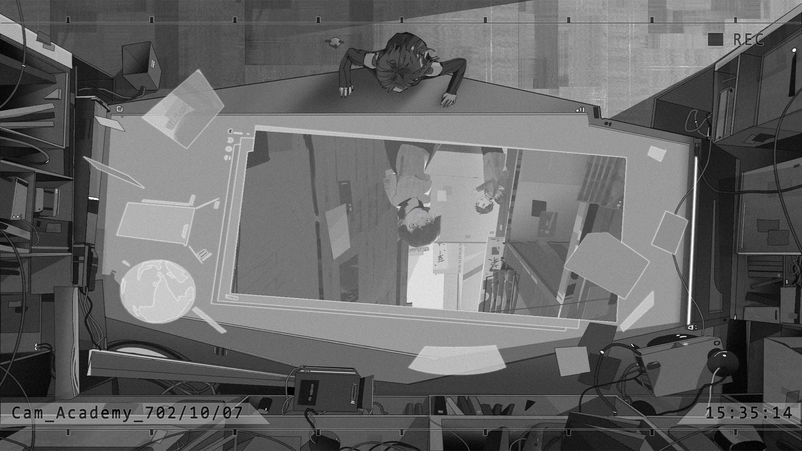

[*(Click here to go back to the top)*](#toc)

## <a id="pos025"/>\[#025\] Audio\_St07\_702\_10\_20
### Requirements
|Character|Level|
|---------|:---:|
|**PAFF** | 56  |

### Log Content
**Hayato** 
......

**Vicky** 
......

**Hayato** 
Sis Vicky... Are you sure this place is okay?

**Vicky** 
Hmph\~ Judging by my experience, this is the perfect "Observation point". Last time, when you were here to sneak photos of Xenon, you got busted, right? That's because the point you chose suck, rookie. You should learn from me more.

**Hayato** 
......

**Vicky** 
In our current position, we look just like an average couple enjoying a meal. Ohohohoho.

**Hayato** 
More mother\-son than couple though...

**Vicky** 
What did you just say!?

**Hayato** 
Ow! That hurt, that hurt...

**Vicky** 
... By the way, are you okay with this? You skipped the performance tonight, right?

**Hayato** 
Ah, no problem. They found a substitute drummer later.

**Vicky** 
That band of yours... It seems to be going quite well.

**Hayato** 
Umm, nothing much. It's just a small band...

**Vicky** 
If you come across any gossip about the big boys, don't forget to inform me.

**Hayato** 
...... Oh.

**Vicky** 
However... I certainly didn't expect you to be willing to give up your break for work. You do indeed have an abnormal enthusiasm when it comes to news about PAFF... I can smell it from a mile away.

**Hayato** 
Eh? Umm... No, there's just something...

**Vicky** 
Rest assured. I've investigated. A nobody like you has zero connection to a megastar like her.

**Hayato** 
... Investigated...

**Vicky** 
Nevertheless, it was that particular reason that made me even more curious. You don't seem to be just a fan as well. As I suspected\~ You have some\~ sort of\~ reasoning, right? Hmmmm\~?

**Hayato** 
Too close too close too close... You're scaring me...

**Vicky** 
Shh! NEKO has appeared! Take a photo now!

**Hayato** 
Eh? You're right. Okay...

*\[Camera shutter\]*

**Vicky** 
... Did she come back herself? I don't see PAFF.

**Hayato** 
But, it is a bit strange. The last time I came here, the windows of her room were in transparent mode. I even caught a picture of Xenon in her room... Now, it appears that we can't see what's inside.

**Vicky** 
Therefore, it means she's definitely hiding something. You still doubting my nose, eh?

**Hayato** 
Sis Vicky, you really are amazing... I feel like you can even work at the Administration Bureau. Exactly why did you come here to pursue this sort of paparazzi career...

**Vicky** 
... Trying too hard to dig up a girl's past won't win you any popular votes, let me tell you.

**Hayato** 
Ah! Sorry...

**Vicky** 
Hahaha! I was messing with you. Look at you, all frightened and shaking. How adorable.

**Hayato** 
......

**Vicky** 
Besides, what's with the "this sort of" paparazzi. Do you have any idea how honorable our actions are, revealing the hidden truth to the public? Ohohohoho!

**Hayato** 
Here we go again...

**Vicky** 
Shut it! Look! The windows are open!

**Hayato** 
Ah! Got it!

*\[Camera shutter\]*

**Hayato** 
Don't seem to catch a glimpse of PAFF in this one either...

**Vicky** 
That's fine. Take a few more photos. We'll bring them back and enlarge them. I'm absolutely not letting this exclusive report get away!

_\[Signal Lost\]_

[*(Click here to go back to the top)*](#toc)

## <a id="pos026"/>\[#026\] Audio\_Asakura\_702\_10\_07
### Requirements
|Character|Level|
|---------|:---:|
|**PAFF** | 57  |

### Log Content
*\[Door Closes\]*

**NEKO#ΦωΦ** 
Whew\~ Haha\~ Today's stream was AWESOME. The viewers were all hyped!

**PAFF** 
Is it really alright...? Your conduct score must've taken quite the hit, right? That was a pretty big ruckus you caused back there...

**NEKO#ΦωΦ** 
No problemo\~ NEKO enrolled in a few extra credit seminars at the end of the semester. It should be just enough to cover my deducted points\~ I think? Probably?

**PAFF** 
......

**NEKO#ΦωΦ** 
What's the matter? Not feeling well?

**PAFF** 
Eh? No... It's just... I think you're amazing. You always seem so energetic.

**NEKO#ΦωΦ** 
The heck is that\~ NEKO may seem this way, but there's still stuff I worry about...

**PAFF** 
Is that so? I've always felt like NEKO is such a strong person. It's as if there is no hardship you can't overcome.

**NEKO#ΦωΦ** 
Hehe\~? I'm not that ... haha. 
... Ah, by the way, Aroma\-chan, do you know about Xenon?

**PAFF** 
Yes. I've heard his music on iM. He's the really amazing guitarist, right?

**NEKO#ΦωΦ** 
Hoho, if he hears those words he'll be so darn happy that even his poker face can't hide it! He's a huge fan of yours too!

**PAFF** 
Eh? Really? Haha... Why did you mention him all of a sudden?

**NEKO#ΦωΦ** 
Hmm? Oh, umm, nothing. Just kinda popped into my mind.

**PAFF** 
... Are NEKO's worries related to him?

**NEKO#ΦωΦ** 
HA!? EHH!? N, no it's not! Why did you ask such a question!? Ahahaha!

**PAFF** 
No... I just made a random guess. I'm sorry...

**NEKO#ΦωΦ** 
Well... No matter what kind of worries NEKO have, compare to your messed up memory issues, they're practically child's play.

**PAFF** 
Ah... No, I didn't mean to...

**NEKO#ΦωΦ** 
It's not your problem at all. It's more NEKO being too normal. Haha!

**PAFF** 
Yeah... 
However, seeing you get along with your fans... It looks like so much fun. I'm a little bit envious...

*\[Lightly slaps face\]*

**PAFF** 
Wah!?

**NEKO#ΦωΦ** 
Aroma\-chan... PAFF's singing has always given everyone strength too, hasn't it? How are you gonna do that if you're so dejected yourself? Cheer up!

**PAFF** 
Yes...

*\[Eat snacks\]*

**NEKO#ΦωΦ** 
_\*Chewing\*_... Setting these things aside, how did the search go? The one for your classmate's info.

**PAFF** 
Ah... I wasn't able to find an address... but there is indeed a person named Iris. I was also able to remember her more clearly!

**NEKO#ΦωΦ** 
Really? Isn't that great!?

**PAFF** 
Yes! I saved a few photographs and brought them out with me. All these classmates are people I remember. Tuner\-san!

**[Tuner-san]** 
_Project saved photo files._

**NEKO#ΦωΦ** 
Ho\~? Ah, so this is that Iris person? She's a really cute girl too...

**PAFF** 
Yes... what a shame. If only I could find her address...

**NEKO#ΦωΦ** 
Who's the person next to her?

**PAFF** 
I think it's her younger brother... I recall that everyone had to turn in a few photos taken together with family members.

**NEKO#ΦωΦ** 
Then it's very possible that this photo is taken somewhere near her home, isn't it?

**PAFF** 
Hmm... I'm not certain. Besides, I don't recognize this place either...

**NEKO#ΦωΦ** 
Hmmm... this place... NEKO finds it a bit familiar for some reason\~

**PAFF** 
Eh? For real?

**NEKO#ΦωΦ** 
Uh\-huh\~ Hmm\~\~ Ah! Isn't this the streets around "Mountain Breeze Musique"! NEKO knows this place!

**PAFF** 
Mountain Breeze Musique...?

**NEKO#ΦωΦ** 
Right here! Enlarge the photo. You can see the store sign here, right?

**PAFF** 
Wow, you're right.

**NEKO#ΦωΦ** 
Let's go and check out this road in the photo tomorrow. Maybe you can remember something there!

**PAFF** 
... Okay!

_\[Signal Lost\]_

[*(Click here to go back to the top)*](#toc)

## <a id="pos027"/>\[#027\] Audio\_Daily08\_702\_10\_23
### Requirements
|Character|Level|
|---------|:---:|
|**PAFF** | 58  |

### Log Content
**Susan** 
Here sis Vicky, coffee!

**Vicky** 
Thanks... Woah, it's this time already?

**Susan** 
It's already well past dinner time. Whenever sis Vicky starts working on a report, you never stop until it's done.

**Vicky** 
Fufufu... In order to reveal the truth to the public ahead of everyone else, missing a meal is no big deal at all! This is our job! Our duty! Our lives!

**Susan** 
Yeah, yeah, I know\~ Thanks for the hard work. I'll be leaving first. Hayato has a performance today! Bye\~!

**Vicky** 
We're publishing a new special issue tomorrow. Don't you dare come in late!

*\[Door Closes\]*

**Vicky** 
Alright. I'm definitely going to get this Æsir special done tonight!

*\[Ringtone\]*

**Vicky** 
... Unknown Caller? Hmph...

*\[Answers\]*

**Vicky** 
Tax administration, isn't it? I've seen this routine way too many goddamn times. Our company's accounting records are perfectly normal. There is none of that undeclared tax bulls\*\*\*! So stop bothering us!

**[N]** 
_... Unfortunately, you're wrong. I am not someone from the Administration Bureau. You're MIss Vicky Russell from 08 Daily, right?_

**Vicky** 
... Who are you?

**[N]** 
_That's not important. It seems that you've been investigating the incident of the missing idol PAFF. On top of that, you've already gotten some clues, haven't you?_

**Vicky** 
I have no idea what you're talking about. Besides, I am not obliged to disclose information to any random person, especially anonymous brats like you who pop out of nowhere.

**[N]** 
_Haha... I understand. Information is a precious commodity. You understand its immense value, of course, and will not give it up easily._

**Vicky** 
Oh, spare me that rubbish. What exactly do you want?

**[N]** 
_Then I'll be frank: I would like to buy the information on PAFF's whereabouts._

**Vicky** 
You're her fan?

**[N]** 
_... I have to find her no matter what._

**Vicky** 
Oh, I see. Then let me tell you, my answer is "NO"!

**[N]** 
_So you don't want to?_

**Vicky** 
It's mega exclusive news that we're this close to getting. Why the hell would I want to give it up!?

**[N]** 
_Then, Miss Russell, allow me to make things clear... As a reward for the investigation, I can transfer a down payment of half\-a\-million dollars to your account within ten minutes._

*\[Crashing\]*

**Vicky** 
H... Half\-a\-million!?

**[N]** 
_In addition, I've prepared a final payment of 1.5 million. Once I confirmed that the information is accurate, you will receive it immediately._

**Vicky** 
... That's a lot of money...

**[N]** 
_I also know, that 08 Daily has very limited resources. The shortage of funds meant that you've struggled to get proper interviews... In order to compete with the big corporations, you had no choice but to make groundless accusations, blow things out of proportion and write sensational articles to get attention and revenue. Am I mistaken?_

**Vicky** 
You... How did you...

**[N]** 
_One just needs to read your previous columns and everything would be quite obvious... By letting me locate PAFF, your situation will improve as well. I believe this is a mutually beneficial transaction._

**Vicky** 
But... I...

**[N]** 
_Don't hesitate, Miss Russell... I've seen your resume. You gave up a well\-paid position with Node News Network to join 08 Daily. You have a goal you want to pursue, right?_

**Vicky** 
......

**[N]** 
_Alright. Your reply is?_

**Vicky** 
... I get it... You almost persuaded me... 
BUT I REFUSE!

**[N]** 
_Miss Russell!? This is a once\-in\-a\-lifetime opportunity..._

**Vicky** 
I almost forgot my pride as a journalist... You want information? That get off your lazy a\*\* and go find it yourself!

*\[Hang Up\]*

_\[Signal Lost\]_

[*(Click here to go back to the top)*](#toc)

## <a id="pos028"/>\[#028\] Cam\_Fwy01\_693\_08\_15
### Requirements
|Character|Level|
|---------|:---:|
|**PAFF** | 59  |

### Log Content
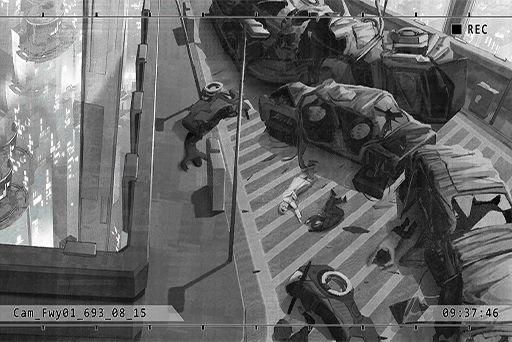

**Noah** 
Umm... ughh...

**Noah** 
What... happened...

**Noah** 
Aro... ma... Are you... alright...

**Rescue Team Captain** 
Hey, Sir! Can you hear me?

**Noah** 
Uhhhh...

**Rescue Team Captain** 
He fainted... Looks like his injuries are not life\-threatening. 
Hey, carry him to the medical station. Be careful not to shake his head.

**Team Member A** 
He's the driver of that car, right? All the windows are shattered. He probably got lucky and was flung out of the car. That's why he didn't suffer serious injuries... The lady next to him too...

**Team Member B** 
Man, he sure got lucky... Just look at the car... or what's left of it.

**Team Member A** 
An energy vehicle exploded right next to them. It's truly a miracle that they managed to survive that.

**Rescue Team Captain** 
Enough with the dumb remarks. Better start cleaning up this mess.

*\[Hurried Footsteps\]*

**Team Member C** 
C... captain!

**Rescue Team Captain** 
What's wrong?

**Team Member C** 
T, that car... someone's still in it!

**Rescue Team Captain** 
WHAT?

**Team Member C** 
It's a girl... she's stuck inside!

*\[Hurried Footsteps\]*

**Rescue Team Captain** 
... She... this girl...

**Team Member A** 
Oh my god... Her head...

**Team Member B** 
She's still breathing! But she's unconscious... Captain!

**Rescue Team Captain** 
... We can't get to her this way. Call the drones. We're gonna pry open the car roof!

**Team Member B** 
Y, yes sir!

**Rescue Team Captain** 
You, inform the medical station. Tell them that a GCS 3 patient with serious injuries is coming their way. Ask them to prepare the nano\-healing equipment. We need to stabilize her condition ASAP!

**Team Member A** 
On it!

*\[Hurried Footsteps\]*

**Team Member C** 
How ironic... Her seatbelt was the only one that didn't break, which in turn secured her tightly to her seat... A device that generally saves lives ended up harming hers...

**Rescue Team Captain** 
It's pointless to say such things now. Go get more people. We need all the help we can get.

**Team Member C** 
Understood...

*\[Hurried Footsteps\]*

**Rescue Team Captain** 
... You probably don't know this, but I've seen the video of you singing on the internet... Your singing was beautiful.

**Rescue Team Captain** 
......

**Rescue Team Captain** 
Please... hang in there.

_\[Signal Lost\]_

[*(Click here to go back to the top)*](#toc)

## <a id="pos029"/>\[#029\] Audio\_Hospital\_694\_03\_28
### Requirements
|Character|Level|
|---------|:---:|
|**PAFF** | 59  |

### Log Content
*\[Door Opens\]*

**Clara** 
Daniel! Wait up!

**Daniel** 
Sorry... I don't know what's wrong with me. 
I need some space. Leave me alone, okay.

**Clara** 
I, I'll be with you...

**Daniel** 
I said leave me alone!

*\[Running\]*

**Clara** 
Ah! Daniel......! Waah!

*\[Crash\]*

**Noah** 
Are you alright? Oh, is that you, Clara? What's the matter?

**Clara** 
No, nothing. We're here to visit Aroma. Here, your phone. Sorry about that.

**Noah** 
No need to worry. Do be more careful in the hallways though.

*\[Running\]*

**Clara** 
Daniel!

**Noah** 
......

**Noah** 
... Sorry, someone ran into me just now. The preparations, they're all set, right?

**[Researcher A]** 
_Yes. One word from director and we can begin the operation at any time._

**Noah** 
Good, but stay alert. This operation must only be carried out in secret.

**[Researcher A]** 
_Understood. For our aspirations._

**Noah** 
Arnold, this is no longer just for our aspirations anymore. 
Aroma getting involved in this kind of thing... I can't accept it. I will save her no matter what. I still need to properly apologize to her...

**[Researcher A]** 
_Director...?_

**Noah** 
No, it's nothing... In short, I will leave this operation to you guys.

**[Researcher A]** 
_One more thing, about Helena..._

**Noah** 
I'll figure out a way to convince her.

**[Researcher A]** 
_She should be able to understand as well..._

**Noah** 
Yes. I won't allow anything to happen to Aroma again. We have to make sure she lives no matter what.

**[Researcher A]** 
_Absolutely!_

**Noah** 
Then that's it for now.

_\[Call Ends\]_

*\[Door Opens\]*

**Noah** 
Helena... Ah! Iris, it's been a while. Are you here to visit Aroma?

**Iris** 
Yes, I'm here to bring her the academic schedule. Ah, is there something important you want to discuss with sis Helena? It's about time I take my leave too. I will not disturb you guys.

**Noah** 
No need to be so modest. Please come visit more often. Aroma will be very glad to see you. Oh right; about your two classmates, I just saw them run away in a hurry.

**Iris** 
Those two... I'll go catch them. Thank you!

*\[Door Opens\]*

**Helena** 
Noah, Aroma reacted to her classmates just now. That's a great sign!

**Noah** 
Really? That's good to hear.

**Helena** 
With this progress, the surgery will definitely be successful too. Aroma will come back to us very soon...

**Noah** 
......

**Helena** 
Ah, I have to discuss something with the doctor...

**Noah** 
Helena! About the surgery next month...

**Helena** 
......

**Noah** 
... I'm still against it. A.R.C. is still months, even years away from completing the recreation of that technology. Yet they decide to rush and let the hospital run trials with it.

**Helena** 
This again... With Aroma's current situation, we can't afford to waste any time arguing about this. 
Plus, We signed the contract already. What else are you going to do?

**Noah** 
Maybe we should seriously consider going with what I proposed...?

**Helena** 
Stop bringing that up! Why on earth would I agree to that!? That project of yours was already discontinued by A.R.C.  
You've gone insane!

**Noah** 
You're the one who's gone insane! Compare to me, you rather trust that worthless doctor!?

**Helena** 
I......!

**Noah** 
I already saw through him. Even if that technology actually works, that useless hack doesn't have anywhere near the skills to pull it off! It's way too risky!  
I'm not handing Aroma's life over to someone who'll undoubtedly mess up!

**Helena** 
Aroma is my little sister! I will decide who I want to save her life! 
This is none of your business! Now p\*\*\* off!

**Noah** 
......

*\[Door Opens\]*

**Noah** 
I... I want to save her even more than you do...

_\[Signal Lost\]_

[*(Click here to go back to the top)*](#toc)

## <a id="pos030"/>\[#030\] Audio\_Hospital\_694\_04\_20
### Requirements
|Character|Level|
|---------|:---:|
|**PAFF** | 59  |

### Log Content
**Helena** 
Please... please......!

*\[Door Opens\]*

**Helena** 
Dr. Bryan! How's Aroma doing!?

**Bryan** 
......

**Helena** 
......

**Noah** 
......

**Bryan** 
I'm sor...

*\[Punch\]*

**Nurse A** 
Mr. Black!

**Noah** 
Are you f\*\*\*ing kidding me!?  
You worthless piece of s\*\*\* doctor!

**Helena** 
_\*Sobs\*..._

*\[Punch\]*

**Bryan** 
Waah! Stop! Stop hitting me!

**Noah** 
Tell me that she's still alive...!

**Bryan** 
Y... yes! She's still alive. It's just...

**Noah** 
JUST WHAT!?

**Bryan** 
Eek! This... this is the CT scan... We were unable to remove the debris inside her brain. Post\-surgery cerebral compression has become even more severe. I'm afraid that... I'm sorry! I'm truly, truly sorry!

**Helena** 
_\*Sobs\*_...... WAAAAAHHHHHHH!!

**Noah** 
......

**Bryan** 
......

**Noah** 
How much time?

**Bryan** 
Eh?

**Noah** 
I'm asking you; how much time does she have left!?

**Bryan** 
At most... one month...

**Noah** 
... Let us in. We want to see her.

**Bryan** 
Ah, the surgery just concluded. You can't...

**Noah** 
Shut your mouth. Helena, let's go.

_\[→Signal Switches\]_

**Helena** 
_\*Sobs\*_... Aroma... Aroma...

**Noah** 
......

**Helena** 
Noah... It's all on me. It's all my fault. If only I...

**Noah** 
There's still time...

**Helena** 
... Eh?

**Noah** 
We still have one month. There's still time.

**Helena** 
......! Noah...

**Noah** 
This is our only option left. This time, trust me, okay? Please...

**Helena** 
Yes... please... please save her... _\*Sobs\*_...

_\[Signal Lost\]_

[*(Click here to go back to the top)*](#toc)

## <a id="pos031"/>\[#031\] Audio\_Arc\_692\_08\_13
### Requirements
|Character|Level|
|---------|:---:|
|**PAFF** | 60  |

### Log Content
*\[Door Opens\]*

**Researcher A** 
Ah, you're here, director.

**Researcher E** 
Good morning, director!

**Noah** 
Good morning, Arnold, Eric. How's everything going?

**Researcher A** 
Yes, the current phase of the test was conducted on subjects C\-53 to C\-58. Their behavior patterns are 99.7% identical to our pre\-test estimates, easily within the reasonable range. This means that the memory data interpretation this time matches our requirements... Congratulations, director!

**Noah** 
Any problems with the behavioral guidance models?

**Researcher E** 
Nothing so far. We calculated and built them with the algorithms director designed. They are completely based on the memory data. We can expect error\-free results.

**Noah** 
Run the test a few more times, just in case. "The last mile to the truth is an endless abyss"...

**Researcher E** 
... "and only those who are diligent can make it through." 
Rest assured, director. Everyone here is just like you. We're all people who have inherited the ideas of Mr. Wyle! I'll have Owen test them out again later today!

**Noah** 
Excellent. Uriel, the follow\-up report on the test subjects, can you finish it today?

**Researcher U** 
Judging by the current progress, won't be a problem!

**Noah** 
How trustworthy. I'll leave it to you. 
Next... your name is Ian, right?

**Researcher I** 
Yes, director! I, I'm intern researcher Ian Stewart! This is my third day at R&D department 01...

**Noah** 
Haha, no need to be so nervous... Come to my office later. There are some small things I would like you to do.

**Researcher I** 
Y, yes, Sir!

*\[Door Opens\]*

_\[»»» Fast Forward»»»\]_

**Noah** 
The test species this time "Black Horn Ape", the complexity of its brain tissue is already very similar to humans. Now that the experiment is successful, I believe we've cleared the most difficult challenge... Here's the short\-term closing document for this project. Can you organize it for me? 

**Researcher I** 
Yes, director! ... I wonder if the higher\-ups will agree to this or not...

**Noah** 
If we're speaking about data alone, our team's results are, without a doubt, the closest thing we ever had to perfection. I don't see a reason why they won't agree.

**Researcher I** 
Yes, the data is indeed perfect. There's just the final step. In other words... a human trial...

**Noah** 
Ah, so this is what you're concerned about. Ian, our research is based on the coding technology of "that Architect" excavated two years ago. We use that code to analyze the brainwaves of creatures and interpret their memories...

**Researcher I** 
Yes, it was a flash of inspiration by director... You're a true genius!

**Noah** 
Haha, I still have much to learn. 
The point is, to the human who is being interpreted, we're only listening to the voices in his brain. There won't be any side effects to him.

**Researcher I** 
There indeed is none...

**Noah** 
Grasping the coding pattern of human memory means we can now duplicate it freely. Next, if we pair that with director... Mr. Wyle's physical enhancement research from two years ago, do you realize the meaning this represents?

**Researcher I** 
Of course... After that, if we can find a way to input memory into a physical vessel, it means an "eternal life" for humans!

**Noah** 
Yes. Unlike the Architects, an eternal life that actually belongs to humans... Bringing the company massive profits is nothing more than a by\-product of this process.

**Noah** 
Do you understand now, Ian? What we're writing now is the most important piece of history for the next generation of humans!

**Researcher I** 
U... understood! Director!

**Noah** 
Good. During the next department presentation, we'll show the higher\-ups the results we've accumulated so far... We'll be receiving more resources for our research very soon. By that time, everything will process even more smoothly.

**Researcher I** 
No problem. Thank you, director! I will definitely work extra hard!

*\[Door Opens\]*

**Noah** 
It'll be here soon... the "beacon" for humans...

_\[Signal Lost\]_

[*(Click here to go back to the top)*](#toc)

## <a id="pos032"/>\[#032\] Audio\_Arc\_692\_08\_20
### Requirements
|Character|Level|
|---------|:---:|
|**PAFF** | 60  |

### Log Content
**[System]** 
_Mr. Smith, sorry for the interruption. Mr. Noah Black from R&D department 01 requests a meeting. His emotion numbers have reached stage Red. I have excluded him according to the security regulations..._

**Leo** 
It's alright, Samantha. Let him in.

**[System]** 
_Yes, Mr. Smith._

*\[Door Opens\]*

**Noah** 
Leo, what the heck is this about? Why did our team's...

**Leo** 
Know your place, director. Your action itself is already a violation. You don't want my A.I. to put a bullet through you on the spot... This bearskin rug is an ultra\-rare SS class item, and it would be a shame to ruin it.

**Noah** 
... Sir, the R&D department is under your direct command. Please explain; why did you reject our project's publication request? On top of that, why did you take away our entire budget?

**Leo** 
It should be very clearly written in the instruction book. Your team will be moving on to other projects following...

**Noah** 
Don't give me that nonsense! The research has already entered its final stage. We're this close to producing a result that will influence generations to come! All members of the team are also in very high spirits... Why do we have to be transferred to other projects now?

**Leo** 
No need to rush... I can explain, director. 
Samantha, pour me a glass of Cognac.

**Leo** 
To be honest, director, I really admire the results your team produced. Once the memory duplication technology is completed, there will no longer be any secrets in this world. We can easily capture the brainwaves of important figures and obtain key information from any corner of this world. 

**Noah** 
... Sir, I see that you're very well\-versed in our research.

**Leo** 
Indeed, and that's also the exact reason why I discontinued your project. This technology is more dangerous than any firearm imaginable... I'm not certain if A.R.C. is prepared to accept it or not.

**Noah** 
No need to worry. I am well aware of the importance of this research. We will carefully inspect each and every possible failure to ensure that none will occur...

**Leo** 
I understand your determination. Despite that, I would like you to wait a little longer.

**Noah** 
Why?

*\[Drinks wine\]*

**Leo** 
You, as well as Phoenix back then, are all very excited about using the technology you have to help drive human evolution towards a brand\-new world. Am I correct?

**Noah** 
Absolutely. That's the responsibility of those with the power of "knowledge"!

**Leo** 
Then can you predict what the new world will look like?

**Noah** 
This...

**Leo** 
The instant such a major technology is publicized, every single tech organization in every Node will immediately begin researching it. No one can predict what the world will become. A.R.C. may seem untouchable right now, but in the new world... nobody knows.

**Noah** 
... Is the committee afraid of those changes?

**Leo** 
The committee has come to the consensus, that a change with too much risk and may cause the company harm is not A.R.C.'s current objective. 
However, once the time has arrived... you understand what I'm saying, don't you?

**Noah** 
I... I understand.

**Leo** 
Excellent. Samantha, pour a glass for director too.

**[System]** 
_Yes, Mr. Smith._

**Noah** 
... Thank you, Sir.

*\[Drinks wine\]*

**Leo** 
Ah, right. About the plans for what's coming next... I will restructure R&D department 01 into an independent department "zero". It'll be a non\-public organization that exists outside the current structure. Of course, you'll be the director.

**Noah** 
... "zero"?

**Leo** 
That's right. The members will be distributed across each department, utilizing their excellent experience and assisting the operation of every project. As with you, you'll be handling research missions directly assigned by me.

**Noah** 
In other words... our team will be temporarily disbanded?

**Leo** 
This is for the greater good of the company... Of course, your salary will increase as well. I've written it all down on this document. 
Samantha.

**[System]** 
_Yes, Mr. Smith._

*\[Projection\]*

**Noah** 
... That's a lot...!

**Leo** 
You've already brought A.R.C. profits that far surpassed this amount. It's only natural that you receive a significant pay raise.

**Noah** 
... What profit?

**Leo** 
Remember R&D department 02's research project? "Virtual Internet System"... codename "cyTus". It'll be A.R.C.'s major project for the next ten years. 
Your team's research results on brainwaves will be properly utilized by 02. It'll become the final piece of the "cyTus" puzzle.

**Noah** 
... That... I didn't know about that...

**Leo** 
I greatly appreciate the amazing contributions you've made for us, director. We'll continue to be in your care for the future... Remember, wait for the time to arrive.

**Noah** 
... Understood.

*\[Door Opens\]*

**Leo** 
... Samantha.

**[System]** 
_What is it, Mr. Smith?_

**Leo** 
Noah Black is a dangerous figure to A.R.C., and I don't want this "Ark" to encounter even the most insignificant of dangers.

**[System]** 
_Yes, Mr. Smith. 
I've begun adjusting the privileges and projects of department "zero". In the future, both Noah Black and "zero" will be under proper control and operate as your pawns._

**Leo** 
Very good. A technology like you that completely surrenders to my commands is what humans truly need, Samantha.

**[System]** 
_Yes, Mr. Smith._

_\[Signal Lost\]_

[*(Click here to go back to the top)*](#toc)

## <a id="pos033"/>\[#033\] Cam\_ARC\_H\_694\_04\_30
### Requirements
|Character|Level|
|---------|:---:|
|**PAFF** | 61  |

### Log Content
**Researcher A** 
Network bridge activate, 88%... 89%...

**Researcher E** 
Interface synchronization complete, prepare to connect.

**Noah** 
Begin virtual connection.

**Researcher U** 
Begin virtual connection.

**Noah** 
Please... please succeed...

**Researcher A** 
Virtual connection... success! Thank goodness!

**Noah** 
Alright! I knew we could do it!

**Researcher U** 
Begin formatting the memory of the "vessel".

_\[»»» Fast Forward»»»\]_

**Noah** 
Director, I really appreciate your help.

**[Phoenix]** 
_... I'm very interested in this project of yours too. Been a few years since we last met. You've become more like a director than I ever was._

**Noah** 
I still got much to learn... like what I'm doing now. It's all for the trivial goal of saving a family member. Compare to your grand aspirations...

**[Phoenix]** 
_Aspirations, eh... I've done way too many despicable and brutal things in order to achieve those. "Appearance Cloning"... such a disgraceful technology, yet it was just one of the many dirty tricks I used to climb to the top. 
I had sealed this away for good..._

**Noah** 
I had to ask so many time before you finally agree to help. You have my sincere gratitude...

**[Phoenix]** 
_Your resolve to save her somewhat resonated with me. However, keep this in mind. What you have here was obtained by sacrificing an innocent life. Its price..._

**Noah** 
Yes... I know.

**[Phoenix]** 
_You... have truly changed._

**Noah** 
...... 
Nevertheless... This girl, she really does look exactly the same... With your support, the transformation really removed every single trace of her previous appearance.

**[Phoenix]** 
_Your wife... will she accept this?_

**Noah** 
She will accept it, and I will succeed.

**[Phoenix]** 
_Does having someone's appearance and memory make you "that" person? 
It really is fragile, isn't it? What we humans consider our basis of existence..._

**Noah** 
......

**[Phoenix]** 
_However, this is also precisely why it's so precious. The fact that you're willing to break this moral framework for science shows that you've grown quite a bit yourself too._

**Noah** 
... I'm... I'm not what director described, in fact far from it. 
Aroma... she's someone I truly treasured, yet I did that to her...

**[Phoenix]** 
_Regardless of what sins you believe you committed, what you're doing now, working so hard to let her live, is perhaps the only way for you to atone for your sins_

**Noah** 
The only way for me to atone for my sins... is it?

**[Phoenix]** 
_Yes, even if you can't receive forgiveness, you still do it._

**Noah** 
It feels like... director, you've changed as well.

**[Phoenix]** 
_... Maybe it's because I also have someone I care greatly about now, just like you._

**Noah** 
... Yes, I care greatly about her... and I care greatly about this family. I don't want to see anyone in grief anymore.

**Researcher A** 
Memory formatting complete. Director! Everything is going smoothly so far!

**[Phoenix]** 
_These images... Are they the original memory of this girl?_

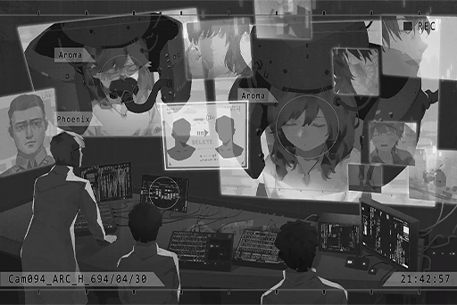

**Noah** 
Yes. In this stage, we'll be formatting the memory of the vessel.

**[Phoenix]** 
_She was a very beautiful girl._

**Noah** 
Yes, she was. But... sorry.

*\[Memory delete\]*

**Noah** 
......

**Researcher A** 
......

**Researcher U** 
......

**Researcher E** 
... This feels... a lot heavier than I imagined...

**[Phoenix]** 
_......_

**Noah** 
......

**[Phoenix]** 
_From now on, it'll be your time to shine. Go, save her._

**Noah** 
Aroma... this is going to hurt a bit. Please, bear with it...

_\[Signal Lost\]_

[*(Click here to go back to the top)*](#toc)

## <a id="pos034"/>\[#034\] Cam\_ARC\_H\_694\_05\_12\_1
### Requirements
|Character|Level|
|---------|:---:|
|**PAFF** | 61  |

### Log Content
 
*[Click the image to watch the movie]*

[*(Click here to go back to the top)*](#toc)

## <a id="pos035"/>\[#035\] Cam\_ARC\_H\_694\_05\_12\_2
### Requirements
|Character|Level|
|---------|:---:|
|**PAFF** | 61  |

### Log Content
**Researcher A** 
Prepare awakening process. Status A, B, all clear.

**[Noah]** 
_... Activate._

**PAFF** 
Ugh...

**[Noah]** 
_......_

**PAFF** 
AAAAHHHHHHHHHH! ARRRRGGGHHHHHH!!

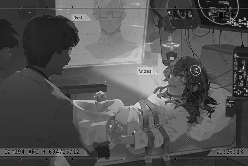

**Researcher E** 
No good... Failure again! Sedatives! Quick!

**Researcher A** 
On it!

**PAFF** 
Ugh...!

**Researcher A** 
Director...

**Researcher E** 
Damnit, everything was going smoothly in the beginning too. Why did it...

**[Helena]** 
_Noah, enough! This is the sixth time already! I don't want to see that scene play out in front of me again..._

**[Noah]** 
_………_

**[Helena]** 
_Noah! Do you hear me? Let's stop... let it go..._

**[Noah]** 
_Let it go......?_

**[Helena]** 
_......_

**[Noah]** 
_Are you serious!!?  
Aroma's body is already dead! There's already no turning back for us! This is our last chance to bring her back! EVER!_

**[Helena]** 
_………_

**[Noah]** 
_I know very well that Aroma's memory has already been successfully transferred into the new body. Just a little bit more..._

**[Helena]** 
_Noah... you've gone mad..._

**[Noah]** 
_I've gone mad... is it?_

**[Researcher ]U** 
_Helena, sorry, but would you mind leaving the room for now...?_

**[Helena]** 
_………_

*\[Door Opens\]*

**[Noah]** 
_... Reset the parameters. Let her body rest and recover. Prepare configuration No.7. We'll try again three days later._

**[Researcher ]U** 
_Understood._

**[Noah]** 
_Aroma... come on... wake up... _

_\[Signal Lost\]_

[*(Click here to go back to the top)*](#toc)

## <a id="pos036"/>\[#036\] Audio\_ARC\_H\_694\_05\_15
### Requirements
|Character|Level|
|---------|:---:|
|**PAFF** | 62  |

### Log Content
*\[Door Opens\]*

**Helena** 
Is she awake!?

**Researcher A** 
Mrs. Helena, you can't come in yet...

**Helena** 
Aroma!

**Researcher E** 
Director, the test is not...

**[Noah]** 
_It's fine. Let her in._

**Helena** 
Thank goodness! _\*Sobs\*_......

**PAFF** 
...... Ummm......

**Helena** 
What's wrong? It's me.

**PAFF** 
Who... are you...?

**Helena** 
Aroma......?

**PAFF** 
Aroma... is that...me? Who... am I?

**Helena** 
......

**Researcher A** 
......

**Researcher E** 
......

**[Noah]** 
... Helena, I'm sorry... There are still some examinations we need to perform. Please leave the room first.

**Helena** 
......

**Researcher A** 
Mrs. Helena, please rest assured. At the very least, she can talk normally. Her cognition seems to function properly as well. We will try our best to...

**Helena** 
... Enough.

**Researcher A** 
......

**Helena** 
Noah... I believe you.

**[Noah]** 
_... I know. Leave it to me._

_\[→Signal Switches\]_

_\[»»» Fast Forward 15 hours»»»\]_

**Researcher U** 
Director, all tests are complete. Her nervous system is reacting normally.  
Health condition is also recovering well. We're supplying her with nutrients right now.

**Noah** 
... Reset the parameters. Prepare to try again with configuration no.8.

**Researcher U** 
...... Eh?

**Noah** 
We still haven't succeeded. It shouldn't be like this...

**Helena** 
Noah... stop it.

**Noah** 
No! Aroma's memory should be activated by now!

**Helena** 
Do you not realize that you're torturing a live human being!? She's already awake with her senses intact. That's enough!

**Noah** 
I......!

**Helena** 
... Enough is enough. This is not the you I know.

**Noah** 
......

**Helena** 
Aroma's memory... does indeed exist inside this body, correct?

**Noah** 
Yes...

**Helena** 
Then we have a chance to awaken that memory. We can bring Aroma back with a softer, less\-invasive treatment method. We can, right? Uriel?

**Researcher U** 
That's certainly possible...

**Helena** 
Please, let it end here...

**Noah** 
Ummm...

**Researcher U** 
Director...

**Noah** 
......

**Noah** 
Turn off the machine.

**Researcher U** 
......

**Noah** 
I need to calm down. Leave me alone. Please.

*\[Door Opens\]*

_\[Signal Lost\]_

[*(Click here to go back to the top)*](#toc)

## <a id="pos037"/>\[#037\] Audio\_Noah\_695\_06\_05
### Requirements
|Character|Level|
|---------|:---:|
|**PAFF** | 63  |

### Log Content
*\[Doorbell\]*

**[Helena]** 
_Who is it?_

**Iris** 
Sis Helena, it's been a while. This is Iris. 
We want to talk to Aroma. Is she home right now?

**[Helena]** 
_... One moment._

**Daniel** 
......

*\[Door Opens\]*

**Helena** 
Oh, Daniel, you're here as well.

**Iris** 
Yeah, been quite some time since my last visit. Is Aroma home?

**Helena** 
Hmm... Aroma can't meet with you guys now. If there's anything you want to inform her, just tell me. I'll pass it on to her.

**Iris** 
Can't meet with us? Is she not feeling well?

**Helena** 
No, she is very healthy. It's just...

**Daniel** 
......

**Daniel** 
That's her singing... She's practicing in her room?

**Helena** 
Yes. Her performance is right around the corner. Therefore...

**Iris** 
We want to talk to her about the graduation trip. It won't take too long. After all, she's been absent from the Academy's classes recently too...

**Helena** 
The graduation trip? Unfortunately... I don't think Aroma will be able to participate.

**Daniel** 
She can't even go to the graduation trip?

**Helena** 
Yes. I also act as her agent now. I've been working with Mono to organize Aroma's schedule... I really want her to participate in the Academy's events too, but she just doesn't have any spare time left...

**Iris** 
Then, the reason why she doesn't answer her phone these days is also...

**Helena** 
Uh\-huh. The company requested me to get her a new number. This is to avoid any inappropriate interactions or rumors before her debut... It would throw a wrench into the promotional campaign for her idol image.

**Daniel** 
Tch, all this company, idol, agent bullcrap... Aroma! You're in there, right? Show yourself!

**Iris** 
... Daniel! Stop that...

**Helena** 
... Right now is an important time period for Aroma. Her schedule is very tight. For her sake, please don't bother her when she's practicing.

**Daniel** 
Not even a few words?

**Helena** 
I will tell her that you guys came. Please, just give her some more time.

**Daniel** 
... Hmph, I'm leaving.

*\[Footsteps\]*

**Helena** 
I'm really sorry, Iris.

**Iris** 
W, wait! Sis Helena!

**Helena** 
What's the matter?

**Iris** 
I would like sis Helena to tell Aroma that... 
After graduation... I'm moving away.

**Helena** 
Moving away? Why all of a sudden?

**Iris** 
Due to my father's job, we'll be living in Node 19 permanently... It's very likely that we'll never return to 08 again.

**Helena** 
I see... what a shame.

**Iris** 
If possible, please tell Aroma...

**Iris** 
No matter what, we... will always be best friends... _\*Sobs\*_...

**Helena** 
......

**Helena** 
... Understood. I will pass that message to her. You should go home now. It's getting late.

**Iris** 
Yes... Thank you, sis Helena.

*\[Door Closes\]*

**Helena** 
......

**Helena** 
Don't think about it... I did the right thing.

**Helena** 
I have to... protect Aroma no matter the cost...

_\[Signal Lost\]_

[*(Click here to go back to the top)*](#toc)

## <a id="pos038"/>\[#038\] Audio\_ARC\_H\_702\_07\_28
### Requirements
|Character|Level|
|---------|:---:|
|**PAFF** | 64  |

### Log Content
**[TV]** 
_... PAFF, the music diva who was harassed by a male fan a while ago, had another incident. At the end of a three\-hour physical concert at Node 08, she fainted on stage while singing the encore song "Gravity". The singer's sudden collapse had the audience in utter shock. Her agency immediately called off the concert and arranged her for an emergency medical checkup..._

**Helena** 
Noah! What is going on with Aroma!?

**Noah** 
Calm down. We are still running the analysis as well...

**Helena** 
She's... this is just way too abnormal.

**Noah** 
......

**Helena** 
What we did... was it really the right thing to do?

**Noah** 
Why are you saying this all of a sudden...?

**Helena** 
Sometimes when I look at her face... It certainly is my little sister's face, and she certainly does have my little sister's memory... But it's as if I'm looking at a complete stranger...

**Noah** 
You're thinking too much. Aroma is Aroma. We worked so hard to finally bring her back. Right now, all we need to do is cherish the fact that she's still here.

**Helena** 
......

**Noah** 
No need to worry, I will re\-adjust the parameters for the stabilizers to better stabilize her brain and mental condition. Right now, let us complete the analysis so we can figure out what the problem is.

**Helena** 
Yes...

**Noah** 
You look really pale and haggard. You've not slept well for the past few days, haven't you? Get some rest in the break room. I'll handle the rest.

**Helena** 
It's okay... I still have to make a PR post on iM. I'll leave the things here to you.

_\[→Signal Switches\]_

**PAFF** 
......

**Researcher A** 
Are you awake? Director!

**[Noah]** 
_Aroma._

**PAFF** 
Noah... Ugh... What happened to me?

**[Noah]** 
_You fainted on stage... Rest assured, the checkup results showed nothing more than mere exhaustion. You'll be fine after some rest and nutrients. Your schedule for the past few days may have taken a serious toll on your body._

**PAFF** 
Where's sister...?

**[Noah]** 
_Resting in the room next door. Because of you, she barely had any rest for the past few days too._

**PAFF** 
_\*Sobs\*_... _\*Sobs\*_...

**[Noah]** 
_What's wrong...?_

**PAFF** 
I'm so happy... that I still remember you guys. I was so afraid that I'll forget everything again when I wake up... _\*Sobs\*_...

**[Noah]** 
_... Rest assured. The scan results showed everything to be normal. Starting today, you siblings should both take some time off. You guys are working too much. 
As with the company's events, I'll find a way to let Chris handle them._

**PAFF** 
I'm sorry... I made you guys worried again. I even caused everyone so much trouble...

**[Noah]** 
_No need to apologize. Nobody will blame you for what happened... In fact, I should be the one apologizing to you. As your attending physician, I failed to take good care of your physical conditions... 
Don't overthink yourself. You need to rest. I'll apply some medication to make you feel more relaxed. Enjoy your sleep._

**PAFF** 
OK...

_\[Signal Lost\]_

[*(Click here to go back to the top)*](#toc)

## <a id="pos039"/>\[#039\] Cam\_Noah\_702\_09\_09
### Requirements
|Character|Level|
|---------|:---:|
|**PAFF** | 64  |

### Log Content
*\[Door Opens\]*

**Noah** 
... Why are you still awake?

**Helena** 
......

**Noah** 
Helena?

**Helena** 
... Yeah. Sorry, I was thinking about something.

**Noah** 
You... Why did you start smoking again?

**Helena** 
......

**Noah** 
... Smoke outside. You don't want Aroma to smell the cigarette smoke.

**Helena** 
... (Exhales)... She isn't willing to accept any work these days. I'm trying to figure out a way to handle that.

**Noah** 
......

**Helena** 
Noah... I...

**Noah** 
......?

**Helena** 
I don't think I... can bear it anymore...

**Noah** 
...... 
You should ask someone else in the company to take over your job. You're burning the candle at both ends.

**Helena** 
No, it's not about my job.

**Noah** 
......?

**Helena** 
After the 7th anniversary concert, her speech and actions have become stranger and stranger... She sings melodies she's never heard of and reminisces about foreign sceneries. She even constantly asks me questions that never belong to her memory in the first place... You know what I'm saying, right?

**Noah** 
Helena, you...

**Helena** 
The memories that originally exist in that body...

**Noah** 
Shhh! That's enough talk on this topic.

**Helena** 
Why... Stop deceiving yourself! Noah! Your experiment was not successful at all!

**Noah** 
... What are you talking about? Aren't you the one who insisted that I stop back then? We had it! We had a really good shot at bringing back Aroma for real! The fact that we stopped at that half\-a\*\*ed state is why...

**Helena** 
Then did you want me to just watch as you continued on with that ridiculous experiment!? You know very well yourself that bringing Aroma back was asking the impossible! It's all because of you that we're in this hole now...

**Noah** 
Because of me!? If not for me, your younger sister would already be dead!

**Helena** 
THAT'S NOT MY SISTER!!

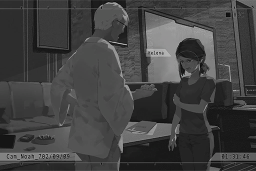

**Helena** 
Ummm...!

**Noah** 
Keep your voice down! She'll hear us!

**Helena** 
......!

**Noah** 
I... For the past few years, I've continued to conduct this research for her sake. I also collected a lot of new data from her stabilizers. I still haven't given up on the possibility of resetting her memory and turning her into the real Aroma.

**Helena** 
... But if we do that...

**Noah** 
That's right. There's a possibility that her memory of these past seven years she spent with us will disappear as well. This is a risk we cannot avoid, and it's also why I couldn't make up my mind.  
In these seven years, although things were tough for her, it certainly has given her some very happy memories too.

**Helena** 
......

**Noah** 
Regardless, there is no turning back for us. From now on, no matter what decision we make, we can only face it together... However, one thing remains unchanged. We must let her live on. Not knowing anything, and not needing to shoulder anything. Just live on happily. Don't you agree?

**Helena** 
... I don't know anymore... To save her, we erased a living person from existence, and at this very moment, that person clearly still exists within her body. 
Sometimes, when I look into her eyes... I see that "other" girl. This guilt... I have no idea what can even be considered happiness to "them" anymore.

**Noah** 
Helena, we need to focus on "Aroma". She's the most important one. I believe that we'll have to make a decision in the very near future...

**Helena** 
... We have one more option.

**Noah** 
......?

**Helena** 
Tell her.

**Noah** 
Eh?

**Helena** 
Tell her. Tell her everything. Let her decide what she'll do herself... even if she despises us because of it. I know this sounds a bit irresponsible, but I believe that this is the correct thing to do.

**Noah** 
... I'll... consider it...

_\[Signal Lost\]_

[*(Click here to go back to the top)*](#toc)

## <a id="pos040"/>\[#040\] Audio\_Vicky\_702\_11\_14
### Requirements
|Character|Level|
|---------|:---:|
|**PAFF** | 64  |

### Log Content
**NEKO#ΦωΦ** 
Ha... ha! Excuse me!

**Pedestrian** 
Waahhh!

**Vicky** 
Stop! NEKO! PAFF! Stop right there!

**Pedestrian** 
Is that... NEKO and PAFF?

**Pedestrian** 
It really is them!

**Pedestrian** 
Quick, take a picture!

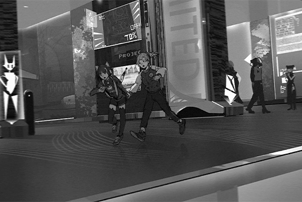

**NEKO#ΦωΦ** 
Oh god, oh no! This is bad! This is really, really bad!

_\[→Signal Switches\]_

**Vicky** 
Waah!

*\[Falls down\]*

**Hayato** 
Sis Vicky!

**Vicky** 
Don't worry about me! Keep chasing!

**Hayato** 
I can't do that!

**Vicky** 
Damnit! Shouldn't have worn heels...

**Hayato** 
Sis Vicky, you twisted your ankle... Can you walk?

**Vicky** 
Yeah, I can... Oww! That hurt...

**Hayato** 
... It looks swollen. You need to get it treated as soon as possible. Here, I'll carry you.

**Vicky** 
...... (Offers hand)

**Hayato** 
Hnngh... Ha!

*\[Footsteps\]*

_\[»»» Fast Forward»»»\]_

**Vicky** 
...... 
... Why didn't you keep chasing them!? You dumba\*\*! I'm going to deduct your salary!

**Hayato** 
Ow, that hurt... I'm not going to catch them at that distance. There were many pedestrians between us too.

**Vicky** 
You slowed down on purpose, didn't you? When she kept turning around to look at you.

**Hayato** 
......

**Vicky** 
What you said back at Daniel's place... Those were all true, weren't they?

**Hayato** 
......

**Vicky** 
As a professional journalist, I can clearly tell that you're already investigating this story from a completely personal angle. I'm certain that there's still a lot more you know regarding this case, many of which I'm totally unaware of, right?

**Hayato** 
... Guess I can't hide it from sis Vicky anymore... Sorry for not telling you. I was afraid that if I do, you would definitely treat it like exclusive news and write tons of reports on it. I didn't want that to happen...

**Vicky** 
Sighs... By now, that so\-called exclusive news is already gone with the wind... Take a look. It's all over iM now, that little chase scene we had back there.

**Hayato** 
Woah...

**Vicky** 
In terms of this news report, it's my utter defeat. I was totally out of the loop throughout all this. Tell me everything you know, will you?

**Hayato** 
......

**Vicky** 
Rest assured. Judging by how you look at her... she is currently in some kind of danger, right? If this news report involves the safety of a person's life, I will back out. I still uphold some basic business ethics, after all.

**Hayato** 
Can you promise...?

**Vicky** 
I, Vicky Russell, is exceptional at putting out questions, confutations, speculations and discussions. However, that does not include prevarications. The one thing I loathe the most in life is knowing the truth yet telling a lie on purpose. This is also the reason why I was able to survive in this industry for such a long time.

**Hayato** 
Haha... Now that I think about it, it is true. Sis Vicky tends to just cut through all the crap and get straight to the point.

**Vicky** 
Besides, the determination you showed back there, that will to catch up to her no matter what... It reminds me a little of what I used to be... 

**Hayato** 
Eh?

**Vicky** 
Don't mind me. All in all, setting aside my role as a journalist, I really want to know the story between you and her.

**Hayato** 
... I... I grew up in Node 03, together with a girl named "Kaori"...

_\[Signal Lost\]_

[*(Click here to go back to the top)*](#toc)

## <a id="pos041"/>\[#041\] Cam\_Charity\_687\_05\_13
### Requirements
|Character|Level|
|---------|:---:|
|**PAFF** | 65  |

### Log Content
**Kaori** 
Grandma Feng, we're here!

**Feng** 
Ah, "Furuhata Charity Foundation", they've gotten a new sign too... 
How many years have it been, Kaori\-chan?

**Kaori** 
Four, five, six... six years! I wonder if everyone still recognizes me?

**Feng** 
Time sure flies. Kaori\-chan was just three years old back then... One blink of the eye and you're all grown\-up now.  
What do you think of the past few years you spent with this old grandma? Are you happy?

**Kaori** 
I'm very happy! Thank you so much for adopting me, grandma Feng! You even let me help with the flower shop! I love seeing the customers' smiling faces!

**Feng** 
Haha... good girl. Here, let's go inside.

*\[Door Opens\]*

**Kaori** 
Wow, it smells so nice\~

**Saku** 
Because it happens to be lunch time, Kaori\-chan!

**Kaori** 
Aunt Saku! Headmaster Tsumugi too! Long time no see!

**Feng** 
Long time no see. We'll be in your care today too, Mrs. Tsumugi.

**Tsumugi** 
Not at all, we're the ones in your care, Mrs. Huang! You've taken great care of Kaori\-chan for the past few years. When we heard that you plan to adopt another child, we were all very delighted.

**Feng** 
I'm flattered. These days, I often hear customers talk about this foundation. They all said that you guys helped everyone a lot... Unlike me, who is already too old to do anything.

**Saku** 
Don't say that, Mrs. Huang. You often gift us flowers for free. We are all very thankful of you.

**Tsumugi** 
Saku has a point. There aren't many good people like you out there. You deserve all the praise you get. 
Setting that aside, why did you want to adopt a child again all of a sudden?

**Feng** 
My back's been hurting real bad lately. The labor at the flower shop is getting more and more difficult for me. An extra person would definitely make things easier... Besides, I want to find Kaori\-chan a friend too. 
Ah, right. Is your husband not here?

**Tsumugi** 
Same as always. Not taking one step outside his research room...

_\[→Signal Switches\]_

**Little Boy A** 
Big brother, give me one!

**Little Boy B** 
Me too! Me too!

**???** 
Ah... wait a sec...

**Little Boy C** 
Why did you give it to her first! Do you like her more than me!?

**???** 
P, please wait... I'll be right there...

**Kaori** 
STOP\~!! 
Everyone, no rushing!

**???** 
!?

*\[Utensils clinging\]*

**Kaori** 
Alright, alright. Everybody, line up here. If you haven't wash your hands, go wash them first! Only the good kids who follow the rules will get lunch!

**Little Boy A** 
... Big sister, who are you?

**Kaori** 
Good question. I'm a sorcerer who happens to pass by. Any dish touched by me will become super delicious. Here, this one is for you!

**Little Boy A** 
Wow! Thank you, big sister!

**Kaori** 
Hey, quick, fill up the next bowl. There's still a lot of people waiting behind them.

**???** 
Ah, okay...

*\[Utensils clinging\]*

**???** 
This one is for you.

**Little Boy B** 
It smells so good\~ Thank you, big brother!

**???** 
... Haha.

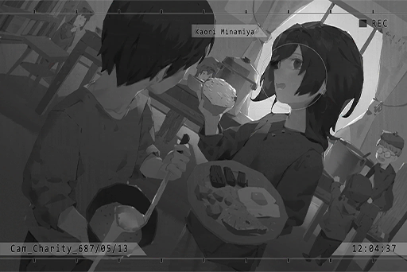

**Kaori** 
Hey, you look good with a smile\~ When did you come here?

**???** 
R, recently...

**Kaori** 
No wonder I've never seen you before. I used to lived here as well, but grandma Feng adopted me and took me away a long time ago.

**???** 
Grandma... Feng?

**Kaori** 
She is the most awesome and kindest grandma in the entire world. Look, she's right there talking to the headmaster.

**???** 
Oh...

**Kaori** 
Ah, right. My name is Kaori. What's your name?

**???** 
I... I'm...

_\[→Signal Switches\]_

**Feng** 
... Will this child... be willing to come with me?

**Tsumugi** 
Rest assured, Mrs. Huang... Hayato is a good kid. He'll be more than happy to go with you.

_\[Signal Lost\]_

[*(Click here to go back to the top)*](#toc)

## <a id="pos042"/>\[#042\] Cam\_Feng\_689\_04\_03
### Requirements
|Character|Level|
|---------|:---:|
|**PAFF** | 65  |

### Log Content
*\[Singing\]*

**Kaori** 
_\*You and I. Just like butterflies, perfect hue and light.\*_

**Kaori** 
... Hayato? You're there, right?

**Hayato** 
Ah... I just came back from a flower delivery... You saw me.

**Kaori** 
Why do you always hide so far away when I'm singing? You'd rather stand in the sun and get toasted? Is my singing that bad?

**Hayato** 
Of course it's not! It's just... your singing is so good, and I don't want to disturb you...

**Kaori** 
Nah, it's fine. Come inside! Grandma Feng is taking a nap inside the shop. That's why I came outside to sing. 
How's aunt Lin?

**Hayato** 
She's doing very well. She was so excited and kept telling me about how her son got accepted to study overseas at Node 08. 
It seems like the flowers she ordered from us is going to be used in the ceremony.

**Kaori** 
Node 08... That largest city?

**Hayato** 
Yeah. I heard that the people there don't need to pay offerings. There are many drones that help everyone out, and that there are a lot of musical performances too.

**Kaori** 
How nice... I would love to go there...

**Hayato** 
... Let's not talk about that. I have something to give you. Can you close your eyes?

**Kaori** 
Hahaha, I knew it! When I saw you keep hiding your hands behind your back, I knew you were up to something!

**Hayato** 
... Is it that obvious...

**Kaori** 
Hehe, okay, okay. My eyes are closed.

**Hayato** 
Here... You can open your eyes now.

**Kaori** 
This is... wow! It's lavender!

**Hayato** 
It's dried lavender flower... A while ago, when I passed by Genmu Boulevard, I discovered a place with lavenders growing everywhere. I picked some, took them back and dried them... This is your favorite flower, right?

**Kaori** 
Yep, I love lavender! According to grandma Feng, since I was little, I would always put a pot of lavender at my bedside before I go to bed. One time, grandma made a mistake and accidentally planted mealy sages instead. I ended up crying the whole night.

**Hayato** 
Haha, I remember that. You said you screamed, "They look alike but the smell is totally wrong!". Grandma Feng had quite the headache that day.

**Kaori** 
... I only mentioned this incident to Hayato once, right? I'm so glad that you remember all of it.

**Hayato** 
It's about Kaori. O... of course I'd remember.

**Kaori** 
Hmm? What did you say?

**Hayato** 
N, nothing. 
Sorry for disturbing you sing. I'll be going inside first...

**Kaori** 
Not at all! Hayato, can you get that for me?

**Hayato** 
... A flower pot? What are you going to do?

**Kaori** 
Check this out. You place it upside down...  Voilà! A drum for Hayato!

**Hayato** 
Drums? The instrument you hit to make a sound?

**Kaori** 
Yep. I've always wanted someone to accompany me! Hayato, you've eavesdropped on my singing a lot, so you should be able to help, right?

**Hayato** 
I, I've never played drums before... Wait, you already found out that I was eavesdropping? When did you find out?

**Kaori** 
Hehe, that's a secret. I'm starting. Hayato, get ready!

**Hayato** 
Ah, o, okay!

**Kaori** 
_\*You and I. Just like butterflies, perfect hue and light.\*_

*\[Drum noise\]*

**Kaori** 
......

**Hayato** 
......

**Kaori** 
Ahahaha! That was totally offbeat! This really is your first time playing drums! 
Hayato, you're so funny\~!

**Hayato** 
I, I'm so sorry... T, this is not for me after all...

**Kaori** 
Aw, come on. It's okay! 
Here, I'll start again. You just follow my movement and tap your feet to the beat. Get ready\~

**Kaori** 
_\*You and I. Just like butterflies, perfect hue and light.\*_

*\[Drum noise\]*

**Kaori** 
Much better. I'll keep going!

**Kaori** 
_\*Though it rains down our fate. Start up today.\*_

*\[Drum noise\]*

**Kaori** 
You're getting better and better! Maybe you do have the talent! That's awesome!

**Hayato** 
Whew... that was hard. But... it's also kinda fun!

**Kaori** 
Hehe, I made up my mind. Next time, we'll be singing on the streets for everyone. Then, when we both grow up... we'll go and perform at Node 08! We'll bring grandma Feng with us too!

**Hayato** 
You're exaggerating things again... haha.

**Kaori** 
_\*You and I. Just like butterflies, perfect hue and light.\*_

*\[Drum noise\]*

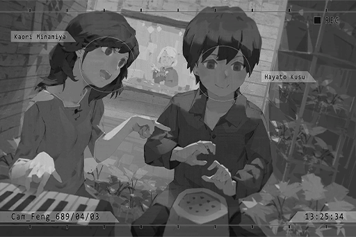

_\[Signal Lost\]_

[*(Click here to go back to the top)*](#toc)

## <a id="pos043"/>\[#043\] Audio\_Asakura\_702\_11\_14
### Requirements
|Character|Level|
|---------|:---:|
|**PAFF** | 66  |

### Log Content
**NEKO#ΦωΦ** 
Huff... Puff... Sis Yukiko, quick, open the door!

*\[Door Opens\]*

**Kenta** 
Big sister is back!

**Yukiko** 
NEKO!

**NEKO#ΦωΦ** 
Finally home... Ah, daddy is here too!

**Kouhei** 
I got Yukiko's note about you wanting us to help, so daddy got home from work as soon as possible... Did you get into trouble again?

**NEKO#ΦωΦ** 
Nope. Not at all, you dummy. NEKO just...

**NEKO#ΦωΦ** 
Argh! This is so irritating. First things first, quick introduction; this is Aroma\-chan!

**PAFF** 
H, hello everyone...

**Yukiko** 
Ah, are you NEKO's friend? Hello. 
Here, Kenta, say hi to her.

**Kenta** 
PA......PAPAPAPA

**Kouhei** 
Kenta?

**Kenta** 
PAFF... It's PAFF

**Yukiko** 
What's the matter, Kenta? 
... Eh...?

**Kouhei** 
This face is really familiar... You...

*\[Things crashing\]*

**Yukiko、Kouhei** 
PAFF!???

**PAFF** 
Umm, Yes... Apologies for disturbing you...

**NEKO#ΦωΦ** 
Sighhh\~ I knew this is gonna happen... Welp, can't help it then. Guys, just hear NEKO out first.

_\[»»» Fast Forward»»»\]_

**Kenta** 
It's the real PAFF... the real PAFF...

**Kouhei** 
So you've been hiding in NEKO's room all this time. No wonder she always cooks an extra serving of dinner... This is much more serious than keeping a stray cat, you know.

**NEKO#ΦωΦ** 
W, what else can NEKO do!? Aroma\-chan's memory was all messed up and she didn't know who to ask for help. She looked so pitiful! NEKO wants to help her!

**Yukiko** 
Kouhei... she does indeed appear to be in bad shape...

**Kouhei** 
Alright then... Although I have no idea why you would go missing, my daughter's friend is likely not a bad person. 
Rest assured. We won't inform the authorities.

**PAFF** 
Thank you... Mr. Asakura.

**Kenta** 
It's the real PAFF... the real PAFF...

**Kouhei** 
You're welcome. 
So, NEKO, about that hiding place you mentioned...

**NEKO#ΦωΦ** 
Uh\-huh... It's a bar called "JOEZ Cafe". It's quite a distance from our home. Daddy, can you drive us there?

**Yukiko** 
Okay, we will escort Miss PAFF there...

**Kouhei** 
We have a slight problem... Yukiko, look outside the window.

**Yukiko** 
......!! 
What a crowd...

**Kouhei** 
You two caused a huge ruckus on iM. Our home address was also posted on there. All those people outside are probably all Miss PAFF's fans. If they discover that Miss PAFF is indeed here, she'll definitely get sent back.

**NEKO#ΦωΦ** 
N, NEKO didn't do it on purpose! We just accidentally got recognized back there! PAFF is way too famous!

**PAFF** 
I'm sorry...

**Kenta** 
It's the real PAFF... the real PAFF...

**Yukiko** 
It's alright, Miss PAFF... Kouhei, looks like the only option now is to drive there.

**Kouhei** 
Yes. Everyone, prepare to leave. We're all going. Staying at home alone is not safe right now. I'll go get the car from the garage first. We'll meet up at the backdoor... Miss PAFF, sorry in advance, but you may have to squeeze in with us in our shabby old car.

**PAFF** 
T, thank you very much!

*\[Door Opens\]*

**Yukiko** 
Here, let's get ready to leave too. NEKO, Kenta, and Miss PAFF... No need to worry. You'll be safe soon.

**PAFF** 
Okay... Thank you.

**Kenta** 
It's the real PAFF... the real PAFF...

**NEKO#ΦωΦ** 
KENTA! Snap out of it! Put on your shoes, now! If you keep overheating, I'll stick you in the fridge and leave you at home alone!

**PAFF** 
Haha...

\[Signal Lost\]

[*(Click here to go back to the top)*](#toc)

## <a id="pos044"/>\[#044\] Audio\_St08\_702\_11\_14
### Requirements
|Character|Level|
|---------|:---:|
|**PAFF** | 66  |

### Log Content
*\[Door Opens\]*

**NEKO#ΦωΦ** 
Kenta, is anyone outside?

**Kenta** 
No one in sight! They're all at the front door!

**NEKO#ΦωΦ** 
Shh! Too loud!

**Yukiko** 
It's okay, NEKO. The front door is quite far away from here. The sound won't travel that far... Let's wait for Kouhei here.

**PAFF** 
I'm sorry... for causing you guys all this trouble...

**NEKO#ΦωΦ** 
Aroma\-chan, you need to stop apologizing!

**Yukiko** 
NEKO's right. This is really all the help we can offer you too... Hope you can remember more things after you get to that bar...

**PAFF** 
Yes...

**Kenta** 
Ummm... Miss PAFF...

**PAFF** 
Ah, your name is... Kenta, right? What's the matter?

**Kenta** 
Miss PAFF... Can I have your autograph?

**PAFF** 
This is... my album?

**NEKO#ΦωΦ** 
Ha!? Ya little brat, when did you buy this... and this one of all things! The album where the Mono bastards cheated NEKO out of all the songs I wrote!

**Kenta** 
I just like this one the most... Big sister's songs are all so good...

**PAFF** 
NEKO... Can I sign it?

**NEKO#ΦωΦ** 
Umm... Y... yeah, you can.

*\[Signs\]*

**PAFF** 
Here, Kenta.

**Yukiko** 
Thank you, Miss PAFF... Kenta, remember to say thank you.

**Kenta** 
T, thank you, Miss PAFF!

**PAFF** 
......

**PAFF** 
NEKO... That album, Mono purposely chose to not put your name on it... You were right to be angry. I am really sorry.

**NEKO#ΦωΦ** 
... Oh that. Nah, it's fine. No big deal... So you did find out?

**PAFF** 
My sister just told me that it's company policy. I only knew about the details later when I asked Chris about it... What they did was awful. I've always wanted to properly apologize to you. You wrote such amazing songs too...

**NEKO#ΦωΦ** 
I, it's not Aroma\-chan's fault either! The ones that deserve the blame are Chris and the other idiots at Mono! It was also kinda NEKO's fault since I did spew a lot of random crap back then. Xenon chewed out NEKO for the same reason too ahahaha!

**PAFF** 
Thank you... NEKO's music really is amazing. If I have the opportunity, I would love to sing for NEKO's songs again.

**NEKO#ΦωΦ** 
For real? Of course I'm down for that! Once Aroma\-chan remembers everything, NEKO will write a few more awesome songs for you to sing! And we will have a collab with Xenon, ah, and Sis Cherry too... Hehe, maybe we can even get ROBO to organize a LIVE for everyone!

**PAFF** 
S...sure. Haha.

**NEKO#ΦωΦ** 
Hoho\~ Is this what it feels like to get carried?

**PAFF** 
Carried? What does that mean...

*\[Alarm\]*

**Men In Black** 
Unit A has located the target. Initiate apprehend operation immediately.

**Kenta** 
Big sister! So many people!!

**NEKO#ΦωΦ** 
Yikes! What are you people trying to do!?

**Men In Black** 
... Miss Aroma White, we are here to pick you up. Please don't resist. We promise that we won't use any violence.

**PAFF** 
M... me?

**Yukiko** 
You people... aren't Miss PAFF's fans, I suppose? Where are you trying to take Miss PAFF to?

**Men In Black** 
This has nothing to do with outsiders. Please step away.

**NEKO#ΦωΦ** 
Who's gonna let you suspicious folks take Aroma\-chan away! She still has to sing NEKO's new songs! NEKO's gonna i, inform the admins!

**Men In Black** 
... Apprehend the target.

**NEKO#ΦωΦ** 
R... run! Aroma\-chan!

**PAFF** 
O, okay!

**Men In Black** 
You're not getting away. Go after her! Surround them!

*\[Honking\]*

**NEKO#ΦωΦ** 
That's... daddy? It's daddy's car!!

*\[Engine Sounds\]*

**NEKO#ΦωΦ** 
Aroma\-chan, get in the car!!

**PAFF** 
Ah... U, understood!

_\[Signal Lost\]_

[*(Click here to go back to the top)*](#toc)

## <a id="pos045"/>\[#045\] Cam\_Dash\_702\_11\_14
### Requirements
|Character|Level|
|---------|:---:|
|**PAFF** | 67  |

### Log Content
*\[Brakes\]*

**NEKO#ΦωΦ** 
Here! Aroma\-chan, get in, now!!

**PAFF** 
Wahhh!

*\[Door Closes\]*

**NEKO#ΦωΦ** 
All set! Move! Get going!

**Men In Black** 
Wait! Stay where you a...

*\[Engine Sounds\]*

**Pedestrian A** 
There were so many people around that apartment we just passed by.

**Pedestrian B** 
All diehard PAFF fans. They said on iM that they are going to "welcome" her back, but I think they missed her.

**Pedestrian A** 
Dude, I would totally freak out if I was her. No way in hell would I dare show my face!

**Pedestrian B** 
Hehe, maybe she's hiding nearby and observing the crowd...

**Pedestrian A** 
Wait a second. The girl inside that car, is that...

**Pedestrian B** 
N, no way. It can't be...

**PAFF** 
Woah...!

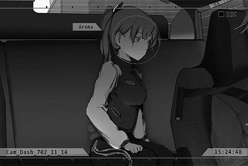

**PAFF** 
That was close... Almost got recognized again...

**PAFF** 
Thank you, Mr. Asakura. Excuse me for all the ruckus...

**???** 
......

**PAFF** 
Ummm... Mr. Asakura?

**PAFF** 
NEKO said the bar is located in Quadrant II...

**PAFF** 
You... do know the directions, right?

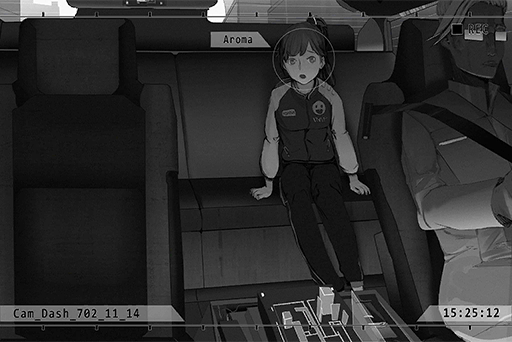

**???** 
......

_\[Signal Lost\]_

[*(Click here to go back to the top)*](#toc)

## <a id="pos046"/>\[#046\] Cam\_DragonSt\_694\_04\_25\_1
### Requirements
|Character|Level|
|---------|:---:|
|**PAFF** | 68  |

### Log Content
*\[Guitar\]*

**Hayato** 
Hmm... Still not quite right...

*\[Guitar\]*

**Hayato** 
Much better... No, that's a bit too much... Argh, what do I do?

**Kaori** 
Hey, why are you sulking like that? Cheer up!

**Hayato** 
Yikes! You scared me... 
Umm... Thanks for the hard work. I've set up all the equipment.

**Kaori** 
Haha, what hard work? Thanks anyway\~ I'll set up the keyboard right away. Gimme a minute.

**Hayato** 
Sure... How was the restaurant today?

**Kaori** 
Same as always. Refilling water, washing dishes, greeting customers, occasionally getting yelled at by the head chef. My god\~ my ears are still ringing.

**Hayato** 
Ahaha... He really is very loud.

**Kaori** 
You don't get to make jokes! How dare you take today off! It was busy as hell! You got off easy...

**Hayato** 
Sorry. I had other work to do in the afternoon...

**Kaori** 
Nah, it's fine. You did well... Oh, right! Brother Zhao and Big Sis will both come to watch us perform! They went to the restaurant today as well.

**Hayato** 
Yikes... The pressure is even higher...

**Kaori** 
Grandma Feng was originally going to come too, but her coughing was not getting any better. It took me quite the effort to persuade her to stay at home alone.

**Hayato** 
I see... I hope grandma can recover from her illness soon.

**Kaori** 
......

**Kaori** 
Aww, come on\~ Why the long face! Even your guitar looks sad! You can't play good music with a sad\-looking guitar!

**Hayato** 
I, I... I am just a bit anxious. 
After all, this is our first time performing in such a bustling city district... If the audience response is lukewarm, I'll feel a bit... hurt.

**Kaori** 
You little... We've performed so many times already... Come, place your head here.

**Hayato** 
Are we doing "that" again? I don't want to...

**Kaori** 
Shut it! This is a magic trick that was taught to me by grandma. If you rub the temple like this, the feeling of anxiousness will disappear. I've only taught this to one other person, you, so far!

**Hayato** 
Owow... That hurt that hurt that hurt! You're putting too much force into it! My skull is going to crack!

**Kaori** 
Hahaha, blame yourself! If you get nervous so easily, how are we going to take our next step to a bigger stage?  
Didn't we make a promise? That we were going to take our songs "there"?

**Hayato** 
Yes, the "music world" of our dreams...  
I'll definitely get you there. You're different than me. You shouldn't be stuck in a dirty, crappy place like this.

**Kaori** 
...... What... You have to be there with me, together.

**Hayato** 
Huh?

**Kaori** 
Nothing... Oh, a crowd is starting to gather. Are you ready? 
Ah\~Ah\~, Mic test, mic test\~

*\[Audience applauds\]*

**Hayato** 
Ah, just give me another second... sorry.

_\[Signal Lost\]_

[*(Click here to go back to the top)*](#toc)

## <a id="pos047"/>\[#047\] Cam\_08Daily\_702\_11\_17
### Requirements
|Character|Level|
|---------|:---:|
|**PAFF** | 68  |

### Log Content
**Vicky** 
Hi, sorry for pulling you out of your dreams at this time of the night.

**Hayato** 
It's okay. So Sis Vicky has confirmed the things I said?

**Vicky** 
Yes. That girl you mentioned... the name "Kaori Minamiya" does indeed appear in the Missing Persons search website of 03's Administration Bureau. Regarding her disappearance, how much do you know?

**Hayato** 
Not much either, to be honest... The only thing I know is that Kaori went missing after that performance.

**Vicky** 
......

**Hayato** 
We waited for her the whole night, yet she didn't come home... Grandma and I searched for her desperately, but all we found was her broken keyboard. It was as if she just vanished into thin air. No one has heard anything about her ever since.

**Vicky** 
I see...

**Hayato** 
Of course, we reported it to the Bureau as well. But... as Sis Vicky knows very well, our Administration Bureau isn't exactly...

**Vicky** 
Yep. The admins of Node 03 won't move a muscle unless they're getting something out of it. A girl from a poor household gone missing; I bet they didn't even flinch when the case was reported to them.

**Hayato** 
Yes... Grandma wasn't exactly healthy, to begin with. Not long after that, she...

**Vicky** 
... I'm sorry to hear that.

**Hayato** 
Thank you... After that, I finally got a clue which told me that Kaori might be in Node 08. Sis Vicky, have you ever heard of the "Eye of Horus"?

**Vicky** 
......! 
I've heard stories about her when I was investigating rumors in Node 03. Apparently, the person is a psychic who has the ability to see everything... So that's real?

**Hayato** 
Yes. The actual person was a little girl. She told me that the person I'm looking for might be in Node 08, a place the two of us used to refer to as the "music world of our dreams".

**Vicky** 
So, you came all the way here and applied to intern as a reporter. You little... 
You even had the gall to say how passionate you are about photography during the interview...

**Hayato** 
I, I'm so sorry.

**Vicky** 
Forget about it. Not a big deal anyway. 
Then, what does all this have to do with PAFF? Judging by what you said, you seem to think that she is that Kaori?

**Hayato** 
I didn't think that way at first either. However, when I saw her rub her temple during a show, I knew that it had to be the case. That trick is something only Kaori and I know... That's when I knew, that was her!

**Vicky** 
Wait, doesn't that sound a bit too ridiculous? Maybe it's all just a coincidence. Even if she underwent plastic surgery, PAFF... Aroma White's identity data is all registered in the Administration Bureau's system. There's no way they can be the same person.

**Hayato** 
I understand, but...

*\[Doorbell\]*

**Vicky** 
Huh? That's strange. Who would come to the office at this time of the night?

**Hayato** 
Maybe Susan? She might have forgotten the lens or something like that...

**Vicky** 
_\*Sigh\*_ With her, that's entirely possible. You go answer the door. I need to organize the information you just gave me.

**Hayato** 
Okay.

*\[Doorbell\]*

**Hayato** 
Ah, one second, please...

*\[Door Opens\]*

**Hayato** 
......!?

**Vicky** 
Hey, Hayato? Who is it...

**Vicky** 
...... PAFF!?

**PAFF** 
... Finally...

**Vicky** 
W, why are you here... Wait, are you crying?

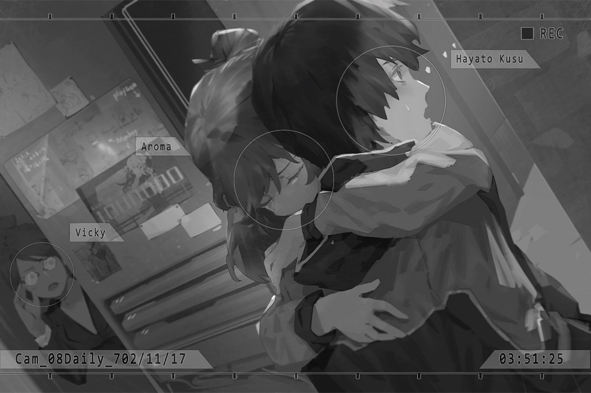

**PAFF** 
I finally get to see you again... Hayato!

**Vicky** 
!?

**Hayato** 
......

**Hayato** 
... Kao... ri?

_\[Signal Lost\]_

[*(Click here to go back to the top)*](#toc)

## <a id="pos048"/>\[#048\] Cam\_Dash\_702\_11\_14
### Requirements
|Character|Level|
|---------|:---:|
|**PAFF** | 69  |

### Log Content
**PAFF** 
That was close... Almost got recognized again...

**PAFF** 
Thank you, Mr. Asakura. Excuse me for all the ruckus...

**???** 
......

**PAFF** 
Ummm... Mr. Asakura?

**PAFF** 
NEKO said the bar is located in Quadrant II...

**PAFF** 
You... do know the directions, right?

**???** 
......

**PAFF** 
......?

**PAFF** 
Noah!?

**Noah** 
Aroma... I finally found you.

**PAFF** 
... I...!

**Noah** 
Ah! You don't have to be so anxious! Please hear me out. This is the only opportunity I have to properly talk to you...

**PAFF** 
.......

**Noah** 
I'm sorry... This is all my fault. I'm the one responsible for everything. It's only natural that you decided to run away.

**Noah** 
That night, when your sister and I had the big argument... You heard all of it, didn't you?

**PAFF** 
... Just a little bit...

**Noah** 
Is that so... Then I'm about to tell you everything now. Everything we... no, everything I did to you.

**PAFF** 
Everything...

**Noah** 
That's right. Maybe you'll come to despise me after hearing what I'm about to say, and I wouldn't mind it one bit. I had this coming...

_\[»»» Fast Forward»»»\]_

**PAFF** 
......

**Noah** 
... And this is how we managed to bring you back.

**PAFF** 
So this body...

**Noah** 
Yes. In reality, this is not your body.

**PAFF** 
... I... Regarding what I've been able to recall... the memories about my childhood with my sister, those are indeed real. Yet some conflicting images are mixed among these memories...

**Noah** 
Yes. This is the exact reason why. In theory, there are two sets of memories existing in your brain right now... I'm sorry. You can despise me all you want; I deserve it.

**PAFF** 
I can understand... the emotions you two felt and why you two so desperately wanted to bring me back. So...

**Noah** 
No, I'm not done yet. I still have some things... some things I need to tell you. Not even Helena knows about the thing I'm going to tell you next...

**PAFF** 
......

**Noah** 
In all honesty, this experiment should've succeeded quite easily. We ended up failing so many times... because of me

**Noah** 
I tampered with your memory copy because back then, I really, really didn't want you to remember... what happened that night...

**PAFF** 
... The night where you got really drunk and did some things to me... right?

**Noah** 
... So you remember? That's right. No matter what I tried, I just couldn't properly control the memory parameters. That was what caused everything to go haywire, all because I was too scared at the possibility of not returning to the simple, happy life we previously had.

**Noah** 
Even now, when I look at what I became back then, and what I'm doing now saying all this crap, I feel nothing but disgust toward myself.

**PAFF** 
Noah, you didn't actually "hurt" me in any way. You collapsed almost immediately after that since you were very drunk...

**Noah** 
That's not the point... My feelings toward you back then, those shouldn't have existed in the first place.

**PAFF** 
... Yes.

**Noah** 
All I desire right now is for you two sisters to be happy... I mean that wholeheartedly. Please believe me.

**PAFF** 
Noah... I...

**Noah** 
We're home. Let's get inside first.

**PAFF** 
......

_\[Signal Lost\]_

[*(Click here to go back to the top)*](#toc)

## <a id="pos049"/>\[#049\] Audio\_Noah\_702\_11\_14
### Requirements
|Character|Level|
|---------|:---:|
|**PAFF** | 69  |

### Log Content
*\[Door Opens\]*

**Helena** 
...... Aroma!

*\[Hugs\]*

**PAFF** 
Sister...

**Helena** 
I'm sorry...! I'm so sorry!

**PAFF** 
... _\*Sniff\*_...

**Noah** 
......

**Helena** 
You seem exhausted...

**PAFF** 
A bit... I haven't slept well for the past few days...

**Helena** 
There are so many things I want to say to you...

**PAFF** 
Noah already told me quite a bit on our way here...

**Noah** 
......

**Helena** 
... Is that so... Although I also have a lot of things I want to say to you personally, you should get some rest first. You must be dead tired... We can take our time with what we want to say after you wake up.

**PAFF** 
Okay. Thank you.

_\[»»» Fast Forward»»»\]_

*\[Door Closes\]*

**Noah** 
......

**Helena** 
... Noah, what is all this about?

**Noah** 
I told her everything. Isn't this what you wanted?

**Helena** 
... Aroma... what did so say?

**Noah** 
She didn't blame us for what we did.

**Helena** 
... Even if she did feel that way, my guess is that she'll never actually say it to us. That's how kindhearted of a child she is.

**Noah** 
Helena, now that everything is out of the way, we now have the chance to let her forget all the pain. This time, we'll definitely succeed in turning her back into what she used to be.

**Helena** 
... Eh...? What do you mean...?

**Noah** 
Soon, we can go back to what we were before. I'll absolutely do the right thing this time.

**Helena** 
Noah... wait a minute. What are you going to do? This isn't something you can decide on your own, is it?

**Noah** 
No... Please hear me out first. This time, we aren't just simply resetting her brain. I just got the latest data from the stabilizers. Her brain is now in utter chaos...

**Helena** 
......!

**Noah** 
Besides the conflicting sets of memories, there are even some parameters I've never seen before in her head now...

**Helena** 
Parameters never seen before... I don't get it. What does that mean?

**Noah** 
It's difficult to explain. In short, these extra parameters are now strongly affecting her brainwaves. Perhaps it's due to her lengthy withdrawal from the stabilizers. The previously suppressed signals that shouldn't exist in Aroma's brain are starting to go berserk. This is also one of the sequelae I was most concerned about after the experiment was prematurely stopped. 

**Helena** 
How come...

**Noah** 
If this keeps going on, her body... we both don't want to lose her again, right?

**Helena** 
But forcefully doing that experiment again... I don't know... if this is the right thing to do...

**Noah** 
Helena, trust me! This time, I won't make the same mistake again!

**Helena** 
That's not the problem. The original owner of that body...

**Noah** 
I only care about Aroma. Everything else, I'll treat as the guilt I must shoulder for the rest of my life. I am prepared to face any consequences that may come with my actions.

**Helena** 
......

**Noah** 
I won't ask for anyone's forgiveness. I won't ask you to shoulder this guilt together with me either. Just treat it as a selfish decision I decided to pursue. Please, think about it carefully.

**Helena** 
... I... I don't know. Give me some time. I can't make a decision right away...

**Noah** 
Okay...

_\[Signal Lost\]_

[*(Click here to go back to the top)*](#toc)

## <a id="pos050"/>\[#050\] Cam\_DragonSt\_694\_04\_25\_2
### Requirements
|Character|Level|
|---------|:---:|
|**PAFF** | 70  |

### Log Content
*\[Audience applauds\]*

**Kaori** 
Woah! It's you guys...

**Brother Zhao** 
Hahaha, told you we were coming to see your performance. Well, here we are!

**Big Sis** 
We were afraid that we would miss the first few songs, so we had the head chef pack the leftovers. He was FURIOUS, yelling things like "How dare you do this to my cooking! My cooking needs to be enjoyed right here!"...

**Brother Zhao** 
He got so mad that his chef hat fell off and we got to see his shiny bald head! Hahaha!

*\[Audience laughter\]*

**Kaori** 
Haha, you guys are so...

**Kaori** 
If that's the case, we can't disappoint everyone no matter what! Are you prepared?

**Hayato** 
No problem... Let's begin. 
... Our first step towards our "music world".

**Kaori** 
... Yes.

**Kaori** 
Well then, here's our first song!

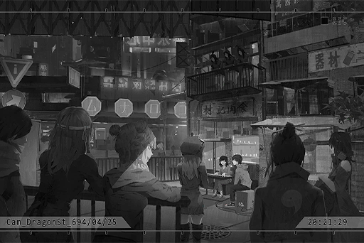

_\[»»» Fast Forward»»»\]_

*\[Audience applauds\]*

**Kaori** 
Thank you everyone... Woah! Brother Zhao, are you crying!? You're overreacting!

**Brother Zhao** 
It's because your singing was too good!

**Kaori** 
Hehe! Thanks\~

**Kaori** 
Audience, please give a round of applause to my partner Hayato as well! He wrote more than half of our songs!

*\[Audience applauds\]*

**Hayato** 
EH? Ummm... Ha, hahaha...

**Kaori** 
Hoho\~ Look at him, he's embarassed\~ His entire face is bright red.

*\[Audience laughter\]*

**Kaori** 
Well then, we've sung our songs and received our applause... 
That's it for our performance today. Thanks, everybody!

*\[Audience laughter\]*

**Brother Zhao** 
What the hell!? You only performed two songs!

**Hayato** 
Pfft...

**Kaori** 
Haha, I was messing around with you\~ See, you're not as nervous as before, right?

**Hayato** 
I guess... so.

**Kaori** 
Guess? So you still have your doubts\~ 
Then I'll ask the crowd. Do you guys want to hear us sing?

**Audience** 
YES!

**Kaori** 
Do you want to hear us sing some more?

**Audience** 
WE DO!

**Hayato** 
Hahaha...

**Kaori** 
Can't help it then. 
If that's the case, tonight... we sing till we drop dead! How does that sound, everyone!?

*\[Audience applauds\]*

*\[Music\]*

_\[Signal Lost\]_

[*(Click here to go back to the top)*](#toc)

## <a id="pos051"/>\[#051\] Cam\_Dash\_702\_11\_17
### Requirements
|Character|Level|
|---------|:---:|
|**PAFF** | 70  |

### Log Content
**Helena** 
Aroma... Aroma, wake up.

**PAFF** 
Umm... Sister? ... Mr. Asakura's car...? 
......! Where are we going!?

**Helena** 
......

**PAFF** 
N...... NO! Are you taking me to the lab...? I heard the conversation between you two. I'm not going!

**Helena** 
N, no, it's not what you think! Calm down first!

**PAFF** 
......

**Helena** 
... I previously don't know what I'm supposed to do. However, seeing this reaction from you... I'm relieved.

**PAFF** 
......?

**Helena** 
I'm taking you to "JOEZ Cafe" to meet up with NEKO.

**PAFF** 
Eh!?

**Helena** 
I got in contact with her. She informed me about the many things that had happened since you left... Need to return the car to them as well.

**PAFF** 
Sister...

**Helena** 
Don't call me that.

**PAFF** 
......!

**Helena** 
No... Sorry. My emotions are kinda messed up right now...

**PAFF** 
......

**Helena** 
Since you heard our conversation, then it should be easier for you to understand what I'm about to tell you. 
Right now, I... can't treat you as simply my little sister.

**PAFF** 
......

**Helena** 
The tone of your speech, your expressions... Compared to what they were before you ran away, I feel even more strongly about this now.

**Helena** 
It doesn't mean that you're not my little sister. It's that this body... doesn't belong solely to Aroma. The more I grew conscious of this, the more I didn't know what I should do...

**PAFF** 
I understand.

**Helena** 
Eh?

**PAFF** 
Because I have the same feeling as well... After I left you guys, those memories that don't belong to me became clearer and clearer... At first, they were still just some blurry, confusing images that felt very dated. But now... even the dream I just had felt as if it was something that just happened yesterday.  

**Helena** 
... Is that so...?

**PAFF** 
I... want to know who "the other me" is.

**Helena** 
... Looks like I made the right decision. Thank... good... ness...... Eh?

**PAFF** 
Sister...?

**Helena** 
Haha... Am I crying? I just felt like a weight was lifted off my chest...yet...I feel some sort of sadness...

**Helena** 
I always... always knew... that the real you was already gone that night... But once I admitted this, I had no idea what kind of feelings, or what identity I should take on when facing the current you... Even when you call me "sister", it just sounds so... unfamiliar... I... _\*Sobs\*_...

**PAFF** 
... (Places hand on Helena)

**PAFF** 
Not calling you sister, that's... I can't do that. Our memories, and the years we spent together after I woke up, they didn't disappear... You are my older sister.

**Helena** 
......

**PAFF** 
No matter how many "me"s exist in this body; no matter where I go next, what happens afterward; no matter... whether you're able to treat me as your little sister or not... you will always be my sister. The sister I love more than anyone else in this world. So... please don't say something like that...

*\[Parks car\]*

**Helena** 
_\*Sobs\*... \*Bawls\*..._

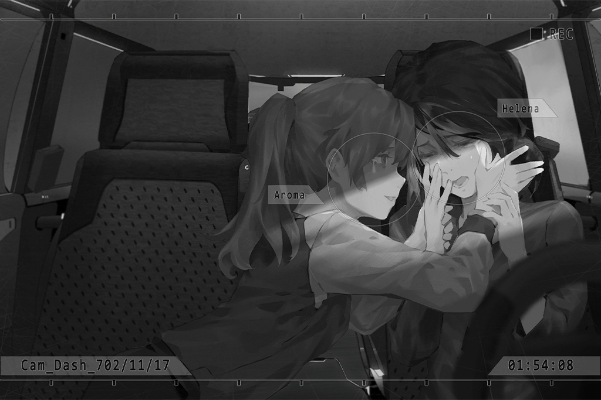

_\[Signal Lost\]_

[*(Click here to go back to the top)*](#toc)

## <a id="pos052"/>\[#052\] Audio\_Cafe\_702\_11\_17
### Requirements
|Character|Level|
|---------|:---:|
|**PAFF** | 70  |

### Log Content
*\[Parks car\]*

**Helena** 
... We're here.

**PAFF** 
Sister, are you alright?

**Helena** 
Yes. I'm fine now. Sorry...

**PAFF** 
It's okay. We cried together. Nothing to apologize for.

**Helena** 
No, I'm not talking about that... Everything that has happened until now, all of it... I am terribly sorry... to both of you...

**PAFF** 
...... 
Once I solve the mysteries regarding my body, I will definitely come back... If you believe that it was your fault that I lost some things, I'll just have to go and get those things back. That way, there won't be anything you have to feel sorry for, right?

**Helena** 
Aroma...

**PAFF** 
For a long time, my sister has always been the one to comfort me and take care of me whenever I feel down. So this time, I'm going to be the one to make sure that you're not sad.

**Helena** 
Yes... I'm fine. Do you guys have any plans for what to do next? About that other set of memories in you...

**PAFF** 
No... We're only there to stay and hide from the public for a while. NEKO's friend, Mr. Miller, seems to know a lot of things. He may be able to help us.

**Helena** 
Node 03.

**PAFF** 
Eh?

**Helena** 
This is something I heard by chance from Noah and the members of his team. Your current body came from Node 03. You were someone who previously lived in Node 03. 

**Helena** 
You said so yourself too, right? That in the memories you were able to recall, there were a lot of images from Node 03. 

**PAFF** 
Indeed... That's exactly what I thought too.

**Helena** 
You used to be a shy and timid child, but now... you've become strong. I don't know why, but I feel... at ease seeing you like this. 
It's time to go.

**PAFF** 
Sister, why don't you come with us? We can do this together...

**Helena** 
No. Noah may not be able to accept the fact that I took you out without his knowledge. So, I'll stay here and try my best to persuade him. I need to prevent him from doing what he did once more.

**PAFF** 
......

**Helena** 
Right now, he's really paranoid. Even though I understand that he has his reasons... I believe that your fate should be decided by you. After all, you're no longer just "one person".

**PAFF** 
Yes...

**Helena** 
Besides, my job as your agent is not over yet. Aroma definitely wants to sing again someday, right? After everything is over, I will make sure that you can still return to the stage and perform! 

**PAFF** 
Yes! Sister... I'm so glad; you're finally acting like the sister I always knew. Hehe\~

*\[Hugs\]*

**PAFF** 
......!

**Helena** 
... You, will always be my little sister.

**PAFF** 
Yes.

_\[»»» Fast Forward»»»\]_

*\[Doorbell\]*

**PAFF** 
Hello...

**NEKO#ΦωΦ** 
...... Aroma\-chan!!!

**PAFF** 
Waah!!

**NEKO#ΦωΦ** 
WAaaaahhhh!! Aroma\-chan, are you alright? Did anyone do anything terrible to you!? You know, umm... that kind of stuff?

**PAFF** 
Ummm, I'm alright... what's "that kind of stuff"...

**NEKO#ΦωΦ** 
Daddy is so stupid! How can he get drugged like that... NEKO was super worried! WAaaahhh!!

**PAFF** 
NEKO... thank you.

**JOE** 
Hehe, it really is the super idol herself! Hello\~ I am the owner of JOEZ Cafe. Joe Miller's the name.

**PAFF** 
Hello. NEKO mentioned you before... Thank you so much for your help, Mr. Miller.

**JOE** 
Haha, no need for that Mister stuff! Just call me JOE. Come, you can get some rest in the basement first. I can swear by Pops' name that this is the safest place available. No one will ever find you here.

**PAFF** 
Understood... We'll be in your care.

**NEKO#ΦωΦ** 
NEKO will go down there with you as soon as I finish this drink!

_\[»»» Fast Forward»»»\]_

*\[Door Opens\]*

**JOE** 
Haven't clean this place in quite a while... Sorry about this. Even I feel kinda bad for letting a super idol stay in such a dusty basement.

**PAFF** 
No, not at all. Thank you, Mr. Mill... JOE.

**JOE** 
Haha, no big deal! You experienced a lot of crap today, haven't you? Get some rest. 
I need to place some orders for the shop first. If you want anything, just press this button. I'll be at your service in no time.

**PAFF** 
Understood.

*\[Door Closes\]*

**PAFF** 
......

**PAFF** 
... This place... it feels a bit familiar for some reason...

**PAFF** 
... Ughh... my head...

_\[Signal Lost\]_

[*(Click here to go back to the top)*](#toc)

## <a id="pos053"/>\[#053\] Cam\_DragonSt\_694\_04\_25\_3
### Requirements
|Character|Level|
|---------|:---:|
|**PAFF** | 71  |

### Log Content
**Hayato** 
Then... I'll take my leave first. I want to go to the shopping strip... Sorry, I can't escort you home.

**Kaori** 
Don't worry about it. Our performance today was a great success! You should be happier!

**Hayato** 
Haha... Can we have dinner together tomorrow? We might want to review our performance... 
Ah, not that their was anything that you did wrong. It's mostly about me.

**Kaori** 
Here you go again\~ If it's tomorrow, you'll have to wait until I get off work. Is that too late?

**Hayato** 
Not at all. I'll wait for you.

**Kaori** 
Gotcha. Bye\-bye!

_\[Signal Switches\]_

*\[Footsteps\]*

**Kaori** 
Good. Time for me to go back as well. Hnnnggg... Dang, this keyboard is heavy.

*\[Footsteps\]*

**Kaori** 
Accidentally sang a few too many songs. It's getting really late... Mom's probably already asleep?

*\[Footsteps\]*

**Kaori** 
......

*\[Hurried Footsteps\]*

**Kaori** 
... No way...

_\[Signal Switches\]_

*\[Hurried Footsteps\]*

**Kaori** 
Ha... Ha... Ha... AH!

*\[Falls down\]*

**Kaori** 
Damnit...

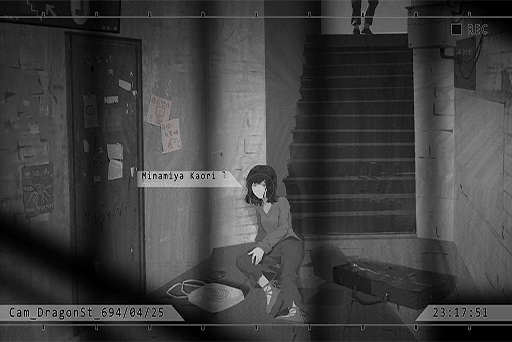

**Hunter** 
......

**Kaori** 
W, who are you? What do you want!?

**Kaori** 
Don't come near me!

*\[Kicks\]*

**Hunter** 
UGH! You little b\*\*\*\*...

*\[Hurried Footsteps\]*

**Kaori** 
_\*Huff\*... \*Puff\*... HELP!_

**Hunter** 
You're not getting away!

*\[Taser\]*

**Kaori** 
AHHHHHHHH!

_\[Signal Lost\]_

[*(Click here to go back to the top)*](#toc)

## <a id="pos054"/>\[#054\] Image\_Base\_702\_11\_17
### Requirements
|Character|Level|
|---------|:---:|
|**PAFF** | 71  |

### Log Content
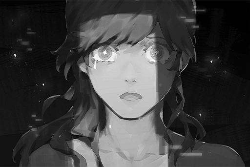

[*(Click here to go back to the top)*](#toc)

## <a id="pos055"/>\[#055\] Audio\_Cafe\_702\_11\_17
### Requirements
|Character|Level|
|---------|:---:|
|**PAFF** | 71  |

### Log Content
*\[Door Opens\]*

**JOE** 
......?

*\[Things crashing\]*

**JOE** 
Woah!? PAFF? Are you alright!? Why did you run upstairs?

**PAFF** 
Hah... hah...

**NEKO#ΦωΦ** 
Aroma\-chan! Your nose is bleeding!

**PAFF** 
......

**NEKO#ΦωΦ** 
Ah! It's the same as last time. Could it be, that you remembered something again?

*\[Things crashing\]*

**JOE** 
Hey! Where are you going? You can barely stand. Take a seat and catch your breath first, okay?

**PAFF** 
... Kaori...

**JOE** 
......!?

**NEKO#ΦωΦ** 
... Who?

**PAFF** 
I don't know...

**NEKO#ΦωΦ** 
......?

**JOE** 
... Kaori...?

*\[Things crashing\]*

**JOE** 
Hey!? You shouldn't be moving around anymore...

**PAFF** 
I remember it now! I have to go find him!

**NEKO#ΦωΦ** 
Find him? Find who!?

**PAFF** 
Hayato!

**JOE** 
......!!

*\[Runs\]*

*\[Doorbell\]*

**NEKO#ΦωΦ** 
Aroma\-chan! Where are you going!? Wait for me!

*\[Runs\]*

*\[Doorbell\]*

**JOE** 
Hey! NEKO!

_\[»»» Fast Forward»»»\]_

**JOE** 
That's... how is that... that can't be right...

_Doorbell_

**JOE** 
NEKO!? How did it go? Where's PAFF?

**NEKO#ΦωΦ** 
She was so fast. NEKO couldn't catch up to her... _\*Huff\*... \*Puff\*_

**JOE** 
Those names she just mentioned, I think I know who they are.

**NEKO#ΦωΦ** 
Eh!? For real?

**JOE** 
Yeah. They clearly don't sound like Node 08 names, which makes it easier for me to remember. Take a look at this business card.

**NEKO#ΦωΦ** 
... Hayato! Who is this exactly? 
Ah! Isn't this the reporter who was chasing after us yesterday!?

**JOE** 
Looks like he is the one... This guy came to my shop once and mentioned that he was looking for a girl. I think Kaori was the exact name of the girl he was looking for.

**NEKO#ΦωΦ** 
Then why did Aroma\-chan...

**JOE** 
No idea. However, she said just now that she's going to go find him. My guess is that she definitely remembered something.

**NEKO#ΦωΦ** 
Is there an address on the business card?

**JOE** 
Only the address of the company...

**NEKO#ΦωΦ** 
NEKO will go there right now!

*\[Doorbell\]*

**JOE** 
Hey!

*\[Phone Rings\]*

**JOE** 
What the hell? Who would call at this time... 
Hello!?

**[???]** 
JOE, it's me.

**JOE** 
Simon!?

_\[Signal Lost\]_

[*(Click here to go back to the top)*](#toc)

## <a id="pos056"/>\[#056\] Multi\_File\_P056
### Requirements
|Character|Level|
|---------|:---:|
|**PAFF** | 72  |

### Log Content
*\[Footsteps\]*

**PAFF** 
... Hayato, what's the matter? You've been awfully quiet for a while now. Where are we going first?

**NEKO#ΦωΦ** 
Are we going back to your home first? If so, we'll visit every single place Aroma\-chan has been to one by one! That way, you'll definitely remember everything!

**Hayato** 
Home... it's no longer there anymore. I'm so sorry...

**PAFF** 
... Oh, yeah? That's alright. I'm sure there are still many places we can go.

**Hayato** 
...... 
PA... Kaori, I'm not sure how many things you've remembered... but there's only one place I really want to take you to first.

**PAFF** 
......?

**Hayato** 
Do you remember... anything about Grandma Feng...?

**PAFF** 
... The first one I remembered in the basement was you. Everything else... just when I was on the verge of remembering them, they were covered by a bunch of unfamiliar imagery. Sorry, I don't know if you can understand me like this. However, Grandma Feng... I can't help but feel like she's someone very important...

**Hayato** 
Forget it. Don't think about it now! Since there's still a while before we get there, I guess I'll tell you about what happened during the time you were gone.

_\[→Audio\_Feng's\_694\_05\_06\]_

**Agent** 
We'll try our best to help you guys search for her. However, I hope you also realize that in Node 03, especially in this downtown area, people missing is a very common thing. You guys aren't civilians with a high offering level, so the Administration Bureau is probably not going to dedicate a lot of resources to this case.

**Feng** 
I understand. I'll leave it to you... _\*Sobs\*_...

**Agent** 
Kaori... is a good girl. My daughter loves to listen to Hayato and her perform at the corner of the street every weekend.

_\[→Audio\_Feng's\_694\_05\_10\]_

**Hayato** 
Grandma! Why!? You don't have to do this!

**Feng** 
I'm really sorry, Hayato. Only by selling this flower shop can we request more resources from the admins to help us...

**Hayato** 
This shop is everything Grandma has worked for! It's a part of our family's memories... On top of that, your medical bills... I'll figure out a way to make more money! Please think about it again, okay!?

_\[→Audio\_Downst\_698\_07\_01\]_

**Hayato** 
Only made this much today... Just as I thought, without Kaori, nobody wants to listen when it's just me...

**Yamada** 
I want to listen!

**Hayato** 
......? Wow! Yamada? Is that you!? Long time no see!

**Yamada** 
Haha, long time no see, old friend! Why did you stop going to the Academy all of a sudden? I was super lonely!

_\[»»» Fast Forward»»»\]_

**Hayato** 
That's pretty much it. Now, the flower shop is no more. Grandma Feng suffered a brain stroke and has been in the hospital for years... I have to work hard to make more money, all the while I've been trying to search for Kaori. I really am exhausted...

**Yamada** 
Kaori, is it...? You hire a dog, let it smell some lavander and tell it to track the scent down, done. It's not that hard, right? She always had this really heavy smell of lavander on her. If you can't find her even with this method, I'd say that it's quite likely that she's already...

**Hayato** 
Yamada!

**Yamada** 
Yikes! Sorry, my bad. That's right, no need to be so pessimistic. To be honest with you, I dropped out of the Academy as well! I've found a great way to make money, which I feel is something you really need.

**Hayato** 
For real!?

_\[→Audio\_???\_697\_12\_25\]_

**Hayato** 
Oyoy!? Are you really going to do this? Isn't this theft!?

**Yamada** 
Eh? You need the money, right? You think those pitiful coins you make from your part\-time jobs and lousy music are going to be enough? This is the fastest way to get money!

**Hayato** 
... Ugh.

**Yamada** 
Ah, sorry. I really like your music. I really do. However, making money is a completely different matter. This is a major business deal, and you better not mess up.  
Boys, time to work!

_\[»»» Fast Forward»»»\]_

**Yamada** 
F\*\*\*! Oh crap oh crap oh crap! Run! Get your a\*\*es moving!

**Thug** 
Hey! That friend of yours... he's still in the truck! They're taking him away!

**Yamada** 
Who gives a f\*\*\* about him!? Run for your damn lives first!

_\[→Audio\_???\_697\_12\_25\]_

*\[Door Opens\]*

**Member D** 
Let's begin unloading the cargo.

**Member I** 
Hey... there's a person inside!

**Hayato** 
Waah! Don't shoot me!

_\[»»» Fast Forward»»»\]_

**Member D** 
Director, we caught the stealing rat. Our losses over these past few months were probably a result of his handiwork.

**???** 
Just one person?

_\[Signal Lost\]_

[*(Click here to go back to the top)*](#toc)

## <a id="pos057"/>\[#057\] Multi\_File\_P057
### Requirements
|Character|Level|
|---------|:---:|
|**PAFF** | 72  |

### Log Content
_\[→Audio\_???\_697\_12\_25\]_

**Phoenix** 
Just one person?

**Hayato** 
Yes. I'm the only one!

**Phoenix** 
... The heck? Isn't this just a brat? Don't call me to the storage room for a brat like this.

**Member D** 
Director! Even though it's just thugs stealing some unimportant cargo, this has been happening every month. They've been taking our cargo one bit at a time. It must be the Hou Sang Tang people who are doing all this!

**Phoenix** 
And why does that matter? I always knew that they've been doing shady tricks like this. Even if they get their dirty paws on our parts, they don't have the technology to present any threat to us.

**Member D** 
... Then... what should we do with this guy?

**Phoenix** 
What do you mean "what should we do"? You guys can do whatever you want with him, be it let him go or "deal" with him. Hey, what's your name?

**Hayato** 
H\-Hayato... Hayato Kusu.

**Phoenix** 
...... 
I think I've seen this name somewhere... Brat, come with me for a bit.

_\[»»» Fast Forward»»»\]_

**Phoenix** 
As I expected. Your guardian, her name is Feng Huang, right?

**Hayato** 
......! Yes... Umm, how did you...

**Phoenix** 
Here, she's on the candidate list for our latest medical project.

**Hayato** 
Medical project...? I thought you guys are part of the underground society. Kyuu Hou Kai and the eight Ravens... I've heard some things about them.

**Phoenix** 
We are indeed part of the underground society. However, Node 03 as a whole is part of the underground society. Who do you think provides the admins with the technology you people use every day? Managing the city is a part of our job as well.

**Hayato** 
......

**Phoenix** 
Your grandma, she suffered a brain stroke, correct? She is in a coma right now. Her situation just so happens to match the conditions of a test subject for our latest technology. Perhaps, there's a way to wake her up.

**Hayato** 
... Seriously!?

**Phoenix** 
But, this is an unstable project that is still in its experimental phase. Both the price and risks are way too high. No one is willing to try, so there's no way for us to continue. 
... What do you think? If you're willing to sign an affidavit that allows her to be our test subject, I will overlook the theft you committed against us.

**Hayato** 
......!

_\[→Audio\_???\_698\_03\_18\]_

**Medical Staff** 
I'm sorry. Your grandma's brain nerves were too badly damaged. The experiment has failed. However, it's not a complete failure either. We've successfully restored all her senses except vision. You can interact with her through this interface. Her thoughts will be presented to you through words and synthetic voices.

**Hayato** 
......!? Please activate it right away!

**Medical Staff** 
I must remind you... the experiment failed. If you activate it now, she will only live for another two minutes... However, even if you just leave her like this, you don't know when she'll pass away too. The decision is yours to make.

**Hayato** 
......! 
... _\*Sobs\*_...

_\[»»» Fast Forward 30 minutes»»»\]_

**Hayato** 
I... I've made my decision... 
Please activate it. However... before that, I would like the nurse to help me with something...

_\[»»» Fast Forward»»»\]_

**[Feng]** 
This is...? Where am I? It's so dark...

**Hayato** 
Grandma! It's me, Hayato! Can you feel it? My hand.

**[Feng]** 
_Hayato..._

**Hayato** 
......

*\[Opens bottle\]*

**[Feng]** 
This... scent... Kaori?... Is it Kaori!? Where are you!?

**Hayato** 
......

**[Kaori]** 
_Grandma!_

**Nurse** 
...... (Holds hand)

**[Feng]** 
_Kaori! Hayato has found you? You're back? I... I can feel it... your hand..._

**Nurse** 
......

**Hayato** 
... Grandma, Kaori has come back.

**[Feng]** 
_I knew it... You're a brave girl. You're still alive... I knew Hayato would definitely find you... Ah... thank you... thank the lord..._

**Hayato** 
Yes. You don't need to worry anymore. You no longer have to cry yourself to sleep every night...

**[Feng]** 
_Good... Thank... goodness..._

**Hayato** 
......

**Medical Staff** 
The time... is up.

**Hayato** 
You can... finally, sleep with a smile. You can sleep with a smile, forever...  WAAAHHHHHH!!!! 

_\[→Cam\_Grave\_702\_11\_23\]_

**Hayato** 
We're here, her grave. 
After all that, I spent all my money just to meet with The Eye of Horus...

**PAFF** 
_\*Sniffs\*... \*Sniffs\*..._

**Hayato** 
... Kaori?

**PAFF** 
_\*Sobs\*_... I... I remember now. Why... Why did I forget... such an important person... Grandma Feng! WAAHHHHH!! _\*Bawls\*_.

**Hayato** 
..... 
So you remember? Thank goodness... You... you're indeed Kaori. Grandma always believed that you were still alive, even until the very end... Grandma, I wasn't lying. See, Kaori is here... I found her.

**NEKO#ΦωΦ** 
_\*Sniffs\*_... NEKO will... leave you two alone for a while. Take your time.

_\[Signal Lost\]_

[*(Click here to go back to the top)*](#toc)

## <a id="pos058"/>\[#058\] ???\_???\_??\_??\_??
### Requirements
|Character|Level|
|---------|:---:|
|**PAFF** | 72  |

### Log Content
**PAFF** 
...... 
......Eh?

**PAFF** 
What is this place... Weren't I at the graveyard with NEKO and Hayato just now? I remember that our bags went missing...

*\[Footsteps\]*

**PAFF** 
What a bizarre red light. What exactly is this place... 
......?

**PAFF** 
This is... our bags? Also Hayato and me!? Am I dreaming...? 
NEKO is looking at someone else's grave on the side... Is this what happened just now?

**PAFF** 
... Ugh! My head...

*\[Signal Lost\]*

**PAFF** 
They're gone... What is going on?

**???** 
... You need to focus more.

**PAFF** 
!? Who is it? Who's talking to me?

**???** 
So you can respond to me now? This is not the first time I met you here.

*\[Footsteps\]*

**???** 
Stay focused. Think about the things you want to see.

**PAFF** 
......

**PAFF** 
I... I should be over there just now. Our bags went missing, then all of a sudden... I was here...

**???** 
So you did it unconsciously...?

**PAFF** 
... What?

**???** 
Now, you need to do as I say. Maybe I can help you recover the items you lost. 
First, focus your mind and think about your bags.

**PAFF** 
Umm... okay. I'll give it a try...

**???** 
......

**PAFF** 
Wow! So many images are appearing... There are also sounds... ugh...

**???** 
......! ... This amount... 
... No need to panic. These are all the digital records that match the conditions you just thought of. You may not be able to understand this, but as long as you stay focused on the images you want to see, they'll be automatically filtered.

**PAFF** 
...! I saw it! Turns out they were taken by a homeless person in the neighboring park...This is such an odd feeling. It's as if I've become...

**???** 
An electronic signal.

**PAFF** 
... Who are you? How did you know about all this? Also, what is this place? How did I come in here?

**???** 
... Too many questions.

**PAFF** 
Ah... sorry.

**???** 
Come find me at this location. I will answer your questions.  
"The Eye of Horus", that is the name of this ability.

**PAFF** 
Wait... I can't hear... clearly...

**???** 
You've already seen the address. You should be able to recall it.

**PAFF** 
Wha... That's... 
......

_\[Signal Lost\]_

[*(Click here to go back to the top)*](#toc)

## <a id="pos059"/>\[#059\] Cam\_Ward\_702\_12\_14
### Requirements
|   Character    |Level|
|----------------|:---:|
|**PAFF**        | 73  |
|**Crystal PuNK**| 23  |

### Log Content
**[Nora]** 
_The alarm has been disabled. Everyone, please return to your rooms. This place is not designed to house so many people. The chips we have will interrupt the system's operations._

**NEKO#ΦωΦ** 
Eh\~ NEKO wants to stay here with Sis Cherry though... 
Can't help it then; let's go to PAFF's room to play some games!

**Hayato** 
Why are you so carefree about this whole thing...?

**[Nora]** 
_...... 
Alright. Everyone, leave the room so the treatment process can continue._

_\[→Signal Switches\]_

**NEKO#ΦωΦ** 
Whew\~ It's finally over... That was so scary.

**Hayato** 
You sure do recover fast... No one would ever suspect that you were bawling like a child just a few minutes ago.

**NEKO#ΦωΦ** 
I... I did not! I was just a tiny\~ bit scared, like what every normal person would be in those circumstances.

**Hayato** 
And that "WAAAAHHHHH!" was... quite glorious.

**PAFF** 
Hayato! That's too mean.

**Hayato** 
Okay, okay; sorry about that...

**NEKO#ΦωΦ** 
Yeah, apologize! You stinkin Intern Paparazzi guy!

**Hayato** 
Please stop calling me that. I was only doing that job to investigate any information about Kaori. You really think I like doing that stuff...

**NEKO#ΦωΦ** 
No wonder you suck so bad at it and got busted by Xenon almost instantly.

**PAFF** 
Hey, hey, stop arguing. You two need to get along with each other!

**Hayato** 
Okay...

**NEKO#ΦωΦ** 
Kay...

**PAFF** 
What's the matter? Why are you two behaving all of a sudden...

**NEKO#ΦωΦ** 
Hehe, well, because we're both here for the sake of Aroma\-chan, right?

**Hayato** 
Yeah, that's right.

**NEKO#ΦωΦ** 
Though Hayato didn't actually do anything. Pffft.

**Hayato** 
You... you don't get to talk when you're the same!

**NEKO#ΦωΦ** 
Who said that! NEKO provided Aroma\-chan with both food and shelter when she was wandering around on the streets!

**PAFF** 
Sigh... Not even three seconds have past and here we go again...

*\[Lights Off\]*

**NEKO#ΦωΦ** 
Eek! What now? Is it bedtime already?

**Hayato** 
What? The lights don't turn off even if it's time to sleep, right? Did the power go out?

**PAFF** 
I'll go outside to take a look. 
Eh? Can't open the door either...

**NEKO#ΦωΦ** 
Whaaa... Are we being attacked again!? No...

*\[Kicks Door\]*

**Hayato** 
Yikes, this door sure is sturdy... Ouch!

**PAFF** 
... Will Miss Cherry and the others be alright?

**Hayato** 
......Ah! The life support system!

**NEKO#ΦωΦ** 
......! 
NEKO also heard what Nora\-chan told Xenon! Without power, things will get really dangerous, right!?

**PAFF** 
I... I want to use my ability to check the situation outside.

**Hayato** 
You sure about that?

**PAFF** 
Yes! I'm already very skilled with the training Nora assigned me these past few days. If it's a distance this close...

**PAFF** 
...... 
......!!

**Hayato** 
What's the matter? What did you see?

**PAFF** 
Nothing... I can't see anything. How come? Does this mean that the entire Kyuu Hou Kai has lost power...?

**NEKO#ΦωΦ** 
Sis Cherry is in danger!

**Hayato** 
Damnit! We have to go out as soon as possible! 
Come on! Open yourself, you big stupid door!

*\[Kicks Door\]*

**PAFF** 
Hayato, wait! 
I think... I saw something else...

**PAFF** 
.. The door... still has power. Maybe it's the backup power source... but the security system has gone offline...

**Hayato** 
......?

**NEKO#ΦωΦ** 
What are you talking about...?

**PAFF** 
...... 
...... Hmph!!

*\[Door Opens\]*

**NEKO#ΦωΦ** 
......!?

**Hayato** 
Did you do this? How did you...?

**PAFF** 
... I... I don't know either. 
All I know is that we have to get there as fast as we can!

_\[Signal Lost\]_

[*(Click here to go back to the top)*](#toc)

## <a id="pos060"/>\[#060\] Audio\_Ward\_702\_12\_15
### Requirements
|Character|Level|
|---------|:---:|
|**PAFF** | 74  |

### Log Content
*\[Door Opens\]*

**PAFF** 
NEKO? Where are you going!?

**NEKO#ΦωΦ** 
... Home...

**Hayato** 
Hey! NEKO!

**[Nora]** 
_Let her go. Daigo, make sure someone's escorting her. At least make sure she arrives home safely._

**[Nora]** 
_Just as Miss Asakura said, this place can't be considered safe anymore. I underestimated the enemy's ability and put my guests through this kind of risk... I'm no longer qualified to make a promise for your safety. From now on, you don't have to stay here anymore. _

**PAFF** 
Then Xenon...

**[Nora]** 
_I'll use my ability to figure out where he is. I really hope he won't do anything stupid..._

**PAFF** 
Let me do it!

**[Nora]** 
_I already said; I'll figure out a way to continue the investigation. You guys are no longer required to run the risk of staying here._

**PAFF** 
Yes, we are.

**[Nora]** 
_Miss PAFF, I understand your feelings, but..._

**PAFF** 
Nora, you're... not by yourself anymore. We're all here, okay?

**Hayato** 
You see those eyes? Once she shows this expression, there's no way you're going to persuade her to give up. 
Nora, even though I may not be of much help, we're all willing to stay here to continue to search for the truth.

**Nora** 
......

**PAFF** 
Xenon... the stupid things you just mentioned... Could he be...

**Member D** 
I'm afraid that he's on his way to track down Diego's whereabouts. With the state he is in right now, we can't expect him to make a sensible decision.

**[Nora]** 
_We have to locate him as soon as possible. The incident this time, I'm afraid it isn't as simple as he thinks._

**PAFF** 
I... I think I can use the surveillance cameras in the city to find his location.

**[Nora]** 
_You want to give it a shot? Judging by the time he left, the area he can cover has, at minimum, thousands of surveillance cameras in it. _

**PAFF** 
Yes! I'll try my best.

_\[»»» Fast Forward»»»\]_

**PAFF** 
...... 
Hmm... eh? That's strange...

**Hayato** 
What's the matter?

**PAFF** 
It seems that... I'm kept out of OS again. I can't use my ability...

**Nora** 
......

**Hayato** 
How come? Didn't you just use your ability to open the door?

**[Nora]** 
_......? Open the door...? 
Speaking of which, how were you guys able to get here sooner than I did..._

**PAFF** 
Yes. We were stuck in the room back there. At first, I just wanted to take a look at the situation outside, but all the surveillance cameras in the facility stopped functioning. Just when I was about to give up, I saw that the backup power for the door lock was still functioning... Then the door opened itself.

**[Nora]** 
_......!! 
I did remind you not to use your ability without informing me first... However, if you indeed accomplish such a feat, then this is a major discovery._

**Hayato** 
Nora, you can't do this?

**[Nora]** 
_The most I can do is read the information in OS. Miss PAFF, on the other hand, is able to manipulate the devices in its internet space. This shows a clear difference between our abilities._

**PAFF** 
......

**[Nora]** 
_Looks like more experiments and tests are necessary to figure out the details, including why you're suddenly unable to use your ability now._

**[Nora]** 
_All in all, both of you should be exhausted. I am very thankful that you're still willing to stay here. Please get some rest. I must now go back to clean up this mess._

*\[Wheelchair moving\]*

*\[Door Opens\]*

**Hayato** 
Nora's expressions... they feel different than what they usually are.

**PAFF** 
It was because she couldn't make the decision to sacrifice ROBO that led to... Although that was in no way her fault, she couldn't help but blame herself...

**Hayato** 
_\*Sniff\*_... Never thought Miss Cherry would be gone just like that...

*\[Ringtone\]*

**Hayato** 
Who would call...? NEKO!?

_\[Signal Lost\]_

[*(Click here to go back to the top)*](#toc)

## <a id="pos061"/>\[#061\] Audio\_KyuuLab\_702\_12\_20\_1
### Requirements
|Character|Level|
|---------|:---:|
|**PAFF** | 75  |

### Log Content
*\[Data Input\]*

**[Nora]** 
_...... As expected, the virus' activity in your body has begun to change. This is all new data that hasn't been recorded._

**PAFF** 
Is that... a good thing or a bad thing?

**[Nora]** 
_I'm unable to make a decision at this time. Your body is currently not showing any abnormalities, but the fact that we were able to observe this many unexpected phenomena is already far beyond my expectations._

**PAFF** 
……

**[Nora]** 
_If you continue to use the ability, it may cause other growths or abnormalities in the virus. By that time, I'm afraid that my experience won't be of much help anymore. You will be on your own._

**PAFF** 
Nora... I've already been here for a long time, yet I still feel like I have no idea what you're talking about. What exactly is this virus...?

**[Nora]** 
_That's normal. Humanity... including people like Phoenix and I, have researched this for decades and are still unable to come up with any results. It's very unlikely that ordinary people can understand it in such a short period of time. Forgive me, I've been burying myself in my research non\-stop and forgot to consider your feelings. I think I can try to explain some basic concepts._

**PAFF** 
No need to apologize! Please.

**[Nora]** 
_Calling what's known as "The Ender" a virus is merely a habit of custom. Actually, this definition is not entirely correct. This misunderstanding was created by the people who first discovered it, which was based on the actions and symptoms that were observed. In reality, The Ender is entirely different from any other organism that is identified as a virus in nature. This was the biggest discovery of Phoenix's research._

**[Nora]** 
_The formation of The Ender consists of unnatural elements. This allowed us to deduce that it is an artificial item. Categorizing it as a type of "nano\-organism" may be more accurate. Its internal structure is much more complicated than what modern science understands. That includes using signals similar to the virtual internet to link to each other and act as their primary mechanism of communication._

**PAFF** 
Virtual internet...

**[Nora]** 
_That's right. We all know that this is something left behind by ancient civilization, I won't dive into too much detail. In conclusion, it's very likely that this is some sort of technology made by humans back then that was based on the virtual internet. However, this technology went out of control._

**PAFF** 
……! 
You're saying that humans of the ancient civilization...

**[Nora]** 
_Were destroyed when this runaway technology came back to bite them._

**PAFF** 
A disaster of this scale... weren't there any survivors?

**[Nora]** 
_I believe there are. People who weren't completely crippled—— there may even be people like us who were immune to the virus, were pretty much guaranteed to exist based on the size of the population at that time. However, that all occurred hundreds of years ago. It's almost impossible to confirm this. Nothing reliable there. Regarding this disaster and the subsequent terrifying situation humans were left in, I'm afraid only our ancestors would know._

**PAFF** 
... So, even to this day, it's difficult to find someone who's immune?

**[Nora]** 
_After Phoenix found me, he carried out countless research on my genes. He even researched my biological parents' genetic material, but came up with nothing. As I said, in terms of their definitions, The Ender and ordinary viruses are completely different._

**[Nora]** 
_The Ender... although it's hard to believe, I think that it has something resembling self\-consciousness, that it uses to "filter" their hosts. Yet their conditions, action patterns... and even their motives cannot be known due to a sheer lack of samples._

**PAFF** 
There's no way to understand it from a scientific perspective...?

**[Nora]** 
_Though I don't want to admit it... yes. With the current level of scientific expertise and the knowledge we have, we still can't understand it. It's just like the existence of the OS space. All I can say is that no matter how much we believe science and technology have progressed, it's nothing near what humans had during the days of the ancient civilization._

**[Operating System]** 
_Data analysis complete_

**[Nora]** 
_The results are in. Look, as soon as it enters the brain, it's unable to be observed physically. All we can do is use these unique internal brain signals to determine The Ender's actions._

**[Nora]** 
_Looks like they're active again. What do you think? Should we try?_

**PAFF** 
Of course! First, let's find where Xenon's gone to.

**[Nora]** 
_Well then, please begin._

**PAFF** 
…… 
Success! I've connected to the surveillance devices in the city. The signal is very clear... eh? That's strange?

**[Nora]** 
_What is it?_

**PAFF** 
So many devices, they're all broken...? I can't get any visuals. It's like I'm being disrupted by something. It's just a few. The rest is fine.

**[Nora]** 
_…… 
Please give me the model number and location of those that have issues._

**PAFF** 
Got it!

_\[»»»Fast Forward»»»\]_

**[Nora]** 
_I see..._

**PAFF** 
Did you find anything?

**[Nora]** 
_I mapped those devices out... looks like they've malfunctioned in order, under particular conditions... some kind of moving entity——or person._

**PAFF** 
......!

**[Nora]** 
_These devices' program has been altered. They've been attacked via their facial recognition functions. The only one who can do this... I would guess it's Mr. Jackson. He's giving away precisely what he hopes to hide. So long as we can organize the time and position of these malfunctioned devices, we'll be able to locate him. 
... I just hope we're not too late._

**PAFF** 
Let's contact NEKO right away! She's in the city. We can tell her to check these places out.

**[Nora]** 
_Let's do that._

_\[Signal Lost\]_

[*(Click here to go back to the top)*](#toc)

## <a id="pos062"/>\[#062\] Audio\_KyuuLab\_702\_12\_20\_2
### Requirements
|Character|Level|
|---------|:---:|
|**PAFF** | 75  |

### Log Content
**Member D** 
Chief!

**[Nora]** 
_Daigo, we're not done yet. Please wait..._

**Member D** 
Sorry, Chief. But... please take a look!

**PAFF** 
......?

_\[»»»Fast Forward»»»\]_

**[Nora]** 
_... Are we too late?_

**PAFF** 
What happened?

**[Nora]** 
_Diego and his henchmen in 03, they're... dead, all of them. The news just came in._

**PAFF** 
......! 
Was it Xenon...?

**Member D** 
That guy!? All by himself?

**[Nora]** 
_No, it is very possible. Judging from our current information, the conditions are similar to those of the drone attack on the Kyubo Medical Center. With his abilities, be it blocking the alarm system, hacking into the drones, or destroying Baro's line of defense wouldn't be that difficult of a task._

**[Nora]** 
_In any case, he's in a dangerous situation right now. Diego still has a lot of men in 03. Mogura's men may even use the Administration Bureau's resources to chase him down. Even though I don't think they could get to him before we do... Miss PAFF, please contact Miss Asakura as soon as possible. 
... If he becomes a wanted criminal here as well, it's going to be a big problem._

**PAFF** 
O\-Okay!

_\[»»»Fast Forward»»»\]_

**PAFF** 
Yeah... Uh\-huh... Okay, got it. NEKO, please be careful. If something happens you've got to let us know!

**[Nora]** 
_Daigo, send some people to follow Miss Asakura. Make sure nothing happens to them._

**Member D** 
Chief, you don't want me to bring them back? That'd be safer...

**[Nora]** 
_They left of their own accord. After what happened... I don't want to force them to stay here._

**Member D** 
Understood. 
This is Daigo. Security Team A, Team B, if you hear me, respond.

**[Nora]** 
_Such a wide\-range use of the ability in such a short time, is your body feeling any abnormalities?_

**PAFF** 
Um, not for now. I feel pretty good. I'm just worried about them...

**[Nora]** 
_... Miss PAFF, I'm afraid the things we're going to do next will cause even more bystanders——including yourself, to fall into unpredictable situations._

**PAFF** 
……

**[Nora]** 
_We're still in the hypothetical stage of determining what the true identity of the enemy is and what their motives are. With this little information, we're unable to guarantee anyone's safety._

**PAFF** 
The enemy's true identity...

**[Nora]** 
_I'm afraid it's the one who attacked you in the OS space. It went as far as to destroy the sample of the virus vaccine that we're not even sure was effective. It must be the case where the virus is an important component of this entity's plan. If this brings about a disaster like that which occurred in ancient civilization, we must do everything in our power to stop it._

**PAFF** 
……

**[Nora]** 
_You've got to think long and hard about this. If you want out, I won't force you to stay... What I mean is that I don't want anything bad to happen to you because of us. I also don't want you to think that you have some sort of duty to do this because of who you are._

**PAFF** 
No... I don't feel like this is my duty.

**[Nora]** 
_Good, if you still trust the safety of these facilities, you can stay here with Hayato until..._

**PAFF** 
No, no. What I mean is, I don't feel like doing this is my duty or responsibility, it's what I want to do. It's what I must do.

**Nora** 
……

**PAFF** 
If this stems from Node 08 ——the place where my sister lives, she may be in danger. There are people I care about as well, and I don't want anything terrible to happen to them because of my decisions.

**[Nora]** 
_Are you sure?_

**PAFF** 
Nora, I... have two sets of memories. Whether they are Aroma's or Kaori's, both of them are clear and as real as they can be. Some things may not have gone as we would have liked in those memories of "ours", but we experienced a lot of wonderful things as well.

**PAFF** 
No matter which city those memories came from, they both make me feel that this world is such a wonderful place, full of hope. The people we love, the people who love us, the power that comes from that... I believe that is an important element in the formation of this world.

**Nora** 
……

**PAFF** 
I don't want any sort of hatred to take that away from this world. I believe that expresses how we both feel about this.

**[Nora]** 
_... Is that so?_

**PAFF** 
So please let me continue to help, and I'll do everything I can until the very end!

**[Nora]** 
_…… 
Understood. We'll need some time to prepare everything. We'll need to confirm the identity of the enemy, their goal, and how we can fight against them before taking action. If we need your help during this time, we would appreciate it._

**PAFF** 
Okay!

**[Nora]** 
_Miss PAFF..._

**PAFF** 
Yes?

**[Nora]** 
_... Nothing, it's nothing. You... you really are an amazing person. 
... Thank you._

_\[Signal Lost\]_

[*(Click here to go back to the top)*](#toc)

