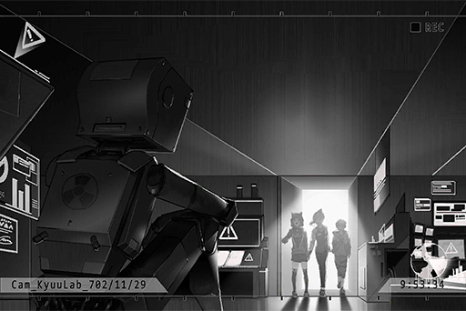

# Cam_Nora_702_11_29
## Requirements
|  Character  |Level|
|-------------|:---:|
|**ROBO_Head**| 65  |

## Log Content

*\[ROBO_Head Start-Up\]*

**[ROBO_Head]** 
*This unit, start\-up, success. Running self\-diagnostics... complete. 
Duration of this shutdown: 9 hours 27 minutes. Battery charge complete.*

**[ROBO_Head]** 
*...... Nora...... Not here.*

**[ROBO_Head]** 
*......*

*\[ROBO_Head emotion\]*

**Kyuu Hou Kai Member** 
Chief is willing to see you two. She'll be here soon... Hey, stop poking around. Do you have any idea how much a pair of eyeballs are worth on the black market?

**???** 
Umm, N\-no...

**???** 
Come on, don't get scared so easily. Let's wait here first.

**[ROBO_Head]** 
*......?*

**[ROBO_Head]** 
*Voiceprint detection... complete. 
Decision: 5 Kyuu Hou Kai members, 3 outsiders.*

**Kyuu Hou Kai Member** 
Hey! Not that room!

**???** 
What's the big deal? It's not like the door is locked. Just a quick tiny peak...

**[ROBO_Head]** 
*......!?*

*\[Door Opens\]*

**NEKO#ΦωΦ** 
Eh... EHHHHHHH!? 
R, R, R\-Ropohead!?

**PAFF** 
It really is him! Why is he here...?

**Hayato** 
... Who?

**[ROBO_Head]** 
*... Miss PAFF, MIss NEKO, greetings.*

*[Signal Lost]*
