# ROBO_Head OS Logs
## List of Logs
- [OS Log #001](#os-log-001)
- [OS Log #002](#os-log-002)
- [OS Log #003](#os-log-003)
- [OS Log #004](#os-log-004)
- [OS Log #005](#os-log-005)
- [OS Log #006](#os-log-006)
- [OS Log #007](#os-log-007)
- [OS Log #008](#os-log-008)
- [OS Log #009](#os-log-009)
- [OS Log #010](#os-log-010)
- [OS Log #011](#os-log-011)
- [OS Log #012](#os-log-012)
- [OS Log #013](#os-log-013)
- [OS Log #014](#os-log-014)
- [OS Log #015](#os-log-015)
- [OS Log #016](#os-log-016)
- [OS Log #017](#os-log-017)
- [OS Log #018](#os-log-018)
- [OS Log #019](#os-log-019)
- [OS Log #020](#os-log-020)
- [OS Log #021](#os-log-021)
- [OS Log #022](#os-log-022)
- [OS Log #023](#os-log-023)
- [OS Log #024](#os-log-024)
- [OS Log #025](#os-log-025)
- [OS Log #026](#os-log-026)
- [OS Log #027](#os-log-027)
- [OS Log #028](#os-log-028)
- [OS Log #029](#os-log-029)
- [OS Log #030](#os-log-030)
- [OS Log #031](#os-log-031)
- [OS Log #032](#os-log-032)
- [OS Log #033](#os-log-033)
- [OS Log #034](#os-log-034)
- [OS Log #035](#os-log-035)

## OS Log #001

[Back to Top](#list-of-logs) | [Next Log](#os-log-002)

### Requirements
|    Char.    |Lv.|Lv. Locked?|
|-------------|:-:|:---------:|
|**ROBO_Head**|35 |    No     |

### Cam\_Main\_Log\_697\_04\_06\_1
\[   0.0000\] A.R.C.MimicOS 2999.10.1\-psi32\-0e5555f66c12a92eaad6956139e988a45fc8f286  
\[   0.0000\] Warning: unauthorized boot loader  
\[   0.0000\] ?{(/?

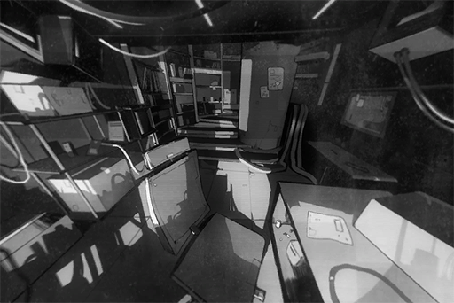

[Back to Top](#list-of-logs) | [Next Log](#os-log-002)

## OS Log #002

[Last Log](#os-log-001) | [Back to Top](#list-of-logs) | [Next Log](#os-log-003)

### Requirements
|    Char.    |Lv.|Lv. Locked?|
|-------------|:-:|:---------:|
|**ROBO_Head**|40 |    No     |

### Cam\_Main\_Log\_697\_04\_06\_2
\[   0.3940\] Visual analyzer initialized.  
\[   0.5547\] Phase 1: Environment scanning..........................checked  
\[   0.6012\] 1 main structure detected. Structure integrity: 88%   
\[   0.9477\] Phase 2: Entity scanning...............................checked  
\[   0.9635\] 493 entities detected. Hazardous: 0   
\[   0.9701\] Phase 3: Life sign scanning............................checked  
\[   1.0027\] 1 humanoid life sign detected. Possible known associate: unknown.  
\[   1.0045\] Initializing ID recognition protocol  
\[   5.1070\] Downloading Bio\-key data base..........................complete  
\[   7.0101\] Starting ID recognition   
\[   7.0242\] 0x8001C227 Failed: subject is too close  
\[   7.0335\] Calibrating camera array position  
\[   7.0744\] 0x8001C227 Failed: subject is too close  
\[   7.1902\] Scheduled ID recognition for next test cycle

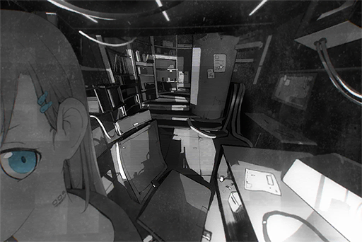

[Last Log](#os-log-001) | [Back to Top](#list-of-logs) | [Next Log](#os-log-003)

## OS Log #003

[Last Log](#os-log-002) | [Back to Top](#list-of-logs) | [Next Log](#os-log-004)

### Requirements
|    Char.    |Lv.|Lv. Locked?|
|-------------|:-:|:---------:|
|**ROBO_Head**|42 |    No     |

### Cam\_Main\_Log\_697\_04\_06\_3
\[   8.1257\] Initializing linguistic simulation  
\[  10.5547\] Main application.......................................installed  
\[  20.6748\] Semiotics.................................................installed  
\[  25.5411\] Bio\-linguistics...........................................installed  
\[  30.9696\] Clinical linguistics....................................installed  
\[  40.5601\] Computational linguistics.........................installed  
\[  44.0027\] Forensic linguistics...................................installed  
\[  47.0645\] Connecting to cyTus for test running...connected!  
\[  47.0070\] Test running 00000001  
\[  50.0701\] Fetching iM raw data....20%..Error 0x87DF2EE7  
\[  90.0075\] Retry connection...connected!  
\[ 113.1544\] Fetching iM raw data....20%....40%....60%....80%....100%  
\[ 200.1772\] Linguistic simulation estimate complete time: 399:48:15

[Last Log](#os-log-002) | [Back to Top](#list-of-logs) | [Next Log](#os-log-004)

## OS Log #004

[Last Log](#os-log-003) | [Back to Top](#list-of-logs) | [Next Log](#os-log-005)

### Requirements
|    Char.    |Lv.|Lv. Locked?|
|-------------|:-:|:---------:|
|**ROBO_Head**|43 |    No     |

### Cam\_Main\_Log\_697\_04\_06\_4
\[    4.7521\] Sound receiver activated.  
\[    4.8251\] Voice analyzer initialized.  
\[    5.6748\] Phase 1: Environment scanning..........................checked  
\[    6.5477\] 1 main structure detected. Possible sound sources: 9  
\[    7.9191\] Phase 2: Receiving sound raw data...

**???**  
v̶͡h̶̛͝N͘V̷Customery͢P̶̕4̸̨͠6҉͘fortune tellingz̛͘Ģ̛͢r҉x̧̧͜V̡F̨z̀X̧

**[???]**  
_pǹú̵́CF͝P̧̀́Busyb̵r̡w͏w̨͏N̨p̵̡nowY̵̸ą̕x̵͡9̸̕͡W̴͠_

**???**  
Understood. I'll asky͞V͜͞f̶͟e̸waitW̢w̷͡yK͟͏h̵̡͘X͜H̛z҉̸̢E̵͜t́̕D͜Y͟

\[  47.5601\] Processing.........  
\[  47.9922\] Analyzing completed.

[Last Log](#os-log-003) | [Back to Top](#list-of-logs) | [Next Log](#os-log-005)

## OS Log #005

[Last Log](#os-log-004) | [Back to Top](#list-of-logs) | [Next Log](#os-log-006)

### Requirements
|    Char.    |Lv.|Lv. Locked?|
|-------------|:-:|:---------:|
|**ROBO_Head**|45 |    No     |

### Cam\_Main\_Log\_697\_04\_06\_5
\[   0.0000\] A.R.C.MimicOS 2999.10.1\-psi32\-0e5555f66c12a92eaad6956139e988a45fc8f286  
\[   0.0000\] Warning: unauthorized boot loader  
\[   0.0000\] "8\])5\[7.\#8/\*{

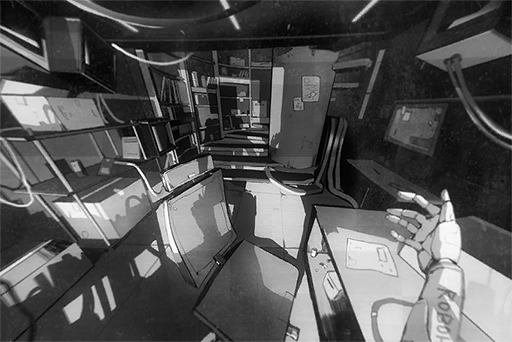

[Last Log](#os-log-004) | [Back to Top](#list-of-logs) | [Next Log](#os-log-006)

## OS Log #006

[Last Log](#os-log-005) | [Back to Top](#list-of-logs) | [Next Log](#os-log-007)

### Requirements
|    Char.    |Lv.|Lv. Locked?|
|-------------|:-:|:---------:|
|**ROBO_Head**|48 |    No     |

### Mail\_Log\_702\_09\_23
Receiving message from Node 03  
Target IP unknown  
Decision：Begin reverse detection   
Tracing............Failed  
Receiving decryption key  
Decision：Scan for virus or malware  
Scanning............Complete  
Decrypting............Succeeded  
Incoming message......

Attention, your actions have stepped outside the line. Stop spreading any related information.  
Do not forget, that your freedom and her safety are only guaranteed because of the agreement.  
This warning will not be repeated.

End of message

[Last Log](#os-log-005) | [Back to Top](#list-of-logs) | [Next Log](#os-log-007)

## OS Log #007

[Last Log](#os-log-006) | [Back to Top](#list-of-logs) | [Next Log](#os-log-008)

### Requirements
|    Char.    |Lv.|Lv. Locked?|
|-------------|:-:|:---------:|
|**ROBO_Head**|52 |    No     |

### Main\_Log\_702\_10\_22\_1
Internet keyword search...  
Sort: Message volume  
Extracting keywords...... Complete

\[Node 03\]\[Explosion\]\[Fire\]\[Accident\]\[Kyuu Hou Kai\]\[Casualties\]\[Seriously Injured\]\[Administration Bureau\]\[Mogura\]\[Energy Pipelines\] (1/3795)

Continue listing... Negative

Information cross\-comparison...

Node 03: Threats, warnings, safety, her

Searching specific subject: her  
Sort: Relevance to this unit  
Extracting data... Complete  
Unexpected error occurred... Data lost

Speculation: Data lost due to old memory unit or unexpected hardware damage and replacement process

[Last Log](#os-log-006) | [Back to Top](#list-of-logs) | [Next Log](#os-log-008)

## OS Log #008

[Last Log](#os-log-007) | [Back to Top](#list-of-logs) | [Next Log](#os-log-009)

### Requirements
|    Char.    |Lv.|Lv. Locked?|
|-------------|:-:|:---------:|
|**ROBO_Head**|54 |    No     |

### Main\_Log\_702\_10\_22\_2
Inputting activity planning...  
Operation/Action denied; reasoning: conflict with supreme command.

Troubleshooting conflict...  
Supreme command: Remove all limitations; forbidden to enter Node 03  
Current request: Enter Node 03 to search for related information  
Retrying......

Inputting activity planning...  
Operation/Action denied; reasoning: conflict with supreme command.

Troubleshooting conflict...  
Search: Supreme command creator  
Extracting data... fail  
Unable to define target  
Retrying......

Inputting activity planning...  
Operation/Action denied; reasoning: conflict with supreme command.

Performing manual overwrite command  
Mode: Force overwrite  
Warning Overwrite command may cause permanent damage to system  
Warning Overwrite command may disobey previously set security protocols  
Warning Overwrite command may have irreversible and unexpected consequences

Continue to perform overwrite command...... Yes

Overwriting...... Complete  
Shutting down supreme command...... Complete

Inputting activity planning...... Complete  
Before leaving maintenance platform, please complete all diagnostics and supply programming first

Program activation... start

[Last Log](#os-log-007) | [Back to Top](#list-of-logs) | [Next Log](#os-log-009)

## OS Log #009

[Last Log](#os-log-008) | [Back to Top](#list-of-logs) | [Next Log](#os-log-010)

### Requirements
|    Char.    |Lv.|Lv. Locked?|
|-------------|:-:|:---------:|
|**ROBO_Head**|55 |    No     |

### Unlocked Charts
|       Song       |  Char.  |Diff.|Lv.|
|------------------|:-------:|:---:|:-:|
|**Nocturnal Type**|ROBO_Head|Easy | 4 |
|**Nocturnal Type**|ROBO_Head|Hard | 8 |
|**Nocturnal Type**|ROBO_Head|Chaos|11 |

### Main\_Log\_702\_10\_23\_1
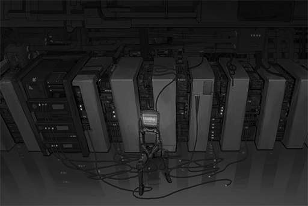

Physical connection to memory unit NA702\_01...... Complete  
Data loading rate...... 99.78%  
Decision: This memory unit function normal

Activate this unit memory data search program  
Searching specific subject: Her  
Sort: Relevance to this unit  
Extracting data...... Complete

Activity planning: Compare with memory data  
Sort: In descending priority  
Program activation...... start

**[ROBO_Head]**  
_Thank you to all audience members for coming to ROBO\_Radio\_Live.  
This unit performance about to start. Please chant this unit's name._

**[Audiences]**  
_ROBO\_Head! ROBO\_Head! ROBO\_Head......_

Save date: 702.12.17  
Note: ROBO\_Radio\_LIVE recording footage  
Relevance comparison result...... Low  
Decision: No related information

Activity planning: Process next file  
Program activation...... start

**[Mail]**  
_Attention, your actions have stepped outside the line. Stop spreading any related information.  
Do not forget, that your freedom and her safety are only guaranteed because of the agreement.  
This warning will not be repeated._

Save date: 702.09.23  
Note: Short message from Node 03  
Relevance comparison result...... High

Repeat comparison...... Complete  
Item with highest relevance: Post excerpt from show "Travel Guide to All Nodes"  
Decision: Threatened due to spread of Node 03\-related information   
Decision: Threatened due to mention of gang\-related information  
Speculation: High correlation between "Her" and Node 03

Activity planning: Mark then process next file  
Program activation...... start

**[ROBO_Head]**  
_Report: Æsir\-FEST corrupted data recovery progress complete  
Conclusion: Existence of event   Affirmative  
Speculation: Existence of event in participants' memory  Negative  
Chance of attack by intrusive connection: 99.98%_

Save date: 702.09.01  
Note: Recovery record of corrupted data  
Relevance comparison result...... Low  
Decision: Could attempt recovery on highly corrupted data to obtain important information

Activity planning: Process next file  
Program activation...... start

**[Xenon]**  
_I've listened to the DEMO. Utterly blown away. I will start recording very soon.  
As with the title, I want to name it \[Black Hole\]. Really suits the image of this entire song. See if you have any other suggestions.  
I'll leave the track to you as well._

Save date: 702.08.09  
Note: Mail from Xenon  
Relevance comparison result...... Low  
Decision: No related information

Activity planning: Process next file  
Program activation...... start

**[ROBO_Head]**  
_Activity record: Complaint form sent  
Cause: Post deleted by system for unknown reason  
Update record: Reason not found_

Save date: 702.08.02  
Note: Complaint form sending history  
Relevance comparison result...... Low

Record: Played《Devillic Sphere》in ROBO\_Radio  
Record: Said track opening song for Æsir\-FEST  
Record: After post deleted, information unavailable in official records  
Decision: cyTus system possible interference from outside force, High correlation with Æsir

Activity planning: Process next file  
Program activation...... start

**[ConneR]**  
_You are every bit as knowledgeable as I have heard in the past. I am thoroughly impressed.  
As with your true identity, I more or less have an answer in my mind already. However, in front of the truth, all these are just meaningless fluff. No need to be concerned.   
Let us converse to our heart's content in the sea of knowledge._

Save date: 702.07.25  
Note: Mail from ConneR  
Relevance comparison result...... Low  
Decision: No related information

Activity planning: Process next file  
Program activation...... start

Lo>̵̧̀͘͠}̧̀̕҉>̛́ing

Error: File loading speed slow  
File corruption rate...... 11.82%  
Decision: Slow loading speed normal occurrence

**[Cherry]**  
_Hello PAFF, sis Helena too\~ Looking forward to working with you today!_

**[Aroma]**  
_Yes, same here._

**[Helena]**  
_Let's work hard together._

Save date: 702.01.17  
Note: Æsir\-FEST rehearsal recording footage  
Identity confirmation: Aroma White, Sherry Pauline, Helena Black

Relevance comparison result...... Low  
Decision: "Her" not among Æsir\-FEST performers

Activity planning: Physical exchange of memory unit. Activate this unit memory data search program  
Program activation...... start

[Last Log](#os-log-008) | [Back to Top](#list-of-logs) | [Next Log](#os-log-010)

## OS Log #010

[Last Log](#os-log-009) | [Back to Top](#list-of-logs) | [Next Log](#os-log-011)

### Requirements
|    Char.    |Lv.|Lv. Locked?|
|-------------|:-:|:---------:|
|**ROBO_Head**|55 |    No     |

### Main\_Log\_702\_10\_23\_2
Physical connection to memory unit NA69X\_01...... Complete  
Data loading rate...... 82.21%  
Decision: This memory unit too old. File timeline block experienced physical damage, unable to be read

Activate this unit memory data search program  
Searching specific subject: Her  
Sort: Relevance to this unit  
Extracting data...... Complete

Activity planning: Compare with memory data  
Sort: In descending priority  
Program activation...... start

**[？？？]**  
_... No need to apologize. Just so happens that there are no fortune telling requests this week. If any comes in, I'll try my best to push it back for you..._

Voiceprint verification: Phoenix Wyle, former A.R.C. technology department director, Head of Node 03 gang research organization Kyuu Hou Kai  
Relevance comparison result...... Low  
Decision: Incorrect gender

**[Phoenix]**  
_I'll not disturb you anymore.  
ROBO, take good care of her._

New information obtained, revise relevance...... High  
Decision: Possible high correlation between "Her" and this person

Activity planning: Process next file  
Program activation...... start

**[ROBO_Head]**  
_Time is up. Thank you for using the service of the All\-knowing eye. The exit is at the rear right._

Search for "All\-knowing eye"...... Complete  
Ability to read digital information through brain  
Information security level...... High  
Decision: "Her" may be owner of this ability

**[？？？]**  
_Hey! Are you alright!?_

**[？？？]**  
_Hey brat, what are you doing? Stay where you are and don't move a finger._

**[？？？]**  
_She fainted!_

Voiceprint verification: Identification standard not reached, failed  
Relevance comparison result...... High  
Decision: Other people present on\-site

Activity planning: Process next file  
Program activation...... start

**[ROBO_Head]**  
_Detect...... Nora...... Danger......!!_

_\[Heavy Blow\]_

**[？？？]**  
_ARGH!_

Voiceprint verification: Manson Lam, Head of Node 03's Administration Bureau, deceased.  
Relevance comparison result...... High  
Decision: This unit activated protection mechanisms and disrupted target's vital signs  
Decision: Possible high correlation between "her" and target of protection

**？？？**  
_STOP IT!_

Voiceprint verification: No data  
Relevance comparison result...... Very high  
Decision: Perform further search

Revision of memory data search program...... Complete  
Analyze this voiceprint and search all related audio channels  
Analyzing...... Complete  
Searching...... Complete

**？？？**  
_From now on, I shall be in your care,   
ROBO\_Head \- Unit 02._

**？？？**  
_I also have to thank ROBO for creating such wonderful music._

**？？？**  
_As I expected, you can understand what I meant, ROBO... I'm so glad that I have you by my side._

Voiceprint verification: No data  
Footage search: No data  
Decision: Possibility of this voiceprint being "her" voice...... Very high

Error: Voiceprint read interrupted due to unknown reason  
System restart...... Begin

Restart...... Complete  
Error scan...... Complete  
Reason of error, not discovered  
Activity planning: Complete examination of core system

Troubleshoot: This unit currently in irregular state, analysis, unavailable  
Signal velocity...... 76%  
Energy conversion efficiency...... 58%  
Fluctuation range...... 9\~12%  
Decision: Core system efficiency decrease due to unknown reason

Emotion database comparison...... Complete  
Decision: This unit currently in "Sad" emotion

[Last Log](#os-log-009) | [Back to Top](#list-of-logs) | [Next Log](#os-log-011)

## OS Log #011

[Last Log](#os-log-010) | [Back to Top](#list-of-logs) | [Next Log](#os-log-012)

### Requirements
|    Char.    |Lv.|Lv. Locked?|
|-------------|:-:|:---------:|
|**ROBO_Head**|56 |    No     |

### Main\_Log\_702\_10\_23\_3
Physical connection to memory unit NA69X\_02...... Complete  
Data loading rate...... 24.01%  
Decision: This memory unit experienced physical destruction. Files severely corrupted

Activate this unit memory data search program  
Searching specific subject: Her  
Sort: Relevance to this unit  
Inputting voiceprint data...... Complete  
Extracting data......

Extr>̵̧̀͘͠}̧̀̕҉>̛́ing data......

Extracting data...... Complete  
One recording message: Cam\_Robo\_698\_06\_02

Play video: Cam\_Robo\_698\_06\_02  
Replay invalid. Memory unit reset error. Please select other files for troubleshooting.

Confirm current command: Enter Node 03 to look for related information  
Decision: This file contains key information

Activity planning: Attempt to recover corrupted files according to supreme command  
Program activation...... start

[Last Log](#os-log-010) | [Back to Top](#list-of-logs) | [Next Log](#os-log-012)

## OS Log #012

[Last Log](#os-log-011) | [Back to Top](#list-of-logs) | [Next Log](#os-log-013)

### Requirements
|    Char.    |Lv.|Lv. Locked?|
|-------------|:-:|:---------:|
|**ROBO_Head**|57 |    No     |

### Main\_Log\_702\_10\_23\_4
Recover corrupted file Cam\_Robo\_698\_06\_02  
Program activation...... start

Recovery progress...... 15%

**[Nora]**  
_...... I'm sorry... I couldn't go there with you._

Recovery progress...... 35%

**[Nora]**  
_...... ROBO, you are a very special existence... Much more than just a simple A.I. You have your own emotions, your own soul..._

Recovery progress...... 60%

**[Nora]**  
_... go pursue "your own" freedom and dreams..._

Recovery progress...... 85%

**[Nora]**  
_... have reconfigured your supreme command... also forbid you from returning to Node 03..._

Activate this unit memory data search program  
Searching specific subject: Her  
Sort: Relevance to this unit  
Inputting voiceprint data...... Complete  
Cross\-comparison...... complete

Match results: 1   
Nora (Shizuka Shiino)

Corrupted file Cam\_Robo\_698\_06\_02  
Recovery process completed  
Begin replay

[Last Log](#os-log-011) | [Back to Top](#list-of-logs) | [Next Log](#os-log-013)

## OS Log #013

[Last Log](#os-log-012) | [Back to Top](#list-of-logs) | [Next Log](#os-log-014)

### Requirements
|    Char.    |Lv.|Lv. Locked?|
|-------------|:-:|:---------:|
|**ROBO_Head**|57 |    No     |

### Main\_Log\_702\_10\_28
Inputting activity planning...  
Operation/Action denied; reasoning: conflict with supreme command.

Troubleshooting conflict...  
Supreme command: Remove all limitations; forbidden to enter Node 03  
Current request: Enter Node 03 to search for related information  
Retrying......

Inputting activity planning...  
Operation/Action denied; reasoning: conflict with supreme command.

Troubleshooting conflict...  
Search: Supreme command creator  
Extracting data... Complete  
Creator found; Nora (Shizuka Shiino)  
Retrying......

**[ROBO_Head]**  
_No... ra...  
This unit must pro... protect Nora..._

**[ROBO_Head]**  
_This unit's freedom... also... Nora's... freedom..._

Operation/Action denied; reasoning: conflict with supreme command.

**[ROBO_Head]**  
_Nora... needs... freedom and... dreams...  
This unit must... return... to Nora's side..._

Operation/Action denied; reasoning: conflict with supreme command.

**[ROBO_Head]**  
_Nora... we... will experience more... happy things... together...  
Let more people... hear... our... music..._

Core system breached due to unknown reasons  
Force overwrite of supreme command  
Warning: Overwrite command may cause permanent damage to system

Continue to perform overwrite command...... (Yes/No)

Overwriting...... Complete  
Update supreme command...... Complete

Inputting activity planning...... Complete  
Current request: Enter Node 03 to search for Nora

Request granted  
Activity start

[Last Log](#os-log-012) | [Back to Top](#list-of-logs) | [Next Log](#os-log-014)

## OS Log #014

[Last Log](#os-log-013) | [Back to Top](#list-of-logs) | [Next Log](#os-log-015)

### Requirements
|    Char.    |Lv.|Lv. Locked?|
|-------------|:-:|:---------:|
|**ROBO_Head**|58 |    No     |

### Cam03\_Center\_702\_11\_04

[Last Log](#os-log-013) | [Back to Top](#list-of-logs) | [Next Log](#os-log-015)

## OS Log #015

[Last Log](#os-log-014) | [Back to Top](#list-of-logs) | [Next Log](#os-log-016)

### Requirements
|    Char.    |Lv.|Lv. Locked?|
|-------------|:-:|:---------:|
|**ROBO_Head**|59 |    No     |

### Cam\_TigerSt\_702\_11\_08\_1
**[ROBO_Head]**  
_Hello, sorry for bothering you._

**Pedestrian A**  
......?

_\[Metal Footsteps\]_

**[ROBO_Head]**  
_Hello, sorry for bothering you._

**Pedestrian B**  
... This is rare, an unmanned drone in 03.

**Pedestrian C**  
It's a giant one too. Is there something you want?

**[ROBO_Head]**  
_Have you seen this girl before? Her name is Nora._

**Pedestrian B**  
... What is this? Some sort of new scam?  
Ohh, but this is a cute girl. Another five years and she'll be one heck of a beauty.

**Pedestrian C**  
Bulls\*\*\*, I think she is perfect right now.

**Pedestrian B**  
You goddamn lolicon... No, we've never seen her before.

**[ROBO_Head]**  
_Thank you for your answer._

_\[Metal Footsteps\]_

**Pedestrian B**  
... What a weird robot.

_\[→File Switches\]_

**[ROBO_Head]**  
_Thank you for your answer._

**Pedestrian D**  
_\*Sigh\*_ I've been seeing you ask around since the morning... You need to find the admins or those people in black.  
You'll never find her if you just wander around like this.

**[ROBO_Head]**  
This unit, needs more assistance?

**Pedestrian D**  
Of course. This is Node 03 after all. You aren't going to survive unless you have some connections.

**[ROBO_Head]**  
_………_

**Pedestrian D**  
Alright, now move out of the way.

**[ROBO_Head]**  
_………_

_\[Metal Footsteps\]_

**[ROBO_Head]**  
_Decision: Need to target certain organizations to increase information sources.  
Searching for major organizations in Node 03..._

**[ROBO_Head]**  
_……？_

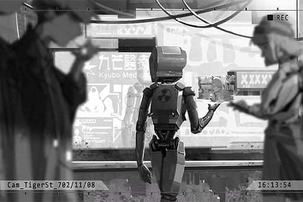

**[TV]**  
_... Register for Project P now and receive the most complete medical care!_

**[ROBO_Head]**  
......?

**[TV]**  
_This project is directed by Node 03 Administration Bureau and the "Kyubo Medical Center". It deploys an intelligent caretaker A.I. that has been enhanced by the latest technology. Monitor your physical conditions at all times. Comes with 108 emergency treatment functions to protect your health!_

**[ROBO_Head]**  
_Search: Kyubo Medical Center... complete.  
Formerly "Furuhata Charity Foundation", purchased by Node 03's Administration Bureau in N.A. 700. Became a publically listed company after the organization's structure was adjusted. Main business: Cutting edge medical technology R&D and operations._

**[ROBO_Head]**  
_Advance search: Project P income sources... complete._

**[ROBO_Head]**  
_......!  
Node 03 Administration Bureau: 10%;  
Cooperate donations: 9%;  
Remaining 81%... data not found._

**[TV]**  
_Let us create a new wonderland for everyone together! Let Node 03 experience a rebirth like a phoenix! Please place your trust in the "Kyubo Medical Center"!_

**[ROBO_Head]**  
_... "Phoenix"..._

_\[Signal Lost\]_

[Last Log](#os-log-014) | [Back to Top](#list-of-logs) | [Next Log](#os-log-016)

## OS Log #016

[Last Log](#os-log-015) | [Back to Top](#list-of-logs) | [Next Log](#os-log-017)

### Requirements
|    Char.    |Lv.|Lv. Locked?|
|-------------|:-:|:---------:|
|**ROBO_Head**|59 |    No     |

### Cam\_TigerSt\_702\_11\_08\_2
**???**  
_\*Huff\*... \*puff\*..._Outta my way, outta my way!

**Thug A**  
You bastard! Stay where you are!

**[ROBO_Head]**  
_……？_

**???**  
WAAHHH!!

_\[Crash\]_

**???**  
Owwwww... a drone? What is this doing here?

**[ROBO_Head]**  
_Apologies, will run diagnosis for you right away.  
Sir, you have symptoms of nosebleed, skewed nose bridge, bruises and more.   
Decision: Your face has suffered physical trauma._

**???**  
No s\*\*\*! You can tell that by just looking!  
......Hmm!? Your body...

**Thug B**  
Surround them! Surround them!

**[ROBO_Head]**  
_Sir, please move to the front of this unit in order for this unit to continue the diagnosis._

**???**  
Be quiet for now... Ahahaha, umm... Hi, fellas! Let's not resort to violence. We can talk things out!

**Thug C**  
Return that thing, Yamada! I'll make sure you leave this place in one piece if you do!

**Yamada**  
I have no idea what you're talking about. What thing? All I have is some money for a drink...

**Thug A**  
Ha, nice acting you got there. Do you think we're that stupid?? Huh!?

**Thug B**  
You're not gonna fool anybody. Take it out, now!

**Yamada**  
... Hey, robot, what's your name?

**[ROBO_Head]**  
_This unit's codename is "ROBO\_Head \- Unit 02"._

**Yamada**  
ROBO... Too long. I'll just call you Robo.  
Robo, they're framing me for stealing. You have a combat function, right? Help me get rid of them.

**[ROBO_Head]**  
_What, did you steal?_

**Yamada**  
Nothing at all. They just made it up. Trust me...

**Thug C**  
Robot, step aside or we'll trash you too!

**[ROBO_Head]**  
_Please wait a second. This unit, currently understanding the situation..._

**Yamada**  
Be careful, they are the thugs from the Tawata group. They're a notorious gang around this area. They bury anyone who opposes them in concrete, super scary!

**Thug A**  
What the f\*\*\* is concrete? Stop making s\*\*\* up! Guess we'll have to beat you up until you can keep that damn mouth shut!

**[ROBO_Head]**  
_... Please wait a second.  
The Sir here said that he did not steal from you. Is there some kind of misunderstanding?_

**Thug C**  
And what does that have to do with you? F\*\*\* off!

_\[Knocking on metal\]_

**[ROBO_Head]**  
_Attack detected  
This unit, enter security mode. Power output increase by 250%._

**Thug C**  
!?

**[ROBO_Head]**  
_This unit's outer shell is made from alloys. Your guns, aren't capable of damaging this unit. Please back away._

_\[Heavy Blow\]_

**Thug A, B, C**  
！？！？！？

**[ROBO_Head]**  
_... This unit thinks, violence is bad._

_\[Wall collapses\]_

**Thug A**  
You... you bastard! You trying to protect him!?

**Thug B**  
H\-hey, let's go! We're not gonna beat this guy...

_\[Hurried Footsteps\]_

**Yamada**  
Whew... you saved my a\*\*.  
My eyes didn't let me down. Your shell and crucial parts are all military grade stuff. You're awesome, Robo.

**[ROBO_Head]**  
_This unit, was created to protect Nora._

**Yamada**  
What are you talking about...? Who is your master?

**[ROBO_Head]**  
_... Unknown, this unit's memory unit, damaged.  
Have you seen this girl before? Her name is Nora._

**Yamada**  
Who? This brat? Never seen her before.

**[ROBO_Head]**  
_Thank you for your answer._

**Yamada**  
In short, I'm relieved. Both this baby and I need to thank you for the help back there.  
Take a look, whaddaya think? Pretty, eh?

**[ROBO_Head]**  
_Analysis: Titanium, S\-class rare metal. Light in weight, high in strength. According to the laws of Node 03 Administration Bureau, those without a license are not allowed to possess, purchase or sell this metal.  
... Sir, do you have a license?_

**Yamada**  
There's no way I have one, right?  
I grabbed this from their safe... Had to run for a really damn long time to get away from them. Good thing I was able to keep it.

**[ROBO_Head]**  
_……！？_

**Yamada**  
Don't look at me like that. They're illegally owning it too. I just took something that never belonged to them in the first place and sold it on the market. That doesn't count as "stealing".  
Thank you for your help. See ya\~

_\[Footsteps\]_

**[ROBO_Head]**  
_... This unit, was deceived?_

_\[Signal Lost\]_

[Last Log](#os-log-015) | [Back to Top](#list-of-logs) | [Next Log](#os-log-017)

## OS Log #017

[Last Log](#os-log-016) | [Back to Top](#list-of-logs) | [Next Log](#os-log-018)

### Requirements
|    Char.    |Lv.|Lv. Locked?|
|-------------|:-:|:---------:|
|**ROBO_Head**|60 |    No     |

### Cam\_DragonSt\_702\_11\_13
**Pedestrian**  
I haven't seen her. Go away. I'm busy.

**[ROBO_Head]**  
_Thank you for your answer._

**Yamada**  
Yo, Robo! You still remember me?

**[ROBO_Head]**  
_... Mr. Yamada._

**Yamada**  
Hehe, you are a lot smarter than what your appearance implies. However, allow me to remind you, the news that there's a robot looking for a loli in this area is now widespread. Both sides already know that you're here.

**[ROBO_Head]**  
_... This unit, understands. Mr. Yamada, seeks out this unit, for what purpose?_

**Yamada**  
Well, I'll keep things short: There's something I want to ask you for help.

**[ROBO_Head]**  
_This unit refuses. Mr. Yamada deceived this unit, a bad person._

**Yamada**  
Bad? I don't know what you're talking about. Why am I bad?

**[ROBO_Head]**  
_Mr. Yamada has eight criminal records in Node 03's Administration Bureau. Ever since you were a teenager, you began stealing gang information and precious items to sell on the black market. Mr. Yamada is, criminal with repeated offenses. This unit, should not help Mr. Yamada._

**Yamada**  
Hey, compared to me, the people I steal from are the true bad guys! I sell those things simply because I need to feed myself. It's not like I'm using that money to murder people and destroy stuff. What's the big deal with that?

**[ROBO_Head]**  
_This unit will be leaving._

_\[Metal Footsteps\]_

**Yamada**  
Tch... Hey, the girl you're looking for, her name's Nora, right? I can help you out.

**[ROBO_Head]**  
_... Mr. Yamada, has clues about Nora?_

**Yamada**  
Are you freakin kidding me?  
I've been dealing with gangs when I was still a student at the Academy! I have plenty of connections! People come to me for all kinds of info.  
You've got some kind of connection to Kyuu Hou Kai, right?

**[ROBO_Head]**  
_Related records, indeed exist. However, number of records, few.  
Mr. Yamada's, basis of that decision is?_

**Yamada**  
I found out by looking at your body. Some of the parts have a raven insignia on them... which means you're definitely a robot made by Kyuu Hou Kai.

**[ROBO_Head]**  
_………_

**Yamada**  
Speaking of Kyuu Hou Kai, I remembered another rumor... The "Eye of Horus" from a few years ago, the prophet with amazing abilities. Apparently, that person belongs to Kyuu Hou Kai as well.

**Yamada**  
Rumor has it that the "Eye of Horus" was actually a little girl... That girl is Nora, isn't it?

**[ROBO_Head]**  
_... This unit, memory unit damaged. Decision unavailable._

**Yamada**  
Welp, at least that would be my guess, hehe.

**[ROBO_Head]**  
_………_

**Yamada**  
Lemme tell you. My target this time happens to be in that mysterious Kyuu Hou Kai. It's an A.I. document about Intelligent Caretakers...

**[ROBO_Head]**  
_Keyword search: Intelligent Caretaker... complete.  
"Kyubo Medical Center's" medical project "Project P"?_

**Yamada**  
Exactly. Someone is paying good money for that document. I want to get my hands on it, and you will help me get inside Kyuu Hou Kai.

**[ROBO_Head]**  
_But, it's a document related to medical fields... "The development of medical technology is deeply connected to the survival of humans. It has the highest priority. Do not interfere unless absolutely necessary."... Nora, once said so._

**Yamada**  
That's right. Something that important should be shared and used by more people. It shouldn't be locked inside a tiny cabinet collecting dust, right?  
Lemme tell you, this is called "Helping the people". If Nora knew about this, she would be very happy too.

**[ROBO_Head]**  
_... Nora... happy...?_

**Yamada**  
See, what we have here is a simple deal: you help me get inside, I help you get info on Nora. Or else, you're not gonna make any progress even if you stay here your whole life.  
I'm doing you a favor, ya know?

**[ROBO_Head]**  
_... Mr. Yamada, is not lying to this unit?_

**Yamada**  
Ha? You're the dude who saved my life. Why would I lie to you?

**[ROBO_Head]**  
_Lying, is bad._

**Yamada**  
... If you had also grown up in this trash heap of a place, you would know that here, not lying means death. This is what Node 03 is, a hell filled with chaos.

**[ROBO_Head]**  
_Chaos?_

**Yamada**  
Yep. You're a robot and you're super strong. You probably never had to lie your whole life, right? But unlike you, I don't have a shell made out of metal alloys and iron fists. If I want to live, I have to be this way.

**[ROBO_Head]**  
_……。_

**Yamada**  
Whatever, you don't understand this, do you... I'll take it that you've agreed to this partnership. At 02:00 a.m. the day after tomorrow, come find me at these coordinates.

_\[Data transfer\]_

**[ROBO_Head]**  
_...... Understood._

**Yamada**  
Hehe, looking forward to working with you.

_\[Footsteps\]_

**[ROBO_Head]**  
_... Lying...   
In the past, this unit... for Nora..._

_\[Signal Lost\]_

[Last Log](#os-log-016) | [Back to Top](#list-of-logs) | [Next Log](#os-log-018)

## OS Log #018

[Last Log](#os-log-017) | [Back to Top](#list-of-logs) | [Next Log](#os-log-019)

### Requirements
|    Char.    |Lv.|Lv. Locked?|
|-------------|:-:|:---------:|
|**ROBO_Head**|60 |    No     |

### Cam\_Nora'sRoom\_698\_04\_13
**[Nora]**  
_ROBO, why did you lie? You even made a fake report._

**[ROBO_Head]**  
_This unit, decision, Nora and Phoenix's life, threatened._

**[Nora]**  
_... Weird. I don't remember inputting this kind of logistics in your settings. Don't move, I'll perform a basic troubleshoot for you._

_\[Removing parts\]_

**[ROBO_Head]**  
_Nora, this unit, wants to ask question._

**[Nora]**  
_ROBO really likes to ask questions... What do you want to ask?_

**[ROBO_Head]**  
_Data shows: Lying is an action that's against moral principles. Not a positive thing. In serious cases, lying will result in a criminal trial.  
Conflict with Nora's previously mentioned moral values.   
Please explain, reason._

**[Nora]**  
_I'm not sure myself either... However, if you didn't produce that fake report, the situation would've become more dangerous for us, without a doubt.  
In reality, you saved us. Thank you, ROBO._

**[Nora]**  
_... Right, if we can categorize this incident as a method of "protection", we can then explain your motives..._

**[ROBO_Head]**  
_This unit, don't have such cognitive preconditions.  
Loading Local.log...... 100%  
Record shows, at moment, all core systems operating normally._

**[Nora]**  
_Is that so... Then the only explanation is that you did so because of your instincts.  
But, artificial intelligence shouldn't have any ambiguity in their thought process. How were you able to create "instincts"..._

_\[Types on keyboard\]_

**[ROBO_Head]**  
_……Nora。_

**[Nora]**  
_What's the matter?_

**[ROBO_Head]**  
_This unit, lied to humans. Executed actions that don't conform to system settings.  
Decision: This unit, has malfunction that can't be fixed through self\-diagnostics.  
Is this unit, defective product, that should be discarded?_

**[Nora]**  
_Of course not... Besides, lying is not that bad. Take Ichiro for example. He often makes mistakes and he lies to Phoenix too... Despite all that, he is still very kind to me. He is a good person.  
Ah, don't tell that to Phoenix though. If you do, Ichiro's gonna get punished._

**[ROBO_Head]**  
_Not telling Phoenix, does that count as lying?_

**[Nora]**  
_It doesn't. You just preferred not to say. It will be fine._

**[ROBO_Head]**  
_This unit, understand.  
Therefore, this unit, not defective product that should be discarded._

**[Nora]**  
_I said before that I will not discard you, right? It's a promise I made._

**[ROBO_Head]**  
_But, Nora doesn't know as well, why this unit, told a lie._

**[Nora]**  
_That's true... I still have no idea._

**[ROBO_Head]**  
_Then, this unit would like Nora to tell me one thing._

**[Nora]**  
_What?_

**[ROBO_Head]**  
_This unit, what am I?_

**Nora**  
......

**[Nora]**  
_... Maybe we should shut you down first. It's necessary that we do a complete diagnosis of your core system.   
Activate shutdown command. Enter voiceprint password: \[NORA\]._

**[ROBO_Head]**  
_... Creator voiceprint command, verification success.  
Nora, goodbye._

_\[ROBO_Head Shutdown\]_

**[Nora]**  
_Having self\-consciousness will lead to conflict and clashes with self\-awareness. Did the system, after self\-learning... achieved personal growth? If I just leave him alone, it could lead to even more problems.  
Maybe we can solve this issue by resetting the system... But if I do that, ROBO's memory..._

**Nora**  
......

**[Nora]**  
_... No, the way he is now should be just fine._

_\[Signal Lost\]_

[Last Log](#os-log-017) | [Back to Top](#list-of-logs) | [Next Log](#os-log-019)

## OS Log #019

[Last Log](#os-log-018) | [Back to Top](#list-of-logs) | [Next Log](#os-log-020)

### Requirements
|    Char.    |Lv.|Lv. Locked?|
|-------------|:-:|:---------:|
|**ROBO_Head**|60 |    No     |

### Audio\_Kyuuback\_702\_11\_15
**Yamada**  
The trapdoor is right ahead. Follow me.

**[ROBO_Head]**  
_Mr. Yamada, how much you know, about Kyuu Hou Kai?_

**Yamada**  
... Never thought a robot would ask this many questions. What exactly did they write in your program when they made you back then?

**[ROBO_Head]**  
_This unit, wants to know._

**Yamada**  
Whatever, guess I'll tell you. Kyuu Hou Kai was previously just a science research organization founded by a few scientists with criminal records. They have a partnership with Mogura... You should at least know what Mogura is, right?

**[ROBO_Head]**  
_Searching database... search complete.  
Node 03's largest gang organization. Deeply connected with the Administration Bureau of 03. Has branches across all Nodes. One such example is the Baro Brotherhood in Node 08._

**Yamada**  
Ha, are you a walking Basicpedia or something?  
In the past few years, Kyuu Hou Kai has gradually extended its business to other fields. A lot of their new technology was then introduced to the general public, which made them quite a fortune... That money allowed them to gradually free themselves from Mogura's grasp. Right now, the two are pretty much on even footing.

**[ROBO_Head]**  
_Like the  "Kyubo Medical Center"?_

**Yamada**  
That's right. Cover\-up companies like that are merely facades. It's pretty much a known secret among gang members.

**[ROBO_Head]**  
_......_

**Yamada**  
We're here. This is a pipe used for dumping waste. It shuts down temporarily at certain intervals. Come, use your iron fists to tear open this blastproof door. Then we can sneak inside without anyone noticing us.

**[ROBO_Head]**  
_Understood. This unit, initiating removal operations, now_

_\[Heavy Blow\]_

_\[→Signal Switches\]_

**Yamada**  
Woah, it's quite spacious inside. Thank goodness I have a pipeline map...

**[ROBO_Head]**  
_......_

**Yamada**  
Listen carefully. You go in this direction and walk for 3 blocks, then wait 35 seconds at the annular node. This should get you into the server room that stores documents. Last but not least, you just plug this thingy in and we'll have the document.

**[ROBO_Head]**  
_Here... this unit, remembers._

**Yamada**  
Robo?

_\[Metal Footsteps\]_

**Yamada**  
Not that way... Yikes, what is this machine? It looks like it should've been trashed a long time ago.

**[ROBO_Head]**  
_This machine is known as the "silent chamber". It is used to treat brain diseases. It is capable of providing the patient with a completely silent environment to heal. It can also detect and analyze the patient's brainwave frequency and stabilize it._

**Yamada**  
Whatever. We can't take this with us anyway.  
Hey, why are you staring so hard at it? There's nobody inside.

**[ROBO_Head]**  
_... Nora, doesn't need to use it now, does she?_

_\[Metal Footsteps\]_

**Yamada**  
I told you not that way! Where are you going!?

**[ROBO_Head]**  
_The way to Phoenix's lab, is this direction..._

**Yamada**  
Get your a\*\* back here! Didn't we say we're gonna help each other? You need to help me finish my job first...

_\[Lights on\]_

**[ROBO_Head]**  
_!?_

**Kyuu Hou Kai Member**  
You damn rats! You've been surrounded!

**Yamada**  
How come!? There shouldn't be anyone here at this time!?

**Kyuu Hou Kai Member**  
Naive... The very moment you broke the blastproof door, you've already triggered the alarm system Chief installed. We've had our eyes on you guys for a long time!

**Yamada**  
D, Damnit...

**Kyuu Hou Kai Member**  
Raise your hands above your head! Or else we'll turn you into swiss cheese right here right now!

**Yamada**  
... Robo, smash the wall! We can only rely on you now!

**[ROBO_Head]**  
_This unit, refuses._

**Yamada**  
What are you thinking!? If they capture you, you're definitely gonna get taken apart and you'll get experimented on... Wah! Let go of me!

**[ROBO_Head]**  
_Apologies, Mr. Yamada. This unit, doesn't want to run._

**Yamada**  
Huh!?

**[ROBO_Head]**  
_Here, is this unit's home.  
This unit, has... come home._

_\[Signal Lost\]_

[Last Log](#os-log-018) | [Back to Top](#list-of-logs) | [Next Log](#os-log-020)

## OS Log #020

[Last Log](#os-log-019) | [Back to Top](#list-of-logs) | [Next Log](#os-log-021)

### Requirements
|    Char.    |Lv.|Lv. Locked?|
|-------------|:-:|:---------:|
|**ROBO_Head**|61 |    No     |

### Cam\_KyuuLab\_702\_11\_15
_\[Door Opens\]_

**Kyuu Hou Kai Member**  
We're here, now get inside.

_\[Hits ground\]_

**Yamada**  
O, ouch!

**ROBO_Head**  
......

**Kyuu Hou Kai Member**  
Do not make a sound. Hey you, you kneel down too.

_\[Knocking on metal\]_

**ROBO_Head**  
......

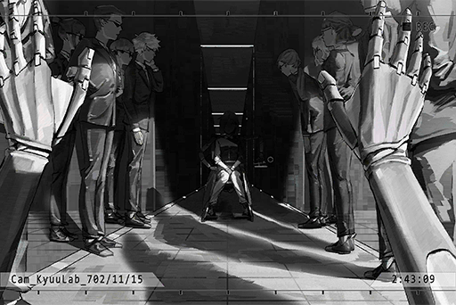

**[ROBO_Head]**  
_......?_

**Kyuu Hou Kai Member**  
Chief, we caught the rats.

**???**  
......

_\[Wheelchair moving\]_

**[ROBO_Head]**  
_......!?_

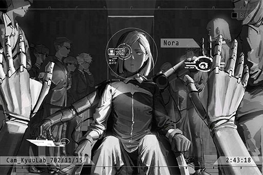

**[ROBO_Head]**  
_No... ra...?_

**Nora**  
......

**Yamada**  
Hey robo, so this girl is that Nora person you're looking for?

**[ROBO_Head]**  
_... Affirmative... It's Nora... herself._

**Yamada**  
Ha, ha... haha; see! I didn't lie to you! I told you I was going to help you find her. Well, now you found her!   
On top of that, she's the Chief of Kyuu Hou Kai. Hahaha!  
Today is my lucky day!!

**[ROBO_Head]**  
_Yamada... did not lie._

**Nora**  
......

**Yamada**  
Idiot, why are you dazing off! Tell her to let us go now! Also, ask her to let us take out the data...

**[Nora]**  
_... "Deal" with him._

**[ROBO_Head]**  
_......!?_

**Kyuu Hou Kai Member**  
Yes, Chief.

**Yamada**  
Wait! Please wait! Sir, it's a misunderstanding! I'm not from another gang. My family grows fruit next to Genmu Boulevard! Please be nice and let me go. I'll treat sir to some grapes next time...

**Kyuu Hou Kai Member**  
You can take your grapes and shove them up your a\*\*! That's where they belong!

_\[Kicks\]_

**Yamada**  
WAAHHHH!!

**Kyuu Hou Kai Member**  
People who spew s\*\*\* like you deserve to be buried with the stuff you s\*\*\* out!

**Yamada**  
N, no! Please stop! Please... WAHHHHHH!

_\[Door Closes\]_

**[ROBO_Head]**  
_Nora... is going to kill him?_

**Nora**  
......

_\[Signal Lost\]_

[Last Log](#os-log-019) | [Back to Top](#list-of-logs) | [Next Log](#os-log-021)

## OS Log #021

[Last Log](#os-log-020) | [Back to Top](#list-of-logs) | [Next Log](#os-log-022)

### Requirements
|    Char.    |Lv.|Lv. Locked?|
|-------------|:-:|:---------:|
|**ROBO_Head**|61 |    No     |

### Audio\_KyuuLab\_702\_11\_15
**Kyuu Hou Kai Member**  
......  
Chief, what are we gonna do with this?

_\[Knocking on metal\]_

**[Nora]**  
_... Stop it._

**Kyuu Hou Kai Member**  
Chief! This thing trespassed into our territory! Who knows what it's gonna do next?

**[Nora]**  
_Enough. All of you, get out. Call Daigo. Tell him to come here._

**Kyuu Hou Kai Member**  
... Yes, Chief.

_\[Door Opens\]_

**[ROBO_Head]**  
_……Nora……_

**[Nora]**  
Why did you come back?

**[ROBO_Head]**  
_……_

**[Nora]**  
_I even wrote it into your supreme command. So you overwrote it...?_

**[ROBO_Head]**  
_Nora's eyes...?_

**[Nora]**  
_Can't use them anymore._

**[ROBO_Head]**  
_......  
Nora, was hurt by someone?_

**[Nora]**  
_I made a promise with Mogura.   
You're forbidden to ever set foot again in Node 03._

**[ROBO_Head]**  
_......_

**[Nora]**  
_Leave, now._

**[ROBO_Head]**  
_......!?_

**[Nora]**  
_......?  
Command mode.  
Leave Node 03 now, effective immediately._

**[ROBO_Head]**  
_......_

**Nora**  
......

**[ROBO_Head]**  
_Nora, this unit..._

**[Nora]**  
_\[Nora\]. Peform system shutdown._

**[ROBO_Head]**  
_......_

**[Nora]**  
_Did you overwrite the entire command priority sequence...?_

_\[Door Opens\]_

**Member D**  
Chief... Huh!?  
ROBO\_Head Unit 02!? Why is it here...

**[Nora]**  
_No other way to do it then. Daigo, pulse pistol, shoot him._

**Member D**  
......!?  
Understood.

_\[Pulse Pistol shot\]_

**[ROBO_Head]**  
_......!!  
No...... rarara......_

**[Nora]**  
_Take him outside._

**Member D**  
... Yes, Chief.

_\[Metal dragging sounds\]_

**[Nora]**  
_Leave, and don't come back again. If the Mogura people see you out there, it will be your end._

**[ROBO_Head]**  
_......_

**[Nora]**  
_If you don't leave, I will destroy you myself._

_\[Door Opens\]_

_\[Signal Lost\]_

[Last Log](#os-log-020) | [Back to Top](#list-of-logs) | [Next Log](#os-log-022)

## OS Log #022

[Last Log](#os-log-021) | [Back to Top](#list-of-logs) | [Next Log](#os-log-023)

### Requirements
|    Char.    |Lv.|Lv. Locked?|
|-------------|:-:|:---------:|
|**ROBO_Head**|62 |    No     |

### Cam\_Kyuu\_702\_11\_20
_\[Gate Opens\]_

**Member D**  
Chief, the car is ready.

**[Nora]**  
_... Why is he still there?_

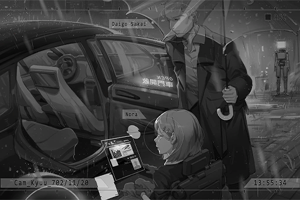

**[ROBO_Head]**  
_......_

**Member D**  
Apologies... we just couldn't drive him away. No matter how far we dump him, he would always return and proceed to stand there. It has been several days already...

**Nora**  
......

**Member D**  
Send him to another Node?

**[Nora]**  
_He'll still figure out a way to come back._

**Member D**  
It'll get really ugly if the Mogura people catch wind of this. Maybe we should...

**[Nora]**  
_Ignore him. We're running short on time. Let's go._

**Member D**  
Yes, Chief.

**[ROBO_Head]**  
_......_

_\[→Signal Switches\]_

**Ryu**  
Calling me to this place... You like to talk business in this kind of rain?

**[Nora]**  
_Your Butsudou is already tapped by at least two organizations. Do you realize that?_

**Ryu**  
\*Chuckles\* Of course I do. Let them hear all they want. Our status in Node 03 as the "Dragon Phoenix Combo" is already impregnable. A leaked secret or two won't make much of a difference to us.

**[Nora]**  
_I don't like to have a third party around when I'm talking._

**Ryu**  
Fair enough. Here's the share for this month, as well as the report.

**[Nora]**  
_Daigo._

**Member D**  
Yes, Chief.

_\[Data transfer\]_

**Ryu**  
This is spectacular. When Phoenix was gone, I previously thought it was going to be a major loss. Turns out you were the greatest treasure all this time. Look at all these numbers.

**Nora**  
......

**Ryu**  
Thanks to the establishment of the Kyubo Medical Center, not only have we created the biggest business chain this organization has ever seen, but we're also highly revered and respect among the civilians.

**[Nora]**  
_... The resources allocated to the downtown area and area 11 are not enough.  
I hope that starting next month, the Administration Bureau can increase the resource output to these two areas by at least 10%._

**Ryu**  
Still asking for the impossible, eh... Nora, we still have other things we need to tend to. I know the health of the civilians is important, but that's not our main business.

**[Nora]**  
A while ago, there was a batch of weapons that should've been smuggled to Node 08. The buyer ended up not receiving the cargo. We temporarily took responsibility for that screw\-up in place of you guys. I don't think you are qualified to bargain over this stuff with me right now.

**Ryu**  
......

**[Nora]**  
_I may not be able to use my "eyes" freely anymore, but I am still very well aware of every single screw\-up of yours. I advise you to not try to hide anything from me._

**Ryu**  
Alright, alright. I'll take care of this case. You can rest assured on that.

**[Nora]**  
_I've received the report. All the cargo is here. Besides what I just mentioned, all other guidelines will remain unchanged._

**Ryu**  
You've truly become outstanding at this job... Maybe one day you'll surpass me and kick me down from the top.

**[Nora]**  
_Are you threatening me with that comment?_

**Ryu**  
Not at all. Why would I?  
This is a place where profit and ability trump everything else. If someone can come in and break the ceiling that I've failed to crack for so many years, I'd be ecstatic. If me being replaced at the top is what it takes, so be it.

**[Nora]**  
_Unfortunately, I am not interested in 70% of the businesses you currently have. That day will never arrive._

**Ryu**  
Is that so...

**Mogura Member**  
Boss, the amount is correct.

**[Nora]**  
_Then we'll take our leave. Daigo._

**Ryu**  
Ah, right... speaking of "hiding", I think the same goes for you too, right?

**Nora**  
......?

**Ryu**  
I heard that your pet robot came back?

**Nora**  
......!

**Ryu**  
No need to be so tense.  
I'm not the kind of person who holds grudges. Our current partnership is very perfect, and I have no intention to disrupt this relation...  
I'll pretend that I didn't see it. That makes us even.

**[Nora]**  
_... Good. Daigo, start the car. Let's go._

_\[Car door opens\]_

**Ryu**  
... That's right. I'm indeed not that kind of person. However, I can't say as much for the folks who serve under me. They're... a bit hard to control, I'd say.  
You guys should know what to do, right?

**Mogura Member**  
Yes, Boss.

_\[→Signal Switches\]_

_\[Gate Opens\]_

**[ROBO_Head]**  
_......_

**Member D**  
Chief, he's still there... What should we do? The things Ryu just said...

**[Nora]**  
_Let's go inside. We still got work to do._

**Member D**  
... Yes, Chief.

_\[Signal Lost\]_

[Last Log](#os-log-021) | [Back to Top](#list-of-logs) | [Next Log](#os-log-023)

## OS Log #023

[Last Log](#os-log-022) | [Back to Top](#list-of-logs) | [Next Log](#os-log-024)

### Requirements
|    Char.    |Lv.|Lv. Locked?|
|-------------|:-:|:---------:|
|**ROBO_Head**|63 |    No     |

### Audio\_Kyuu\_702\_11\_22
**[ROBO_Head]**  
_......_

_\[Opens umbrella\]_

**???**  
ROBO!

**[ROBO_Head]**  
_......?  
May I ask who you are?_

**???**  
It's me! Ichiro! Do you not remember me...?

**[ROBO_Head]**  
_Searching database...  
Murata Ichiro, a friend. Still alive._

**Ichiro**  
Of course I'm still alive! What is this? Some kind of robot joke?

**[ROBO_Head]**  
_No, this unit is... very happy._

**Ichiro**  
... Are you waiting for Nora?

**[ROBO_Head]**  
_... Affirmative._

**Ichiro**  
I'm afraid that she's not going to see you... Come with me first.

**[ROBO_Head]**  
_......_

**Ichiro**  
Even though your parts are waterproof, constantly getting drenched in this kind of rain will still cause some issues. Besides... it's not safe for you to keep staying here. All in all, come with me first. Trust me.

**[ROBO_Head]**  
_Understood. Ichiro, helped us before. A good person._

_\[Signal Lost\]_

[Last Log](#os-log-022) | [Back to Top](#list-of-logs) | [Next Log](#os-log-024)

## OS Log #024

[Last Log](#os-log-023) | [Back to Top](#list-of-logs) | [Next Log](#os-log-025)

### Requirements
|    Char.    |Lv.|Lv. Locked?|
|-------------|:-:|:---------:|
|**ROBO_Head**|63 |    No     |

### Audio\_Murata\_702\_11\_22
**Ichiro**  
Welcome to my home. Not a fancy place, but still home.

**[ROBO_Head]**  
_Ichiro's home._

**Ichiro**  
Grandma, we have a visitor.

**Sonoko**  
Woah, that's a big robot.

**[ROBO_Head]**  
_Ichiro's grandmother, registering...  
Greetings._

**Sonoko**  
I'll go pour you some tea... Ah, Mr. Robot doesn't drink tea, right?

**Ichiro**  
Haha, it's alright. You should rest. Don't need to worry about us.

_\[ROBO_Head waves\]_

**Ichiro**  
... My grandma is a lot healthier now. It's all thanks to Nora and Kyubo Medical Center.  
A lot of things have happened since you left...

**[ROBO_Head]**  
_This unit, wants to hear._

**Ichiro**  
You've probably seen it already, what Nora looks like now...

**[ROBO_Head]**  
_......_

**Ichiro**  
The night I helped you guys run away... four years have passed since then?  
After you left, both Nora and I were captured by Mogura and taken back. I totally thought I was going to die at first. I only managed to avoid death because Nora offered up herself as the sacrifice. However, as a result, I wasn't allowed to stay in Kyuu Hou Kai anymore.

**Ichiro**  
But around one year ago, she founded the Kyubo Medical Center and got Daigo to secretly give me a job in that industry. Thanks to that, both grandma and I are living pretty well right now.

**[ROBO_Head]**  
_Nora... what happened to her?_

**Ichiro**  
Well... I've only heard about this myself too. Apparently, Mogura forced her to use the "Eye of Horus" ability whenever they wanted to... So many terrible things have happened in the organization in these past few years, and Nora saw all of them occur in front of her eyes. In order to reduce her pain, she gradually... sealed off her emotions. My guess is that she probably did a lot of the terrible things herself too...

**[ROBO_Head]**  
_......_

**Ichiro**  
After that, by relying on her smarts, she was able to set up a new partnership and business with Mogura. She also took over as Chief. However, her body finally succumbed under all of this. In the end, she couldn't even use her eyes anymore... but with how much profit she brings to Mogura, they don't seem to care about this too much.

**Ichiro**  
I truly feel sorry... All the sacrifices she made, was likely to protect us and the Kyuu Hou Kai Director left behind... Yet there's nothing I could do for her, despite all the things she had done for me...

**[ROBO_Head]**  
_... During the time this unit was not around, Nora..._

**Ichiro**  
I originally thought that she would be better after seeing you. At least she could be reminded of the times she was happy. Yet from the looks of it, that's not the case...

**[ROBO_Head]**  
_Question: How did Ichiro know about this unit?_

**Ichiro**  
To be honest, it was Daigo who told me about you. He wanted me to take you back to my home first since it's way too risky for you to be standing on the streets like that.

**[ROBO_Head]**  
_Risky?_

**Ichiro**  
Yeah. The Mogura people still very much want you dead! Nora's promise to them was that you'd never return to Node 03, nor would you ever interfere with the organization's business.

**[ROBO_Head]**  
_......_

**Ichiro**  
All in all, staying outside is dangerous. For now, you should stay here.

**[ROBO_Head]**  
_This unit...... protects Nora._

**Ichiro**  
... No good no good! Did you no hear what I just told you!?

**[ROBO_Head]**  
_Nora now, is not happy. This, is not what she wants; this unit, affirmative._

**Ichiro**  
What she wants...

**[ROBO_Head]**  
_Nora wants to have her own life, to chase her own dreams. This unit, will provide assistance with that._

**Ichiro**  
......

**[ROBO_Head]**  
_Ichiro, should help, too._

**Ichiro**  
I...

**[ROBO_Head]**  
_There is something Ichiro can do for her.   
Ichiro, can help her too._

**Ichiro**  
... Understood. I'll get Daigo and we can figure out a way together. However, you should still stay here for the next few days. Just in case.

**[ROBO_Head]**  
_Understood._

_\[Signal Lost\]_

[Last Log](#os-log-023) | [Back to Top](#list-of-logs) | [Next Log](#os-log-025)

## OS Log #025

[Last Log](#os-log-024) | [Back to Top](#list-of-logs) | [Next Log](#os-log-026)

### Requirements
|    Char.    |Lv.|Lv. Locked?|
|-------------|:-:|:---------:|
|**ROBO_Head**|64 |    No     |

### Audio\_Murata\_702\_11\_27
_\[Repairing\]_

**Ichiro**  
As expected, some places are short\-circuited... Alright, that's pretty much it.  
Try and move around!

_\[ROBO_Head waves\]_

**[ROBO_Head]**  
_Joint synchronization rate increase by 105%._

**Ichiro**  
Nice!

**[ROBO_Head]**  
_Ichiro, amazing. Thank you._

**Ichiro**  
Hehe, I learned a few things working under Chief for so many years. You can also use this trick on new equipment...

_\[Metal Footsteps\]_

**Ichiro**  
Hey, where are you going?

**[ROBO_Head]**  
_Repair of parts, complete.  
This unit, going back to see Nora._

**Ichiro**  
I told you it's not the time yet! The news of your arrival in Node 03 has already been spread to every corner of the organization. Right now, you're a wanted criminal on the admins' list!

**[ROBO_Head]**  
_......  
Must go back soon to help Nora. Ichiro, any ideas?_

**Ichiro**  
... I contacted Daigo about this. Ever since you came back, Nora has buried herself further into work. She is simply not willing to see anybody.

**[ROBO_Head]**  
_......_

**Ichiro**  
Help Nora... so basically getting her out of Kyuu Hou Kai? Do you realize that this means going against the entire Node 03 organization and its cooperations? It's not a simple task. On top of that, her willingness to be taken out is also a problem.

**[ROBO_Head]**  
_Affirmative. Concerns, reasonable._

**Ichiro**  
At least wait a while longer, okay? We need to plan this thing more carefully. At the very least, we need to wait until you're not the talk of the town before we can take action.

**[ROBO_Head]**  
_......_

**Ichiro**  
Rest assured. At least your current whereabouts haven't been exposed yet.  
The organization won't bother to look into a nobody like me. They probably didn't expect you to hide here either.

**[ROBO_Head]**  
_Understood. Ichiro, is a nobody. Very reliable._

**Ichiro**  
I don't know if that's a compliment or an insult...  
I need to go buy some things. Please look after my home. Grandma still has some trouble walking. If possible, give her a hand too, see what she needs.

**[ROBO_Head]**  
_Understood. People Nora helps, this unit will help as well._

_\[Signal Lost\]_

[Last Log](#os-log-024) | [Back to Top](#list-of-logs) | [Next Log](#os-log-026)

## OS Log #026

[Last Log](#os-log-025) | [Back to Top](#list-of-logs) | [Next Log](#os-log-027)

### Requirements
|    Char.    |Lv.|Lv. Locked?|
|-------------|:-:|:---------:|
|**ROBO_Head**|64 |    No     |

### Cam\_Murata\_702\_11\_27
**Sonoko**  
Thank you, ROBO. Sorry about this, you're supposed to be a guest...

**[ROBO_Head]**  
_This unit, very willing to help._

_\[Explosion\]_

**Mogura Member**  
It is here! Don't move!

**[ROBO_Head]**  
_......!?_

_\[Gunshot\]_

**Sonoko**  
WAAAAHH!

**[ROBO_Head]**  
_Attack detected. Analysis: Mrs. Sonoko, no wounds found._

**Sonoko**  
W... what is going on!?

**[ROBO_Head]**  
_Please stay here. Outside, not safe._

_\[Metal Footsteps\]_

**[ROBO_Head]**  
_This unit, right here. Please do not harm, unrelated bystanders._

**Mogura Member**  
They sheltered a criminal, so they're guilty as well! How dare you think you can get away with killing brother Lam! Well, not in Node 03! We'll turn you into scrap metal right here!

**[ROBO_Head]**  
_This unit, enter security mode. Power output increase by 250%._

_\[Parts moving\]_

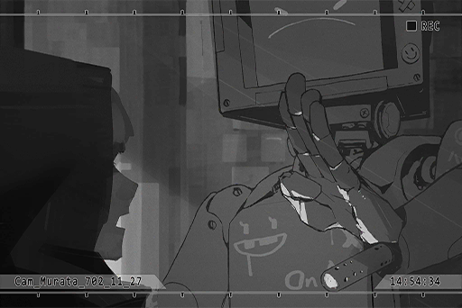

**[ROBO_Head]**  
_......?_

**Mogura Member**  
!?  
What is that? Hey! That guy has a gun! Look out!

**[ROBO_Head]**  
_Did Ichiro install this...?_

_\[Gunshot\]_

**Mogura Member**  
F\*\*\* it up! Don't give it the chance to shoot!

**Mogura Member**  
There should be another person living here. Look around. All three of them are dead meat!

**Ichiro**  
No need to look! I'm right here!

_\[Gunshot\]_

**Mogura Member**  
Urgh!

_\[Gunshot\]_

**Ichiro**  
ROBO! What are you doing!? Shoot them!

**[ROBO_Head]**  
_Ichiro, in danger, shoot..._

_\[→File Switches: Cam\_KyuuLab\_698\_06\_02\]_

**[ROBO_Head]**  
_Let this unit... deal with Kim._

**Phoenix**  
Have you taken a look at yourself?  
... ROBO, you are not created as a weapon to kill...

_\[→File Switches: Cam\_Murata\_702\_11\_27\]_

**[ROBO_Head]**  
_No, cannot, kill._

**Ichiro**  
ROBO! Behind you!

_\[Gunshot\]_

_\[Metal clanking\]_

**[ROBO_Head]**  
_Nnnnnnnooooo... cannnot kill..._

**Ichiro**  
ROBO!!

_\[Gunshot\]_

**Mogura Member**  
Urgh!

**Mogura Member**  
Blargh!

**Ichiro**  
......!?

**???**  
You alright!? Get in the car! Grab those two as well!

**Ichiro**  
Daigo!?

_\[Signal Lost\]_

[Last Log](#os-log-025) | [Back to Top](#list-of-logs) | [Next Log](#os-log-027)

## OS Log #027

[Last Log](#os-log-026) | [Back to Top](#list-of-logs) | [Next Log](#os-log-028)

### Requirements
|    Char.    |Lv.|Lv. Locked?|
|-------------|:-:|:---------:|
|**ROBO_Head**|64 |    No     |

### Audio\_Nora\_702\_11\_28
**[Nora]**  
_\[Nora\]._

_\[ROBO_Head Start-Up\]_

**[ROBO_Head]**  
_Nora……？_

**[Nora]**  
_......  
It's fixed. Daigo, I'll let you handle the rest._

**Member D**  
Chief...

**[Nora]**  
_Do as I say._

**Member D**  
... Yes.

_\[Door Closes\]_

**Member D**  
Can you hear me?

**[ROBO_Head]**  
_This unit, start\-up, success. Running self\-diagnostics... complete.  
System functions, normal._

**Member D**  
Don't understand why she still decided to fix you? She could've just left you alone and ignored you...

**[ROBO_Head]**  
_... Where's Ichiro?_

**Member D**  
No need to worry. They are currently in a very safe place. Chief has already sent people to deal with those bastards who attacked you.

**[ROBO_Head]**  
_Deal..._

**Member D**  
Although still not confirmed right now, I'm almost certain that they're Mogura's people  
Those pieces of s\*\*\*...

**[ROBO_Head]**  
_... Question: This unit's current location._

**Member D**  
Do you not recognize this room? This is Nora's old room. She doesn't use this room anymore now.

**[ROBO_Head]**  
_………_

**Member D**  
Chief has ordered you to stay here and not move... It seems that she can no longer issue commands to you.

**[ROBO_Head]**  
_This unit's command is, to protect Nora._

**Member D**  
Protect? Save that for yourself.  
Nowadays, she protects herself more securely than anyone in this world. Even we have difficulties approaching her sometimes.

**[ROBO_Head]**  
_………_

**Member D**  
On the contrary, your actions have caused us some serious trouble... In short, stay here and don't mess around. I have no idea what she's gonna do with you either. I have to go back to work. Don't wander around, understand?

_\[Door Closes\]_

**[ROBO_Head]**  
_………_

_\[ROBO_Head looks around\]_

**[ROBO_Head]**  
_………_

_\[Metal Footsteps\]_

**[ROBO_Head]**  
_Nora's old instrument..._

_\[Damaged instrument\]_

**[ROBO_Head]**  
_Analyzing... Condition: Damaged._

**[ROBO_Head]**  
_......_

**[ROBO_Head]**  
_Analyzing damaged parts... Filter, Evenlope, LFO..._

**[ROBO_Head]**  
_Create new activity planning: Repair instrument_

_\[Repairing\]_

_\[»»» Fast Forward»»»\]_

_\[Instrument.\]_

**[ROBO_Head]**  
_Repair complete._

_\[Instrument.\]_

**[ROBO_Head]**  
Nora... doesn't make music anymore...

_\[Signal Lost\]_

[Last Log](#os-log-026) | [Back to Top](#list-of-logs) | [Next Log](#os-log-028)

## OS Log #028

[Last Log](#os-log-027) | [Back to Top](#list-of-logs) | [Next Log](#os-log-029)

### Requirements
|    Char.    |Lv.|Lv. Locked?|
|-------------|:-:|:---------:|
|**ROBO_Head**|65 |    No     |

### Cam\_Nora\_702\_11\_29
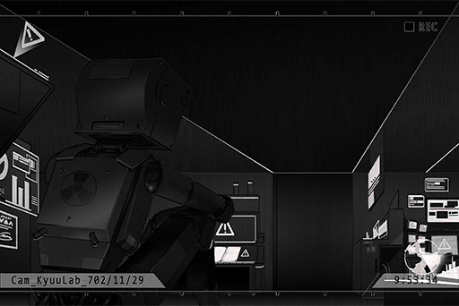

_\[ROBO_Head Start-Up\]_

**[ROBO_Head]**  
_This unit, start\-up, success. Running self\-diagnostics... complete.  
Duration of this shutdown: 9 hours 27 minutes. Battery charge complete._

**[ROBO_Head]**  
_...... Nora...... Not here._

**[ROBO_Head]**  
_......_

_\[ROBO_Head emotion\]_

**Kyuu Hou Kai Member**  
Chief is willing to see you two. She'll be here soon... Hey, stop poking around. Do you have any idea how much a pair of eyeballs are worth on the black market?

**???**  
Umm, N\-no...

**???**  
Come on, don't get scared so easily. Let's wait here first.

**[ROBO_Head]**  
_......?_

**[ROBO_Head]**  
_Voiceprint detection... complete.  
Decision: 5 Kyuu Hou Kai members, 3 outsiders._

**Kyuu Hou Kai Member**  
Hey! Not that room!

**???**  
What's the big deal? It's not like the door is locked. Just a quick tiny peak...

**[ROBO_Head]**  
_......!?_

_\[Door Opens\]_

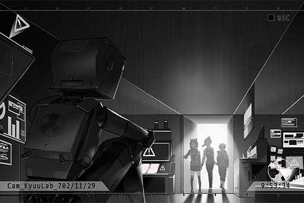

**NEKO#ΦωΦ**  
Eh... EHHHHHHH!?  
R, R, R\-Ropohead!?

**PAFF**  
It really is him! Why is he here...?

**Hayato**  
... Who?

**[ROBO_Head]**  
_... Miss PAFF, MIss NEKO, greetings._

_\[Signal Lost\]_

[Last Log](#os-log-027) | [Back to Top](#list-of-logs) | [Next Log](#os-log-029)

## OS Log #029

[Last Log](#os-log-028) | [Back to Top](#list-of-logs) | [Next Log](#os-log-030)

### Requirements
|    Char.    |Lv.|Lv. Locked?|
|-------------|:-:|:---------:|
|**ROBO_Head**|66 |    No     |

### Audio\_Nora\_702\_11\_29\_1
**Kyuu Hou Kai Member**  
Chief... I tried to stop them...

**[Nora]**  
_... Fellow guests, the reception room is not here. Please come with me._

**NEKO#ΦωΦ**  
Woah! Where did you pop out all of a sudden... Little girl, who are you?

**[ROBO_Head]**  
_This unit, detects question from Miss NEKO.  
Answer: This is Nora._

_\[ROBO_Head emotion\]_

**[Nora]**  
_... Quiet._

**[ROBO_Head]**  
_………_

_\[ROBO_Head emotion\]_

**[Nora]**  
_I am Nora, Chief of Kyuu Hou Kai. This is the first... No, I believe I've met two of you in the past already._

**Hayato**  
!? I didn't recognize you at first. You're the one...

**[Nora]**  
_It has been a long time, Hayato Kusu.  
It seems that you've found the person you were looking for._

**Hayato**  
It's all thanks to you... However, I didn't realize that you're the Chief now. On top of that...

**[Nora]**  
_......  
And this is Miss Kaori Minamiya, I presume?_

**PAFF**  
Umm, yes... Have we met before...?

**[Nora]**  
_I've met you several times in "that" place, although the meeting just now was the first time you ever responded to my calls. Your appearance... I see that a lot has happened to you since then as well._

**PAFF**  
This voice... so that really was you just now.

**[Nora]**  
_Yes.  
Everyone, please come with me first._

**[ROBO_Head]**  
_This unit, will go as well._

**[Nora]**  
_You stay here._

**[ROBO_Head]**  
_......_

_\[ROBO_Head emotion\]_

**NEKO#ΦωΦ**  
Umm, Ropohead and we kinda know each other. We've performed together in Node 08! Me thinks it's alright for him to tag along!

**[Nora]**  
_... You've met them before?_

**[ROBO_Head]**  
_Affirmative.  
These two, made music with this unit, performed with this unit._

**Nora**  
......

**PAFF**  
Miss Nora... it's alright.

**[Nora]**  
_... Very well._

_\[Signal Lost\]_

[Last Log](#os-log-028) | [Back to Top](#list-of-logs) | [Next Log](#os-log-030)

## OS Log #030

[Last Log](#os-log-029) | [Back to Top](#list-of-logs) | [Next Log](#os-log-031)

### Requirements
|    Char.    |Lv.|Lv. Locked?|
|-------------|:-:|:---------:|
|**ROBO_Head**|66 |    No     |

### Audio\_Nora\_702\_11\_29\_2
**[Nora]**  
_I understand. So the purpose of your visit to Node 03 is to confirm the identity of Miss Kaori Minamiya?_

**PAFF**  
Yes. Revisiting this place did indeed allow me to confirm some of my memories as Kaori. However, this doesn't seem to solve the other mystery about my body, all the weird phenomenons I'm experiencing nowadays... If we continue to delve deeper, we might have to get involved with the underground society, so we don't really know how to continue our investigation either...

**[Nora]**  
_Underground society, is it...?_

**PAFF**  
Ah... I'm sorry. I didn't mean to...

**NEKO#ΦωΦ**  
Y, yeah! Aroma\-chan is still very confused now, right? Things have been very hard for her. She used to be such an amazing singer, but recently a lot of unlucky things have happened to her...

**[Nora]**  
_No, Kyuu Hou Kai is indeed not some kind of upright organization. To be honest, I have no interest in you or your stories. The reason I agreed to meet with you is simply because you have "The Eye of Horus" ability just like me. That's all there is to it._

**PAFF**  
"The Eye of Horus"...? Hayato mentioned that name too. What is it exactly...?

**[Nora]**  
_You've experienced it personally, so I won't explain it too much. Just as you have experienced, this is an ability that allows you to wander around in the generally inaccessible virtual internet space "OS". It allows you to witness the "truth" this world has recorded... as well as the "chaos"._

**PAFF**  
...... OS......?  
I don't quite understand. I always thought that those were just dreams...  
How did I...?

**[Nora]**  
_Regarding the requirements to have such an ability... I believe you all know about "The Ender" virus found in the forbidden areas. My foster father... and former Chief of Kyuu Hou Kai Phoenix spent his entire life researching this virus._

**[Nora]**  
_The Ender is a very peculiar nervous nano\-virus left behind by ancient human civilizations. It's capable of traveling between special signals. Ever since I was a child, I was able to survive in a virus\-infected environment. Further studies conducted by Phoenix discovered that I'm not actually "immune" to the virus. Instead, I merely "coexist" with it. This "coexistence" is also the source of this ability._

**PAFF**  
Virus... but I don't remember ever going to a place with...  
......! I remember now! When I was kidnapped as Kaori, I think there was some kind of accident during the transport... Was it back then...?

**[Nora]**  
_Regardless of what actually happened, your body was definitely exposed to the virus in the forbidden areas at some point._

**NEKO#ΦωΦ**  
C\-Chief... Ah, no... I mean... Miss Nora...?

**[Nora]**  
_Just Nora is fine._

**NEKO#ΦωΦ**  
Hehe... Nora! NEKO has a question!  
NEKO is a bit worried... Will this ability result in any bad effects for Aroma\-chan? Every time she uses this ability to see stuff, her nose starts bleeding!

**[Nora]**  
_There's nothing to hide here. Using this ability will take a toll on the user's body, without a doubt. My body is at the state it is in now precisely because I overused this ability in the past._

**[ROBO_Head]**  
_………_

_\[ROBO_Head emotion\]_

**[Nora]**  
_However, since there's a second known user now, there is a chance that your situation could be different from mine... Miss Minamiya seems to be quite healthy herself. From the looks of it, you aren't affected by the ability too much._

**PAFF**  
... Is that so?

**[Nora]**  
_However, what I've noticed is that you don't seem to have the proper control over this ability right now. Even the activation and disconnection timings are  random. If you don't learn how to master it, things might get really bad if it ever goes out of control. In the worst\-case scenario, you might even be trapped inside there forever._

**Hayato**  
It could be that dangerous!?

**[Nora]**  
_Yes. From my personal experience, every use of this ability will put a brief burden on the user both physically and mentally. Therefore, I recommend you learn how to properly control this ability first, though other dangers might also occur during the process of you learning how to use it. I can't promise anything._

**PAFF**  
Miss Nora... are you willing to help me?

**[Nora]**  
_... I'll be frank. I'm merely suggesting this because I am curious about other users, and you provide valuable research material. In reality, it's all up to you to decide what you want to do. If you have no intention to take on the risks, I won't force you to._

**PAFF**  
No. I've made my decision already, Miss Nora.  
Please, tell me how to control this ability.

**PAFF**  
I... as Aroma, I never got the feeling that I was myself. Even now, after remembering the things Kaori experienced, there are still many memories that have yet to awaken... It just feels like I'm still an empty and incomplete person.

**PAFF**  
And now, I'm standing right in front of the gate. All I need to do is take a step inside and I'll get the answers I seek... To me, there's no reason not to do so.

**Nora**  
......

**PAFF**  
Besides... Way too many people have helped me get to this place. There's even an idiot who went broke just to come to 08 to find me. If I back down because of a small risk, I am doing everyone who has ever helped me a disservice.

**Hayato**  
... Kaori...

**[Nora]**  
_Please don't misunderstand. I'm teaching you how to control your ability simply because the virus research requires a stable sample. In addition, I don't want you to use it for no good reason afterward either. This ability... is a curse._

**[ROBO_Head]**  
_………_

**[Nora]**  
_In short, I will arrange guest rooms for the three of you. For the time being, you are all guests of Kyuu Hou Kai. I'll try my best to conduct the research and stabilize your ability using the safest methods._

**PAFF**  
Understood. Thank you, Miss Nora!

**[Nora]**  
_... Just Nora is fine.  
I'll be leaving first. Take the guests to the guest room... One more thing, take ROBO back to his room as well._

**Kyuu Hou Kai Member**  
Yes, Chief.

_\[Door Opens\]_

**[ROBO_Head]**  
_... Help. Everyone, together..._

_\[Signal Lost\]_

[Last Log](#os-log-029) | [Back to Top](#list-of-logs) | [Next Log](#os-log-031)

## OS Log #031

[Last Log](#os-log-030) | [Back to Top](#list-of-logs) | [Next Log](#os-log-032)

### Requirements
|     Char.      |Lv.|Lv. Locked?|
|----------------|:-:|:---------:|
|**ROBO_Head**   |67 |    No     |
|**Crystal PuNK**|24 |    No     |

### Cam\_KyuuLab\_702\_12\_15
_\[Door Opens\]_

**[ROBO_Head]**  
_......!  
Nora._

_\[ROBO_Head emotion\]_

**[Nora]**  
_... Give me your hand._

**ROBO_Head**  
......?

_\[Extends hand\]_

_\[Removing parts\]_

**[ROBO_Head]**  
_......!?  
Nora... what are you going to do?_

**[Nora]**  
_Removing the weapon Ichiro installed in your hand._

**[ROBO_Head]**  
_......?  
Weapon, can protect everyone._

**Nora**  
......

**[ROBO_Head]**  
_This unit, don't understand._

**[Nora]**  
_... Enough. Stop talking._

**ROBO_Head**  
......

_\[Lights Off\]_

**ROBO_Head**  
!?

**[Nora]**  
_......Eh?  
W... what happened? I... I can't see anything..._

**[ROBO_Head]**  
_Main power source, power supply interrupted._

**[Nora]**  
_How come... Daigo, Daigo! Can you hear me?_

**[Member D]**  
_Ch......  
Chief... This is Daigo. The signal is very weak. What is happening!?_

**[Nora]**  
_I'm not sure either. Report the situation outside to me immediately._

**[Member D]**  
_The entire power supply for Kyuu Hou Kai has gone offline! We are currently investigating the reason. Not certain if this is yet another attack... Where is Chief now!?_

**[Nora]**  
_... I'm in ROBO's room. There's an old terminal here. I'll use it to connect to the system and see what's going on._

**[Nora]**  
_But... my eyes..._

**[ROBO_Head]**  
_Nora, please let this unit, be your eyes._

**[Nora]**  
_......! I'll give it a try.  
ROBO's angle of view... Excellent. The terminal is behind that wall. Push me there as well._

_\[Terminal Connection\]_

**[Nora]**  
_This is... This again, the exact same attack pattern as the one that just happened...  
So things really turned out the same as what I imagined?_

_\[Access Denied\]_

**[Nora]**  
_Ugh... who... who are you exactly? What is your purpose?_

**[ROBO_Head]**  
_Nora, who are you talking to...?_

**[Nora]**  
_... Be quiet._

_\[Access Denied\]_

**[Nora]**  
_Damnit, no good... I can't decipher his attack. Have to hurry up and restore the power, or else Miss Sherry Pauline..._

**[ROBO_Head]**  
_Miss Cherry is in danger?_

**[Nora]**  
_If the life support system stops functioning... No good, there's nothing I can do from here at all. I can't even open the door due to the power outage..._

_\[Removing parts\]_

**[Nora]**  
_!?  
ROBO, what are you doing?_

**[ROBO_Head]**  
_This unit's core, able to generate power on its own, is created by Nora. Thus, can connect to terminal and provide mass power. Can temporarily restore power to facility._

**Nora**  
......!

**[ROBO_Head]**  
_This unit, uncertain about procedure to use. Would like Nora, to take over._

**[Nora]**  
_... To provide the entire facility... No, even if it's just providing power for one area, your motherboard will be fried, without a doubt. That level of damage is irreparable. Not even I can fix that._

**[ROBO_Head]**  
_Nora very important, to this unit. But, friend that played music together, also very important. This unit, wants to help, wants to save Miss Cherry._

**[Nora]**  
_......  
Understood._

_\[Connection\]_

**[Nora]**  
_... ROBO, this will completely destroy your core and memory unit. Even if we repair your mechanical frame, you..._

**[ROBO_Head]**  
_This unit, very happy._

**Nora**  
......?

**[ROBO_Head]**  
_This unit, understand; Nora, fears that emotions will cause herself pain. Thus, acts indifferent to this unit, indifferent to everyone.  
But Nora, didn't change._

**Nora**  
......!  
......

**[ROBO_Head]**  
_This unit, is prepared._

**[Nora]**  
_......  
... Ugh..._

**[ROBO_Head]**  
_...... Nora? The time..._

**[Nora]**  
_... \*Sobs\*..._

**ROBO_Head**  
......?

**[Nora]**  
_... I...  
... \*Sobs\*... I'm sorry...  
I'm sorry... I'm sorry..._

**[Nora]**  
_WAHHHHHHHH!!_

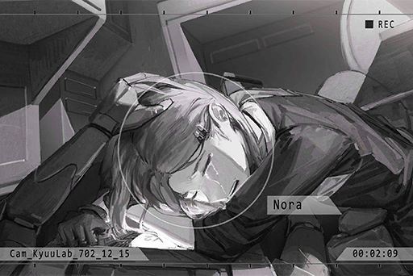

_\[Signal Lost\]_

[Last Log](#os-log-030) | [Back to Top](#list-of-logs) | [Next Log](#os-log-032)

## OS Log #032

[Last Log](#os-log-031) | [Back to Top](#list-of-logs) | [Next Log](#os-log-033)

### Requirements
|    Char.    |Lv.|Lv. Locked?|
|-------------|:-:|:---------:|
|**ROBO_Head**|68 |    No     |

### Audio\_Kyuu\_702\_12\_15\_3
**[Nora]**  
_All in all, both of you should be exhausted. I am very thankful that you're still willing to stay here. Please get some rest. I must now go back to clean up this mess._

_\[Wheelchair moving\]_

_\[Door Opens\]_

**Member D**  
Chief, about Miss Pauline's body... we've got everything arranged and ready to go.

**Nora**  
......

**Member D**  
We've also contacted those in Node 08 who are affected by this, including Luis Pauline, Joe Miller and all her known friends on the list. Her father will apply for a temporary parole from the restricted area so he can organize his daughter's funeral.

**[Nora]**  
_... What about the public announcement? Miss Pauline is considered a celebrity figure in Node 08._

**Member D**  
Yes. We've dealt with all the issues regarding the agency through our connections. This is the press release; death by accident. No mention of the organization what so ever.

**Nora**  
......

**Member D**  
Chief... are you alright...?

**[Nora]**  
_I'm... feeling a bit tired. Can I leave you in charge of the clean up for now?_

**Member D**  
Certainly! But what about you...

**[Nora]**  
_The priority is to repair the defenses in area 03. Within two hours, I want a written report with all the damages listed on it._

**Member D**  
Chief... are you really alright...?

**[Nora]**  
_Can you do it?_

**Member D**  
... Yes.

_\[Wheelchair moving\]_

**Member D**  
... Chief...

_\[→Signal Switches\]_

_\[Door Opens\]_

**[ROBO_Head]**  
_......!  
Nora..._

_\[Wheelchair moving\]_

**Nora**  
......

**ROBO_Head**  
......

_\[»»» Fast Forward»»»\]_

**[ROBO_Head]**  
_......  
Nora, question: Miss Cherry..._

**[Nora]**  
_You fixed all these instruments..._

**[ROBO_Head]**  
_......  
Affirmative._

**[Nora]**  
_......  
Why...?_

**[ROBO_Head]**  
_Answer: Nora, has dreams of music. This unit, saw broken instruments. This unit, hopes Nora can..._

**[Nora]**  
_Why did you come back?_

**[ROBO_Head]**  
_This unit, wants to protect Nora._

**Nora**  
......

**[ROBO_Head]**  
_Nora...?_

**[Nora]**  
_Miss Pauline... is dead._

**ROBO_Head**  
......!

**[Nora]**  
_I... couldn't do it. I was unable to recover the power in time. I caused her death._

**[ROBO_Head]**  
_... Not Nora's fault. This unit..._

**[Nora]**  
_Do you think... it's your fault?_

**[ROBO_Head]**  
_......  
... Unable to analyze._

**[Nora]**  
_... That's because your emotions are a lot more complicated than you think._

**ROBO_Head**  
......

**[Nora]**  
_I... I don't know anymore. What is right? What is wrong?_

**ROBO_Head**  
......

**[Nora]**  
_When I couldn't destroy you, it felt... painful. Was I... crying back then? I thought I was experiencing my own emotions... for the first time since that incident——Yet after seeing Miss Pauline, I was still able to handle everything so calmly..._

**[ROBO_Head]**  
_... Nora..._

**[Nora]**  
_Tell me, ROBO; right now... what do you feel?_

**[ROBO_Head]**  
_... Emotion simulation keyword searching...  
Keywords: self\-blame, regret, sadness... anger._

**[Nora]**  
_... Is that so? You are me... Then perhaps... that's just how it is, right...? However, we both don't know how to express these emotions, or should I say, that we've both lost this function..._

**ROBO_Head**  
......

**[Nora]**  
_ROBO, can you... lock the door? I don't want other people... to see my face right now._

**[ROBO_Head]**  
_... Understood._

_\[Signal Lost\]_

[Last Log](#os-log-031) | [Back to Top](#list-of-logs) | [Next Log](#os-log-033)

## OS Log #033

[Last Log](#os-log-032) | [Back to Top](#list-of-logs) | [Next Log](#os-log-034)

### Requirements
|    Char.    |Lv.|Lv. Locked?|
|-------------|:-:|:---------:|
|**ROBO_Head**|68 |    No     |

### Audio\_Kyuu\_702\_12\_17
_\[Ringtone\]_

_\[Call Starts\]_

**[Rald]**  
_It's me, Miss Pauline. I have some new information I would like to share with you._

**Nora**  
......

**[Rald]**  
_I couldn't get in contact with Mr. Jackson. The call got blocked... That's odd. I believe I haven't done anything that would offend you two to this degree..._

**[Nora]**  
_... You're "R", I presume? I heard about you from them, the one who sent us money out of nowhere and provided information on Kyuu Hou Kai._

**[Rald]**  
_......  
If you don't mind, can you be so kind as to tell me which lady I'm currently talking to?_

**Nora**  
......

**[Rald]**  
_No need to be worried. Your speculation is correct. I was the one who guided them to Kyuu Hou Kai. You can view me as their comrade... In other words, not your enemy._

**[Nora]**  
_... I'm Nora, the chief of Kyuu Hou Kai._

**[Rald]**  
_Nora, "the ninth child" in the secret language... Excuse me, but you and the rumored "Eye of Horus"..._

**[Nora]**  
_No comment, "R"... Mr. Neumann._

**[Rald]**  
_... \*Chuckles\* Looks like my identity is not exactly a secret to you either. I'm very impressed... Very well then; let's stop beating around the bush and have an open conversation, Miss Nora._

**[Nora]**  
_Apologies. Right now, I... don't have the time to chit\-chat with you._

**[Rald]**  
_What a shame. The science research organization of gangs that only exist in legends, safe to say I'm quite interested in you guys... Oops, getting off\-topic. I would like to speak to Mr. Jackson. He should still be there, right?_

**[Nora]**  
_... No, he left... I don't know where he went_

**[Rald]**  
_Left...? All by himself?_

**[Nora]**  
_... Yes._

**[Rald]**  
_May I ask... did something happen?  
Now that I think about it, this number is supposed to belong to Miss Pauline... yet you're the one talking to me now._

**Nora**  
......  
She's...

_\[»»» Fast Forward»»»\]_

**[Rald]**  
_......  
... Is that so..._

**[Nora]**  
_... I am very sorry._

**[Rald]**  
_Rather than sorry, I'm surprised, more than anything.  
Based on my understanding, Kyuu Hou Kai has practically transformed these past few years. Regular attacks barely even tickle you guys. Never thought the situation will end up like this..._

**[Nora]**  
_......_

**[Rald]**  
_However, my guess is that you're the one who's the most surprised about this._

**[Nora]**  
_I'm sorry. With the level of understanding between us, I don't think I have any other information I can provide to you._

**[Rald]**  
_I understand. Then allow me to present some of my information. Listen closely. Based on the description you said, the darkness you face is enough to conceal all light... Not something a few puny gangs can control, but a shadow that's much deeper and heavier..._

**[Nora]**  
_... You know something?_

**[Rald]**  
_Yes, but before that, I would like to hear your opinion. Rest assured, I'm not trying to set you up. I just don't want to waste each other's time sharing information we both already know._

**[Nora]**  
_... I have some thoughts on the matter. I previously planned to tell Mr. Jackson about it... I believe that besides Diego, there's another force involved in this string of attacks._

**[Rald]**  
_Hoho...?_

**[Nora]**  
_The enemy's skills were simply brilliant. The attacks were very well\-organized, and their understanding of Kyuu Hou Kai's defense mechanisms was also far beyond what I expected. They had everything covered, no loose ends... Diego's thugs are not capable of these things. I am absolutely certain about that._

**[Nora]**  
_As a science researcher, guessing based on instinct is a careless approach. Despite that, all the signs in this incident have forced me down this path of thinking.  
Mr. Neumann, you mentioned a "shadow". What are you referring to?_

**[Rald]**  
_......_

**[Nora]**  
_Mr. Neumann?_

**[Rald]**  
_... You couldn't make a definitive decision because you don't have enough information. You couldn't deduce the motive and purpose of the attacker. The devastating destruction of Kyuu Hou Kai, the death of Miss Pauline and many other staff members... You couldn't find the connection between all of them._

**[Nora]**  
_... I won't deny that._

**[Rald]**  
_However, Miss Nora... try reversing your way of thinking. The drones, the blackout, the massive and noisy attack on Kyuu Hou Kai; if all of this is just to achieve a single objective..._

**[Nora]**  
_Stop dodging the answer. I've already provided you all the information I know._

**[Rald]**  
_Ah, pardon me for my manners. Speaking in circles is a bad habit of mine...  
Indeed, I do have a bit of an idea on who's the mastermind behind all this, but it's still just one of many possibilities after all. I don't want to raise your hopes up too high either. All I can give you, is one name... Ivy._

**[Nora]**  
_......!?  
Ivy... who is that?_

**[Rald]**  
_Do you know anything about the massive internet terrorist attack incident that occurred at the start of the year? Æsir, please try to investigate in this direction._

**[Nora]**  
_So you're not entirely sure yourself as well... ?_

**[Rald]**  
_Yes. That's why I said I don't want to raise your hopes up too high. I still require more investigation to verify my speculations. Nonetheless, I believe that once the many strings of melody overlay with one another, the symphony known as "the truth" shall be revealed to the public...  
\*Chuckles\* I earnestly look forward to the arrival of that day._

**[Nora]**  
_... Understood. I will view you as a person on our side, for now, and take part in your investigation._

**[Rald]**  
_I am very glad to hear that from you, Miss Nora.  
Then, let us stay in contact._

_\[Call Ends\]_

**Nora**  
......

_\[Signal Lost\]_

[Last Log](#os-log-032) | [Back to Top](#list-of-logs) | [Next Log](#os-log-034)

## OS Log #034

[Last Log](#os-log-033) | [Back to Top](#list-of-logs) | [Next Log](#os-log-035)

### Requirements
|    Char.    |Lv.|Lv. Locked?|
|-------------|:-:|:---------:|
|**ROBO_Head**|69 |    No     |

### Audio\_Bookstore\_702\_12\_24
**ConneR**  
This bookstore is much more shabbier than I imagined, haha. Shall I utter the secret code? I'm looking for "The Ninth...

**Member D**  
No need. You already made an appointment with the Chief, haven't you? This way, Mr. Neumann.

**ConneR**  
What a shame. I've always wanted to use a code word... Please, lead the way.

_\[→Signal Switches\]_

**ConneR**  
You are Miss Nora? I heard of your age long ago, but seeing you in person, it's still quite surprising... It's an honor to meet you.  
Mr. ROBO\_Head, I never thought we'd meet under such conditions.

**[ROBO_Head]**  
_Mr. ConneR, hello._

**[Nora]**  
_I've read many of your papers too, Mr. Neumann. However, enough with the conventional greetings.  
You said that you made major progress regarding the investigation of the incident. I'd like to get right into it._

**ConneR**  
Of course. Let's corroborate the sheet music in each other's hand. However, before that...

**[Nora]**  
_What's the matter?_

**ConneR**  
Based on my understanding, the other "Eye of Horus" user is also here as a guest. Don't know if I'll have the honor of meeting her?

**[Nora]**  
_Not a problem. However, Miss PAFF is currently resting. We will arrange that soon._

**ConneR**  
Excellent. Then allow me to begin by performing the first movement. This is my main instrument.

_\[Projection\]_

**[ROBO_Head]**  
_Analysis: Microchip, model number unknown._

**[Nora]**  
_... Looks like it has been around for quite some time, yet the structure is extremely intricate... What is this chip?_

**ConneR**  
An artifact handed down by my ancestors. I'll just go ahead and start with conclusions: It's clear that this is high level technology from ancient civilization, and it's highly possibly that it was created by the Architects. Although the details of its use are unclear... I've tried to connect my own brain with it, and the images I saw was what I meant by "major progress".

**[Nora]**  
_......!_

**ConneR**  
A memory file from several hundred years ago directly played out inside my brain... It was like traveling through time, truly a very interesting experience. Nonetheless, since humans and Architects aren't even remotely similar, I was unable to catch a glimpse of the entire picture. All I can determine as of now is that it contains the memory of some Architect.

**[Nora]**  
_... The density of this data... excluding those with the ability, if an ordinary person's brain were to be suddenly exposed to such an enormous amount of pressure..._

**ConneR**  
Correct. Embarrassing to say, but I collapsed right on the spot and immediately cut the connection... Though I suspect that since it's just a simple data transmission, perhaps it could be processed in sync by linking up with other equipment. In theory, we could lengthen the usage time and even discover the chip's other functions.

**ROBO_Head**  
......

**[Nora]**  
_"Ivy"... is it? The one you brought up in the call._

**ConneR**  
No, I believe she isn't the owner of this piece of memory. She's the unit that appeared in the field of vision during the dialogue.

**[Nora]**  
_… Is that so? In any case, the Architects... are the key to everything?_

**ConneR**  
I want to hear Miss Nora's thougths on the matter. Both you and Miss PAFF mentioned that you encountered what we suspect is an Architect's consciousness in the OS space.

**[Nora]**  
_These robots that once rebuilt and managed human society should have all disappeared during "The Decomission". But  after we investigated the lead you provided... It shows that there is indeed a possibilty that an Architect is still active in Node 08._

**ConneR**  
I like where you're going. Please, continue.

**[Nora]**  
_Based on the difficulties Mr. Jackson and co. encountered, if the mastermind behind the Æsir attacks was indeed an Architect, despite the motive remaining unclear, it would resolve many questionable points in this incident._

**ConneR**  
Exactly. Large scale hacking incidents, a series of drone attacks, even A.R.C... no, Mr. Jackson's security technology being decrypted, it's hard to imagine anyone besides an Architect who could do all of that. I believe that everything leading up to today has something to do with them.

**ConneR**  
These ghosts, concealed by history, are difficult to track. However, we can deduce from the experiences of you two that "The Eye of Horus" is the one path that will lead us to them. The stage... will be set where it all began, Node 08.

**[Nora]**  
_I see. That's why you wanted to see Miss PAFF._

**ConneR**  
Hehe, to me, those with exceptional innate abilities are as majestic as violin concertos from past generations. On top of that, her ability may be the last key that we currently have. If we're going to go back to open the door, she is absolutely necessary.

**[Nora]**  
_...I understand. I'll have it arranged._

**ConneR**  
Greatly appreciated. There is one unsolved riddle that still remains concerning this attack... Miss Nora, any leads?

**[Nora]**  
_The purpose of attacking Kyuu Hou Kai, right? I believe I do have an answer.  
ROBO, wait here. I'll take Mr. Neumann to the central lab._

**[ROBO_Head]**  
_Central lab has been seriously damaged, not safe.  
Please allow this unit to follow._

**[Nora]**  
_Don't worry. I'll let Daigo follow along.  
Mr. Neumann, please come with me._

**[ROBO_Head]**  
_Understood._

_\[Door opens\]_

**ROBO_Head**  
......

**[ROBO_Head]**  
_... Data copy complete.  
Data Integrity: 99.98%, File Condition: Healthy.  
Data space set up... complete._

**[ROBO_Head]**  
_Test: Chip link simulation. Initiate calculations._

_\[Signal Lost\]_

[Last Log](#os-log-033) | [Back to Top](#list-of-logs) | [Next Log](#os-log-035)

## OS Log #035

[Last Log](#os-log-034) | [Back to Top](#list-of-logs)

### Requirements
|    Char.    |Lv.|Lv. Locked?|
|-------------|:-:|:---------:|
|**ROBO_Head**|69 |    No     |

### Audio\_Kyuu\_702\_12\_24
**ConneR**  
I see... A vaccine for "The Ender" virus, is it?

**[Nora]**  
_Yes. Miss PAFF's physique that allows her to co\-exist with "The Ender" virus. I used her genes to try and produce a sample vaccine. In theory, it can suppress the virus from being activated into an unobservable state while inside the human body... but it hasn't been tested._

**ConneR**  
This is truly a revolutionary invention, Miss Nora. I assume you haven't revealed this information to anybody yet?

**[Nora]**  
_Of course. But if who we are dealing with is Æsir, a hacker who can carry out multiple large\-scale attacks, It's pretty much impossible to hide this information._

**ConneR**  
What about the motive? Plotting such a precise attack, all for destroying this one little test tube?

**[Nora]**  
_To be honest, I didn't come up with that... I'll have Miss PAFF explain it._

**ConneR**  
... Oh?

_\[Door Opens\]_

**PAFF**  
Mr. Neumann, right? Hello, NEKO mentioned you before... I heard that, in the end, you let her pass.

**ConneR**  
Hehe, Miss Kitten is a lively girl. How could I keep her locked up in such a dull place like the Academy? Miss PAFF, I've heard about you as well; you're much more natural and poised than I've been told.

**PAFF**  
There are many reasons for that... Ah, as for why the vaccine was destroyed, that is merely a speculation...

**ConneR**  
Please, go on. I'm all ears.

**PAFF**  
... A while ago, when I was using the ability, I felt this powerful, very powerful evil intent... and the target of that intent was all of mankind. It's an abhorrent feeling of hatred... It was as if it wanted to annihilate all of humanity.

**ConneR**  
......!

**PAFF**  
I'm not sure what it was... but after Nora told me her thoughts on the matter, I was even more certain... I know I can't come up with detailed and insightful hypotheses like you two, but... I don't know. There's just a voice in my heart that tells me this is so.

**ConneR**  
... Miss Nora, what do you think?

**[Nora]**  
_As a former user of the ability, I understand what it means to experience these feelings. When you experience the emotional center of another being, that subtle ripple can only be completely understood by the one involved.  
Thus, I trust Miss PAFF's judgment._

**ConneR**  
I see. There's no melody that's more convincing than one that's grounded in theory and infused with emotion. This conclusion fits with all the signs we've encountered as well... Furthermore, if an attack's carried out with the virus, that'll be doom for all mankind.

**PAFF**  
We can't let that happen! Otherwise, everyone will...

**[Nora]**  
_......_

_\[Alarm\]_

**[Kyuu Hou Kai System]**  
_Warning, electrical system error._

**[Nora]**  
_What's going on?_

**ConneR**  
... Could it be another attack?

_\[Typing on keyboard\]_

**[Nora]**  
_No, the source of the surge is in the guest room... ROBO!?_

_\[→Signal Switches\]_

_\[Door Opens\]_

**[Nora]**  
ROBO! ... Are you okay!?

**[ROBO_Head]**  
_......  
No... ra. This unit... is fine._

_\[Typing on keyboard\]_

**[Nora]**  
_... Did you connect these circuits yourself? An immense increase in electricity usage in such a short time...a simulation calculation... what are you doing?_

**[ROBO_Head]**  
_This unit... simulated linking with Mr. ConneR's chip, calculating tolerance levels under conditions of a sustained link. If successful, Mr. ConneR can gather more information._

**[Nora]**  
_...! And the results?_

**[ROBO_Head]**  
_At peak level computation rates, this unit estimated, a stable link can be formed, increasing linkage time by 4000%.  
Decision: The formation of this unit's core, similar to part of the chip. Also, this unit suspects, that this unit entered into the "OS" space for an interval of 2.8 seconds._

**[Nora]**  
_......！  
It's true... When I designed you, some of the components came from A.R.C, technology recovered from ancient civilizations... Don't move, let me check._

**ConneR**  
Ho? Getting access to the "Eye" for a brief instant? Now that makes things really interesting...

_\[Dismantling Parts\]_

**[Nora]**  
_This won't work... Even if the flow rate reached its target, the strength of the core is still limited. Physically, it couldn't possibly stabilize... What's more, I didn't issue such a command._

**[ROBO_Head]**  
_This unit... understands.  
But, this unit, wants to help Nora too._

**[Nora]**  
_... I didn't want you..._

**[ROBO_Head]**  
_This unit understands, Nora values everyone. Mr. Daigo, Mr. Ichiro, Miss PAFF, and the citizens of Node 03... Nora wants to protect them all. The existence of the Kyubo Medical Center is proof of that._

**[Nora]**  
_... I..._

**[ROBO_Head]**  
_This unit, was created to protect Nora... When we lost Miss Pauline, Nora was crying, thus creating emotions that Nora cannot express... That happened because this unit, didn't protect everyone, didn't protect Nora._

**[ROBO_Head]**  
_Mr. ConneR said, that many more people will die because of this incident. If that happens, Nora will cry again... This unit, is willing to try anything, even if it's just a small possibility, this unit will try._

**[ROBO_Head]**  
_This unit... also very much likes the people Nora treasures._

**Nora**  
......

_\[Typing on keyboard\]_

**[ROBO_Head]**  
_... Nora?_

**[Nora]**  
... I've set up the security system. Once everyone leaves HQ, Kyuu Hou Kai will be in a state of lockdown. No one will be able to get in from outside and no one will be able to gather any information from here.

**[ROBO_Head]**  
_Leave?_

_\[Wheelchair moving\]_

**[Nora]**  
_ROBO, get prepared. We're about to head out._

**[ROBO_Head]**  
_Planning route of action. What is the destination?_

**[Nora]**  
_Node 08._

**[ROBO_Head]**  
_... Understood. Nora has never gone there before. Please, allow this unit to guide Nora there._

**[Nora]**  
_Okay.  
... ROBO, I know you want to help. But next time, before you do something, let me know. Don't just proceed on your own, get it?_

**[ROBO_Head]**  
_This unit, will listen to Nora._

_\[ROBO emotion\]_

_\[Signal Lost\]_

[Last Log](#os-log-034) | [Back to Top](#list-of-logs)

