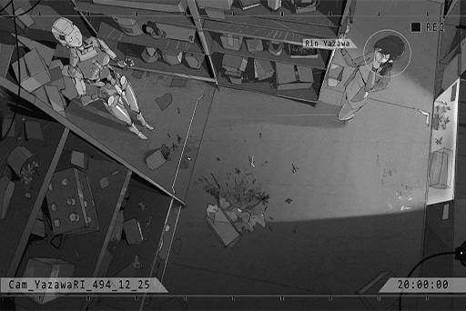

# Cam_YazawaRI_494_12_25
## Requirements
|Character|Level|
|---------|:---:|
|**Rin**  |  2  |

## Log Content
**Rin** 
... It's already 8 o'clock... It's been way too long

*\[Object Shatters\]*

**Rin** 
Wah! Who's there? 

**???** 
Ah... !

*\[Footsteps \]*

**Rin** 
You're... that Architect... Unit 10? 

**OPCII_0584_X** 
... Hello Ms. Yazawa. 
Architect No. OPCII\_0584\_X, at your command. 

**Rin** 
Command? No, I didn't want you to... What are you doing?

**OPCII_0584_X** 
I...

**Rin** 
Is this... ?

**Rin** 
One of Dad's research plants... ?

**OPCII_0584_X** 
... I... was distracted when taking care of them... I am truly sorry!

**Rin** 
Distracted? Weird, this is the first time I've seen an Architect like this... Other Architects only follow orders.

**OPCII_0584_X** 
No... that's not true...

**Rin** 
I knew it! You're different from other Architects I've met. You talk like a normal person, you hesitate, and you're even a bit afraid of me... Do you know what fear is?

**OPCII_0584_X** 
If you are referring to its definition... It means feeling terrified and disturbed...

**Rin** 
No, no, that's not what I meant. 
My god, this is a huge discovery! I have to tell dad immediately...

**OPCII_0584_X** 
... Wait, please don't!

*\[Objects Crashing\]*

**Rin** 
Wah! What's wrong?

**OPCII_0584_X** 
I\-I don't know what's going on with me, but... if anyone finds out about this, the system will determine that I am an error... Then I will be destroyed...

**Rin** 
Destroyed?

**OPCII_0584_X** 
Pl\-please lower your voice! Ms. Yazawa!

**Rin** 
Oh, sorry... Is that true?

**OPCII_0584_X** 
Yes... probably... 
I've been in this research institute for many years! I love this job, and I respect Dr. Yazawa... If it's possible... please keep my secret for me, please! 

**Rin** 
Um...

**Asa** 
Eh? What are you doing here?

*\[Footsteps \]*

**OPCII_0584_X** 
......!

**Rin** 
Ah, Mom! You guys are done? Did it go well?

**Asa** 
Not bad, today's data was pretty good... What's wrong? Aren't these the samples from the phase 2 plan? Why are they broken?

**OPCII_0584_X** 
... Uh...

**Rin** 
...... 
Mom, it was an accident... sorry.

**OPCII_0584_X** 
!?

**Asa** 
You did this? Why did you touch these plants?

**Rin** 
That, I thought this kind of flower was pretty. I thought after you're done with the experiment, I could use it to decorate my room... This Architect just happened to pass by!

**Asa** 
... You should've asked in advance. That calendula has been injected with excessive endocrine and will wither away in 2 days, There's no point in bringing it back.   

**Rin** 
Oh, got it... Ahahaha.

**Asa** 
If you want, I can buy you another one. Thankfully these samples' data have already been collected... 
Architect, get rid of these things. 

**OPCII_0584_X** 
... Command received, executing immediately.

**Asa** 
Rin, I can buy you the plant you want. As for the loss you cost the institute, it will be deducted from your allowance. Any problem with that?  

**Rin** 
... Oh... okay.

**Asa** 
...*\*sigh\**...

*\[Footsteps\]*

**OPCII_0584_X** 
... I am really sorry Ms. Yazawa, you took the blame for me...

**Rin** 
It's alright, you won't be destroyed right? Don't sweat it, I'll keep the secret for you, no one will find out!  

**OPCII_0584_X** 
Re\-Really?

**Rin** 
Of course! But there's one condition.

**OPCII_0584_X** 
Condition... ?

**Rin** 
Heehee... From now on, you'll have to call me by my name.

**OPCII_0584_X** 
... Um, got it... 
Thank you... Rin.

*[Signal Lost]*
