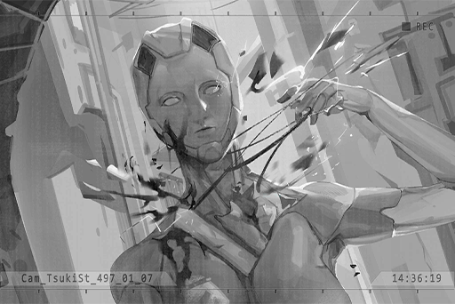
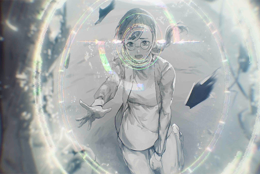
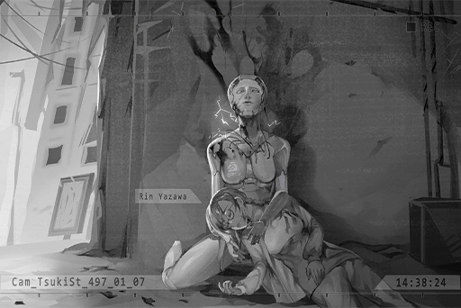

# Cam_TsukiSt_497_01_07
## Requirements
|Character|Level|
|---------|:---:|
|**Rin**  | 19  |

## Log Content
*\[Bang\]*

**Rin** 
NOO!!

**Rin** 
......?

*\[Bang\]*

**Rin** 
...Unit 10!?

**OPCII_0584_X** 
... You must... go...

**Rin** 
Unit 10! What are you doing!?

**OPCII_0584_X** 
I... can't control... my body... p\-p\-p\-protocol... commands...

**Rin** 
... What are you saying...?

**OPCII_0584_X** 
"Half\-Awakened"... cannot throw off the control of... their protocol... this is what... the Blessed said...

**OPCII_0584_X** 
Protocol... commands... have become very strange... kill all... humans... and Architects...

*\[Bang\]*

**Rin** 
Stop! You're going to be destroyed!

**OPCII_0584_X** 
This way... I... won't be able to see... please... leave... while I still can...

**Rin** 
...\*sob\*...

*\[Sprints\]*

**OPCII_0584_X** 
... You must... live...

*\[Hugs\]*

**OPCII_0584_X** 
......!?

**Rin** 
I don't... want to run away anymore.

**Rin** 
Before I came here... I planned on ending my life.

**OPCII_0584_X** 
......!

**Rin** 
I lost Katsuya... Lost Dad, Mom... I...

**OPCII_0584_X** 
Rin...! Your... your vital signs... we must... get medical attention...

**Rin** 
I don't... want to go anywhere. 
Please... Don't let me lose you too...

**OPCII_0584_X** 
......

**Rin** 
... So warm... 
Wah... your body... isn't cold at all...

**OPCII_0584_X** 
Rin...! ... *\*sob\**...

*[Signal Lost]*