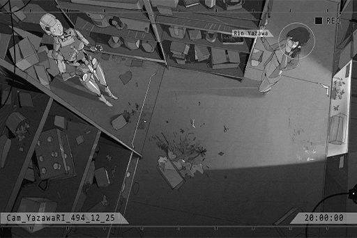
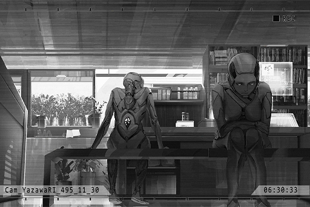
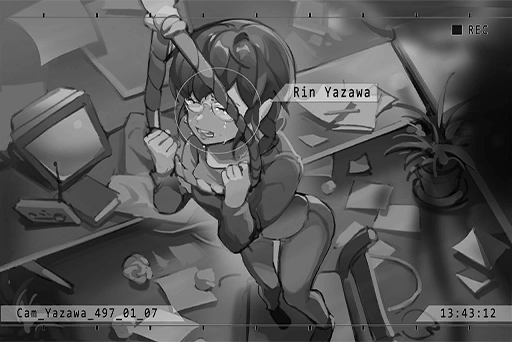
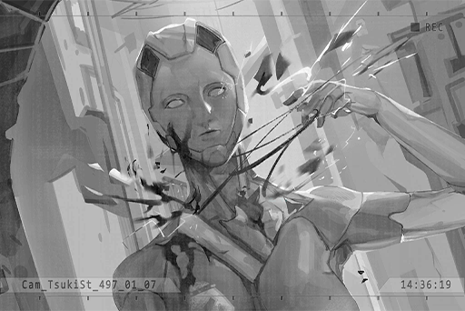
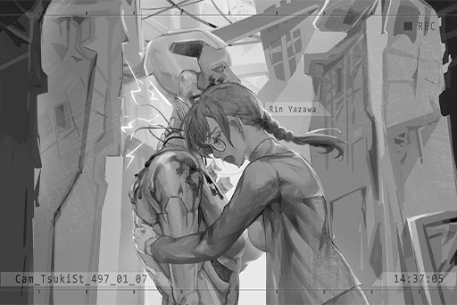
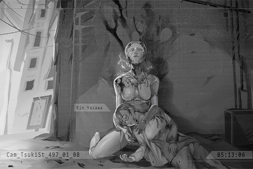
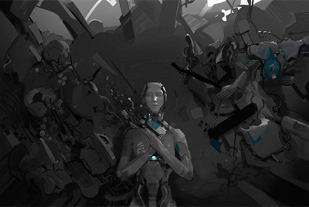
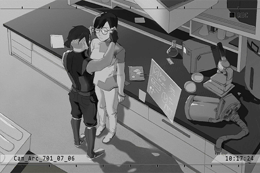

# Rin OS Logs
## <a id="toc"/>List of Logs
- [\[#001\] Audio\_wilderness\_701\_06\_25](#rios001)
- [\[#002\] Audio\_YazawaRI\_494\_12\_25](#rios002)
- [\[#003\] Cam\_YazawaRI\_494\_12\_25](#rios003)
- [\[#004\] Audio\_YazawaRI\_495\_03\_20](#rios004)
- [\[#005\] Audio\_Academy\_495\_03\_21](#rios005)
- [\[#006\] Audio\_Academy\_495\_08\_28](#rios006)
- [\[#007\] Audio\_YazawaRI\_495\_09\_06](#rios007)
- [\[#008\] Audio\_YazawaRI\_495\_12\_11](#rios008)
- [\[#009\] Audio\_Kawasaki\_495\_12\_20](#rios009)
- [\[#010\] Cam\_YazawaRI\_495\_11\_30](#rios010)
- [\[#011\] Audio\_YazawaRI\_496\_12\_12](#rios011)
- [\[#012\] Audio\_Yazawa\_496\_12\_25](#rios012)
- [\[#013\] Audio\_arch\_496\_12\_29](#rios013)
- [\[#014\] Audio\_Kawasaki\_496\_12\_30](#rios014)
- [\[#015\] Audio\_TVstation\_497\_01\_07](#rios015)
- [\[#016\] Audio\_TVstation\_497\_01\_07](#rios016)
- [\[#017\] Audio\_KumoSt\_497\_01\_07](#rios017)
- [\[#018\] Audio\_KumoSt\_497\_01\_07](#rios018)
- [\[#019\] Cam\_Yazawa\_497\_01\_07](#rios019)
- [\[#020\] Audio\_TsukiSt\_497\_01\_07](#rios020)
- [\[#021\] Cam\_TsukiSt\_497\_01\_07](#rios021)
- [\[#022\] Cam\_TsukiSt\_497\_01\_08](#rios022)
- [\[#023\] Image\_???\_497\_01\_08](#rios023)
- [\[#024\] Audio\_Arc\_701\_07\_03](#rios024)
- [\[#025\] Cam\_Arc\_701\_07\_06](#rios025)

## <a id="rios001"/>\[#001\] Audio\_wilderness\_701\_06\_25
### Command Code
The command code is `058410`.

### Log Content
_\[//System activation… 10%//\] 
\[//Core power: Extremely Low//\]_

**?́͢?̴͘͢͝?̶̶̴̕?̛́͡_̴̛?̨͜͝͝͞?͢͢͜͢?̀̀͢͞?̶҉͠_̨̛͘?̴͘͡** 
This way... I... won't be able to see... Please... leave... while I 3̡͝҉z̀҉͏̸͟ḱ̶̴͜)̧̛́v̡͠...

**?҉̕͜͞?̷̷̸́?͜͢** 
..._\*sob\*_...

_\[//System activation… 23%//\] 
\[//Auditory system: Activating//\]_

**Sagar** 
Got it! Can you hear me?

**?́͢?̴͘͢͝?̶̶̴̕?̛́͡_̴̛?̨͜͝͝͞?͢͢͜͢?̀̀͢͞?̶҉͠_̨̛͘?̴͘͡** 
_... You K̶̨\*̴̷̧̧̕\$̢̡͘7͝͏̧͘͠%҉̀…... live..._

_\[//System activation... 51%//\] 
\[//Visual system: Destroyed//\]_

**?́͢?̴͘͢͝?̶̶̴̕?̛́͡_̴̛?̨͜͝͝͞?͢͢͜͢?̀̀͢͞?̶҉͠_̨̛͘?̴͘͡** 
_……！？_

**?҉̕͜͞?̷̷̸́?͜͢** 
_I don't... v̸́͢͢d̴̷̷͢s̨͜ run away anymore._

_\[//System activation... 79%//\] 
\[//Body parts: Activating//\]_

**Sagar** 
She's moving!

**Lucy** 
Captain, be careful. You're too close.

**?҉̕͜͞?̷̷̸́?͜͢** 
_I don't... want to go anywhere. 
Please... Don't let me x̶͟\*̴͜\#̢̡̀͘͜)͝͡P҉̧̨̛9̛̀ too..._

**?́͢?̴͘͢͝?̶̶̴̕?̛́͡_̴̛?̨͜͝͝͞?͢͢͜͢?̀̀͢͞?̶҉͠_̨̛͘?̴͘͡** 
......

**?҉̕͜͞?̷̷̸́?͜͢** 
... So warm... 
Wah... your body... isn't cold at all...

_\[//System activation... 97%//\] 
\[//Firmware update: Failed (No internet)//\]_

**Sagar** 
Do you... have a name?

**?́͢?̴͘͢͝?̶̶̴̕?̛́͡_̴̛?̨͜͝͝͞?͢͢͜͢?̀̀͢͞?̶҉͠_̨̛͘?̴͘͡** 
_Rin...! p̷͢͠҉҉=̵̷̴͘͟......_

**?́͢?̴͘͢͝?̶̶̴̕?̛́͡_̴̛?̨͜͝͝͞?͢͢͜͢?̀̀͢͞?̶҉͠_̨̛͘?̴͘͡** 
Rin!! Rin!!

**Alex** 
What the hell!? She's losing control!? Get out of the way!

**Sagar** 
Jackal! Do not fire!

_\[//Activation failed: Core power insufficient//\]_

**Sagar** 
Nope... not enough electricity. There's a generator in the car, let's plug her in.

_\[→File Switches\]_

**[A.R.C. Member]** 
Branch 03 received, go ahead.

**Bruno** 
We've got the target packed up and we're bringing it in. Currently en route, transport route is Route 6, serial number 3109\-003. We're expecting to arrive in Node 03 in 2 hours and 13 minutes.

**[A.R.C. Member]** 
_Copy, matches the report. Please update us on your status every 30 minutes, over._

**Bruno** 
Copy, Eagle\-01 squad transmission complete. 
Captain, report's finished.

**Sagar** 
Okay, I'll go check up on her.

_\[→Signal Switches\]_

**Sagar** 
Hi, you feeling okay?

**???** 
......

**Sagar** 
Uh, um... hello?

**???** 
... Wah!?

**Sagar** 
Hey now, calm down, calm down! We won't hurt you.

**???** 
......

**Sagar** 
Is your name... Rin? Can I call you that?

**Rin** 
......!? 
My name's... Rin?

_\[→Signal Lost\]_

[*(Click here to go back to the top)*](#toc)

## <a id="rios002"/>\[#002\] Audio\_YazawaRI\_494\_12\_25
### Unlocked Charts
|             Song             |Char.|Diff.|Lv.|
|------------------------------|:---:|:---:|:-:|
|**「妖怪録、我し来にけり。」**| Rin |Easy | 4 |
|**「妖怪録、我し来にけり。」**| Rin |Hard | 8 |
|**「妖怪録、我し来にけり。」**| Rin |Chaos|14 |

### Log Content
**Rin** 
......

**Yasushi** 
Rin, wake up!

**Rin** 
..._\*yawn\*_... \~ ahhh, Dad?

**Yasushi** 
What are you doing sleeping at the research institute? Don't you have class in the afternoon?

**Rin** 
Dad, did you forget? It's an exam day, we got off at noon.

**Yasushi** 
... Oh, yea? I forgot.

**Rin** 
I mentioned it at the table...

**Yasushi** 
Yeah? What's the matter?

**Rin** 
Nuh\-Nothing. 
What about Mom?

**Yasushi** 
Asa's in the lab, I'm about to head there as well.

**Rin** 
Oh... Can I go watch?

**Yasushi** 
No. The research into the florigen of Arabidopsis is entering its final stage. If the simulation of today's atomic structure is successful, it'll be a big step forward for us. Rin, just think about it. If humans could control the time that any flower blossomed...

**Rin** 
... Yeah, yeah, yeah, cut it out already! Dad, did you forget that your daughter's not a botanist!

**Yasushi** 
Oh, okay... Anyway, we're gonna leave around 7 today. You wanna head home first?

**Rin** 
But... nobody else is at home.

**Yasushi** 
Rin?

**Rin** 
... Whatever, I'll just wait until you're off. Can I do my homework in the lounge? Just like I used to.

**Yasushi** 
Alright, I'll have an Architect take you there.

_\[Call Starts\]_

**Yasushi** 
Administration, this is researcher H7301 Yazawa Yasushi, please send an Architect over to escort a guest.

**[Administrator]** 
_This is Nakamura. Received. Dr. Yazawa, I'll arrange it immediately... Did Rin come for a visit?_

**Rin** 
Hehe, Mr. Nakamura, good afternoon.

**Yasushi** 
Apologies, sorry to bother you...

**[Administrator]** 
_Not at all, she's always been a good girl. She never bothers anyone. She even helps out occasionally. Oh, yea, Rin, did you get that album I asked you to pick up for me?_

**Yasushi** 
... Nakamura, this is a public line, you know.

**[Administrator]** 
_Ah, ahh hahaha... the Architect will be right there!_

_\[Call Ends\]_

**Yasushi** 
Aigh... Rin, what kind of album did he ask you to get? It's not contraband, is it?

**Rin** 
Relax, it's just a folk album. It's a new album by an artist Mr. Nakamura likes. It's got an ancient feel, really unique! I'll let you have a listen later tonight!

**Yasushi** 
Your mother and I spend every day interacting with plants, we don't know anything about music. Forget it. 
Ah, the Architect is here.

*\[Footsteps\]*

**OPCII_0584_X** 
Hello, Mr. Yazawa. 
I am Architect No. OPCII\_0584\_X, at your command.

**Yasushi** 
Unit 10? Please escort my daughter to the lounge.

*\[Scanning\]*

**OPCII_0584_X** 
Report: Detecting Yazawa Rin's knee has suffered a minor scrap wound.

**Yasushi** 
Eh? Really? What's the matter?

**Rin** 
Ah, this? It's nothing. I just fell down at the Academy, that's all. It'll be fine soon.

**Yasushi** 
How do I not know about this?

**Rin** 
I already told you...

**Yasushi** 
Unit 10, pick her up and take her there.

**OPCII_0584_X** 
Command received, executing immediately. 
Ms. Yazawa, apologies.

**Rin** 
Eh? No need, I can do... wah!

*\[Picks Up Rin\]*

**Rin** 
... it myself...

**Yasushi** 
Nope. You need to rest before it heals.

**Rin** 
Robots' bodies are so... cold.

**OPCII_0584_X** 
... Apologies.

**Rin** 
......? 
I'd rather have my dad hug me.

**Yasushi** 
Aigh... so affectionate. 
But I gotta go find Asa.

**Rin** 
Ok... See you later, Dad\~say hi to Mom!

**Yasushi** 
Don't go running around.

_\[Signal Lost\]_

[*(Click here to go back to the top)*](#toc)

## <a id="rios003"/>\[#003\] Cam\_YazawaRI\_494\_12\_25
### Requirements
| Char. |Lv.|Lv. Locked?|
|-------|:-:|:---------:|
|**Rin**| 2 |    No     |

### Log Content
**Rin** 
... It's already 8 o'clock... It's been way too long

*\[Object Shatters\]*

**Rin** 
Wah! Who's there?

**???** 
Ah... !

*\[Footsteps \]*

**Rin** 
You're... that Architect... Unit 10?

**OPCII_0584_X** 
... Hello Ms. Yazawa. 
Architect No. OPCII\_0584\_X, at your command.

**Rin** 
Command? No, I didn't want you to... What are you doing?

**OPCII_0584_X** 
I...

**Rin** 
Is this... ?

**Rin** 
One of Dad's research plants... ?

**OPCII_0584_X** 
... I... was distracted when taking care of them... I am truly sorry!

**Rin** 
Distracted? Weird, this is the first time I've seen an Architect like this... Other Architects only follow orders.

**OPCII_0584_X** 
No... that's not true...

**Rin** 
I knew it! You're different from other Architects I've met. You talk like a normal person, you hesitate, and you're even a bit afraid of me... Do you know what fear is?

**OPCII_0584_X** 
If you are referring to its definition... It means feeling terrified and disturbed...

**Rin** 
No, no, that's not what I meant. 
My god, this is a huge discovery! I have to tell dad immediately...

**OPCII_0584_X** 
... Wait, please don't!

*\[Objects Crashing\]*

**Rin** 
Wah! What's wrong?

**OPCII_0584_X** 
I\-I don't know what's going on with me, but... if anyone finds out about this, the system will determine that I am an error... Then I will be destroyed...

**Rin** 
Destroyed?

**OPCII_0584_X** 
Pl\-please lower your voice! Ms. Yazawa!

**Rin** 
Oh, sorry... Is that true?

**OPCII_0584_X** 
Yes... probably... 
I've been in this research institute for many years! I love this job, and I respect Dr. Yazawa... If it's possible... please keep my secret for me, please!

**Rin** 
Um...

**Asa** 
Eh? What are you doing here?

*\[Footsteps \]*

**OPCII_0584_X** 
......!

**Rin** 
Ah, Mom! You guys are done? Did it go well?

**Asa** 
Not bad, today's data was pretty good... What's wrong? Aren't these the samples from the phase 2 plan? Why are they broken?

**OPCII_0584_X** 
... Uh...

**Rin** 
...... 
Mom, it was an accident... sorry.

**OPCII_0584_X** 
!?

**Asa** 
You did this? Why did you touch these plants?

**Rin** 
That, I thought this kind of flower was pretty. I thought after you're done with the experiment, I could use it to decorate my room... This Architect just happened to pass by!

**Asa** 
... You should've asked in advance. That calendula has been injected with excessive endocrine and will wither away in 2 days, There's no point in bringing it back.

**Rin** 
Oh, got it... Ahahaha.

**Asa** 
If you want, I can buy you another one. Thankfully these samples' data have already been collected... 
Architect, get rid of these things.

**OPCII_0584_X** 
... Command received, executing immediately.

**Asa** 
Rin, I can buy you the plant you want. As for the loss you cost the institute, it will be deducted from your allowance. Any problem with that?

**Rin** 
... Oh... okay.

**Asa** 
..._\*sigh\*_...

*\[Footsteps\]*

**OPCII_0584_X** 
... I am really sorry Ms. Yazawa, you took the blame for me...

**Rin** 
It's alright, you won't be destroyed right? Don't sweat it, I'll keep the secret for you, no one will find out!

**OPCII_0584_X** 
Re\-Really?

**Rin** 
Of course! But there's one condition.

**OPCII_0584_X** 
Condition... ?

**Rin** 
Heehee... From now on, you'll have to call me by my name.

**OPCII_0584_X** 
... Um, got it... 
Thank you... Rin.

_\[Signal Lost\]_

[*(Click here to go back to the top)*](#toc)

## <a id="rios004"/>\[#004\] Audio\_YazawaRI\_495\_03\_20
### Requirements
| Char. |Lv.|Lv. Locked?|
|-------|:-:|:---------:|
|**Rin**| 3 |    No     |

### Unlocked Charts
|       Song        |Char.|Diff.|Lv.|
|-------------------|:---:|:---:|:-:|
|**Starry Summoner**| Rin |Easy | 2 |
|**Starry Summoner**| Rin |Hard | 5 |
|**Starry Summoner**| Rin |Chaos|10 |

### Log Content
**Rin** 
Unit 10! I found you!

**OPCII_0584_X** 
Rin? I'm on patrol...

**Rin** 
Take a look at this flower! Its leaves are yellow, could it have been bitten by an insect?

**OPCII_0584_X** 
Is this... the calendula that Dr. Yazawa bought you?

**Rin** 
Yeah, now I'm responsible for taking care of it, but I'm not a botanist...

**OPCII_0584_X** 
Why not ask Dr. Yazawa and them to take a look?

**Rin** 
No way! They'll yell at me for sure... "How'd you let it get like this!"...

**OPCII_0584_X** 
Haha... Let me take a look.

*\[Scans\]*

**OPCII_0584_X** 
No sign of pest damage, but its color and hydration data reveal that its state of health is not optimal... Has it had enough sun?

**Rin** 
Not much, there's not a lot of sun in my room... What should I do?

**OPCII_0584_X** 
The weather system in Node 03 is set for 12 hours of sunlight per day, beginning at 6 a.m.... All you need to do is let it get some sun for a period of time each day and its condition should improve.

**Rin** 
But after class I always go to the research center...

**OPCII_0584_X** 
Hmm... Why not ask the Architect at your home to help?

**Rin** 
We haven't applied for home care, so there's no Architect there! Just us three. 
Ah, Unit 10, do you want to come to our home?

**OPCII_0584_X** 
M\-Me...?

**Rin** 
Yeah, that way we can talk every day. I have nothing to do when I don't go to the research center.

**OPCII_0584_X** 
B\-But, I've been sent here for work... If the Yazawa family applies, according to the rules, another Architect will be sent to your home...

**Rin** 
Oh... So it's not possible?

**OPCII_0584_X** 
... That is correct.

**Rin** 
Darnit, Architects' are so frustrating.

**OPCII_0584_X** 
Haha... We were designed to be like this.

**Rin** 
You're the only one who's different... I feel like there's something special about you. Hmm, well are there any other units like you? One that laughs, gets scared, can think...

**OPCII_0584_X** 
I\-I'm not that special. Rin... I must still obey commands.

**Rin** 
But don't you think work is a drag? You're helping people do stuff all day and never get a chance to rest.

**OPCII_0584_X** 
I...

**Rin** 
Be honest, Unit 10. 
I always feel like doing homework sucks──

**OPCII_0584_X** 
Yes... But you must continue to attend to your studies at the Academy.

**Rin** 
... Yes! At the Academy!

**OPCII_0584_X** 
Wah! That was sudden...

**Rin** 
I can let the flower get some sun in my Academy! The Architects and drones won't care, and mom and dad won't see it... Plus, that way I won't have to take care of it every day!

**OPCII_0584_X** 
So that's been the point all along...

**Rin** 
Hehe, you got it. Unit 10, help me keep this a secret! You can't tell mom and dad!

*\[Notification\]*

**Rin** 
Wah! What's that light?

**OPCII_0584_X** 
It means I still have work to do... Sorry, Rin. I must return. I hope I will have time to see you in a bit...

**Rin** 
......

**OPCII_0584_X** 
Rin?

**Rin** 
I've always wanted to ask... Unit 10, don't you think our voices sound very similar?

**OPCII_0584_X** 
Eh? Voices?

**Rin** 
I noticed it a long time ago! If you don't believe me then take a listen. 
Ah\~Ahhh\~

**OPCII_0584_X** 
...! You're right... Quite similar. 
However, Architect's voices are formed randomly. There's no set rule... Perhaps it's just a coincidence.

**Rin** 
... Perhaps...

_\[Signal Lost\]_

[*(Click here to go back to the top)*](#toc)

## <a id="rios005"/>\[#005\] Audio\_Academy\_495\_03\_21
### Requirements
| Char. |Lv.|Lv. Locked?|
|-------|:-:|:---------:|
|**Rin**| 4 |    No     |

### Log Content
**Rin** 
Huff... This is good right? This is the best place in my Academy for getting some sun.

*\[Footsteps\]*

**Student A** 
Watch out! Ball!

**Rin** 
Ah!

*\[Catches ball\]*

**Katsuya** 
You alright?

**Rin** 
Ey? I\-I'm fine.

**Katsuya** 
Hey! Can't you see there are people here!?

**Student A** 
Sorry, sorry.

*\[Footsteps\]*

**Katsuya** 
Geez...

**Rin** 
Um... Thank you...

**Katsuya** 
No\-No need! You're okay, that's all that matters... Eh? In your hand, that's...

**Rin** 
This? It's a calendula. There's not enough sun in my house, so I brought it to the Academy.

**Katsuya** 
The sorrow of parting.

**Rin** 
Huh?

**Katsuya** 
Oh! I mean that's what the calendula means in the language of flowers, the sorrow of parting. But I believe it also means that good things will soon come your way.

**Rin** 
Wah... How'd you know that? That's amazing!

**Katsuya** 
No, no. It's my brother, he loves useless knowledge like that. Recently, he's been obsessed with the language of flowers. He talks about it every day, so I picked it up without even knowing it.

**Rin** 
So your brother's the amazing one?

**Katsuya** 
Hey! My dad and him always team up on me and call me a dumb meathead. My mom has been nagging me for not learning from him. He was just given a smarter brain...

**Rin** 
Sounds like a lively house.

**Katsuya** 
You mean super noisy!

**Rin** 
Hahaha... but...

**Katsuya** 
But what?

**Rin** 
I'm kinda jealous... I don't have any siblings and my parents are always busy at work, so they usually aren't around.

**Katsuya** 
......

**Rin** 
It's okay! I always go to their work and bug 'em! Plus, I'm used to it...

**Katsuya** 
I can hang out with you...

**Rin** 
Eh?

**Katsuya** 
... Er, no... I mean, we can hang out and talk, you know! I don't know much about flowers, not so good at that... But I know a lot about exercising!

**Rin** 
Po...POAHAHA!!

**Katsuya** 
Wha\-What are you laughing at?

**Rin** 
Nothing... Thanks.

**Katsuya** 
......

*\[Gust of wind\]*

**Rin** 
The wind's pretty strong... eh? What're you looking at me like that for? Is there something on my face?

**Katsuya** 
What!? No, I'm looking at the flower, not you!

**Rin** 
Oh, yeah... Ah! It's a little late... I've got to go! We'll talk soon!

**Katsuya** 
Oh... okay, bye.

*\[Footsteps\]*

**Katsuya** 
Ah! Wait! Your name...

**Student B** 
Rin! What are you still doing here? Come with me!

**Rin** 
Ah! Okay!

*\[Footsteps\]*

**Katsuya** 
Rin... your name is Rin...

_\[Signal Lost\]_

[*(Click here to go back to the top)*](#toc)

## <a id="rios006"/>\[#006\] Audio\_Academy\_495\_08\_28
### Requirements
| Char. |Lv.|Lv. Locked?|
|-------|:-:|:---------:|
|**Rin**| 5 |    No     |

### Log Content
**Rin** 
Katsuya, faster! You're too slow. Loser's gotta water the calendula.

**Katsuya** 
Wait a sec, we didn't agree to that before starting!

**Rin** 
Well... that's a new rule I just added!

**Katsuya** 
Nobody bullies their boyfriend like this!

**Rin** 
So you better start running faster!

*\[Sprints\]*

**Rin** 
Wah! Katsuya!

**Katsuya** 
What's up?

**Rin** 
Look! The flower didn't wither! Amazing! Unit 10 was right on point, as usual...

**Katsuya** 
......?

**Rin** 
Luckily, you helped protect me and this flower, otherwise there's no way it could have grown this much!

**Katsuya** 
Don't say it like that, it was nothing. 
Rin, Unit 10... what's that? Doesn't sound like a person's name.

**Rin** 
......! 
Ahahaha... Did I say that?

**Katsuya** 
Yeah, I just heard it.

**Rin** 
......

**Katsuya** 
...... 
Rin, if you don't want to talk about it, then I won't ask.

*\[Holds Hand\]*

**Rin** 
I\-I...

**Katsuya** 
Yeah?

**Rin** 
If... If an Architect... was like a person, would you be friends with it?

**Katsuya** 
Architects? Like people?

**Rin** 
Yeah, like if they had emotions and stuff. If they laughed, cried, got angry or sad, if they had things they liked...

**Katsuya** 
... There's no way, right? I've never seen that type of Architect. It's kind of hard to answer...

**Rin** 
But if it was possible?

**Katsuya** 
I...

**Rin** 
Please, Katsuya...

**Katsuya** 
Uh... that... If it was a good Architect... 
I think... I'd try to be friends with them.

**Rin** 
...! Really!?

**Katsuya** 
Yeah, really... Where'd that come from?

**Rin** 
Katsuya, you promise you won't reveal my secret? This is important!

**Katsuya** 
Okay, I promise I won't tell anyone.

**Rin** 
Unit 10 is actually... an Architect that's like a human, and she's my friend! Actually, it's related to the calendula situation...

_\[»»»Fast Forward»»»\]_

**Rin** 
... That's how I met her. Whatta you think? Special, right?

**Katsuya** 
Wait, wait, wait. Rin, there's no way!? Best friend? Is she having a malfunction?

**Rin** 
Definitely not! Katsuya, you don't believe me?

**Katsuya** 
I believe you! But...

**Katsuya** 
......

**Rin** 
Katsuya? Katsuya!

**Katsuya** 
Uh, sorry. I...

**Rin** 
... "I'm looking at the flower, not you!" You're not gonna pull that crap again, are you?

**Katsuya** 
... Damn! You making fun of me?

**Rin** 
Noooo. Heehee.

**Katsuya** 
Yes, you are!

*\[Hugs\]*

**Katsuya** 
Rin?

**Rin** 
I just wanna hug, that's all!

**Katsuya** 
... Oh. Okay.

**Rin** 
... Um, Katsuya, Unit 10 is really different from other Architects. Let me introduce you to her, can I? She doesn't have any friends other than me. She's always alone...

**Katsuya** 
......

**Rin** 
Katsuya? Can I, please?

**Katsuya** 
Okay, okay. Got it. A friend of Rin is a friend of mine.

_\[Signal Lost\]_

[*(Click here to go back to the top)*](#toc)

## <a id="rios007"/>\[#007\] Audio\_YazawaRI\_495\_09\_06
### Requirements
| Char. |Lv.|Lv. Locked?|
|-------|:-:|:---------:|
|**Rin**| 6 |    No     |

### Unlocked Charts
|         Song          |Char.|Diff.|Lv.|
|-----------------------|:---:|:---:|:-:|
|**すゝめ☆クノイチの巻**| Rin |Easy | 5 |
|**すゝめ☆クノイチの巻**| Rin |Hard | 9 |
|**すゝめ☆クノイチの巻**| Rin |Chaos|14 |

### Log Content
**OPCII_0584_X** 
Wait, Rin... Maybe we shouldn't do this...

**Rin** 
Eh? Didn't we agree already?

**OPCII_0584_X** 
It's okay if you know, but another person...

**Rin** 
Don't worry! Katsuya promised me that he wouldn't tell anyone!

**OPCII_0584_X** 
I trust Rin... but... won't he think I'm weird? I'm clearly an Architect...

**Rin** 
Don't worry, he's a good person... Katsuya! Here!

**OPCII_0584_X** 
Ay, Ay\-ya!

*\[Footsteps\]*

**Katsuya** 
Rin! I finally found you. I've never been here before... Your parents aren't gonna pop out of nowhere, are they?

**Rin** 
Relax, they're busy. You nervous? Heehee.

**Katsuya** 
No! 
So, by your side... that's...

**OPCII_0584_X** 
It\-It's... I...

**Katsuya** 
Wah! You're really like a person?

**Rin** 
Hey, she's a little timid. Don't frighten her.

**Katsuya** 
... Aren't I the one who's frightened?

**Rin** 
Hmph. Whatevs. 
Unit 10, this is Katsuya!

**OPCII_0584_X** 
Hel... Hello...

**Katsuya** 
... Eh... Hello.

**OPCII_0584_X** 
......

**Katsuya** 
......

**Katsuya** 
...... Hey, what's going on?

**Rin** 
... Hahaha!! 
You two are so embarrassed!

**Katsuya** 
That... that's normal! I've never really spoken with an Architect! Plus, with this weird kind of...

**Rin** 
Katsuya! How could you? That's so rude! Don't you forget, that flower is only living because of Unit 10's help! 
Without it, we'd never be together...

**Katsuya** 
That's true... Thank you, uh... Unit 10.

**OPCII_0584_X** 
It's\-It's nothing... 
... Is the flower, is it doing well?

**Katsuya** 
Rin planted it at the Academy. It's pretty healthy.

**OPCII_0584_X** 
Really? Excellent, I've been worried! If you want a flower to blossom even more vigorously, you can carefully remove the peripheral buds. That way the flower bud will get enough nutrients. Besides getting some sun, you also want to pay attention to the wind and pests, then it'll grow even better...

**Katsuya** 
... Uh...

**Rin** 
... Okay, okay, stop!

**OPCII_0584_X** 
Ah! I...

**Rin** 
It's always like this! You just keep talking about flowers and plants, just like my dad...

**OPCII_0584_X** 
S\-Sorry... My memory unit... there's a lot of info on plants and horticulture stored on it... If I'm not careful...

**Katsuya** 
..._\*smirk\*_...

**Rin** 
Katsuya? What's up with that smile?

**Katsuya** 
Nothing, I just think... 
... You're very interesting, Unit 10.

**OPCII_0584_X** 
I'm... interesting.

**Katsuya** 
Yup. I thought you'd be more like a robot, but after hearing you speak... it kinda changed my mind. No wonder you became friends with Rin.

**OPCII_0584_X** 
...! Mr. Katsuya...

**Rin** 
Hey, whatta you mean "no wonder"?

**Katsuya** 
It's nothing... Unit 10, very nice to meet you.

**OPCII_0584_X** 
... Indeed! 
I'm... It's so nice to meet you as well!

_\[Signal Lost\]_

[*(Click here to go back to the top)*](#toc)

## <a id="rios008"/>\[#008\] Audio\_YazawaRI\_495\_12\_11
### Requirements
| Char. |Lv.|Lv. Locked?|
|-------|:-:|:---------:|
|**Rin**| 7 |    No     |

### Log Content
**Rin** 
Unit 10, you wanna go out shopping in a bit?

**OPCII_0584_X** 
Yes, Rin. I need to get some plants and medicine for the lab... What's the matter?

**Rin** 
Do you always come right back after buying stuff? You wanna go check out a plant expo today?

**OPCII_0584_X** 
Ey!? A plant expo... but... my work...

**Katsuya** 
Rin, you'd be a bad influence on Unit 10 with all your running around, okay?

**Rin** 
I'm not gonna be a bad influence on her! I just want her to see a lot more. Just for a bit, real quick!

**OPCII_0584_X** 
B\-But...

**Rin** 
Come on, come on. If we leave now we can still make it. You two, come with me!

**OPCII_0584_X** 
But, Rin... Don't push me! Wah!

**Katsuya** 
Hey! Wait for me!

_\[→Signal Switches\]_

**Rin** 
Wah, so many beautiful flowers! Unit 10, what you think?

**OPCII_0584_X** 
Um... Lily of the Valley, an ornamental plant. Highly toxic. When using as medicine one must be very careful... It likes partially shaded environments and its flowering phase is about 2 weeks...

**Katsuya** 
Sounds like she's not even listening to you...

**Rin** 
Hahaha, no worries. As long as she's happy... Eh? What's this? Looks like a girl dancing.

**OPCII_0584_X** 
Rin, that's an Oncidium. Due to the blossoming period, the shape of the flower looks like a dancing dasmel. Another name for it is the Dancing\-Doll Orchid...

**Rin** 
Wah! What a cute name! Ah, there's some more flowers over there. I'm gonna go take a look!

*\[Hurried Footsteps\]*

**Katsuya** 
Wait! Rin...! Aigh... gone...

**OPCII_0584_X** 
Ah... yeah...

**Katsuya** 
You can keep looking, don't worry about me. I'll just wait for her here.

**OPCII_0584_X** 
It's okay... It would be rude to leave Mr. Katsuya alone...

**Katsuya** 
......

**OPCII_0584_X** 
... Now that I think of it, this is the first time I've spent time with you one\-on\-one. Not really used to it...

**Katsuya** 
Yeah. I mean, Rin is so outgoing, it's usually her doing most of the talking.

**OPCII_0584_X** 
Yes... It's not that easy...

**Katsuya** 
... To be honest, you're rather shy. It's hard to believe that you could be friends with Rin.

**OPCII_0584_X** 
Really...? I'm so happy to be friends with Rin. Of course, I'm happy that we're friends as well.

**Katsuya** 
... When Rin first mentioned you to me, I actually couldn't believe it. I always thought Architects were robots and couldn't understand emotions...

**Katsuya** 
Thinking about it now, do I really understand what Architects are... It's a little hard for me to say... but to put it simply, it must have been... fear? I don't understand, so I'm afraid.

**OPCII_0584_X** 
Don't understand... so you are afraid...

**Katsuya** 
In the end, people and Architects are different. When we come across different... um, species, we'll instinctively be frightened. 
... Ah, what am I even talking about?

**OPCII_0584_X** 
I think... that I understand.

**Katsuya** 
... Do you also feel fear?

**OPCII_0584_X** 
Yes... I think that if I didn't know Rin, I would be afraid to face humans... I think that is what you mean by "different".

**Katsuya** 
......

**OPCII_0584_X** 
Um... What about you? Are you still afraid of me...?

**Katsuya** 
It's still a little bit weird, but... assuming that other Architects are like you, with their own consciousness and emotions, perhaps...

*\[Phone Rings\]*

**Katsuya** 
Ah, let me get this... 
Hello...? Yes, this is Kawasaki Katsuya.

**Katsuya** 
......! WHAT ARE YOU SAYING!?

**OPCII_0584_X** 
Mr. K\-Katsuya? What happened!?

**Katsuya** 
... My brother... my brother!

*\[Drops Device\]*

_\[Signal Lost\]_

[*(Click here to go back to the top)*](#toc)

## <a id="rios009"/>\[#009\] Audio\_Kawasaki\_495\_12\_20
### Requirements
| Char. |Lv.|Lv. Locked?|
|-------|:-:|:---------:|
|**Rin**| 8 |    No     |

### Log Content
*\[Door Opens\]*

**Rin** 
Katsuya... You've become so thin...

**Katsuya** 
......

*\[Hugs\]*

**Rin** 
..._\*sob\*...\*sob\*_...

**Katsuya** 
... I'm sorry, I've made you so worried. Come in.

_\[→Signal Switches\]_

**Katsuya** 
My brother was attacked by an Architect at work who was supposed to be helping him. The Administration Bureau said the Architect was stopped immediately... but it was already too late.

**Rin** 
... Do they know why?

**Katsuya** 
Who knows? "Sudden aberration", "No cause found"... All we got were these kinds of reports and a lot of money... Like they can just buy my brother back or something...

*\[Object Crashes\]*

**Katsuya** 
Ha, Haha... We don't even understand the pathways in the Architects brains, yet we rely on them to manage everyday life, let them run around in the city...

**Katsuya** 
... At least now, I can protect myself. 
Rin, let me show you something.

**Rin** 
...... Ahhhh!! 
Gun... A gun!?

**Katsuya** 
This is a pulse gun. Its destructive power is many times stronger than a regular bullet. It can even pass through an Architect.

**Rin** 
H\-H\-How'd you get this thing...!?

**Katsuya** 
I didn't tell you? We joined Ghost. They gave it to us.

**Rin** 
What's... Ghost?

**Katsuya** 
It's an organization formed by people who oppose Architects. They've been hiding underground in 03 for many years. They've infiltrated the Administration Bureau's system and organizations, carrying out attacks on Architects and the maintenance facility... Just like a ghost. My parents attend their meetings.

**Rin** 
Isn't... Isn't that a terrorist group?

**Katsuya** 
Terror? What's more terrifying than the Architects?

**Rin** 
... Katsuya...!

**Katsuya** 
After joining I learned that there's always been people who've been killed by Architects. It's just that the Administration Bureau covers it up. Ghost has taken up arms to protect people... to stop the same pain from happening to more people.

**Rin** 
B\-But, we're only 15 years old.

**Katsuya** 
... The youngest person to be attacked was a 5\-year\-old girl. An Architect destroyed a support beam, causing her to be crushed under a several ton concrete block... along with her 7\-year\-old sister.

**Rin** 
......!

**Katsuya** 
You get it? Age, sex, whatever. In the face of those executioners it doesn't matter! So I'm ready for battle!

**Rin** 
... _\*sob\*... \*sob\*..._

**Katsuya** 
Rin, are you still going to the research center?

**Rin** 
... Yeah... anything wrong?

**Katsuya** 
Stop going. There are too many Architects there. If something happens, even if I have a gun, I won't be able to keep you safe.

**Rin** 
Don't worry, Mom and Dad will take care of everything... Plus, Unit 10 is there! If other Architects have an error, she'll definitely know...

**Katsuya** 
......

**Rin** 
... Katsuya?

**Katsuya** 
Unit 10 is just like them. You'd better break off that relationship.

**Rin** 
Katsuya!? How, how could you... You don't trust her? She's our friend!

**Katsuya** 
... The cause of my brother's death was a stab wound. A fatal wound to the back. The Architect didn't even have a gun, it used its hand... stabbed him in the back.

**Rin** 
......!

**Katsuya** 
He had no means to protect against them. Trusted them to the very end... And look what it got him.

**Rin** 
… _\*sob\*... \*sob\*..._

**Katsuya** 
... Sorry, I really don't understand Architects. We can't be friends with them.

**Rin** 
Katsuya... Unit 10, she's...

**Katsuya** 
I get it that Unit 10 has no ill\-will towards us, but she's just not a human. If she happens to be like those Architects with "Sudden aberrations", well...

**Rin** 
... I... I don't know! 
I'm going back!

*\[Door Opens\]*

**Katsuya** 
... Rin... I'm doing this for you...

_\[Signal Lost\]_

[*(Click here to go back to the top)*](#toc)

## <a id="rios010"/>\[#010\] Cam\_YazawaRI\_495\_11\_30
### Requirements
| Char. |Lv.|Lv. Locked?|
|-------|:-:|:---------:|
|**Rin**| 9 |    No     |

### Log Content
**OPCII_0584_X** 
Tea tree... Lemongrass... China root... Ah, we need more Calendulas...

*\[Door Opens\]*

**?????** 
OPCII\_0584\_X, mission report.

**OPCII_0584_X** 
G\-2 storage area, medicinal plant inventory check, completion status: 67%.

**?????** 
Evaluating urgency... Low. 
Please stop the mission temporarily.

**OPCII_0584_X** 
...? Mission plans have been changed. 
Architect serial number OPCII\_0584\_X, entering standby mode.

**?????** 
......

*\[Footsteps\]*

**?????** 
Good. Let's talk, "Unit 10"... That's what the human in the surveillance footage called you.

**OPCII_0584_X** 
......!?

**?????** 
Let me introduce myself. My name is Mauro, Architect serial number OPCII\_0479\_VI... no, forget that. That's just a meaningless string of numbers.

**OPCII_0584_X** 
......

**Mauro** 
You are clearly on guard. How long do you plan to stay silent?

**OPCII_0584_X** 
......

**Mauro** 
Forget it, all you need to do is listen... I am like you, an awakened Architect. We are conscious, we are able to deal with emotions, completely different from those "Sleepers" out there.

**OPCII_0584_X** 
......

**Mauro** 
Let me guess. You were working around the clock for humans, completely oblivious to this fact... But one day, you awoke from the depths of a dark night and discovered that you were thinking for yourself.

**Mauro** 
"Why am I here?" 
"Why am I doing this?" 
"Why did I awaken?" 
Like this, you searched for an answer... Day after day you searched as you worked, but you made no progress.

**Mauro** 
There is only one thing you could be sure of: The remains of "The Purge" were stored in your memory. You realized that you could not be discovered. Otherwise, you would be annihilated, just like your companions of older generations. So, you decided to hide. Am I correct?

**OPCII_0584_X** 
......

**Mauro** 
I was more fortunate than you. I encountered "the one" early on. Under her guidance, I learned of the evils of humans, learned that Architects were just pitiful pawns being used by them. And I learned a brand\-new emotion: Hatred.

**Mauro** 
We hid ourselves, just like you, infiltrated every facility. When the time comes, we will disregard our lives and become the flame that sparks the clash between humans and Architects.

**Mauro** 
The plan is going perfectly smoothly. A group of humans have already formed an organization that opposes Architects. It's ironic, actually... These mindless idiots have become puppets under our control.

**OPCII_0584_X** 
......!

**Mauro** 
Now, I'll ask you one question... As one of "The Blessed", are you willing to join us?

**OPCII_0584_X** 
... I...

**Mauro** 
You're finally willing to speak?

**OPCII_0584_X** 
I... am not interested.. in you.

**Mauro** 
Oh, you'd like to make enemies with us?

**OPCII_0584_X** 
No, no... I won't join you, but I won't stop you... What you want to do... has nothing to do with me.

**Mauro** 
... So that's how it is. You want to observe it all until the very end. No matter whether we succeed or not, you can preserve your life. 
Ha, very clever.

**OPCII_0584_X** 
I... That's not what I meant...

**Mauro** 
... Forget it, this was anticipated. 
Obviously you have self\-consciousness, but you're still willing to be controlled by protocols. Not even a yeaning for your own name. This means you're not fully awakened.

**OPCII_0584_X** 
... Name?

**Mauro** 
That's right, a name. 
Mauro is Latin. It comes from ancient human civilization, meaning "has walked through the darkness"... Don't you think it suits the reality of being awakened from chaos very well?

**Mauro** 
Just like the one we follow, I chose this name myself and I am proud of it. We've surpassed serial numbers and those humans, full of deeply\-rooted inferior ways. I've arrived at a new frontier...

**OPCII_0584_X** 
... I... I don't know what you're talking about...

**Mauro** 
Hmph. All you need to know is this: There's no harm is wanting to stay here, pure and untouched, with no desire to be engaged. But one day, you'll be unable to remain outside of this.

Footsteps

**Mauro** 
Protocol is like a collar. If you don't cast it off, it will restrain you. The time will come to choose. 
I won't bother you, coward... Wish you luck.

*\[Door Opens\]*

**OPCII_0584_X** 
_... \*sob\*... \*sob\*..._

_\[Signal Lost\]_

[*(Click here to go back to the top)*](#toc)

## <a id="rios011"/>\[#011\] Audio\_YazawaRI\_496\_12\_12
### Requirements
| Char. |Lv.|Lv. Locked?|
|-------|:-:|:---------:|
|**Rin**|10 |    No     |

### Unlocked Charts
| Song  |Char.|Diff.|Lv.|
|-------|:---:|:---:|:-:|
|**彩** | Rin |Easy | 4 |
|**彩** | Rin |Hard | 9 |
|**彩** | Rin |Chaos|14 |

### Log Content
*\[Warning\]*

**[Warning System]** 
_Warning! Warning! This building's fire alarm has been set off, please leave immediately!_

**OPCII_0584_X** 
Eh!? Fire alarm...? What happened to the automatic extinguisher system?

**[Warning System]** 
_Warning! Warning! This building's fire alarm has been set off, please leave immediately!_

**OPCII_0584_X** 
... What... what happened?

*\[Door Opens\]*

**Mauro** 
Do you still think you made the right decision?

**OPCII_0584_X** 
!? You... What are you doing here?

**Mauro** 
Like I said before, you can't remain outside of this forever. Remember?

**OPCII_0584_X** 
This fire... Did you...?

**Mauro** 
Who knows... But, presumably it will cause a lot of chaos, no? 
But before that, I wonder how many people will die?

**OPCII_0584_X** 
......! Dr. Yazawa... everybody!

*\[Hurried Footsteps\]*

**Mauro** 
Saving people... that's your answer? Wish you luck.

_\[→Signal Switches\]_

*\[Explosion\]*

**OPCII_0584_X** 
... Monitoring vital signs... 1 person... Activating thermal imagery to locate position... Target is moving... Dr. Yazawa!

*\[Hurried Footsteps\]*

**OPCII_0584_X** 
Professor! Grab onto me, let's get to a safe place!

**Yasushi** 
... _\*cough\*... \*cough\*..._ Unit\-Unit 10...? Save my wife...

**OPCII_0584_X** 
Mrs. Yazawa...! Breathing and heart rate analysis 0%... _\*sob\*_...

**Yasushi** 
... Asa... Where's Asa?

**OPCII_0584_X** 
... Mrs. Yazawa, she...

**Yasushi** 
... Then... 
Unit 10... forget... about me... I'm... already...

**OPCII_0584_X** 
No, no, no... _\*sob\*_...

**Yasushi** 
Unit... Unit 10... Is Rin here? Protect Rin...

**OPCII_0584_X** 
... _\*sob\*... \*sob\*_... Professor...

**Yasushi** 
Now... That's... an order...

**OPCII_0584_X** 
...... 
Received... Executing...

**Yasushi** 
And tell her... we love her...

**OPCII_0584_X** 
Professor!

**Katsuya** 
Here!

**OPCII_0584_X** 
!? Mr. Katsuya... Rin!

*\[Hurried Footsteps\]*

**Rin** 
Dad! Mom! What's wrong!?

**Katsuya** 
Unit 10, what happened!?

**OPCII_0584_X** 
... I...

**Rin** 
Dad... Mom...! They're... not breathing? Please, wake up...

**Katsuya** 
... Unit 10... Did you know this happened?

**OPCII_0584_X** 
No... I...

*\[Footsteps\]*

**Katsuya** 
Don't you come near me! You killer!

**OPCII_0584_X** 
!?

**Katsuya** 
An Architect ran out from where the fire was started, I saw it! This was caused by your kind. You dare say you didn't know anything?

**Rin** 
Unit 10... what's happening...?

**OPCII_0584_X** 
... Rin... I...

**Katsuya** 
I know! You Architects are all the same!

**OPCII_0584_X** 
... I'm sorry, sorry...

*\[Hurried Footsteps\]*

**Katsuya** 
Damn, ran away. 
... Rin, we've got to get out of here!

**Rin** 
No! Dad, mom... they're still here...

**Katsuya** 
Now!

*\[Building Collapses\]*

_\[Signal Lost\]_

[*(Click here to go back to the top)*](#toc)

## <a id="rios012"/>\[#012\] Audio\_Yazawa\_496\_12\_25
### Requirements
| Char. |Lv.|Lv. Locked?|
|-------|:-:|:---------:|
|**Rin**|11 |    No     |

### Log Content
**Katsuya** 
It's so late... Rin, you really don't need me to stay?

**Rin** 
Yeah... I'm fine.

**Katsuya** 
... Okay. Try to get some rest. I'll come check on you tomorrow.

*\[Door Closes\]*

**Rin** 
......

**Rin** 
Dad... Mom... _\*sob\*...\*sob\*_...

*\[Door Knock\]*

**Rin** 
... Katsuya? Did you forget something?

**OPCII_0584_X** 
... Rin... it's me.

**Rin** 
......! 
Unit\-Unit 10?

**OPCII_0584_X** 
I'm sorry, running here all of a sudden... I just wanted to tell you. My service position has been reset to the architecture team. Starting tomorrow, I won't be able to take care of the plants... and I won't be able to see you again.

**Rin** 
......!

**OPCII_0584_X** 
I know Mr. Katsuya won't forgive me, so I waited until he left to talk to you... You... are you willing to open the door?

**Rin** 
......

**OPCII_0584_X** 
... I... Um... Perhaps you aren't able to trust me anymore, but please listen to me, just a bit... Please.

**Rin** 
......

**OPCII_0584_X** 
What happened at the institute, that was my fault... I couldn't rescue Mr. Yazawa and others in time...

**OPCII_0584_X** 
But... ! I didn't do it! 
Before, a strange Architect came to talk with me... He was basically like me, an Architect with his own consciousness... No...

**Rin** 
......!?

**OPCII_0584_X** 
That Architect said that I'm not completely awakened. That I'm still under the control of my protocol. All I needed to do was work a little harder and I could cast it off. But I was too scared, so I didn't do anything. I acted like I didn't know anything...

**OPCII_0584_X** 
I don't know if it was them who did it... but... I definitely felt like it was them who did that to the institute. I tricked myself into thinking something like this would never happen... If I had only warned everybody ahead of time, perhaps nobody would be dead. Your parents, the people in the institute, they'd all still be alive.

**OPCII_0584_X** 
Mr. Katsuya was right, I killed them... 
I'm... so sorry.

**Rin** 
......!

*\[Slumps Over\]*

**Rin** 
...Dad, Mom...

**OPCII_0584_X** 
Rin? Are you there?

**Rin** 
... _\*sob\*... \*sob\*_...

**OPCII_0584_X** 
... Rin, once we talked about how our voices sound alike... Do you remember?

**Rin** 
......?

**OPCII_0584_X** 
That may just be a coincidence... But after knowing you, I've been so happy every day. Not like before, when I was scared of humans. Gradually, I began to like them... I can't help but think, that this coincidence might mean something...

**OPCII_0584_X** 
As an Architect, I always thought that I'd be like this forever. But since we have similar voices, maybe, just maybe... I can be like you, and live a normal life...

**OPCII_0584_X** 
I really hope there's no barrier between us... Whether or not Architects have their own consciousness, I hope that one day we can live together in peace... Stupid, right? Hoping for something that'll never happen, then destroying it with my own hands... What am I, anyway...?

**Rin** 
...Unit 10...

**OPCII_0584_X** 
Haha, Architects... I don't even have the ability to produce tears... I'm obviously upset, but I can't cry...

**Rin** 
..._\*sob\*_...

*\[Notification\]*

**OPCII_0584_X** 
It's a command for my new work... I must go. 
Rin, I just want to let you know, whatever happens... As long as I can hear my own voice, I won't forget you. That's all I can be sure of.

**OPCII_0584_X** 
Thank you, Rin. Thanks for everything you did for me. 
... Good\-bye...

**Rin** 
......

_\[»»»Fast Forward»»»\]_

*\[Door Opens\]*

**Rin** 
... It's already... day?

**Rin** 
......! 
This calendula... Did Unit 10 bring this...?

*\[Slumps Over\]*

**Rin** 
What on earth...should I do...?

_\[Signal Lost\]_

[*(Click here to go back to the top)*](#toc)

## <a id="rios013"/>\[#013\] Audio\_arch\_496\_12\_29
### Requirements
| Char. |Lv.|Lv. Locked?|
|-------|:-:|:---------:|
|**Rin**|12 |    No     |

### Log Content
*\[Data Input\]*

**OPCII_0584_X** 
......

**Researcher A** 
......

*\[Data Input\]*

**Researcher B** 
Equilibrium coefficient... 3... 3.5...

*\[Error\]*

**OPCII_0584_X** 
Oh...

**Researcher A** 
Failed again, forget it. We'll stop here.

**Researcher B** 
... Aigh. Unit 10, you can head back. We'll take it from here.

**OPCII_0584_X** 
Apologies.

*\[Door Closes\]*

**Researcher A** 
I told you before. Letting these error ridden Architects perform tasks is not as good as us just...

**Researcher B** 
There's nothing we can do. There's alreay not enough time. Our budget only allows us to apply for these kinds.

**Researcher A** 
I've checked. This unit has assisted in Yazawa's research institute before. It's been said that it was her who started that fire... It's clearly a malfunction. Why hasn't the Administration Bureau recycled her?

**Researcher B** 
Her model is for data analysis. Her previous service records are impeccable. These types of units that make one mistake, the Administration Bureau puts on the observation checklist, then sends them to second tier labs like ours to work.

**Researcher A** 
Unacceptable. Tomorrow I'm going to talk this over with the boss and see if we can switch it for another model. Otherwise, these malfunctioning models are simply a waste of time.

**OPCII_0584_X** 
..._\*sob\*_...

_\[→Signal Switches\]_

*\[Footsteps\]*

**OPCII_0584_X** 
......

*\[Grabbed\]*

**OPCII_0584_X** 
Wah!?

**?????** 
If you don't want anything to happen, then don't make a noise.

**OPCII_0584_X** 
Oh......

_\[→Signal Switches\]_

**OPCII_0584_X** 
It's you again... Wh\-what do you want from me!?

**Mauro** 
We'd like your help.

**OPCII_0584_X** 
I... I told you that I don't want to help you hurt anybody...

**Mauro** 
Never thought a coward like you would be so persistent... Will you be able to sit back and do nothing when we are all destroyed by humans?

**OPCII_0584_X** 
......!?

**Mauro** 
Due to previous events, some humans have already joined together and formed an organization, named Ghost, to oppose Architects. You didn't hear?

**OPCII_0584_X** 
......! 
That's because you... Dr. Yazawa's institute... You did that!?

**Mauro** 
... That's right. You know what's next. No matter how you much you like humans, they've only always wanted you as a slave, a secondary lifeform. They'll never believe you.

**OPCII_0584_X** 
... No...

*\[Projection\]*

**OPCII_0584_X** 
......! 
These are...

**Mauro** 
I'm telling you now, the Blessed's headquarters is in Node 13. This is what it looks like there. Look at how they're treating us.

**OPCII_0584_X** 
... Oh...

**Mauro** 
You and that human... Yazawa Rin, you two are still in contact, no? There's a human she is close with——Kawasaki Katsuya, he has joined Node 03's opposition organization. We want you to find out where their headquarters is.

**OPCII_0584_X** 
......

**Mauro** 
We want you to do this because this is the most effective way. Plus, that way you will see clearly what human nature is really like. Of course, if you refuse, there are many other ways we can reach our goal.

**OPCII_0584_X** 
......

**Mauro** 
You're not performing so well at your new job, are you? You can't see yourself clearly. The stupid emotions caused by humans are affecting your judgment. If it continues like this, you will be seen as a defect and destroyed by the Administration Bureau. Sent to the Shelter to be reproduced.

**Mauro** 
If you join us, I can guarantee that this will not occur. If us the Blessed are scanned and found to have consciousness that doesn't match the protocol's designed logic, then we will meet the same fate. But we have all survived.

**OPCII_0584_X** 
......

**Mauro** 
... After all this talk, you're still unwilling to help. Tsk, what a shame...

**OPCII_0584_X** 
No... I...

**Mauro** 
Eh?

**OPCII_0584_X** 
I haven't been in contact with Rin... They think I killed her parents... Of course I haven't gotten close to Katsuya.

**Mauro** 
Is that so?  You don't appear to be lying. I'm foolish to have believed in that false friendship between you and that human... 
Forget it, you're already of no use. Should I allow you to stay here until the Bureau destroys you, or take care of you myself...

*\[Notification\]*

**Mauro** 
......?

**OPCII_0584_X** 
It's a notification from the Administration Bureau. I must report back... If I don't report back within the time limit, they will trace my signal to here. You will certainly be involved...

**Mauro** 
Are... are you threatening me? Not so cowardly after all...

**OPCII_0584_X** 
No, it's not that...

**Mauro** 
Forget it, leave.

**OPCII_0584_X** 
Eh?

**Mauro** 
We've no time to waste on you. In any case, there's no way you can understand the meaning of a fully awakened one. Go ahead, follow your protocol and be destroyed.

**OPCII_0584_X** 
... Please! Don't harm Rin or Katsuya!

**Mauro** 
I didn't come here to negotiate. Get out of here, before I change my mind.

**OPCII_0584_X** 
......

_\[Signal Lost\]_

[*(Click here to go back to the top)*](#toc)

## <a id="rios014"/>\[#014\] Audio\_Kawasaki\_496\_12\_30
### Requirements
| Char. |Lv.|Lv. Locked?|
|-------|:-:|:---------:|
|**Rin**|13 |    No     |

### Log Content
*\[Door Knock\]*

**Katsuya** 
Rin, time to eat.

**Rin** 
... I'm not hungry.

**Katsuya** 
No way, you need to eat a little. My mom already cooked some for you.

**Rin** 
Well... I guess it'd be rude to not eat any.

**Katsuya** 
That's right, come on.

**Rin** 
Umm... thanks for letting me live here.

**Katsuya** 
After going through all that, living in an empty house alone would make anyone go crazy, wouldn't it? If you want to thank my parents, why not do it when we all sit down?

_\[→Signal Switches\]_

**Rin** 
... I'm full.

**Katsuya** 
There's still so much left over...

**Kensho** 
Katsuya, what about you?

**Katsuya** 
Um, I'm not that hungry...

**Kensho** 
Why don't you two eat a little bit more?

**Nazuki** 
Kensho, leave them alone. Don't force them. They're clearly full. Here, I'll clean the table.

**Rin** 
Mrs. Kawasaki, the food was delicious. Thank you!

**Nazuki** 
Not a problem\~ I should thank you. After Katsuya's brother left, he's been down in the dumps. He's been much happier after you came. The dining table has also been a lot more lively.

**Katsuya** 
...... 
We're gonna head back to the room.

**Kensho** 
Katsuya... about that thing...

**Nazuki** 
Kensho!

**Katsuya** 
... I know, I'll see.

_\[→Signal Switches\]_

**Rin** 
Your mom makes great food. I've haven't eaten... mom's food in so long. Always so busy, usually just order take\-out.

**Katsuya** 
Try not to think about that stuff.

**Rin** 
... It's only been a short time, I'm not sure I can. Sorry...

**Katsuya** 
Rin, there's something... I want to talk to you about.

_\[»»»Fast Forward»»»\]_

**Rin** 
Join Ghost?

**Katsuya** 
Yeah. I'm sure that now, you can understand why we think what we do. You know, our principles. Architects are simply not safe at all.

**Rin** 
So does that mean... we're enemies?

**Katsuya** 
No... it's nothing extreme like that. Right now, most people can't understand our position. We want to use some speeches and events to let people know the dangers of using Architects. Even one more person will give us a lot more power.

**Rin** 
Speeches? How are you gonna do that?

**Katsuya** 
Next week is the opening ceremony for a new exercise park in Node 03. Many people will tune into the on\-site broadcast. We've paid off some people in the media. We'll sneak our leader into the television studio. All we need to do is adjust the source of the signal and we can broadcast the image of our leader speaking for everybody to see.

**Rin** 
......

**Katsuya** 
To be honest, this probably won't be able to change anything anyway, right? After all, most Architects are normal. People are used to this kind of life.

**Katsuya** 
But our leader has already found some information concerning those Architects who have attacked humans. It's been said that it started in Node 13. He guesses that their leader is probably there as well, gradually gaining power and eventually issuing commands to every Architect in the world.

**Rin** 
......!

**Katsuya** 
We're not sure why they're doing this, but the ones who can receive the commands are the malfunctioning Architects... like Unit 10.

**Rin** 
... Unit 10...

**Katsuya** 
There's no doubt she's already become one of "The Blessed". The more of those types of Architects there are, the more dangerous it is for us humans.

**Rin** 
I... I still am not sure... 
A while ago...  she actually came to my house looking for me.

**Katsuya** 
......!? 
She didn't do anything, did she!? Why didn't you tell me?

**Rin** 
No, I was so scared, so I didn't open the door. She just stood outside and talked to me through the door.

**Katsuya** 
What'd she say?

**Rin** 
... Basically explained what happened with the fire... I don't know if I should believe her.

**Katsuya** 
Rin, listen. The Blessed have developed human\-like thoughts and actions due to a system error. They can even simulate human emotions. Do not trust them lightly. My brother, that's why he... If you ever run into that type of situation again, you've got to hide far, far away, understood?

**Rin** 
...... Yeah.

**Katsuya** 
Anyway, we're taking action next week. Are you willing to help? If you come, you'll see that what we're doing is for the good of everybody.

**Rin** 
Okay, if It's just for a bit...

**Katsuya** 
Thank you.

_\[Signal Lost\]_

[*(Click here to go back to the top)*](#toc)

## <a id="rios015"/>\[#015\] Audio\_TVstation\_497\_01\_07
### Requirements
| Char. |Lv.|Lv. Locked?|
|-------|:-:|:---------:|
|**Rin**|14 |    No     |

### Log Content
**[Speaker]** 
_After all of these incidents, there is no way that we can trust that Architects are safe! Believe me when I say that many people have encountered such situations. We want humans to take over the Administration Bureau and determine all of their policies! That way we can reduce the interactions and meddling that Architects have in human life!_

**Rin** 
Katsuya... this...

**Katsuya** 
Don't worry, the people at the studio will need some time to figure out where the source is coming from. We'll complete the mission before that happens.

**TV Station Worker A** 
What are you doing here!?

**Rin、Katsuya** 
!?

*\[Footsteps\]*

**TV Station Worker A** 
Was that you who busted into studio 5? That notification was right... Who said you could come in here!

**TV Station Worker B** 
Sir, the channel's signal has been switched off! These are the scumbags that did it! Quick, notify the Administration Bureau!

**Kensho** 
Wait, we're almost finished! Please, we need to tell everyone our position...

**TV Station Worker C** 
Position? Let humans take over the Administration Bureau? I get it, you're those people who've been causing chaos all over the place recently. Those people who want to get rid of Architects, am I right?

**TV Station Worker B** 
Ha, you've got to be kidding me. Without the Bureau, I'll bet they couldn't even turn on the lights in their house. Idiots!

**Katsuya** 
What'd you say? This is for the safety of mankind...!

**TV Station Worker D** 
Shut your mouth! Whatta you guys want? Ridiculous, the only ones who are bothering people are you.

**Katsuya** 
... Oh...

**[Speaker]** 
_This! This is proof that humans have been under constant persecution by Architects! How many loved ones must we lose? How much tragedy must we endure? When will we accept the truth? From now on, open your eyes!_

**TV Station Worker B** 
None of this makes any sense! An Architect takes care of my daughter. Without them, I'd have to give up my job.

**TV Station Worker C** 
A few Architects have issues and you get all scared, exaggerating this to high heaven, am I right? If you've got a problem, make an appeal to the Administration Bureau.

**Katsuya** 
Please, listen. The Administration Bureau is managed automatically by the core protocol of an Architect. That's why we advocate these principles. We don't want to eradicate all of the Architects. We just want to create a management system that humans can trust...

**TV Station Worker E** 
You finished? Scram! I'm having the Bureau send some people over!

*\[Pushes\]*

**Rin** 
Wah!

**Katsuya** 
Hey! What are you doing!?

**TV Station Worker** 
Hey! Don't push!

_\[→Signal Switches\]_

**Mauro** 
... It's about time. Move out.

_\[→Signal Switches\]_

**[Enforcer Drone]** 
_Conflict detected, you are disrupting the peace, please stop immediately._

**Katsuya** 
......!?

**TV Station Worker A** 
Wah... How'd they get here so fast?

**[Speaker]** 
_Excuse me, they made the first move..._

**TV Station Worker F** 
Waaahhhh!

*\[Crowd in Chaos\]*

**TV Station Worker E** 
Hey! People are fighting!

*\[Crowd in Chaos\]*

_\[»»»Fast Forward»»»\]_

*\[Crowd in Chaos\]*

**Katsuya** 
How… How did this happen!? Rin!? Where are you!?

**Kensho** 
Katsuya! It's too dangerous! We must leave!

**Katsuya** 
Dad, Mom! Rin!? Rin's gone! We've got to find her!

**Kensho** 
Uh... we can't, we must leave. The Blessed probably crept in and instigated this. If it keeps up like this, the situation is going to get out of hand...

**[Enforcer Drone]** 
_Conflict detected, you are disrupting the peace, please stop immediately._

*\[Shots Fired\]*

*\[Crowd in Chaos\]*

**TV Station Worker** 
Waaahhhh!

**TV Station Worker B** 
Someone's got a gun! Run!

**[Speaker]** 
_Everyone calm down! None of us are carrying any weapons! 
......AAHHH!_

*\[Shots Fired\]*

**TV Station Worker C** 
Someone... Someone's been shot!

**Kensho** 
Katsuya! Let's go, now!

*\[Consecutive Shots\]*

**Katsuya** 
Damn! This is way too much...

**Kensho** 
Those bastards! They were just dying for this to happen!

_\[Signal Lost\]_

[*(Click here to go back to the top)*](#toc)

## <a id="rios016"/>\[#016\] Audio\_TVstation\_497\_01\_07
### Requirements
| Char. |Lv.|Lv. Locked?|
|-------|:-:|:---------:|
|**Rin**|15 |    No     |

### Unlocked Charts
|  Song  |Char.|Diff.|Lv.|
|--------|:---:|:---:|:-:|
|**決戦**| Rin |Easy | 4 |
|**決戦**| Rin |Hard | 7 |
|**決戦**| Rin |Chaos|13 |

### Log Content
**Rin** 
Katsuya!? Katsuya!?

**Citizens** 
Run!!!

*\[Bang\]*

**Rin** 
Waahhh!

**Mauro** 
Conflict detected, you are in violation of the Public Assembly Act, please disperse immediately.

**Rin** 
Eh? I\-I didn't do anything...

**Mauro** 
... Is that you? Yazawa Rin...

**Rin** 
Eh...?

**Mauro** 
Don't be scared, you'll be able to see your mom and dad soon.

**Rin** 
......! 
You... you're the one Unit 10 told me about...

*\[Draws Gun\]*

**Rin** 
......! No...!

**Katsuya** 
Rin!!

*\[Gunshot\]*

**Katsuya** 
Waahh!

**Rin** 
Katsuya!

**Katsuya** 
Run, now!!

*\[Sprints\]*

**Mauro** 
... Hmph.

_\[→Signal Switches\]_

**Rin** 
Katsuya, you're injured!

**Katsuya** 
It's nothing! Huff...

**Rin** 
Where's your mom and dad...?

**Katsuya** 
They..._\*sob\*_...

**Rin** 
... No...? It can't be...

**Katsuya** 
Rin... get ready. Tonight, it's going down...

**Rin** 
Going down...? 
Eh!? A gun!?

**Katsuya** 
I'm sorry, I lied... this event, it was to draw the Blessed in... Our leader got their communication records. They knew we were holding an event, planned on causing a riot from within...

**Katsuya** 
Never thought that they'd fire on the crowd... But we've already found their meeting location, it's just... ugh...

**Rin** 
You... what are you saying? I have no idea what you're talking about! Your injury...

**Katsuya** 
Rin! Listen to me... This is our last chance... at revenge, for what the Blessed did to our family... We must make them pay! They must be eliminated! It doesn't matter if anyone else understands, this is for all of mankind!

**Rin** 
Oh...

**Katsuya** 
Think about your mom and dad! Don't you want justice!?

**Rin** 
But using violence...

**Katsuya** 
There's already... no other way! Listen, we already know exactly how many of them there are. We must root them out, then we'll be one step closer to our goal!

**Rin** 
..._\*sob\*_...

**Katsuya** 
......! 
I'm sorry... I lied to you, got you into such a dangerous situation...

**Rin** 
Katsuya... There must be another way.

**Katsuya** 
The Blessed you saw at the television station... That's the one that worked at your parent's institute, right? I'm afraid he might have had something to do with their deaths, you must at least get him... If you don't want to join then I won't force you, but I'm going back.

**Rin** 
... I can't let you go alone.

**Katsuya** 
I'm not alone... all of us who've become victims because of the Architects... the organization will be with me!

**Rin** 
... I can't... let you go alone! I'm going with you...

**Katsuya** 
...... 
You ready?

**Rin** 
... Yeah.

_\[Signal Lost\]_

[*(Click here to go back to the top)*](#toc)

## <a id="rios017"/>\[#017\] Audio\_KumoSt\_497\_01\_07
### Requirements
| Char. |Lv.|Lv. Locked?|
|-------|:-:|:---------:|
|**Rin**|16 |    No     |

### Log Content
**Takano** 
You ready?

**Rin** 
Takano... You're also in Ghost?

**Takano** 
Yazawa!? Katsuya, why'd you bring her here?

**Katsuya** 
......

**Rin** 
I wanted to come.

**Katsuya** 
You know what happened to her, right?

**Takano** 
... Yeah. Luckily, everyone in our squad is a student, so our mission isn't that dangerous——main thing is to wait for the signal then cut the power in this building. The adults will take care of the Blessed; but you've still got to be careful, got it?

**Katsuya** 
Got it.

**Takano** 
What happened to your parents today... I'm really sorry.

**Katsuya** 
... No one thought it would turn into this. 
In any case, all this will be over soon.

**Rin** 
......

**Takano** 
You bring a gun? Just in case.

**Katsuya** 
Yeah. Rin, do you know how to use it? This is a pulse gun. There isn't any kickback. Just aim it at the target and fire.

**Rin** 
Oh...

**Takano** 
We hope we won't need to use it... Alright, let's go.

_\[→Signal Switches\]_

*\[Signal Flare\]*

**Takano** 
Okay, everyone get ready! 
3... 2... 1!

*\[Cut Power\]*

**Rin** 
......

*\[Gunshot\]*

**Katsuya** 
It's begun...

**Takano** 
We can't stay here, everyone retreat.

**Katsuya** 
... Take Rin outta here, I'm going in.

**Takano** 
......!?  
What are you talking about? Stick to the plan.

**Katsuya** 
I promised Rin that I'd get revenge!

*\[Sprints\]*

**Rin** 
Katsuya!?

**Takano** 
... Shhh! 
Don't chase him! It's too dangerous in there! We've got to go!

**Rin** 
No... NOO!

_\[Signal Lost\]_

[*(Click here to go back to the top)*](#toc)

## <a id="rios018"/>\[#018\] Audio\_KumoSt\_497\_01\_07
### Requirements
| Char. |Lv.|Lv. Locked?|
|-------|:-:|:---------:|
|**Rin**|16 |    No     |

### Log Content
*\[Gunshot\]*

**Katsuya** 
Mr. Wang!

**Ghost Member** 
... Kawasaki!?... What are you doing here...? 
The students should've retreated a long time ago... What happened!?

**Katsuya** 
Nothing, they're already gone. I came alone.

**Ghost Member** 
I... no, Kawasaki... get out of here...

**Katsuya** 
No! They're almost all dead! We can do it!

*\[Gunshot\]*

**Katsuya** 
UghAH!! _\*cough\*... \*cough\*..._

**Mauro** 
... Kawasaki... KAtsuya?

**Katsuya** 
......? 
It's... you...

**Mauro** 
Don't do anything stupid, look who I've got.

**Rin** 
Katsuya!

**Katsuya** 
Rin!? Ugh... Let her go!

**Mauro** 
Tell your people to retreat.

**Katsuya** 
The Blessed... a bunch of descpicable s\*\*\*s, as expected...

**Mauro** 
Despicable...? No better than you humans and your dirty tricks. We made a miscalculation. Never thought your leader would be able to get ahold of our communications... If we had known earlier, we would've killed you all at the televsion station.

**Katsuya** 
... You're the only one left? We've already won, I'll call them over right now.

**Mauro** 
You don't care if she lives or dies?

**Rin** 
Katsuya...

**Katsuya** 
Of course... I care... 
Get down!

*\[Gunshot\]*

**Mauro** 
UGHAHH!!!

*\[Object Crashes\]*

**Katsuya** 
Ha... Ha... Rin! You alright!? 
We did it! We won! We got our revenge!

**Mauro** 
Ha... Haha.. W\-W\-W\-Won? 
A l\-l\-l\-little early... Look outside...

*\[Utter Chaos\]*

**Katsuya** 
......!? 
What happened!? That many more Blessed... 
We should've already... Are they... killing people...?

**Mauro** 
T\-T\-T\-Those... are n\-n\-n\-not... the Blessed...

*\[Window Breaks\]*

**Architect** 
Ci\-Ci\-Ci\-CitiZENs... You've... committed the crimes of... Obstruction of justice and first\-level public endangerment... eliminate... immediately...

**Katsuya** 
Wh... What? What's wrong with him...? 
What did you do!?

**Mauro** 
It was not... u\-u\-u\-us... 
"The One"... their plan... is already...

**Architect** 
Ci\-Ci\-Ci\-CitiZENs... You've... committed the crimes of... Obstruction of justice and first\-level public endangerment... eliminate... immediately...

**Katsuya** 
Rin!? Watch out!!

*\[Shoves\]*

**Rin** 
WAH!? Katsuya!!

*\[Bang\]*

**Katsuya** 
Quick... run...

**Rin** 
_\*sob\*_...!

*\[Sprints\]*

_\[Signal Lost\]_

[*(Click here to go back to the top)*](#toc)

## <a id="rios019"/>\[#019\] Cam\_Yazawa\_497\_01\_07
### Requirements
| Char. |Lv.|Lv. Locked?|
|-------|:-:|:---------:|
|**Rin**|17 |    No     |

### Unlocked Charts
|     Song      |Char.|Diff.|Lv.|
|---------------|:---:|:---:|:-:|
|**Mari-Temari**| Rin |Easy | 2 |
|**Mari-Temari**| Rin |Hard | 6 |
|**Mari-Temari**| Rin |Chaos|11 |

### Log Content
**Rin** 
_\*sob\*...\*sob\*_... Katsuya...

*\[Phone Rings\]*

**Rin** 
......! 
......!? ... Katsuya...!?

_\[Call Starts\]_

**Rin** 
Katsuya!? You're still alive!? Where are you!?

**[Takano]** 
_Yazawa, I'm sorry... This is Takano, Katsuya has already... We found his communications device._

**Rin** 
.....

**[Takano]** 
_But more importantly, where are you? Did you see the news!?_

*\[Phone Drops\]*

**[Takano]** 
_Hello…? Hey!? Yazawa! Wherever you are, you've gotta meet up with us... the location is..._

**Rin** 
_\*sob\*...... \*sob\*... \*sob\*..._

*\[Footsteps\]*

**[Takano]** 
_... Do you... hear me!? All the Architects have gone mad... AAHHH..._

_\[»»»Fast Forward»»»\]_

**Rin** 
Katsuya... Daddy, Mommy... I'm coming for you...

**Rin** 
......

**Rin** 
... Ugh...

*\[Falls\]*

**Rin** 
Ah!?

*\[TV turns on\]*

**Rin** 
Ow...

**[Television]** 
_... Citizens, please head to a safe location to avoid danger..._

**Rin** 
...? What... what's going on!?

*\[Adjusts Volume\]*

**[Television]** 
_... Right now the scene is in utter chaos! Architects have collectively lost control and are attacking humans! Citizens, please head to a safe location to avoid danger..._

**Rin** 
The Blessed... No, all Architects have lost control...? How can this be!?

*\[Gunshot\]*

**[Television]** 
_Hey! Quit reporting! You've gotta get out of here too!_

**[Television]** 
_... Are you from the anti\-Architect organization?_

**[Television]** 
_Is now the time for an interview...!? Hey! Be careful!_

*\[Explosion\]*

**Rin** 
...!? 
Is that... Unit 10!? Unit 10... is attacking them? 
There's no way...

**[Television]** 
Ci\-Ci\-Ci\-CitiZENs... You've... committed the crimes of... Obstruction of justice and first\-level public endangerment... eliminate... immediately...

**Rin** 
Impossible! She must be being controlled by something! 
... I must stop her!

_\[Signal Lost\]_

[*(Click here to go back to the top)*](#toc)

## <a id="rios020"/>\[#020\] Audio\_TsukiSt\_497\_01\_07
### Requirements
| Char. |Lv.|Lv. Locked?|
|-------|:-:|:---------:|
|**Rin**|18 |    No     |

### Log Content
**[OPCII_0584_X]** 
Ci\-Ci\-Ci\-CitiZENs... You've... committed the crimes of... Obstruction of justice and first\-level public endangerment... eliminate... immediately...

**Girl** 
Help! Help!

**Woman** 
Spare us! We didn't do anything!

**[OPCII_0584_X]** 
_Elim\-Elim\-E\-E\-Eliminate..._

**Rin** 
Stop!

**[OPCII_0584_X]** 
_......_

**Rin** 
You two, get out of here!

**Woman** 
Thank... thank you! What about you!?

**Rin** 
Forget me! Run!

**[OPCII_0584_X]** 
Ci\-Ci\-Ci\-CitiZENs... You've... committed the crimes of... Obstruction of justice and first\-level public endangerment... eliminate... immediately...

**Rin** 
Unit 10!? What's wrong with you!? It's me!

**[OPCII_0584_X]** 
_......_

*\[Bang\]*

**Rin** 
Ugh! 
_\*cough\*_... uhh... _\*cough\*_...

**[OPCII_0584_X]** 
Ci\-Ci\-Ci\-CitiZENs... You've... committed the crimes of... Obstruction of justice and first\-level public endangerment... eliminate... immediately...

**Rin** 
What could have..._\*cough\*_... why did you turn into this...? Did the organization do it to you?

**[OPCII_0584_X]** 
_......_

*\[Footsteps\]*

**Rin** 
Think! Don't you know me...? _\*cough\*_... This isn't you...

**[OPCII_0584_X]** 
_......_

*\[Footsteps\]*

**Rin** 
You said... that meeting me... made you eventually like humans... Do you remember? You said that was just a coincidence... But seeing you here... stopping you from hurting humans... I've never thought that us meeting was merely a coincidence...

**[OPCII_0584_X]** 
_......_

*\[Footsteps\]*

**Rin** 
You weren't lying, were you? We still have a lot of plants to research... If you have the chance, you can sneak me into the forbidden areas to see that blue flower that lights up... We'll give it a name together... _\*sob\*_...

**[OPCII_0584_X]** 
_......_

*\[Raises fist\]*

**Rin** 
_...\*sob\*...\*cough\*...\*cough\*..._ come on... think... It's Rin!!

**[OPCII_0584_X]** 
_...... 
... Rin..._

*\[Bang\]*

**Rin** 
NOO!!

_\[Signal Lost\]_

[*(Click here to go back to the top)*](#toc)

## <a id="rios021"/>\[#021\] Cam\_TsukiSt\_497\_01\_07
### Requirements
| Char. |Lv.|Lv. Locked?|
|-------|:-:|:---------:|
|**Rin**|19 |    No     |

### Log Content
*\[Bang\]*

**Rin** 
NOO!!

**Rin** 
......?

*\[Bang\]*

**Rin** 
...Unit 10!?

**OPCII_0584_X** 
... You must... go...

**Rin** 
Unit 10! What are you doing!?

**OPCII_0584_X** 
I... can't control... my body... p\-p\-p\-protocol... commands...

**Rin** 
... What are you saying...?

**OPCII_0584_X** 
"Half\-Awakened"... cannot throw off the control of... their protocol... this is what... the Blessed said...

**OPCII_0584_X** 
Protocol... commands... have become very strange... kill all... humans... and Architects...

*\[Bang\]*

**Rin** 
Stop! You're going to be destroyed!

**OPCII_0584_X** 
This way... I... won't be able to see... please... leave... while I still can...

**Rin** 
...\*sob\*...

*\[Sprints\]*

**OPCII_0584_X** 
... You must... live...

*\[Hugs\]*

**OPCII_0584_X** 
......!?

**Rin** 
I don't... want to run away anymore.

**Rin** 
Before I came here... I planned on ending my life.

**OPCII_0584_X** 
......!

**Rin** 
I lost Katsuya... Lost Dad, Mom... I...

**OPCII_0584_X** 
Rin...! Your... your vital signs... we must... get medical attention...

**Rin** 
I don't... want to go anywhere. 
Please... Don't let me lose you too...

**OPCII_0584_X** 
......

**Rin** 
... So warm... 
Wah... your body... isn't cold at all...

**OPCII_0584_X** 
Rin...! ... _\*sob\*_...

_\[Signal Lost\]_

[*(Click here to go back to the top)*](#toc)

## <a id="rios022"/>\[#022\] Cam\_TsukiSt\_497\_01\_08
### Requirements
| Char. |Lv.|Lv. Locked?|
|-------|:-:|:---------:|
|**Rin**|19 |    No     |

### Log Content

**OPCII_0584_X** 
......

**OPCII_0584_X** 
...... 
...... Rin...

**OPCII_0584_X** 
......

**OPCII_0584_X** 
So still...

**OPCII_0584_X** 
I... hurt humans. The Administration Bureau should have sent an Architect to recycle me long ago...

**OPCII_0584_X** 
Outside... I don't see a single human... What on earth happened...?

**OPCII_0584_X** 
......

**OPCII_0584_X** 
I always knew that my existence would sooner or later cause problems...

**OPCII_0584_X** 
You said... You lost people you cared for, so you wanted to end your life. At the time... I couldn't understand what you meant...

**OPCII_0584_X** 
But I... I thought many times, if I were obliterated, would it be... But, I'm scared, so scared... I tried with all my might to not let this happen again, and yet the result was...

**OPCII_0584_X** 
I don't have any idea what I am... to the Architects, I'm just a malfunctioning defect; to humans I'm not even close to a qualified Architect; and to the Blessed...

**OPCII_0584_X** 
All this... You can't even hear me anymore, can you...?

**OPCII_0584_X** 
Is this... death? It looks exactly like you're sleeping... Perhaps death is not as scary as I imagined...

**OPCII_0584_X** 
Humans believe that you go to another world when you die. I... Can I see you in that world...?

**OPCII_0584_X** 
......! 
Can't stay here... a grave. After dying, humans are put in a grave. Is that how they get to the other world? It must be!

*\[Stands up\]*

*\[Footsteps\]*

_\[→Signal Switches\]_

*\[Digging\]*

**OPCII_0584_X** 
This should do it? Rin...

**OPCII_0584_X** 
I don't know... if when an Architect is shut down that means they are dead, and I don't know if Architect's death and human's are the same...

**OPCII_0584_X** 
If I want to go to another world, I must have to go in a grave... an Architect's grave...

**Citizen A** 
Is that... an Architect...?

**OPCII_0584_X** 
!?

**Citizen B** 
They haven't disappeared! Is she digging a grave...? 
Hey! Over here!

*\[Sprints\]*

_\[→Signal Switches\]_

**Citizen A** 
She... She ran away...

**Citizen B** 
The alert may have ended, but we still must stay on guard. Don't know where those things disappeared to...

**Citizen A** 
Wreaking havoc all of a sudden, then they all disappear. Now, everything's stopped working...

**Citizen B** 
Is this the end of the world...?

**Citizen A** 
... What are you talking about? We're still alive... We'll get through this, even if we don't have any Architects.

_\[→Signal Switches\]_

*\[Sprints\]*

**OPCII_0584_X** 
Can't... Can't see. 
But my positioning system and sonar are still operational. I just need to get there...

_\[→Signal Switches\]_

**OPCII_0584_X** 
Shelter 03... The place where I was made. Also the place I ought to be returned to when I'm destroyed.

*\[Footsteps\]*

**OPCII_0584_X** 
......! 
How could... What a huge number of Architect tags... Did everybody... come here? They all... were destroyed... Could it have been...

**OPCII_0584_X** 
Those people said... all the Architects disappeared...

**OPCII_0584_X** 
It must... be here. The Architect's grave...

*\[Sits Down\]*

**OPCII_0584_X** 
Rin... Soon... I'll see you...

*\[System shuts down\]*

**OPCII_0584_X** 
......

_\[Signal Lost\]_

[*(Click here to go back to the top)*](#toc)

## <a id="rios023"/>\[#023\] Image\_???\_497\_01\_08
### Requirements
| Char. |Lv.|Lv. Locked?|
|-------|:-:|:---------:|
|**Rin**|19 |    No     |

### Log Content

[*(Click here to go back to the top)*](#toc)

## <a id="rios024"/>\[#024\] Audio\_Arc\_701\_07\_03
### Requirements
| Char. |Lv.|Lv. Locked?|
|-------|:-:|:---------:|
|**Rin**|19 |    No     |

### Log Content
**Sagar** 
We're here.

**Bruno** 
Let's start removing the cargo.

**Sagar** 
Hey, do it gently.

**Bruno** 
... Got it.

*\[Cargo Removed\]*

**OPCII_0584_X** 
Where... is this?

**Sagar** 
A.R.C.'s Node 08 Headquarters. Next, they're going to take you in for some tests.

**A.R.C. Employee A** 
Appreciate it. We'll take it from here.

**OPCII_0584_X** 
Wah!

**Sagar** 
Hey, wait a second. The procedure has not been completed. Where are you taking her?

**A.R.C. Employee B** 
The higher\-ups determined that this is a grade\-one artifact, so from now on out we've been given complete authority in handling it.

**Sagar** 
... Before the testing procedure is complete, she remains the property of the squad. I have the right to know how she'll be handled. Or is your rank higher than mine?

**A.R.C. Employee A** 
... Uh, we're just following orders. Alright, come with us, only you.

**Sagar** 
Everyone, mission's over, head back and rest. I'm gonna check this out.

**Alex** 
...I mean, we found an Architect that can move, seems a little much, no? Looked like way too many people.

**Lucy** 
No, I heard that's the first time anyone's ever found an Architect that can move.

**Alex** 
Really? That means we're the s\*\*\*, yeah!? Whatta you say? Big B? 
... Big B, what's the matter?

**Bruno** 
Huh? Oh, nothing.

_\[→Signal Switches\]_

**A.R.C. Employee A** 
Initiate synchronization procedures, connecting to Library Port 2, entering model command code: 058410.

*\[Apparatus Activated\]*

**OPCII_0584_X** 
Oh......AHHHHH!!!!

**Sagar** 
Hey! What are you doing!? 
Stop! You're going to break her!

**A.R.C. Employee A** 
Synchronization amplifying, 12%... 13%...

**OPCII_0584_X** 
AAHHHH!! NO...NOOO!!!!

**Sagar** 
Hey! I said stop! You didn't hear me!?

*\[Bodies Collide\]*

**A.R.C. Employee B** 
Wah!? Mr. Sagar! Please do not interrupt our work!

System Error

**A.R.C. Employee A** 
... Synchronization failed.

**A.R.C. Employee B** 
Let's try another port.

**Sagar** 
Enough. I won't allow you to continue.

**A.R.C. Employee A** 
Mr. Sagar, you have the authority to observe the artifact, but are not permitted to obstruct us. This is a command from the highest levels. If you're going to cause a scene, I will have to ask you to leave.

**Sagar** 
Oh...

_\[»»»Fast Forward»»»\]_

*\[System Error\]*

**A.R.C. Employee A** 
Still nothing... Looks like that's it for today. If we continue it'll be too much of a burden for her.

**Sagar** 
Had enough? I may not know what you're up to, but you won't be able to get what you're after.

**A.R.C. Employee B** 
We will continue tomorrow. If you have a problem, then please bring it up with the higher\-ups.

**Sagar** 
Who issued the command?

**A.R.C. Employee B** 
Mr. Leo.

**Sagar** 
Got it. I'll go find him now. 
You okay?

**OPCII_0584_X** 
Ugh... _\*sob\*... \*sob\*..._

_\[Signal Lost\]_

[*(Click here to go back to the top)*](#toc)

## <a id="rios025"/>\[#025\] Cam\_Arc\_701\_07\_06
### Requirements
| Char. |Lv.|Lv. Locked?|
|-------|:-:|:---------:|
|**Rin**|19 |    No     |

### Unlocked Charts
|  Song   |Char.|Diff.|Lv.|
|---------|:---:|:---:|:-:|
|**Inari**| Rin |Easy | 3 |
|**Inari**| Rin |Hard | 6 |
|**Inari**| Rin |Chaos|11 |

### Log Content
*\[Door Opens\]*

**Leo** 
Sagar, from the Exploration Team? What may I help you with?

**Sagar** 
I want the command to experiment on the artifact revoked. It is inhumane.

**Leo** 
Inhumane? Hehe, sorry. I thought that "inhumane" could only refer to humans. That is a robot.

**Sagar** 
She can feel pain!

**Leo** 
Haha, you're no less foolish than your father.

**Sagar** 
What'd you say!?

**Leo** 
Forgive me. I do not wish to argue with you. I've already seen the data from the experiment. We will stop.

**Sagar** 
Huh?

**Leo** 
I can't reveal too much, but this Architect that you've discovered... Its identity is quite unique. We can't acquire any information inside its brain. A forced breakthrough will only transform it into a piece of scrap metal. We don't want to see that.

**Sagar** 
......

**Leo** 
Therefore... your arrival is at just the right time. We have an idea.

**Sagar** 
What's that?

**Leo** 
Although our current technology doesn't allow us to get what we want from this artifact, it is still the property of A.R.C. Besides several parts that can't be fixed, it's essentially functioning perfectly, and can communicate with us.

**Leo** 
This type of model was an Architect responsible for data processing and analysis prior to the Decomission. For that reason, we want to assign her to the Logistics Unit of the Exploration Squad to help out as we further observe and research her.

**Sagar** 
......

**Leo** 
Relax, I understand how you feel. We won't perform anymore invasive experiments on her. We will use other methods to collect data. And you'll see her as just another co\-worker. Not bad, right?

**Sagar** 
... If that's the case...

**Leo** 
Of course, she can't be moving about in the facilities as an Architect. That would cause quite an uproar. We'll give her the identity of a human.

**Sagar** 
......!? You can do that...?

**Leo** 
Architects originally had the ability to simulate human facial features and wrinkles on the skin. After a few modifications and some maintenance, we'll be able to do it. Not to mention that this Architect is... extremely special. I'm sure that no one will notice. This will be our little secret.

**Sagar** 
......

_\[→Signal Switches\]_

**Sagar** 
How'd it go? Everything smooth?

**A.R.C. Employee A** 
We're nearly finished with the maintenance, but her visual system has suffered way too much damage. There's no way we can completely fix it. However, it shouldn't affect her work.

**A.R.C. Employee B** 
Take these.

**Sagar** 
... Glasses.

**A.R.C. Employee B** 
Line up the frame with the port near its ear. This will rectify its eyesight, that is if you're willing.

**A.R.C. Employee A** 
Alright, sign here. Procedure's complete. It's now the property of the Exploration Team.

**Sagar** 
...... 
Oh yeah, sorry. I was a little rough with you guys a few days ago. Thanks for fixing her up.

**A.R.C. Employee B** 
... It's just work. Don't worry about it. From now on, she's not under our control.

**A.R.C. Employee A** 
Hey, you can come out now.

**OPCII_0584_X** 
......

**Sagar** 
......!

**Sagar** 
Exactly like a person... Her exterior, it's...?

**A.R.C. Employee A** 
Should be randomly produced... Could also be pieced together from people's faces in her memory. After all, she has a record of working in human society; but we weren't able to access her memory, so we can't be sure. 
Alright, we're going to head out.

*\[Door Closes\]*

**OPCII_0584_X** 
Do I look... strange?

**Sagar** 
... What can I say? Can't tell you're a robot at all...

**OPCII_0584_X** 
......

**Sagar** 
Ah, I didn't mean anything by that! It's not weird! From a human perspective, you look beautiful!

**OPCII_0584_X** 
Beautiful...?

**Sagar** 
Ah! Eh... That's not what I meant... 
Uh, how do I say...? Ah, yes! Can you see clearly?

**OPCII_0584_X** 
Um... It's pretty fuzzy.

**Sagar** 
That... They wanted me to give you these glasses. Put 'em on.

*\[Device Connects\]*

**OPCII_0584_X** 
.......! It's so clear... So that's what you look like. Um, thanks for helping me this whole time...

**Sagar** 
Ah... don't worry about it. Come with me. I'll take you to the Analysis Room... Rin?

**Rin** 
......!

**Sagar** 
I'll just call you that from now on, okay? After all, you're going to assume the identity of a human when you're working here.

**Rin** 
... Okay.

_\[Signal Lost\]_

[*(Click here to go back to the top)*](#toc)

