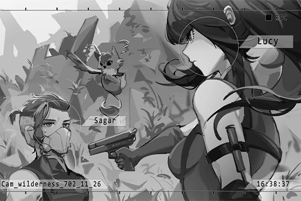

# Cam_61St_702_11_26
## Log Content
*\[Hurried Footsteps\]*

**Bruno** 
Captain!

**Sagar** 
Big B, you guys good?

**Bruno** 
A few of the men suffered minor injuries... Gary's left arm and lateral abdomen were shot. Logistics already sent him back to A.R.C.

**Sagar** 
... Oh yea...?

**Bruno** 
Relax, Captain, he'll be fine. It's hard to face combat drones without getting scratched up a bit.

**Alex** 
Hey, hey. If that were me it wouldn't have been that bleak. Must be a difference in talent?

**Lucy** 
Shut up, Jackal.

*\[Picks up gun\]*

**Alex** 
Don't get pissed, Miss Freeze, I'm just speaking the truth... Hey Bambi, what's next? We going back to report this or what?

**Sagar** 
......

**Alex** 
Hey! Bambi?

**Sagar** 
... Oh, sorry. I was thinking of something. Everyone's here, right? Let's confirm everyone's condition once more.

**Lucy** 
......

*[»»»Fast Forward»»»]*

*\[Creature Yelps\]*

**Sagar** 
... Bo Bo? 
Oh, Lucy. Didn't notice you there... what's up?

**Lucy** 
Squad is set up and good to go. Ready to re\-execute the mission to capture Colin Neumann Jr.

**Sagar** 
Alright. I've informed headquarters of our plan of action.

**Lucy** 
What did HQ say?

**Sagar** 
You mean about me letting the squad save citizens without their permission? Haha, of course I got chewed out...   
... Even threatened to withdraw my position. Luckily Instructor Edwards helped smooth things out.

**Lucy** 
......

**Sagar** 
Ah, sorry. Shouldn't bring him up...

**Lucy** 
No, that... I don't care anymore.

**Sagar** 
Oh, yea... Okay, then.

**Lucy** 
What about you? Do you blame yourself? About Gary.

**Sagar** 
... Yeah. 
You... can you tell?

**Lucy** 
Each time a squad member falls into a bad spot, you always have the same reaction.

**Sagar** 
I ordered it, after all. Everyone had to face those drones without enough time to prepare. This time, we were lucky. But one day, I'm gonna make the wrong decision...

**Lucy** 
Anyone who's in the exploration team might have to sacrifice their life for the mission at any time. Everyone was aware of that when they stepped into the forbidden areas.

**Sagar** 
You're right. But if you just think of yourself it might affect whether those beside you live or die... Haha, maybe my next psychological evaluation won't be up to standard.

**Lucy** 
......

*\[Picks up gun\]*

**Sagar** 
Lucy...? What is this...

**Lucy** 
Did you forget? "You can shoot whenever you want." That's what you said.

**Sagar** 
......

**Lucy** 
I trust your judgement, so I didn't pull the trigger. Perhaps one day you'll do something I can't forgive...  
... But for now, you're still everybody's captain.

**Lucy** 
What about you? Would you believe the guy who rushes to the front of the squad no matter how dangerous the situation? 
I'm talking about you, Sagar.

**Sagar** 
......

*\[Creature Yelps\]*

**Lucy** 
...... ?

**Sagar** 
Oh... it probably thinks you're attacking me. Don't worry about it, Bo Bo.

**Lucy** 
... That's enough for now.

*\[Puts gun away\]*

**Lucy** 
Listen, Eagle\-01 is your squad. Everyone will follow your orders. If haven't been taken out, we ain't going down that easily...  
Plus, we ain't giving you a chance to go see your family.

**Sagar** 
Haha... You're really something.

*[Signal Lost]*
