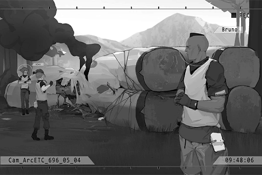

# Cam_ArcETC_696_05_04
## Requirements
|Character|Level|
|---------|:---:|
|**Sagar**|  9  |

## Log Content
**Bruno** 
Ey, Sagar, how's the electromagnetic trap coming?

**Sagar** 
Finished. If it's stepped on, a high\-voltage electric current will pass through the ground, short\-circuiting the mech beast. Then, the chip's ours.

**Bruno** 
You make it sound like it's easy... that giraffe is at least 10 meters tall no matter how you look at it! Did the biology department make a mistake or something?

**Sagar** 
Officer Bruno sounds like an Basicpedia... "Students, please study harder!"... Hahaha.

**Bruno** 
...*\*sigh\**... Well, from the perspective of simulating its habits, they did a great job. Is that old generation technology as well?

**Sagar** 
Hey Officer, you're an outstanding advisor. I'll leave it up to you to draw it in.

*\[Footsteps\]*

**Sagar** 
Hey! G\-5, over here!

*\[Mech Turns\]*

**Sagar** 
Alright, it turned its head!

**Bruno** 
...? Wait...

*\[Mech Turns\]*

**Bruno** 
......! Quick, GET DOWN!!

*\[Laser\]*

**Sagar** 
Wah! Is that... a laser cannon!?

**Bruno** 
With the output that thing's got, it'll cut right through a tree! Get behind a rock!

*\[Laser\]*

**Sagar** 
Damn, gun's broken... What is this thing!?

**Bruno** 
This mech was definitely created by the training officers... It doesn't even need to move. At that height, it can shoot down its enemies no problem!

**Sagar** 
Gotta be kidding me, there's no way we can even budge like this... Officer, you think you can get its attention?

*\[Explosion\]*

**Bruno** 
Damn, its shell is too thick, even the grenades aren't working...

**Alex** 
Found you!!

**Sagar** 
!?

**Bruno** 
Jackal! Watch out for the laser...

*\[Laser\]*

*\[Hurried footsteps\]*

**Bruno** 
Woah... fast as hell!?

**Alex** 
YOU WANNA KILL ME!? I DON'T THINK SO! DIE!!!!!

*\[Rapid Gunfire\]*

**Alex** 
!? Fricking hard as steel...

**Sagar** 
JUMP!!!

*\[Explosion\]*

*\[Bodies colliding\]*

**Alex** 
Eh... Sagar!? When did you...

**Sagar** 
Bruno! Activate the trap!!

**Alex** 
Huh!? What trap...

**Bruno** 
... Got it! 
Get outta the way!!!

*\[Conducts electricity \]*

*[Pic]*

**Bruno** 
Didn't expect you to use metal climbing ropes to conduct electricity... especially under those conditions. Nice job, Sagar.

**Sagar** 
Hey, whatta you say, Jackal? Just say it.

**Alex** 
Say what!? If you two hadn't messed s\*\*\* up, I would've finished that in no time!

**Bruno** 
You're wrong, Jackal. Take a look. Its core chip and balance system are both located in its head. This kind of system allows it to always maintain a four\-legged stance.

**Alex** 
Are you an instruction manual or what!? Get to the point!

**Bruno** 
So, if Sagar hadn't set up an electromagnetic trap to cause it to fall over, you'd have to climb up its neck, dismantle its armor while suspended in middair, then get its chip... There's just not enough time.

**Bruno** 
Get it? If you were that stubborn, you'd have lost right from the start.

**Alex** 
... F\*\*\*...

**Bruno** 
Sagar, same goes for you. If Jackal hadn't distracted the mech, there's no way you could've got it... You're just not fast enough to dodge the lasers.

**Sagar** 
...... 
You're right...

**Bruno** 
Hehe, face reality, bros. Perhaps that's not what you were going for, but that was brilliant teamwork.

**Alex** 
... Hmph.

*\[Footsteps\]*

**Sagar** 
Hey, didn't you wanna fight?

**Alex** 
SHUT THE HELL UP!!!

**Bruno** 
Haha... mission complete. Let's report back.

*[Signal Lost]*
