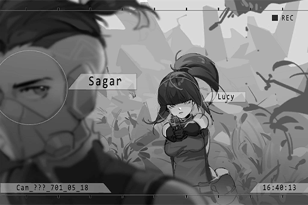

# Cam_ArcETC_701_05_18
## Requirements
|Character|Level|
|---------|:---:|
|**Sagar**| 16  |

## Unlocked Charts
|    Song     |Character|Diff.|Level|
|-------------|:-------:|:---:|:---:|
|**Sacrifice**|  Sagar  |Easy |  3  |
|**Sacrifice**|  Sagar  |Hard |  7  |
|**Sacrifice**|  Sagar  |Chaos| 14  |

## Log Content
*\[Punch Combo\]*

**Trainee A** 
Hey, Mrs. Freeze, you practicing alone again?

**Lucy** 
......! 
......

**Trainee B** 
Let us join you, whatt you think...?

**Lucy** 
Oh... you smell like s\*\*\*... 
You guys are drunk... what the hell? Let me go!

**Trainee C** 
Don't be so cold, baby...

*\[Punches\]*

**Trainee C** 
POOAHH!? 
Wah... Didn't think you had those kind of moves. Made some improvements, eh... Did Sagar teach you that? Teach me some moves, how 'bout it...

**Lucy** 
Don't touch me... urgh...

*\[Punch Combo\]*

**Trainees** 
\- Ooah!? 
\-Warggh! 
\-Waaahhh!!!

**Sagar** 
Independent training? Need some help?

**Trainees** 
\-Wah!? Captain Sagar! 
\-Let's... get the hell outta here!!

**Sagar** 
You okay?

**Lucy** 
Uh... yeah.

**Sagar** 
Your moves looked good. But your center of gravity needs to be lower. Your exam is up in a month, no? There's no way you're getting in Eagle \- 01 like this. 
Come on, raise your hands.

*[→File Switches]*

**Instructor** 
Everything you've been through up until this point... I don't need to go over that. All you need to do is pass this test and you'll officially be a member of the exploration team. All that sweat and blood has been for this moment, right here.

**Sagar** 
That's exactly what Captain Edwards said...

**Instructor** 
These exploration team members will observe your actions and report back to us. I'll be responsible for evaluating the final scores. 
Those that make it, we'll meet at the target location. MOVE OUT!

*[→File Switches]*

**Lucy** 
Damn, separated from everyone... my compass, it's...

*\[Slips\]*

**Lucy** 
Wah!?

*[»»»Fast Forward»»»]*

**Sagar** 
Hey! Lucy! You alright?

**Lucy** 
Oh... Sagar...?

**Sagar** 
How'd you fall down here... totally off course. I'll toss you a rope. You grab it and I'll pull you up.

**Lucy** 
......

**Sagar** 
Lucy? What're you doing.....? 
Waahh!?

*\[Slips\]*

**Sagar** 
Ouch... ahaha... Fell down myself. Embarrassing...

**Lucy** 
......! Oh...

**Sagar** 
Let's take care of that wound first.

*[»»»Fast Forward»»»]*

**Sagar** 
Damn, I got here just 'cuz I was curious. The rest of them must already be close to the final destination. We'd better find our way back to the road. Otherwise, it'll be no good if we get stuck out here in the dark with the equipment we've got.

**Lucy** 
...... 
Why...?

**Sagar** 
Eh? 'Cuz the creatures that come out once it gets dark...

**Lucy** 
Enough! Why aren't you pretending like I didn't just try to kill you!? 
I obviously pulled you down here...

**Sagar** 
Haha... as expected... so that's how it is? Well, now's not the time to talk about that. If we keep at it, we both just might die down here...

**Lucy** 
So what! I applied for the Exploration Team specifically because I wanted to kill you.

**Sagar** 
...... 
To avenge your brother and father? I know.

**Lucy** 
......!?

**Sagar** 
What happened on that day... even today, it still affects me greatly, almost like it happened yesterday... 
When my teammates started warning me of you, I began to investigate. You're Lucien's sister. Lucy's a fake name. And your father, well, he was killed by my father...

**Lucy** 
......

**Sagar** 
You tried out for the team to avenge your father, but after looking into it you found out that my father had already passed away. And Captain Edwards, the one who took your brother's life, has retired with honors. I'm the only one left for you to kill.

**Lucy** 
......

**Sagar** 
But I have to know... You must've had the opportunity to kill me how many times? About a hundred?

**Lucy** 
......

**Sagar** 
You couldn't do it, because you've never killed anyone before. You've never hurt anyone before. Just like your partners said, am I right?

**Lucy** 
... Don't you dare... bring them up!

*\[Draws Gun\]*

**Sagar** 
... Why do I pretend to not see what you're doing? Because I want to understand those who think differently from me. Even if you've got your reasons for wanting to kill me, I don't believe that's everything about you. After all, nobody is completely evil.

**Lucy** 
......! 
All this... it won't stop me from wanting to kill you...

**Sagar** 
You can pull the trigger whenever you want if you think you've got sufficient reason to do so. But in my estimation, you're a good person, so you won't do it.

**Lucy** 
......

**Sagar** 
I joined the team because I believed that I could help a lot of people with this job... But after entering, it turned out to be a lot different from what I imagined. However... even if someone's power isn't enough to change or improve holes in the system, you've still got to do what you think is right in a mistaken environment. One day, little by little, the world will change.

**Lucy** 
......!

**Sagar** 
My father and Captian Edwards taught me that. They made a lot of mistakes, no doubt. Took a lot of lives. I'm not sure if that can be forgiven. But I think... if this spirit can be passed down through the Exploration Team, those types of mistakes can be prevented in the future. I'm sure that's one way to atone for their sins.

**Lucy** 
I... I don't know what to do. Family... partners... they were everything to me. But because of you... *\*sob\**... *\*sob\**... now I have nothing... *\*sob\**... *\*sob\**... I thought, revenge was my only way out... but it's not...

**Sagar** 
I... I'm truly sorry. I wish all that never happened... All I can do is give you another family, new partners. Join Eagle \- 01. I'll prove to you that the Exploration Team isn't what you... no, it isn't what we think it is.

**Lucy** 
......!? 
...*\*sob\**...

*\[Pulls back the brush\]*

**Sagar** 
Look, we found a way out.

*[Signal Lost]*
