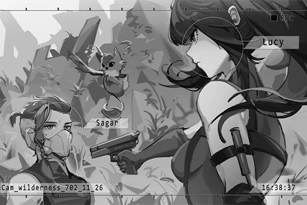
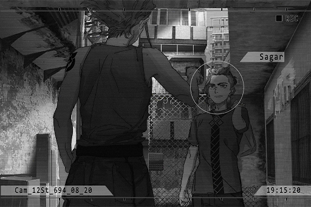
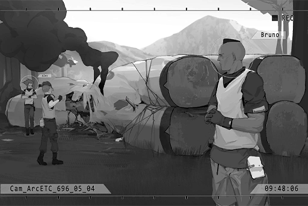
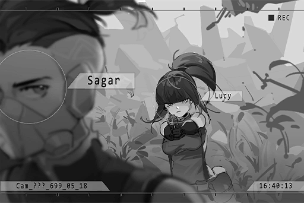
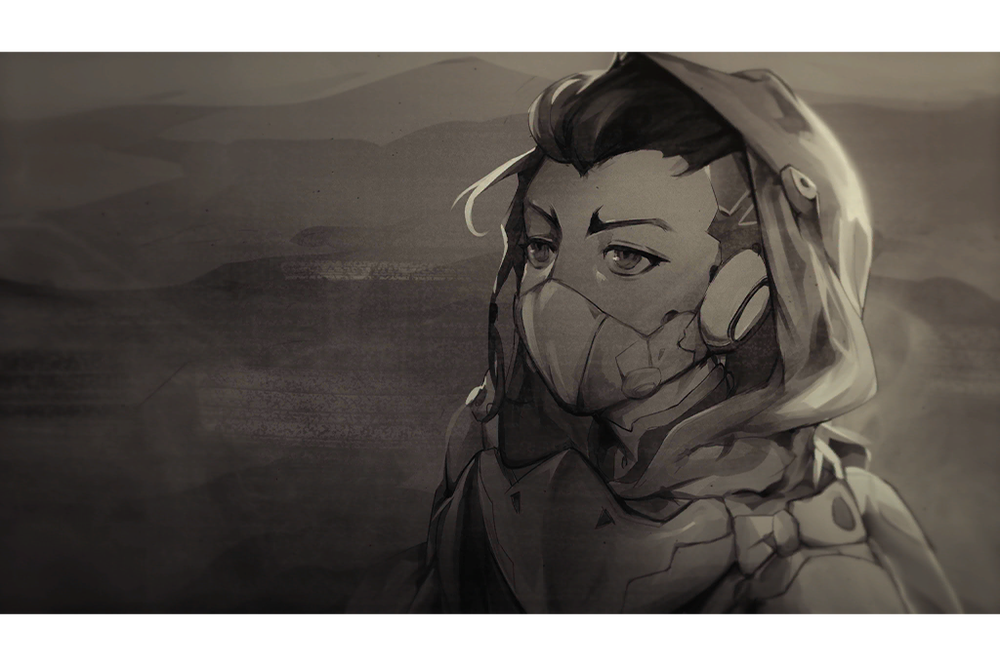
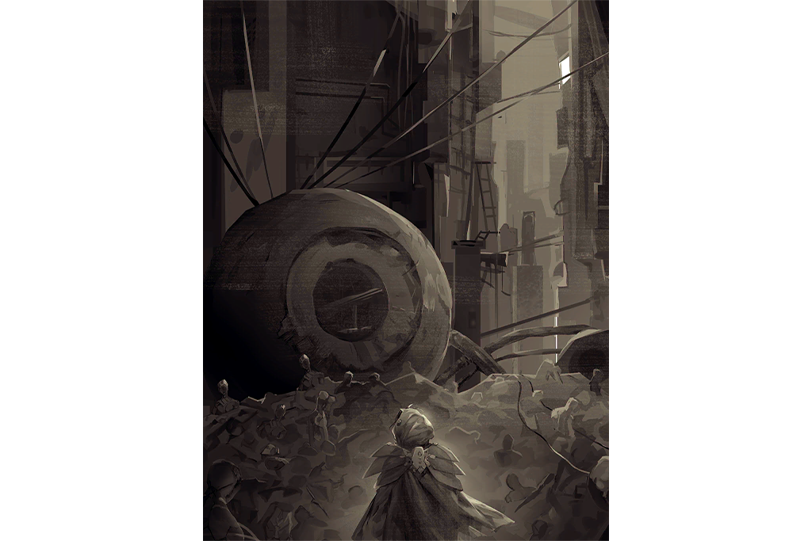
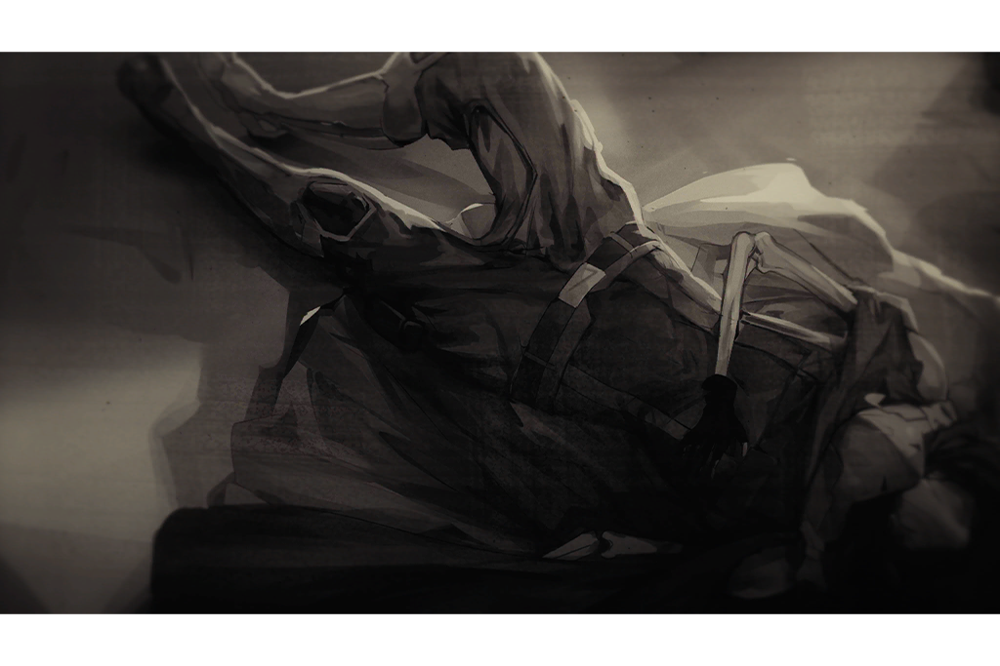
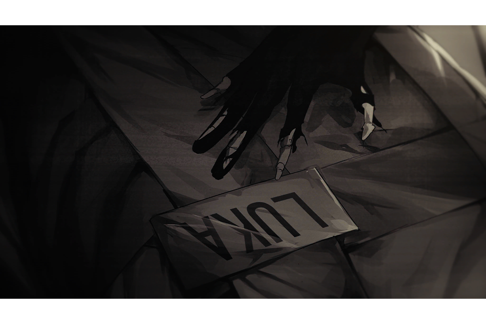

# Sagar OS Logs
## List of Logs
- [OS Log #001](#os-log-001)
- [OS Log #002](#os-log-002)
- [OS Log #003](#os-log-003)
- [OS Log #004](#os-log-004)
- [OS Log #005](#os-log-005)
- [OS Log #006](#os-log-006)
- [OS Log #007](#os-log-007)
- [OS Log #008](#os-log-008)
- [OS Log #009](#os-log-009)
- [OS Log #010](#os-log-010)
- [OS Log #011](#os-log-011)
- [OS Log #012](#os-log-012)
- [OS Log #013](#os-log-013)
- [OS Log #014](#os-log-014)
- [OS Log #015](#os-log-015)
- [OS Log #016](#os-log-016)
- [OS Log #017](#os-log-017)
- [OS Log #018](#os-log-018)
- [OS Log #019](#os-log-019)
- [OS Log #020](#os-log-020)
- [OS Log #021](#os-log-021)
- [OS Log #022](#os-log-022)
- [OS Log #023](#os-log-023)
- [OS Log #024](#os-log-024)
- [OS Log #025](#os-log-025)
- [OS Log #026](#os-log-026)
- [OS Log #027](#os-log-027)
- [OS Log #028](#os-log-028)

## OS Log #001

[Back to Top](#list-of-logs) | [Next Log](#os-log-002)

### Audio\_???\_701\_06\_25
**Bruno**  
This is 08's Eagle\-01 squad, calling branch 03.

**[A.R.C. Member]**  
_Branch 03 copy, over._

**Bruno**  
We've got the target packed up and we're bringing it in. Currently en route, transport route is Route 6, serial number 3109\-003. We're expecting to arrive in Node 03 in 2 hours and 13 minutes.

**[A.R.C. Member]**  
_Copy, matches the report. Please update us on your status every 30 minutes, over._

**Bruno**  
Copy, Eagle\-01 squad transmission complete.  
Captain, report's finished.

**Sagar**  
Okay, I'll go check up on her.

_\[→Signal Switches\]_

**Sagar**  
Hi, you feeling okay?

**???**  
......

**Sagar**  
Uh, that... hello?

**???**  
...Wah!?

**Sagar**  
Hey now, calm down, calm down! We won't hurt you.

**???**  
......

**Sagar**  
Is your name... Rin? Can I call you that?

**Rin**  
......!?  
My name's... Rin?

**Sagar**  
Didn't I ask you your name when you first woke up? That's what you told me.

**Rin**  
......

**Lucy**  
Captain... what are you doing?

**Alex**  
Who knows? Hey, don't give that thing a name, are you crazy?

**Sagar**  
... She speaks just fine, doesn't she? She may give more of a reaction if we talk with her.

**Alex**  
..._\*sigh\*_... Whatever. Don't overdo it.

**Sagar**  
Got it.  
Don't worry. We'll get you somewhere safe real soon. We'll protect you.

**Lucy**  
......

**Sagar**  
You rest awhile. If you need anything just call for us. Sorry, we can't let you leave this trailor at the moment. Just be patient.

**Rin**  
That, that...

**Sagar**  
Huh?

**Rin**  
May, may I ask... where you're taking me?

**Sagar**  
Based on the regulations of the A.R.C. exploration team, where you were discovered is under the jurisdiction of Node 03, so we're taking you to Node 03 first. After registration, we'll need to take you back to headquarters, which is in Node 08.

**Rin**  
A.R.C...?

**Sagar**  
Sorry, we can give you too much information. But I can guarantee you that you're absolutely safe with us.

**Rin**  
... Okay.

**Rin**  
......

_\[Signal Lost\]_

[Back to Top](#list-of-logs) | [Next Log](#os-log-002)

## OS Log #002

[Last Log](#os-log-001) | [Back to Top](#list-of-logs) | [Next Log](#os-log-003)

### Cam\_61St\_702\_11\_26
_\[Hurried Footsteps\]_

**Bruno**  
Captain!

**Sagar**  
Big B, you guys good?

**Bruno**  
A few of the men suffered minor injuries... Gary's left arm and lateral abdomen were shot. Logistics already sent him back to A.R.C.

**Sagar**  
... Oh yea...?

**Bruno**  
Relax, Captain, he'll be fine. It's hard to face combat drones without getting scratched up a bit.

**Alex**  
Hey, hey. If that were me it wouldn't have been that bleak. Must be a difference in talent?

**Lucy**  
Shut up, Jackal.

_\[Picks up gun\]_

**Alex**  
Don't get pissed, Miss Freeze, I'm just speaking the truth... Hey Bambi, what's next? We going back to report this or what?

**Sagar**  
......

**Alex**  
Hey! Bambi?

**Sagar**  
... Oh, sorry. I was thinking of something. Everyone's here, right? Let's confirm everyone's condition once more.

**Lucy**  
......

_\[»»»Fast Forward»»»\]_

_\[Creature Yelps\]_

**Sagar**  
... Bo Bo?  
Oh, Lucy. Didn't notice you there... what's up?

**Lucy**  
Squad is set up and good to go. Ready to re\-execute the mission to capture Colin Neumann Jr.

**Sagar**  
Alright. I've informed headquarters of our plan of action.

**Lucy**  
What did HQ say?

**Sagar**  
You mean about me letting the squad save citizens without their permission? Haha, of course I got chewed out...    
... Even threatened to withdraw my position. Luckily Instructor Edwards helped smooth things out.

**Lucy**  
......

**Sagar**  
Ah, sorry. Shouldn't bring him up...

**Lucy**  
No, that... I don't care anymore.

**Sagar**  
Oh, yea... Okay, then.

**Lucy**  
What about you? Do you blame yourself? About Gary.

**Sagar**  
... Yeah.  
You... can you tell?

**Lucy**  
Each time a squad member falls into a bad spot, you always have the same reaction.

**Sagar**  
I ordered it, after all. Everyone had to face those drones without enough time to prepare. This time, we were lucky. But one day, I'm gonna make the wrong decision...

**Lucy**  
Anyone who's in the exploration team might have to sacrifice their life for the mission at any time. Everyone was aware of that when they stepped into the forbidden areas.

**Sagar**  
You're right. But if you just think of yourself it might affect whether those beside you live or die... Haha, maybe my next psychological evaluation won't be up to standard.

**Lucy**  
......

_\[Picks up gun\]_

**Sagar**  
Lucy...? What is this...

**Lucy**  
Did you forget? "You can shoot whenever you want." That's what you said.

**Sagar**  
......

**Lucy**  
I trust your judgement, so I didn't pull the trigger. Perhaps one day you'll do something I can't forgive...   
... But for now, you're still everybody's captain.

**Lucy**  
What about you? Would you believe the guy who rushes to the front of the squad no matter how dangerous the situation?  
I'm talking about you, Sagar.

**Sagar**  
......

_\[Creature Yelps\]_

**Lucy**  
...... ?

**Sagar**  
Oh... it probably thinks you're attacking me. Don't worry about it, Bo Bo.

**Lucy**  
... That's enough for now.

_\[Puts gun away\]_

**Lucy**  
Listen, Eagle\-01 is your squad. Everyone will follow your orders. If haven't been taken out, we ain't going down that easily...   
Plus, we ain't giving you a chance to go see your family.

**Sagar**  
Haha... You're really something.

_\[Signal Lost\]_

[Last Log](#os-log-001) | [Back to Top](#list-of-logs) | [Next Log](#os-log-003)

## OS Log #003

[Last Log](#os-log-002) | [Back to Top](#list-of-logs) | [Next Log](#os-log-004)

### Requirements
|  Char.  |Lv.|Lv. Locked?|
|---------|:-:|:---------:|
|**Sagar**| 2 |    No     |

### Audio\_Arc\_682\_06\_06
_\[Door Opens\]_

**A.R.C. Security guard**  
Wolf\-01, head back to the city!

_\[Engine stalls\]_

**A.R.C. Security guard**  
Colin? Where is... everyone?

**Colin**  
... ugh...

_\[Falls down\]_

**A.R.C. Security guard**  
Wah!? Medic! Hurry up!

_\[→Signal Switches\]_

**Colin**  
Ugh...

**Leo**  
You're awake.

**Colin**  
You're... ogh!

**Leo**  
Don't. Just lie down. This isn't a minor injury.

**Colin**  
......  
Luka... he's...

**Leo**  
... Sorry. We haven't received either his signal or his vital signs. We're going to send another squad to the mission location to confirm his condition.

**Colin**  
No... ! ... Ugh!!  
My mission report...! You haven't seen it!?

**Leo**  
We saw it. Mr. Neumann, you'll be commended for your bravery in an appropriate manner. Let us handle the next move. We think you ought to rest for a while.

**Colin**  
What... what are you saying? I can still take on missions. I told you I wanted to go back and settle things with him myself...

**Leo**  
Mr. Neumann, listen. You've got to trust us. This is best for you.

**Colin**  
Riya... his wife, his child. They deserve to know the truth.

**Leo**  
We sorry, but according to the regulations, they don't. None of us are happy about the tragedy that occurred during this mission.   
Professionals will deal with the losses that squad members and their families have suffered. They will get everything they need.   
As for the details of the mission, we cannot let any of it leak to the outside world, even if it's family. You know that.

**Colin**  
... What kind of s\*\*\* rule is that? Do you know what happened to us!?

**Leo**  
As I mentioned before, we've already collected and fully reviewed your mission report. We're very clear on what happened. However, this is Top Secret, highly confidential. It's not even going to be seen by members of the exploration team.

**Colin**  
What the hell... are you talking about... explain yourself... oof!

**Leo**  
Your body needs to rest. The doctor's already given you a dose of meds. They'll be great for your recovery and allow you to recuperate in peace.

**Colin**  
No... let me... outta here... zzZ...

_\[»»»Fast Forward»»»\]_

**A.R.C. Nurse**  
Mr. Neumann, time to eat.  
Mr. Neumann... ?

**A.R.C. Nurse**  
......!  
Mr. Neumann's gone!

**Leo**  
......

_\[→Signal Switches\]_

_\[Doorbell\]_

**Sagar**  
Coming!  
......? Sir, who are you looking for?

**Colin**  
... Sagar? You've grown so much...

**Riya**  
Sagar, who is it?  
... Colin...!? My god! Your wounds... what happened!?

**Colin**  
People from A.R.C.... have they come yet?

**Riya**  
Eh? No... what, what's wrong!?

**Colin**  
Oh, yea...? Haha...

**Sagar**  
Mom...?

**Riya**  
Sagar, go play in your room, okay?  
Colin, you scared us half to death. What's going on?

**Colin**  
... I'm sorry... _\*sob\*... \*sob\*_... sorry... Luka...

**A.R.C. Security guard**  
Got you! Mr. Neumann! You can't keep running! You're coming with us!

**Colin**  
Let... Let me go!!!

**Riya**  
What are you doing!? What on earth happened!? What's wrong with Luka!?

**Leo**  
We're sorry, Mr. Neumann's psyche hasn't stabilized. I'll come by and explain everything.

**Colin**  
What are you saying...!? Let me go! Don't listen to them!

**Leo**  
Mrs. Riya, I'm sorry to have to tell you...

_\[Signal Lost\]_

[Last Log](#os-log-002) | [Back to Top](#list-of-logs) | [Next Log](#os-log-004)

## OS Log #004

[Last Log](#os-log-003) | [Back to Top](#list-of-logs) | [Next Log](#os-log-005)

### Requirements
|  Char.  |Lv.|Lv. Locked?|
|---------|:-:|:---------:|
|**Sagar**| 3 |    No     |

### Unlocked Charts
|     Song      |Char.|Diff.|Lv.|
|---------------|:---:|:---:|:-:|
|**Space Alien**|Sagar|Easy | 4 |
|**Space Alien**|Sagar|Hard | 8 |
|**Space Alien**|Sagar|Chaos|13 |

### Audio\_wilderness\_702\_11\_28
**Exploration Team Member**  
Captain, scan's complete. This area's safe.

**Sagar**  
Alright, we'll stay here for the night. You guys set up a temporary base.  
Big B, Lucy, report back.

**Bruno**  
Yessir. Our unit was responsible for investigating Node 13. Currently, we're only able to confirm the position of the watch shop. Tomorrow we'll try to make contact with the shop owner.

**Sagar**  
Sounds like things aren't going smoothly.

**Bruno**  
You can say that again. The residents in 13 are the same as ever. Ain't exactly what I'd call "welcoming"...   
We've only got an hour, and they aren't giving us anything. It's a real headache.

**Alex**  
We've got set up camp way out in the sticks? F\*\*\*, what kind of s\*\*\* mission is this? If I would've known I'd have stayed in 08...

**Lucy**  
... Why are you here, Jackal?

**Alex**  
Huh? You want me to help them guys build a house? Come off it.   
What the hell are we doing looking for the owner of a watch shop, Bambi?

**Sagar**  
... Did you forget or are you just playing stupid? Colin Neumann Jr.'s watch is custom made. An analysis revealed that it was produced in Node 13. The owner must have some knowledge of where the target is.

**Alex**  
Hey, hey. Just let him spill the beans, no? We can use cash, or fists...

**Bruno**  
... Control yourself. A.R.C.'s relationship with Node 13 has never improved. If we cause a scene, not only will it be hard to restabilize, but the target will also get away.

**Sagar**  
Agreed. Do your best to not use force. Adapt to the circumstances. Next is Lucy... How's the investigation going on "Code Name α"?

**Lucy**  
Based on its speed, landing altitude, and calculations of the drone defense systems, we've already excluded the possibility that Code Name α has undergone biotech enhancements or prosthetics.

**Sagar**  
So it's not a human...  
But drones aren't that agile. Plus, she's clearly intelligent and possesses the ability to speak.

**Alex**  
So what is it? A monster from the forbidden areas?

**Lucy**  
Not enough info. A better guess would be... an Architect.

**Alex**  
Ha!? An Architect? You got water in your brain, sis?

**Sagar**  
...It's not impossible.  
Lucy, apply for a database from HQ. Search for any abnormal incidents that occurred in Node 08 since N.A 700.

**Bruno**  
N.A. 700... Captain, you think that thing followed us into the city?

**Sagar**  
It's possible. Given her speed, it wouldn't be difficult for her to escape out from under us. I'm guessing she's been hiding under the surface in 08 ever since then. Since that's the case, she most likely would've left a trace.

**Lucy**  
I'll apply, but Code Name α has nothing to do with our case. It's hard to say if HQ will allow it.

**Sagar**  
First, give it a try. This thing roams about in the forbidden areas and battled with out of control drones...   
... Even though it doesn't have anything to do with the mission, we've got to check it out for the safety of the citizens.

**Alex**  
Not again. Just looking for more work... Whatevs, if you're gonna come in contact with her, I want in. Still haven't figured which one of us is the real Alpha.

**Bruno**  
Don't act like you two've got a date or something.  
Captain, what's your mission?

**Sagar**  
Alright, the data from Node 13's old Admin system has been collected from servers that were abandoned by residents in the forbidden areas. With these, 08's weather system can simulate the climate in this area.

**Alex**  
Question! Why's your mission so damn easy?

**Lucy**  
Circle the outside rim of Node 13 and reach the 5 locations in 2 hours, pass through the craggy desert valley, doesn't sound easy.

**Bruno**  
Upgrading the weather system would improve the standard of life in the cities. This is important...   
Speaking of which, when the jobs were being dished out, you were out fooling around. Didn't help at all!

**Alex**  
Yeah, so what! I only care about being able to send out useful runts during battle.

**Sagar**  
Hey, this ain't no complicated mission, but it'd be good if we wrapped this up before the official search... I've got a feeling, that this won't be an easy target.

**Alex**  
Bambi's scared, is she?

**Bruno**  
Finished, Jackal? Virus viscocity levels are rising. We'd better hurry up and set up camp. Get over here and help out!

**Alex**  
..._\*yawn\*_... Who do you think I am, villager A? This badass didn't join the exploration team to do crap like this!  
Bambi! You know what I'm talking about!

**Bruno**  
Oh, shut the hell up and get moving!

_\[Footsteps\]_

**Lucy**  
Completely undisciplined.

**Sagar**  
Haha... that bugger's always been like this.  
But he's right. Alex sure as hell shines on battle missions.

**Lucy**  
That's for damn sure.

**Sagar**  
Speaking of which, the one who let him into the exploration team... that was me.

**Lucy**  
...? I never heard that.

**Sagar**  
That was a long time ago...

_\[Signal Lost\]_

[Last Log](#os-log-003) | [Back to Top](#list-of-logs) | [Next Log](#os-log-005)

## OS Log #005

[Last Log](#os-log-004) | [Back to Top](#list-of-logs) | [Next Log](#os-log-006)

### Requirements
|  Char.  |Lv.|Lv. Locked?|
|---------|:-:|:---------:|
|**Sagar**| 4 |    No     |

### Audio\_Sagar\_694\_06\_10
_\[Doorbell\]_

**Inhabitant J**  
Coming!

**Sagar**  
Mrs. James, hello. Got a delivery for you.

**Inhabitant J**  
Wah! Such a young delivery boy. Where's Mr. Lee?

**Sagar**  
He's in the car. I'm working part\-time. Nice to meet you.

**Inhabitant J**  
I see. Well, thank you so much. I'm sorry, but this is quite heavy. Can you take it upstairs all by yourself? ..._\*sigh\*_... guess he doesn't want to help you out at all.

**Sagar**  
Ah, no problem. I can do it.

**Inhabitant J**  
Looks like Mr. Lee's gotten to that age where he doesn't want to move a muscle, haha. I just need to sign, right?

**Sagar**  
That's right. Thanks\~

**Inhabitant J**  
Not at all. Send Mr. Lee my regards. If he's ever tough on you, you let me know.   
I'll send in a little complaint to the company, that'll take care of him.

**Sagar**  
Hahaha... I'm sure that's not necessary. All set. Gotta be going.

**Inhabitant J**  
Bye\-Bye\~

_\[→Signal Switches\]_

**Lee**  
Oh, everything go well?

**Sagar**  
No problem.

**Lee**  
Haha, Mrs. James is quite a mouthful, eh? Can't stand it.

**Sagar**  
Haha... she seems nice.

**Lee**  
Kiddo, you work well. Whatta you think? If you can work during the day I'll consider making you full\-time; of course, you gotta apply with the Administration Bureau and the Academy.

**Sagar**  
Oh, sorry. I've got another job in the afternoon...

**Lee**  
Oh? You're really giving it your all. You pressed for cash?

**Sagar**  
Um, a little, haha...

**Lee**  
Picking up chicks?

**Sagar**  
Nah, Nah!!! Well, actually...

_\[»»»Fast Forward»»»\]_

**Lee**  
I see... you want to apply for the exploration team. Not bad. That being said, I don't even know what they do. Not many kids like you, saving up for something like that. Impressive.

**Sagar**  
Yeah, but the registration fee is really high. Not sure if I can make it this year.

**Lee**  
Oh? I see what you're doing. You want a raise, eh? No way! What you get is what you get. But, if you're willing to go full time, that's another story!

**Sagar**  
I can't... I still need to keep my grades up, the exploration team also has a written test. Plus... I still haven't told my mom that I'm working.

**Lee**  
We're here. We'll talk this over later! No. 53, you got it?

**Sagar**  
For sure!

_\[→Signal Switches\]_

**Sagar**  
Number 53... Number 53...

**Riya**  
Sagar?

**Sagar**  
Wah!? Mom!? What are you doing here!?

**Riya**  
I'm the one who should be asking you! Didn't you say you were going to your friend's to play? What are you doing wearing these clothes?

**Sagar**  
Uhh... Umm...

**Riya**  
Are you... working!? If you need money you can come to me.  
... _\*sigh\*_...

**Sagar**  
......

**Riya**  
You... you're not still thinking about that, are you? How many times have I told you? That ain't happening!

**Sagar**  
... Mom, please! It's all I want to do! At least let me try!

**Riya**  
No WAY! I'm not gonna let the same thing happen to you that happened to your father!

**Sagar**  
......

**Riya**  
You're coming home with me!

**Sagar**  
Dad's job... maybe it looked dangerous to you, but you never even tried to understand it, did you?

**Riya**  
......!

**Sagar**  
When I was little, the fondest memories I have of Dad are when he would come home and tell me about everything he saw outside the city walls. To me... they were like fairy tales, but he saw it all with his own eyes.

**Riya**  
......

**Sagar**  
Dad would speak proudly about that, and that made me proud. He never told you because you were always so worried. You never approved of it. But he told me that never got him down because he knew that what he was doing was for the good of the human race.

**Riya**  
......!

**Sagar**  
So even if you don't approve, I won't feel bad, and I'm not gonna give up! Because I'm his son.

**Riya**  
......  
Whatever... fine. Just remember you've got to do well in school...

**Sagar**  
...! Of course!

**Riya**  
... I'm sorry. I'm just worried about you. But I shouldn't control your life.

**Sagar**  
It's not like that...

**Riya**  
... Plus, you're as dumb as a post, so you're definitely not getting in.

**Sagar**  
I... You... What are you saying!? I'll get in, you'll see!

**Riya**  
I'm going home. Good luck, dummy.

_\[Footsteps\]_

**Sagar**  
Damn...  
... Thanks, mom.

_\[Signal Lost\]_

[Last Log](#os-log-004) | [Back to Top](#list-of-logs) | [Next Log](#os-log-006)

## OS Log #006

[Last Log](#os-log-005) | [Back to Top](#list-of-logs) | [Next Log](#os-log-007)

### Requirements
|  Char.  |Lv.|Lv. Locked?|
|---------|:-:|:---------:|
|**Sagar**| 5 |    No     |

### Audio\_shop\_694\_07\_12
**Shop Manager**  
Sagar! Nice work. Would you like to stay and have a meal?

**Sagar**  
Thanks! I'm good, I gotta get going so I won't be late for my next gig.

**Shop Employee**  
That bugger really does work hard.

_\[→Signal Switches\]_

_\[Dashes \]_

**Sagar**  
Oh no, I'm gonna be late...

**Female**  
P\-Please don't do this...

**Man A**  
Hey! You're making us look like bad guys.

**Man B**  
You best stay in line, lady.

**Sagar**  
......

**Man A**  
What are you looking at? You wanna get the crap beaten outta you!?

**Sagar**  
... No, no.

**Man A**  
Then get the hell out of here. It's none of your business.

_\[Footsteps\]_

**Female**  
Eh...? Help... ugh!?

**Man B**  
Hey, hey! You still calling for help? What the hell is wrong with you?

**Man A**  
Don't be silly, we're not gonna do anything......

_\[Fist\]_

**Man A**  
RAAAARRGHHHH!!!!!

**Man B**  
!?  
You......! How'd you get behind me......

_\[Fist\]_

**Man B**  
AAARRGGHHHHH!!

**Sagar**  
You guys have knives, you think I'm an idiot? I'm not gonna come at you straight on.  
Are you alright?

_\[Dashes \]_

**Sagar**  
Not even a thank you... forget it.

**Man In Black**  
Don't move.

_\[Pulls out a gun\]_

**Sagar**  
!?

**Man In Black**  
Very... nice. I saw everything.

**Sagar**  
What... what do you want...?

**Man In Black**  
Don't be nervous, it's just for protection.

_\[Puts the gun away\]_

**Man In Black**  
Take it easy, calm down and hear me out.

**Sagar**  
You guys harassed an innocent woman. I don't think there's much to talk about.

**Man In Black**  
Innocent? You got it all wrong. She's a junkie and owes my friend a ton of cash. So, we were just giving her a chance to pay us back.

**Sagar**  
......

**Man In Black**  
This is my business card. Please, take it.

**Sagar**  
UFZ?

**Man In Black**  
Kiddo, you're pretty small, but you've got impressive moves. These two buggers ain't your average buffoon. You've ever been formally trained?

**Sagar**  
... When I was little, my dad taught me some.

**Man In Black**  
We specialize in providing a platform to those who are interested in hand\-to\-hand combat with absolutely no restrictions. Since it's not under the Bureau's jurisdiction, it's much larger and the audience is a whole lot crazier. Of course, the reward's quite handsome. Whoever wins the preliminary contest gets 10,000 bucks.

**Sagar**  
10\-10,000!?

**Man In Black**  
That's right. If I write a recommendation letter, you won't have to pay the registration fee——but if you win, I get a 30% commission on the reward. But you still have to pay if you lose. My job is to look for fighters like you.

**Sagar**  
Like that woman...?

**Man In Black**  
Don't be fooled by her looks, she's really something in the ring. The audience is often satisfied with her performance. It's a pity the drugs ruined her.

**Sagar**  
... Is this legal?

**Man In Black**  
Haha, didn't I tell you? It's not under the Bureau's jurisdiction, so it's kind of in a gray area.   
In any case, if you are confident in your fighting and up for earning some extra cash, then give it a try. I'm no gangster, I am a serious businessman. I won't force you if you aren't interested.

**Sagar**  
......

_\[→Signal Lost\]_

[Last Log](#os-log-005) | [Back to Top](#list-of-logs) | [Next Log](#os-log-007)

## OS Log #007

[Last Log](#os-log-006) | [Back to Top](#list-of-logs) | [Next Log](#os-log-008)

### Requirements
|  Char.  |Lv.|Lv. Locked?|
|---------|:-:|:---------:|
|**Sagar**| 5 |    No     |

### Audio\_UFZ\_694\_07\_19
_\[Audience applause\]_

**Host**  
Ladies and Gentlemen, are you ready to experience pure, primal violence!?

_\[Audience applause\]_

**Host**  
Node 08 won't give you entertainment, but we will!! All styles allowed! No weight class! No rules! Hand\-to\-hand combat that only ends when someone gives up or collapses!

_\[Audience applause\]_

**Sagar**  
So, so many people... Is this real...?

**Man In Black**  
Hmph, we've been up and running for several years already. Still not popular enough. One day, we'll get this entertainment on the Administration Bureau's official platforms.

**Sagar**  
No... there's no way, right?

**Man In Black**  
Ha! Of course not. We don't get involved in the Administration Bureau's ridiculous relationships. Here, sign this.

**Sagar**  
...?

**Man In Black**  
If you get injured or die on stage, we're not responsible.

**Sagar**  
......

**Man In Black**  
What's wrong? Scared?

**Sagar**  
... My opponent, is it the guy who just won?

**Man In Black**  
That's right. He just came out this year——Red Desert. Right now he's 19\-1. The time he lost he thought the opponent was too weak, so he just forfeited the match. You believe in yourself?

**Sagar**  
Tsk... Let's give it a try.

**Man In Black**  
Alright, sign here. The host will call you.  
... Hey, no one writes their real name for their stage name. I mean, your name is pretty weird... nah, pick something that people will remember.

**Sagar**  
Eh? I don't know what to choose...

**Man In Black**  
How about I give you one?

_\[»»»Fast Forward»»»\]_

**Host**  
Ladies and Gentlemen～～Sorry to keep you waiting! The time has arrived! With 9 consecutive victories, it's Red Desert, crrrrrrushing his enemies like a bloody sandstorm!!!

**Host**  
And the next contender...... oh? Everybody! Looks like we've got another fresh\-faced contender entering the arena! No specific style! An unknown history! 163 cm! 60 kg!

**Audience**  
What!? Is that a child?

**Host**  
Let's welcome——the little deer～～BAMBI!!!!

**Audience**  
\- WAHAHA! BAMBI!? What a joke!  
\- Hey! Look, it's really a kid!

**Sagar**  
Wah... what kind of nickname is that?

**Man In Black**  
Haha, it's hobby of mine. This kind of nickname will definitely get everyone talking. Alright, kid. You're up.

**Red Desert**  
A kid...  
Hey, host.

**Host**  
Yes?

**Red Desert**  
I forfeit.

**Host**  
Eh!?

**Red Desert**  
Kid, I don't want to beat you to death. Get out of here.

**Audience**  
Boooo～～!!!

**Host**  
Red Desert has just announced he will forfeit! Looks like he doesn't think much of his contender! Well, this round...

**Sagar**  
How, how do you know if you don't try?

**Red Desert**  
What'd you say?

**Sagar**  
I've seen how you fight. I... I don't think I'll lose.

**Red Desert**  
HEY KID! You wanna die!?

**Sagar**  
Your center of gravity is on the left side and I'm guessing your knee's injured? So from the perspective of body type, that's to my advantage. Tsk... that, I'm just guessing...

**Red Desert**  
You... Haha, I like it! Let's do this!

_\[Audience applause\]_

**Host**  
Oh! Looks like Red Desert has accepted Bambi's challenge and provocations!  
Well then! I know we all hate this bulls\*\*\*! Let the competition officially～～BEGIN!!!!

_\[Dashes \]_

**Red Desert**  
AAAARRGGHHHHH!!!!!!

**Sagar**  
!!!!!!!!

_\[Fists swinging\]_

**Red Desert**  
RARGH!!?

**Host**  
!?

**Audience**  
!?!?!?!?!?

_\[Falls over\]_

**Sagar**  
... You swing a right just 'cuz I said that? Come on, you're a leftie. Tsk... sorry...

**Host**  
Red, Red Desert... has been knocked out! In one punch!!!!  
The victor! Bambi!!!!

**Audience**  
WOAHHHHH!!!  
BAMBI!! BAMBI!! BAMBI!! BAMBI!!

**Sagar**  
......

**Alex**  
Ey\~? Now that's an interesting fella...

_\[Signal Lost\]_

[Last Log](#os-log-006) | [Back to Top](#list-of-logs) | [Next Log](#os-log-008)

## OS Log #008

[Last Log](#os-log-007) | [Back to Top](#list-of-logs) | [Next Log](#os-log-009)

### Requirements
|  Char.  |Lv.|Lv. Locked?|
|---------|:-:|:---------:|
|**Sagar**| 6 |    No     |

### Cam\_12St\_694\_08\_20
_\[Phone rings\]_

**Sagar**  
Hello?

**[Riya]**  
_Sagar, are you coming home?_

**Sagar**  
Yea, just got off work.

**[Riya]**  
_Get some milk and soy cauce from the market._

**Sagar**  
Oh, okay.

**[Riya]**  
_Low fat! You always get it wrong, dummy._

**Sagar**  
When are you gonna stop calling me that...? Got it, see ya.

_\[Call ends\]_

**????**  
Hey.

**Sagar**  
?

_\[Fist\]_

**Sagar**  
!?

_\[Wall breaks\]_

**Sagar**  
What are you doing!?

**????**  
You don't recognize me?

**Sagar**  
......?  
No, who are you?

**????**  
I'm Alex, otherwise known as Jackal. This'll jog your memory, Bambi?

**Sagar**  
!!  
From the UFZ... whatta you want?

**Alex**  
You move up in the ranks and you can face the champion, me. Why'd you disappeared like that? Scared?

**Sagar**  
... I quit fighting.

**Alex**  
Why not? I heard you didn't even take the cash prize. You crazy?

**Sagar**  
... I wouldn't take that money. I know that money isn't all made from the UFZ. That's dirty money.

**Alex**  
Ha...? I don't know what you're talking about. Whatever, I'm not here to talk with you about money. Since you won't face me on stage, then we'll just have to do it here!

_\[Fist\]_

**Sagar**  
!!!!

_\[Fist\]_

_\[Block\]_

**Sagar**  
Cut it out! I don't wanna fight with you!

**Alex**  
HA! Then quit hiding and stop me!

**Sagar**  
... If you insist.

_\[»»»Fast Forward»»»\]_

**Alex**  
_\*cough\*_... ahh! Ha... ha...  
F\*\*\*...

**Sagar**  
_\*breathes heavily\*_... Hey, enough already? You're tough, but the outcome's clear.

**Alex**  
Shut... up... ugh...

**Sagar**  
You alright...?

**Alex**  
Don't touch me!  
It was so f\*\*\*ing hard to climb to the top... How could I lose to some street scum like you...

**Sagar**  
Tch... Didn't know it was that important to you, sorry. Forget about it. I'm not in those circles, anyway. I'm not fighting anymore. What doesn't hurt you makes you stronger.

**Alex**  
... What doesn't kill you makes you stronger.

**Sagar**  
Oh, is that it?

**Alex**  
F\*\*\*! I don't give a s\*\*\*! I hate it when there's someone stronger than me!

**Sagar**  
... Tsk, can't help you there. But I've got a life to live. If you keep harassing me like this, I'm really gonna be in a pickle.

**Alex**  
With skills like that, why aren't you fighting? You didn't even take the money. What's wrong with you?  
... Where'd you learn to fight?

**Sagar**  
My dad used to be on the Exploration Team, so I guess it's whatever style they use. I happened upon your scene 'cuz I'm saving money to join the squad. When I found out what was really going on I lost interest. Simple as that.

**Alex**  
Exploration team? Hehe, you mean those guys who are thrown outside of the city walls to die for nothing? Ain't nothing fun about that...

_\[Fist\]_

**Alex**  
Ugh!?  
Didn't you say you didn't want to fight!? Ha... forget it, I lose. If you're this crazy, you're dad must be a beast?

**Sagar**  
He's dead.

**Alex**  
......

**Sagar**  
... All I can say is that if you continue on trying to be the "strongest guy", you're gonna end up a nobody. You have no idea what kind of things the exploration team sees out there. I'll bet you pick any member of the elite squad and they could take on both of us, no problem.

**Alex**  
......!

**Sagar**  
... What am I doing talking to you about this? Stop bothering me or I'm notifying the Administration Bureau. See ya.

_\[Footsteps\]_

**Alex**  
Hey, were you serious?

**Sagar**  
Ha? Cut the crap! You attacked me on the street, who am I supposed to call?

**Alex**  
No, not that. I mean the Exploration Team. Are the guys in there really that tough?

**Sagar**  
... Compared to you, absolutely.

_\[Footsteps\]_

**Alex**  
......

_\[Signal Lost\]_

[Last Log](#os-log-007) | [Back to Top](#list-of-logs) | [Next Log](#os-log-009)

## OS Log #009

[Last Log](#os-log-008) | [Back to Top](#list-of-logs) | [Next Log](#os-log-010)

### Requirements
|  Char.  |Lv.|Lv. Locked?|
|---------|:-:|:---------:|
|**Sagar**| 7 |    No     |

### Audio\_ArcETC\_695\_11\_20
**[Edwards]**  
_Everyone here is one of a kind, you guys are all elites. Starting from today you'll all be the new blood of the A.R.C. exploration training camp. On behalf of your training instructor, I'm looking forward to seeing you all pass the tests, officially join the unit, and excavate glory for all of mankind._

**[Edwards]**  
_If you guys are lucky enough, we'll meet again... Dismissed._

_\[>>> Fast Forward>>>\]_

**Sagar**  
... Crap, where is this place? Where's HQ......? Zone C\-2? How did I get here......?

**????**  
You lost, Bambi?

_\[Fists\]_

**Sagar**  
......!?

_\[Footsteps\]_

**Alex**  
Not bad, reactions even faster than before.

**Sagar**  
You're... that guy...? Why...

**Alex**  
Alex, Jackal, even forgot my name... Let me tell you, I joined the exploration training camp one year earlier than you. According to the tradition here, you gotta call me Officer.

**Sagar**  
... You... What are you doing here? Don't tell me you are interested in exploration?

**Alex**  
Huh? Of course not.   
I'm out for you!

**Sagar**  
... Me?

**Alex**  
Well, it's not exactly like that. Let me put it this way, I've been after you this whole time.  
But you were right, I can't defeat any of those motherf\*\*\*ing training officers! Haha, but I have to admit that this is an interesting place.

**Sagar**  
... This is not a place for you to fight.

**Alex**  
Whatever. Didn't expect you'd sign up this year, I thought I'd meet you sooner.

**Sagar**  
I am poor as dirt, alright?

**Alex**  
Yeah, you didn't take that prize money... How can a poor wretch like you get in?

**Sagar**  
I... I saved up the money working part\-time.

**Alex**  
... Heh.  
P\-POOWAHAHAHAHA!

**Sagar**  
... What the f\*\*\* are you laughing about?

**Alex**  
Hahaha, few days ago I laughed even harder when I saw your enlistment score... the score you got on the written test was worse than mine? You are hilarious!? Haha...

**Sagar**  
Cut the crap! At least I got full mark on my physical ability.

_\[Footsteps\]_

**Alex**  
Anyone can get full mark on those kinds of tests... Eh, where are you going?  
Do you even know where to go?

**Sagar**  
......

**Alex**  
Just 'cuz you provided me with some entertainment, I'll help you out. Go straight and take two rights to get to an elevator. You can get back to the dorm from there.

**Sagar**  
... For real? Don't play me.

_\[Footsteps\]_

**Alex**  
What? Look ahead when you are walking.

**Sagar**  
How do I know you're not creeping up from behind?

**Alex**  
Sounds fun... But no, I was just saying what's up. After you survive the training without breaking any arms or legs, we'll slug it out.

**Sagar**  
I already beat your a\*\*.

**Alex**  
Hehe, don't underestimate the training here, I am different from the past. Your fist ain't gonna touch me now.

**Sagar**  
... That's really not my goal here—— In any case, I won't be defeated. Doesn't matter if it's training or you, Officer.

**Alex**  
Hehehe, Really looking forward to it... Bambi.

_\[Footsteps\]_

**Edwards**  
... Captain Raymond, that's Luka's son?

_\[Signal Lost\]_

[Last Log](#os-log-008) | [Back to Top](#list-of-logs) | [Next Log](#os-log-010)

## OS Log #010

[Last Log](#os-log-009) | [Back to Top](#list-of-logs) | [Next Log](#os-log-011)

### Requirements
|  Char.  |Lv.|Lv. Locked?|
|---------|:-:|:---------:|
|**Sagar**| 7 |    No     |

### Audio\_ArcETC\_695\_12\_11
**Sagar**  
... Alright, you got me. What's the deal?

**Trainee H**  
Just wanna chit chat, Sagar, that's all. You've been rather cocky recently.

**Trainee P**  
Champion of the comprehensive physical ability test 3 times in a row? Breaking the record of long\-distance running that's existed for 100 years? Knocking down 10 people in combat class? This is ridiculous, what's meds you on?

**Sagar**  
How would I do that? They'd find it in the medical tests.

**Trainee L**  
Already checked. You are an absolute beast, even your brain is full of muscles... Hehe, except your height is...

**Trainees**  
HAHAHAHAHA......

**Sagar**  
You guys got me here just to mock me?

**Trainee H**  
No, we want to make a deal.

**Sagar**  
A deal?

**Trainee H**  
You know as well as I do that they're just looking for the top guy. The higher\-ups already noticed you early on. Ordinary people like us don't stand out easily.

**Trainee P**  
Being trained like a dog every day, being forced to drop out of the team after a few years......   
We don't want that, so we wanna ask you for a favor.

**Sagar**  
You want me to go easy on you guys during the exam?

**Trainee L**  
Hey, hey, hey. That's not what I said. Isn't it nice to let others shine once in a while?  
It's good for all of us.

**Sagar**  
I really respect the rules here, I think that there's a chance for everyone if you all work hard. Besides, mutual benefit? I am not hearing anything that's beneficial to me.

**Trainee H**  
Hey... if we cooperate, us three won't accidentally break your hand, does that count as a benefit?

_\[Footsteps \]_

**Sagar**  
Let me remind you guys, it's prohibited for trainees to fight in private...

**Trainee H**  
Oh, afraid? Aren't you the son of the illustrious Luka?  
Shaming daddy like this......

**Sagar**  
... Just as expected, it's because of my dad... alright.

_\[Objects Crashing\]_

**Sagar**  
If you wanna fight, I'm down!

**Trainee H**  
HA, HAHAHA, you're dead meat! Payne, Larry! Kick his a\*\*!

_\[Hurried footsteps\]_

**Sagar**  
Hmph!

_\[Fists \]_

**Trainee P**  
Holy s\*\*\*, what the f\*\*\*, he's a monster...

**Trainee H**  
Don't be scared! There are 3 of us! Surround him!

_\[Blocks\]_

**Sagar**  
...Ugh! Damn it...

_\[Objects Crashing\]_

**Trainees**  
!?!?!?!?

**Alex**  
Enough, rookies... enough!

**Trainee H**  
Officer... J\-J\-Jackal?

**Alex**  
You know me, eh? This is my territory, why didn't you tell me this was going down?

**Sagar**  
......

**Trainee L**  
O\-Officer. we were just practicing......

**Alex**  
You call 3 fighting against 1 practicing? Bulls\*\*\*.  
Come on now, let's do 1\-on\-1. You were the most eager to get started. You go first.

**Trainee H**  
T\-This... if it's 1\-on\-1...

**Alex**  
Hurry up, how long do you want me to wait?

**Trainee H**  
D\-Damn it! Sagar, you just wait and see!!

_\[Hurried footsteps\]_

**Alex**  
Ran away. F\*\*\*ing babies. Ha, how many times have you been caught up in this type of s\*\*\*? If I weren't on here to save your a\*\*...

**Sagar**  
Mind your own business... I can handle them.

**Alex**  
Duh, if you can't take down those trashy losers, I'd kill you myself.

**Sagar**  
... You wanna pick a fight? Now?

**Alex**  
You think I'm as dumb as those morons? Start a fight here? Look up.

**Sagar**  
......! Cameras?

**Alex**  
Really depends if those old farts even care.  
Listen closely, for next month's United Mission, our batch will be operating with the noobs... Let's end things then once and for all. Any questions?

**Sagar**  
Yeah. Can you leave me alone?

**Alex**  
Hehe... once a Jackal's locked onto its prey, it won't let go easily... Hahaha!!

_\[Footsteps \]_

**Sagar**  
... F\*\*\* this...

_\[Signal Lost\]_

[Last Log](#os-log-009) | [Back to Top](#list-of-logs) | [Next Log](#os-log-011)

## OS Log #011

[Last Log](#os-log-010) | [Back to Top](#list-of-logs) | [Next Log](#os-log-012)

### Requirements
|  Char.  |Lv.|Lv. Locked?|
|---------|:-:|:---------:|
|**Sagar**| 8 |    No     |

### Audio\_13St20\_702\_11\_29
**Sagar**  
We're here. It's this shop. Based on the analyzed data sent down from the top, we've determined that Dr. Neumann is a frequent customer here. We've just got to do a little bit of investigating...

**Lucy**  
That easy? Ever since we got here, the people have been on edge...

**Bruno**  
It's always been like this... there's nothing we can do. We've got all the required documents. If we show them, it should...

**Alex**  
Tsk tsk... Big B, you think too much, bro.  
Hey, Bambi, you take that side, okay?

**Sagar**  
Jackal!? What happened to your uniform?

**Alex**  
Relax. It's noon, time to rest. You guys stay here, I'll go in.

**Sagar**  
Hey! Don't you even think about it!

**Alex**  
Hey, hey. Once a Jackal is locked onto its prey, it won't let go easily! Check out this performance.

**Sagar**  
......

_\[→Signal Switches\]_

_\[Doorbell\]_

**Watch Shop Owner**  
Welcome! How can I help you?

**Alex**  
Wah! I heard this was the most famous handcrafted watch shop in the whole world. It really is, isn't it!

**Watch Shop Owner**  
Haha, customer, don't you exaggerate now. I wouldn't dare say the best in the world, but certainly the best in Node 13.

**Alex**  
This one! "Eternal", made in N.A 600, right? Wah, never thought I'd get to see the real thing!

**Watch Shop Owner**  
Wah! You really know your stuff. That's the work of my great\-grandfather. Whatta you think? Wanna take a photo?

**Alex**  
Eh? Nah. I'm like everyone around here, don't like carrying around too much tech. Seeing it with my own eyes is the best way to admire it. You really are a boss! So, you can tell I'm not a local, huh?

**Watch Shop Owner**  
Hehe, Node 13 is pretty small. I like your energy! Alrighty then, what can I help you with? You didn't come all this way for a ready\-made product.

**Alex**  
You got it. Actually, my brother's birthday's coming up. I wanna get him something real good.

**Watch Shop Owner**  
Custom\-made? No problem. What kind of guy is he?

**Alex**  
Knew you'd ask. A watch can represent somebody's whole being, their whole personality, am I right?

**Watch Shop Owner**  
Nailed it right on the head.

**Alex**  
Let me think... he's got a fondness for classical culture, but also a fan of revolution. He's conservative like a gentleman, but when it comes to creativity and philosophy, he's got real balls. Hard to say. I really respect him.

**Watch Shop Owner**  
And what work does this brother of yours do?

**Alex**  
Oh! He's a classical musician. A lot of his instruments have been imported from Node 13.

**Watch Shop Owner**  
What a coincidence... I've got a customer that frequents here often. His personality sounds a lot like your brother. He just ordered a new custom\-made. You want to check out the design? I'm only half done, but it's worth checking out.

**Alex**  
Really? Perfect?

_\[»»»Fast Forward»»»\]_

**Alex**  
I see... 6 mm silver\-plated watch base? Lavish, yet not to fancy. I like it. Can you fit it with a leather band to see how it looks?

**Watch Shop Owner**  
Of course. The leather's in the back. Give me a sec.

**Alex**  
Take your time.

_\[Doorbell\]_

**Alex**  
......

_\[Installs transmitter\]_

**Alex**  
It's done.

_\[Doorbell\]_

**Watch Shop Owner**  
Here you go. We've got several different types. I'd recommend this one. It's got a wood grain texture.

**Alex**  
Alright. I trust your judgment. This design is absolutely spectacular. Please, go ahead and set me up with one that has the same style.

_\[→Signal Switches\]_

_\[Doorbell\]_

**Alex**  
Hey.

**Sagar**  
So? What'd you do?

**Lucy**  
... You didn't punch anyone, did you?

**Alex**  
Woah, whatta you think I am? Yo, take this.

**Sagar**  
......?  
A transmitter?

**Alex**  
Put it on Neumann's custom watch, the crafty fella. He won't know a thing.

**Sagar**  
!   
Nice job, Jackal!

**Alex**  
You can praise me after we get him.  
By the way, where's Big B?

_\[Signal Lost\]_

[Last Log](#os-log-010) | [Back to Top](#list-of-logs) | [Next Log](#os-log-012)

## OS Log #012

[Last Log](#os-log-011) | [Back to Top](#list-of-logs) | [Next Log](#os-log-013)

### Requirements
|  Char.  |Lv.|Lv. Locked?|
|---------|:-:|:---------:|
|**Sagar**| 8 |    No     |

### Unlocked Charts
|    Song    |Char.|Diff.|Lv.|
|------------|:---:|:---:|:-:|
|**Doldrums**|Sagar|Easy | 4 |
|**Doldrums**|Sagar|Hard | 7 |
|**Doldrums**|Sagar|Chaos|14 |

### Audio\_Sagar\_702\_11\_29
_\[Signal Transmission\]_

**Bruno**  
......

**[Sagar]**  
_Calling Big B. What are you doing?_

**Bruno**  
...eh, Captain?   
Nothing. Just analyzing some old codes.

**[Sagar]**  
_Need help? I can arrange for some guys..._

**Bruno**  
Almost finished. No worries.  
We meeting up?

**[Sagar]**  
_Already been 3 minutes... It's not like you to forget._

**Bruno**  
... Damnit... be right there!

_\[»»»Fast Forward»»»\]_

**Alex**  
Big B, what the hell you doing? Squad meeting! You can't just do whatever the f\*\*\* you want.

**Lucy**  
Look who's talking.

**Bruno**  
Sorry to make you all wait... Captain.

**Sagar**  
Alright, everybody listen up.  
I've gotten news from HQ that the mission's changed.

**Exploration Team Member T**  
Changed? We don't need to arrest the target anymore?

**Sagar**  
No, the target hasn't changed. But "bring him back dead or alive" has changed to "it's absolutely necessary that he be brought back alive".

**Alex**  
WHAT!?

**Sagar**  
... What's the matter, Alex?

**Alex**  
Are you kidding me? This ain't gonna be any fun!

**Lucy**  
... Captain, considering how dangerous the target is, it's going to extremely difficult to capture him alive. Much more so than shooting him dead. We're going to need a major strategy adjustment.

**Exploration Team Member K**  
I agree. The report on the watch shop owner indicated that the target lives deep in the forbidden areas. It'll take us 2 weeks just to get there... the environment's already dangerous enough, now we've got to think of a way to capture the target alive?

**Sagar**  
I know this'll increase our workload, but we're Eagle\-01's cream of the crop. I trust it won't be an issue.

**Alex**  
Oh, shut it, Bambi! I want out of this boring s\*\*\*!

**Lucy**  
Jackal!

**Sagar**  
Relax, Lucy.  
... Alex, we've got to catch him alive, but I've got a mission I want to give you.

**Alex**  
Eh?

**Sagar**  
Whether or not he sees it coming, once we find the guy... You're going to smash his right arm.

**Alex**  
... Oh...

**Sagar**  
Lucy, you're going to use a stun gun to short circuit his right eye. If he loses half of his vision and use of his right arm, his sense of balance will go out of wack. There's no way he'll be able to move with any control.

**Alex**  
So, injuring him isn't an issue?

**Sagar**  
That's right.

**Alex**  
... Hey, you really want to get this guy, huh?

**Sagar**  
Of course.  
Whatta you think? You want it?

**Alex**  
Cut the s\*\*\*! This mission's mine!

**Sagar**  
Great. Let's discuss the details.  
Everyone else get back in position.

_\[Footsteps\]_

**Lucy**  
... Strange.

**Bruno**  
Really? Captain's plan sounds right on point...

**Lucy**  
I mean you...

**Bruno**  
... Me?

**Lucy**  
When Captain issued the command, everyone was surprised. You were the only one who maintained a straight face. Almost like you knew what HQ was planning before we did.

**Bruno**  
... You're overthinking it.  
I've felt like this fugitive was something special since the very beginning. You think A.R.C. would send the entire team of elites just to catch a simple fugitive? There's something more going on.

**Lucy**  
So, you expected something like this to happen?

**Bruno**  
In any case, I'm the Captain's primary advisor.

**Lucy**  
......

**Bruno**  
Are you on edge for Sagar's sake? Relax. I worked with Alex and Sagar before you even joined the squad.  
Haha... lots of memories.

**Lucy**  
He told me about Jackal.

**Bruno**  
Then you oughta hear what happened later... Sagar would happily tell you. He's got a thing for you, after all.

**Lucy**  
... As a member of the team.  
I'll leave you be.

_\[Footsteps\]_

**Bruno**  
......

_\[Signal Lost\]_

[Last Log](#os-log-011) | [Back to Top](#list-of-logs) | [Next Log](#os-log-013)

## OS Log #013

[Last Log](#os-log-012) | [Back to Top](#list-of-logs) | [Next Log](#os-log-014)

### Requirements
|  Char.  |Lv.|Lv. Locked?|
|---------|:-:|:---------:|
|**Sagar**| 9 |    No     |

### Audio\_ArcETC\_696\_05\_04
**Bruno**  
Are you Sagar? I'm Bruno, from class B. We're on the same unit for the United Mission this time around.

**Sagar**  
Oh, got it. Let's do this.

**Bruno**  
Huh? Your performance is stellar even in our class. How about you do all the work? Haha.

**Sagar**  
It's not like that. Speaking of which, this mission will be carried out in teams of 3. Our other member is...

**Alex**  
Found you, Bambi!!

**Sagar**  
... No frigging way...

_\[Hurried footsteps\]_

**Alex**  
Found you! We're gonna see who's boss once and for all!

**Sagar**  
This guy, shouldn't the training officer have split us into different units?

**Alex**  
Oh, come on! I planned on tearing through the rest of those weaklings to get to you. This is fate, man! Bring it on!

**Bruno**  
... Sagar, you know Jackal from before?

**Sagar**  
Coincidence, that's all... aigh.  
Hey, you wanna fight? Wait 'till the mission's over.

**Alex**  
Ha? You think you can tell the boss to wait?

**Sagar**  
Trainees who don't through mission training get forcibly removed from the team. I know you don't care, but I can't leave now... Plus, we don't want to drag Bruno into this.

**Alex**  
Eh? Someone else is here? Who're you?

**Bruno**  
... Let's check out the mission synopsis.

_\[Opens file\]_

**Sagar**  
"Locate the only Model G\-5 Mech Beast in area 3 and recover its core chip"... Model G\-5 Mech Beast?

**Bruno**  
You don't remember? The training officer told us about this... Jackal?

**Alex**  
Huh? I don't pay attention to that meaningless crap.

**Bruno**  
... Listen. These mech beasts were developed by A.R.C. based on creatures from the old generation. Besides simulating the habits of wild beasts, weapons were added for training purposes.

**Sagar**  
Umm, so far it's still stuff I remember...

**Bruno**  
The Model G\-5 is based on a four\-legged creature called a "giraffe". Its defining characteristic is a neck that's several meters long. They use it to feed on high\-resting leaves. Although they are naturally gentle creatures...

**Alex**  
Vegetarian? Isn't that the perfect prey for a Jackal?

_\[Footsteps\]_

**Sagar**  
Hey, where you going?

**Alex**  
Duh, I'm going to crush that mech beast!

**Bruno**  
Wait a sec, this is a United Mission, with only one guy...

**Sagar**  
Forget it. Don't stop him. There's no way we can cooperate with him.

**Alex**  
Sagar?

**Sagar**  
Hey, since you so eagerly want to see whose on top... let's make this a competition. First one to get the chip wins. There's only one mech beast, right?

**Alex**  
This? A competition? Sounds pretty boring...

**Sagar**  
... This is one of the official exploration team missions. Or are you saying you don't think you can do it? Afraid you're gonna lose to poor, little Bambi?

**Alex**  
Ha, Ha, HAHAHAHA!!  
There's no way I'm losing!!!

_\[Hurried footsteps\]_

**Bruno**  
... You guys are a pain in the a\*\*. I just wanna complete this mission smoothly...

**Sagar**  
Sorry... Regardless of who gets the chip, you'll pass the session. Won't be an issue.

**Bruno**  
Is it that easy? The training officer didn't seem to think so...

**Sagar**  
If you're worried, than help me out, future officer Bruno. There's no way I'm losing to that guy!

_\[Signal Lost\]_

[Last Log](#os-log-012) | [Back to Top](#list-of-logs) | [Next Log](#os-log-014)

## OS Log #014

[Last Log](#os-log-013) | [Back to Top](#list-of-logs) | [Next Log](#os-log-015)

### Requirements
|  Char.  |Lv.|Lv. Locked?|
|---------|:-:|:---------:|
|**Sagar**| 9 |    No     |

### Cam\_ArcETC\_696\_05\_04
**Bruno**  
Ey, Sagar, how's the electromagnetic trap coming?

**Sagar**  
Finished. If it's stepped on, a high\-voltage electric current will pass through the ground, short\-circuiting the mech beast. Then, the chip's ours.

**Bruno**  
You make it sound like it's easy... that giraffe is at least 10 meters tall no matter how you look at it! Did the biology department make a mistake or something?

**Sagar**  
Officer Bruno sounds like an Basicpedia... "Students, please study harder!"... Hahaha.

**Bruno**  
..._\*sigh\*_... Well, from the perspective of simulating its habits, they did a great job. Is that old generation technology as well?

**Sagar**  
Hey Officer, you're an outstanding advisor. I'll leave it up to you to draw it in.

_\[Footsteps\]_

**Sagar**  
Hey! G\-5, over here!

_\[Mech Turns\]_

**Sagar**  
Alright, it turned its head!

**Bruno**  
...? Wait...

_\[Mech Turns\]_

**Bruno**  
......! Quick, GET DOWN!!

_\[Laser\]_

**Sagar**  
Wah! Is that... a laser cannon!?

**Bruno**  
With the output that thing's got, it'll cut right through a tree! Get behind a rock!

_\[Laser\]_

**Sagar**  
Damn, gun's broken... What is this thing!?

**Bruno**  
This mech was definitely created by the training officers... It doesn't even need to move. At that height, it can shoot down its enemies no problem!

**Sagar**  
Gotta be kidding me, there's no way we can even budge like this... Officer, you think you can get its attention?

_\[Explosion\]_

**Bruno**  
Damn, its shell is too thick, even the grenades aren't working...

**Alex**  
Found you!!

**Sagar**  
!?

**Bruno**  
Jackal! Watch out for the laser...

_\[Laser\]_

_\[Hurried footsteps\]_

**Bruno**  
Woah... fast as hell!?

**Alex**  
YOU WANNA KILL ME!? I DON'T THINK SO! DIE!!!!!

_\[Rapid Gunfire\]_

**Alex**  
!? Fricking hard as steel...

**Sagar**  
JUMP!!!

_\[Explosion\]_

_\[Bodies colliding\]_

**Alex**  
Eh... Sagar!? When did you...

**Sagar**  
Bruno! Activate the trap!!

**Alex**  
Huh!? What trap...

**Bruno**  
... Got it!  
Get outta the way!!!

_\[Conducts electricity \]_

_\[Pic\]_

**Bruno**  
Didn't expect you to use metal climbing ropes to conduct electricity... especially under those conditions. Nice job, Sagar.

**Sagar**  
Hey, whatta you say, Jackal? Just say it.

**Alex**  
Say what!? If you two hadn't messed s\*\*\* up, I would've finished that in no time!

**Bruno**  
You're wrong, Jackal. Take a look. Its core chip and balance system are both located in its head. This kind of system allows it to always maintain a four\-legged stance.

**Alex**  
Are you an instruction manual or what!? Get to the point!

**Bruno**  
So, if Sagar hadn't set up an electromagnetic trap to cause it to fall over, you'd have to climb up its neck, dismantle its armor while suspended in middair, then get its chip... There's just not enough time.

**Bruno**  
Get it? If you were that stubborn, you'd have lost right from the start.

**Alex**  
... F\*\*\*...

**Bruno**  
Sagar, same goes for you. If Jackal hadn't distracted the mech, there's no way you could've got it... You're just not fast enough to dodge the lasers.

**Sagar**  
......  
You're right...

**Bruno**  
Hehe, face reality, bros. Perhaps that's not what you were going for, but that was brilliant teamwork.

**Alex**  
... Hmph.

_\[Footsteps\]_

**Sagar**  
Hey, didn't you wanna fight?

**Alex**  
SHUT THE HELL UP!!!

**Bruno**  
Haha... mission complete. Let's report back.

_\[Signal Lost\]_

[Last Log](#os-log-013) | [Back to Top](#list-of-logs) | [Next Log](#os-log-015)

## OS Log #015

[Last Log](#os-log-014) | [Back to Top](#list-of-logs) | [Next Log](#os-log-016)

### Requirements
|  Char.  |Lv.|Lv. Locked?|
|---------|:-:|:---------:|
|**Sagar**|10 |    No     |

### Audio\_ArcETC\_696\_10\_20
**[Edwards]**  
_... Above is the list of all those who've been selected as reserve members of the exploration team. You'll all be put under the supervision of different training officers and put through an even more rigorous training period. You'll be put through the ringer, and breakthough whatever limits you thought you had._

**[Edwards]**  
_Whatever your rank, whatever your background, you are one step closer to officially joining the team. Just remember one thing. Continue to train your a\*\*es off._

**Trainees**  
YES, SIR!!!

_\[»»»Fast Forward»»»\]_

**Trainee L**  
Hank, congrats on becoming a reserve member!

**Trainee H**  
Hey now, I told you Officer Dennis has a good eye for talent.

**Trainee P**  
Dude, speaking of which, Sagar... got picked by Captain Edwards.

**Trainee H**  
Poor bastard. Edwards' methods are notoriously brutal. Even Sagar might not be able to handle it.

**Trainee P**  
Also means he's proven himself to be a monster...

**Trainee H**  
Huh? What'd you say?

**Trainee P**  
N\-Nothing! Didn't say anything!

**Trainee H**  
Hmph. How dumb are you? Captain Edwards has an uncle named Jake Edwards. Was a member of Wolf\-01. And Sagar, well he's Luka's son...

**Trainee L**  
Oh... Jake Edwards was a member of Luka's team!

**Trainee H**  
See. If this isn't nepotism then I don't know what is! Did you see his written exam scores? You think that's what turned Edwards onto him?

**Trainee P**  
Oh, yea... you're right, bro!

**Alex、Bruno**  
......

_\[→Signal Switches\]_

**Alex**  
Yo, Bambi, Big B. There you are.

**Sagar**  
......

**Bruno**  
Jackal, didn't see you all afternoon... You skipping class again?

**Alex**  
What, no good mommy? Just handling some personal business... You know, like grabbing this can of beer.

_\[Opens beer\]_

**Bruno**  
Yo, if you get caught...

**Alex**  
I'll finish it right up. Won't be a problem.  
Or, I could just do this...

**Sagar**  
Hey! What're you doing!

**Alex**  
... Just pouring it on depressed, little Bambi's head.  
Just looking at your sad, s\*\*\* eating face gets me down.

**Sagar**  
... Sorry.

**Bruno**  
What, those rumors? About your dad?

**Sagar**  
......  
I know that stuff shouldn't get to me... But it doesn't matter if it's me or my dad. Those guys don't understand anything...

**Bruno**  
... Sagar. We've all see how hard you work. Even your written exam. Didn't you get an A\- this time? Not far off from my A+.

**Sagar**  
... That's not much of a consolation...

**Bruno**  
Haha.. whatever. Forget those fools. You're something special. It's got nothing to do with who your dad was. Am I right? Are you trying to get to the top, or what?

**Sagar**  
... Yeah... got it.

**Alex**  
Big B, you sound like those folks from the counseling department. Gross

**Bruno**  
Oh yeah? Hmm, maybe I'll do that when I retire. After all, some stupid, ignorant battle maniac is going to need long\-term counseling from all that brain damage.

**Alex**  
HEY!? YOU TALKIN' BOUT ME!? Piece of...

**Sagar**  
Haha... Didn't mean to worry you guys.

**Alex**  
... Don't drag me into this.  
Oh, yeah. The firearms instructor is looking for you, Bambi. Think he wants you to organize the ammunition depot.

**Sagar**  
Alright, I'll go find him. Thanks for giving me the heads up, Jackal.

**Alex**  
Get the hell out of here.

_\[Door opens\]_

**Bruno**  
Gone? Alright... Jackal, tell me what's going on.

_\[Projection\]_

**Bruno**  
Why were Hank, Payne, and Larry shoved into the food waste barrel at the dump?

**Alex**  
Told ya I was handling personal business. Got a problem?

**Bruno**  
..._\*sigh\*_...  
Just this time, I don't know anything.

**Alex**  
Hehe, you want in?

**Bruno**  
... No.

_\[Signal Lost\]_

[Last Log](#os-log-014) | [Back to Top](#list-of-logs) | [Next Log](#os-log-016)

## OS Log #016

[Last Log](#os-log-015) | [Back to Top](#list-of-logs) | [Next Log](#os-log-017)

### Requirements
|  Char.  |Lv.|Lv. Locked?|
|---------|:-:|:---------:|
|**Sagar**|11 |    No     |

### Audio\_???\_697\_11\_20
**Edwards**  
Answer me. Where is this?

**Trainees**  
Yes, sir! Officer, sir!!  
It's the forbidden areas, sir!!

**Edwards**  
That's right. The land of man's past glory, and yet, a place where no one may step foot, lies right before your very eyes. This wasteland is brimming with ancient treasures, as well as overflowing with unimaginable danger.

**Edwards**  
Everything you've been through up until this point... I don't need to go over that. All you need to do is pass this test and you'll officially be a member of the Exploration Team. All that sweat and blood has been for this moment, right here.

**Sagar**  
......

**Edwards**  
These Exploration Team members will observe your actions and report back to us. I'll be responsible for evaluating the final scores.  
Those that make it, we'll meet at the target location. MOVE OUT!

_\[→Signal Switches\]_

**Bruno**  
Sagar, can you hear clearly?

**Sagar**  
Loud and clear. Big B... Wireless capabilities functioning normally.

**Alex**  
S\*\*\*, mask is too tight. The maintenance crew's just a bunch of frigging loafers.

**Bruno**  
Keep it together. There're particles of "The Ender" virus floating around this area. If you're exposed for more than 30 minutes, you're dead.

**Sagar**  
Haha, best hurry up and get to where you're going, huh?

**Alex**  
Is that a challenge? Let's see who gets there first, Bambi!

**Sagar**  
You got it, Jackal!

**Bruno**  
How old are you guys... Everyone split up.

_\[»»»Fast Forward»»»\]_

**Sagar**  
... Off by 5.8 degrees... that's strange. I've been following the navigation device to a tee. How'd I get so high up?

_\[Footsteps\]_

**Sagar**  
Visibility is decreasing... About to lose my signal. Damn, hold on...

_\[Taps\]_

**Sagar**  
......!? Wait a sec, are these weld marks?

_\[Disassembles Device\]_

**Sagar**  
Never seen this chip before. Is it disrupting the signal?   
Damn! Did Hank and them do this...?

**Sagar**  
Calling Big B! Calling Jackal! Can you hear me?

_\[Static\]_

**Sagar**  
F\*\*\*! Even the reception is... I've got to find them!

_\[»»»Fast Forward»»»\]_

**Sagar**  
_\*heavy breathing\*_... They're over there! Jackal's in front? Good, climbing on the cliff...

_\[Hurried footsteps\]_

**Sagar**  
... Wait a sec. Something's off about the direciton of the wind...

**Sagar**  
!?  
... Tornado! It's huge... headed this way?

**Sagar**  
The training officer told us the climate in the forbidden areas isn't simulated by the weather system. It's totally unpredictable... But why can't they see it?

**Sagar**  
That's right... Their field of vision is blocked by the hills. I'm the only one who sees the tornado... S\*\*\*!!

**Sagar**  
HEY! HEY! Calling Big B! Calling Jackal! Please, respond!!

**Bruno**  
... Hey... Sa... where'd you... go?

**Alex**  
Lost... Bambi... Ha... Eat my...

**Sagar**  
Listen closely! Your walking right into a giant wind storm. You gotta get out of there...

_\[Signal cuts off\]_

**Sagar**  
DAMN…… THEY'RE SCREWED!!!

_\[Signal Lost\]_

[Last Log](#os-log-015) | [Back to Top](#list-of-logs) | [Next Log](#os-log-017)

## OS Log #017

[Last Log](#os-log-016) | [Back to Top](#list-of-logs) | [Next Log](#os-log-018)

### Requirements
|  Char.  |Lv.|Lv. Locked?|
|---------|:-:|:---------:|
|**Sagar**|11 |    No     |

### Unlocked Charts
|   Song    |Char.|Diff.|Lv.|
|-----------|:---:|:---:|:-:|
|**Nídhögg**|Sagar|Easy | 5 |
|**Nídhögg**|Sagar|Hard | 9 |
|**Nídhögg**|Sagar|Chaos|14 |

### Audio\_???\_697\_11\_20
**Bruno**  
Jackal, that last message gave me a bad feeling...

**Alex**  
Scared? That idiot must've run off to some strange place. There's no way the signal's that bad.

**Bruno**  
That's what I'm worried about. After all, this is the forbidden areas...

**Alex**  
That dumb bag of meat will be fine. Hehe, I can't wait to see the look on his face when he finds out he lost to me...

_\[Explosion\]_

**Trainees**  
!?!?!?!?

**Alex**  
What the hell! The mountain's collapsing!?

**Bruno**  
... Watch out for falling rocks! Everyone, take cover!

_\[Explosion\]_

**Bruno**  
Listen... those are the solid explosives we're carrying!

**Alex**  
Isn't that used for blowing through rock walls? What's that dumba\*\* doing blowing them off here?

**Trainee N**  
... Hey, look! Someone's up on that cliff!

**Bruno**  
!? That... That looks like...

**Alex**  
Bambi!?  
How the hell'd you get all the way up there!?

_\[Explosion\]_

**Sagar**  
... Hey, hey... You hear that!?

**Bruno**  
Sagar!? What are you...

**Sagar**  
Finally, a signal... got it! There's a tornado headed your way!  
... Get out of there, now!

**Trainee N**  
Tornado... oh, he's right! Behind that mountain!

**Trainee Y**  
It's headed this way, fast... Quick, let's get the hell out of here! Head for cover!

**Bruno**  
......!  
You... you were setting off those explosives to notify us?

**Sagar**  
Nailed it! That's the only way I could reach you... WAHH!?

_\[Cliff collapses\]_

**Sagar**  
WAHHHH!!!!

**Alex、Bruno**  
... Sagar!!!!!

_\[»»»Fast Forward»»»\]_

**Sagar**  
......

**Sagar**  
... Ugh...

**Bruno**  
Don't move, Sagar... You broke at least 5 ribs.

**Alex**  
You fell from all the way up there and didn't die... Tell me the truth. Are you a some kind of bionic human or a mothaf\*\*\*ing Termin○or!?

**Sagar**  
... This... where am I?

**Bruno**  
In a cave nearby. The wind outside is too rough. We brought you in for cover.

**Sagar**  
Wind... oh, yea! Tornado... ah! Ugh...

**Alex**  
What are you doing, Bambi? You wanna die or what? Lie down!

**Bruno**  
Enough, Jackal!  
Thanks to you, everyone got to a safe spot. The team's already launched a full rescue.

**Sagar**  
... Huff...  
Wait, Big B... You... your mask?

**Bruno**  
Ah, it's on your face.

**Sagar**  
Wh... What!?

**Bruno**  
When we found you, your mask was cracked. Must've hit it on your way down. No choice but to rotate the remaining two masks.

**Sagar**  
No, no way... Then you guys will...

**Alex**  
Zip it! This tough MFer ain't scared of no virus!

**Bruno**  
Based on my calculations, we've still got ten minutes... The instructors are on their way. We'll be fine.

**Sagar**  
Wh... Really!?

**Bruno**  
Relax, I'm responsible for the calculations. I wouldn't let Jackal be in charge of numbers.

**Alex**  
Huh? Big B, what'd you say!?

**Sagar**  
... Haha...  
Thanks... for coming to save me.

**Bruno**  
Feelings mutual. If you hadn't warned us, a lot of people would've died. It was you who saved everybody.

**???????**  
Well said.

**Sagar**  
!? That's...

**Bruno**  
Captain Edwards!?

_\[Footsteps\]_

**Edwards**  
Willing to sacrifice yourself for your comrades. That's undoubtedly the act of a hero, Trainee Sagar. You may not have a wolf's gaze, but your selfless actions bring forth heroic courage in your comrades... This characteristic is far rarer than any other ability.

**Sagar**  
... Wolf's gaze...

**Edwards**  
... In any case, congratulations.  
From now on, you three are officially members of Eagle\-01.

_\[Signal Lost\]_

[Last Log](#os-log-016) | [Back to Top](#list-of-logs) | [Next Log](#os-log-018)

## OS Log #018

[Last Log](#os-log-017) | [Back to Top](#list-of-logs) | [Next Log](#os-log-019)

### Requirements
|  Char.  |Lv.|Lv. Locked?|
|---------|:-:|:---------:|
|**Sagar**|12 |    No     |

### Audio\_ArcETC\_698\_04\_05
**Alex**  
_...\*yawn\*..._

**Sagar**  
Jackal, focus. You wanna be scolded?

**Alex**  
What's the big deal? Can't a guy yawn? That old fart isn't around anyway.

**Edwards**  
Who's not around?

**Alex**  
WAH!! Captain!

**Sagar**  
Captain!

**Edwards**  
ATTEN\-HUT! Everybody up!   
Alex, gimme 100, then tell me who's not here.

**Alex**  
Oh... 1, 2, 3, 4...

**Edwards**  
Everybody listen up. This time around we're headed to the southside of N501\-423 to capture some grave robbers. Based on the patrol squad's reports, looks like there're other humans destroying and robbing the local sites.

**Edwards**  
You 3 new guys, listen up. You got to keep up and move with the squad. This'll be your first mission where you'll be battling with humans. Your identity here is as a trainee. I'm letting you participate for those purposes, so be cautious and aware out there. You got it?

**Alex**  
Hey, hey... Finally...?

**Edwards**  
Alex, who gave you permission to speak? Another hundred.

**Alex**  
Oh...

**Edwards**  
The report's in your database. I'm giving you 20 minutes to look it over and discuss it openly. If you've got any questions, don't hesitate to ask. We're heading out in an hour.

**Exploration Team Members**  
YES, SIR!

_\[→File Switches\]_

_\[Binoculars\]_

**Edwards**  
The target is 100 meters ahead. Squad Fox \- 03 is currently gathering intel. Our job is to carry out the capture. In a moment, you three are gonna follow me closely. I hope that through this mission you can pick up a lot of useful info.

**Sagar、Alex、Bruno**  
Yes, sir!

**[Fox - 03 Captain]**  
_Fox \- 03 reporting to Eagle \- 01, a scan's revealed 5 targets. All are adult males, identity unknown. All are armed with guns and explosives. Models unknown. Looks like the weapons were self\-made._

**Edwards**  
Copy, squad Eagle \- 01 received. Fox, hold position. Eagle get ready for action. Capture is our primary goal, but depending on their firepower, a firefight is allowed.

**Squad Member**  
Yes, sir!

_\[→File Switches\]_

**Edwards**  
Damn! Only one?

**Fox - 03 Captain**  
Yes, it's Will. Sorry! We shouldn't have made this mistake...

**Edwards**  
Think it over when we get back. Right now, our first objective is to save the hostage.

**Fox - 03 Captain**  
They broke Will's mask... If we want to get him out safely, we'll need to wait until they've all left. Otherwise, the explosives on his body will explode.

**Edwards**  
They're not to be messed with... Looks like we won't be able to capture them. The safety of our team is top priority.

**Fox - 03 Captain**  
... Edwards, I don't think we should compromise with terrorists. Will is prepared to face whatever happens.

**Edwards**  
The safety of our team is top priority. In this mission, my rank is higher than yours. I won't repeat it a third time.

**Fox - 03 Captain**  
... Let me remind you, it's not the time for personal matters...

**Alex**  
Hey, hey, no time for this stuff, right? If we keep this up, they're all going to get away and our brother is going to die.

**Exploration Team Member**  
Hey noob, not your turn to speak.

**Sagar**  
I think he's right; perhaps we can catch them without sacrificing our brother.

**Fox - 03 Captain**  
......?  
There's something wrong with your new recruits?

**Edwards**  
... Let him speak.

_\[»»»Fast Forward»»»\]_

**Edwards**  
No way. Too dangerous.

**Sagar**  
Captain, trust me. With my physique and speed, I can do this! If the whole team goes in, it'll only startle them. We don't know the range of their explosives. It might cause even more damage!

**Edwards**  
Even if you can sneak behind the enemy, to take out 5  grave robbers armed to the teeth...

**Alex**  
Why not give him a gun?

**Edwards**  
What'd you say!? Letting a trainee carry a gun...

_\[Flare gun fired\]_

**Exploration Team Member**  
!!!  
That was the grave robbers... They're starting to retreat!

**Alex**  
We've no time! Do you want to save our guy or what!?

_\[Bodies Collide\]_

**Edwards**  
Watch your tone! I grew up with Will! Ain't nobody here that wants to save him more than me!

**Alex**  
......!  
Then quit talking and do something! Letting us trainees experience a dangerous mission is your responsibility!

_\[Draws Gun\]_

**Sagar**  
I'm heading out! When I get back, punish me according to the rules!

_\[Sprints\]_

**Edwards**  
Sagar!!!

_\[Signal Lost\]_

[Last Log](#os-log-017) | [Back to Top](#list-of-logs) | [Next Log](#os-log-019)

## OS Log #019

[Last Log](#os-log-018) | [Back to Top](#list-of-logs) | [Next Log](#os-log-020)

### Requirements
|  Char.  |Lv.|Lv. Locked?|
|---------|:-:|:---------:|
|**Sagar**|13 |    No     |

### Unlocked Charts
|   Song   |Char.|Diff.|Lv.|
|----------|:---:|:---:|:-:|
|**Legacy**|Sagar|Easy | 5 |
|**Legacy**|Sagar|Hard | 7 |
|**Legacy**|Sagar|Chaos|13 |

### Audio\_Sagar\_698\_04\_05
**Grave Robber A**  
Perfect, no activity on their end. Keep moving towards the car!

**Grave Robber L**  
Damn...

**Grave Robber A**  
Lucien, I know you want to avenge your father, but you've got to be patient. We're outnumbered.

**Grave Robber L**  
I know...

_\[Gunshot\]_

**Grave Robber B**  
EAHH!!

**Grave Robber A**  
!?  
Enemy!

**Grave Robber L**  
F\*\*\*! Goddamn Exploration Team!

_\[Rapid Gunfire\]_

**Grave Robbers**  
\-WAH!!!  
\-OAH!!!  
\-AAHHH!!!

**Sagar**  
Got you. Don't worry, no fatal injuries.

**Grave Robber L**  
Ha... huff... you rat... Don't you care if your friend lives or dies!?

**Sagar**  
That's why I came alone. If you set off those explosives at this distance, everyone would be finished. I knew as soon as you didn't set 'em off immediately. 5 of you, 2 of us, not so good for you guys, eh?

**Grave Robber L**  
Haha... a betting man...? Not bad... but you made two big mistakes...  
Number 1——You don't know how much I want to kill you bastards. Number 2——You shouldn't have shot our legs... shoulda shot our hands!!

_\[Gunfire\]_

**Sagar**  
ERGHH!?

**Edwards**  
Sagar!!!

_\[Gunfire\]_

**Grave Robbers**  
!?

_\[Rapid Gunfire\]_

_\[→File Switches\]_

**Fox - 03 Captain**  
This is squad Fox \- 03, reporting to HQ——mission is complete. We've successfully rescued the hostage Will. He's ingested a miniscule amount of the virus, but he's not in danger of his life. 4 grave robbers have been captured, 1 is dead. Squad Eagle \- 01 team member Sagar was hit with gunfire. He's already been treated. Captain Edwards... was hit with multiple bullets, he's seriously injured. After we get to the city we'll need to arrange medical treatment as soon as possible.

**Bruno**  
Captain, forgive me for changing the subject, but I noticed something strange...

**Fox - 03 Captain**  
... Speak.

**Bruno**  
These guys don't have any flares or flare guns on them. That flare that was fired... Plus, I checked behind the site and couldn't find any means of transportation. Yet the tire tracks on the ground were fresh...

**Fox - 03 Captain**  
Are you telling me there was more than 5?  
Hey robbers, where's your leader? You got somebody else? Speak!

**Grave Robber A**  
... F\*\*\* yourself...

**Fox - 03 Captain**  
Wrong answer.

_\[Punches\]_

**Grave Robber A**  
POAHH!!!

**Exploration Team Member**  
Captain, what're we gonna do with this body?

**Fox - 03 Captain**  
The mission was to capture the grave robbers. Just find a place and bury that piece of crap.

**Sagar**  
...!?  
That...

**Grave Robber A**  
Lucien...

**Fox - 03 Captain**  
Huh? You wanna talk?

**Grave Robber A**  
He's not a piece of crap... His name is Lucien... you bastard...

**Fox - 03 Captain**  
......  
Destroying the valuable remains of mankind everywhere, killing innocent people, you're all s\*\*\* to me.

**Grave Robber A**  
... Don't know where you heard that, we've never... killed innocent people... We need this to get by... But you... you people who live by some strange code that you decide upon... You take away our right to live... Who's the real piece of s\*\*\*?

**Sagar**  
......

**Fox - 03 Captain**  
......  
Everyone assemble! Head back!

_\[→File Switches\]_

**Sagar**  
Captain, your body doing alright?

**Edwards**  
Don't call me that. I ain't captain anymore. You're the captain now.

**Sagar**  
...... I still think Alex is more suited for the job. My unruliness was what got you hurt...

**Edwards**  
... One month, I don't think these two legs will ever move again. But you got it all wrong. I never blamed you. Your decision brought about the best possible result, even though it came about in a messed up manner.

**Edwards**  
The higher\-ups wanted Alex for the job based on their assessments of various data, not to mention you going against the rules took a lot of points away from you——but they don't know what happened out there and the potential in each of you. I believe you're the better candidate. Moreover, that little runt refused immediately... Forget it, I never liked his attitude.

**Sagar**  
He's got a vulgar mouth, that's all. He regrets what happened the most. He's upset that he didn't do anything in the moment. But you know how he is. He won't come and apologize.

**Edwards**  
Is that so? I didn't know you thought so highly of him.

**Sagar**  
Alex told me——he used to have a friend from childhood. They started doing underground fighting together and his friend ended up getting beaten to death. I'm sure he got upset back there because that hit too close to home.

**Edwards**  
Hehe... Didn't think that was the kind of guy with a backstory. Anything else? You didn't come here to praise Alex.

**Sagar**  
......  
Actually... there's something I wanted to ask you. That robber we killed... I don't know how to face that situation. Strictly speaking, it was I who killed him. I never thought that what my father did was this heavy. I mean, having to decide whether someone lives or dies... That guy... didn't even get so much as a gravestone. Grave robbers——are they really so bad that they ought to be treated like that?

**Edwards**  
...... Your father was an outstanding explorer. You could even say he's my spiritual leader. The most enlightening thing he ever gave me was——even if someone's power isn't enough to change or improve holes in the system, you've still got to do what you think is right in a mistaken environment. One day, little by little, the world will change.

**Sagar**  
......!

**Edwards**  
You're a lot like him...  
Indeed, even if you've got greater abilities, I don't believe anyone has the right to determine whether one lives or dies. But as you saw, not everyone thinks like this. People get consumed by power, excessively worshipping their own faith, causing their values to get swallowed up... I believe that you're just like Luka and won't become like that. But do you believe?

**Sagar**  
......

**Edwards**  
It'll take time, but think that over. Sagar, you possess the ability to see people clearly, sharp instincts, and incredible luck. Add to that Bruno's observational skills and Alex's undeniable strength. I can already see that you'll cultivate my Eagle \- 01 to an even more vigorous state. In any case, do it well. To get an opportunity like this, don't fail to live up to the expectations of the Exploration Team, or the honor of your father.

**Sagar**  
... Yes, sir! Thank you, sir. These words... I'll remember them well.

_\[Signal Lost\]_

[Last Log](#os-log-018) | [Back to Top](#list-of-logs) | [Next Log](#os-log-020)

## OS Log #020

[Last Log](#os-log-019) | [Back to Top](#list-of-logs) | [Next Log](#os-log-021)

### Requirements
|  Char.  |Lv.|Lv. Locked?|
|---------|:-:|:---------:|
|**Sagar**|13 |    No     |

### Audio\_Sagar\_702\_12\_09
**Alex**  
Bambi.  
Bambi! Hello?

**Sagar**  
... Ah!?  
... Sorry, zoning out.

**Alex**  
You in heat, bro? Get it together.

**Sagar**  
Sorry, just thinking about our first incident with grave robbers.

**Alex**  
Hehe, you mean the mission that handicapped captain? This time all we need to worry about is some old fellow.

**Sagar**  
... It's just that what we do, every decision we make, will affect more than just ourselves. Even if they have different values from us, that may be the exact reason why they run into harms way, not to mention our partners...

**Alex**  
You still thinking about Gary? He's fine. That small of a wound. Just spit on it and it'll heal right up.

**Lucy**  
Captain, we're good over here.

**Alex**  
Oh ho! Mrs. Freeze, when you wear civilian clothes you look even cuter\~

**Lucy**  
Get outta here before I put this beetle on your head,

**Alex**  
Wha! Sorry! Please, get it away!

**Bruno**  
... She's getting better at fending him off.

**Sagar**  
Hey, cut it out.  
Check your equipment, make sure your time's accurate.

**Lucy**  
Captain, sorry, but do I have to work with this piece of trash...?

**Sagar**  
We can't apply for a longer border pass in Node 13. If we're going to execute this mission and capture Dr. Neumann, we'll have to wait until he's left the city. If we accidentally start a war inside the city limits, it'll look real bad. Before then, you two will have to surveil his movements. Jackal, are you sure the transmitter's on him?

**Alex**  
I saw him pick up the item with my own eyes. The signal is currently inactive inside the city.

**Sagar**  
Okay. You two are on it. The rest of us will be spread out in the various exits of Node 13. Maintain contact periodically.

_\[→File Switches\]_

_\[Binoculars\]_

**Lucy**  
He's definitely in that house. But... it's already been ten days and he hasn't left.

**Alex**  
..._\*yawn\*_...\~\~awww\~\~borrrrrring.

**[Sagar]**  
_Lucy, Jackal, it's time, report back._

**Alex**  
Not so much as peep over here. Ey, if he stays in there for half a year, one year, and never comes out, are we supposed to wait until the fricking sun explodes?

**[Sagar]**  
_No, he'll come out. He's not the kind of guy who likes to stay in one place for long periods. He's definitely planning something._

**Alex**  
You know this guy? How can you be sure?

**[Sagar]**  
_Intuition..._

**Alex**  
... I gotta say, I'll admit that your intuition is right 8 out of 10 times, but when it's not it causes a lot of trouble for the rest of us.

**[Sagar]**  
_Eh... sorry._

**Alex**  
But I'll trust you. After all, you make things more interesting, hehe.  
In any case, we'll keep up the surveillance until that weasel sticks his head out, over.

**Lucy**  
......  
It's not like you to talk like that.

**Alex**  
Oh? You know how I talk now, do you? Or is this how you lure me in?

**Lucy**  
I've still got the beetle.

**Alex**  
......

**Lucy**  
Don't know how you got into the Exploration Team with such a flippant attitude...

**Alex**  
Talent, it was all talent. I'm a genius.   
And you? Since when did getting into the Exploration Team become such a high standard?

**Lucy**  
... Just wanted to pick on you and your hopeless personality.

**Alex**  
Is that so? That's not what I think.  
I think... you've changed, Mrs. Freeze.

**Lucy**  
......  
What are you saying?

**Alex**  
Hmm... How do I say... when you first entered, you... smelled like me.

**Lucy**  
Disgusting. Do you know how disgusting you smell?

**Alex**  
Damn! I'm not talking about your odor. I mean your aura. When I was doing underground fighting I saw a lot of these people, people who had murderous energy, looking for people to prey on.

**Lucy**  
......

**Alex**  
A jackal's nose is powerful——before, your attitude towards the team was like mine. I don't know what happened between you and Bambi and I ain't gonna ask. But it's clear that your energy's changed.

**Lucy**  
......

**Alex**  
You... like that bugger, right?

**Lucy**  
......!?  
No way.

**Alex**  
Relax, the radio's off. It's just us two.   
Unfortunately, Bambi's heart's taken, can't you see?

**Lucy**  
......  
I know.

**Alex**  
So I'm saying I don't want you to suffer, why don't us two......

_\[Transmitter\]_

**Lucy**  
The signal's moving!

**Alex**  
..._\*yawn\*_...  
Hey, where's it at? I don't see anybody!?

**Lucy**  
Underground. He's underground but I don't know which passage. Damn. Nothing on the map. If he keeps going he's gonna bypass us all and get out of here.

**Alex**  
13's info was always incredibly incomplete. In any case, we're sure he's moving towards the city limits. All we've gotta do is chase him!

_\[Signal Lost\]_

[Last Log](#os-log-019) | [Back to Top](#list-of-logs) | [Next Log](#os-log-021)

## OS Log #021

[Last Log](#os-log-020) | [Back to Top](#list-of-logs) | [Next Log](#os-log-022)

### Requirements
|  Char.  |Lv.|Lv. Locked?|
|---------|:-:|:---------:|
|**Sagar**|14 |    No     |

### Unlocked Charts
|              Song               |Char.|Diff.|Lv.|
|---------------------------------|:---:|:---:|:-:|
|**A Portent of the Silver Wheel**|Sagar|Easy | 3 |
|**A Portent of the Silver Wheel**|Sagar|Hard | 7 |
|**A Portent of the Silver Wheel**|Sagar|Chaos|13 |

### Audio\_ArcETC\_699\_01\_14
**Sagar**  
Today's training... ergh... is over. You're free to go!

**Alex**  
POWAHAHA! Whaaat? No way! Not like you, buddy!

**Sagar**  
Shut it... Did you let me be captain just to laugh at me, or what?

**Alex**  
True, true. I don't wanna be making orders all day. True, true. I don't wanna be making orders all day. Those pieces of trash that can't keep up with, then just go and die in a ditch. I suggest you run the team like that, bro.

**Sagar**  
You gotta a lot of ideas, why don't you do it... aigh, how can I be imposing like Captain Edwards? I still got a long way to go...

**Alex**  
Don't worry about that crap. Let me show something cool.

_\[→Signal Switches\]_

_\[Gunshot\]_

**Instructor**  
Excellent! Lucy, perfect score once more. Everybody, you can learn a thing or two from this.

**Trainees**  
Wah...

**Trainee A**  
Lucy, you're the best! Teach me!

**Lucy**  
... Practice yourself.

_\[Footsteps\]_

**Trainee B**  
Ha, you wanna pork her or what? Big mistake. It's no use, I heard Mrs. Freeze's heart was made of ice! Hahaha!

**Sagar**  
...So, you took me here to see what?

**Alex**  
That lady! A female trainee for the Exploration Team! I just wanna see her put on an official exploration uniform... wah——that's gonna be sexy as all hell!

**Sagar**  
Tsk... It's definitely rare that a female comes for the examination. Her long\-distance shooting is very accurate... At that time, I couldn't get a perfect score.

**Alex**  
Whatta you think? You wanna abuse the fame of Squad Eagle \- 01 to try and pick her up, you know, the old\-fashioned way?

**Sagar**  
Nah... What's the point?

**Alex**  
Are you saying that you're not interested in a woman? Or, are you... ughh, don't get near me!

**Sagar**  
Even if I were I wouldn't like a nasty dude like you......  
?

**Lucy**  
......  
Are you members of Squad Eagle \- 01?

**Alex**  
Wah! Yeah! Alex Flynn a.k.a Jackal, at your service! If you've got anything you don't understand, don't hesitate to ask! I'll give you thorough instructions...eh?

**Lucy**  
Sagar... sir, right? Nice to meet you.

**Sagar**  
Uh, oh. Nice to meet you...

_\[Footsteps\]_

**Sagar**  
......  
Strange person.

**Alex**  
AAHHH!! Why'd you get to shake her hand!? Let me rub your hand!

**Sagar**  
What the hell are you doing!? Disgusting!

_\[→File Switches\]_

**Instructor**  
Today we've invited official members of the Exploration Team to accompany us for today's training! Sagar and Alex here performed exceptionally in the Close Quarters Combat class, so everybody, pay attention and pick up as much as possible.

_\[»»»Fast Forward»»»\]_

**Lucy**  
Ha... Ha...

**Alex**  
Your movements need to be softer, yes, yes, yes... just like that——

**Lucy**  
Instructor, I want to change partners. This officer keeps groping me.

**Alex**  
...eh?

**Instructor**  
Jackal! You again! Get over here!  
Sagar! Go help her train!

**Alex**  
I was just teaching her like normal, that's all... wah! Sir! Please, no! No!

**Sagar**  
Eh... I'll do my best... and try not to touch you...

**Lucy**  
..._\*nods head\*_...

_\[»»»Fast Forward»»»\]_

**Sagar**  
..._\*sigh\*_... no, your movements are way off. With gun scores that high, it's surprising how bad you are at hand combat.

**Lucy**  
......

**Sagar**  
Ah! Don't worry about it! Everyone has something they're good at and something they're not. My written scores were so terrible that I barely skated by. Don't let it get you down...

**Lucy**  
......

**Sagar**  
……  
How embarassing……

**Lucy**  
Sir...

**Sagar**  
Wah!? Didn't mean to say that. That wasn't what I meant...

**Lucy**  
I heard that you're the captain of Eagle \- 01, is that correct?

**Sagar**  
... Yes, what's the matter?

**Lucy**  
No, it's nothing. Let's continue. I'll try harder.

**Sagar**  
Um... oh, okay.

_\[→File Switches\]_

**Sagar**  
..._\*yawn\*_...\~\~Finally, it's over...

**Alex**  
Hey, Bambi, what's up?

**Sagar**  
Whatta you mean what's up? That woman... scary as hell. I have no idea what to say to her...

**Alex**  
You... you smell that, right?

**Sagar**  
... Smell what? That you're a pervert?

**Alex**  
Hehe, you didn't pick up on it? Then forget it. All I can say is, watch out for her.

**Sagar**  
......?

_\[Signal Lost\]_

[Last Log](#os-log-020) | [Back to Top](#list-of-logs) | [Next Log](#os-log-022)

## OS Log #022

[Last Log](#os-log-021) | [Back to Top](#list-of-logs) | [Next Log](#os-log-023)

### Requirements
|  Char.  |Lv.|Lv. Locked?|
|---------|:-:|:---------:|
|**Sagar**|15 |    No     |

### Audio\_ArcETC\_699\_03\_20
**Alex**  
Shrimp... Shrimp...

**Bruno**  
Jackal, what's the matter? You won't eat shrimp?

**Alex**  
You know those are insects, right...?

**Sagar**  
Hey, pull yourself together and finish it, alright? You'll get yelled at for sharing your food or leaving any on your plate.

**Alex**  
Ugh... I think I'm gonna throw up...

_\[Plate Smashes\]_

**Alex**  
Oh? What's going on, bruh? There a fight or something?

**Lucy**  
… Sorry.

**Trainee A**  
Ah… Don't worry 'bout it, hehe...

**Instructor**  
What the hell are you all doing?

**Lucy**  
I accidentally knocked down his plate, sorry.

**Instructor**  
Clean it up.

**Bruno**  
……?

_\[→File Switches\]_

_\[Punch Combo\]_

**Lucy**  
Hoo...! Hah!

**Sagar**  
…… Her again.  
It's……Lucy, right? Independent training? Little late.

**Lucy**  
Yeah... I wanna pull my grades up.

**Sagar**  
I heard your number one aspiration is to get on squad Eagle \- 01. No wonder you're so interested in us. May I ask why?

**Lucy**  
... Eagle \- 01 is the field suqad with the most outstanding performance.

**Sagar**  
Ah, that's according to previous scores, ever since...

**Lucy**  
Sir, can you practice with me?

**Sagar**  
Eh? Uh, sure.

_\[»»»Fast Forward»»»\]_

**Sagar**  
Alright...let's begin.

_\[Punches\]_

**Sagar**  
Yeah, that's right. You'll be scored on your reactions for the test as well. When you're striking, keep your eye on both of my hands. If possible, try not to close your eyes. That'll help.

_\[Punches\]_

**Sagar**  
Not bad. Try switching to mid\-lower section attacks. That way the examiner will have a harder time getting a hold of your striking patterns. That'll get you higher scores.

**Lucy**  
Like this?

_\[Fist\]_

**Sagar**  
......!?

_\[Blocks\]_

**Lucy**  
......Uf!?

**Sagar**  
Glass...pieces of glass? Hey, you...

**Instructor**  
Hey! What the hell are you two doing? Time for lights out!

**Sagar**  
Wah!? Sorry, we'll get back to the dorms immediately!

_\[→Signal Switches\]_

**Sagar**  
......

**Bruno**  
Sagar, where'd you run off to?

**Sagar**  
Eh...? Just out for a walk. Walked a little far, that's all. Haha...

**Bruno**  
......  
That trainee from the cafeteria... I saw you two together.

**Sagar**  
Uh... Yeah, I was helping her train a bit.

**Bruno**  
You better watch out for her. When she knocked over that plate, didn't look like an accident.

**Sagar**  
......

**Bruno**  
Sagar...?

**Sagar**  
Eh? Ah, you're overthinking things. She seems normal to me.

_\[Signal Lost\]_

[Last Log](#os-log-021) | [Back to Top](#list-of-logs) | [Next Log](#os-log-023)

## OS Log #023

[Last Log](#os-log-022) | [Back to Top](#list-of-logs) | [Next Log](#os-log-024)

### Requirements
|  Char.  |Lv.|Lv. Locked?|
|---------|:-:|:---------:|
|**Sagar**|16 |    No     |

### Unlocked Charts
|    Song     |Char.|Diff.|Lv.|
|-------------|:---:|:---:|:-:|
|**Sacrifice**|Sagar|Easy | 3 |
|**Sacrifice**|Sagar|Hard | 7 |
|**Sacrifice**|Sagar|Chaos|14 |

### Cam\_ArcETC\_699\_05\_18
_\[Punch Combo\]_

**Trainee A**  
Hey, Mrs. Freeze, you practicing alone again?

**Lucy**  
......!  
......

**Trainee B**  
Let us join you, whatt you think...?

**Lucy**  
Oh... you smell like s\*\*\*...  
You guys are drunk... what the hell? Let me go!

**Trainee C**  
Don't be so cold, baby...

_\[Punches\]_

**Trainee C**  
POOAHH!?  
Wah... Didn't think you had those kind of moves. Made some improvements, eh... Did Sagar teach you that? Teach me some moves, how 'bout it...

**Lucy**  
Don't touch me... urgh...

_\[Punch Combo\]_

**Trainees**  
\- Ooah!?  
\-Warggh!  
\-Waaahhh!!!

**Sagar**  
Independent training? Need some help?

**Trainees**  
\-Wah!? Captain Sagar!  
\-Let's... get the hell outta here!!

**Sagar**  
You okay?

**Lucy**  
Uh... yeah.

**Sagar**  
Your moves looked good. But your center of gravity needs to be lower. Your exam is up in a month, no? There's no way you're getting in Eagle \- 01 like this.  
Come on, raise your hands.

_\[→File Switches\]_

**Instructor**  
Everything you've been through up until this point... I don't need to go over that. All you need to do is pass this test and you'll officially be a member of the exploration team. All that sweat and blood has been for this moment, right here.

**Sagar**  
That's exactly what Captain Edwards said...

**Instructor**  
These exploration team members will observe your actions and report back to us. I'll be responsible for evaluating the final scores.  
Those that make it, we'll meet at the target location. MOVE OUT!

_\[→File Switches\]_

**Lucy**  
Damn, separated from everyone... my compass, it's...

_\[Slips\]_

**Lucy**  
Wah!?

_\[»»»Fast Forward»»»\]_

**Sagar**  
Hey! Lucy! You alright?

**Lucy**  
Oh... Sagar...?

**Sagar**  
How'd you fall down here... totally off course. I'll toss you a rope. You grab it and I'll pull you up.

**Lucy**  
......

**Sagar**  
Lucy? What're you doing.....?  
Waahh!?

_\[Slips\]_

**Sagar**  
Ouch... ahaha... Fell down myself. Embarrassing...

**Lucy**  
......! Oh...

**Sagar**  
Let's take care of that wound first.

_\[»»»Fast Forward»»»\]_

**Sagar**  
Damn, I got here just 'cuz I was curious. The rest of them must already be close to the final destination. We'd better find our way back to the road. Otherwise, it'll be no good if we get stuck out here in the dark with the equipment we've got.

**Lucy**  
......  
Why...?

**Sagar**  
Eh? 'Cuz the creatures that come out once it gets dark...

**Lucy**  
Enough! Why aren't you pretending like I didn't just try to kill you!?  
I obviously pulled you down here...

**Sagar**  
Haha... as expected... so that's how it is? Well, now's not the time to talk about that. If we keep at it, we both just might die down here...

**Lucy**  
So what! I applied for the Exploration Team specifically because I wanted to kill you.

**Sagar**  
......  
To avenge your brother and father? I know.

**Lucy**  
......!?

**Sagar**  
What happened on that day... even today, it still affects me greatly, almost like it happened yesterday...  
When my teammates started warning me of you, I began to investigate. You're Lucien's sister. Lucy's a fake name. And your father, well, he was killed by my father...

**Lucy**  
......

**Sagar**  
You tried out for the team to avenge your father, but after looking into it you found out that my father had already passed away. And Captain Edwards, the one who took your brother's life, has retired with honors. I'm the only one left for you to kill.

**Lucy**  
......

**Sagar**  
But I have to know... You must've had the opportunity to kill me how many times? About a hundred?

**Lucy**  
......

**Sagar**  
You couldn't do it, because you've never killed anyone before. You've never hurt anyone before. Just like your partners said, am I right?

**Lucy**  
... Don't you dare... bring them up!

_\[Draws Gun\]_

**Sagar**  
... Why do I pretend to not see what you're doing? Because I want to understand those who think differently from me. Even if you've got your reasons for wanting to kill me, I don't believe that's everything about you. After all, nobody is completely evil.

**Lucy**  
......!  
All this... it won't stop me from wanting to kill you...

**Sagar**  
You can pull the trigger whenever you want if you think you've got sufficient reason to do so. But in my estimation, you're a good person, so you won't do it.

**Lucy**  
......

**Sagar**  
I joined the team because I believed that I could help a lot of people with this job... But after entering, it turned out to be a lot different from what I imagined. However... even if someone's power isn't enough to change or improve holes in the system, you've still got to do what you think is right in a mistaken environment. One day, little by little, the world will change.

**Lucy**  
......!

**Sagar**  
My father and Captian Edwards taught me that. They made a lot of mistakes, no doubt. Took a lot of lives. I'm not sure if that can be forgiven. But I think... if this spirit can be passed down through the Exploration Team, those types of mistakes can be prevented in the future. I'm sure that's one way to atone for their sins.

**Lucy**  
I... I don't know what to do. Family... partners... they were everything to me. But because of you... _\*sob\*_... _\*sob\*_... now I have nothing... _\*sob\*_... _\*sob\*_... I thought, revenge was my only way out... but it's not...

**Sagar**  
I... I'm truly sorry. I wish all that never happened... All I can do is give you another family, new partners. Join Eagle \- 01. I'll prove to you that the Exploration Team isn't what you... no, it isn't what we think it is.

**Lucy**  
......!?  
..._\*sob\*_...

_\[Pulls back the brush\]_

**Sagar**  
Look, we found a way out.

_\[Signal Lost\]_

[Last Log](#os-log-022) | [Back to Top](#list-of-logs) | [Next Log](#os-log-024)

## OS Log #024

[Last Log](#os-log-023) | [Back to Top](#list-of-logs) | [Next Log](#os-log-025)

### Requirements
|  Char.  |Lv.|Lv. Locked?|
|---------|:-:|:---------:|
|**Sagar**|17 |    No     |

### Audio\_Sagar\_702\_11\_30
**Sagar**  
This is channel 107.83, Captain Sagar...

**[Rin]**  
_Sagar? It's me..._

**Sagar**  
Rin! What a coincidence. I wanted to get in contact with you! I found a new plant. The shape of the leaf is like a crescent moon. It's got purple, reddish fruits...

**[Rin]**  
_That, that..._

**Sagar**  
... Sorry, are... are you feeling alright?

**[Rin]**  
_Not really... Sagar, there's something... I wanna talk with you about._

**Sagar**  
... Is it the outside connection you mentioned last time?

**[Rin]**  
_... Yeah._

**Sagar**  
Got it... let's hear it.

_\[»»»Fast Forward»»»\]_

**Sagar**  
So, that person called you out of nowhere?

**[Rin]**  
_Yeah, but it was different this time. While I was analyzing some data, I was pulled into the connection all of the sudden.... I don't know what to do. I didn't even get off one sentence..._

**Sagar**  
They just signed off? You didn't say anything?

**[Rin]**  
_Uh... Umm, yeah..._

**Sagar**  
......  
Doesn't make sense...

**[Rin]**  
_I\-I don't know..._

**Sagar**  
... In any case, I think you're right to not respond. If they have enough power to forcibly pull you in, it may be dangerous to speak. Whoever it is, they may be trying to use you to get deep into A.R.C.'s system.

**[Rin]**  
_Ah, I checked. Nothing's been implanted.  
... Perhaps they're not out to cause harm..._

**Sagar**  
Let's hope that's the case. Don't forget your current situation is far from a safe one. If the higher\-ups find out about this... You best be extremely careful.

**[Rin]**  
_I... I understand._

**Sagar**  
Sorry. I'm... Right now, you're going to need to continue to help them.  
I still don't have a way to get you free.

**[Rin]**  
_Don't say that... You've already done so much for me._

**Sagar**  
Not enough.  
Didn't I make you a promise? One day...

**[Rin]**  
_... Leave this place, live a normal life...  
... Is that... really possible?_

**Sagar**  
Of course! I just need to keep working hard, make valuable contributions as captain of Eagle\-01, and earn everyone's trust. The higher\-ups will definitely understand when I explain it to them...

**[Rin]**  
_But... like this, I..._

**Sagar**  
Don't worry. I'll stay by your side. If you're afraid of 08 or A.R.C., we can go wherever you want... And if you're lucky, maybe you'll be able to remember some things from your past.

**[Rin]**  
_... Okay... thanks so much, Sagar.  
I'm so lucky to have been found by you._

**Sagar**  
Alright, alright. Quit thanking me already.  
Didn't I tell you? I'll protect you, I promise.

**[Rin]**  
_......  
Yeah. How's the mission going? The Dr. , he..._

**Sagar**  
It's going well. The informant is willing to cooperate. We've basically locked in on his location. Next, we're gonna head into the forbidden areas on foot to locate him.

**[Rin]**  
_On foot? Aren't you scared of being found?_

**Sagar**  
You got it. He's a very keen fellow. This time around we can't ride in on a helicopter. Otherwise, he must disappear in an instant.

**[Rin]**  
_...I hope it doesn't come to a confrontation._

**Sagar**  
I don't have much hope, since it's that guy we're talking about.  
If possible, I hope we can resolve it just by talking it over.

**[Rin]**  
_Haha... Good luck._

**Sagar**  
I'm alright. The journey's just a little long, that's all. We're expecting to arrive in 2 weeks. I may not be able to contact you during that time, so take care of yourself.

**[Rin]**  
_Will do. Thanks for thinking of me.  
... Alright, I'll get back to work._

_\[Disconnect\]_

**Sagar**  
......  
Rin, are you hiding something from me?

_\[Signal Lost\]_

[Last Log](#os-log-023) | [Back to Top](#list-of-logs) | [Next Log](#os-log-025)

## OS Log #025

[Last Log](#os-log-024) | [Back to Top](#list-of-logs) | [Next Log](#os-log-026)

### Requirements
|  Char.  |Lv.|Lv. Locked?|
|---------|:-:|:---------:|
|**Sagar**|18 |    No     |

### Audio\_???\_702\_12\_17
**Sagar**  
We're here. The signal's thirty meters below the surface.

**Alex**  
That sly fox... what's he doing here?

**Sagar**  
Whatever the case, he's definitely up to something. He definitely let us discover the remains of this Shelter on purpose.  
Everybody, be on guard! Big B, Jackal, and Lucy get into an A formation, you're coming with me. The others await orders here. Pay attention to exits. Don't let anything go in or out.

**Squad Member**  
Got it!

**Sagar**  
Move out.

_\[»»»Fast Forward»»»\]_

**Sagar**  
Signals straight ahead, ten meters, nine... eight...

**Lucy**  
No target in our field of vision...

**Alex**  
Shhh! Listen. What's that noise?

_\[Sensor\]_

**Bruno**  
!?  
That noise……! Quick, get down!!!

**Squad Member**  
!?!?

_\[Explosion\]_

**Sagar**  
WAH!!!!

**Lucy**  
Captain! You good!?

**Sagar**  
_...\*cough...\*cough..._I'm fine! Those rocks are blocking the path... Retain formation and do not move from your position!

**Alex**  
S\*\*\*! My hand...

**Bruno**  
Jackal? You alright?

**Alex**  
It's nothing, just a scratch. Damn... I'm gonna kill him...

**Bruno**  
They ordered us to keep him alive...

**Alex**  
I don't give s\*\*\*! Hey! Bambi, what's going on? You find him?

**Sagar**  
......

**Alex**  
Bambi? You deaf?

**Sagar**  
... Duped

**Alex**  
Eyy!?

**Sagar**  
It's just the watch, tied to a remote control car. We've been tricked.

**Alex**  
F\*\*\*!!!

**Sagar**  
...? What is this place? A storage unit?

_\[Connect\]_

**[ConneR]**  
_Good afternoon, Mr. Sagar. Ah, based on your progress, you should've been here at noon. Hope I didn't underestimate you._

**Sagar**  
......

**[ConneR]**  
_Forgive me for making your plan get a little out of control. Looks like I have a bit of reputation in Node 13.  
This message is for you only. If things didn't go as I planned, please ask those around to leave before continuing with this message._

**[ConneR]**  
_Would you like to know how I'd know you'd be separated from the others?_

**[ConneR]**  
_Hehe... If you were to catch a target alive down here, based on the geographic conditions, I'm guessing you'd use an A formation with you in the lead... Or perhaps a C formation? That way, no matter what happens, you'd be best suited to deal with it._

**[ConneR]**  
_If that's the case, when that sensor triggered the explosive, it should "just so happened" to split you and your team, leaving you here alone. How do you like my masterpiece? Hope I didn't injure anyone._

**Sagar**  
This guy, he's even got our formation down... Hmph. Not bad.

**[ConneR]**  
_Excuse me, although I truly enjoy playing with you all, I've got something more important to attend to. I haven't been here for some time now._

**Sagar**  
......

**[ConneR]**  
_Why did I choose this location? It's not because I recall our first meeting with delight, though that is indeed one of the reasons.  
... Mr. Sagar, I never had the chance to tell you..._

**[ConneR]**  
_The truth you've been searching for this whole time, lies at the end of this hallway._

**Sagar**  
......!?

**[ConneR]**  
_If I told you, that'd be boring, wouldn't it? Do you see the circulation vent on the ceiling above you?_

**Sagar**  
......

**[ConneR]**  
_At your height, it may be a bit difficult to grab on, but if you get up there, you'll get to your comrades in no time. You may leave this place, and continue to track me._

**[ConneR]**  
_But if you have even the slightest interest in what I said... Please, walk straight ahead.  
Please, don't worry. I sincerely promise you that this is not a trap. It won't cost you anything to take a look before leaving._

**Alex**  
Hey! Bambi! We can't get into the circulation vent, but it looks like you'll fit. Come on, get back here, or we can send in Mrs. Freeze.

**Sagar**  
......

**Alex**  
Bambi? What are you doing? Respond!

**Sagar**  
... I told you, remain in position and await orders.

_\[Footsteps\]_

**Lucy**  
Captain? Where are you going?

**Alex**  
Don't act on your own! You hear me!

**Sagar**  
This is an order. Give me ten minutes.

**Alex**  
S\*\*\*... Mrs. Freeze, I'll lift you up. Get in there.

**Lucy**  
... Got it!

_\[Signal Lost\]_

[Last Log](#os-log-024) | [Back to Top](#list-of-logs) | [Next Log](#os-log-026)

## OS Log #026

[Last Log](#os-log-025) | [Back to Top](#list-of-logs) | [Next Log](#os-log-027)

### Requirements
|  Char.  |Lv.|Lv. Locked?|
|---------|:-:|:---------:|
|**Sagar**|19 |    No     |

### Cam\_Sagar\_702\_12\_17
_\[Footsteps\]_

**Sagar**  
What is this place...?

**Sagar**  
......!?

**Sagar**  
......!!!

_\[Signal Lost\]_

[Last Log](#os-log-025) | [Back to Top](#list-of-logs) | [Next Log](#os-log-027)

## OS Log #027

[Last Log](#os-log-026) | [Back to Top](#list-of-logs) | [Next Log](#os-log-028)

### Requirements
|  Char.  |Lv.|Lv. Locked?|
|---------|:-:|:---------:|
|**Sagar**|19 |    No     |

### Unlocked Charts
|         Song         |Char.|Diff.|Lv.|
|----------------------|:---:|:---:|:-:|
|**Return of the Lamp**|Sagar|Easy | 4 |
|**Return of the Lamp**|Sagar|Hard | 8 |
|**Return of the Lamp**|Sagar|Chaos|14 |

### Audio\_Sagar\_702\_12\_17
**Sagar**  
Luka... Dad...?

**Sagar**  
WAHHHHH....!

_\[Slips\]_

**Sagar**  
..._\*breathes heavily\*_... This place, it's...

**Sagar**  
... Not the time to freak out, mission records... got 'em! Nice, not broken.

\[Play recording: Luka\_XXX\_XX\_XX\]

_\[Consecutive Gunshots\]_

**[??????]**  
_El……Eliminate…… threat……_

**Luka**  
Colin! On the left!

_\[Consecutive Gunshots\]_

**Colin**  
Hee... Huff... What are these things? How many are there!?

**Luka**  
Colin, listen. I'll cover you. When I fire, you head to the exit and retreat. Do not stop.

**Colin**  
What the hell you talking about? Cut the s\*\*\*...

**Luka**  
Colin! That's an order!

**Colin**  
......

**Luka**  
We've still got brothers trapped down there...

**Colin**  
Didn't I tell you...

**Luka**  
I'm going back.

**Colin**  
They're dead!! Luka! We're the only two left! We've got to live!

**Luka**  
......

**Colin**  
You wanna be the hero, huh? Well I ain't giving you a chance to steal the limelight, brother.  
Listen, we'll take turns providing cover and slowly head towards the exit. We can do it!

**Luka**  
......  
... Fine. Who's first?

**Colin**  
It's my plan. Obviously, I'm first.

**Luka**  
Alright... One clip, then switch to me. That rock over there will be our first cover, got it?

**Colin**  
Got it, 3——2——1!

_\[Consecutive Gunshots\]_

_\[Runnning\]_

**[??????]**  
_El……Eliminate…… threat……_

**Luka**  
Great, now you! Can you get to that column from your position?

**Colin**  
Hmph. Just watch me.

**Luka**  
3——2——1!

_\[Running\]_

_\[Explosion\]_

**Colin**  
!?  
Luka!?

**Luka**  
Run!!!!!

**Colin**  
Luka!! You screwing with me!?

_\[Consecutive Gunshots\]_

**Luka**  
If we keep this up we're both gonna die down here! That's the cold, hard truth!

**Colin**  
Mothaf\*\*\*er! You don't trust me!?

**Luka**  
I believe you can do this; you're the only one who can report back everything that happened here.

_\[Consecutive Gunshots\]_

**Luka**  
This geographical formation will keep them at bay for a while, now get going! I'll pull through! Leave a vehicle for me!

**Colin**  
Oh...

**Luka**  
What's the matter!? How about you give me some trust!

**Colin**  
Damn... If you don't come back, I'm coming right back to beat your a\*\*! You hear me!?

**Luka**  
You got it! See you in the city!

_\[Sprinting\]_

**[??????]**  
_El……Eliminate…… threat……_

**Luka**  
Come on… ya freaks……

**Luka**  
AAHHHH!!!!

_\[Consecutive Gunshots\]_

_\[»»»Fast Forward»»»\]_

**Luka**  
Ha... _\*cough\*... \*cough\*_... mission record, time: XXX\_XX\_XX, evening, 8:34... _\*cough\*_...

**Luka**  
Unit Wolf\-01 was attacked in site N13A448… appears to be Architects… Those units' attacks…_\*cough\*... \*cough\*_!! No survivors except... Colin Neumann...

**Luka**  
Captain Luka has eliminated all threats and successfully created a chance for the survivor to escape...  
These units... the reason they can move, and motive for attacking... all unclear...

**Luka**  
Ha... _\*cough\*... \*cough\*_... Sorry... not enough stamina... to continue with details... The remaining parts... Colin... It's up to you now...  
It's 8:35, evening... record complete...

**Luka**  
Sagar… Riya… Forgive me…  
I love you all…

_\[Recording ends\]_

[Last Log](#os-log-026) | [Back to Top](#list-of-logs) | [Next Log](#os-log-028)

## OS Log #028

[Last Log](#os-log-027) | [Back to Top](#list-of-logs)

### Requirements
|  Char.  |Lv.|Lv. Locked?|
|---------|:-:|:---------:|
|**Sagar**|20 |    No     |

### Audio\_???\_702\_12\_17
**Sagar**  
......

**Lucy**  
Captain!

**Sagar**  
Hey!?... Lucy. Didn't I tell you to sit back and await orders?

**Lucy**  
Your expression... What's the matter? What is this place...?

**Sagar**  
......  
The target's not here. Start gathering data on the geography and environment. Take the information... take the information back.

**Lucy**  
Sagar, you alright?

**Sagar**  
......

**Lucy**  
What's going on? What happened in here?

**Sagar**  
... My father's... corpse.

**Lucy**  
What?

**Sagar**  
I saw his mission records... He was killed by Architects. This is where it happened...

**Lucy**  
Architects, killing people? That sort of thing, the higher\-ups...

**Sagar**  
... The target's father, Colin, was my father's colleague. When I was little, he came to my house and told us the truth about what had happened, but he was taken away by A.R.C.... They must know! They've been covering it up from my mother and I all these years...

**Lucy**  
Wait a second! If Architects are dangerous, then that model we brought back last year...

**Sagar**  
......!

**Lucy**  
You got to notify headquarters! And the data...

**Sagar**  
...... No!

**Lucy**  
Why not? This is an issue of safety. It falls under protocol.

**Sagar**  
This... I...

**Lucy**  
Sagar... you... you're not protecting that Architect, are you?

**Sagar**  
Sorry... I just think that before we get to the bottom of this, we shouldn't do that to her... I want to know exactly what their position is.

**Lucy**  
You...

**Alex**  
Bambi? Miss Freeze? You in there? What the hell happened?

**Bruno**  
Captain, you hear me? Just received a level S emergency command. Headquarters wants us to stop the mission immediately and head back asap.

**Sagar**  
......?  
Okay, we're coming up.

**Alex**  
Hurry up! F\*\*\*... didn't even catch the bastard and we're getting called back and forth like frigging dogs...

**Sagar**  
Lucy, you go up first.  
... Sorry. Please trust me. If I do something unforgivable... you know what to do.

**Lucy**  
... Alright.

_\[»»»Fast Forward»»»\]_

**Alex**  
Damn, Bambi. How can you be so short!? You need to freaking jump just to reach!

**Sagar**  
... Did headquarters mention why we're heading back?

**Alex**  
Oh, no time for fun, huh? Something weird's going on. Miss Freeze, when you were down there, you two didn't...

**Lucy**  
Shut it.

**Bruno**  
Jackal, settle down.  
Captain, there were no details. But something this sudden... I'm guessing the drones started attacking again and headquarters determined that it they may be affected...

**Sagar**  
... Got it. Thanks, Big B. Eagle\-01 squad, listen up! Report back to Node 08 immediately. We're heading out in ten minutes. Start prepping!

_\[Footsteps\]_

**Alex**  
Ha? So that's it... Hey, don't you think he's acting weird?

**Bruno**  
Yeah. Like he's not here.  
Lucy, what happened down there?

**Lucy**  
... Nothing.  
Let's get ready.

_\[→Signal Switches\]_

_\[Call Starts\]_

**[Rin]**  
_Hello?_

**Sagar**  
......

**[Rin]**  
_Hello? May I ask who...?_

**Sagar**  
Rin, it's me.

**[Rin]**  
_Sagar, what's the matter?_

**Sagar**  
Um, I wanted to ask you...

_\[Static\]_

**Sagar**  
... Huh? What's the matter?

**[Rin]**  
_Sa...... gar... you...... AHHH!_

_\[Object Crashes\]_

**Sagar**  
Rin? What's the matter!? Rin！

_\[Call Ends\]_

_\[Signal Lost\]_

[Last Log](#os-log-027) | [Back to Top](#list-of-logs)

