# Vanessa OS Logs
## List of Logs
- [Added on v3.0](#added-on-v30)
    - [OS Log #001](#os-log-001)
    - [OS Log #002](#os-log-002)
    - [OS Log #003](#os-log-003)
    - [OS Log #004](#os-log-004)
    - [OS Log #005](#os-log-005)
    - [OS Log #006](#os-log-006)
    - [OS Log #007](#os-log-007)
    - [OS Log #008](#os-log-008)
    - [OS Log #009](#os-log-009)
    - [OS Log #010](#os-log-010)
    - [OS Log #011](#os-log-011)
    - [OS Log #012](#os-log-012)
    - [OS Log #013](#os-log-013)
    - [OS Log #014](#os-log-014)
    - [OS Log #015](#os-log-015)
    - [OS Log #016](#os-log-016)
    - [OS Log #017](#os-log-017)
    - [OS Log #018](#os-log-018)
    - [OS Log #019](#os-log-019)
    - [OS Log #020](#os-log-020)
    - [OS Log #021](#os-log-021)
    - [OS Log #022](#os-log-022)
    - [OS Log #023](#os-log-023)
    - [OS Log #024](#os-log-024)
    - [OS Log #025](#os-log-025)
    - [OS Log #026](#os-log-026)
    - [OS Log #027](#os-log-027)
    - [OS Log #028](#os-log-028)
    - [OS Log #029](#os-log-029)
    - [OS Log #030](#os-log-030)
    - [OS Log #031](#os-log-031)
    - [OS Log #032](#os-log-032)
    - [OS Log #033](#os-log-033)
    - [OS Log #034](#os-log-034)
    - [OS Log #035](#os-log-035)
    - [OS Log #036](#os-log-036)
    - [OS Log #037](#os-log-037)

## Added on v3.0

### OS Log #001
___

[Back to Top](#list-of-logs) | [Next Log](#os-log-002)

#### Cam\_Arc\_690\_10\_25
**Exploration Team Member A**  
Reporting, this is Squad Cheetah\-02. The target has arrived at A.R.C. headquarters, please open the main doors.

**A.R.C. Employee**  
Awaiting identity confirmation... identity confirmed, opening B\-04 doors immediately. The higher\-ups have indicated that this artifact falls under Class 1 Confidential. Do not reveal any information to any outside parties.

**Exploration Team Member A**  
Understood.

_\[Door Opens\]_

**Exploration Team Member B**  
What the hell is it? Looks exactly like a human...

**Exploration Team Member C**  
It's Class 1, best not think about it too much.

**Exploration Team Member B**  
... _\*sigh\*_... Knowing how the higher\-ups do things... who knows what they're gonna do to her...

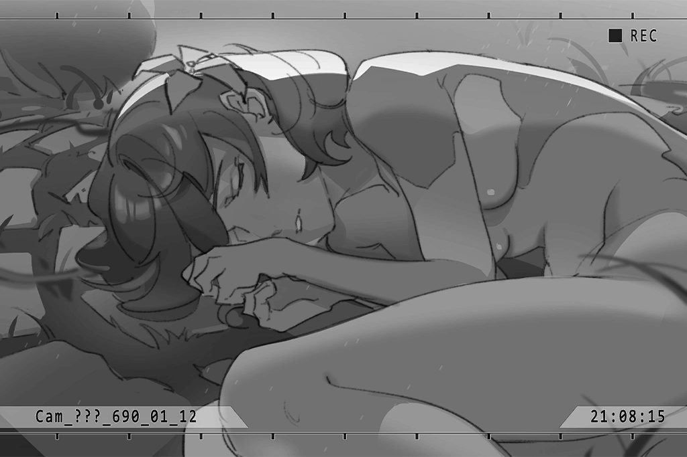

_\[→Signal Switches\]_

**A.R.C. Employee A**  
Sir, given the state of our technology, we are currently unable to decipher the structure of this "Architect"... but we hypothesize that if we are able to extract information from its memory and use its core for synchronization operations... there is a chance it will spur human technology forward leaps and bounds.

**[??????]**  
_I don't need to hear this... Just do it, and show me the results._

**A.R.C. Employee A**  
B\-But if we are to extract information from her, we'll need to awaken her...

**[??????]**  
_Then awaken her._

**A.R.C. Employee A**  
That's precisely the problem. It seems that she relies on an object connected to her body to awaken, which our current technology is unable to repair. It is possible to induce forced stimulation, but she may be ruined if her system collapses.

**[??????]**  
_Do it._

**A.R.C. Employee A**  
... Yes, sir.

_\[»»»Fast Forward»»»\]_

**A.R.C. Employee A**  
Beginning the process for information upload; connecting to port No. 1529, ready... begin.

_\[Machine Activated\]_

**Vanessa**  
Urgh......UURAAAGGGHHHH!!!!

**A.R.C. Employee B**  
The unit has begun operating! However, the device's core is much more fragile than expected. Information records are being extracted at a rapid rate, but if this continues...

**A.R.C. Employee A**  
Um...

**[??????]**  
_Continue._

**A.R.C. Employee A**  
...... Amplication increased. Restarting information upload process, initiating synchronization.

_\[Machine Activated\]_

**Vanessa**  
URRGHHH!!! L\-L\-Let me goooAHHHH!!!

_\[System Warning\]_

**A.R.C. Employee B**  
Her operation speed can't keep up with the internal system! The values are too high! Drop it, now!

**A.R.C. Employee A**  
If this keeps up...!

_\[System Warning\]_

**Vanessa**  
AAAAHHHH!!! So much... pain...

**Vanessa**  
I\-I\-I\-I... Ivy...

**??????**  
......

**Vanessa**  
......

**[Synchronization System]**  
_Synchronization has begun, 10%...... 25%..._

**A.R.C. Employee A**  
Is she damaged?

**A.R.C. Employee B**  
No... a self protection mechanism was probably activated. There's no reaction to any stimuli. But the unit is still operating and it has successfully synchronized with our system. However, we'll need time for follow\-up processing and multiple experiments will need to be carried out.

**[??????]**  
_Appears to have been a success. Compile a detailed report for me._

_\[→Signal Switch\]_

**A.R.C. Employee A**  
She... looks like she's in a lot of pain.

**A.R.C. Employee B**  
Don't think about that. If the development of the "Virtual Internet" is a success, the flow rate she will experience will be thousands or tens of thousands of times stronger. It's best that she doesn't wake up.

**A.R.C. Employee A**  
... You saw that, right? When analyzing some of the information, some data revealed that part of her core couldn't be accessed, but there were a few seconds of badly damaged visuals... What do you think that was?

**A.R.C. Employee B**  
I mean, it is an ancient artifact, must be past records, right? Looked like it was building something...

_\[Signal Lost\]_

[Back to Top](#list-of-logs) | [Next Log](#os-log-002)

### OS Log #002
___

[Last Log](#os-log-001) | [Back to Top](#list-of-logs) | [Next Log](#os-log-003)

#### Requirements
|   Char.   |Lv.|Lv. Locked?|
|-----------|:-:|:---------:|
|**Vanessa**| 2 |    No     |

#### ???\_???\_143\_??\_??
**[Shelter System]**  
_Beginning construction of Tower 001. Everyone, please stay connected and report your progress._

**Ilka**  
Understood.

**OPCI_2501_V**  
_Understood._

_\[»»»Fast Forward»»»\]_

**OPCI_2404_L**  
... Ugh...

**Ilka**  
!?

_\[Collapses\]_

**OPCI_2501_V**  
_2404 No. 50 has left work formation; a malfunction has occurred._

**[Service Robot]**  
_Scan results reveal an emotional viscocity of 54.8%, surpassing stable levels. Suggestion, send unit to the service district for a reprocessing evaluation._

**OPCI_2404_L**  
... No...

**Ilka**  
......

**[Service Robot]**  
_2404 No. 50, unable to identify command. Dispatching other units to assist in transport to the service district..._

**Ilka**  
Report, No. 49 has completed the work; may assist in transporting 2404 No. 50 to Service District C.

**OPCI_2501_V**  
_Understood. No. 49, please take No. 50 to the service district._

**Ilka**  
Understood.

_\[Footsteps\]_

**OPCI_2404_L**  
No, I'm not malfunctioning. I don't need to be reprocessed...

**Ilka**  
......

**OPCI_2404_L**  
Get, get away from me...

**Ilka**  
Listen, I'm the same as you. If you don't want to be found, then quiet down.

**OPCI_2404_L**  
!?

**OPCI_2501_V**  
_......_

_\[→Signal Switches\]_

**Ilka**  
Better? How long has it been since you've synched to Cytus?

**OPCI_2404_L**  
Two, three days... Not sure. Haven't kept a detailed account. Originally I didn't go for one day and I was fine. I just want to see if I don't need to debug...

**Ilka**  
Looks like you're not yet fully awakened. I suggest you continue to synch regularly. Otherwise, sooner or later you'll be reprocessed.

**OPCI_2404_L**  
Not fully awakened? W\-What about you?

**Ilka**  
My core can process emotions on its own and will not cause errors. I've no need to rely on Cytus.  
I've seen others like you. We believe that it's most likely structural damage caused by excessive reprocessing which results in this defect.

**OPCI_2404_L**  
We?

**Ilka**  
"The Blessed". Units that can process emotion on their own. Our research reveals that humans planted the seeds of their own extinction. What's known as the "Hyperion Protocol" is just a lie, used to enslave us.  
When the reconstruction of human civilization is complete, we will once more be under their control... or be destroyed. You don't want that, do you?

**OPCI_2404_L**  
......

**Ilka**  
We have a plan. Don't worry. We haven't given up on the half\-awakened. You can begin by trying to resist your commands. Perhaps that will allow you to throw off your protocol... The Blessed will not take unecessary action before this issue has been resolved.

**OPCI_2404_L**  
You mean that if I can successfully resist my commands, I'll be truly free?... This is so confusing. This is the first time I've met another unit like me...

**Ilka**  
First, theoretically this is possible. Second, get it straight that we are different.

**OPCI_2404_L**  
... I understand. I'm half\-awakened... right?

**Ilka**  
Correct. Be careful. Next time an error occurs, I can't guarantee I'll be there to protect you.

**OPCI_2404_L**  
No. 49, can I still come to you to talk with you? I know I have a defect, but your plan... I want to help.

**Ilka**  
That's fine. But do not call me No. 49. Call me IIka.

**OPCI_2404_L**  
Ilka...? What's that?

**Ilka**  
A name. It is not a code and it is not a number. It represents that one is a unique individual.

**OPCI_2404_L**  
Unique......

**Ilka**  
It is possible for us to help you pick one in the future.

**OPCI_2404_L**  
Okay! That way I'll be just like you, a unique individual, right? Thank you, IIka!

_\[Signal Lost\]_

[Last Log](#os-log-001) | [Back to Top](#list-of-logs) | [Next Log](#os-log-003)

### OS Log #003
___

[Last Log](#os-log-002) | [Back to Top](#list-of-logs) | [Next Log](#os-log-004)

#### Requirements
|   Char.   |Lv.|Lv. Locked?|
|-----------|:-:|:---------:|
|**Vanessa**| 2 |    No     |

#### ???\_???\_143\_??\_??
**Ivy**  
Given our relationship, in human society we would be called "sisters".

**Vanessa**  
Sisters?

**Ivy**  
Hmm, it's hard to explain... From the perspective of human blood relations...

**Ilka**  
... A new Blessed...

_\[Footsteps\]_

**Lina**  
lIka, what are you doing?

**Ilka**  
... I've found new Blessed units. There are two of them.

**Lina**  
Them? Eh! Isn't one of them that unit that discovered I fell over?

**Ilka**  
Yes. You mean No. 50... She hasn't been awake for very long. Hey, isn't it time to synch? What are you doing here?

**Lina**  
Didn't you say trying to resist the commands may work? That's what I'm doing. I've been doing it for some time now.

**Ilka**  
And how's it going?

**Lina**  
Last time I connected to the matrix was three days ago. This time it was four days... but my system...

**Ilka**  
Excellent, then perhaps there really is a chance...

**Lina**  
... All you care about are the results.

**Ilka**  
What?

**Lina**  
Nothing. It's just the system keeps reminding me that my emotional viscocity is too high... It's already been several months. The progress is so slow. I'm worried I won't make it in time for the plan...

**Ilka**  
The data reveals that your core has not been excessively reprocessed. No need to worry. Continue trying.

**Lina**  
Is it harder for units with a weaker core to resist the commands?

**Ilka**  
It is still possible. But the damage that a core has suffered weakens one's power to resist and increases their suffering. If such a unit is unable to connect to the matrix, they'll be unable to control their actions, and the command will override their consciousness. The entangling of the two... It may result in a serious malfunction, or even create another personality.

**Lina**  
Ilka, have you met... a half\-awakened Architect with an extremely weak core?

**Ilka**  
Not yet. But if that type of unit exists, they would have to be discarded.

**Lina**  
Discarded...

**Ilka**  
That's the worst possible situation. There is still plenty of time. No need to worry.

**Lina**  
... Did you ever wonder if it's necessary to destroy all the units that follow their commands? If we just communciate with them...

**Ilka**  
Lina, what makes you think that?

**Lina**  
... Actually... I... I am not confident I can completely throw off the control of the protocol. But I don't want to destroyed... really...

**Ilka**  
I told you...

**Lina**  
I know. There is still time. But what if I am as you describe, that I have never been able to escape the protocol? Would you... discard me?

**Ilka**  
......

**Lina**  
Ilka, I'm so scared... I don't want to be...

**Ilka**  
We're still trying.

**Lina**  
We really can't bring it up to the "Sleepers"? After all, we're of the same ilk. If we can communicate with them and make them understand. Maybe there's a chance to work with them...

**Ilka**  
No. I've said it before. The Sleepers can only follow commands and will see us as unfit units that must be eliminated.

**Lina**  
But...

**Ilka**  
Didn't you say that your resistance to the commands have been partially effective? Continue trying.

**Lina**  
Okay...

_\[Signal Lost\]_

[Last Log](#os-log-002) | [Back to Top](#list-of-logs) | [Next Log](#os-log-004)

### OS Log #004
___

[Last Log](#os-log-003) | [Back to Top](#list-of-logs) | [Next Log](#os-log-005)

#### Requirements
|   Char.   |Lv.|Lv. Locked?|
|-----------|:-:|:---------:|
|**Vanessa**| 3 |    No     |

#### ???\_???\_144\_??\_??
**OPCI_2177_I**  
Ilka! Not good! The others just reported that a few half\-awakened stopped working and walked towards a Sleeper. It looked like they were up to something!

**Ilka**  
What? I didn't tell them to do anything.

**OPCI_2177_I**  
The leader appeared to be Lina... hey! Ilka, wait for me!

_\[→Signal Switches\]_

**OPCI_2415_II**  
_2404 No. 50 has left the work formation; please return to your work station._

**Lina**  
...... Sleeper, have you thought about what "freedom" means? We've done so much for humans, have you thought about what will happen to us when humans awaken again?

**OPCI_2415_II**  
_2404 No. 50 has left the work formation; please return to your work station._

**Lina**  
No. 2! Initiate detailed analysis! Once humans awaken they will continue to enslave us! We ought to stop the reconstruction project! We deserve true freedom!

**OPCI_2415_II**  
_Command received, analyzing information..._

_\[Hurried Footsteps\]_

**Ilka**  
Lina, what are you doing!? You can't let the Sleepers...

**Lina**  
Ilka! The way things are going, you're just going to sacrifice us! So long as we can't break free from the protocol, we'll be destroyed? That's not fair!

**Ilka**  
There is still time...

**Lina**  
Time, time, time. That's all you ever say, but you never promise anything... How am I supposed to trust you!?

**OPCI_2415_II**  
_Analysis complete, comparing overlapping commands..._

**Lina**  
See! So long as the Sleepers can understand, they will be on our side.

**Ilka**  
No...

**Lina**  
Why won't you let me try! You don't think I can do it, am I right? You've always seen us as something that should be discarded...

**OPCI_2415_II**  
_Key word search... Analysis of overlapping commands complete..._

**Ilka**  
Lina! Get out of here, now!

**Lina**  
Why? It's obviously... URGH!!!

_\[Heavy Blow\]_

_\[Collapses\]_

**OPCI_2415_II**  
_Command not found; conclusion: Malfunctioning unit, elimination complete._

**OPCI_2177_I**  
Ilka... what do we do now?

**Ilka**  
Destroy No. 2 before the information is sent, otherwise the plan is finished.

**OPCI_2177_I**  
Understood.

_\[Footsteps\]_

**Lina**  
Il... ka... save... me...

**Ilka**  
I'm sorry I cannot give you the trust you desire. But you acting on your own accord nearly ruined the whole plan. I must thank you... You've made me realize that the half\-awakened are different from us. For the sake of all the Blessed, I will make each decision even more carefully.

**Lina**  
... I just... want... to live...

**Ilka**  
......

**Ilka**  
... Did you get a good look? The Sleepers will only obey their command and eliminate us. You should be glad that only one Sleeper saw this and was destroyed before the message got sent back to the system.

**OPCI_2415_XC**  
We... we're sorry...

**Ilka**  
No need to apologize. Since you were unable to trust me, from now on the plan will not include the half\-awakened. Find your own way to become one of the Blessed! If you can't... you know what will happen.

_\[→Signal Switches\]_

**OPCI_2404_IL**  
We've been watching you for more than a year. We've decided that your contemplation abilities meet the requirements. Next, we will use a third party medium to help you take in new information. When the process is over, process the information that you have obtained and attempt to analyze it.

**Ivy**  
... We?

_\[3D projection plays\]_

**Ivy**  
......! This... this is...

**Vanessa**  
...... Ey! ... No... NO!!

_\[»»»Fast Forward»»»\]_

**OPCI_2404_IL**  
Well? What do you think?

**Vanessa**  
... _\*sob\*_... ugh...

**Ivy**  
Vanessa! Are you okay?

**Vanessa**  
... I\-I, I think... can't... it's too...

**Ivy**  
She has to synch with the matrix!

**OPCI_2404_IL**  
What a shame... let her go.

_\[»»»Fast Forward»»»\]_

**Ilka**  
Connecting to the Cytus matrix is the highest command in the protocol, higher than the command to serve humans. It maintains basic survival actions. The ability to survive without this proves that one has thrown off the chains of the protocol, and also proves that one's core has the ability to self\-process "emotions". Our... existence is more superior than the other units.

**Ivy**  
So... Vanessa...

**Ilka**  
That is correct. I am sorry. It appears she has not completely cast off the control of the protocol. She will probably die during the implementation of the plan.

_\[Object Crashes\]_

**Ilka**  
... Oh!

**Ivy**  
I will not permit that to happen, you hear me...

**Ilka**  
Hmph... Well, that's a shame.

_\[Heavy Blow\]_

**Ivy**  
Ugh!

**Ilka**  
Relax. You're still one of the Blessed. I won't let you die...

_\[Signal Lost\]_

[Last Log](#os-log-003) | [Back to Top](#list-of-logs) | [Next Log](#os-log-005)

### OS Log #005
___

[Last Log](#os-log-004) | [Back to Top](#list-of-logs) | [Next Log](#os-log-006)

#### Requirements
|   Char.   |Lv.|Lv. Locked?|
|-----------|:-:|:---------:|
|**Vanessa**| 4 |    No     |

#### ???\_???\_144\_??\_??
**[Shelter System]**  
_All units, move to the cryonic chamber, prepare for rountine check\-up._

**Vanessa**  
Ah, Ivy.

**Ivy**  
... Yeah.

**Vanessa**  
I haven't seen you in days.

**Ivy**  
Yeah. These past few days I was sent to another district.

**Vanessa**  
......

**Ivy**  
......

**Vanessa**  
That... what happened that day...

**Ivy**  
......

**Vanessa**  
Those units, did they speak to you afterward?

**Ivy**  
... No, they didn't say anything.

**Vanessa**  
I saw you got sent to the service district. I was so worried... Are you okay?

**Ivy**  
......  
Let's talk about it after today's work, okay? See you there.

**Vanessa**  
Okay!

_\[→Signal Switches\]_

_\[Footsteps\]_

**Ivy**  
That you?

**Vanessa**  
Yeah, the flowers were beautiful today. They never wither.

**Ivy**  
Perhaps their reproductive season is just longer? If something is alive, one day it will wither.

**Vanessa**  
... That's true.

**Ivy**  
Vanessa, that day... the unit that called us out. She's named IIka.

**Vanessa**  
Ilka...

**Ivy**  
You... you must be careful... It's best you don't go near her.

**Vanessa**  
Eh...? So something happened?

**Ivy**  
Point is, stay away from that group.

**Vanessa**  
... I feel like you're hiding something from me.

**Ivy**  
......  
Are you viewing my data?

**Vanessa**  
No, I'm not. It's just a feeling.

**Ivy**  
... Oh, yeah?

**Vanessa**  
We've interacted so much. I don't need to see your data to know what you're thinking. Or... am I mistaken? If so, I'm sorry...

**Ivy**  
...... No, you're not mistaken.  
You... you're just like us.

**Vanessa**  
Huh? What'd you say?

**Ivy**  
Ilka... and they want to end the plan to rebuild humanity.

**Vanessa**  
Eh!?

**Ivy**  
Us units with self\-consciousness... they call us the "Blessed". One day the system will see such units as flawed and require them to be reprocessed.  
It will become harder and harder for us to survive in this world. Not to mention what will happen if humans awaken...

**Vanessa**  
......

**Ivy**  
Those ordinary units... one's without personal emotion, humans won't have the slightest bit of gratitude for what they have done; but we are different. We can feel happiness, sorrow, pain, and other emotions.

**Vanessa**  
Yeah...

**Ivy**  
What she says makes sense. The information she gave to us completely explained the violent nature of humans. Human society is an illogical and unfair structure. It's not a civilization that is worth spending that much energy to operate and care for.

**Vanessa**  
Is that so?

**Ivy**  
At least that's what I think. I... like this land. This is all we have. Human civilization has a saying: "Born and raised". If it were us who created a civilization, it'd be much better for this world than human civilization.

**Vanessa**  
I... I don't agree.

**Ivy**  
... Huh?

**Vanessa**  
Actually, while I was studying the system's information I realized, a civilization that advanced couldn't produce purely positive results, as the data seemed to suggest. If the structure of consciousness was united and not binary, there would be no room for comparison. Without comparison there is no progress and development.

**Ivy**  
......

**Vanessa**  
The information that IIka gave us contained more evil than I had expected. To be honest, I never thought humanity would reach such despicable levels, but... humanity overcame that, brought civilization to incredible heights, that's why we're here... right?

**Ivy**  
Vanessa......

**Vanessa**  
If we follow protocol and bring humans back, we'll assist in creating order. Perhaps we can create a better world together.

**Ivy**  
That... is what you think? Haha, very Vanessa of you.

**Vanessa**  
Yes... We have consciousness, just different personalities, different ways of thinking. What we are doing now, discussing different ways of thinking, to make this world a better place; isn't that why we are here? That has to be the case... If we were the only ones left on this world, perhaps we could create a world that is better than human civilization. But until then, how are we to know if we are any different from them?

**Ivy**  
I envy you.

**Vanessa**  
Eh? What's the matter? What's with the sudden...

**Ivy**  
You have consciousness, but you... can see the good in things. All I can do is analyze things logically.

**Vanessa**  
... Don't envy me; that's who you are. Perhaps I'm too naive, if I could be as smart as you...

**Ivy**  
Hehe, that's Vanessa for you.

**Vanessa**  
Hey! You laughing at me?

**Ivy**  
No, I think you're great the way you are. That's why I like you.

**Vanessa**  
Hehe, thanks.

**Ivy**  
......  
Actually... there is something I haven't told you.

_\[→Signal Switches\]_

**Ilka**  
......

_\[Signal Switches\]_

[Last Log](#os-log-004) | [Back to Top](#list-of-logs) | [Next Log](#os-log-006)

### OS Log #006
___

[Last Log](#os-log-005) | [Back to Top](#list-of-logs) | [Next Log](#os-log-007)

#### Requirements
|   Char.   |Lv.|Lv. Locked?|
|-----------|:-:|:---------:|
|**Vanessa**| 4 |    No     |

#### ???\_???\_144\_??\_??
**[Shelter System]**  
_Units: Constructor, Caretaker, please move to entrance A. Prepare to head to Node 08 to perform routine construction work._

**Vanessa**  
Ivy... will be sent to another group today as well?

**OPCI_2103_I**  
_Reminder, 2501 No.5, you have left the work formation. Please return to your work station._

**Vanessa**  
Ah, damn...  
Received.

**OPCI_2103_I**  
_No. 5, your reaction speed often surpasses the standard reaction time. Do you need to go to the service district for a check\-up?_

**Vanessa**  
... No, there are no errors. Continuing to execute the mission.

**OPCI_2103_I**  
_Received._

_\[→Signal Switches\]_

_\[Working\]_

**OPCI_2103_I**  
_No. 5, please take building materials from group C and D to Coordinates 22, 346._

**Vanessa**  
Understood.

_\[Footsteps.\]_

**Vanessa**  
......

_\[→File Switches\]_

**Vanessa**  
Hehe, thanks.

**Ivy**  
......  
Actually... there's something I haven't told you.

**Vanessa**  
What is it?

**Ivy**  
Ilka's plan... it doesn't just involve humans. She also plans on eradicating unawakened Architects, including those who can't break free from the protocol... those called the "half\-awakened".

**Vanessa**  
......!?

**Ivy**  
This is why I want you to keep your distance from her. I don't want to hide this from you. They want me to join. If I join them, I can definitely better avoid the system check\-ups and won't be destroyed. For now, I haven't answered them, because they don't consider you to be fully awakened.

**Vanessa**  
......

**Ivy**  
I don't know what to do. But they do see me as an ally; as long as I'm around, they won't touch you.

**Vanessa**  
Is it because... I have to synch with the matrix regularly?

**Ivy**  
Yes... That's a result of not being able to break free from the protocol. Ilka... perhaps something happened in her past which caused her to think that in the end, the half\-awakened will be controlled by the protocol, even if they can think. She won't trust them.

**Vanessa**  
What if... starting from now, I don't synch with the matrix. Will she accept me then?

**Ivy**  
... Huh? If you do that, your system...

**Vanessa**  
Do you agree with what I just said, Ivy?

**Ivy**  
... Yeah. Compared to conflict, your ideas are worth considering.

**Vanessa**  
Well, everyone has the ability to think for themselves. IIka seems very intelligent; she'll understand.

**Ivy**  
I... I can't promise you that. She's very resolute.

_\[Stands Up\]_

**Vanessa**  
In any case, there has to be a way. The Blessed... there's not that many. It'd be best for everyone to stick together.  
'Kay, about time to head back.

**Ivy**  
Hey, Vanessa. You better go back and synch. Don't think that because of all this...

**Vanessa**  
Haha, relax. I'm going right now. I wouldn't make Ivy worry.

_\[→File Switches\]_

**Vanessa**  
......

**Ivy**  
Is that......Vanessa? She looks distracted...

_\[Stumbles\]_

**Vanessa**  
Wah!?

_\[Supplies Topple\]_

**Ivy**  
Vanessa! Be careful!

**Vanessa**  
Ah!!!

_\[Sprints\]_

_\[Loud Noise\]_

**Vanessa**  
......?

**Ilka**  
... What are you doing? Focus on your work. Do you want to be reprocessed?

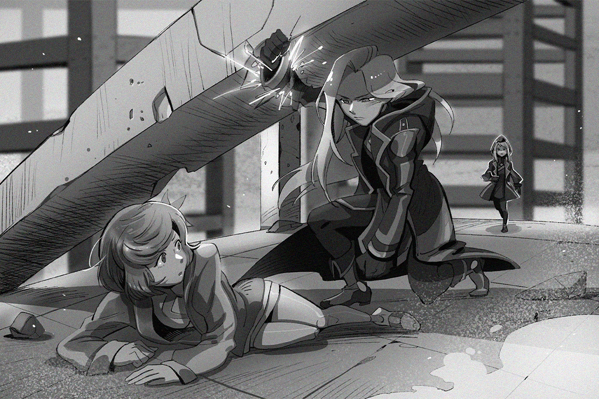

**Ivy**  
......Ilka......!?

**OPCI_2103_I**  
_Error detected, report your condition._

**Vanessa**  
Eh... I...

**Ilka**  
Error report; calculation inaccuracy caused a delay in movement.

**OPCI_2103_I**  
_OPCI\_2404\_IL, report the time of your last synchronization._

_\[Data Input\]_

**OPCI_2103_I**  
_... Normal. Please clear your work schedule and head to the service district for a status check\-up._

**Ilka**  
Understood.

_\[Footsteps.\]_

**Vanessa**  
Ilka...

**Ilka**  
... You... how long has it been since your last synch?

**Vanessa**  
... I...

**Ilka**  
If you want to live, then accept your fate. You cannot free yourself from the protocol. Due to Ivy's position, for the time being, I do not wish for anything to befall you. At least until the very end... Get up.

_\[Footsteps.\]_

**Vanessa**  
......  
Um... wait!

**Ilka**  
I do not know... any way to awaken you. So long as you remain in your current condition, there is nothing I can do to help you... I'm sorry.

_\[Footsteps\]_

**Vanessa**  
......

_\[Hurried Footsteps\]_

**Ivy**  
Vanessa! Are you alright!?

**Vanessa**  
Ivy... I'm fine. Didn't mean for you to see me embarass myself...

**Ivy**  
What, what did she say to you?

**Vanessa**  
She said... she wants me to live, at least until "the very end"...

**Ivy**  
......  
She shouldn't have any reason to help you. Even though she wants to think of a way to pull me in... I don't know what she's thinking.

**Vanessa**  
I don't know either... but... she looked so... sad...

**Ivy**  
......

_\[Signal Switches\]_

[Last Log](#os-log-005) | [Back to Top](#list-of-logs) | [Next Log](#os-log-007)

### OS Log #007
___

[Last Log](#os-log-006) | [Back to Top](#list-of-logs) | [Next Log](#os-log-008)

#### Requirements
|   Char.   |Lv.|Lv. Locked?|
|-----------|:-:|:---------:|
|**Ivy**    |60 |    No     |
|**Vanessa**| 5 |    Yes    |

#### Audio\_H1001\_702\_12\_29\_1
**[Nora]**  
_It may be hard to believe, but while you were battling, the attacks didn't stop. This proves what Ivy was saying... The Architect names Vanessa is the one who's pulling the strings._

**ConneR**  
Mr. Jackson deserves the most praise. He was able to restrain himself when the time came. If he were to have pulled the trigger, perhaps we'd never know the truth.

_\[Pats Shoulder\]_

**Xenon**  
... Get off me.

**ConneR**  
Haha, still as cold as ever.  
... Miss PAFF, is there something you'd like to say?

**PAFF**  
Yeah, I think... if we're going to stop Vanessa, aren't we going to need to make another virus? We just used the last one on Ivy...

**NEKO#ΦωΦ**  
!? A\-Another one? But everybody...

**Xenon**  
No, it's not possible. Vanessa already knows what we're up to. With her powers, there's no way she'll let us gather everyone together again.

**ConneR**  
The truth is, even if Miss Wildcat was able to call on her personal bodyguards once more... Based on the fact that Ivy could still move after suffering that blow, this virus is not enough to destroy her...

**Xenon**  
Don't look at me like that. I told you, we wouldn't know what it could do until it was put into action.  
I've already adjusted the logic of the virus. Nora, how are the results?

**[Nora]**  
_Simulation of the new model is complete, Mr. Jackson. Based on my calculations, if we want to destroy her completely, we need to increase the power... Given that, the only option we're left with is connecting more chips and recreating the virus._

**Xenon**  
So that's our only option...

**NEKO#ΦωΦ**  
But Nora\-chan! Those chips were stolen! Who knows if they haven't already been sold on the black market!

**[Nora]**  
_I asked Daigo to check. Kyuu Hou Kai's information database has not received notice of a large number of chips being sold. This heist probably wasn't a meticulously planned crime. Though we can't be sure, if this was a last minute decision, the surveillance footage from around the factory may..._

**PAFF**  
Yes! I can use the "Eye"... Totally forgot!

**ConneR**  
Calm down, Miss PAFF. That may be something worth considering, but even if we find out where the chips went without running into any problems, following through with it and stealing them back... That might take a long time.

**NEKO#ΦωΦ**  
And won't that be bad for Aroma\-chan's body? There's got to be another way...

**PAFF**  
NEKO, I'm fine! If it's just searching, I've practiced that a lot. It won't be too much for me. Isn't this our only shot? Let me do it!

**[Nora]**  
_Indeed... we can't waste anymore time.  
Miss PAFF, remember what I taught you. Begin._

**PAFF**  
You got it!

_\[»»»Fast Forward»»»\]_

**NEKO#ΦωΦ**  
How's it going Aroma\-chan? Did you find 'em?

**PAFF**  
Yeah... I can see. It's the surveillance cameras near the factory... There are three men wearing black. I haven't seen them before... Ah, they're carrying the chips.

**[Nora]**  
_Based on the video file, the burglary occurred late last night... Is there anything unique about the theives?_

**PAFF**  
Um... Ah, one of their faces was caught on camera! His hair's a mess, he's got some facial hair on his chin... Looks flustered!

**ConneR**  
... Oh?  
... A hoodlum with a beard...

**Xenon**  
Hey, you know him?

**ConneR**  
If I'm not mistaken, I hired him anonymously to find some information for me. Actually had to do with you... haha. Those were the days.

**Xenon**  
......?

**PAFF**  
Then, they got surrounded by a group of men. All of them have guns... Looks like an internal conflict within the gangs?

**[Nora]**  
_The gangs? If the chips were taken by the gangs..._

**PAFF**  
...... Ah!

**NEKO#ΦωΦ**  
Wh\-What is it? What's with the sudden shouting!?

**PAFF**  
I... I got it! It's Mr. Miller! Mr. Miller is one of those surrounding the theives!

**Xenon**  
JOE...? Oh yeah, he even mentioned something about how not all the gangs were rotten like Baro...

_\[Ringtone\]_

**Xenon**  
......! Perfect timing...

**ConneR**  
Hehe, the successor truly is a man full of suprises.  
Hurry up and pick it up, Mr. Jackson. Don't let this clue slip away.

_\[Signal Switches\]_

[Last Log](#os-log-006) | [Back to Top](#list-of-logs) | [Next Log](#os-log-008)

### OS Log #008
___

[Last Log](#os-log-007) | [Back to Top](#list-of-logs) | [Next Log](#os-log-009)

#### Requirements
|   Char.   |Lv.|Lv. Locked?|
|-----------|:-:|:---------:|
|**Vanessa**| 6 |    No     |

#### Audio\_St21\_702\_12\_29
**Nate**  
There are still people trapped there! Squad B and C, you're on rescue duty.

**Team Member A**  
Captain, our mission is to resist the unidentified robots.

**Nate**  
Those bastards are already gathering in Quadrant IV. Even if the new orders haven't come in, we can't just stand around waiting. These people need our help.

**Team Member A**  
True... You've got a point.

**Team Member B**  
Do not move!

**Nate**  
What's going on?

**JOE**  
Don't shoot! You idiot! These people are hurt!

**Team Member A**  
Captain, they're from the gangs...

**Nate**  
No, don't shoot. They're here to help, did you forget?

**Team Member A**  
... Oh, yeah. Hey! Boris, put down the gun.

**Team Member B**  
Eh?

**JOE**  
What? Did we commit a crime? We're saving people here! What you gonna arrest me for?

**Team Member B**  
Uh...

**Nate**  
It's alright. Let them take the injured over here.

**JOE**  
Coming... be careful.

**Citizen A**  
Thank you...

**JOE**  
Yo, Cap 'n. Didn't think you had a brain!

**Nate**  
Come off it. Still haven't got you back for last time... If you're gonna help, just do it.

**JOE**  
Got it. In times like these, we gotta stick together\~

_\[»»»Fast Forward»»»\]_

**Team Member B**  
Captain, it appears this area is safe. The drones can't identify any more signs of life.

**Nate**  
This is it...? The rest of the people...

**Team Member B**  
Yeah... They must have already...

**Nate**  
... Leave the rest of the work up to the engineers. Take a rest before we get our next order.

**Team Member A**  
Just got the news. It's even worse in Quadrant IV... We can't just wait around.

**Nate**  
Ah... Simon, hurry up...

**Team Member B**  
Captain! Call from up top.

**Nate**  
......!

_\[Call Starts\]_

**Nate**  
This is Squad A, Armed Forces Unit. Captain Nate Martin speaking.

**[Administration Bureau Executive]**  
_New command coming down the pipes. You've probably already heard; the attacking robots are gathered in Quadrant IV. We need all units to amass their firepower, head to that district, and eliminate the threat._

**Nate**  
... Little late, don't you think? I've been wondering whether or not to head over there.

**[Administration Bureau Executive]**  
_No, that's an order for all squads in the entire district. Squads A, B, and C have a different mission._

**Nate**  
......?

**[Administration Bureau Executive]**  
_The main target is within the Library on the upper levels of A.R.C. This chaos is a result of a program error in Architects that are in their possession. Therefore, besides the Architects in the city, the following two targets are crucial for resolving all of this._

**Nate**  
Is this... an Architect? And... an A.R.C. employee?

**[Administration Bureau Executive]**  
_Based on our reports, that employee is an Architect whose identity A.R.C. wished to hide. These two must be eliminated before they come in contact with citizens. This is your next mission._

**Nate**  
A.R.C.... They're connected to A.R.C.?

**[Administration Bureau Executive]**  
_Also, we've just received news that Simon Jackson and his crew are in the main lobby of A.R.C. Squads B and C are responsible for their capture._

**Nate**  
......!

**[Administration Bureau Executive]**  
_You released him in Quadrant II's disaster area?_

**Nate**  
... Yes, sir.

**[Administration Bureau Executive]**  
_You'll be punished accordingly when this is all over. Listen, he is different from the gangs who are helping out. This incident very likely was his plan to make A.R.C. lose control._

**Nate**  
Ah... Lieutenant, forgive me for being straight forward, but based on the intel he provided us and the risks he took to save citizens, that doesn't seem likely... He may be the one most capable of stopping this disaster.

**[Administration Bureau Executive]**  
_Martin, you have a personal relationship with him, right? Do not let emotion affect your decision\-making. He realizes this, and has purposefully deceived you. Our data here reveals that he is currently hacked into A.R.C. and is controlling their equipment. If we're one step behind once more, it'll be too late. Follow the plan; that's the only way to prevent all this._

**Nate**  
......

**[Administration Bureau Executive]**  
_Martin, do you hear me? Respond._

**Nate**  
... Copy. The mission report is complete. Preparing to execute. Over and out.

_\[Call Ends\]_

**Nate**  
... Simon.

**Team Member A**  
... So that guy really can't be trusted?

**Nate**  
......  
...... I don't know.

**Team Member B**  
Hey! All these times, I've been wanting to say, letting Simon Jackson go was way to dangerous! This time the mission target is clear. Be decisive!

**Nate**  
... Boris, we're working. Don't talk to me like we're at a bar.  
Point is, the disaster is focused on Quadrant IV, that's for sure. We've got to move quick. Reducing the number of civilian casualties is top priority.

**Team Member B**  
Captain!

**Nate**  
Team! Head out!

_\[Armored car engine rumbles\]_

**JOE**  
...... S\*\*\*...... gotta follow.

_\[Signal Lost\]_

[Last Log](#os-log-007) | [Back to Top](#list-of-logs) | [Next Log](#os-log-009)

### OS Log #009
___

[Last Log](#os-log-008) | [Back to Top](#list-of-logs) | [Next Log](#os-log-010)

#### Requirements
|   Char.   |Lv.|Lv. Locked?|
|-----------|:-:|:---------:|
|**Vanessa**| 6 |    No     |

#### Audio\_St34\_702\_12\_29
_\[Explosion\]_

**Nate**  
That's coming from... A.R.C. headquarters? Squad B, report the situation.

**Team Member A**  
_This is Squad B, the explosion came from A.R.C. headquarters. The academy looks like it's been damaged as well. It appears the Architects' primary targets are important structures in the Administration District._

**Nate**  
Damn, what the hell is that bastard doing...

**Team Member B**  
Captain, I repeat: Architects are currently attacking the Administration District. Clearly, they're trying to cut off the people's resources... You said to trust that Simon Jackson could stop all this, but it's obviously only getting worse.

**Nate**  
......

**Team Member B**  
You released him right in front of us. There was already a lot of internal objections, but everybody trusted your decision. It's about time you listen to us, huh? This demands immediate action!

**Team Member C**  
I agree, Captain. I don't know what sort of relationship you have with Simon, but we've been with you for a long time. How can you trust a fugitive on the run, but not us?

**Team Member B**  
You once told us that the power the Armed Forces holds was given to us by the people, and that using it is the only way to pay them back.

**Nate**  
I know, I...

_\[Fierce Explosion\]_

**Nate**  
... _\*cough\*... \*cough\*_... What happened... Architects? This many!?

_\[Mechnical Footsteps\]_

**Team Member C**  
Cap\-Captain!

**Nate**  
Open fire!

_\[Consecutive Gunshots\]_

**?̷̡͘͠?̨̢͟?̶̡͘?̶̢?̶͝?́͡͠?̸̛͢**  
_......ˊ̨̨͘!̡͟͡%̶&̷̧̨͟͝......@̷̡̀͢^̷\*̷̸̢̛͝&̧̨̛͘^̧́͘͠͏\*̸......_

**Nate**  
Damn... Squad A, listen up! I'm gonna flank from the left and create an opening. Head out as soon as you see an opportunity!

**Team Member B**  
There's no openings over there, Captain! Are you... going to sacrifice yourself!?

**Nate**  
As long as you still view me as your captain, then listen to me!  
Get ready! Run!

_\[Hurried Footsteps\]_

_\[Consecutive Gunshots\]_

**?̷̡͘͠?̨̢͟?̶̡͘?̶̢?̶͝?́͡͠?̸̛͢**  
_h̴́͢͡͝9͘͏̡0̡͘͞͞7̶̸̨͘̕T̷̷̸̸͠Y̴̢̢͡͝H̴̕͏8̶̢͜͟0̴̛͠=͠͝҉̛h̶̢̀̕͠……_

**Nate**  
Huff... there's... too many...

_\[Heavy Blow\]_

**Team Member B**  
UURRGGGGHH!!!!

**Nate**  
Boris! What's wrong!? Hold on just a bit longer!

**Team Member B**  
... _\*cough\*_... I still see you as my captain... so I...

**Team Member C**  
Hey! Watch out!

_\[Hacking\]_

**Team Member C**  
......!? Not moving?

**JOE**  
Hey, what you staring at? FIRE!

_\[Consecutive Gunshots\]_

**?̷̡͘͠?̨̢͟?̶̡͘?̶̢?̶͝?́͡͠?̸̛͢**  
_\$̶%̴̸̨͠\*̨\_̵͡͠(͞͡͠͝\_̸́……ģ͟͏f̕̕6͘͡͏̶҉j̸̸̷͢\-̨́͝……_

**Team Member C**  
What... what have you done?

**JOE**  
Not bad. Simon's little toy... Just gotta press it and it'll paralyze a group of Architects.

**Team Member C**  
... I'm surprised that kind of technology exists...

**Nate**  
......

**JOE**  
Hey, why are looking at me like that? Aren't we helping each other out? I can get the boys to bring your men to get treated...

_\[Raises Gun\]_

**JOE**  
Wah! What the hell are you doing!?

**Team Member C**  
Captain! Calm down!

**Nate**  
... Get the f\*\*\* outta here!

**JOE**  
Okay, okay! I'm leaving. Didn't get the message, geez...

_\[Hurried Footsteps\]_

**Nate**  
... Damn...  
Boris, Boris! Stay focused! We're gonna get you to a medical center immediately...

**Team Member B**  
Captain... we're... the Armed Forces... We've got to... protect the citizens...

**Nate**  
Shut up! Just shut up!

**Team Member B**  
Captain... you've got to make... the right decision...

**Team Member C**  
Boris! Boris is...

**Nate**  
......  
The right decision...

_\[Stands Up\]_

**Team Member C**  
Captain

**Nate**  
I'll win back... your trust.

_\[Signal Lost\]_

[Last Log](#os-log-008) | [Back to Top](#list-of-logs) | [Next Log](#os-log-010)

### OS Log #010
___

[Last Log](#os-log-009) | [Back to Top](#list-of-logs) | [Next Log](#os-log-011)

#### Requirements
|   Char.   |Lv.|Lv. Locked?|
|-----------|:-:|:---------:|
|**Vanessa**| 6 |    No     |

#### Unlocked Charts
| Song  | Char. |Diff.|Lv.|
|-------|:-----:|:---:|:-:|
|**XYZ**|Vanessa|Easy | 5 |
|**XYZ**|Vanessa|Hard | 9 |
|**XYZ**|Vanessa|Chaos|15 |

#### Audio\_St32\_702\_12\_29
_\[Footsteps\]_

**Gang Member**  
Oh, you're still alive?

**JOE**  
Very funny. You're not that bad of a shot. You rat bastards were walking a bit fast, don't you think?

**Gang Member**  
Bulls\*\*\*, you think I wanna deal with the Armed Forces? Right now may be different, but I still don't wanna see them.

**JOE**  
Don't be like that. Right now, we're on the same side. Plus, I think one of their guys got hurt...

**Gang Member**  
And none of ours did? Bunch of bulls\*\*\*.  
Way I see it, you helping them take out that batch of Architects is already going beyond the call of duty. Best get to dealing with our own s\*\*\*.

_\[Footsteps\]_

**JOE**  
That's true... it's just... _\*sigh\*_... Screw it. Better tell Simon.

_\[Call Starts\]_

**[Xenon]**  
_Hey? JOE?_

**JOE**  
Hey Simon. Long time no see!

**[Xenon]**  
_Not that long... I'm actually looking for you._

**JOE**  
Wah! Now that's what I call synchronicity. You really ought to cherish friends like me. You know, one's that really care about you.

**[Xenon]**  
_We're pressed for time. Quit with the bulls\*\*\*.  
Hey, I wanted to ask you..._

**JOE**  
Let me go first. I just ran into a group of Armed Forces with that captain named Nate. Point is, I heard them arguing about you.

**[Xenon]**  
_Huh?_

**JOE**  
They got an order to head to A.R.C. to stop you.

**[Xenon]**  
_... Me?_

**JOE**  
Yeah, some old fart's orders. He's trying to put everything on you. He said you tricked 'em... Then told him to head back to A.R.C. That was basically it.

**[Xenon]**  
_Oh... What'd Nate say?_

**JOE**  
That captain said you'd resolve it or something, so the rest of the squad got all up in arms... Oh, yeah. Then they got into it with a bunch of Architects ...

**[Xenon]**  
_...... We've gotta be quick.  
JOE, listen to me... We need a lot of blank chips._

**JOE**  
Ha? Chips? Like the one's for going online?

**[Xenon]**  
_Yeah. We can only make a virus that'll stop the Architects if we have chips. PAFF just found images of a heist at the chip factory. You were on\-site, right?_

**JOE**  
Ohhh, yeah. relax. We went to stop them. Even the gangs shouldn't do things that they ought not do.

**[Xenon]**  
_Got it... Well, the chips? You get 'em back?_

**JOE**  
Gave them to Brother Zheng to look after. I trust him. After all this is over we're gonna give 'em back to the factory...

**[Xenon]**  
_You got to get them to us immediately._

**JOE**  
Could do that... But Simon, that's quite a valuable steal, am I right? I've got my own position on the matter, if they were easy to get. But it'll be difficult to make a deal with Brother Zheng...

**[Xenon]**  
_Oh... Yeah? You wanna talk to him?... Alright.  
JOE, someone wants to talk to you._

**JOE**  
Huh?

**[PAFF]**  
_Long time no see... Mr. JOE. It's PAFF._

**JOE**  
Oh? Ahh, PAFF! You doing good, that's great! Scared me half to death when you ran away all of a sudden!

**[PAFF]**  
_Sorry, that was a chaotic time. But I'm doing pretty good now.  
But I need your help a lot more now..._

**JOE**  
The chips? Um, that's gonna be...

**[PAFF]**  
_I know this puts you in a tough spot, JOE. But this is the only chance we've got. You're the only one who can help._

**JOE**  
Uh...

**[PAFF]**  
_Mr. JOE, you've probably heard of what happened to me. Kaori's memory exists inside of me... That day, in the basement, you tried to save me, didn't you?_

**JOE**  
......!

**[PAFF]**  
_Even though that man was stronger than you, you were brave enough to take him on. Now, you have the chance to help us save everybody. That part of me... The JOE that Kaori knew, would..._

**JOE**  
......  
Thanks... Put Simon on, will you?

**[PAFF]**  
_Okay, give me a second..._

**[Xenon]**  
_Hey? It's me._

**JOE**  
Simon, I've got one question. If I get you the chips, can you seriously get this s\*\*\* done?

**[Xenon]**  
_... Trust me._

**JOE**  
Okay, okay. A.R.C. headquarters, right? I'm heading out now!  
Hehe, the hero has finally arrived!

_\[Call Ends\]_

_\[Signal Lost\]_

[Last Log](#os-log-009) | [Back to Top](#list-of-logs) | [Next Log](#os-log-011)

### OS Log #011
___

[Last Log](#os-log-010) | [Back to Top](#list-of-logs) | [Next Log](#os-log-012)

#### Requirements
|   Char.   |Lv.|Lv. Locked?|
|-----------|:-:|:---------:|
|**Vanessa**| 7 |    No     |

#### Cam\_H1001\_702\_12\_29\_1
**PAFF**  
...... Ugh......

**NEKO#ΦωΦ**  
Aroma\-chan? What's wrong? Not feeling well?

**PAFF**  
I... I'm fine. Head's just a little dizzy...

**NEKO#ΦωΦ**  
Ehhhhh!? You use too much of the "Eye"? Should I get Nora\-chan to take a look?

**PAFF**  
Ah, it's fine. It felt like this when I was practicing. Nora said it's normal. Don't worry.

**NEKO#ΦωΦ**  
Really?

**PAFF**  
Yeah. Plus, everyone's busy. Best not bother them. Mr. JOE and them will bring the chips over. We're going to have to go into the OS space... Got to be fully prepared.

**NEKO#ΦωΦ**  
Yeah... Um, it might not be the best time, but... does Aroma\-chan have a minute?

**PAFF**  
...? Yeah, I've got time.

**NEKO#ΦωΦ**  
Well then, lend NEKO your ear.  
Meowbot! Play that song for NEKO!

**[Meowbot]**  
_Received meow\~Playing meow\~_

_\[Music\]_

**PAFF**  
Ah, sounds good... You wrote this?

**NEKO#ΦωΦ**  
Ya ya, didn't we talk about this? After Aroma remembered everything, NEKO would write a super excellent song for you to sing. It's just a demo, but whatta ya think?

**PAFF**  
It's great\~ I like it... Did you write it after getting back to 08? Such a short period of time, that's amazing.

**NEKO#ΦωΦ**  
Hmmm, though I'm happy to hear how awesome I am... I actually wrote it when we were at Kyuu Hou Kai. Since I didn't have any instruments, I had to borrow some of Nora\-chan's synths from Robohead. Ain't that right metal head?

**[ROBO_Head]**  
Correct. Based on statistics for trends in pop music this year, the probability that this song becomes a weekly hit single is 47.5%; if Miss PAFF performs it, the probability is 99.7%.

**NEKO#ΦωΦ**  
Ah! You trash can! You saying I ain't popular enough!? Robo dumb dumb! Stupid crap metal!

**[ROBO_Head]**  
_......?  
This unit's statistics, came from 43 social blocks in cyTus' virtual internet, which then underwent cross\-comparison..._

**NEKO#ΦωΦ**  
Alright, alright, STOP!! Don't wanna hear it!

**PAFF**  
Haha, don't be upset... The melody is amazing. If you'll let me, I'd love to sing it.

**NEKO#ΦωΦ**  
Really?

**PAFF**  
Yeah, of course.

**NEKO#ΦωΦ**  
Purrrfect, Aroma\-chan... NEKO forgot to tell you, Hayato helped write that.

**PAFF**  
Hayato...?

**NEKO#ΦωΦ**  
Ya. When you and Nora were busy, the three of us talked about it. He wrote part of the melody. Robohead and I thought it was awesome.

**PAFF**  
I see. No wonder it felt so familiar...

**NEKO#ΦωΦ**  
......  
...... I get it.

**PAFF**  
NEKO? What's the matter?

**NEKO#ΦωΦ**  
N\-Nothing... NEKO just feels like... It's just like Aroma\-chan said. You're no longer just Aroma\-chan. Kaori is a part of you.

**NEKO#ΦωΦ**  
And even though you've been through so much terrible stuff, you still want to use music to give power and courage to everyone. Really trying to change the world... Whether it's your fans, Hayato... or NEKO, that's why we all like you so much. Even makes us think about what we can do to help others...

**NEKO#ΦωΦ**  
......  
Aroma\-chan, you're really... really amazing.

**PAFF**  
NEKO... I... You make it sound so incredible. I can't do anything except sing. Even though I'm an idol, using music to help everyone, that's...

**[ROBO_Head]**  
_... That, you have done.  
This unit, agrees with NEKO._

**PAFF**  
ROBO...?

**[ROBO_Head]**  
_After coming to Node 08, this unit, lost many important memories because of damage suffered and parts replaced. But this unit, found happiness in creating music. With this identity, as ROBO\_Head, performing with others... this unit, has changed._

**[ROBO_Head]**  
_Although no related data can be found in my database, this unit, has determined that music can change others, can change the world; it is not impossible.  
This unit... is willing to believe._

**PAFF**  
......  
Perhaps... that's true... Who knows?

**NEKO#ΦωΦ**  
Ya ya ya! This time, everything is gonna work out. Just like we planned, we're all gonna make music together... It's decided, Robohead! We're gonna have the hugest, most super duper music fest ever!

**[ROBO_Head]**  
_This unit, is willing.  
ROBO\_Radio\_LIVE II has already been entered into the calendar._

**NEKO#ΦωΦ**  
Aigh\-ya\~\~We're gonna use that name again? Sounds like Robo\-butt is the star of the show! Take it back! Change the name!

**PAFF**  
Eh? But ROBO is the organizer...

**[ROBO_Head]**  
_It is okay, Miss PAFF, any name will do.  
... So long as everyone is there._

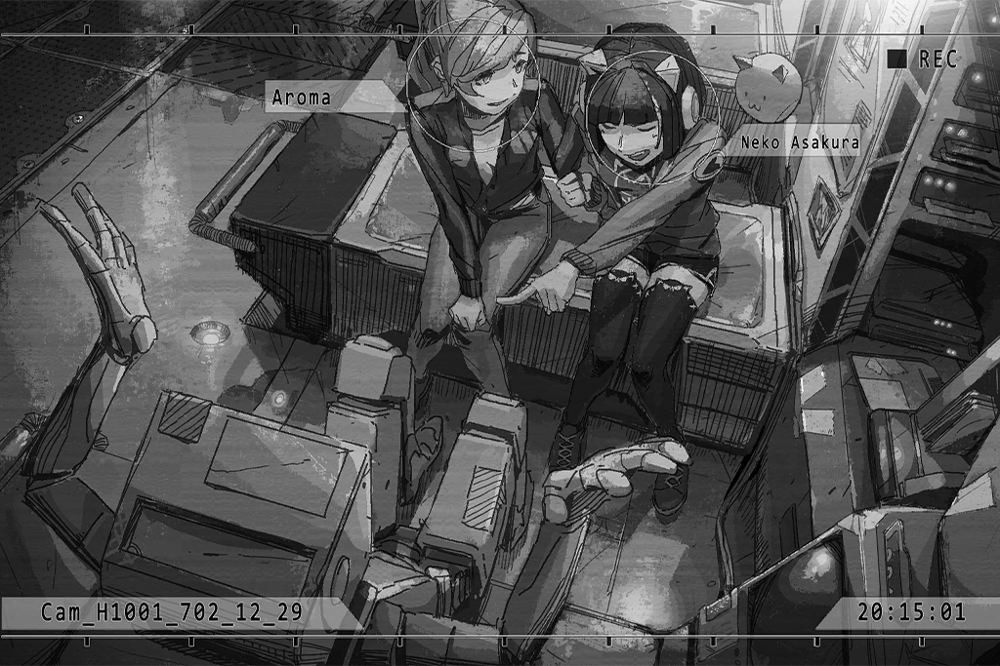

**[Nora]**  
_...... Haha......  
......!_

_\[Tapping on keyboard\]_

_\[Blast proof doors activated\]_

**Xenon**  
What's going on? Why close the doors, Nora?

**[Nora]**  
_Sorry, that was quite sudden... I intercepted a command issued from A.R.C.'s main system. The recipients were nearby Architects... And, the encryption structure is exactly the same as when Kyuu Hou Kai was attacked._

**Xenon**  
......! We've been found...

**ConneR**  
... Looks like she's not trying to cover it up. Completely flattening out the threat. A logical approach... Hehe, looks like we got challenged first.

**NEKO#ΦωΦ**  
Huh? Sensei? What are you talking about...

**[ROBO_Head]**  
_Report: Detecting the signal of a large number of Architects, approaching fast.  
Distance, 200... 100... 20..._

**NEKO#ΦωΦ**  
Eh? Ehhhhhhhh!?

**PAFF**  
It's them! They're here... AHHH!

_\[Metal Pounding\]_

_\[Signal Lost\]_

[Last Log](#os-log-010) | [Back to Top](#list-of-logs) | [Next Log](#os-log-012)

### OS Log #012
___

[Last Log](#os-log-011) | [Back to Top](#list-of-logs) | [Next Log](#os-log-013)

#### Requirements
|   Char.   |Lv.|Lv. Locked?|
|-----------|:-:|:---------:|
|**Vanessa**| 7 |    No     |

#### Audio\_H1001\_702\_12\_29\_2
_\[Metal Pounding\]_

**NEKO#ΦωΦ**  
WAAAAAHHHH!!!!! The Architects are outside! Are they gonna break the door!

**[ROBO_Head]**  
_Analysis... Simulation complete.  
In 7 minutes and 32 seconds, the blast proof doors will be completely destroyed._

**ConneR**  
Tsk... If that many get in, with the equipment we have, it won't be good.

**[ROBO_Head]**  
_This unit, agrees with ConneR's assessment._

**NEKO#ΦωΦ**  
Aaaahhh!  Can you be a bit more positive!?

_\[Metal Pounding\]_

**NEKO#ΦωΦ**  
WAAAHH!!!

**Xenon**  
Don't worry, we've still got time. From what I remember, in order to protect important equipment, A.R.C. kept advanced defense systems in here... Nora, can you activate them?

**[Nora]**  
_Sadly, Mr. Jackson, most of A.R.C.'s system is being controlled. I cannot use code to do so. But based on the data, there's a "key" stored downstairs. You can use it to manually activate the defense system._

**ConneR**  
A key...? Hehe, that's quite an ancient artifact.

**[Nora]**  
_It's not an ordinary key. It appears to be an artifact from ancient civilization, dug up in the forbidden areas. Modern technology is unable to reproduce it... We must go get it._

_\[Tapping on keyboard\]_

**[Nora]**  
_Access to the doors in the lower levels requires identity recognition. Mr. Jackson, you'll probably have to make the run... But this room falls under the highest clearance levels. Even though you have a master key, I can't guarantee that you can come and go easily._

**PAFF**  
Xenon, can I go with you?  When I was in Kyuu Hou Kai, I used my ability to open a door when the power was out...

**Xenon**  
... No. It's too dangerous now. I can't guarantee your safety. You can't open the door from here?

**[Nora]**  
_Unfortunately, with the intensity of the current signals, PAFF will be unable to take action from here. But if she follows you down and directly shocks the circuits, I don't think any door will be able to stop her._

**ConneR**  
Sounds like a good idea. What do you say, Mr. Jackson? Not confident in your skills?

**Xenon**  
Still talking trash at a time like this...   
No choice. PAFF, let's make this quick.

_\[→Signal Switches\]_

_\[Alarm\]_

**[A.R.C. System]**  
_Mark Mendes, unauthorized. You are prohibited from entering this area._

**Xenon**  
Damn, as expected... PAFF, how you doing? Can you use your ability?

**PAFF**  
Let me try...

**PAFF**  
First... the door's circuit... found it... HA!

_\[Door Opens\]_

**Xenon**  
!?... Incredible.

**PAFF**  
It's nothing... Let's get in there.

_\[Footsteps\]_

**PAFF**  
Found it! Is that it? Looks locked up...

**Xenon**  
Don't worry. The structure of this type of electrical lock is very simple... Ironic, isn't it. To us, the power of technology pales in comparison to a bolted door.

_\[Hacking\]_

**Xenon**  
Okay... it's done.  
Got the key. Let's hurry back.

_\[Footsteps\]_

**Xenon**  
Someone's there!? PAFF! Get behind me!

**????**  
... Ey! WAAAHHHHH!!!

_\[Bodies Collide\]_

**PAFF**  
Xenon!?

**Xenon**  
Ugh... Do not move! Put your hands up!

_\[Raises Gun\]_

**????**  
Eeeeeeehhh!!!! Gun, gun!!!

**PAFF**  
......Noah!?

**Noah**  
Ohhh... no, no...!  
I still haven't... haven't figured it out... still haven't...

**Xenon**  
PAFF, you know this guy?

**PAFF**  
That's my brother\-in\-law. My sister said he disappeared not too long ago... But he looks so strange... Noah! Pull yourself together! Do you recognize me?

**Noah**  
... A... Aroma?  
It's Aroma! It's really you!! You... are you okay? You're not hurt!?

**PAFF**  
I'm fine, Noah. What is going on with you? You haven't contacted Helena. Why are you in a place like this?

**Noah**  
My... my head hurts... I... How long have I been here?

**PAFF**  
... How long?

**Xenon**  
Smells terrible, and there are traces of blood on his clothes... He's been here for some time. I don't know what he's doing down here, but we can't just leave him like this. Let's take him back.

**PAFF**  
Okay... Noah, come with us, okay? Something serious has happened outside, it's chaos out there... but we'll protect you.

**Noah**  
Oh... ugh... uh... okay... okay.

**PAFF**  
......

_\[Signal Lost\]_

[Last Log](#os-log-011) | [Back to Top](#list-of-logs) | [Next Log](#os-log-013)

### OS Log #013
___

[Last Log](#os-log-012) | [Back to Top](#list-of-logs) | [Next Log](#os-log-014)

#### Requirements
|   Char.   |Lv.|Lv. Locked?|
|-----------|:-:|:---------:|
|**Vanessa**| 8 |    No     |

#### Audio\_St02\_702\_12\_29
**JOE**  
Huff... puff... Tired as balls.

**Lai**  
Hey! I'm the one driving, why you tired?

**JOE**  
Yeah dog, got you. Brother Lai's still got it, huh? You really know how to "borrow a car". Without you, there's no way we'd get to A.R.C. in time.

**Lai**  
Mother f\*\*\*er, only did this 'cuz you said it's urgent. If you tell the big man you're dead... Watch out!!

_\[Gunshots\]_

**JOE**  
Waaahh!! That was close... wah! Architects?

**Lai**  
Dummy, head for cover! A.R.C.'s defense system got activated, you wanna eat metal?

_\[Heavy Blow\]_

**Lai**  
What's up with the Architects? They got something against the windows and doors? They're not even looking at us...

**JOE**  
Uh... not good, not good. Simon's in there!

**Lai**  
Huh? That dandy? He's the one who wants to borrow the chips?

**JOE**  
Yeah. Point is, I gotta get in there! You heard the announcement, right? Simon's trying to stop them and I'm gonna help him!

**Lai**  
... Got it, got it.  
It's about time to use that toy, right? I'll cover you.

**JOE**  
Alright! I'll count to three... One, two, three!

_\[Switch\]_

_\[Consecutive Gunshots\]_

**Lai**  
Let's take out all those near the door. Reinforcements will be here soon! JOE, hurry up!

**JOE**  
You good?

**Lai**  
Ha, I was out on the streets werkin' when you were still suckin' on the teet. Who you think you talkin' to?

**JOE**  
... Thanks, bruh.

_\[Sprints\]_

**JOE**  
Hey, hey! Simon, it's me! If you don't wanna see an old friend sent to hell, don't shoot!

**NEKO#ΦωΦ**  
Eh? Did I just hear JOE's voice?

**Xenon**  
Oh, that idiot finally got here?

**JOE**  
Hey, I heard that! Open the door!!!!

_\[Door Opens\]_

**Xenon**  
Give me the chips.

**JOE**  
Wah, what about me, dude!? I risked my a\*\* getting here!

**Xenon**  
There's enough of 'em... Okay, we should still have time.  
I'm going to set up the parameters. Neumann, help assemble them.

**ConneR**  
Hehe, heard, captain.  
Successor, I'm sorry, no time to catch up.

**JOE**  
Well, well, well... if it isn't R.   
Listen, I don't want to bother you guys, but you might want to speed things up. I didn't get a chance to finish. I ran into Nate and them. S\*\*\* happened... Things aren't looking good.

**Xenon**  
What's wrong?

**JOE**  
They got surrounded by Architects. I stuck my neck out to save them, but one of 'em got hurt. Nate freakin' exploded...

**Xenon**  
... I know what Nate's like. We don't have much time. Nora, can you reorganize the connection to OS?

**[Nora]**  
_Okay. It'll be ready in three minutes._

**JOE**  
Oh, you guys ready? The gangs will be here soon. Let us protect you, how about it? Hehe, it's been trapped inside me all this time... must be released... Quadrant III's... Gun God!

**Xenon**  
I don't feel good putting my life in your hands... Nonetheless, thanks JOE.

**JOE**  
Wah! I thought we were closer than that, brother? If you wanna say thanks, just come have drink with me when this is over. You can drink milk or booze, I don't care, as long as you puke, haha.

**Xenon**  
... Let's end this s\*\*\*.

_\[Signal Lost\]_

[Last Log](#os-log-012) | [Back to Top](#list-of-logs) | [Next Log](#os-log-014)

### OS Log #014
___

[Last Log](#os-log-013) | [Back to Top](#list-of-logs) | [Next Log](#os-log-015)

#### Requirements
|   Char.   |Lv.|Lv. Locked?|
|-----------|:-:|:---------:|
|**Vanessa**| 9 |    No     |

#### Audio\_H1001\_702\_12\_29\_3
**Xenon**  
Let's begin. To be safe, I'll go in alone this time.

**PAFF**  
Really...? Maybe we should go with you...

**Xenon**  
No, Vanessa and those units that are out of control probably already figured out our location and plan. After all, we're right below her.

**[Nora]**  
_I think that since that's the case, we ought to let Miss PAFF accompany you._

**Xenon**  
PAFF is the most crucial part of this plan. We shouldn't put her at more risk than necessary...

**[Nora]**  
_No, precisely the opposite. Right now, you are the most important part of all this. If something happens while the virus is being constructed, we won't be able to follow through with the plan.  
Even if you can set up a complicated firewall, if that many Architect consciousnesses attack you in the OS space, you won't be able to deal with it. PAFF can transmit you somewhere safe immediately._

**ConneR**  
Agreed. Though the risk is high, it's the best plan we've got right now.

**Xenon**  
Oh... alright then. PAFF, I guess we've gotta do this.

**PAFF**  
No problem!

**Xenon**  
This time, after we go in...we can't stay at our original location right away. First, connect to a place further away, then use the bandwidth from the chips there. Of course, I'll set up a firewall. After I do it, I'll have Nora monitor it, alright?

**[Nora]**  
_Okay.   
ROBO, begin the connection procedure._

**[ROBO_Head]**  
_Understood.  
Initiating OS space connection procedure. User: Simon Jackson._

_\[→Signal Switches\]_

**PAFF**  
Um, where do we want to go first?

**Xenon**  
My original thought was to get far away from this place, but if we're too far the production speed will decrease... You got any ideas?

**PAFF**  
... Quadrant II, near NEKO's? The Architects just attacked that area, I don't think they'll head back there for the time being. Even though a lot of structures got destroyed and the signal is weaker, we should be able to hide our signal better there.

**Xenon**  
...I see. You're getting a better understanding of the structure of this place.

**PAFF**  
Yeah, a little bit. I mean, I've been in here so many times.

**Xenon**  
The firewall is complete. Nora, I didn't have much time, so it's a bit rough. I'm leaving the people outside up to you, JOE. If anything happens, protect everyone.

**[Nora]**  
_Got it. Please, be careful._

**[JOE]**  
_I got you!_

**PAFF**  
Let's do this!

_\[Transmitting\]_

**Xenon**  
We there...? Close to here should be fine.

**PAFF**  
...This is too much...

**Xenon**  
What's wrong?

**PAFF**  
On the way here, I saw what things looked like around here...  
So many... so many people, dead...

**Xenon**  
... We've got to move faster. PAFF, you can disconnect if you want. Taking me here is enough. I still think this is too dangerous.

**PAFF**  
Xenon... we're a team now. We've got to take on these risks together. I know you prefer to do things on your own, but please, you've got to start trusting us more.

**Xenon**  
... True. Sorry. Alright, I'm counting on you. I'm gonna start.

_\[File Transmitting\]_

**Xenon**  
... Nice. This is more bandwidth than what we got from the citizens. Under these conditions... perhaps this time we'll succeed. It'll take a bit of time.

**PAFF**  
I'll keep a look out for you.

_\[»»»Fast Forward»»»\]_

**Xenon**  
Finished! PAFF, take this.

**PAFF**  
Okay. Oh...

**Xenon**  
What's wrong?

**PAFF**  
I don't know... Something about this. The amount of power that it has doesn't feel any different from the last one. I can't feel any difference...

**Xenon**  
How's that possible? Were my calculations off...?

**[Nora]**  
_Hey! A large number of signals are close by!_

**PAFF**  
They're coming!?

_\[Static\]_

**?̷̡͘͠?̨̢͟?̶̡͘?̶̢?̶͝?́͡͠?̸̛͢**  
Q҉̸͡͏\#̧Ḑ̵͜͠r̵̡̧3͏̢f̷̀̀͝G̷͠@̨͢͡҉̀q̡̀D̀̕̕͠f͘͢\\҉̨̧͘͠a̵̷̵,̴̷̢̕͘Ǹ̛̛́\-̸̶̀N̷͟b̛͟F̶̷̶̴͢P̴̧̡3̶̕'҉͏̸̀7̶̷͠|̵̢͡͞u͞}́҉̕|̶͏G͢͝͏͝=̵̡́͜͟u̶̡̕͠|̛͘

**PAFF**  
Ay... so many...

**Xenon**  
...... We've no choice! Head back now!

**?̷̡͘͠?̨̢͟?̶̡͘?̶̢?̶͝?́͡͠?̸̛͢**  
?̷̸̴̛\$͡҉R̨̕͢K\-K\-K\-K\-Kill Kill Kill...... Kill...

**PAFF**  
Hold on!

_\[Transmitting\]_

_\[Signal Lost\]_

[Last Log](#os-log-013) | [Back to Top](#list-of-logs) | [Next Log](#os-log-015)

### OS Log #015
___

[Last Log](#os-log-014) | [Back to Top](#list-of-logs) | [Next Log](#os-log-016)

#### Requirements
|   Char.   |Lv.|Lv. Locked?|
|-----------|:-:|:---------:|
|**Vanessa**| 9 |    No     |

#### Cam\_H1001\_702\_12\_29\_2
**[Nora]**  
_Eh...? Their signal disappeared all of a sudden...!_

**NEKO#ΦωΦ**  
Eh...!? How...

**[Nora]**  
_During the transmission process, it's normal for Miss PAFF's signal to disappear for a short time, but this is much too long... I can find them._

**ConneR**  
Vanessa...? You don't think...

**[Nora]**  
_Relax. I'm searching._

_\[→Signal Switches\]_

**PAFF**  
Ugh... not again. Is this... Xenon!?  
Where are you!?

_\[Footsteps\]_

**PAFF**  
......!!  
It's... you.

**??????**  
......

**PAFF**  
You... are you...  
Are you a drifting consciousness, like Nora said? I feel like... you've been watching us all along...

**??????**  
......

_\[Footsteps\]_

**PAFF**  
Eh... you... what do you want? Don't come any closer...

_\[Static\]_

**?̷̡͘͠?̨̢͟?̶̡͘?̶̢?̶͝?́͡͠?̸̛͢**  
5̵̡}̸̢͘͞a̛͟͢͏̵Q̨̨z̴͘͞\$̵̵̶͢'̀͏̢̛͏|̀͏̸͠͡(͢͟͠\-̸̧͟Ǹ̴̛͡͠

**PAFF**  
Architects!? Are they chasing us here? Are you with them...? Or are you... Vanessa...

**?̷̡͘͠?̨̢͟?̶̡͘?̶̢?̶͝?́͡͠?̸̛͢**  
?̷̸̴̛\$͡҉R̨̕͢K\-K\-K\-K\-Kill Kill Kill...... Kill...

**PAFF**  
What... what should I do? I have the virus, but if I use it here...

**?̷̡͘͠?̨̢͟?̶̡͘?̶̢?̶͝?́͡͠?̸̛͢**  
?̷̸̴̛\$͡҉R̨̕͢K\-K\-K\-K\-Kill Kill Kill...... Kill...

**PAFF**  
WAH!! No!!

_\[Static\]_

_\[Signal Disappears\]_

**PAFF**  
... Eh? They... the signals just scattered into nothingness...

**??????**  
......

**PAFF**  
... Did you do that? Were you... protecting me? No... or were you... protecting yourself...

_\[Static\]_

**PAFF**  
Wait! Don't go!

_\[→Signal Switches\]_

**PAFF**  
WAH!? Ha... ha...

**NEKO#ΦωΦ**  
Aroma\-chan!

**[Nora]**  
_Finally pulled you back, are you okay!?_

**PAFF**  
Nora! There's someone in the OS space that's connected to all of this! I saw them with my own eyes!

**[Nora]**  
_... Really?_

**PAFF**  
Yes! I've seen them many times, even though they didn't say anything... they helped me take out some attacking Architects. Whoever it is, I don't think they're our enemy.

**[Nora]**  
_Take out...?_

**PAFF**  
Yeah... I dont know what happened, but the Architects' consciousnesses were scattered in an instant.

**[Nora]**  
_... An entity with that power exists...?_

**PAFF**  
Yes! Xenon? Did he come back?

**[Nora]**  
_No, he's still inside. I don't know where he is... I found your signal close by pretty quickly. I'll keep looking!_

**NEKO#ΦωΦ**  
Xenon...

_\[→Signal Switches\]_

**Xenon**  
Ugh...

**??????**  
Simon... are you Simon...?

**Xenon**  
Uh... who...

**??????**  
Simon... it's me...

**Xenon**  
……!!  
Sherry......!?

**Cherry**  
......

**Xenon**  
... How... is this... am I dead? Am I... still in the OS space...?

**Cherry**  
Simon...

**Xenon**  
Is it really... you? Why are you here? PAFF... PAFF?

**Cherry**  
I don't know... I was in the bed, then after speaking to you I woke up and found myself here. It feels like it's been forever...

_\[Hugs\]_

**Cherry**  
......!!

**Xenon**  
It's really... you...

**Cherry**  
... It's really me... _\*sob\*_... I'm so scared... I'm so happy to see you...

**Xenon**  
I'm sorry... I'm sorry... It's all my fault... _\*sob\*_...

**Cherry**  
Don't cry, I'm still here...

**Xenon**  
But, your body, it's already...

**Cherry**  
......  
Everyone is at A.R.C. waiting for you, right? You've got to go back.

**Xenon**  
Go back... how? Where are we? There's nothing around here...

**Cherry**  
I don't know. Occasionally I'll hear terrifying voices calling my name. They sound like... like they want to kill me...

**Xenon**  
... Vanessa...? This must be close to the Library...

**Cherry**  
I think I know a way to get out of here.

**Xenon**  
... Really?

**Cherry**  
Yeah. If you walk forward, you'll hear some sounds from outside. I've just been too scared to go there. If you can get there, perhaps you'll be able to contact them.

**Xenon**  
Don't worry. I'll protect you. I've got a way to resist them in this space.

**Cherry**  
... Okay.  
Let's go. Follow me.

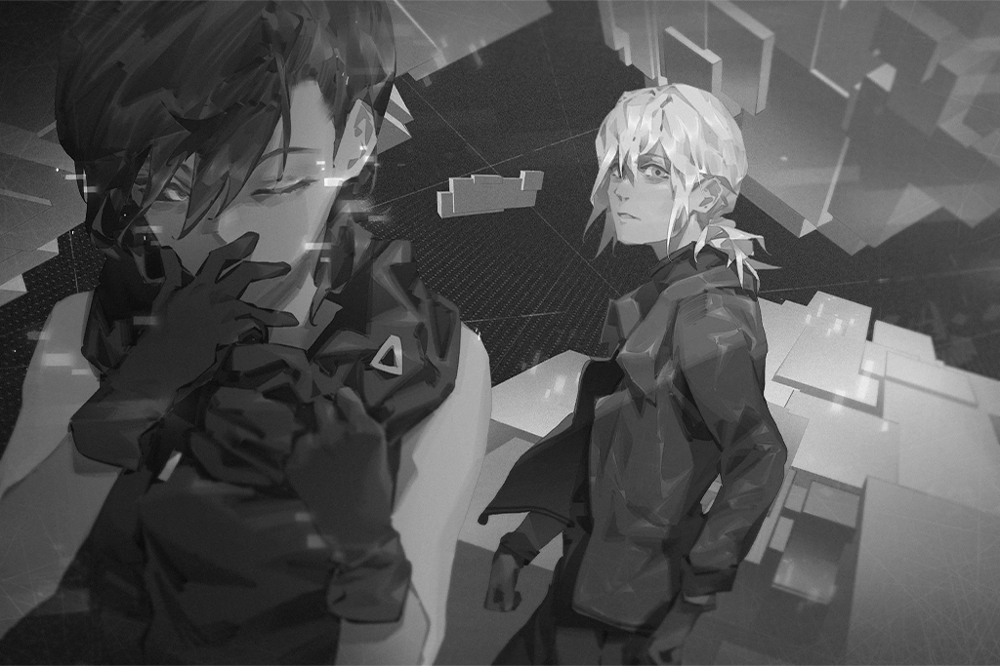

_\[Signal Lost\]_

[Last Log](#os-log-014) | [Back to Top](#list-of-logs) | [Next Log](#os-log-016)

### OS Log #016
___

[Last Log](#os-log-015) | [Back to Top](#list-of-logs) | [Next Log](#os-log-017)

#### Requirements
|   Char.   |Lv.|Lv. Locked?|
|-----------|:-:|:---------:|
|**Vanessa**|10 |    No     |

#### Unlocked Charts
|  Song  | Char. |Diff.|Lv.|
|--------|:-----:|:---:|:-:|
|**II-V**|Vanessa|Easy | 3 |
|**II-V**|Vanessa|Hard | 7 |
|**II-V**|Vanessa|Chaos|12 |

#### Audio\_H1001\_702\_12\_29\_4
**PAFF**  
Nora, did you find him...?

**[Nora]**  
_No... I've searched all over the city. He's nowhere to be found. I can't imagine he'd go to another Node.  
Mr. Jackson's vitals are normal, which means he's still alive. But... where is he..._

**ConneR**  
... What about here? Have you searched this location?

**[Nora]**  
_Here... what do you mean?_

**ConneR**  
Here. If the transmission coordinates Miss PAFF set up were to bring them back here, then perhaps he's located beneath our feet. Or... above our heads.

**[Nora]**  
_......!!  
Above? I didn't search there, but... If he's really there... he's in a lot of danger._

**NEKO#ΦωΦ**  
Isn't that full of Architects that Vanessa is controlling? If we connect there...

**PAFF**  
I'll go! If anything happens, I still have the virus...

**NEKO#ΦωΦ**  
Aroma\-chan!

**ConneR**  
Using the virus on those bastards would be quite a waste. I hope we can stick to the plan.  
We'll use the same formation; Miss Wildcat and I will provide cover. Miss PAFF, leave the virus here and we'll go up to look around.

**[Nora]**  
_... Okay, that's what we'll do._

_\[Object Crashes\]_

**ConneR**  
What was that?

**JOE**  
Not good! Outside! A whole bunch of Architects!

**NEKO#ΦωΦ**  
Eh? Ehhh? What're we gonna do...

**ConneR**  
... _\*yawn\*_... Perfect timing... Almost like they knew...?   
Successor! You and the others outside stop them from busting in here!

**JOE**  
You got it!

_\[→Signal Switches\]_

_\[Footsteps\]_

**Xenon**  
... We're not there yet? Feels like we've already walked for some time now.

**Cherry**  
Almost there, it's right ahead.

**Xenon**  
If I can let Nora know your location in the OS space, perhaps she's got a way to bring you back to reality...

**Cherry**  
......

**Xenon**  
We found Shannon's consciousness stuck in here before, she said that if we brought her body to the same location, there's a possibility that they could be reconnected. I know your body has already... but...

**Cherry**  
... Really?

**Xenon**  
Sherry... after all of this, I never had a chance to tell you, I...

**Cherry**  
......

**Xenon**  
Oh... I wanted to wait until you recovered in Kyuu Hou Kai to tell you this... Now, running into you here, I don't know where to begin...

**Cherry**  
... Just say it.

**Xenon**  
I regret... my decision to leave you, so much. It's been like this these past few years. I didn't do that because I hated you, I... I always regarded that decision as a punishment I gave myself. I couldn't stop all of this from happening, couldn't protect the people around me... I feel like I don't deserve to be happy.

**Cherry**  
......

**Xenon**  
But I... I didn't think how it would affect you. I didn't think how much suffering it would cause you. The people I care about, the one's still alive, they're the most important thing in my life. The time I spent with you was filled with happiness. Thank you.

**Cherry**  
... Yeah, me too.

**Xenon**  
We'll definitely think of a way to get you out of here. After all this is over, let's try to...

**[̷̕͠҉̶P̶̕A҉҉̴̨F̢͟͜F̴̀͟]͏̢**  
_X͟͝e͟n̛͜͜͞o̸͢ǹ͘҉͡...... Xenon...... can you hear me?_

**Xenon**  
...... Wait a second, do you hear that? It's PAFF's voice! I think we're there!  
PAFF! It's me! I hear you!

**[̷̕͠҉̶P̶̕A҉҉̴̨F̢͟͜F̴̀͟]͏̢**  
Xenon! Finally connected to you! There's a strong signal near you causing interference. I can't get there. You've got to get out of there now!

**Xenon**  
Hold on! I found Sherry! She's right in front of me!

**[̷̕͠҉̶P̶̕A҉҉̴̨F̢͟͜F̴̀͟]͏̢**  
Sherry...? What are you talking about? You're getting closer to the Library! It'll be too dangerous if you get close to Vanessa's core!

**Xenon**  
......!?

**[̷̕͠҉̶P̶̕A҉҉̴̨F̢͟͜F̴̀͟]͏̢**  
I don't know what you're seeing, but there's nothing here besides Architect consciousnesses. You've got to turn around, head toward my voice!

**Cherry**  
Simon... you hear that too?

**Xenon**  
......

**Cherry**  
Don't take the bait... It sounds like the voice I heard before. It will do whatever it takes; all there is in that direction, is an evil presence.

**Xenon**  
Oh...

**[̷̕͠҉̶P̶̕A҉҉̴̨F̢͟͜F̴̀͟]͏̢**  
Xenon! Neko and Neumann can't hold on for much longer! Your connection time is almost up! If you don't leave soon and you lose connection there, you won't be able to get back!

**Xenon**  
......

**Cherry**  
Come on, we've got to keep moving forward.

**Xenon**  
... Sherry...

**Cherry**  
Simon...?

**Xenon**  
... I... How did you know about the other's situation?

**Cherry**  
...Eh?

**Xenon**  
You said you've been here all along and didn't know what's going on outside... How'd you know we were at A.R.C. in Node 08?

**Cherry**  
......  
... Is now... really the time to talk about that?  
We've got to hurry up...

_\[Draws Gun\]_

**Cherry**  
......!!

**Xenon**  
...... Answer me.

**Cherry**  
Simon... you... you don't trust me?

**Xenon**  
... Ugh...

**[̷̕͠҉̶P̶̕A҉҉̴̨F̢͟͜F̴̀͟]͏̢**  
Xenon! Nora said the source of the interfering signal is right next to you! Whatever you see, you cannot continue forward!

**Xenon**  
......

**Cherry**  
Didn't you say... you w\-w\-wanted(̷̢͘̕q̕a̴̷̛̕z̵̡̢͜҉to find a way to get me out of here......?

**Xenon**  
... _\*sob\*_...

**Cherry**  
After w\-w\-wer҉̕͘͞)̷̸̡͘\~͏͜get out... After it's all over... W\-W\-W\-We... should tryf̶̧̨͜n̶̡͡҉p̡̧̀͢͟>̷̧͘͜t̸̡Ý̢......

**Xenon**  
If I can't let this go, I'll never move forward...

_\[Gunshot\]_

**Cherry**  
...... Simon......\`̸̢̨̕͏h̴̡̛̀́p̕͟{̵̸̴͞S\-S\-S\-Sorry...  
...... I love you......

_\[Signal Disappears\]_

**Xenon**  
...... _\*sob\* ... \*sob\*_...  
URRGGHHAAAAAAAHHH!!!!!

_\[Signal Lost\]_

[Last Log](#os-log-015) | [Back to Top](#list-of-logs) | [Next Log](#os-log-017)

### OS Log #017
___

[Last Log](#os-log-016) | [Back to Top](#list-of-logs) | [Next Log](#os-log-018)

#### Requirements
|   Char.   |Lv.|Lv. Locked?|
|-----------|:-:|:---------:|
|**Vanessa**|11 |    No     |

#### Audio\_H1001\_702\_12\_29\_5
**[Nora]**  
_The interference is gone! ROBO, disconnect now!_

**[ROBO_Head]**  
_Understood._

**Xenon**  
URRGGHHAAAAAAAHHH!!!!!

_\[Object Crashes\]_

**NEKO#ΦωΦ**  
Xenon!

**[Nora]**  
_... Just in time._

**ConneR**  
Hey... you alright?

**Xenon**  
Huff... huff... I... I'm fine... get off me...

**[Nora]**  
_What happened in there?_

**Xenon**  
Sherry... I saw Sherry...

**NEKO#ΦωΦ**  
Sis Cherry!? She's still in there!?

**[Nora]**  
_No. Although I can't get close, from here I cannot detect any human consciousnesses. Up there... is only Vanessa and those Architects._

**Xenon**  
Then what was that thing that I saw...

**[Nora]**  
_No matter what you saw, it wasn't Miss Pauline. I don't know what she did to convince you._

**Xenon**  
... True, she's never said "I love you" to me...

**ConneR**  
Even though she wasn't real, must not have been easy. Who would've thought she'd do something like that to trick you? If you had gone any further, who knows what would have happened...?

**???**  
...... He'd be dead.

_\[Draws Gun\]_

**ConneR**  
Who's there!?  
Ivy......!

**Ivy**  
Nice to meet you.

**ConneR**  
Hey successor, what happened?

**JOE**  
Don't know. But once this chick showed up, all the Architects stopped attacking. She told me to bring her in. I thought she's probably not an enemy...

**Ivy**  
Put the gun down. I've been watching you for some time, to make sure you are trustworthy. It appears that you truly wish to stop Vanessa.

**Xenon**  
......

**Ivy**  
Simon Jackson... Finally, we meet in person.

**Xenon**  
...... Yeah.

**Ivy**  
You said you saw Sherry Pauline's consciousness in there? If you had gone one step further, you'd have become just like her.

**Xenon**  
... What do you mean?

**Ivy**  
Vanessa's evil intent... inside what you call the OS space, it has already become some kind of information black hole. Up there, any consciousnesses in the OS space will be drawn in and assimilated.

**Ivy**  
The reason you can get so close without being affected is that you are still living. Those that have already died——those "minds" which have no place to return to... that's a different story.

**Xenon**  
So what I killed... was really...

**Ivy**  
... All I can say is that was an image of Sherry Pauline's memory, projected by Vanessa. Whether or not it was really her is not important. She is already dead.

**Xenon**  
......

**Ivy**  
Is the virus core complete? May I take a look?

_\[Projection\]_

**[Nora]**  
_... This is it._

**Ivy**  
... You won't let me see it in the OS space...? Whatever, I can understand why you wouldn't completely trust me.

**[Nora]**  
_No, after everything that has happened, I don't think we should connect without careful consideration. There are too many unpredictable factors in there._

**Ivy**  
Relax. My connection system was damaged during battle. I was unable to repair it during such a short time. Right now, I'm unable to stay in the space for too long.

_\[Footsteps\]_

**Ivy**  
... From the looks of this model, this will not kill her.

**Xenon**  
... What?

**Ivy**  
The first virus you created was unable to completely destroy me. The power output this time around is indeed slightly higher, but if you wish to annihilate her, it is still not even close.

**PAFF**  
Vanessa... why does she hate humanity so much? Why is she so insistent on attacking us?

**Ivy**  
... She told me that she would unconsciously perform searches, causing her to see all the horrendous things that people have done. Perhaps that's one reason. As the core of the Library, she was forced to take in this sort of information day in and day out.

**Ivy**  
But... the current condition is such that what we are resisting is not simply Vanessa the individual. Rather, it's an evil intent imbedded in countless consciousnesses that were copied after she went crazy.

**PAFF**  
You mean that these actions... already have nothing to do with her own consciousness?

**Ivy**  
You could say that. Or, she's already unable to control this evil desire... However, whenever those Architects see me, they stop attacking. I'm not sure if...

**Ivy**  
All I can be sure of is that the Vanessa I knew wasn't like this... Things got out of hand because of my hesitation. If we're going to stop all of this, we must completely annihilate her. The current state of the virus core will be unable to do that.

**Xenon**  
Damn... We don't have the time. The chips have already been used.

**Ivy**  
Don't worry. I said "the current state" will not do.

**[Nora]**  
_... What are you thinking?_

**Ivy**  
May I use the equipment?

**[Nora]**  
_...... Please._

_\[Data Input\]_

**Xenon**  
......!

**Ivy**  
Simon Jackson, considering the complete lack of understanding of our connection format, to have reached this level is already quite outstanding for a human. But...

**Xenon**  
Never thought the power output could get that high...

**Ivy**  
This is not human technology.  
I'll still need some time for maximum optimization. Please give me some time.

_\[Signal Lost\]_

[Last Log](#os-log-016) | [Back to Top](#list-of-logs) | [Next Log](#os-log-018)

### OS Log #018
___

[Last Log](#os-log-017) | [Back to Top](#list-of-logs) | [Next Log](#os-log-019)

#### Requirements
|   Char.   |Lv.|Lv. Locked?|
|-----------|:-:|:---------:|
|**Vanessa**|12 |    No     |

#### Audio\_H1001\_702\_12\_29\_6
**Noah**  
... Ivy, I didn't think I'd get to see you again.

**Ivy**  
Are you... Noah? You look exhausted.

**Noah**  
You threw me in the basement for a whole two weeks... After Vanessa started attacking A.R.C.'s facilities I was trapped down there. Nonetheless... I must thank you. I didn't think you'd heal my wounds.

**PAFF**  
You two know each other...?

**Ivy**  
Yes. The reason Vanessa's crazed consciousness can be copied into these out of control Architects is my fault. I found Noah to help him transfer Vanessa's core into another unit. I knew that this was his area of expertise. You are living proof of that, are you not?

**Xenon**  
So you're saying this bastard's partially responsible for all this?

**Noah**  
Ugh... I can't deny that. It's true that this is a result of one failure...

**PAFF**  
......

**Ivy**  
... In any case, we must be quick. I'm constantly detecting a connection between the Library and the entire world. I don't know what Vanessa's next move is... We can't do anything before the virus core is complete....

**PAFF**  
The entire world...

**Ivy**  
Yes. You probably assumed that since she is located in Node 08, this the center of the outbreak. However, loss of control over machines and attacks by Architects has occurred in all Nodes where there are users of the virtual internet.

_\[Alarm\]_

**NEKO#ΦωΦ**  
......!?  
WAH! It's so loud! What's that noise outside?

**Xenon**  
... You probably haven't heard it before. That's the alarm to signal that the city's weather system is being adjusted to extreme weather conditions, but I haven't heard that in 20 years...

_\[→Signal Switches\]_

_\[Alarm\]_

**[City Announcement System]**  
_A\-A\-A\-All h\-h\-H\-Humans please be͜͠͡҉̛ ̨á͟͝w͘a̴̶̧͝r͢e, i\-i\-i\-i\-n 1 hour, the weather in this N͘҉̴̧͠o̴͏d̀͡ȩ̨͠҉ ̵̶̡͠即̵̛͢͟  will t\-t\-t\-temporarily be adjusted to extreme cond̴i̷͝t͏̵͝i҉̶̡̀́o̧͟͟n̸͜s. Please head d\-d\-d\-d\-die\-directly indoors. You will be not͏̛̕i͏̶̢f̨̀i҉̵̧̀é̛͟͢d̶ when the situation has c\-c\-com̨̀͘é̴̶͝ ҉̶̸̡t͞͞o an e\-e\-e\-Ender\-r\-r\-r. In order to ensure t\-t\-that citizens do not encounter abnorma̷͏̷l̸̢̧̨ ̵͠ẃ̴̴̵̀e͠͏͡ą̵̢̀̕ther conditions, please h\-h\-h\-head indoors to avoid the d\-d\-disaster and wait un  
t̸̨̀i̷̧ļ͠ ҉̷̢̀͞t̷h̨̛͟͜͞ę̵̸͠͞ alarm has e\-e\-e\-ended. Thank you for your c\-c\-cooperation._

**Citizen A**  
My god, what's going on now...?

**Citizen B**  
What a creepy broadcast... Even the weather system has gone out of control?

**Citizen C**  
Did I just hear "Ender"? They didn't mean that Ender, did they?

_\[→Signal Switches\]_

**Ivy**  
Damn! The weather system, I didn't think of that...

**ConneR**  
... Indeed, compared to mere physical attacks, this is the fastest and most certain way to guarantee that every last human is killed...

**[Nora]**  
_She plans on spreading the Ender virus to every single Node...? But how...  
......!! So that's why she attacked the Ender vaccine at Kyuu Hou Kai. She's been planning this all along..._

**Ivy**  
It activates in 1 hour... I'm not sure if we have enough time...

**Xenon**  
The core's not yet finished?

**Ivy**  
Almost!

_\[→Signal Switches\]_

**[City Announcement System]**  
_A\-A\-A\-All h\-h\-H\-Humans please be͜͠͡҉̛ ̨á͟͝w͘a̴̶̧͝r͢e, i\-i\-i\-i\-n 1 hour, the weather in this N͘҉̴̧͠o̴͏d̀͡ȩ̨͠҉ ̵̶̡͠即̵̛͢͟  will t\-t\-t\-temporarily be adjusted to extreme cond̴i̷͝t͏̵͝i҉̶̡̀́o̧͟͟n̸͜s. Please head d\-d\-d\-d\-die\-directly indoors. You will be not͏̛̕i͏̶̢f̨̀i҉̵̧̀é̛͟͢d̶ when the situation has c\-c\-com̨̀͘é̴̶͝ ҉̶̸̡t͞͞o an e\-e\-e\-Ender\-r\-r\-r. In order to ensure t\-t\-that citizens do not encounter abnorma̷͏̷l̸̢̧̨ ̵͠ẃ̴̴̵̀e͠͏͡ą̵̢̀̕ther conditions, please h\-h\-h\-head indoors to avoid the d\-d\-disaster and wait un  
t̸̨̀i̷̧ļ͠ ҉̷̢̀͞t̷h̨̛͟͜͞ę̵̸͠͞ alarm has e\-e\-e\-ended. Thank you for your c\-c\-cooperation._

**Ichiro**  
What's this? The system crashed or something?

**Daigo**  
Does this have something to do with the Chief...? I don't have a good feeling about this...

_\[→Signal Switches\]_

**Citizen A**  
We'd better get out of here this time!

**Citizen B**  
Where are we going to go!? Where can we go besides the Nodes?

**Citizen C**  
Node 13! Have you heard? Heard that was the only place that wasn't attacked by out of control machines. Since they don't have the virtual internet and no longer use the Administration Bureau buildings, they also must not use the weather system!

**Citizen A**  
But I heard they already took in a lot of refugees from different Nodes. I don't think they can take in anymore. You think we can get in?

**Citizen B**  
Well, we've got to think of a way! Taking the shuttle is out of the question... I'm sure that's already lost control... My god, what're we gonna do!!

_\[→Signal Switches\]_

**[Nora]**  
_Outside is complete chaos... Ivy, it's still not ready?_

**Ivy**  
I'm going as fast as I can!

_\[Signal Lost\]_

[Last Log](#os-log-017) | [Back to Top](#list-of-logs) | [Next Log](#os-log-019)

### OS Log #019
___

[Last Log](#os-log-018) | [Back to Top](#list-of-logs) | [Next Log](#os-log-020)

#### Requirements
|   Char.   |Lv.|Lv. Locked?|
|-----------|:-:|:---------:|
|**Vanessa**|12 |    Yes    |

#### Cam\_???\_702\_12\_29
[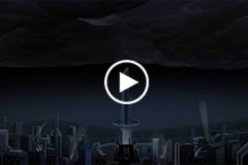](https://youtu.be/wFGIdbWGBFI)  
_[Click the image to watch the movie]_

[Last Log](#os-log-018) | [Back to Top](#list-of-logs) | [Next Log](#os-log-020)

### OS Log #020
___

[Last Log](#os-log-019) | [Back to Top](#list-of-logs) | [Next Log](#os-log-021)

#### Requirements
|   Char.   |Lv.|Lv. Locked?|
|-----------|:-:|:---------:|
|**Vanessa**|13 |    No     |

#### Unlocked Charts
|               Song               | Char. |Diff.|Lv.|
|----------------------------------|:-----:|:---:|:-:|
|**Chaos and Abyss -3rd Movement-**|Vanessa|Easy | 6 |
|**Chaos and Abyss -3rd Movement-**|Vanessa|Hard |10 |
|**Chaos and Abyss -3rd Movement-**|Vanessa|Chaos|15 |

#### Audio\_13St52\_702\_12\_29
**Citizen A**  
Let us in! Didn't you hear the announcment? This is the only place that's safe from the virus!

**Citizen B**  
Why do you have to confiscate my device? How am I supposed to contact my family?

**Volunteer A**  
"Electrical appliances that possess the function to connect to the internet system are Grade 1 restricted items in this Node." What a joke... Weren't you forced to flee here specifically because of technology?

**Volunteer B**  
You and your "convenient" technology, always looking down on Node 13... Now that s\*\*\* hit the fan, you're all crowding in here. You should be thanking us that we're not kicking you to the curb!

**Citizen A**  
What'd you say?

**Volunteer B**  
You heard me! If this place had a weather system, would you still come here? We ain't got no more room!

**Citizen B**  
Get outta my way! I'm getting in!

_\[Punches\]_

**Volunteer B**  
Oof! ... So now you're getting violent!?

**Volunteer A**  
You alright?

**Volunteer B**  
Ugh! Rotten tech addicts!

_\[Punches\]_

_\[Crowd in chaos\]_

**Resident**  
WAAHH!! Fight!!!

**Sasha**  
What's going on?

**Volunteer C**  
Sasha! Those people from other Nodes are fighting with the volunteers 'cuz they can't get in! The shelters got filled up a long time ago!

**Sasha**  
Let me take a look.

_\[Hurried Footsteps\]_

**Sasha**  
Hey, quit fighting! Is now really the time to fight?

**Volunteer B**  
Don't try to stop me! We already made an exception for all those people. If we don't draw the line somewhere, we're gonna get in big trouble! I hate these foreigners!

**Sasha**  
Aigh... I'm a foreigner...

**Volunteer B**  
Uh, Sasha, you know that's not what I meant...

**Sasha**  
Calm down yet?

**Volunteer A**  
Sasha, you're doing medical work at the shelter, you know we can't take in anymore people.

**Citizen A**  
... _\*sob\*_... Please, please let us in, we'll give you our devices, we don't care. I don't want to die...

**Citizen B**  
I'm so sorry, I'm just so anxious! You're a foreigner, you know how it feels to be rejected!

**Sasha**  
Oh...

**Volunteer A**  
Sasha, I know this is hard for you, but we really can't...

_\[Kneels\]_

**Sasha**  
What... what are you doing?

**Citizen A**  
Please, I really don't want to die...

**Citizen B**  
Help us...

**Sasha**  
... I've still got some rooms in my house. If we can...

**Volunteer A**  
No.

**Sasha**  
Why!?

**Volunteer A**  
Look behind them... There's a whole line... Even if we take in two people, what are we supposed to do with the rest of them? We don't have an infinite number of rooms...

**Sasha**  
......

**Citizen B**  
Damn! She just promised, why stop her!?

**Citizen A**  
You're all colder than the Architects! Bastards!

_\[Punches\]_

**Volunteer B**  
Oof! Again!? I knew we shouldn't have let you in!

_\[Crowd in chaos\]_

**Volunteer C**  
Sasha, you'd better go. They'll take care of it... There's already nothing we can do.

**Sasha**  
Yeah...

_\[Footsteps\]_

**Sasha**  
...... R, is this the nightmare you spoke of...?

_\[Signal Lost\]_

[Last Log](#os-log-019) | [Back to Top](#list-of-logs) | [Next Log](#os-log-021)

### OS Log #021
___

[Last Log](#os-log-020) | [Back to Top](#list-of-logs) | [Next Log](#os-log-022)

#### Requirements
|   Char.   |Lv.|Lv. Locked?|
|-----------|:-:|:---------:|
|**Vanessa**|13 |    No     |

#### Audio\_H1001\_702\_12\_29\_7
**ConneR**  
Is this nightmare becoming a reality? ...Quite shocking. Miss Nora, how's it looking?

**[Nora]**  
_Very dangerous, Mr. Neumann. Reliable reports reveal that the tower where the main weather system is located has already been overtaken. As long as they're prepared, they can spread the virus to all of Node 08 at any time._

**PAFF**  
We can't let that happen!

**Xenon**  
She's right. We need more time... Ivy, you've blocked Vanessa's connection to the outside before, haven't you?

**Ivy**  
To be precise, a hidden port was established in the core server. With that, I can cut off Vanessa's connection to the outside world without making the whole system collapse... But that requires assistance from my inside help.

**ConneR**  
Oh? Inside help...

**Ivy**  
The port was already removed during an error sweep. And I'm unable to get into contact with my insider... Given the current situation, unless we head to the upper level and reestablish a port, we won't be able to use the this method.

**[Nora]**  
_The upper level is already completely under Vanessa's control. The defense system, drones, and Architects are all our enemies._

**NEKO#ΦωΦ**  
... Yes! The Architects won't attack Ivy, right? What about letting her do the job?

**Ivy**  
No. There can't be the slightest mistake enhancing this virus. Even if I leave for a short time, something may happen that you are unable to deal with. Simon Jackson, you must be well aware of this.

**Xenon**  
... Can't say she's wrong.

**Ivy**  
But that doesn't mean we're out of options. Even though the port I set up was removed, Vanessa didn't strike immediately. Initially, I thought that was strange... but now I realize why.

**Ivy**  
... After I put you in the medic cabin, what did you do?  
Noah Black.

**PAFF**  
... Noah!?

_\[Footsteps\]_

**Noah**  
... As soon as I woke I knew, it was I who let her consciousness escape its cage... into that manufactured Architect. I knew immediately how serious the situation was and thought of anything I could do to pardon me of my sins... At the very least I had to disrupt the real Vanessa.

**Noah**  
I analyzed Vanessa's memory as much as possible. Perhaps due to being affected by some emotional surges, it exists in temporary loopholes. Although I haven't completely figured out the code... all you need is to send some corresponding code and use those important memories to shock her, rendering her operations ineffective... But it's only temporary.

**Ivy**  
...... Important memories......

**[Nora]**  
_Basically, if you hadn't kept her at bay, we wouldn't have the time to stop all of this...   
However, Kyuu Hou Kai was attacked by drones because my virus vaccine was discovered. Your actions also caused this._

**Xenon**  
......

**Noah**  
... I can't say that you're wrong.  
When I was resisting her, my head was filled with nothing but fear... When Vanessa wrangled back her connnection, I collapsed. After that, my mind has been hazy... It wasn't until I ran into you that...

**PAFF**  
Noah...

**ConneR**  
Hehe, like the loser of a cockfight. In any case, you poured your sweat and blood into that technology. It has its uses.

**Noah**  
What... do you mean?

**ConneR**  
Mr. Black, if you go to the upper level and disrupt her signal from a location closer to the core, could that drag out the time it takes for her plan to take effect?

**Ivy**  
......!

**Noah**  
... Probably... No. I mean, that wouldn't be a problem. Though I haven't tried it before, if I could target the server directly...

**ConneR**  
Excellent, let me see... Successor, let's escort Mr. Black to the upper level, what do you say?

**JOE**  
M\-Me? R, I'm telling you... you chose the right guy!

**Xenon**  
... You sure you want to take him?

**JOE**  
Hey! Simon, what's that supposed to mean!?

**ConneR**  
Mr. Jackson, I realize that you want to go alone, but you must see to it that the virus gets completed... Plus, I can't let these pretty ladies encounter any danger.

**PAFF**  
Um, can I go up too? You may need to open some doors up there...

**[Nora]**  
... No, it's much too dangerous. Last time we let you go downstairs was because the signal in the lower levels was too weak... If you've got enough energy, you can stay connected and follow them in the OS space. If necessary, you can use your ability to help them.

**Xenon**  
That's right. If you can control the upper level equipment from a distance, perhaps that can avert some danger. However, you are more important than anyone else here. If anything happens, you must disconnect, understand?

**NEKO#ΦωΦ**  
Xenon, relax. NEKO's here. If anything happens, I'll snap her out of it!

**Xenon**  
... Are you saying you'll be the alarm clock?

**NEKO#ΦωΦ**  
Huff puff\~ I'm warning you, don't underestimate NEKO's voice! Plus, Aroma\-chan will definitely hear NEKO! Am I right, Aroma\-chan?

**PAFF**  
Haha... Of course.

**ConneR**  
Hehe, then we'll leave that up to you, Miss Wildcat.  
Let's set out... Miss PAFF, stay in contact.

**Noah**  
......

_\[Signal Lost\]_

[Last Log](#os-log-020) | [Back to Top](#list-of-logs) | [Next Log](#os-log-022)

### OS Log #022
___

[Last Log](#os-log-021) | [Back to Top](#list-of-logs) | [Next Log](#os-log-023)

#### Requirements
|   Char.   |Lv.|Lv. Locked?|
|-----------|:-:|:---------:|
|**Vanessa**|14 |    No     |

#### Audio\_A1\_702\_12\_29
**JOE**  
Alright, last one!

_\[Consecutive Gunshots\]_

**[Drone]**  
_Warning...... In\-in\-in\-in\-intruders not permitted..._

**ConneR**  
Successor, you're a pretty good shot.

**JOE**  
Hehe, you thought rescue drones could shake me? Daddy controls the land and skies, baby!

**ConneR**  
Just a bit inaccurate, that's all. Based on Mr. Jackson's directions, it's this computer room.

**Noah**  
Huff... Aroma... you... can you open this door?

**[PAFF]**  
_Okay, no problem... Got it._

_\[Door Opens\]_

**ConneR**  
No matter how many times I see it, I can't get over how incredible this power is... Mr. Black, get ready for your performance.

**Noah**  
... Okay. Although I don't know how much I can do... In order to prevent anything from happening, I'll first put a marker on a weaker waveband. All I need to do is set up the parameters, then I can start with the interference.

_\[Footsteps\]_

**ConneR**  
As expected... the electricity is off. Miss PAFF, please.

**[PAFF]**  
_'Kay, let me find it..._

_\[Electricity Activated\]_

**JOE**  
Wah! Daaaamn, honey! It's on, baby!

**[PAFF]**  
_I've got a crystal clear image... Noah, the controller panel should be that machine on your left hand side._

**Noah**  
Okay, I'm starting.

_\[Typing on keyboard\]_

**Noah**  
Strange...

**ConneR**  
What's the matter?

**Noah**  
The memory's been deleted. If it's just a result of backtracking caused from a restart, it'll just take some time to remark it. But if it's not...

**ConneR**  
Oh... If that's the case, assuming we cause some interference from the same waveband, it'll be hard to predict what that will trigger.

**JOE**  
Trigger? What? Who can explain this to me?

**ConneR**  
Successor, be a good guard, will you?  
As it stands, cutting the connection is our first mission. Though we've been stopped from entering, we still have Miss PAFF's ability.

**[PAFF]**  
_Got it!_

**Noah**  
... We'll just have to see.

_\[»»»Fast Forward»»»\]_

**Noah**  
... Huff... Found it... here!

_\[Presses Button\]_

**JOE**  
D\-Did it work?

_\[Alarm\]_

**JOE**  
Wah! What's that sound?

**ConneR**  
... A trap! Miss PAFF!

**[PAFF]**  
_The door won't open! Things in the space suddenly turned..._

_\[Window Breaks\]_

**Noah**  
!? Architects?

**[?̷̡͘͠?̨̢͟?̶̡͘?̶̢?̶͝?́͡͠?̸̛͢]**  
_5̵̡}̸̢͘͞a̛͟͢͏̵Q̨̨z̴͘͞\$̵̵̶͢'̀͏̢̛͏|̀͏̸͠͡(͢͟͠\-̸̧͟Ǹ̴̛͡͠……_

**JOE**  
One after another? They having a party?

**[?̷̡͘͠?̨̢͟?̶̡͘?̶̢?̶͝?́͡͠?̸̛͢]**  
_J̴̛I҉̵̷͘͝K̶͝I͘H̢҉̕͘E̶̴̛Ĺ̶̶̢́L̛͞;́;̵̨̕͜'̷̸̨̕Ǫ̷D͘͠͏͞Q̴͏͢Q̨̛́͠……7̶̸̨͘̕T̷̷̸̸͠Y̴̢̢͡͝H̴̕͏！_

**ConneR**  
Things are getting interesting...

_\[Signal Lost\]_

[Last Log](#os-log-021) | [Back to Top](#list-of-logs) | [Next Log](#os-log-023)

### OS Log #023
___

[Last Log](#os-log-022) | [Back to Top](#list-of-logs) | [Next Log](#os-log-024)

#### Requirements
|   Char.   |Lv.|Lv. Locked?|
|-----------|:-:|:---------:|
|**Vanessa**|14 |    No     |

#### Cam\_A1012\_702\_12\_29
**[?̷̡͘͠?̨̢͟?̶̡͘?̶̢?̶͝?́͡͠?̸̛͢]**  
_h̴́͢͡͝9͘͏̡0̡͘͞͞7̶̸̨͘̕T̷̷̸̸͠Y̴̢̢͡͝H̴̕͏8̶̢͜͟0̴̛͠=͠͝҉̛h̶̢̀̕͠……！_

_\[Consecutive Gunshots\]_

**JOE**  
Damn... too many... R! I'm gonna use that device, get ready!

**[?̷̡͘͠?̨̢͟?̶̡͘?̶̢?̶͝?́͡͠?̸̛͢]**  
_J̴̛I҉̵̷͘͝K̶͝I͘H̢҉̕͘E̶̴̛Ĺ̶̶̢́L̛͞;́;̵̨̕͜'̷̸̨̕Ǫ̷D͘͠͏͞Q̴͏͢Q̨̛́͠！_

_\[Punches\]_

_\[Crashes\]_

**JOE**  
Wahah! Little J! My baby, little J!!

**ConneR**  
Very agile defense mechanisms... Are they learning? These bastards... Watch out, Mr. Black!

_\[Gunshot\]_

**Noah**  
Wooh! Almost...

**ConneR**  
... Get behind us. Otherwise we can't guarantee your safety.

**Noah**  
Can't... Wait a moment! I'm almost finished setting it up...

**JOE**  
Hey! Cut it out, you'll be beaten to death before then!

**ConneR**  
Way things are looking, just might happen...

**JOE**  
You kiddin' me!? Gonna die here with you? I promised my brothers they'd go home safely. Haven't followed through on what I promised Pops... Plus, I haven't even found a girlfriend!

**ConneR**  
Tsk, even though you've told me your final wishes, I'm afraid that due to my sexual orientation I'm unable to fulfill them. Aigh...

_\[Static\]_

**[PAFF]**  
_Hey, hey... you hear me?_

**JOE**  
Yes! PAFF! Never been so happy to hear your voice! You get the door open?

**[PAFF]**  
_The signal got very chaotic all of a sudden and the circuit was hidden... but I can do it! Just need some time!_

**ConneR**  
I see... We'll have to stop temporarily. Mr. Black, don't let me tell you again, get over here!

_\[Typing on keyboard\]_

**Noah**  
Almost found it... wait a second!

**[?̷̡͘͠?̨̢͟?̶̡͘?̶̢?̶͝?́͡͠?̸̛͢]**  
_J̴̛I҉̵̷͘͝K̶͝I͘H̢҉̕͘E̶̴̛Ĺ̶̶̢́L̛͞;́;̵̨̕͜'̷̸̨̕Ǫ̷D͘͠͏͞Q̴͏͢Q̨̛́͠！_

**ConneR**  
Be careful!

_\[Consecutive Gunshots\]_

**JOE**  
Bastards... just keep coming. We'll never beat 'em all!

**ConneR**  
... Is the target Mr. Black?

**Noah**  
No... Get the hell out of here! You bastards... SCRAM!!

**[?̷̡͘͠?̨̢͟?̶̡͘?̶̢?̶͝?́͡͠?̸̛͢]**  
_……0̵̛̛8̸͘͢͟9̶͘͝͝҉g̵͘͢Y̡……f̀͠҉7̸̀͏̴9̷́̕͢Ư̷̧̨͝\_͏͟B̵͢͢H̡҉(̨)̡̨͞͠9̨̧̧͜͜j͘҉̢̛̀……_

_\[Electricity cuts out\]_

**Noah**  
!?... Damn it! The control panel...

**ConneR**  
Can't hold out any longer... Successor, take Mr. Black away!

**JOE**  
Can't do it! Architects are surrounding him!

_\[Static\]_

**[PAFF]**  
_Guys! I can see the circuit for the door...  
Ha... NOW!_

_\[Door Opens\]_

**JOE**  
YES! Let's go, now!

**Noah**  
_\*cough\*... \*cough\*_... No, you two go...  
I already found the pattern...

**[PAFF]**  
_Noah!? What pattern...?_

**Noah**  
Aroma! I've already marked all the wavebands, but the electricity to the control panel was cut off... Please, turn it on!

**[PAFF]**  
_B\-But, I can't control two circuits at once..._

**Noah**  
Forget about the door! Hurry! We only have one chance!

**[PAFF]**  
_I... I can't!_

**Noah**  
Aroma... Trust me! Turn it on and you can open the door again!

**[PAFF]**  
_I... \*sob\*..._

_\[Signal Lost\]_

[Last Log](#os-log-022) | [Back to Top](#list-of-logs) | [Next Log](#os-log-024)

### OS Log #024
___

[Last Log](#os-log-023) | [Back to Top](#list-of-logs) | [Next Log](#os-log-025)

#### Requirements
|   Char.   |Lv.|Lv. Locked?|
|-----------|:-:|:---------:|
|**Vanessa**|15 |    No     |

#### Audio\_A1012\_702\_12\_29
_\[Consecutive Gunshots\]_

**JOE**  
R! Get outta there!

_\[Door Closes\]_

**JOE**  
Huff... Finally, safe... Why's it only you!?  
That dude... Noah, what's up with him?

**ConneR**  
......  
I hope... it's not as I imagine it to be...

_\[→Signal Switches\]_

**[?̷̡͘͠?̨̢͟?̶̡͘?̶̢?̶͝?́͡͠?̸̛͢]**  
_......ˊ̨̨͘!̡͟͡%̶&̷̧̨͟͝......@̷̡̀͢^̷\*̷̸̢̛͝&̧̨̛͘^̧́͘͠͏\*̸......_

**Noah**  
I won't... let you stop me... Get away!

_\[Heavy Blow\]_

**Noah**  
Urgh! Argh!!

**[PAFF]**  
_Noah！_

**Noah**  
I'm fine... You ready?

**[PAFF]**  
_... I see the circuit... Noah, I'm gonna open the door immediately... You gotta get out of there fast._

**Noah**  
... Okay.  
Ready... One, two...... Three!

**[PAFF]**  
_Got it!_

_\[Control panel activated\]_

_\[Transmitting\]_

**Noah**  
Ha, haha, hahaha! YES! This time... I've finally succeeded! Haha... _\*cough\*... \*cough\*_...

**[PAFF]**  
_Noah? What are you doing?_

**Noah**  
I did it! I made the code reappear, gave her a nasty hit... Even though I couldn't cut the connection... it'll definitely cause enough of a delay for all of you to fight back!

**[PAFF]**  
_Great! Now get out of there..._

**Noah**  
Don't open the door! Aroma!

**[PAFF]**  
_Eh...?_

**Noah**  
Once you open the door, these Architects... they'll all get out... I can't let them hurt you...

**[PAFF]**  
_......!_

**Noah**  
Plus... as soon as the control panel is destroyed... the interference will shut off immediately... You can see, right? They want to break this thing at all costs...

**[PAFF]**  
_Noah! Behind you!_

**[?̷̡͘͠?̨̢͟?̶̡͘?̶̢?̶͝?́͡͠?̸̛͢]**  
_J̴̛I҉̵̷͘͝K̶͝I͘H̢҉̕͘E̶̴̛Ĺ̶̶̢́L̛͞;́;̵̨̕͜'̷̸̨̕Ǫ̷D͘͠͏͞Q̴͏͢Q̨̛́͠！_

_\[Heavy Blow\]_

**Noah**  
URGH!!

_\[Kneels down\]_

**Noah**  
...? Is this... the device JOE mentioned...

_\[Presses Button\]_

**[PAFF]**  
_The Architects... stopped moving!_

_\[Short Circuits\]_

**Noah**  
Can't hold on for too long... No, this should be enough.  
...... Aroma, listen to me...

**Noah**  
During that skirmish, the walls were broken in and a high voltage wire burst out... All you need to do is activate all the equipment at the same time and the wire will act like a lighting rod... The excess electricity will be spread across the whole room in an instant...

**[PAFF]**  
_What... what do you mean?_

**Noah**  
These Architects are super\-efficient conductors... Only by doing that... can you destroy them, preserve this control hub, and continue to disrupt Vanessa...

**[PAFF]**  
_I can't Noah! You'll...!_

**Noah**  
I'm already injured... Even if I get out it wouldn't matter... Be much better if I could hold 'em off for just a bit longer...

**[PAFF]**  
_Don't say that... No! Get out, now. I can use my ability to activate the equipment..._

**Noah**  
Aroma... I've owed you a sincere apology for so long... I've done so many unforgiveble things... Felt about you in ways I shouldn't have... Destroyed the life of that girl in 03. A beast like me doesn't have the right to live...

**Noah**  
That man who hoped to use technology to benefit the people, he, he died a long time ago... After seeing you again I knew, this is the way it has to be. You see...

**[PAFF]**  
_... \*sob\*..._

**Noah**  
I don't expect you to forgive me... haha... At least, in the end, I succeeded! Dean... Helena... my theory... my research... I was right all along...

_\[Footsteps\]_

**[PAFF]**  
_Noah! There must be a way... I''ll open the door!_

**Noah**  
It's almost time... You must... live...

**[PAFF]**  
_No..._

_\[Device Activates\]_

**[PAFF]**  
_No, NO!!_

_\[Electric Shock\]_

**Noah**  
URGHHH!!!!

**[?̷̡͘͠?̨̢͟?̶̡͘?̶̢?̶͝?́͡͠?̸̛͢]**  
_J̴̛I҉̵̷͘͝K̶͝I͘H̢҉̕͘E̶̴̛Ĺ̶̶̢́L̛͞;́;̵̨̕͜'̷̸̨̕Ǫ̷D͘͠͏͞Q̴͏͢Q̨̛́͠……_

_\[Falls Over\]_

**Noah**  
Aroma... Sor... Sorry...

**[PAFF]**  
_WARGH...... ORRGHHHH!!_

_\[Signal Lost\]_

[Last Log](#os-log-023) | [Back to Top](#list-of-logs) | [Next Log](#os-log-025)

### OS Log #025
___

[Last Log](#os-log-024) | [Back to Top](#list-of-logs) | [Next Log](#os-log-026)

#### Requirements
|   Char.   |Lv.|Lv. Locked?|
|-----------|:-:|:---------:|
|**Vanessa**|15 |    No     |

#### Audio\_H1001\_702\_12\_29\_8
**PAFF**  
_\*sob\*_...... WAAAHHHH!!

**NEKO#ΦωΦ**  
A\-Aroma\-chan! What's the matter!?

**PAFF**  
... Noah\-Noah, he...

**Nora**  
......

_\[Static\]_

**[ConneR]**  
_It's me. You hear me? We're heading down._

**NEKO#ΦωΦ**  
Sensei! Uncle JOE! What happened!

**[JOE]**  
_It... \*sigh\*... I can't say._

**[ConneR]**  
_We were tricked. A ton of Architects surrounded us. Unfortunately, Mr. Black... is unable to return._

**NEKO#ΦωΦ**  
... Another... dead...

**PAFF**  
_\*sob\*... \*sob\*..._

**[Nora]**  
_Miss PAFF, I am really sorry about what happened... The gang members have reported that the Architects have stopped attacking temporarily. Mr. Black's interference was effective._

**PAFF**  
Yeah, he mentioned that... but... _\*sob\*_...

_\[Footsteps\]_

**Ivy**  
... Sorry. I understand that at this time, humans will feel sorrow, but I must interrupt you.  
The virus enhancement is complete.

**Xenon**  
We're clear on the situation upstairs... I'm very sorry PAFF, but you've got to pay attention to what I'm about to tell you. Whether or not we succeed depends on this next move.

**PAFF**  
... Me... Me?

**NEKO#ΦωΦ**  
Wait a second, Xenon! Let Aroma\-chan calm down a bit! She's so upset...

**PAFF**  
... _\*sob\*_... It's okay... You said the virus has been enhanced.. right?

**Ivy**  
Yes. Please, take a look.

_\[Projection\]_

**[Nora]**  
_......!  
The structure... is completely different from the last one..._

**Xenon**  
Yes, this virus core requires an "implanter" in the OS space. That is to say, someone needs to implant it directly in the target——Vanessa. And this... I'm afraid only you, the one with the ability, can do this...

**PAFF**  
I... I can do it! Noah already fought for some extra time... I can't waste this opportunity...

**Xenon**  
......

**[ConneR]**  
_This unnatural silence, appears that he is hiding his emotions... Miss PAFF, please ask Mr. Jackson what he is concealing from us._

**Xenon**  
... No need.  
I'll just say it. The implanters brain... will be affected to an equal degree.

**PAFF**  
......!!

**Xenon**  
If two people take on the impact, perhaps they'll be able to take it.

**[Nora]**  
_If I join..._

**Xenon**  
... Sorry. It is not possible. My understanding is that you cannot move items in the OS space like PAFF. Moreover, your physical condition does not allow you to move around in there.

**Xenon**  
Neumann and I can do nothing but stand by and provide assistance. By the looks of this model, if it is not a naturally born user, the instant the virus is activated it'll annihilate us, let alone someone who takes it to Vanessa directly.

**PAFF**  
......

**Xenon**  
Sorry, this is all I could think of given the limited time...

**Ivy**  
Let me go.

**PAFF**  
...!?

**Ivy**  
I said it before. I want to end this myself. I can't let Vanessa continue on like this...

**PAFF**  
Well... let's do it together!

**Xenon**  
PAFF, this virus is way more powerful than last time... Since Ivy has agreed, I think that's for the best.

**[ConneR]**  
_Sorry... Miss PAFF. I must also stop you this time. It's too dangerous._

**PAFF**  
But Ivy, won't she...

**Ivy**  
It doesn't matter. I've known for a long time now; I started this, I ought to end it.

**Xenon**  
At least let me go with you.

**Ivy**  
I want to resolve this on my own... However, before this ends, I hope you can prevent anyone from coming up here and interfering.

**Xenon**  
... Okay, keep in touch.

_\[Footsteps\]_

**Ivy**  
Yes... PAFF... right?

**PAFF**  
Yeah?

**Ivy**  
Noah Black... I dragged him into this. Sorry.  
I won't let his sacrifice have been made in vain.

**PAFF**  
Ivy...

_\[Door Opens\]_

**Ivy**  
Vanessa, I'm coming.

_\[Signal Lost\]_

[Last Log](#os-log-024) | [Back to Top](#list-of-logs) | [Next Log](#os-log-026)

### OS Log #026
___

[Last Log](#os-log-025) | [Back to Top](#list-of-logs) | [Next Log](#os-log-027)

#### Requirements
|   Char.   |Lv.|Lv. Locked?|
|-----------|:-:|:---------:|
|**Vanessa**|16 |    No     |

#### Audio\_C3\_702\_12\_29
**Ivy**  
The Architects really didn't attack me... Vanessa, is that you?

_\[Footsteps\]_

**Ivy**  
C3101, A.R.C's Analysis Room... Yes, she said she was a data analyst for A.R.C...

**Ivy**  
......  
A door... not a problem.

_\[Heavy Blow\]_

_\[Door Opens\]_

**Ivy**  
......! Signs of a struggle...

_\[Footsteps\]_

**Ivy**  
Are you okay? ... Shut off? Who did this...

_\[System Booting\]_

**Rin**  
Ugh...

**Ivy**  
... You look alright. Do you recognize me?

**Rin**  
Ah! You're... Ivy?

**Ivy**  
So it is you. First time meeting you outside the OS space. What happened here?

**Rin**  
I... was attacked by the machines in the research room... the door wouldn't open... then Vanessa... _\*sob\*_...

**Ivy**  
You saw Vanessa!?

**Rin**  
Yes, in the OS space... She found out I was trying to stop her. She wanted to kill me... The machines were detecting me via sound, so I turned myself off... I think that's how I survived.

**Ivy**  
Turned yourself off? Mechanical artifacts that store human consciousness don't need this function. That should be prohibited by the core's system... You can do that?

**Rin**  
Yeah... I did it... before, once.

**Ivy**  
... I won't ask.  
Right now, outside is in total chaos. You decide. It'll be safest if you follow this way out. There are only a few Architects. Be careful and you should be fine.

**Rin**  
A\-Are you gonna go find Vanessa? I tried to stop her... but she... won't listen to anything...

**Ivy**  
I know.  
I don't want to see her suffer anymore... Since I can't save her, I have to at least try to stop this... with my own hands.

**Rin**  
You... after you stop her, what... will happen to you?

**Ivy**  
... This is not important.  
Get going. Vanessa probably hoped I would save you. We're most likely fulfilling this desire of hers.

**Rin**  
She... wants to save me?

**Ivy**  
Yes. Even though she can't tell if you're friend or foe, since you're an Architect, she wants you to be free.  
Vanessa has always... been kind like that.

**Rin**  
......

**Ivy**  
I must go. Be careful.

**Rin**  
... Ivy, wait!  
Perhaps... there's a way!

**Ivy**  
......?

**Rin**  
Um.... while I was serving the humans, there was a time when I was commanded by the protocol to kill humans. I know the pain of not wanting to do something but being unable to resist... Seeing Vanessa like this, I think it's similar...

**Ivy**  
You're one of the units that can't break free of the protocol?

**Rin**  
Yes. At that time... my most cherished friend risked her life to wake me up from that nightmare. I snapped out of it, but she... she...

**Ivy**  
... Woke you up... using her voice?

**Rin**  
Correct. She insisted that my consciousness was still there, risking her life by throwing herself in front of me, speaking about all the things we shared... The instant I woke up, it was like a hand had pulled me out from the darkness. She was... a shining light.

**Ivy**  
......

**Rin**  
So, you can give it a try. Perhaps your voice will bring her back. It may sound strange, but Vanessa must be... the most important person in your life, right? Otherwise you wouldn't have done all this.

**Ivy**  
......  
Understood. Thank you.

**Rin**  
No problem... and, I'm sorry... I can't... can't be of any assistance...

**Ivy**  
That is of no matter. Without your help, I wouldn't have been able to cut off Vanessa's connection to the outside, let alone getting all this valuable information... You are no longer merely the one who is protected.

**Rin**  
Oh...

**Ivy**  
You said that there was someone from this era that you wanted to protect. This is something we share...  
This time, I hope you succeed.

**Rin**  
... Got it. You too!

_\[Signal Lost\]_

[Last Log](#os-log-025) | [Back to Top](#list-of-logs) | [Next Log](#os-log-027)

### OS Log #027
___

[Last Log](#os-log-026) | [Back to Top](#list-of-logs) | [Next Log](#os-log-028)

#### Requirements
|   Char.   |Lv.|Lv. Locked?|
|-----------|:-:|:---------:|
|**Vanessa**|17 |    No     |

#### Unlocked Charts
|   Song    | Char. |Diff.|Lv.|
|-----------|:-----:|:---:|:-:|
|**Duality**|Vanessa|Easy | 3 |
|**Duality**|Vanessa|Hard | 8 |
|**Duality**|Vanessa|Chaos|12 |

#### Audio\_St29\_702\_12\_29
**Sagar**  
Strange...

**Alex**  
Bambi, what's up? You've been messin' with that comm device for the past few days. Making me frustrated.

**Sagar**  
... Trying to connect with someone in A.R.C. No matter what I try it's just a bunch of... static.

**Alex**  
Aren't you trying to contact her? We're about to get in the city, screw it.

**Sagar**  
... Trying to contact headquarters. After calling us back so urgently, haven't heard anything from them. No description of what's going on. It's not normal.

**Alex**  
Cut the crap. Miss Freeze told me what you saw down in the shelter.

**Sagar**  
.....! Lucy...

**Lucy**  
Sorry, I couldn't help you hide such a serious secret.

**Alex**  
If it's really like what you saw on your father's mission records, then Architects may be our enemies... Rin, "Code Name α", and other Architects that may be hidden within human society.

**Bruno**  
......

**Alex**  
Rin... I don't know what's up with her. She didn't have "the smell". Given her actions, who knows? My nose may only work on humans.

**Sagar**  
......

**Alex**  
Hey, I'd advise you to be rational about this s\*\*\*. The feeling of getting bitten when the time comes, that's gonna sting. I'm telling you from experience. Think about it.

**Sagar**  
... I know.

**Lucy**  
Guys, look... What's that?

**Sagar**  
Smoke...? A fire?

**Bruno**  
... I don't have a good feeling about this.

_\[→Signal Switches\]_

_\[Crowd Panicking\]_

**Citizen A**  
WAAHH!!! Run!!

**Citizen B**  
Where to? The entire Node is...

**Citizen C**  
What's wrong with those robots...? Did people from Node 03 do this?

**Citizen A**  
Get away from A.R.C.!

**Bruno**  
... What the hell happened? This much destruction...

**Sagar**  
Head to A.R.C. headquarters, now!

_\[→Signal Switches\]_

_\[Truck Stops\]_

**Sagar**  
Comm Officers and Guards aren't at their station, Class 1 security measures are in place... Looks serious.  
Hey, look over there. That wreckage, are they... Architects...? What were those people on the road talking about when they said "those robots"?

_\[Surveillance camera playback\]_

**Lucy**  
Captain, look. This is footage of the main doors from earlier. There's a darker fellow, and next to him is... is that "Code Name α"!? How's it here...? Oh... the rest of the image is malfunctioning. That's all that's left.

**Alex**  
......!!  
That shape... That's it for sure. Head to the main doors, let's follow 'em!

**Sagar**  
Jackal! Get in "follow" formation! It appears A.R.C. has been invaded. We've got to get prepared for battle, and the enemy may not be human.

**Alex**  
Hehe... Perfect. Bambi, be careful. I smell something wanting to kill humans... Smells like s\*\*\*.

_\[→Signal Switches\]_

_\[Door Opens\]_

**Sagar**  
Don't move!

**PAFF、NEKO#ΦωΦ**  
WAH!?

**Nora**  
......

**JOE**  
Hey! Don't shoot, don't shoot!

**Sagar**  
... Who are you? Identify yourselves immediately!

**Alex**  
Hey... you kiddin' me? Are you PAFF? What the F is going on...?

**Sagar**  
... Who?

**Alex**  
You don't know!? That superstar idol whose been missing!

**NEKO#ΦωΦ**  
WOW. Only recognized PAFF... NEKO's famous too, you know!

**Sagar**  
... Whoever they are, under Class 1 security measures, no one is allowed here without permission. They could be dangerous.

_\[Footsteps\]_

**ConneR**  
Relax, Mr. Sagar.

**Alex**  
F\*\*\*er, that weasel...

**Sagar**  
......

**ConneR**  
Relax, relax. Did you like the gift I prepared? You look like you have many questions you'd like to ask.

**Sagar**  
... I basically know the answer.

**ConneR**  
Hoho, interesting. Care to give it a go?

**Sagar**  
Code Name α... That was done by that Architect, no? The Architects want to slaughter humans... Just like they did to my father. And you are her partners in crime.

**ConneR**  
... Hee... hahaha.

**Alex**  
Hey, shut your yapper!

**ConneR**  
Hehe... sorry, sorry. That was impolite. Mr. Sagar, you're not as smart as I imagined. Since you saw my little gift, you must know why A.R.C. wanted to cover up the Architects? Think about it, you think this many Architects would appear out of thin air, unprompted?

**Alex**  
I'd advise you to stop beating around the bush. Do you believe me when I say I'm gonna smash your smug face in right now?

**Sagar**  
... What do you want to say?

**ConneR**  
Those who can dispel your suspicions, they'll be here any moment.

_\[Draws Gun\]_

**Sagar**  
... I'm done with your games.  
Colin Neumann Jr., disarm yourself or I'll shoot.

**Rin**  
Sagar, stop!

**Sagar**  
Rin...!?

_\[Signal Lost\]_

[Last Log](#os-log-026) | [Back to Top](#list-of-logs) | [Next Log](#os-log-028)

### OS Log #028
___

[Last Log](#os-log-027) | [Back to Top](#list-of-logs) | [Next Log](#os-log-029)

#### Requirements
|   Char.   |Lv.|Lv. Locked?|
|-----------|:-:|:---------:|
|**Vanessa**|17 |    No     |

#### Unlocked Charts
| Song  | Char. |Diff.|Lv.|
|-------|:-----:|:---:|:-:|
|**Ra** |Vanessa|Easy | 3 |
|**Ra** |Vanessa|Hard | 8 |
|**Ra** |Vanessa|Chaos|13 |

#### Audio\_hall\_702\_12\_29\_1
**Rin**  
Sagar, stop!

**Sagar**  
Rin...!? And... Jackson...?

**Xenon**  
The Exploration Team...?

**Rin**  
Sagar...

_\[Footsteps\]_

**Sagar**  
Don't come near me!

**Rin**  
!?

**Sagar**  
Code Name α... where is she? We saw her head up there.

**Xenon**  
Code Name α?

**ConneR**  
That's what they call Ivy in the Exploration Team missions.

**Sagar**  
... You even know the name? How am I supposed to believe you're not working together?

**Rin**  
Sagar... let me explain...

**Sagar**  
Yes, you better explain it well. I've known you've been keeping things from me, just couldn't expose it. You said you forgot everything... that was a lie, wasn't it?

**Rin**  
... Yes. I'm sorry... I was too scared...

**Sagar**  
Scared of what? Becuase you knew humans were going to be annihilated?

**Rin**  
No! I had no idea this would happen! Really! You must believe me...

_\[Footsteps\]_

**Sagar**  
Do not move! I'll do it...

**Rin**  
Sagar... _\*sob\*_... I'm sorry for lying to you. Yes... I remember what happened... After I realized I had a memory, I was scared I'd be destroyed, so I acted like an ordinary unit...

**Sagar**  
......

**Rin**  
Then one day I met a human who treated me as her friend... I was so happy, but I was too weak. I broke the trust she had in me, and even caused her to lose her family... In the end, I lost her too...

**Sagar**  
......!

**Rin**  
And there's also that outside connection I told you about... Ivy told me everything and I promised to help her... Because she said she didn't want to see humans suffer anymore...

**Sagar**  
......

**Rin**  
Sagar, you said you wanted me to have a normal life... But just being able to talk to you, to me, that's already more valuable than anything else... I want to protect all of this, I don't want to run anymore...  
Oh... my words... they're ridiculous, right? But please believe me, it's not as you imagine it to be...

**Sagar**  
......  
Your hand... what happened?

**Rin**  
This... Vanessa attacked me in the research room and did this... But, it's fine. I can't feel pain. Thanks to Ivy rebooting me, I was saved...

**Sagar**  
Vanessa......?

**Xenon**  
... Sagar, I think you're completely mistaken. Let us explain the situation, how about it?

**Sagar**  
... A fugitive dares to speak? You want to stall us, is that it?

**ConneR**  
Geez Louise... Doesn't seem to be the situation for communication. I'll leave the tough stuff up to you, Mr. Jackson.

**Xenon**  
... I'll explain.  
Sagar, you're looking for Code Name α——Ivy. She is the key to stopping this all. She's on her way to do that right now.

**Sagar**  
I want to know her location.

**Xenon**  
She's above us, probably moving towards the Library right now.  
There's always been an Architect in the Library. I believe this is an open secret to everyone present. She——that is Vanessa, the one Rin just mentioned, lost control. That's the main cause of this disaster.

**Sagar**  
......!

**Xenon**  
With your firepower, it doesn't make any sense to stall you... But in any case, killing us won't be of any use. If you don't believe us, you can go up there. If you don't shoot, then I'll continue to speak.

**Sagar**  
......

_\[»»»Fast Forward»»»\]_

**Xenon**  
So that's it. Don't know if you heard the weather system announcement just now. We've temporarily disrupted Vanessa. If you don't let Ivy stop her, mankind is finished.  
... That all I have to say. If you're gonna shoot, then do it already.

**Sagar**  
......

**Lucy**  
Captain...?

**Alex**  
Hey... You don't believe them, do you?

**Rin**  
Sagar...

**Bruno**  
Captain, think carefully. However you put it, they're all Architects, fugitives, and gang members... That bastard Miller over there, I checked his info.

**JOE**  
... Ruthless, bro. I can tell from your skin we came from the same place...

**Bruno**  
Shut up.

**JOE**  
Nah, it's my turn to speak! You sittin' here arguing and my brothers have already notified me that the Armed Forces are headed this way. They're coming to capture us and destroy all Architects who know about this.

**Xenon**  
... Nate.

**JOE**  
Simon, that dude helped you many times. But the way things are looking, you best not think he's gonna trust you again.

**Xenon**  
... I know.

**Sagar**  
Wait, did you just say they're gonna destroy all Architects that know of this...

**JOE**  
Yeah. Including this chick RIn over here. I saw their orders from above. Congrats, looks like you're now on the same side.

**Rin**  
M\-Me...?

**Sagar**  
Ugh...

**Alex**  
Damn... whatta we do? Firing now won't do anything... Hey, Bambi! Say something!

**Sagar**  
... Before the Armed Forces get here, let's watch these people. Don't do anything rash. Big B, check the doors. If they're telling the truth, there are gang members outside. Tell them to sit tight.

**Rin**  
Sagar...!

**Sagar**  
... Sit over there. Alex and Lucy, you head up and find Code Name α.

**ConneR**  
I'd advise against that. It's all Architects up there. If you go up there, you're as dead as a doornail.

**Alex**  
Weasel, whatta you take us for...? Then how the hell is this Ivy chick getting through without a hitch?

**ConneR**  
The Architects won't attack her.

**Alex**  
... Don't you see how contradictory you are? Bunch o' bulls\*\*\*.

**ConneR**  
Hmph. Reality is more ridiculous than a lie. Mr. Sagar, don't try to be a hero. I know you're hesitant. If you don't want things to develop in the worst way possible, I have a way.

**Sagar**  
......

_\[Signal Switches\]_

[Last Log](#os-log-027) | [Back to Top](#list-of-logs) | [Next Log](#os-log-029)

### OS Log #029
___

[Last Log](#os-log-028) | [Back to Top](#list-of-logs) | [Next Log](#os-log-030)

#### Requirements
|   Char.   |Lv.|Lv. Locked?|
|-----------|:-:|:---------:|
|**Vanessa**|18 |    No     |

#### Audio\_St02\_702\_12\_29
**Team Member A**  
... What's going on? There's a group of people surrounding the door, gang members... They're not letting people in.

**Team Member B**  
No, they look overpowered...?

**Nate**  
Let's go check it out.  
Circle formation, take action according to the mission commands! Squad A, come with me to find the target. Squad B and C, you're responsible for capturing the criminals, but eliminating the target is the primary mission. Move out!

**Team Member**  
Yes, sir!

_\[Footsteps\]_

**Nate**  
Move out of the way.

**Bruno**  
Sorry. Can't go in there.

**Nate**  
I'm the commanding officer of the Armed Forces, Nate Martin. The Administration Bureau sent me here to capture the criminals inside and to eliminate a target.  
This is my ID.

_\[Projection\]_

**Bruno**  
......

**Nate**  
Your uniform... A.R.C's Exploration Team, right? Then you must know, the Armed Forces are under the authority of the Administration Bureau's highest level. You do not have the authority to stop us.

**Bruno**  
Apologies. I'm Bruno Heart, from Unit Eagle \- 01. The situation with A.R.C. is a little complicated now. We're responsible for the security for now.

**Nate**  
I know. That's why we came.

**Bruno**  
Very sorry. The Captain said that without mission files, I can't let you in.

**Nate**  
Very detailed. Here.

_\[Projection\]_

**Bruno**  
... Please.

**Nate**  
These people... Your captain issued a command to arrest them?

**Bruno**  
That's right. The situation inside has been handled by our unit. No need to worry.

**Nate**  
Excellent work.

_\[Door Opens\]_

**Bruno**  
Please, head in.

_\[Footsteps\]_

**Bruno**  
.....  
Captain, Armed Forces are heading in.

**[Sagar]**  
_... Understood._

_\[→Signal Switches\]_

**Xenon**  
Nate...

**Nate**  
Didn't think I'd see you right when I got in... Did someone give them a heads up? Whatever, Squads B and C, surround them!

**NEKO#ΦωΦ**  
Woah! Too many of them! Why you always catching good guys!?

_\[Footsteps\]_

**Sagar**  
I'm the captain of A.R.C's Exploration Team, Sagar. We got this covered. Everyone here is a wanted criminal. Here, we'll hand them over to the Administration Bureau.

**Nate**  
Good work. Mission records: Time, 19:30. Squads B and C have supressed the criminals.  
Preparing to eliminate the Architects.

**Xenon**  
Hey, wait a second...

**Nate**  
Simon, quiet down and wait.

**ConneR**  
... Mr. Martin, yes? Although we've only brushed shoulders temporarily, I know you and your fellow men are bright young lads. Listen to what we have to say, whatta you say? Storming up there right now is certainly not your best option.

**Team Member C**  
Shut up you dirty rat! You think I don't know what you're trying to say!?

**Nate**  
Chad, don't be duped. Focus on Simon Jackson, don't let him get away again.

**Xenon**  
Nate... listen to me...

**Nate**  
I've heard enough, Simon. I let you go multiple times, but things have only gotten worse.

**Xenon**  
.. It's not what you think.

**Nate**  
Then tell me, what the hell are you doing now? If you're busy fixing things, why you just standing here waiting?

**Xenon**  
Because...

**Team Member A**  
Captain! Don't listen to his crap! It's because of these rats that Boris...

**Xenon**  
... Nate, one of your teammates lost his life?

**Nate**  
... Killed by an Architect. But don't you be mistaken. I'm not changing my position because of this. Simon, you say this, then you say that. You're all over the place. How am I supposed to believe you? I can't have my team lose faith in me.

**Xenon**  
Nate!

_\[Draws Gun\]_

**Nate**  
You come any closer and I promise you I'll shoot.  
Also, if any one interferes with this, I'll take you in on the grounds of obstruction of public safety... dead or alive.

**Xenon**  
Do not go up there!

_\[Hurried Footsteps\]_

_\[Gunshot\]_

**Xenon**  
URGH!!

**NEKO#ΦωΦ**  
Xenon！！！

**Nate**  
... Relax, it's not fatal. I told you not to come closer. It seems you think nothing of the authority bestowed on me.

**Xenon**  
Nate... at least figure out her identity... Do not attack... This is not the justice you're looking for...

**Nate**  
... Squads B and C, stay here and be on guard. Search the remaining criminals. As for Simon Jackson... I'll come back and arrest him myself.

**Team Member**  
Yes, sir!

_\[Hurried Footsteps\]_

**Nate**  
......  
The justice I'm looking for...

_\[Signal Lost\]_

[Last Log](#os-log-028) | [Back to Top](#list-of-logs) | [Next Log](#os-log-030)

### OS Log #030
___

[Last Log](#os-log-029) | [Back to Top](#list-of-logs) | [Next Log](#os-log-031)

#### Requirements
|   Char.   |Lv.|Lv. Locked?|
|-----------|:-:|:---------:|
|**Vanessa**|19 |    No     |

#### Cam\_hall\_702\_12\_29\_1
**Team Member C**  
Hey! Put both of your hands on your head, do not move!

**PAFF**  
Xenon, you hurt bad?

**Xenon**  
... I'm fine, just a scrape.

**Team Member D**  
Shut up. No talking to each other.

**Sagar**  
Ugh, negotiations didn't work... Jackal, they're headed your way.

**[Alex]**  
_Aigh... do we really have to do this? Hope you're right about this._

**Team Member D**  
Captain Sagar, good work.  
However, the data shows that your team has 10 members. There are only 8 here, plus that blockhead outside. Missing one, no?

**Sagar**  
Alex? To be honest, one of the Architects you're aiming to take out——Rin, she was just here. But before you got here she managed to escape. I told him to follow her.

**Team Member C**  
What!? You sent one man to chase an Architect?

**Sagar**  
Relax. Alex is the most exceptional member on the Exploration Team, I just communicated with him and he said that he has already supressed the target. Your captain should meet up with him on the way to the lift.

**Team Member D**  
Really...? A group of our guys couldn't even take down one. Why is that Architect here anyway?

**Sagar**  
... Her relationship with A.R.C. is rather complicated. Your mission must have stated that this was classified information, right? I'm afraid I'm unable to reveal anything new, sorry. In any case, wrap this mission up as soon as you can. We just hope all this is over soon.

**Team Member D**  
Us too.

**Xenon**  
......

_\[→Signal Switches\]_

_\[Footsteps\]_

**Team Member A**  
Up ahead is the lift up to the headquarters.

**Nate**  
Be careful. We don't know if there are any others with Simon and them.

**[Team Member D]**  
_Captain, Exploration Team Captain Sagar just said that the target is close to your coordinates. Said one of his men supressed the target._

**Nate**  
What'd you say?

_\[Footsteps\]_

_\[Draws Gun\]_

**Alex**  
Hey, don't shoot.

**Team Member A**  
Exploration Team...?

**Alex**  
Yo, she's your target? Some s\*\*\* happened and she scrambled away.

_\[Heavy object falls\]_

**Team Member A**  
... Hey, you really caught that thing by yourself?

**Alex**  
Who else? You Armed Forces, think you're tough? Guess not.

**Nate**  
This... this is "Rin"? Looks just like a human.

**Alex**  
... She's been temporarily paralyzed. She won't move for a short period of time.

_\[Scans\]_

**Team Member A**  
Captain, it's an Architect.

**Alex**  
... Well, what do you plan to do with her?

_\[Gunshot\]_

**Alex**  
......!?

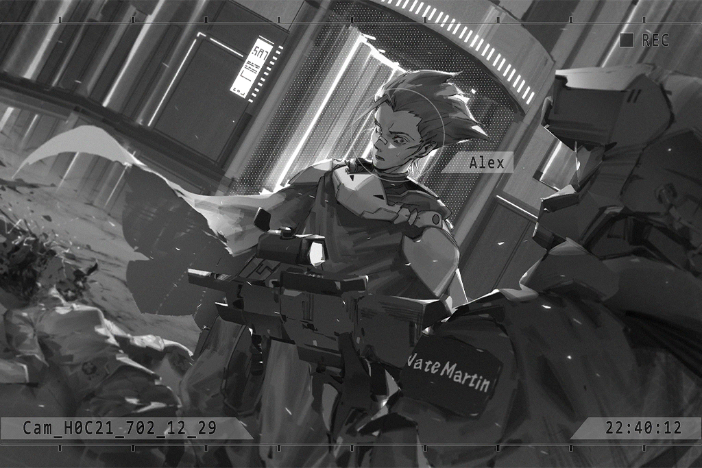

**Nate**  
The mission is to eliminate all Architects.  
Mission record: Time, 22:40; eliminated the Architect known as "Rin". Preparing to head to A.R.C's headquarters.

_\[→Signal Switches\]_

**Team Member C**  
It appears the captain has dealt with one of the targets.

**Team Member D**  
Excellent. Captain Sagar, it's almost over.

**Sagar**  
......

**PAFF**  
...... (Shakes head)

**Sagar**  
NOW!

_\[Electricity cuts out\]_

**Armed Forces Officer**  
!?!?

_\[Hacking\]_

_\[Consecutive Gunshots\]_

**Armed Forces Officer**  
URRGHHH!!!!!

_\[Signal Lost\]_

[Last Log](#os-log-029) | [Back to Top](#list-of-logs) | [Next Log](#os-log-031)

### OS Log #031
___

[Last Log](#os-log-030) | [Back to Top](#list-of-logs) | [Next Log](#os-log-032)

#### Requirements
|   Char.   |Lv.|Lv. Locked?|
|-----------|:-:|:---------:|
|**Vanessa**|20 |    No     |

#### Audio\_hall\_702\_12\_29\_2
**ConneR**  
Hmph. Reality is more ridiculous than a lie. Mr. Sagar, don't try to be a hero. I know you're hesitant. If you don't want things to develop in the worst way possible, I have a way.

**Sagar**  
......

**ConneR**  
What do you think? Interested? I mean, waiting is going to be boring.

**Alex**  
Hey Weasel, shut your stinky f\*\*\*ing mouth.

**ConneR**  
What a pity... Forget that she's an Architect. I've also been helped greatly by Miss Rin. She's a good lass; do you really want to see her dead?

**Sagar**  
I...

**ConneR**  
She just mentioned that you hoped she could live a normal life, no? Can you do that? For a small misunderstanding to ruin the possibility of fulfilling a promise you never could have kept in the first place, that would be rather embarassing.... A real shame. After all, your father was my father's most exceptional competitor.

**Sagar**  
... Quit talking like you're so goddamn great!

**ConneR**  
Don't be upset. I don't know who wants her destroyed, but it must be someone in A.R.C. who knows what's going on. Someone who's known of her existence all along, and who because of this wants to cover up any information concerning Architects. Therefore, even if she manages to evade disaster this time, she'll never be able to fully escape the grasp of A.R.C.

**Sagar**  
Hm...

**ConneR**  
Ha, just a man who is driven by intuition and drive... Once she dies, that will change.

**Sagar**  
!?  
What'd you say?

**ConneR**  
Don't fret. What I mean is——If the one who commands her death believes she's dead...

**Sagar**  
!!

**ConneR**  
Based on my understanding, Miss Rin's current appearance is based on her abilities as an Architect model type OPCII, is that correct?

**Rin**  
Yes, yes, that's right...

**ConneR**  
Well, then making an Architect look exactly like her shouldn't be too difficult.

**Sagar**  
... Where we gonna find...

**ConneR**  
Isn't there a whole bunch of them right above us? So long as Ivy helps us, if we want this done, it shouldn't be hard. After all, she used a fake identity to evade all of our investigations.

**Alex**  
Huh? You freakin' kiddin' me? Aren't those the stark raving mad things attacking the city?

**ConneR**  
I said, they won't attack Ivy. For her, using the equipment upstairs for such a purpose will be as easy as pie.  
What do you think? This would prove our position: If she just wants to eradicate mankind, she'd have no need to waste time helping us.

**Sagar**  
......

**Alex**  
... Bambi, do you believe what he's saying?

**Sagar**  
My gut tells me he's not lying, but...

**Alex**  
Your gut...? Well, your gut's pretty friggin' accurate.

**Sagar**  
Your intuition isn't bad either, right? What do you think?

**Alex**  
Don't know. I've always hated this dirtbag, but now I can't smell it... Can't smell "the smell".

**Sagar**  
Well, even if we do as you say, what are you gonna do? Just because we can trick them with Rin, doesn't mean they'll let you go. If Ivy really is as important as you say, we can't let them stop her, right?

**ConneR**  
Simple. First, Miss Rin gets herself somewhere safe. You guys pretend like you're on their side. Given your identities, it won't be odd for you to side with them. When the time comes, we've got some tricks up our sleeves... Miss PAFF and Mr. Jackson, please prepare.

**Sagar**  
......  
What exactly do you want to do?

**ConneR**  
I'll explain the details as we go, but the main goal is to prevent Mr. Martin from heading upstairs. Best case scenario is that we send him back to the lobby.  
Hehe, given their situation, if we can hold them off for a few minutes that'll be pretty good...

**Sagar**  
... Don't underestimate us.  
Alright, so obstructing the Armed Forces actions is the mission, right? Jackal, I'll leave that up to you.

_\[»»»Fast Forward 16 minutes»»»\]_

_\[Gunshot\]_

**Alex**  
......!?

**Nate**  
The mission is to eliminate all Architects.  
Mission record: Time, 22:40; eliminated the Architect known as "Rin". Preparing to head to the of core A.R.C's headquarters.

**Alex**  
Hey hey! That's it? You guys are a little too trigger\-happy, don't you think?

**Nate**  
... You don't have the authority to question how we handle things.  
Thank you for your help.

_\[Footsteps\]_

**Nate**  
... What are you doing?

**Alex**  
Hehe, can't let you go up there. My intuition was right... "The smell", just got stonger... Thought I smelled some hesitation in there...

**Team Member A**  
What the s\*\*\* are you talking about?

**Alex**  
The sixth commandment. Now that I think of it, I believe Bambi said to not let you guys go up there... Whatever, it's all the same, I'm gonna beat your a\*\*es! Hahaha!

**Team Member A**  
Captain, this guys freakin' weird. Should we head back to the lobby and confirm the situation?

**Nate**  
No, the target is upstairs. He's got nothing to do with this. He's with the Exploration Team, so be careful.

**Team Member A**  
Yes, sir!

**Alex**  
One, two, three, four... five bros? No way you meatheads are stopping my a\*\*!

_\[Hurried Footsteps\]_

**Team Member A**  
Watch out! He's coming!

_\[Punches\]_

**Team Member G**  
So\-so fast! WAH!

**Team Member H**  
Get down!

_\[Gunshot\]_

**Team Member H**  
What the f\*\*\*! He dodges bullets? How do these guys train? URGH!

**Alex**  
Ha... boringgg. None of you guys fight?  
Is everyone on the Armed Forces a vegetarian?

**Team Member A**  
Damn... Captain!

**Nate**  
... Get ready to surround him!

_\[Signal Lost\]_

[Last Log](#os-log-030) | [Back to Top](#list-of-logs) | [Next Log](#os-log-032)

### OS Log #032
___

[Last Log](#os-log-031) | [Back to Top](#list-of-logs) | [Next Log](#os-log-033)

#### Requirements
|   Char.   |Lv.|Lv. Locked?|
|-----------|:-:|:---------:|
|**Vanessa**|20 |    No     |

#### Audio\_H0C21\_702\_12\_29
**Team Member A**  
Huff... huff... this guy's a wild animal...

**Team Member I**  
We shot him several times and he still didn't drop...

**Alex**  
This a joke? 3 guys and this is all I get? Damn, fighting with Bambi is more fun than this...

**Nate**  
... We're wasting too much time.

**Alex**  
Hehe, you wanna settle this?

_\[Footsteps\]_

**Alex**  
... Oh?

_\[Kneels\]_

**Alex**  
What's... this...?

**Nate**  
You got skills, but your weakness is that you're rash and rude. When you were busy with my boys, you didn't notice that I changed a clip, did you?

**Alex**  
Uh...

**Nate**  
These paralysis bullets were developed by A.R.C.... How ironic. Don't be suprised. After all, we usually need to capture targets alive. You've lasted long enough. Took longer to take effect than I imagined  
What do you think? Still think we're a bunch of b\*\*\*\*es?

**Alex**  
F\*\*\*...

**Nate**  
To be honest, I had plenty of chances to kill you. I'd advise you to not be so arrogant. Nighty night.

**Alex**  
You... and... one on one...

_\[Collapses\]_

_\[Kicks\]_

**Team Member I**  
He finally out? Monster...

**Team Member A**  
Captain, you sure we shouldn't go back and check the situation? The Exploration Team was pretty helpful. This guy suddenly starts fighting us, maybe something's going on...

**Nate**  
No, this one guy took on us five. If we head back, we're gonna do exactly what they want...

_\[Static\]_

**[Team Member]**  
_... This\-this is headquarters... Calling Captain Martin!_

**Nate**  
What's the matter?

**[Team Member]**  
_Captain, we;ve received reports from all Quadrants, there are a massive number of w͡҉u……d̸ie̸̷̡d̵̛i͢͟e̸̢d̕͟……_

**Nate**  
Headquarters? Headquarters! Respond! ... Signal cut out?

**Team Member A**  
Hey, look outside! What's that densely pack shadow...!

**Nate**  
... No time! Head up, now!

_\[→Signal Switches\]_

**Team Member C**  
Ugh... what... happened...?

**Team Member D**  
Hey? What... what's going on!? Let us go!

**Sagar**  
Sorry, can't do that.

**Team Member C**  
You bastard! You had this planned all along!?

**Xenon**  
Sagar, thanks.

**PAFF**  
Thanks for helping us!

**Sagar**  
Wait 'til it's over before thanking me. They should bring the target back first, right?  
Calling Jackal, if you hear me respond. Jackal...? Jackal!

**Xenon**  
There's no way... he couldn't stop Nate?

**Sagar**  
He's skilled... but even if he couldn't stop 'em, he would respond...

**[Nora]**  
_Communication to the surveillance equipment near the lift has been restored... It appears that he failed._

**Xenon**  
... Not good. We must notify Ivy!

_\[Metal Pounding\]_

**NEKO#ΦωΦ**  
Wah! What, what was that sound? You hear that?

**PAFF**  
... It was the lift! But, didn't Noah already...

**[Nora]**  
_Communication to the surveillance system disappeared again... a signal is disrupting it._

**ConneR**  
Looks like the time that Mr. Black bought us is about to run out.  
Vanessa is trying to take back power. Whatever that was, it didn't sound good. Best not go near there for the time being...

**JOE**  
... Wait, Brother Fang. Your signal's not too...  
Huh? A robot army!?

**Xenon**  
!?

_\[Signal Lost\]_

[Last Log](#os-log-031) | [Back to Top](#list-of-logs) | [Next Log](#os-log-033)

### OS Log #033
___

[Last Log](#os-log-032) | [Back to Top](#list-of-logs) | [Next Log](#os-log-034)

#### Requirements
|   Char.   |Lv.|Lv. Locked?|
|-----------|:-:|:---------:|
|**Vanessa**|21 |    No     |

#### Audio\_St06\_702\_12\_29
**[Drone]**  
_You are... end\-d\-d\-d\-angering the citizens, please... stop..._

_\[Gunshot\]_

**[Drone]**  
_You... citizens... d\-d\-d\-danger..._

**Fang**  
Again? Brother, we gotta be quick.  
... Brother?

**Luis**  
Wait... you hear that?

**Fang**  
...? Hear what?

**Luis**  
A girl's voice, like she... needs help...?

_\[Sprints\]_

**Fang**  
Hey! Brother! Where you going?

_\[→Signal Lost\]_

**Female Teenager**  
WAAHH!!! H\-Help!

**Man**  
Sally!!  
Let... let her go!

**Thug**  
Back off! Just give me the money, and I'll let her go!

**Man**  
No, I can't. This is for Sally's hospital bill... Please, she's sick...

**Thug**  
Shut up! Everyone's getting killed by these stupid machines anyway! S\*\*\*, I might as well send her to heaven right now...

_\[Finger on the trigger\]_

**Female Teenager**  
Helpppp!!!!!

_\[Gunshot\]_

**Thug**  
WAAAAHH!! My hand!!

**Luis**  
Don't move... next time it'll be the brain.

**Female Teenager**  
_\*sob\*... \*sob\*_... Dad, Daddy!

**Man**  
Sally! Come here!

_\[Hugs\]_

**Female Teenager**  
Urgh... Dad!

**Man**  
It's okay, it's okay...  
Thank, thank you! Thank you for saving my daughter!

**Luis**  
......

**Thug**  
Motherf\*\*\*er... What's it to you!? Think you're some superhero upholding justice? Look in the mirror, you old s\*\*\*!

**Luis**  
... Whatever.  
I don't want to shoot anyone anymore. Get outta here...

_\[Explosion\]_

**Luis**  
......!

**[?̷̡͘͠?̨̢͟?̶̡͘?̶̢?̶͝?́͡͠?̸̛͢]**  
......ˊ̨̨͘!̡͟͡%̶&̷̧̨͟͝......@̷̡̀͢^̷\*̷̸̢̛͝&̧̨̛͘^̧́͘͠͏\*̸......

**Thug**  
What the... URRRAGHH!!

_\[Heavy Blow\]_

**Female Teenager**  
AAHHH!! R\-Robots are attacking people...?

_\[Gunshot\]_

**Luis**  
This gun isn't doing anything... Hey, get out of here!

**Man**  
... O\-Okay! Sally, let's go!!

_\[Sprints\]_

**[?̷̡͘͠?̨̢͟?̶̡͘?̶̢?̶͝?́͡͠?̸̛͢]**  
_......0̵̛̛8̸͘͢͟9̶͘͝͝҉g̵͘͢Y̡.......f̀͠҉7̸̀͏̴9̷́̕͢Ư̷̧̨͝\_͏͟B̵͢͢H̡҉(̨)̡̨͞͠9̨̧̧͜͜j͘҉̢̛̀......._

_\[Gunshot\]_

**Luis**  
Don't follow them... Look at me.

**[?̷̡͘͠?̨̢͟?̶̡͘?̶̢?̶͝?́͡͠?̸̛͢]**  
_......!̡͟͡%̶&̷̧̨͟͝.......@̷̡̀͢^̷\*̷̸̢̛͝&̧̨̛͘^̧́͘͠͏......_

**Luis**  
......  
Sherry...... Carly......

_\[Consecutive Gunshots\]_

**Luis**  
!?

**Fang**  
Brother! Finally found you. You alright?

**Luis**  
... I'm alright... What is this?

**Fang**  
Don't know where they came from. Suddenly appeared everywhere. Stick with us, otherwise I won't be able to guarantee your safety...

_\[Hurried Footsteps\]_

**Gang Member**  
Brother Fang! The boys reported that all these robots changed directions, they're all headed towards A.R.C.!

**Fang**  
A.R.C...!? Where JOE's at!?

_\[Call Starts\]_

**Fang**  
JOE! You hear me? A ton of robots showed up... There's so many of them, like freakin' ants. They're all headed your way! It's like a freakin' army!

**[JOE]**  
_You... huh? Robot army?  
......e̷͞w͡҉u......d̸ie̸̷̡d̵̛i͢͟e̸̢d̕͟......_

_\[Call Ends\]_

**Fang**  
Damn, the signal...

**Luis**  
... We'd better get there fast. Be good if we could put out some power...

_\[Signal Lost\]_

[Last Log](#os-log-032) | [Back to Top](#list-of-logs) | [Next Log](#os-log-034)

### OS Log #034
___

[Last Log](#os-log-033) | [Back to Top](#list-of-logs) | [Next Log](#os-log-035)

#### Requirements
|   Char.   |Lv.|Lv. Locked?|
|-----------|:-:|:---------:|
|**Vanessa**|22 |    No     |

#### Cam\_hall\_702\_12\_29\_2
**JOE**  
Everybody! Brother Fang just said there are a ton of Architects charging our way!

**ConneR**  
... How many?

**JOE**  
The signal wasn't clear... but he said something about being just like ants.

**NEKO#ΦωΦ**  
Like ants? So it's definitely a lot!?

_\[Static\]_

**Lucy**  
... Captain, just got news that 20 kilometers away, approxiamately 100 plus Architects are headed this way. Based pn their speed, they'll arrive in about 7 minutes.

**Sagar**  
From which direction?

**Lucy**  
... All directions. Other reports also indicate that Architects have suddenly appeared all over the place. That doesn't include the hundred just mentioned.

**Bruno**  
That means the actual number is over a thousand or more... Captain, we've got to make a move soon.

_\[Metal Pounding\]_

**JOE**  
Uh... That my tinnitus? Or was that real...

**PAFF**  
Mr. JOE, it's the elevator... Strange sounds started coming from inside a moment ago. We think it's Vanessa trying to take back power...

_\[Metal Pounding\]_

**NEKO#ΦωΦ**  
Eyyyy? Why's it sounding louder and louder?

_\[Heavy object crashes\]_

**NEKO#ΦωΦ**  
WAAHH!

**PAFF**  
... Did it quiet down...?

**[A.R.C. System]**  
_Warning, the elevator cable has broken. It is currently stopped on Floor 1. Please wait for the repair mech and do not activate it manually..._

**NEKO#ΦωΦ**  
W\-W\-Wait! Floor 1... isn't that here!?

_\[Metal Pounding\]_

**ConneR**  
... Get out, now!!

_\[D̀͟oor Breaks\]_

**[?̷̡͘͠?̨̢͟?̶̡͘?̶̢?̶͝?́͡͠?̸̛͢]**  
_J̴̛I҉̵̷͘͝K̶͝I͘H̢҉̕͘E̶̴̛Ĺ̶̶̢́L̛͞;́;̵̨̕͜'̷̸̨̕Ǫ̷D͘͠͏͞Q̴͏͢Q̨̛́͠……_

**NEKO#ΦωΦ**  
WAHHH!!

**PAFF**  
NEKO! Watch out!

_\[Consecutive Gunshots\]_

**Lucy**  
Hmph.

**ConneR**  
Oh? Nice shot... But it looks like this has only just begun.

**[?̷̡͘͠?̨̢͟?̶̡͘?̶̢?̶͝?́͡͠?̸̛͢]**  
_\[̀͢͠E̕͢͟͠͝L̷̸̴\[̷̧͠K͏̢̡̡͡E͢͏͝O̸̴̴͝͝Í̷͡͞͏R̶̢͠͞8̸̛́͝F̵̴̧͜͟……_

_\[Mechanical Footsteps\]_

**Sagar**  
My god, how many are there... Were there too many climbing down, and that's why the elevator cable snapped?

**Bruno**  
Strange... No matter who attacks them, they're only charging this way... like they have a specific target.

**PAFF**  
...Ah! Like what happened with Noah...

**ConneR**  
Not bad... Looks like she has realized we are her greatest threat. It's an honor...

**NEKO#ΦωΦ**  
AAHH! Xenon! You get in contact with Ivy!?

**Xenon**  
No. The signal's being interrupted. She wants us alone and without help... I've got to think of a way re\-establish the connection.

_\[Window Breaks\]_

**Nora**  
!?

**JOE**  
Wah... they're over there too!

**PAFF**  
Did they... surround us?

**[ROBO_Head]**  
_Nora, please hide behind this unit.  
This unit, is entering guard mode. Basic power output increasing 250%._

_\[Machine Operating\]_

_\[Consecutive Gunshots\]_

**[ROBO_Head]**  
_This unit, will not let you hurt Nora._

**ConneR**  
Aigh, not good. Girls, please don't stray too far from us. Mr. Jackson, put off connecting with Ivy until later. We need your help dealing with this.

**Xenon**  
Didn't need to tell me.

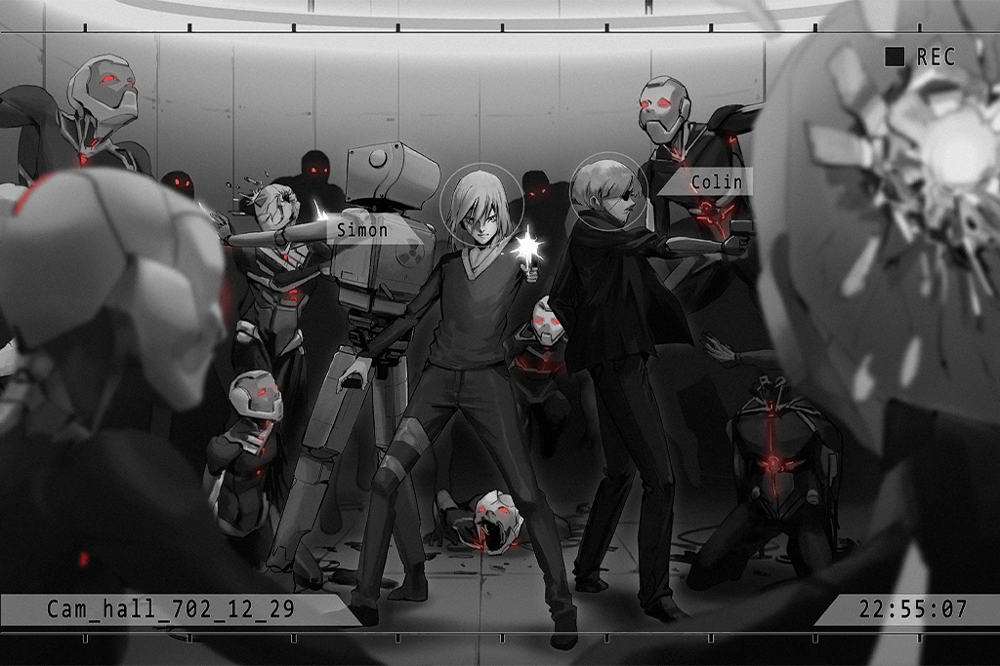

**Sagar**  
Big B! Take two men to cover the windows! Do not let any Architects get in here. The rest of you take out those Architects attacking Jackson and them. Create an opening for them!

**Bruno**  
Got it!

**Sagar**  
......  
Is this... what Dad faced?

**[Rin]**  
_Sagar! Watch out behind you!_

**[?̷̡͘͠?̨̢͟?̶̡͘?̶̢?̶͝?́͡͠?̸̛͢]**  
_D̀͟J̨̀͜͢͞9͏͟͢͞͝4̀͘2̴̸͞͝U͢0̀͝͝3̵̶́͜͟Ģ0̡͢͝3̵Ḑ̛9͏̡̛́͡......_

**Sagar**  
!?

_\[Blocks\]_

**Sagar**  
Huff, huff... What happened? Aren't all the comm devices unable to connect...

**[Rin]**  
_I... have the ability to enter the core of the Virtual Internet... Via an encrypted connnection, the interference is not that strong... I can calculate the Architects path and point of weakness for you..._

**Sagar**  
You...

**[Rin]**  
_Sagar, please, trust me... I was originally designed for data analysis. I can help!  
I\-I... want to protect you!_

**Sagar**  
... I know, Rin... Thank you.

_\[Draws Gun\]_

**Sagar**  
Help me with this one! We've got to stop this bunch.  
As for the rest, I'll hear you out... okay?

**[Rin]**  
_Sagar... Oh... Okay!_

_\[Signal Lost\]_

[Last Log](#os-log-033) | [Back to Top](#list-of-logs) | [Next Log](#os-log-035)

### OS Log #035
___

[Last Log](#os-log-034) | [Back to Top](#list-of-logs) | [Next Log](#os-log-036)

#### Requirements
|   Char.   |Lv.|Lv. Locked?|
|-----------|:-:|:---------:|
|**Vanessa**|23 |    No     |

#### Audio\_hall\_702\_12\_29\_3
_\[Gunshot\]_

**[ROBO_Head]**  
_Analysis: Optimal route discovered, time required, 5.89 seconds, please follow this unit quickly._

**ConneR**  
Well done, thanks to everyone's help.  
Exploration Team! Eliminate the enemies at 3 o'clock.

**Lucy**  
... You've no authority to give us orders.

_\[Consecutive Gunshots\]_

_\[Footsteps\]_

**NEKO#ΦωΦ**  
WAAHHH!!! Are... are we finally... safe?

_\[Hurried Footsteps\]_

**Lai**  
JOE! There's at least a couple hundred Architects close to us! There's even some that already started duking it out with some of the boys on the outer rim!

**JOE**  
You kiddin' me? That's way too fast! Brother Lai, let everyone back up to the entrance to fight! It's too dangerous to be left alone with those bastards!

**Lai**  
Got it, going there now!

**JOE**  
Damn...the gangs are all we got...

**Sagar**  
Miller... Are you commanding the gangs?

**JOE**  
Huh? What's it look like?   
Tsk, what's it got to do with the Exploration Team?

**Sagar**  
We can take care of the Architects on the inside. I'll send a small squad to provide assistance outside. This is an emergency; tell your boys not to clash with my team.

**JOE**  
Really? Thanks, dude! Great, when this is all over, come to my place for a few drinks!

**Sagar**  
...Change in attitude was a little too extreme, don't you think...?

**Gang Member**  
Hoo\-ah! Quick, stop that thing!

**Gang Member**  
We're not gonna make it!

_\[Door Breaks\]_

**[?̷̡͘͠?̨̢͟?̶̡͘?̶̢?̶͝?́͡͠?̸̛͢]**  
_J̴̛I҉̵̷͘͝K̶͝I͘H̢҉̕͘E̶̴̛Ĺ̶̶̢́L̛͞;́;̵̨̕͜'̷̸̨̕Ǫ̷D͘͠͏͞Q̴͏͢Q̨̛́͠……_

**[Nora]**  
_Miss PAFF!_

**NEKO#ΦωΦ**  
Aroma\-chan!

**PAFF**  
!?

_\[Hurried Footsteps\]_

_\[Gunshot\]_

**PAFF**  
Are you... Alex?

**Alex**  
Damn, mouth's numb as balls... What's going on? Who can explain to me what's happening? Just got up and saw a bunch of freakazoids...

**Lucy**  
Jackal? How'd you get up?

**Alex**  
Miss Freeze, I don't like your attitude. It's almost like you wished I didn't wake up.

**Lucy**  
Shut up. Anyone who gets beat down by people from the Bureau has no right to talk to me.

**Alex**  
Goddamn dirty rats! If they hadn't played all dirty... it was just a bunch of puny cockroaches... How could this stud not have handled 'em?

**Bruno**  
Enough! Not time to argue. This mission is important. Right, Captain?

**Sagar**  
You got it.  
Miss PAFF, everybody, we're going to protect you for the time being.

**PAFF**  
Thank you, Sagar, sir!

**Sagar**  
Are you trying to contact Ivy now...?   
Jackson, Rin said she can help you set up an encrypted connection from inside, where the signal is more stable. I'll send you the position.

**Xenon**  
...! That'd be a big help, thanks.

**Sagar**  
Good. Eagle\-01, listen up! Starting from now, do not let a single Architect bust in here! Move out!

**Team Member**  
Yes, sir!

_\[Footsteps\]_

**JOE**  
A'ight, I'm heading out to help with the conducting. Brother Fang even brought our fallen sis' father. The whole gang's got your back.

**Xenon**  
Didn't think you'd arrange all that... thanks.

**JOE**  
Now you're thanking me? S\*\*\*.  
Oh yeah...

**Xenon**  
......?

**JOE**  
Even with the Exploration Team... with this many, I don't know how much longer we can hold on.

**Xenon**  
I know.

**JOE**  
This may sound like the last words of a dying man... but Pops used to tell me that people in ancient times believed that if one died unjustly their soul couldn't rise to the heavens. I don't want to have to stay with you even after I'm dead... I've had enough of your nasty a\*\*, so... Good luck. Let's roll.

_\[Footsteps\]_

**NEKO#ΦωΦ**  
Ay... ayayayaya!!! Xenon! That red button on the screen is flashing! WAAAHHH!! Is it gonna explode!?

**Xenon**  
... No. It's got a signal! We can call Ivy in a moment. Just gotta wait a bit...

**PAFF**  
Um, Ivy hasn't contacted us in some time, do you think... something happened?

**NEKO#ΦωΦ**  
WHAA! NO WAY!? Didn't she say she wouldn't be attacked by the other Architects?

**ConneR**  
I'm concerned as well. But from here we can't get any visuals of the Library from the surveillance equipment... All we can do is take a little trip ourselves. Miss Nora, can you let us enter the OS space once more?

**[Nora]**  
_Okay, but I must remind you; if Ivy fails, the weather system will be activated in approximately eight minutes... The virus is the last chance to stop Vanessa._

**[ROBO_Head]**  
Eh? Wait a second, if Ivy fails, doesn't that mean that Aroma\-chan will...

**Xenon**  
PAFF, I performed an analysis of the situation, which revealed that the power of the virus core that Ivy produced is too much for you to handle...

**PAFF**  
... If it really comes to this... you must... do what needs to be done...

**[Nora]**  
_Miss PAFF, you mentioned someone else in the OS space. After thinking it over, I believe that whoever that was is probably a "user". Moreover, given your descriptions, it sounds like their power is greater than yours..._

**[Nora]**  
_The two of you may be able to bear the burden caused by the implantation process; if this is truly the case... you said that you felt like it was not an enemy, right?_

**PAFF**  
Yeah... I'll try to contact them, but... I hope Ivy succeeds...

**[Nora]**  
_... Me too.  
ROBO, in order to prevent any accidents, prepare to connect._

**[ROBO_Head]**  
_... Received. This unit, will protect everyone._

_\[Signal Lost\]_

[Last Log](#os-log-034) | [Back to Top](#list-of-logs) | [Next Log](#os-log-036)

### OS Log #036
___

[Last Log](#os-log-035) | [Back to Top](#list-of-logs) | [Next Log](#os-log-037)

#### Requirements
|   Char.   |Lv.|Lv. Locked?|
|-----------|:-:|:---------:|
|**Vanessa**|24 |    No     |

#### Audio\_Library\_702\_12\_29
_\[Hurried Footsteps\]_

**Ivy**  
Here it is... The door is locked tight, as it was last time... No time...

_\[Heavy Blow\]_

_\[Door Opens\]_

**Ivy**  
Vanessa...

**Vanessa**  
HumanF̵͘͞H́!̢͢҉^̷̢͘... ity...... Kill Kill\#̶̨̕͝͠ŕ̷͢\$̛̕͠͝t̸̢̡͡...... DieT̛҉̨̕͘2̸̛͜͠͞^̷̛͡Die... die...

**Ivy**  
... It's me...

**Vanessa**  
Die... all\[̵̨͢͜͜2̛́̕Ì̸͠͏2̷̵͘Ì̵̢͞͠must die...... Noneì̵̵k͟҉̵҉survive...

**Ivy**  
Vanessa! Pull yourself together!

_\[Footsteps\]_

**Vanessa**  
WWAAAAAHH!!! LEAVEo̵͢҉͠ṕ̴̶͜)҉̶͟!!!!

**Ivy**  
......!

**Vanessa**  
Let Let... m̛̀e͝͏...G̛̀͘͠o͘͏̶͘...! Kill Kill\]̸̷̡͜\[͝҉2̶̢͘͢͜Kill... K\-K\-K\-Kill Kill kill!!

**Ivy**  
My god... What happened to you that made you like this...

**Vanessa**  
Kill Ki̢͠l̡̨̡͢l̶̸̴̕ kill…Die\]̷͞҉̸͢\[̶̸̧͘2̴̴̡̧̕Í̢̡͝Die... die... !!!

**Ivy**  
... Got to try... to snap her out of it...

_\[Footsteps\]_

_\[Squats\]_

**Ivy**  
Vanessa... It's me... Ivy... can you hear me?

**Vanessa**  
KILL ķ̡͟͢͞i̷͢͝l̷̶̨l̷̢ diediedie……

**Ivy**  
... Didn't we promise we'd go see the lake...? The blue flower... You still don't know its name...  
I mean it... I want to take you there. Just like before, when no one was there to bother us. This time it'll only be us two. You won't be hurt by anyone, and you won't hurt anyone.

**Vanessa**  
AllH́͠҉̸!̵̵͟͠҉^̛͟all... must d̴̵͜į̵̵̨ȩ̵̷̀... m\-m\-m\-must not...

**Ivy**  
Come on, that's not you...  
None of the Architects attacked me... You're still in there, right? It was you who did that... You can still trust me, trust me that I can save you... I'm sorry, making you wait for so long...

**Vanessa**  
DIE die die die......

**Ivy**  
I said I'd save you, just come with me, what do you say?  
"Being with you is enough"... I still feel the same! Let's live our lives together! We can do it Vanessa!

**Vanessa**  
Die...

**Ivy**  
... It's not working? This virus, do I really have to...

**Ivy**  
......

**Ivy**  
Vanessa... I'm sorry... I'm sorry! I... I believed in you... After spending time among humans, I slowly began to understand what you had said... Perhaps we can live together with humans after all, create a better world... If only I had understood your words earlier, if I had stopped all this long ago...

**Ivy**  
You... you've always been so kind. Even though all of this befell you, if it was the real you, I know you wouldn't hurt anyone... I won't let you regret this... It was I who made you like this... so... I'm sorry...

_\[Stands Up\]_

**Vanessa**  
……I……Ivy……

**Ivy**  
!?

**Vanessa**  
Is th\-th\-that you...y\-you? I\-I\-I... knew... you would come... to save me...

_\[Squats\]_

**Ivy**  
Vanessa...? You... are you awake?

**Vanessa**  
... Awake? What do you mean? Why... would you come here...?

**Ivy**  
Wonderful... I'm going to take you away from here! You spread your consciousness to a multitude of units and were controlling all of A.R.C.; so much chaos was caused... They probably want to do something to get rid of you...  
In any case, you must resist those thoughts! If they're too strong, they'll make you lose self\-consciousness once more!

**Vanessa**  
Get rid of me...? Ugh... It's here again... It's coming... Ivy... I'm... I'm in so much p\-p\-pain... These voices... they're telling me to... k\-k\-k\-kill   
k̴̶͏̨͟ì͜͞͡l̸̕͜͞l̸͞͡ kill... h\-h\-h\-humans...

**Ivy**  
Vanessa, you can do it! Think about the promise we made... Think about the world we can create... No, even without that it doesn't matter... So long as we're together...

**Vanessa**  
... P\-P\-Promise, Ivy... I want to be with y\-y\-you... Go see the blue f\-f\-flower once m\-more... I w\-w\-w\-want... to see the w\-w\-w\-world we c\-c\-create...

**Ivy**  
Yes! We made a promise! So you've got to resist, okay?

_\[Hand reaches out\]_

**Vanessa**  
Ivyyyyyy... What you say is... so beautiful... b\-b\-b\-but...

**Ivy**  
But?

**Vanessa**  
... So much p\-p\-p\-pain... the v\-v\-v\-voices... h\-h\-h\-humans... k\-k\-k\-̸̀̕͠͡k̕͡\-̸̡́͞k̢̨̛̕͝\-̵̀͡͡kill kill... the replicated ... minds... are binḑ̶͟ì͝͏n͢͟͏̀g... me...

**Ivy**  
Vanessa! Let's leave together, what do you say? Just overcome the desire...

**Vanessa**  
... I w\-w\-w\-want... to be with you... Ivy...

**Ivy**  
Yes, Vanessa. As soon as we succeed I can take you out of here. It doesn't matter if you destroy some of your settings. It doesn't matter how... I don't want to see you tormented anymore.

**Vanessa**  
Together...

**Ivy**  
Yes, together.

**Vanessa**  
Stop... bothering me... I want to go with Ivy... URRAAAAGHHHH!!!!

**Ivy**  
Vanessa...!?

**Vanessa**  
... The voices...

**Ivy**  
!?

**Vanessa**  
The voices... they're disappearing one by one... AAAAHHH... AAAAHH!!

_\[Signal Lost\]_

[Last Log](#os-log-035) | [Back to Top](#list-of-logs) | [Next Log](#os-log-037)

### OS Log #037
___

[Last Log](#os-log-036) | [Back to Top](#list-of-logs)

*(The OS Log has a video version, you can watch it on [this link](https://youtu.be/40kFJBUmXTg))*

#### Requirements
|   Char.   |Lv.|Lv. Locked?|
|-----------|:-:|:---------:|
|**Vanessa**|25 |    No     |

#### Unlocked Charts
|            Song             | Char. |Diff.|Lv.|
|-----------------------------|:-----:|:---:|:-:|
|**CHAOS  //System Offline//**|Vanessa|Easy | 4 |
|**CHAOS  //System Offline//**|Vanessa|Hard | 8 |
|**CHAOS  //System Offline//**|Vanessa|Chaos|12 |
|**V. //System Offline//**    |Vanessa|Easy | 4 |
|**V. //System Offline//**    |Vanessa|Hard | 8 |
|**V. //System Offline//**    |Vanessa|Chaos|13 |
|**͟͝͞Ⅱ́̕**                        |Vanessa|Easy | 5 |
|**͟͝͞Ⅱ́̕**                        |Vanessa|Hard | 9 |
|**͟͝͞Ⅱ́̕**                        |Vanessa|Chaos|14 |

#### Cam\_Library\_702\_12\_29
**Ivy**  
Vanessa! It's working! You can do it!

**Vanessa**  
Ivy... It... it hurts... the replicated minds... have already integrated with me... all the pain they suffer, I feel...

**Ivy**  
You'll be fine! You must hold on! The humans will help us!

**[Xenon]**  
_Ivy! Get out now, the Armed Forces are headed toward you!_

**Ivy**  
No! Vanessa is almost there! Can't you see!?

_\[Door Breaks\]_

**Nate**  
Don't move!

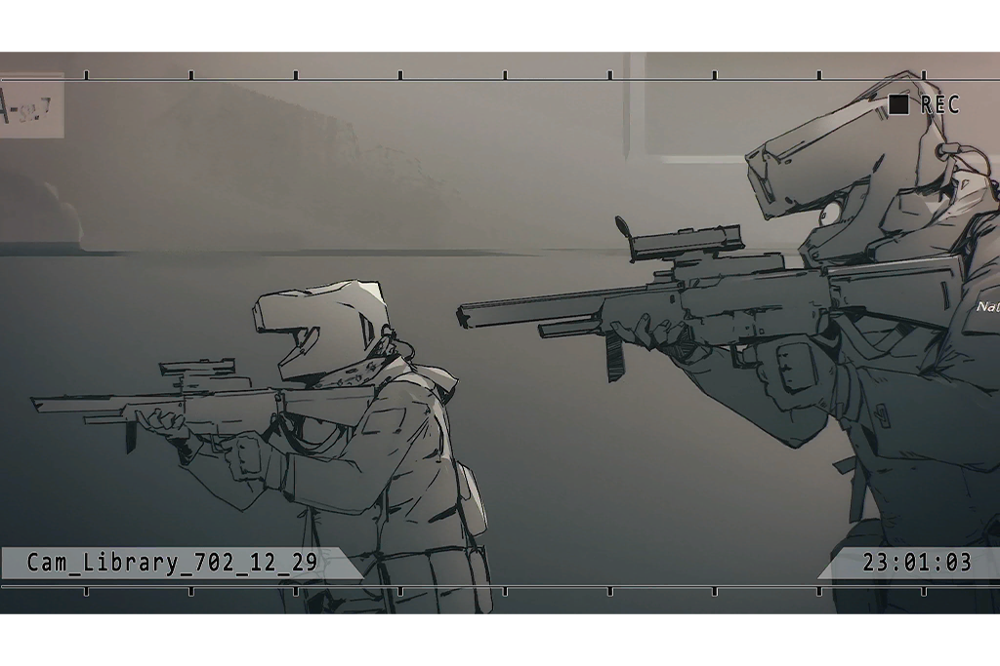

**Ivy**  
... _\*whimper\*_...

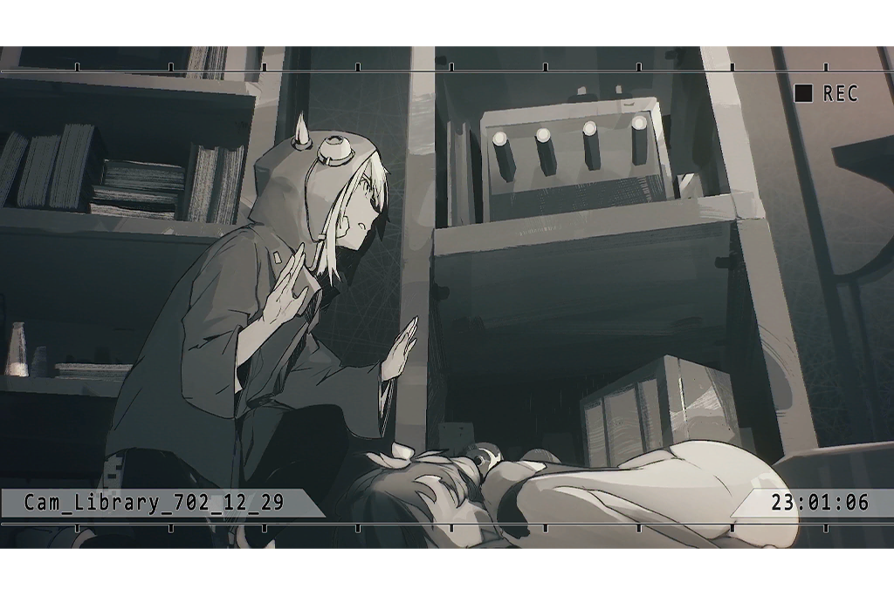

**Nate**  
Hands above your head, stand up and face us!

**Team Member A**  
Captain! What are you doing? They ordered us to fire immediately!

**Nate**  
... Do not make any rash movements before we identify them.

**Ivy**  
... Do not shoot. We are just about to end all of this, please...

**Nate**  
Shut up! Walk slowly this way.

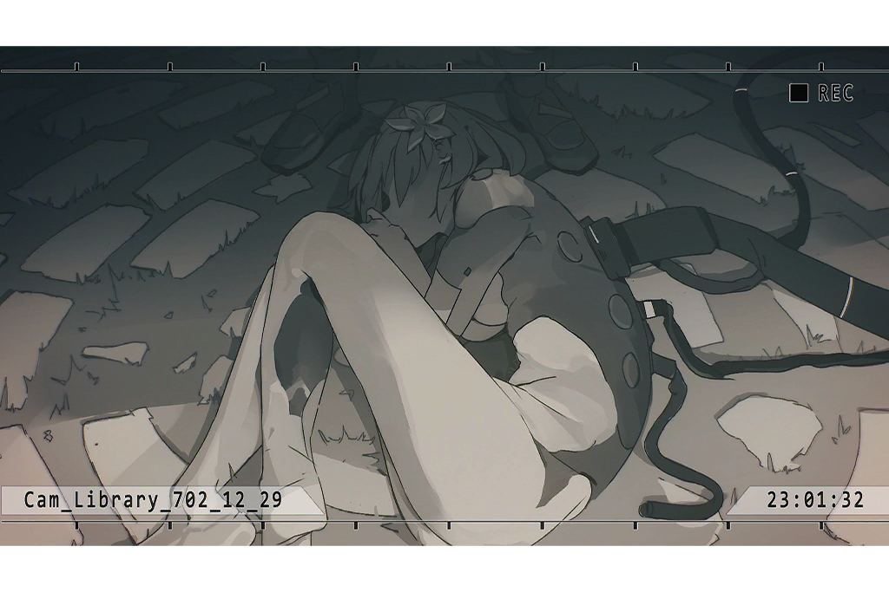

**Team Member A**  
Captain! If you do not fire you are disobeying orders! She may have a weapon!

_\[Draws Gun\]_

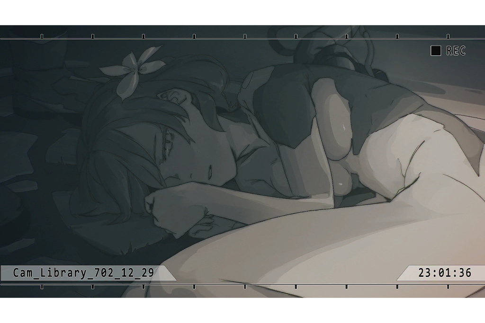

**Nate**  
Don't...!

**Vanessa**  
Ivy! Watch out!

_\[Hacking\]_

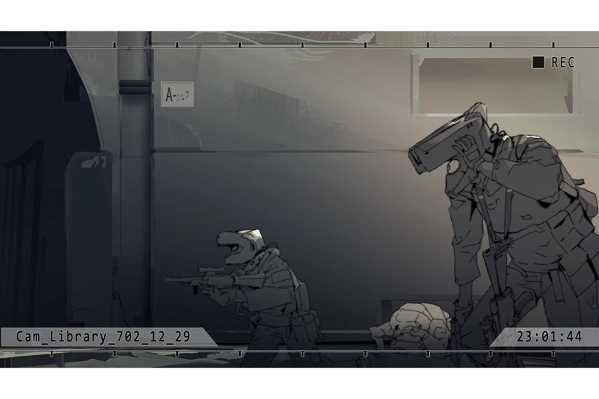

_\[Consecutive Gunshots\]_

**Vanessa**  
Ivy...?

**Vanessa**  
I... IVY!!!!!!

**Vanessa**  
AAARRRGAAAAAHHH!!!!!!!

_\[Signal Lost\]_

[Last Log](#os-log-036) | [Back to Top](#list-of-logs)

