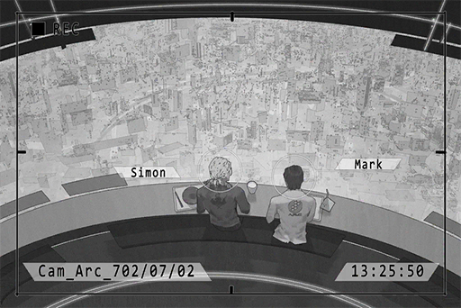

# Cam_Arc_702_07_02
## Requirements
|Character|Level|
|---------|:---:|
|**Xenon**|  4  |

## Unlocked Charts
|      Song      |Character|Diff.|Level|
|----------------|:-------:|:---:|:---:|
|**To the Light**|  Xenon  |Easy |  4  |

## Log Content

**Xenon** 
Hello Mark. Sorry about leaving for such a long time.

**Mark** 
Uh\-huh.

**Xenon** 
I originally planned to inform you about it after the afternoon meeting. Guess it wouldn't hurt if I tell you now. It's about the new case Davis mentioned.

**Mark** 
Uh\-huh.

**Xenon** 
We are helping the admins investigate a criminal group. You might have to find every single log recorded in honeypot in the past year for me. That way it's easier for me to hand it off to the admins.

**Mark** 
I've already sorted out the logs for honeypot in a separate sharing block. You can get it there or I can just send it to you.

**Xenon** 
No, give it to me in a memory cell. Don't send it. There have been too many issues with the internet recently.

**Mark** 
The error rate went up 5.8% after you left. It's one of the main topics we are discussing in the afternoon meeting.

**Xenon** 
I know, sorry about that. 
On an unrelated note, I can't help but think that the way you talk is just so similar to that one iM account...

**Mark** 
Don't use iM. Not sure.

**Xenon** 
Whatever, we'll continue after lunch.

**Mark** 
Ah, Library hired a new advisor during the time you were absent. You better pay attention to the guy.

**Xenon** 
I've heard about it. Is something wrong with him?

**Mark** 
I was the one to set up his working environment. During the setup, he kept asking me to give him access to all sorts of stuff. His attitude is also really odd.  
I don't really know how to describe it; you'll know once you meet him in person.

**Xenon** 
I did some research on his background. He has a very complicated relationship with A.R.C. I'll keep an eye on him.

**Mark** 
Good.

*[Replay Ends]*
