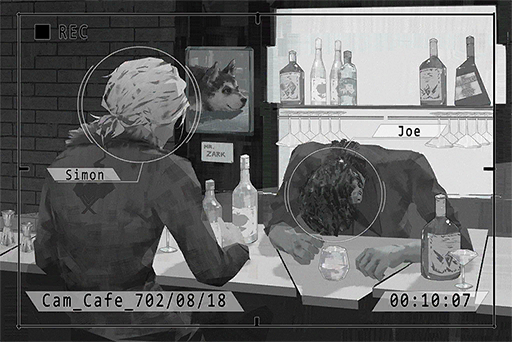

# Cam_Cafe_702_08_18
## Requirements
|Character|Level|
|---------|:---:|
|**Xenon**| 19  |

## Log Content

**JOE** 
... Then! That guy said my hair looks like a sea cucumber! Damnit... ugh...

**Xenon** 
... Why are you crying over that? You're too drunk, stop drinking.

**JOE** 
Damn you little nerd, all that "I don't drink" crap... Turns out you're a bigger drinker than me. Ha! How interesting...

**Xenon** 
I'm at my limit too. Stop pouring drinks.

*\[Knocks over glass\]*

**Xenon** 
Hey, you can't even hold your glass properly. Take a break.

**JOE** 
......

**Xenon** 
......

**JOE** 
Zark... *\*sniff sniff\**...

**Xenon** 
... I miss him as well, but his time is already up. Can't do anything about that.

**JOE** 
...Zark did not die of old age.

**Xenon** 
What?

**JOE** 
Those bastards...*\*sniff sniff\**, sorry...

**Xenon** 
......

**Xenon** 
... I've been investigating a case recently...

**JOE** 
......

**Xenon** 
It's a request from the admins; about a human trafficking organization who operates through the dark web. 

**JOE** 
......

**Xenon** 
... I don't trust the admins, so I did some tracking on my own. I found out that they've been operating in Node 08 for almost a decade now. 

**JOE** 
......

**Xenon** 
Not so long ago, I located several of them doing business in area A of Quadrant II. They are trading information and goods at a place they call "Cafe"...

**JOE** 
......

**Xenon** 
... JOE, if you know anything...

**JOE** 
Ugh...... UGH! BLARGH!

**Xenon** 
Hey are you ok? Jesus! Turn around! Don't throw up on me...

**JOE** 
BLARGH! Cough! Cough cough...

**Xenon** 
... Sigh, whatever. You get some rest. I'll take my leave.

*\[Doorbell\]*

**JOE** 
The devil...

**Xenon** 
... Hmm?

**JOE** 
The devil... will never be satisfied with just one finger. Once you fall into it... there's no... turning back...

**Xenon** 
... Even if that's the case, I will still be on your side.

*\[Doorbell\]*

*[Replay Ends]*