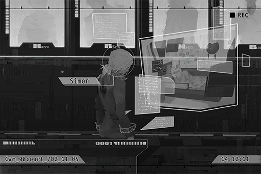

# Cam_08court_702_11_05
## Requirements
|Character|Level|
|---------|:---:|
|**Xenon**| 31  |

## Log Content
**Agent H** 
With things being so serious, looks like there's no way for you people to get off scot\-free this time.

**Leo** 
... And what do you mean by that?

**Agent R** 
This large\-scale internet attack incident has resulted in so many casualties among internet users. On top of that, the key suspect is an employee of yours as well. No matter how cocky you are, the Administration Bureau will definitely hold you guys responsible this time.

**Leo** 
Hoho, that's funny. We're a victim too. The personal actions of that Simon Jackson in no part represent the company's stance. I'm here today to represent the committee and clear our position in this case.

**Agent H** 
Hmph, enough with that BS! From stuff like harboring that Colin guy and not letting him get the deserved punishment too, you people are always doing these random crap that makes no sense! Now, because of your product, many innocent people were harmed. Yet you have the gall to come here and show off your pretentious mug...

**Leo** 
Show\-off? Why would I need to do that? Isn't that obvious? Should I remind you that if not for A.R.C., you fools wouldn't even have a clue about how to use the gun that's hooked to your belts right now?

**Agent H** 
You little...!

**Agent N** 
Raven, Hawk! What are you people doing? It's time to escort the convict, isn't it? Why the f\*\*\* are you here bickering with a witness? Where's Simon Jackson?

**Agent R** 
C, captain!

**Agent H** 
We don't even need to escort him; he just walked straight into the courtroom himself. Ever since we arrested him, he's always had this weird attitude that I can't quite pinpoint. I don't know if he's passive or he's just calm...

**Agent N** 
Is that so? 
Then let's get moving. We've got another mission. Both of you, come with me.

**Agent H** 
Yes, sir!

**Agent N** 
Mr. Leo, apologies for delaying your time. Here, this way, please.

**Leo** 
Hmph...

**A.R.C. Defender** 
Sir.

**Leo** 
I know. To protect A.R.C.'s reputation and property... I'll be relying on you later.

**A.R.C. Defender** 
Understood.

*[→Signal Switch]*

**Judge** 
Starting now, we will be conducting the trial for Simon Jackson, the prime suspect of the "Æsir large\-scale internet attacks". Begin trial.

**[Clerk System]** 
*Trial recording, start.*

**Judge** 
Simon Jackson, after decryption, all connection records for the criminal cases have been found to originate from the many devices you used. Regarding this evidence, is there anything you would like to refute?

**Xenon** 
......

**Judge** 
Do you admit that you're indeed the cybercriminal with the codename "Æsir"?

**Xenon** 
... I don't remember.

**Judge** 
Right in front of you is a lie detector. Providing such ambiguous answers in court will do you no good.

**[Clerk System]** 
*Lie detector reaction: normal. The suspect is not lying.*

**Jury** 
... Judge, his attitude is rather passive. If this keeps going on, it would take us quite some time before we can even come up with a decision. How about we start by summoning the witnesses first?

**Judge** 
Certainly... A.R.C. committee member Leo Smith, are you here to represent the company and declare its position? How will you prove that his incident has nothing to do with the company?

**A.R.C. Defender** 
Yes. From now on, I will be speaking in place of Mr. Smith. After applying and complying with the Administration Bureau for a complete investigation, we discovered that all the equipment linked to the malicious attacks are personal equipment of Simon Jackson, which includes his self\-made A.I. system. None of these items have cleared the screening process of both A.R.C. and the Administration Bureau. Therefore, they count as unregistered systems. Although as of now, there are still no laws to regulate this, it also proves that all his personal actions are not related to the company, nor do they represent the company's stance as a whole. 

**Xenon** 
......

**Judge** 
What about his motivations? We would like to know about the motivation behind his crimes.

**Bureau Investigator** 
After conducting our own investigation, we found out that for the past few years, Simon Jackson has been researching the symptoms of his younger sister Shannon Jackson. Here are his research records.

**Xenon** 
......!

*\[File projection\]*

**Bureau Investigator** 
Shannon Jackson was diagnosed with a disease known as "Virtual\-Internet Related Post\-Traumatic Stress Disorder", better known as VR PTSD. We suspected that this is the reason behind the string of attacks against the systems and memories of virtual internet users. In fact, information has started to surface in the past few days which stated that during the time period where the cyTus system is down, all patients who have the same symptoms appear to have a different reaction compare to their usual panic state.

**Jury** 
I see...

**Bureau Investigator** 
Therefore, we speculated that the wide variety of connection attacks and the capture of user memory were Simon Jackson's experimental attempts to test out this theory. However, during these attempts, his own memories accidentally got affected as well. That's why he is in his current state, where he remembers little to nothing about his previous actions.

**Jury** 
... Makes sense. 
Simon himself has also indicated after the Æsir\-FEST incident that his memory suffered an attack as well.

**Judge** 
Simon Jackson, regarding the aforementioned investigation report, is there anything you would like to present on your behalf?

**Xenon** 
To cure Shannon...?

**Judge** 
Simon Jackson?

**Xenon** 
I... maybe I really am...

**Judge** 
What did you just say?

**Xenon** 
... To be honest, before the evidence ever surfaced, my own investigation has already given me its answer. With such complicated loops, I can't think of anybody else who is capable of coming up with such a design...

**Judge** 
......

**Xenon** 
While researching Shannon's symptoms myself, I have certainly thought about using methods such as attacking the virtual internet as well... Perhaps I unknowingly wrote that idea into the A.I.'s program...

**Judge** 
What are you trying to say?

**Xenon** 
... Maybe... I really am Æsir.

**Judge** 
......!

*[Signal Lost]*
