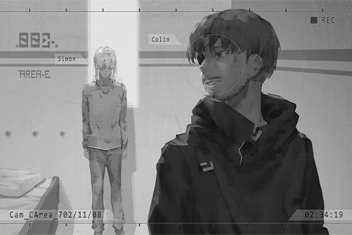

# Cam_CArea_702_11_08
## Requirements
|Character|Level|
|---------|:---:|
|**Xenon**| 32  |

## Log Content
*\[Alarm\]*

**Xenon** 
......

**Agent** 
Trespassers in area C, the underground passages. Send additional agents and drones immediately!

**Xenon** 
......?

*[»»» Fast Forward»»»]*

*\[Door Knock\]*

**Xenon** 
......?

*\[Door Knock\]*

**Xenon** 
......

*\[Door Opens\]*

**ConneR** 
Good evening.

**Xenon** 
!? 
How did you...?

**ConneR** 
I knocked, but nobody answered the door. Therefore, I decided to come in myself. Pardon me for my intrusion.

**Xenon** 
... What the hell are you doing?

*\[Data projection\]*

**ConneR** 
I don't have time to explain all the minute details to you. All in all, take a quick look through these files first.

**Xenon** 
......?

**Xenon** 
......!! 
UGH......!

**ConneR** 
......

**Xenon** 
My investigation with her... These images...

**ConneR** 
Ho, so it actually worked? Excellent, I'm getting more and more interested... in this Æsir fellow.

**Xenon** 
......

**ConneR** 
How are you feeling? Do you remember it now? The reason why you are here.

**Xenon** 
... Why are you helping me?

**ConneR** 
Help you? Young man, you're mistaken. You're the one that's going to help me.

**Xenon** 
What do you mean?

**ConneR** 
My next step is to leave Node 08.

**Xenon** 
You're escaping? You're a criminal right now, you know.

**ConneR** 
Haha, being told you are a criminal by a guy wearing a prison uniform, how amusing. 
I've already obtained all the information I wanted to get with A.R.C. There is no reason for me to remain here anymore.

**Xenon** 
......!

**ConneR** 
In the end, I had to rely on myself. Judging by how terrible you look right now, you don't seem to be of much help either. That makes things a bit... tricky.

**Xenon** 
What exactly are you trying to do?

**ConneR** 
Your memory has already recovered. Here's your mobile device. I'll put it here. Starting now, I will present you with two "choices".  
Choice number one, go to Node 03, meet up with me there. I will tell you many more interesting things, including things about Æsir, A.R.C., and this world itself.

**Xenon** 
!?

**ConneR** 
Choice number two, stay here and wait for the admins to prove your innocence through the proper procedures, or be a sitting duck and await your own demise.

**Xenon** 
......

**ConneR** 
I shall remind you first. 
Once you set foot outside this door, you are, in all sense of the word, "dead". No one in society will ever acknowledge your existence. Your family, friends, life, and dreams will all be reduced to ashes. Nothing will be left.

**Xenon** 
......

**ConneR** 
I still have more important businesses to tend to, So I don't have time to waste on you here. 
Although having your assistance will make things much easier for me, the final decision is all yours to make.

*\[Alarm\]*

**ConneR** 
Ah, right. Seems like we got a signal. Please give me a minute.

**ConneR** 
This is R. Woah, looks like it's quite the spectacle on your side of things.

**[Cherry]** 
*You bastard! How dare you trick me! Where the f\*\*\* am I at right now!?*

**ConneR** 
No need to worry. I've already opened Simon's cell door. However, it seems like he doesn't really want to come out.

**Xenon** 
Sherry!? What are you doing here?

**[Cherry]** 
*……!*

**ConneR** 
As you just saw, your dear friends are literally risking their lives for you. All in all, I will leave the door open for you, the door to end this entire fiasco. The rest is up to you. 
Feels like your dear friends are in a pretty serious pinch. Allow me to take my leave first.

*\[Footsteps\]*

**Xenon** 
......

*[Signal Lost]*
