# Xenon OS Logs
## <a id="toc"/>List of Logs
- [[#001] Audio\_Studio\_702\_06\_24](#xos001)
- [[#002] Cam\_Cafe\_702\_06\_28](#xos002)
- [[#003] Audio\_Arc\_702\_06\_29](#xos003)
- [[#004] Call\_Xenon\_702\_07\_01](#xos004)
- [[#005] Cam\_Arc\_702\_07\_02](#xos005)
- [[#006] Mail\_Xenon\_702\_07\_09](#xos006)
- [[#007] Cam\_Arc\_702\_07\_10](#xos007)
- [[#008] Cam\_Arc\_702\_07\_20](#xos008)
- [[#009] Cam\_Arc\_702\_07\_21](#xos009)
- [[#010] Cam\_Arc\_702\_07\_22](#xos010)
- [[#011] Cam\_Arc\_702\_07\_24](#xos011)
- [[#012] Mail\_Xenon\_702\_07\_26](#xos012)
- [[#013] Audio\_Arc\_702\_07\_28\_01](#xos013)
- [[#014] Audio\_Arc\_702\_07\_28\_02](#xos014)
- [[#015] Mail\_Xenon\_702\_08\_07](#xos015)
- [[#016] Call\_Xenon\_702\_08\_10](#xos016)
- [[#017] Mail\_Xenon\_702\_08\_12](#xos017)
- [[#018] Cam\_Xenon\_702\_08\_15](#xos018)
- [[#019] Mail\_Xenon\_702\_08\_16](#xos019)
- [[#020] Cam\_Cafe\_702\_08\_18](#xos020)
- [[#021] Mail\_Xenon\_702\_08\_20](#xos021)
- [[#022] Cam\_Cafe\_702\_08\_24](#xos022)
- [[#023] Mail\_Xenon\_702\_08\_23](#xos023)
- [[#024] Audio\_Arc\_702\_08\_26](#xos024)
- [[#025] Mail\_Xenon\_702\_08\_30](#xos025)
- [[#026] Cam11\_St07\_702\_09\_26](#xos026)
- [[#027] Audio\_Graveyard\_702\_09\_29](#xos027)
- [[#028] Audio\_Cafe\_702\_09\_30](#xos028)
- [[#029] Audio\_Arc\_702\_10\_18](#xos029)
- [[#030] Audio\_Arc\_702\_10\_30](#xos030)
- [[#031] Cam\_Arc\_702\_11\_01](#xos031)
- [[#032] Cam\_08court\_702\_11\_05](#xos032)
- [[#033] Cam\_CArea\_702\_11\_08](#xos033)
- [[#034] Audio\_CArea\_702\_11\_08\_1](#xos034)
- [[#035] Audio\_CArea\_702\_11\_08\_2](#xos035)
- [[#036] Audio\_Port33\_702\_11\_10\_1](#xos036)
- [[#037] Audio\_Port33\_702\_11\_10\_2](#xos037)
- [[#038] Cam\_Port33\_702\_11\_17](#xos038)
- [[#039] Multi\_File\_X039](#xos039)
- [[#040] Multi\_File\_X040](#xos040)
- [[#041] Multi\_File\_X041](#xos041)
- [[#042] Multi\_File\_X042](#xos042)
- [[#043] Multi\_File\_X043](#xos043)
- [[#044] Multi\_File\_X044](#xos044)
- [[#045] Multi\_File\_X045](#xos045)

## <a id="xos001"/>[#001] Audio\_Studio\_702\_06\_24
### Log Content
*\[Guitar Riff\]*

**Xenon** 
What do you think of this intro?

**NEKO#ΦωΦ** 
OHH! Sounds very cool!

**NEKO#ΦωΦ** 
Then I will do it like this!

*\[Synthesizer\]*

**Xenon** 
Not bad, but why does it feel so... random?

**NEKO#ΦωΦ** 
NEKO will patch it up when I get back!

*\[Eat Snacks\]*

**Xenon** 
Hey, I thought I told you not to eat snacks in here? Take it outside.

**NEKO#ΦωΦ** 
NO! It's too stuffy outside!

**Xenon** 
I've turned on the AC, go outside.

*\[Door Opens\]*

**NEKO#ΦωΦ** 
Hey! Let's go to Under Velvet to see a performance! There's a pretty awesome band today!

**Xenon** 
No, go by yourself.

**NEKO#ΦωΦ** 
Eh?

**Xenon** 
I'm returning to A.R.C. in a few days. I want to finish this song while I can still use this workshop.

**NEKO#ΦωΦ** 
EHHHHHH!? You're going back to the skies!?

**Xenon** 
I've finished my support to the surface unit. I want to get back there as soon as possible.

**NEKO#ΦωΦ** 
NEKO really likes here though. The equipment is better then what I have back home too. How about you give NEKO the key after you go back?

**Xenon** 
In your dreams. You done eating? Let's finish up the remaining parts.

**NEKO#ΦωΦ** 
OKayyyy\~

*\[Eat Snacks\]*

*\[Replay Ends\]*

[*(Click here to go back to the top)*](#toc)

## <a id="xos002"/>[#002] Cam\_Cafe\_702\_06\_28
### Log Content
*\[Doorbell\]*

**JOE** 
Oh! Simon! You're here.

**Xenon** 
The usual stuff.

**JOE** 
Got it, one bottle of milk. But seriously, when are you going to start drinking some booze? You're already 26.

**Xenon** 
Age is not the issue.

**JOE** 
Don't you have to socialize with your bosses up there? I mean that's a thing right?

**Xenon** 
My manager and my colleagues are all a bunch of geeks. We have almost no interaction outside of work.

**JOE** 
Jasus! Don't you get bored? I'll probably be bored to death under those circumstances!

**Xenon** 
I like my job quite a bit, so it's no big deal.

**Xenon** 
But now that I think about it, I really only chat with other people when I'm here.

**JOE** 
I call BS! I know for a fact that recently you're very close to a particular streamer girl!

**Xenon** 
... She is 6 years younger than me. She's just a little sister to me.

**JOE** 
Age is not the issue.

**Xenon** 
... Shut up.

**JOE** 
Bwahaha! What's the matter? I can give you hand if you really want me to!

**Xenon** 
I will never be in a romantic relationship again. You of all people should know that, right? Let's change the topic.

**JOE** 
Haha! Okay, okay. By the way, are you going back to A.R.C. tomorrow?

**Xenon** 
Yes, finally. Those worthless ITs at the Administration Bureau are driving me nuts.

**JOE** 
Hahaha! Good work my man! As a celebration, shouldn't you break the mold and try some alcohol?

*\[Makes Cocktail\]*

**Xenon** 
... What is this?

**JOE** 
Stairway to Heaven. Cheers!

**Xenon** 
... Alright.

*\[Cheers\]*

**Xenon** 
... Tastes terrible.

*\[Replay Ends\]*

[*(Click here to go back to the top)*](#toc)

## <a id="xos003"/>[#003] Audio\_Arc\_702\_06\_29
### Requirements
|Character|Level|
|---------|:---:|
|**Xenon**|  2  |

### Log Content
**[Broadcast]** 
ID number 7128, Simon Jackson, please come to Block D. 
ID number 7128, Simon Jackson, please come to Block D.

**Davis** 
Come in.

*\[Door Opens\]*

**Xenon** 
I'm back.

**Davis** 
Finally free aren't you? Must be pretty tough down there right?

**Xenon** 
...Nightmare\-ishly tough.

**Davis** 
Can't help it, since all the top IT talents in Node are here at A.R.C. I feel bad for you, since this is not something you should be dealing with.

**Xenon** 
It's fine. I was the one who requested to be transferred down there in the first place. Though I didn't think it would be THAT bad.

**Davis** 
I know you just came back and may want some rest, but there's already a case waiting for you. So sorry about that. It's a request from the admins.

**Xenon** 
What? How come I've never heard about it?

**Davis** 
Originally, they planned to do it themselves, but their skills are just not good enough. So they came and asked for our help, specifically yours.

**Xenon** 
Specifically mine? Is it something that serious?

**Davis** 
Here's the report, take a look. It's a human trafficking group that operates around Node 03. Their "products" include all kinds of things: human test subjects, slaves, drugs..etc.They mainly do their business through cyTus. Only until recently when they expanded their market to Node 08 did the admins finally catch onto them. The admins tried pretty much every single method, but they never crack the code. Never seen a firewall like this.

**Xenon** 
... Certainly a very unusual encryption, interesting. 
However, judging from the report, I can already tell you that they didn't try every single method.

**Davis** 
Oh? you already have an idea? I expect no less from you.

**Xenon** 
For example, take a look here. When I set up this port, I added a honeypot here just for criminals like this. Those who attempted to break in through this port will think they've broken through cleanly, when in fact their actions have already been recorded. 
If they notice this, it shouldn't be hard for them to track down the signal's source.

**Davis** 
Ohhhh... so there is a design like this? Fantastic.

**Xenon** 
... Did you guys not read the reports I turn in?

**Davis** 
Eh? O, of course we did. It's just that it was a while ago... Ahem, if so, how long does it take to have some progress?

**Xenon** 
I'm sorry, but I need to meet with Mark and the other guys first to figure out the progress they had in the past few months.  
Hmmm... I should be able to track down the first signal source in about a week. Would that be ok?

**Davis** 
A week!? Of course. Do you know that the admins have been chasing this group for almost a year now?

**Xenon** 
... Let us handle the internet stuff from now on.

**Davis** 
I'll leave this case to you!

**Xenon** 
Ok. I'll go back to work.

*\[Replay Ends\]*

[*(Click here to go back to the top)*](#toc)

## <a id="xos004"/>[#004] Call\_Xenon\_702\_07\_01
### Requirements
|Character|Level|
|---------|:---:|
|**Xenon**|  3  |

### Log Content
**JOE** 
Hey, it's me. Do you have a minute?

**Xenon** 
What's up? I'm still at work.

**JOE** 
Ah, I'm so sorry, but just one quick question.

**Xenon** 
Go ahead.

**JOE** 
Last year's Æsir\-FEST, you were there right?

**Xenon** 
Not in the venue. I was connected to the background system monitoring the data flow and the security records. Did something happen?

**JOE** 
Nah, it's just that several customers are on the verge of a brawl after an argument about Æsir\-FEST...

**Customer A** 
I said PAFF was on stage, the only guy who's not there is Æsir! There is no way a dedicated pro like PAFF would pull a No\-Show!

**Customer B** 
Oh really? Then tell me what songs she sang on stage? I don't remember a single one!

**Customer C** 
Gravity! She sang Gravity!

**Customer D** 
Robo\_head is the best!!

**JOE** 
... Something like that. I wasn't at the event, so I have no idea what they are talking about. 

**Xenon** 
.... If you ask me, I say it's gibberish spewed out by a bunch of drunkards. Don't call me for such pointless things. 

**JOE** 
Come on, don't be so cold. To be honest I'm quite curious about this event and I think you're a better source than these people. 

**Xenon** 
All I really remember that day is that there's a blackout in the venue, which resulted in Æsir not taking the stage and the venue going into complete chaos. Nothing else.

**JOE** 
It seems that the thing they are arguing about is whether or not the opening performances actually happened.

**Xenon** 
You mean ROBO and PAFF? I can't remember it too clearly, but I believe they did finish their performance as planned. 

**JOE** 
You guys heard it. Testimony from a staff member. Now stop arguing.

**Customer B** 
What!? Are you saying that cats are better than dogs!? I shall teach you a lesson!

*\[Bottles shatter\]*

**JOE** 
Ahhhhh... it seems that they have moved on to other topics. 
Hey! No fighting in the shop! Take it outside!

**Xenon** 
...I'm hanging up.

*\[Call Ends\]*

[*(Click here to go back to the top)*](#toc)

## <a id="xos005"/>[#005] Cam\_Arc\_702\_07\_02
### Requirements
|Character|Level|
|---------|:---:|
|**Xenon**|  4  |

### Log Content
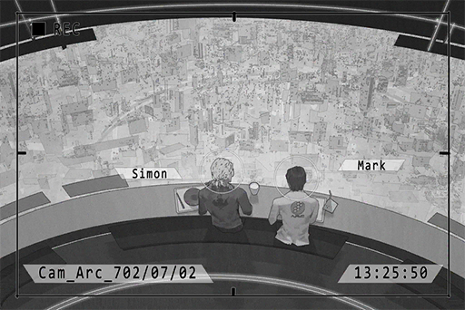

**Xenon** 
Hello Mark. Sorry about leaving for such a long time.

**Mark** 
Uh\-huh.

**Xenon** 
I originally planned to inform you about it after the afternoon meeting. Guess it wouldn't hurt if I tell you now. It's about the new case Davis mentioned.

**Mark** 
Uh\-huh.

**Xenon** 
We are helping the admins investigate a criminal group. You might have to find every single log recorded in honeypot in the past year for me. That way it's easier for me to hand it off to the admins.

**Mark** 
I've already sorted out the logs for honeypot in a separate sharing block. You can get it there or I can just send it to you.

**Xenon** 
No, give it to me in a memory cell. Don't send it. There have been too many issues with the internet recently.

**Mark** 
The error rate went up 5.8% after you left. It's one of the main topics we are discussing in the afternoon meeting.

**Xenon** 
I know, sorry about that. 
On an unrelated note, I can't help but think that the way you talk is just so similar to that one iM account...

**Mark** 
Don't use iM. Not sure.

**Xenon** 
Whatever, we'll continue after lunch.

**Mark** 
Ah, Library hired a new advisor during the time you were absent. You better pay attention to the guy.

**Xenon** 
I've heard about it. Is something wrong with him?

**Mark** 
I was the one to set up his working environment. During the setup, he kept asking me to give him access to all sorts of stuff. His attitude is also really odd.  
I don't really know how to describe it; you'll know once you meet him in person.

**Xenon** 
I did some research on his background. He has a very complicated relationship with A.R.C. I'll keep an eye on him.

**Mark** 
Good.

*\[Replay Ends\]*

[*(Click here to go back to the top)*](#toc)

## <a id="xos006"/>[#006] Mail\_Xenon\_702\_07\_09
### Requirements
|Character|Level|
|---------|:---:|
|**Xenon**|  5  |

### Log Content
**Subj.**: Investigation of initiation error records 
**From**: Anonymous 
**To**: Simon Jackson
___

Security Level: Highest Level. SDP protocol activated. 
Access Permission: Private Key required. 
Source Location: \[Locked\]\[Dynamic Proxy Server activated\]

Report 
========== 
\- Compared cyTus's server data from past 35 years. Found records of multiple initiation errors. 
\- No particular pattern in the initiation errors. System can detect and fix errors on its own. 
\- Judging from the excerpted log files, errors are from within the system. Since A.R.C. keeps the completed log files in a closed network, has no physical access to it right now.

Future actions: Continue to track initiation errors. 
========== 
Report Ends

\*This document has the SDP Protocol activated. Attempting to input the incorrect private key will result in the deletion of this document and all copies.

[*(Click here to go back to the top)*](#toc)

## <a id="xos007"/>[#007] Cam\_Arc\_702\_07\_10
### Requirements
|Character|Level|
|---------|:---:|
|**Xenon**|  6  |

### Log Content

**Xenon** 
Having lunch now?

**Mark** 
Uh\-huh.

**Xenon** 
All the non\-human errors have been fixed. When you finish eating, take this report to Davis.

**Mark** 
Uh\-huh.

**Xenon** 
......

**Mark** 
......

**Xenon** 
Ah, there's another thing. Last night I received this mail in my personal inbox. Did you send it?

**Mark** 
... I don't have a reason to send you a report anonymously.

**Xenon** 
Since it's a record of cyTus errors, I thought it was some extra info you found.

**Mark** 
The format of this report is exactly the same as the one you wrote for the security loops. Is this a memo for yourself?

**Xenon** 
No, it's not. I don't remember writing anything like this. I've asked other members as well; none of them wrote it.

**Mark** 
Only someone within A.R.C. can write a report like this. If it's from outside the A.R.C., things can get interesting.

**Xenon** 
... I don't think that's possible. Regardless, I'll try and track down the IP address of the signal. If it's from a public area, I might have to tell Davis about this.

**Mark** 
Uh\-huh. Tracking is not exactly my specialty, so I can't help. 
But I'm curious about the results. If you got something, tell me.

**Xenon** 
It's quite rare that you are interested in something other than your work.

**Mark** 
You're the person that almost singlehandedly created the cyTus internet security system; the very reason that the security is at its current strength. If there exists someone besides me that can crack the firewall program you wrote, I would be very interested.

**Xenon** 
Don't be full of yourself. You weren't even close to cracking it last time.

**Mark** 
... OK.

*\[Replay Ends\]*

[*(Click here to go back to the top)*](#toc)

## <a id="xos008"/>[#008] Cam\_Arc\_702\_07\_20
### Requirements
|Character|Level|
|---------|:---:|
|**Xenon**|  7  |

### Log Content
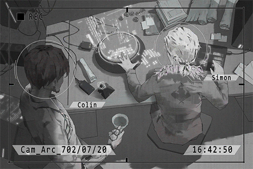

**ConneR** 
Greetings. I believe this is our first meeting. I'm Colin Neumann Jr.

**Xenon** 
I'm Simon from the IT department. We received a report that there is a problem with your system.

**ConneR** 
Master Simon, pleased to meet you. The system kept overheating when I'm trying to process this piece of data. I would be quite troubled if this issue can't be solved.

**Xenon** 
Understood. Let me take a look; this may take a while.

**ConneR** 
Of course.

**Xenon** 
......

**ConneR** 
......

**ConneR** 
By the way, can you give me access to cyTus's virtual connection security reports? I heard that you were the person who established the majority of the security protocols?

**Xenon** 
...I can't give you access to anything without the higher\-ups agreeing to it first.

**ConneR** 
Is that so? What a pity. My job would be much easier if I have those documents.

**Xenon** 
... Your job should have nothing to do with those documents, right?

**ConneR** 
" Assist Library in the research and development of technology from ancient cultures" that's my job description. I believe there is no conflict between my job and me having those documents.

**Xenon** 
... I have improved the algorithms for you. The overheating should not occur anymore.

**ConneR** 
Ahh, it is running fine now. My sincerest gratitude.

**Xenon** 
Also, the amount of data you are processing is way too much. The estimated data flow for every project will be sent to our department. You're a non\-regular employee; best you not do anything that is not related to the company.

**ConneR** 
You are very sharp indeed, but don't worry. All my actions are part of A.R.C.'s requirements.

**Xenon** 
I hope so. If there aren't any more problems, I will leave now.

**ConneR** 
Of course. It's a great pleasure meeting you.

*\[Replay Ends\]*

[*(Click here to go back to the top)*](#toc)

## <a id="xos009"/>[#009] Cam\_Arc\_702\_07\_21
### Requirements
|Character|Level|
|---------|:---:|
|**Xenon**|  8  |

### Log Content
**Davis** 
What's up? Is there something you want from me?

**Xenon** 
There's something I want to know. If you know anything, you have to tell me.

**Davis** 
Go ahead.

**Xenon** 
I did a little research on the new advisor, Colin. He used to be one of the top wanted people for both A.R.C. and the admins, right? His criminal records are quite significant too.

**Davis** 
Hmmm...not a big secret. There's plenty of news on this stuff.

**Xenon** 
Then why is A.R.C. working together with someone like this?

**Davis** 
In terms of academic credibility, Colin is at the very top. His father used to be an elite A.R.C. explorer too. They contributed quite a lot to technology development for the past few years. In some ways, they're on the same side with us.  
If A.R.C. is the leading chariot in modern technology, he is like a wild horse doing whatever he desires. The best solution for this is to have him under our control while we provide him with what he needs. That way it's mutually beneficial.

**Xenon** 
For someone who refused to work with us all these years, isn't it suspicious that he willingly joined us all of a sudden?

**Davis** 
"Willingly"' is not the word I would use. From what I've heard, Sagar was the one who persuaded him by offering him a deal: he assists us in research. In return, we'll erase his criminal records.

**Xenon** 
... I can never get why people would try such risky actions.

**Davis** 
Just like you said, he's a pain in the neck. However, to A.R.C., his talent and knowledge are indispensable resources. This is already the best\-case scenario for us.

**Xenon** 
Do the admins know about this?

**Davis** 
Yes. The people who know this are the admins, management and then you. If other employees or even worse, civilians get hold of this information, it might create commotion and panic. So I would like you to keep this a secret. 

**Xenon** 
... Understood. However, I would like to monitor Colin's system and internet personally. I don't think he is someone that can be kept down so easily.

**Davis** 
Hmm not a bad idea. Let's go with it. I can rest assured even more if you're around.

**Xenon** 
If there's anything fishy, we'll immediately report it to the admins.

*\[Replay Ends\]*

[*(Click here to go back to the top)*](#toc)

## <a id="xos010"/>[#010] Cam\_Arc\_702\_07\_22
### Requirements
|Character|Level|
|---------|:---:|
|**Xenon**|  9  |

### Log Content

**Xenon** 
I tracked down the IP address of the anonymous mail I received a while ago.

**Mark** 
Hmm?

**Xenon** 
The address is within A.R.C.

**Mark** 
So who is it?

**Xenon** 
No matter how hard I try I can only get the IP address. Haven't run into an encryption this tough in a long time.

**Mark** 
Does our company really have someone like that?

**Xenon** 
Can't say it's impossible. People that come to work at A.R.C. are all extremely skilled. 

**Mark** 
So this guy chose to hide his abilities, yet writes a letter like this to challenge you?

**Xenon** 
The only possible candidate I can think of right now is the new advisor. I met him a few days ago.

**Mark** 
Oh. How was it?

**Xenon** 
He's a complete a\-hole. However, I might have to admit that he indeed has something special, or else the company would not give a non\-regular employee access to so many things. 

**Mark** 
He still thinks it's not enough though.

**Xenon** 
Regardless I will keep a keen eye on him. He is not someone you should overlook.

**Mark** 
OK.

*\[Replay Ends\]*

[*(Click here to go back to the top)*](#toc)

## <a id="xos011"/>[#011] Cam\_Arc\_702\_07\_24
### Requirements
|Character|Level|
|---------|:---:|
|**Xenon**| 10  |

### Log Content
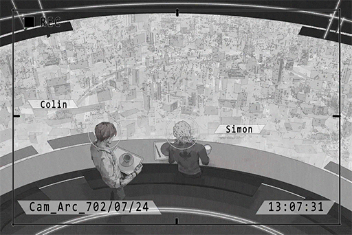

**ConneR** 
Good afternoon sir. May I sit here?

**Xenon** 
... What do you want?

**ConneR** 
Don't be so hostile. This is a pretty nice place to have lunch, never realize that before.

**Xenon** 
I'm on my break now. If there's a problem, file a work request.

**ConneR** 
*\*Chuckles\** Don't worry I'm not asking you to work. Just want to chat with you a little. May I, Mr. Xenon?

**Xenon** 
...Don't call me that at work.

**ConneR** 
Apologies, but you aren't exactly keeping a low profile. I've had the pleasure of listening to your album.

**Xenon** 
Oh.

**ConneR** 
It's quite interesting. In terms of composing, there's plenty of digital mixing and post\-production edits. However, when it comes to the all\-important strings, you didn't abandon the traditional method of physical resonance. I admire that.

**Xenon** 
If the strings became digital as well, the guitar would have no life. It certainly wouldn't sound good.

**ConneR** 
Ohhh, not what I expect to hear from someone who works in such a lifeless environment. Lives among technology and machines every day, yet your music is still full of emotion. It seems that on this front, we have a consensus.

**Xenon** 
Don't speak like you know me so well...

**ConneR** 
*\*Chuckles\**  Maybe I know you a lot better than you think. 
Technology is the torch that lights the road for humans and we are the ones holding it. Our every action directly affects the future of the human race.

**Xenon** 
That only applies to you right? I'm not that great.

**ConneR** 
Don't underestimate yourself. It's a complete tragedy for a talent like you to be at the bottom. I look forward to the day you make your leap to the top. 

**Xenon** 
... Thanks for the compliment.

**ConneR** 
This is my album. If you don't mind, give it a try and tell me what you think about it.

**Xenon** 
If I'm in the right mood.

**ConneR** 
*\*Chuckles\** quite indifferent are you. Then I shall take my leave. Enjoy your break, Mr. Xenon.

**Xenon** 
I would appreciate that.

*\[Replay Ends\]*

[*(Click here to go back to the top)*](#toc)

## <a id="xos012"/>[#012] Mail\_Xenon\_702\_07\_26
### Requirements
|Character|Level|
|---------|:---:|
|**Xenon**| 11  |

### Log Content
**Subj.**: Investigation of abnormal data flow and electrical overload 
**From**: Anonymous 
**To**: Simon Jackson
___

Security Level: Highest Level. SDP protocol activated. 
Access Permission: Private Key required. 
Source Location: \[Locked\]\[Dynamic Proxy Server activated\]

Report 
========== 
\- About the mega\-scale connection error that occurred on January 18th, 702 N.A. 
\- About the electrical load overcharge in the Node 08, Quadrant I area that occurred on January 18th, 702 N.A.

Initial Judgement: internet terrorist attack 
Source: unknown, reverse tracking activated. 
Impact: Approximately 1,366,554 connection locations were intruded. Yet to clarify actual damage caused. 
Reasonable to assume that electrical overload is related to the attack. Suspect may be using parrallel mega servers as instrument of crime. 
========== 
Report Ends

\*This document has the SDP Protocol activated. Attempting to input the incorrect private key will result in the deletion of this document and all copies.

[*(Click here to go back to the top)*](#toc)

## <a id="xos013"/>[#013] Audio\_Arc\_702\_07\_28\_01
### Requirements
|Character|Level|
|---------|:---:|
|**Xenon**| 12  |

### Log Content
**Davis** 
Next, we'll talk about the cases where music\-related connections cause users to experience physical discomfort. Simon, you're in charge of this.

**Xenon** 
Yes. Data shows that in addition to yesterday's incident, reports of physical discomfort during virtual connection have increased significantly. The increase started around half a year ago, after the event known as Æsir\-FEST. Symptoms include headaches, dizziness and nausea. A.R.C.'s medical department has not yet identified the reason for these symptoms.

**Davis** 
We need to talk about this. Public pressure is now at a breaking point after yesterday's incident. The higher\-ups are starting to panic. We have made an announcement to advise users to use traditional connection instead of the ID chips. However, that's only a temporary solution; we need to find the real reason behind all this as soon as possible.

**Xenon** 
Right now, I've eliminated the possibilities of hacker and internet virus. The reason is that during those incidents, we did not detect any abnormal active connections 

**Mark** 
Then is it because of the user's personal health conditions?

**Davis** 
If it's personal health, the circumstances where the symptoms appear should be a lot simpler. 

**Xenon** 
Now here's the key point. Remember the Æsir\-FEST I just mentioned? In a bizarre coincidence, it turns out that every single person who displayed the symptoms was a participant of Æsir\-FEST. 

**Davis** 
I recall that you were the one monitoring that event, right? Did you sense anything abnormal back then?

**Xenon** 
There was a sudden blackout, but I don't remember any error messages about the internet. Also, Æsir didn't show up for that event and has been missing since then. I find that very suspicious. If that event really is the beginning of everything, I think we should ask the admins to search for this person.

**Mark** 
Æsir only does things through the internet. There's no way the admins can do anything about him.

**Xenon** 
Then I'll do it myself. It shouldn't be that hard to locate where his activity records originate from.  

**Davis** 
Without authorization from the admins, you can't do anything to the guy even if you locate him. 

**Xenon** 
They had us handle internet security. Shouldn't they give us a certain degree of power to maintain that?

**Davis** 
About that, it has been a complete stalemate between the admins and me. I know their attitude on this too well.

**Xenon** 
So what? We just sit here, wait for more victims to appear and let the company's reputation go completely down the drain?

**Davis** 
Calm down. Right now we are not 100% sure that Æsir has anything to do with this. However, the direction you pointed to is very believable. I'll talk with the admins to see if we can get something. You should investigate more on this guy first. 

**Xenon** 
... Understood.

**Davis** 
Then we move on to the next topic: overall security.

*\[Replay Ends\]*

[*(Click here to go back to the top)*](#toc)

## <a id="xos014"/>[#014] Audio\_Arc\_702\_07\_28\_02
### Requirements
|Character|Level|
|---------|:---:|
|**Xenon**| 13  |

### Log Content
**Xenon** 
Here's this month's working report. 

**Davis** 
Good job. If there's nothing else to report, the meeting is dismissed. Mark, remember to send me last month's contact records.

**Mark** 
Uh\-huh.

**Xenon** 
Davis, can we talk in private for a moment?

**Davis** 
What's up?

**Xenon** 
About the admins' case, I did some tracking on my own afterward. I discovered that the crime group's activity records are completely different than what the admins' told us in the report. 

**Davis** 
... How so?

**Xenon** 
The report says it was a year ago when they start operating in Node 08. However, I found out that this organization has been using the dark web to do business across the whole world for nearly a decade. 
There is no way the admins don't know this. I am quite certain that they are hiding something from us. 

**Davis** 
Is that so...? Frankly, I've been doubtful with the admins' careless attitude when it comes to internet crime for a while now. However, that's not part of our responsibility. I would advise you to not dive too far into this, or trouble might get to you.

**Xenon** 
All this PC crap again, just like the incident we just talked about in the meeting. The admins never set up any rules when it comes to internet crimes. In times like this, shouldn't we be doing something?

**Davis** 
I know you have a strong sense of justice. Your father was part of the law enforcement too. But, if you don't do things by the rules, I get joint responsibility as well.

**Xenon** 
This has nothing to do with my father! Do you think that your own well\-being is more important than the public's safety!?

**Davis** 
......

**Davis** 
Simon, I might be retiring next year.

**Xenon** 
...So?

**Davis** 
When that time comes, the person that will be sitting in my seat will definitely be you. A.R.C. is very powerful here in Node 08, but not to the point of overshadowing law and order. 
There's plenty of nonsense happening within and outside the company. I hope you can be the one to guide the world back to its righteous path.

**Xenon** 
... What can a mere IT department head do?

**Davis** 
With your talent level and contribution to the company, it's very unlikely that you'll stop here. Aim for a higher place Simon. To be honest, that's the entire department's expectation of you. 

**Xenon** 
... Stop talking like you know who I am. I'll deal with this case in my own way.

*\[Replay Ends\]*

[*(Click here to go back to the top)*](#toc)

## <a id="xos015"/>[#015] Mail\_Xenon\_702\_08\_07
### Requirements
|Character|Level|
|---------|:---:|
|**Xenon**| 14  |

### Log Content
**Subj.**: Your request has being denied due to violation of protocol 
**From**: Anonymous 
**To**: Simon Jackson
___

Security Level: Highest Level. SDP protocol activated. 
Access Permission: Private Key required. 
Source Location: \[Locked\]\[Dynamic Proxy Server activated\]

Report 
========== 
Received a verification request from 
address: \[2600:1901:0:f599::\] 
Connection mode: Normal; Security level: medium

Replied result: Denied 
Reason: According to NDA rules number 1\-7\-22 and 11\-9\-22, if connection environment has the possibility of revealing the true identity of both parties, or if the target has not fulfilled the condition to unlock the security protocol, requested party may not reveal its identity. 
========== 
Report Ends

\*This document has the SDP Protocol activated. Attempting to input the incorrect private key will result in the deletion of this document and all copies.

[*(Click here to go back to the top)*](#toc)

## <a id="xos016"/>[#016] Call\_Xenon\_702\_08\_10
### Requirements
|Character|Level|
|---------|:---:|
|**Xenon**| 15  |

### Log Content
**Xenon** 
Hello.

**NEKO#ΦωΦ** 
Hi HI! I'm NEKO!

**Xenon** 
I saw your name on the call. What's up?

**NEKO#ΦωΦ** 
My internet became weird all of a sudden. Do something about it!

**Xenon** 
... Call customer service.

**NEKO#ΦωΦ** 
NO! Last time I called them their attitude was terrible!

**Xenon** 
You're the one to blame for the issue last time... wait, did you just say your internet became weird? Are you using the ID chip to access the internet?

**NEKO#ΦωΦ** 
I'm using the PC. The connection speed just suddenly dropped.

**Xenon** 
Good. If possible, stay away from using ID chips to access the internet. For now at least. 

**NEKO#ΦωΦ** 
Eh? Why?

**Xenon** 
Did you forget about the PAFF Incident? Most of the victims accessed the event through ID chips. 

**NEKO#ΦωΦ** 
EHH!? So that's really a thing? I always thought it was just fake news!

**Xenon** 
Fake news my ass. Right now the entire department is investigating this. All in all, stay away from the internet for a while. 

**NEKO#ΦωΦ** 
Negative! NEKO will die if she can't use the internet!

**Xenon** 
Then at least switch to traditional connection.

**NEKO#ΦωΦ** 
Hmmmm\~? Are you worried about NEKO?

**Xenon** 
...It's normal for an A.R.C. employee to worry about the user's safety.

**NEKO#ΦωΦ** 
Haha, you're blushing!

**Xenon** 
... I'm hanging up.

**NEKO#ΦωΦ** 
EHH! You still haven't fixed my connection speed problem!

**Xenon** 
Call customer service.

*\[Call Ends\]*

[*(Click here to go back to the top)*](#toc)

## <a id="xos017"/>[#017] Mail\_Xenon\_702\_08\_12
### Requirements
|Character|Level|
|---------|:---:|
|**Xenon**| 16  |

### Log Content
**Subj.**: Black Hole Track Log 
**From**: ROBO_Head 
**To**: Xenon
___

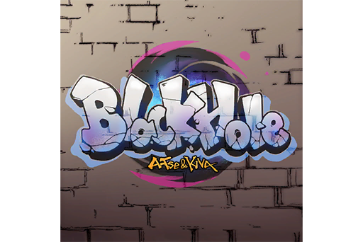

{4D5B06E1\-73D8\-4FE6\-A605\-54A4A8B2CA66}……100% 
{769BE4CF\-5C2C\-4BBD\-9211\-8FAD08802B1E}……100% 
{C87FB2B3\-A90F\-417F\-85E8\-0A3F9126BB2F}……100% 
{75793A34\-5CC0\-4D44\-AA9C\-0B39F721BE1D}……100% 
{51EA2839\-5043\-41DF\-BBA2\-AFA6D4114641}……100% 
Sound\_701\_08\_12\_17\_45\_08\_213……100% 
Sound\_701\_08\_12\_18\_36\_46\_764……100%

[*(Click here to go back to the top)*](#toc)

## <a id="xos018"/>[#018] Cam\_Xenon\_702\_08\_15
### Requirements
|Character|Level|
|---------|:---:|
|**Xenon**| 17  |

### Log Content
*\[Spray Paint\]*

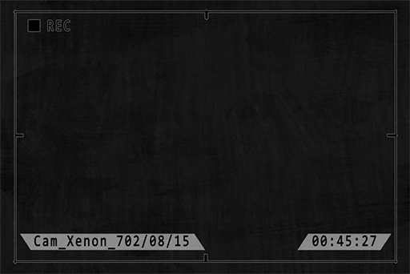

**Man A** 
Hey, you done? Get on it.

**Man B** 
Are you stupid? How are we gonna do s\*\*\* with the security cameras uncovered?

**Man C** 
It's pointless anyway. That's the type that can record sounds.

**Man A** 
Whatever, nobody's gonna pay attention to a security camera in this damn place. Find the cargo first.

**Man C** 
Are you sure it's here?

**Man B** 
Yeah, Boss said that they put the cargo down here.

**Man A** 
Hey! Over here. Behind this thing, help me move it.

*\[Container Moves\]*

**Man C** 
Ok, let's go.

**Man B** 
Idiot! Check if the numbers are correct. If the buyer finds any problems when he picks it up at Cafe, we'll be erased in a snap.

**Man A** 
If that happens we'll just blame it on the Cafe's owner. We did it last time; it'll be fine.

**Man C** 
Hahaha! Man you're evil.

**Man A** 
Do I look like a nice guy? Stop yapping and start counting!

**Man C** 
13,14,15... 15 of them alright.

**Man A** 
Just what kind of device are these? I've never seen them before.

**Man C** 
Yeah seriously. I mean why can't the guy just use Black Coins? Man it's a pain in the ass.

**Man A** 
A while ago, some dude bought humans from us with humans. We had to conduct a full physical check up to see if the goods are injured or not. Don't want to do that ever again. 

**Man B** 
Stop babbling; there are cameras around here. If everything's ok, take it to Cafe. I'll call Boss.

*\[Signal Lost\]*

[*(Click here to go back to the top)*](#toc)

## <a id="xos019"/>[#019] Mail\_Xenon\_702\_08\_16
### Requirements
|Character|Level|
|---------|:---:|
|**Xenon**| 18  |

### Log Content
**Subj.**: Photos and Mixing 
**From**: Shao 
**To**: Xenon
___

Hello, here are the photos from yesterday's performance. 

The mixing is finished as well. The virtual sound field's recording quality is pretty good. Give it a try XD

\[Other Attachments\]

[*(Click here to go back to the top)*](#toc)

## <a id="xos020"/>[#020] Cam\_Cafe\_702\_08\_18
### Requirements
|Character|Level|
|---------|:---:|
|**Xenon**| 19  |

### Log Content
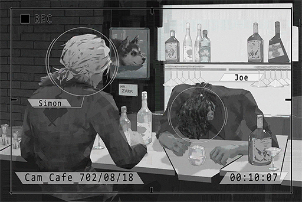

**JOE** 
... Then! That guy said my hair looks like a sea cucumber! Damnit... ugh...

**Xenon** 
... Why are you crying over that? You're too drunk, stop drinking.

**JOE** 
Damn you little nerd, all that "I don't drink" crap... Turns out you're a bigger drinker than me. Ha! How interesting...

**Xenon** 
I'm at my limit too. Stop pouring drinks.

*\[Knocks over glass\]*

**Xenon** 
Hey, you can't even hold your glass properly. Take a break.

**JOE** 
......

**Xenon** 
......

**JOE** 
Zark... *\*sniff sniff\**...

**Xenon** 
... I miss him as well, but his time is already up. Can't do anything about that.

**JOE** 
...Zark did not die of old age.

**Xenon** 
What?

**JOE** 
Those bastards...*\*sniff sniff\**, sorry...

**Xenon** 
......

**Xenon** 
... I've been investigating a case recently...

**JOE** 
......

**Xenon** 
It's a request from the admins; about a human trafficking organization who operates through the dark web. 

**JOE** 
......

**Xenon** 
... I don't trust the admins, so I did some tracking on my own. I found out that they've been operating in Node 08 for almost a decade now. 

**JOE** 
......

**Xenon** 
Not so long ago, I located several of them doing business in area A of Quadrant II. They are trading information and goods at a place they call "Cafe"...

**JOE** 
......

**Xenon** 
... JOE, if you know anything...

**JOE** 
Ugh...... UGH! BLARGH!

**Xenon** 
Hey are you ok? Jesus! Turn around! Don't throw up on me...

**JOE** 
BLARGH! Cough! Cough cough...

**Xenon** 
... Sigh, whatever. You get some rest. I'll take my leave.

*\[Doorbell\]*

**JOE** 
The devil...

**Xenon** 
... Hmm?

**JOE** 
The devil... will never be satisfied with just one finger. Once you fall into it... there's no... turning back...

**Xenon** 
... Even if that's the case, I will still be on your side.

*\[Doorbell\]*

*\[Replay Ends\]*

[*(Click here to go back to the top)*](#toc)

## <a id="xos021"/>[#021] Mail\_Xenon\_702\_08\_20
### Requirements
|Character|Level|
|---------|:---:|
|**Xenon**| 20  |

### Log Content
**Subj.**: Report on reverse tracking of target's connecting location 
**From**: Anonymous 
**To**: Simon Jackson
___

Security Level: Highest Level. SDP protocol activated. 
Access Permission: Private Key required. 
Source Location: \[Locked\]\[Dynamic Proxy Server activated\]

Report 
========== 
Reverse tracking results. 
List of suspected attackers and their most common connection locations: 
\[4620:100:6859::d2a4\] 
\[4620:100:8c::c6:d6bb\] 
\[4620:b00:e7cf::2377\] 
\[4620:b00:898a::f00f\] 
========== 
Report Ends

\*This document has the SDP Protocol activated. Attempting to input the incorrect private key will result in the deletion of this document and all copies.

[*(Click here to go back to the top)*](#toc)

## <a id="xos022"/>[#022] Cam\_Cafe\_702\_08\_24
### Requirements
|Character|Level|
|---------|:---:|
|**Xenon**| 21  |

### Log Content
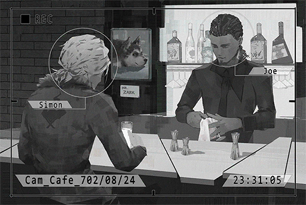

*"Meanwhile, Node 08 Administration Bureau's security office has marked the streamer as a suspect and has brought her in for questioning. Details will require further investigation."*

**Xenon** 
That's outrageous! She is not someone who will do such things!

**JOE** 
So you do care a lot about her?

**Xenon** 
... I feel so... powerless. So many things are happening on the internet, yet I have no way to stop it. I can't even protect you guys...

**JOE** 
Wait, what's with the "guys"?

**Xenon** 
The conversation that night, the one where you got completely wasted. Did you forget about it...?

**JOE** 
Haha! Of course I forgot! I don't even remember how I got home that day. Man didn't know that you're such a drinker. I accept defeat.

**Xenon** 
... Nah no big deal.

**JOE** 
Is there anything we can do to help her?

**Xenon** 
Affected by malicious connection... by the way, recently I received a bunch of anonymous mail. I still can't find out who's the sender, but the information he provides is very clear and reliable. If I can find out who he is...

**JOE** 
You can find the mastermind behind all this?

**Xenon** 
Yes. Right now the no.1 suspect on my list is Æsir.

**JOE** 
The missing musician? Why?

**Xenon** 
... Does this count as a secret? Whatever, long story short, the victims of these recent incidents are all participants of his event, including the guests for the opening performances.

**JOE** 
Are you serious!?

*\[Phone Rings\]*

**Xenon** 
Let me answer the call first. Hello?...Yes... Understood, I'm on my way.

**JOE** 
Work?

**Xenon** 
Yes, gotta go back. I'll put the money here. 

**JOE** 
Going back to save the princess?

**Xenon** 
Shut it dumbass.

**JOE** 
Hahaha! I know, good luck!

**Xenon** 
... I will protect her... and you as well. I won't let anyone hurt you guys.

**JOE** 
... Huh? What are you spewing all of a sudden? Ewww I got goosebumps, gross.

**Xenon** 
Nothing, see you.

*\[Doorbell\]*

**JOE** 
...Thanks, and sorry...

*\[Replay Ends\]*

[*(Click here to go back to the top)*](#toc)

## <a id="xos023"/>[#023] Mail\_Xenon\_702\_08\_23
### Requirements
|Character|Level|
|---------|:---:|
|**Xenon**| 22  |

### Log Content
**Subj.**: Medium scale abnormal data flow and electrical overload 
**From**: Anonymous 
**To**: Simon Jackson
___

Security Level: Highest Level. SDP protocol activated. 
Access Permission: Private Key required. 
Source Location: \[Locked\]\[Dynamic Proxy Server activated\]

Report 
========== 
\- About the large\-scale connection error that just occurred in block (74,02,20) of the server. 
\- About the electrical load overcharge in the Node 08, Quadrant III area that just occurred.

Malicious attack pattern similar to January 18th, 702 N.A. incident detected in that location. 
Source: Around Quadrant I, can't eliminate possibility of being in the forbidden area. Reverse tracking activated. 
Impact: Approximately 79,573 connection location intruded. Might cause light to medium level brain damage. Node 08 officials have dispatched the city's entire medical staff to provide victims with emergency treatment and care. A.R.C.'s HQ at Node 08 also stated that they will be providing support for both manpower and equipment. They will also be investigating the truth behind this incident. 
========== 
Report Ends

\*This document has the SDP Protocol activated. Attempting to input the incorrect private key will result in the deletion of this document and all copies.

[*(Click here to go back to the top)*](#toc)

## <a id="xos024"/>[#024] Audio\_Arc\_702\_08\_26
### Requirements
|Character|Level|
|---------|:---:|
|**Xenon**| 23  |

### Log Content
*\[Door Opens\]*

**ConneR** 
Oh, Mr. Xenon. Have you listened to my album?

**Xenon** 
This is Library's record of connection errors from last month. Every single one of them has signs that they've been intercepted to your IP. Just what the hell are you doing?

**ConneR** 
... Are you questioning me? Quite frankly, I work in Library. It's normal for me to analyze these connection errors, am I right?

**Xenon** 
I'm the one in charge of internet security. As a non\-regular employee, your personal interception of these records is trespassing into my territory.

**ConneR** 
Hmmm? Then what can you do? Arrest me?

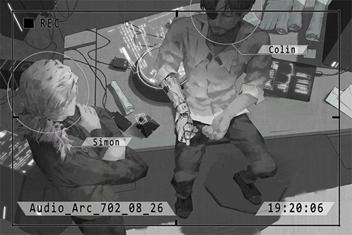

**Xenon** 
I have the right to report any suspicious activities to the higher\-ups.

**ConneR** 
Then what is your reason for not doing so, instead opting to come talk to me? Wasn't "following the rules" your way of doing things?

**Xenon** 
......

**ConneR** 
As someone who invented countless protocols and almost singlehandedly established the current internet's security, you couldn't figure out whether the connection errors are from internal or external sources. I'm a bit disappointed.

**Xenon** 
Are you saying that you have nothing to do with this?

**ConneR** 
No. In fact, it's the exact opposite. This is not just about me; it's about you, it's about everybody. The entire world is living in a giant deception.

**Xenon** 
What?

**ConneR** 
The current cyTus virtual internet is developed based on the ancient technology in Library combined with the original internet.

**Xenon** 
... And your point is?

**ConneR** 
Controlling technology that you have no idea how to actually control; won't that make you very nervous?

**Xenon** 
What the hell are you talking about?

**ConneR** 
From what I can tell, those security protocols weren't "invented"; they were "discovered", right? All you did was apply it to modern technology, yet A.R.C. is holding it like it was their invention. To me, that is no different than theft

**Xenon** 
... Internet security is not some kind of artwork. It exists so the people can use the internet under safe and fair conditions. I don't think there is a problem with that.

**ConneR** 
Indeed. "Conditions", "Rules", "Protocols". Having such arrogant limitations on a technology that you barely understand and acting as if you're some kind of god; that is the thing that makes me the most furious.

**Xenon** 
... I don't get what you are saying.

**ConneR** 
Pardon me, I've strayed a bit too far. All in all, I'm not the "mastermind" behind Library's connection errors. On a side note, I'm not the "Anonymous" who has been sending you mail either. 
Instead of wasting time on an old man like me, there are more important matters that you should be dealing with, Mr. Simon Jackson.

*\[Replay Ends\]*

[*(Click here to go back to the top)*](#toc)

## <a id="xos025"/>[#025] Mail\_Xenon\_702\_08\_30
### Requirements
|  Character  |Level|
|-------------|:---:|
|**PAFF**     | 24  |
|**NEKO#ΦωΦ** | 24  |
|**ROBO_Head**| 24  |
|**Xenon**    | 24  |
|**ConneR**   | 24  |

### Log Content
**Subj.**: Captured footage of target 
**From**: Anonymous 
**To**: Simon Jackson
___

Security Level: Highest Level. SDP protocol activated. 
Access Permission: Private Key required. 
Source Location: \[Locked\]\[Dynamic Proxy Server activated\]

Report 
========== 
Coordinate locked on. 
Has identified suspect through online visual footage.

Analysis: 

 
*[Click the image to watch the movie]*

========== 
Report Ends

\*This document has the SDP Protocol activated. Attempting to input the incorrect private key will result in the deletion of this document and all copies.

[*(Click here to go back to the top)*](#toc)

## <a id="xos026"/>[#026] Cam11\_St07\_702\_09\_26
### Requirements
|Character|Level|
|---------|:---:|
|**Xenon**| 25  |

### Log Content
**NEKO#ΦωΦ** 
Are you really not staying for dinner? Kenta hasn't seen you for a long time. He would love to have you at the table.

**Xenon** 
No. You're annoying. Why do you keep wanting me to stay for dinner?

**NEKO#ΦωΦ** 
... Fine then! I was being nice! Get lost!

**Xenon** 
... Bye.

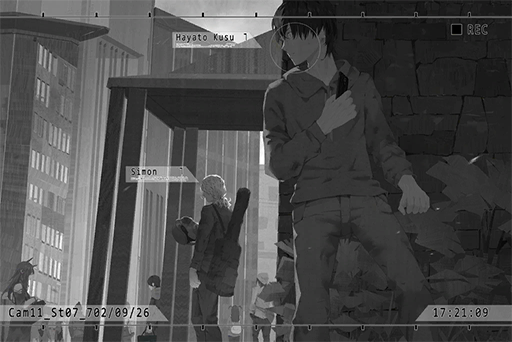

*\[Shutter\]*

**Young Man** 
Crap! This is bad...

**Xenon** 
Hey! What are you doing?

**Young Man** 
Eh? Ah... I'm sorry...

**Xenon** 
Are you sneaking a photo of me?

**Young Man** 
Eh... umm... you are Xenon, right! I'm your fan! Apologies, I was too excited to see you, so I just thought I can snap a quick photo and...

**Xenon** 
I have fans in Node 03...?

**Young Man** 
Eh? Y, yes, I am indeed from Node 03. Is my appearance that obvious? Haha...

**Xenon** 
......

**[Xenon-A.I.]** 
*Hayato Kusu, born October 1st, 678 N.A. 24 years old; blood type A...*

**Xenon** 
... I see. So you're an intern reporter at "08 Daily"? Isn't that the one that has been harassing me with messages and likes writing about baseless gossip?

**Hayato** 
Ehh? How did you...?

**Xenon** 
Sorry about that. I'm quite sensitive these days, so I hacked your device... You little... you even took photos of me in NEKO's room... I've deleted them all. Don't do illegal things like this anymore.

**Hayato** 
How could you!?... I, I mean, aren't you the same! It's illegal to look at other people's personal information without their permission!

**Xenon** 
Idiot, if you really care about your info, don't set your privacy setting to "Public"... Even if I don't hack your device, it won't take me more than a few minutes to find this information.

**Hayato** 
Uhh...

**Xenon** 
If you're still an intern, I suggest you quit the job. That world is not suitable for people like you. Goodbye.

**Hayato** 
......

**Hayato** 
Thank goodness that I already sent the photos to Miss Vicky...

*\[Signal Lost\]*

[*(Click here to go back to the top)*](#toc)

## <a id="xos027"/>[#027] Audio\_Graveyard\_702\_09\_29
### Requirements
|Character|Level|
|---------|:---:|
|**Xenon**| 26  |

### Log Content
**Xenon** 
...... I told you not to buy so many flowers every time.

**Doris** 
This is the token of love between your father and me.

**Xenon** 
I know. I'm just saying that you bought too much. They always wither when we bring them home.

**Doris** 
And what's the problem with that? Your overly serious personality is really a carbon copy of your father.

**Xenon** 
... Really? Because I'm pretty sure that dad always used to say that I was nothing like him.

**Doris** 
That was when you're still young, right? You are becoming more and more like him... If he's here right now, he will definitely say the same thing too.

**Xenon** 
He is here. You're literally standing on him.

**JOE** 
*Sobs...*

**Doris** 
Eh? The person over there... Isn't that your friend JOE?

**Xenon** 
It really is him... What is that guy doing? You can set everything up first. I'll go say hi.

*\[Signal Lost\]*

[*(Click here to go back to the top)*](#toc)

## <a id="xos028"/>[#028] Audio\_Cafe\_702\_09\_30
### Requirements
|Character|Level|
|---------|:---:|
|**Xenon**| 27  |

### Log Content
*\[Doorbell\]*

**JOE** 
So you're here?

**Xenon** 
Yeah.

*\[Glass Sliding\]*

**JOE** 
Have a few drinks with me, will ya? I need to work myself up before I can talk.

**Xenon** 
Sure.

**JOE** 
... I thought you would want me to cut to the chase immediately.

**Xenon** 
Nothing wrong with a quick chat. It has been a while since we last did this; just us two, having a few drinks in a quiet Cafe after it has closed for the day. I don't dislike this.

**JOE** 
Ha, same here.

**Xenon** 
Besides, I don't mind a few drinks, as long as you don't act drunk and play dumb later.

**JOE** 
... Don't worry. I won't.

**Xenon** 
Relax, I know you very well. You're THE Joe Miller, the man who dodges questions like nobody's business. If someone like you said they are tackling a question head\-on, then it most definitely meant you've made up your mind to not dodge nor hide.

**JOE** 
... If we want to talk dodging questions, you and I are practically neck\-and\-neck, isn't it? On the surface, it seems like you're taking on a lot of things. However, whenever you encounter the key issues, you tend to just beat around the bush...

**Xenon** 
What are you talking about?

**JOE** 
Well, like your love life... Things in the past... And your family. After our reunion, the more I learn about you, the more I feel like you're basically using work as an escape to those things right now.

**Xenon** 
... Perhaps you're right. Today, after talking to you, I went back to my father's grave. I've been thinking about this question myself too... After his death, it seems like I've been constantly trying to become someone like him.

**JOE** 
Uncle Kyle eh... My previous image of him was that he is rigid about every little thing. On top of that, he didn't seem to like us very much, since we goofed around all day.

**Xenon** 
Haha, your image is on point. Even though he didn't forbid me from playing the guitar, he is still VERY mad when I dropped out of school to play in the band. I had so many arguments with my family back then, way too many to keep track of...

**Xenon** 
Despite all that, his passion and diligence for his job as a law enforcement agent, his drive for perfection on every minute detail, and his devotion for caring deeply about others; I've always had great respect for him in those regards.

**JOE** 
Uncle Kyle really was a great law enforcement agent. You rarely see people like him nowadays...

**Xenon** 
I've been constantly thinking; is there something I can do for a city that is now missing him... Yet I have no idea whether the things I am doing now is correct or not. 
Maybe I just don't have it in me to be as perfect as he was...

**JOE** 
Nobody's perfect though.

**Xenon** 
But, I'm like the farthest thing away from him. The things I did when I was still a teenager... I bet that even in his grave, he still hasn't forgiven me about it.

**JOE** 
You're referring to "that", right? Recently, the gossip channel on iM has been reporting on it too.

**Xenon** 
Sigh... So they're writing about it again? Remember the paparazzi people I mentioned before, the ones who kept harassing me? These are the ones.

**JOE** 
Lemme look it up... Oh, it's this one. Now that I'm reading it, it is indeed quite over\-the\-top.

**Xenon** 
... What's did it say?

**JOE** 
The mysterious renegade! The legendary hacker X", who robs the rich and gives to the poor! An underground punisher that lurks in the shadows of the internet!"... Pffft, hahahaha!

**Xenon** 
Shut up! God, that stuff is so cringeworthy...

**JOE** 
How so? Even now, I still find it to be really sick and awesome! I still remember the moment when I first learned that X is actually you. It was truly mindblowing... 
On top of that, you were just 14 or 15 years old when you were X. It's just like those anonymous masked heroes in comic books!

**Xenon** 
Awesome my a\*\*; I was this close to getting locked up... I only got pardoned because I agreed to join A.R.C.

**Xenon** 
Now that I think about it, I'm essentially the same as that guy...

**JOE** 
Hmm?

**Xenon** 
Nothing... 
These damn paparazzi... This stuff is all from ages ago, yet they still report it like some kind of big discovery.  
There should be a limit to how dumb they can be, but I guess that doesn't exist.

**JOE** 
Those things, are you not interested in doing it again? I can guarantee you if you do it in the current online environment, it's going to create an even bigger commotion. Besides, with your current skill level, nobody's gonna catch you.

**Xenon** 
Whenever I see these retards, that idea will still pop into my mind from time to time... But, it's not worth it, so I decide not to. 
After all, what I'm doing at A.R.C. now is more or less the same thing. Only difference is now it has a "legal" label on it. 

**JOE** 
Tch\~ You could've made a s\*\*\* ton of money too.

**Xenon** 
... The stink of money in that brain of yours is definitely going to get you screwed someday.

**JOE** 
......

**Xenon** 
... What's wrong?

**JOE** 
Haha... That advice may have come a tad\~ bit too late.

**Xenon** 
......

**JOE** 
Let's... cut to the chase. Follow me; I have something to show you.

**Xenon** 
... Okay.

[*(Click here to go back to the top)*](#toc)

## <a id="xos029"/>[#029] Audio\_Arc\_702\_10\_18
### Requirements
|Character|Level|
|---------|:---:|
|**Xenon**| 28  |

### Log Content
**Xenon** 
Said suspect has been arrested. The missing people he purchased are also all escorted back to where they're from. This case is more or less closed. 
That's it for the report on this event.

**Davis** 
Good work...  Must've been tough for you to dig up all this stuff.

**Xenon** 
Hmm... Well, I have my methods.

**Davis** 
You didn't cross the line, did you? Especially since you're also investigating the Æsir incident between all this.

**Xenon** 
... I said before that I'll deal with these things in my own way. The Administration Bureau didn't say anything about this either, right?

**Mark** 
......

**Davis** 
I know. I have no intention to deny what you did. In reality, you really did a phenomenal job. Looks like the position of IT security department head will certainly belong to you.

**Mark** 
The part on the buyer seems to come to a conclusion; but what about the seller?

**Xenon** 
...Whatever the Administration Bureau requested, I will give them the corresponding information.

**Mark** 
Going only 50% on your investigation; this is very unlike you.

**Xenon** 
......

**Mark** 
The Æsir incident, you used that, didn't you? The A.I. you've been using a lot recently.

**Xenon** 
Yes.

**Mark** 
That thing, even though it was written under an emergency situation, did it clear the official review process for use? Does the Administration Bureau know about this?

**Xenon** 
... You're right; they don't know about this yet. However, this version is almost identical to the previous one. I just added a few automatic functions.

**Davis** 
Ah, Mark is not wrong about that either. It's best that you send it in for a review, especially since you're using it to help solve the cases.

**Mark** 
It's better that you be more careful about it...

**Xenon** 
......?

**Mark** 
I feel like that thing is not exactly safe.

*\[Door Opens\]*

**Xenon** 
What's the deal with him? Too much stress?

**Davis** 
Sighs... how troublesome.  
Mark is also one of the candidates who have a very good chance of taking the department head position. Recently, the company has been promoting you a lot, so he is perhaps feeling a bit uneasy.

**Xenon** 
...... 
I don't really care whether I can be the department head or not.

**Davis** 
No, I told you this before, right? You have the talent and the ability to judge things correctly. You must climb to a higher position and change the current situation.

**Xenon** 
You're giving me too much praise. Do not forget that I only have this job because of a mistake I made. Aren't you afraid that I'll rebel against you guys once I get the power to do so?

**Davis** 
... At the very least, I trust you.

**Xenon** 
... All things considered, I'll still talk to him sometime later. If not, I'm in an awkward spot myself too.

*\[Signal Lost\]*

[*(Click here to go back to the top)*](#toc)

## <a id="xos030"/>[#030] Audio\_Arc\_702\_10\_30
### Requirements
|Character|Level|
|---------|:---:|
|**Xenon**| 29  |

### Log Content
*\[Door Opens\]*

**Davis** 
What's wrong, Mark? Saying that you want to speak with me in private all of a sudden.

**Mark** 
......

**Davis** 
What's the matter? Take a seat first. Don't just stand there.

**Mark** 
Okay.

**Mark** 
......

**Davis** 
Did something happen?

**Mark** 
I mentioned before... that I was also investigating the Æsir incident, right? I think it will be quicker if I directly show you all the data.

**Davis** 
......?

*\[»»» Fast Forward »»»\]*

**Davis** 
...... This is...... It can't be...

**Mark** 
I've decrypted all the connection activity. After analysis, these are the results.

**Davis** 
Every single signal source... points to Simon... Do you meant to tell me that Simon is Æsir?

**Mark** 
I didn't say that. However, that's what the data shows.

**Davis** 
Mark... You aren't jealous of his promotion, are you...?

**Mark** 
......

**Davis** 
I'm sorry to suspect you like this. I just don't think that you're the type of person who would do these things just for the sake of it.

**Mark** 
As his peer, being unable to surpass him all the time does indeed make me a bit frustrated. However, that doesn't mean that I don't respect his abilities, nor does that mean I deny my own skills. 
This incident has nothing to do with that. I investigated Æsir... for my own reasons.

**Davis** 
Your own reasons?

**Mark** 
There's someone I know... She was a victim of the second Æsir attack incident. As of now, she is still unconscious in the hospital.

**Davis** 
NEKO's stream... Why didn't you tell us about this?

**Mark** 
It's not someone I'm particularly close to. I figured it's not necessary to tell. 
Besides, I don't want to affect my mood during work...

**Davis** 
... I see.  
Nevertheless, even if this data is real, you can't really prove anything. After all, tampering with signal sources from this long ago is a pretty easy thing to do.

**Mark** 
Do you recall that we tried to decrypt the encrypted messages his A.I. sent him before? Right around the time when Æsir \- FEST just concluded.

**Davis** 
...... Yes.

**Mark** 
In reality, the connections related to Æsir all use the same set of encryptions, the set Simon wrote. This is different than what he wrote on his report. I started my own independent investigation after I discovered that.

**Davis** 
I don't understand... If it really was him... Why would he do these things?

**Mark** 
I said before that his A.I. is not safe, right? Not long after Æsir \- FEST, it began to have more and more autonomous actions.

**Davis** 
That was indeed the case...

**Mark** 
Everything I said from this moment on is just my baseless speculation: I suspect that when Simon said he "upgraded" his A.I., that wasn't the case. What really happened was that the A.I. "grew" on its own and has lost control. As with Simon, he could be hiding this to avoid being the one held responsible.

**Davis** 
......

**Mark** 
Cases where the A.I. evolved beyond their original algorithms have already been observed to a different degree. It's no longer something rare in this day and age. This is also the reason why the Administration Bureau has been especially careful when managing this type of technology. 

**Mark** 
In fact, the system Simon wrote is also a direct continuation of the one he wrote when he was still "X". Perhaps some of his logic or personality back then have been mixed into the system and that's what caused the A.I. to lose control after it experienced growth. 

**Davis** 
If Simon knows about this, these clues would never be found so easily.

**Mark** 
... I spent a lot of time decrypting these. I wouldn't say that it was done "easily"... 
Besides, what if the situation is that he doesn't know about it? 

**Davis** 
......

**Mark** 
It's not unheard of. Previously, there was the case where his A.I sent a message to him, yet he couldn't figure out who send it. Even though he stated that he suffered memory loss as well, in reality, I feel that things may not be in his control anymore.

**Davis** 
In contrast, if he does know about it, then I'm afraid this incident won't be so simple... His purpose for still keeping that A.I., and exactly what he wants to do with all those stolen memories...

**Mark** 
... Stop making random guesses. I said that these are just my baseless speculation.

**Davis** 
Regardless, I think we should still ask for an explanation directly from him. It's better that way, right...?

**Mark** 
I think it's best we ask the Administration Bureau to do an official investigation. Simon is very smart. If he intends to hide things from the people at A.R.C., we may not be able to handle him. On top of that, if it's truly because of the A.I.'s actions, his personal will may be a non\-factor in this case already.

**Davis** 
Do we need to get the admins involved...?

**Mark** 
Just to be certain. If he really is innocent, he should cooperate with the Bureau's investigation.

**Davis** 
Got it. Let's do that. I believe that he is not the culprit.

**Mark** 
I hope not.

*\[Signal Lost\]*

[*(Click here to go back to the top)*](#toc)

## <a id="xos031"/>[#031] Cam\_Arc\_702\_11\_01
### Requirements
|Character|Level|
|---------|:---:|
|**Xenon**| 30  |

### Log Content
**Davis** 
The admins are almost here. Where's Simon?

**Mark** 
In his room.

**Davis** 
What's the matter? You look kind of pale.

**Mark** 
... Similar to Simon, I don't really like the Administration Bureau people.

**Davis** 
Relax. It should be just one or two investigation agents.

*\[Door Opens\]*

**Agent A** 
Starting now, we will carry out the arrest of Simon Jackson.

**Mark** 
... Armed forces and drones!? Isn't it supposed to be just a simple interrogation?

**Davis** 
Arrest!? Wait! If this whole group of people barged in, you'll disturb other employees!

**Agent B** 
The Æsir attack incident is labeled as security level A. The evidence you provided is already enough for Simon Jackson to be identified and forcefully arrested as a suspect for the case. Please stay out of the way.

**Mark** 
......

*\[→Signal Switch\]*

*\[Door Breaks\]*

**Agent A** 
FREEZE!

**Xenon** 
......!?

*\[Things crashing\]*

**Agent B** 
Where do you think you're running!? Stay down! You're under arrest!

**[Enforcer Drones]** 
*Beginning arrest of identified suspect: civilian Simon Jackson. Please cooperate.*

**Xenon** 
...... Did I do something?

**Agent A** 
You want to play dumb? If you didn't do anything, why did you run?

**Xenon** 
... Instinctive reaction. It couldn't be that, can it? A while ago, I hacked into the server of your HR department to look for some info... Is it really necessary to deploy armed forces for such a minor incident?

**[Enforcer Drones]** 
*Civilian Simon Jackson, you are under arrest for your crimes as "Prime suspect of the Æsir large\-scale internet attack incident". *

**Xenon** 
......!

**Xenon** 
......

**Agent A** 
Oh, not resisting anymore? So you admit it?

**Davis** 
Simon...... Was it really you......?

**Xenon** 
Mark's the one who uncovered this, right?

**Mark** 
......

**Agent A** 
If you have something to say, you can talk once we get back to the Bureau. Now move!

*\[Signal Lost\]*

[*(Click here to go back to the top)*](#toc)

## <a id="xos032"/>[#032] Cam\_08court\_702\_11\_05
### Requirements
|Character|Level|
|---------|:---:|
|**Xenon**| 31  |

### Log Content
**Agent H** 
With things being so serious, looks like there's no way for you people to get off scot\-free this time.

**Leo** 
... And what do you mean by that?

**Agent R** 
This large\-scale internet attack incident has resulted in so many casualties among internet users. On top of that, the key suspect is an employee of yours as well. No matter how cocky you are, the Administration Bureau will definitely hold you guys responsible this time.

**Leo** 
Hoho, that's funny. We're a victim too. The personal actions of that Simon Jackson in no part represent the company's stance. I'm here today to represent the committee and clear our position in this case.

**Agent H** 
Hmph, enough with that BS! From stuff like harboring that Colin guy and not letting him get the deserved punishment too, you people are always doing these random crap that makes no sense! Now, because of your product, many innocent people were harmed. Yet you have the gall to come here and show off your pretentious mug...

**Leo** 
Show\-off? Why would I need to do that? Isn't that obvious? Should I remind you that if not for A.R.C., you fools wouldn't even have a clue about how to use the gun that's hooked to your belts right now?

**Agent H** 
You little...!

**Agent N** 
Raven, Hawk! What are you people doing? It's time to escort the convict, isn't it? Why the f\*\*\* are you here bickering with a witness? Where's Simon Jackson?

**Agent R** 
C, captain!

**Agent H** 
We don't even need to escort him; he just walked straight into the courtroom himself. Ever since we arrested him, he's always had this weird attitude that I can't quite pinpoint. I don't know if he's passive or he's just calm...

**Agent N** 
Is that so? 
Then let's get moving. We've got another mission. Both of you, come with me.

**Agent H** 
Yes, sir!

**Agent N** 
Mr. Leo, apologies for delaying your time. Here, this way, please.

**Leo** 
Hmph...

**A.R.C. Defender** 
Sir.

**Leo** 
I know. To protect A.R.C.'s reputation and property... I'll be relying on you later.

**A.R.C. Defender** 
Understood.

*\[→Signal Switch\]*

**Judge** 
Starting now, we will be conducting the trial for Simon Jackson, the prime suspect of the "Æsir large\-scale internet attacks". Begin trial.

**[Clerk System]** 
*Trial recording, start.*

**Judge** 
Simon Jackson, after decryption, all connection records for the criminal cases have been found to originate from the many devices you used. Regarding this evidence, is there anything you would like to refute?

**Xenon** 
......

**Judge** 
Do you admit that you're indeed the cybercriminal with the codename "Æsir"?

**Xenon** 
... I don't remember.

**Judge** 
Right in front of you is a lie detector. Providing such ambiguous answers in court will do you no good.

**[Clerk System]** 
*Lie detector reaction: normal. The suspect is not lying.*

**Jury** 
... Judge, his attitude is rather passive. If this keeps going on, it would take us quite some time before we can even come up with a decision. How about we start by summoning the witnesses first?

**Judge** 
Certainly... A.R.C. committee member Leo Smith, are you here to represent the company and declare its position? How will you prove that his incident has nothing to do with the company?

**A.R.C. Defender** 
Yes. From now on, I will be speaking in place of Mr. Smith. After applying and complying with the Administration Bureau for a complete investigation, we discovered that all the equipment linked to the malicious attacks are personal equipment of Simon Jackson, which includes his self\-made A.I. system. None of these items have cleared the screening process of both A.R.C. and the Administration Bureau. Therefore, they count as unregistered systems. Although as of now, there are still no laws to regulate this, it also proves that all his personal actions are not related to the company, nor do they represent the company's stance as a whole. 

**Xenon** 
......

**Judge** 
What about his motivations? We would like to know about the motivation behind his crimes.

**Bureau Investigator** 
After conducting our own investigation, we found out that for the past few years, Simon Jackson has been researching the symptoms of his younger sister Shannon Jackson. Here are his research records.

**Xenon** 
......!

*\[File projection\]*

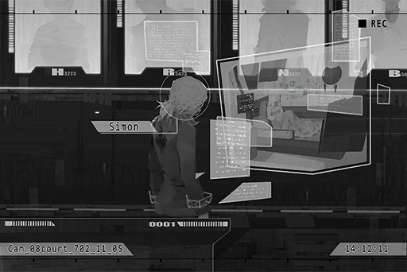

**Bureau Investigator** 
Shannon Jackson was diagnosed with a disease known as "Virtual\-Internet Related Post\-Traumatic Stress Disorder", better known as VR PTSD. We suspected that this is the reason behind the string of attacks against the systems and memories of virtual internet users. In fact, information has started to surface in the past few days which stated that during the time period where the cyTus system is down, all patients who have the same symptoms appear to have a different reaction compare to their usual panic state.

**Jury** 
I see...

**Bureau Investigator** 
Therefore, we speculated that the wide variety of connection attacks and the capture of user memory were Simon Jackson's experimental attempts to test out this theory. However, during these attempts, his own memories accidentally got affected as well. That's why he is in his current state, where he remembers little to nothing about his previous actions.

**Jury** 
... Makes sense. 
Simon himself has also indicated after the Æsir\-FEST incident that his memory suffered an attack as well.

**Judge** 
Simon Jackson, regarding the aforementioned investigation report, is there anything you would like to present on your behalf?

**Xenon** 
To cure Shannon...?

**Judge** 
Simon Jackson?

**Xenon** 
I... maybe I really am...

**Judge** 
What did you just say?

**Xenon** 
... To be honest, before the evidence ever surfaced, my own investigation has already given me its answer. With such complicated loops, I can't think of anybody else who is capable of coming up with such a design...

**Judge** 
......

**Xenon** 
While researching Shannon's symptoms myself, I have certainly thought about using methods such as attacking the virtual internet as well... Perhaps I unknowingly wrote that idea into the A.I.'s program...

**Judge** 
What are you trying to say?

**Xenon** 
... Maybe... I really am Æsir.

**Judge** 
......!

*\[Signal Lost\]*

[*(Click here to go back to the top)*](#toc)

## <a id="xos033"/>[#033] Cam\_CArea\_702\_11\_08
### Requirements
|Character|Level|
|---------|:---:|
|**Xenon**| 32  |

### Log Content
*\[Alarm\]*

**Xenon** 
......

**Agent** 
Trespassers in area C, the underground passages. Send additional agents and drones immediately!

**Xenon** 
......?

*\[»»» Fast Forward»»»\]*

*\[Door Knock\]*

**Xenon** 
......?

*\[Door Knock\]*

**Xenon** 
......

*\[Door Opens\]*

**ConneR** 
Good evening.

**Xenon** 
!? 
How did you...?

**ConneR** 
I knocked, but nobody answered the door. Therefore, I decided to come in myself. Pardon me for my intrusion.

**Xenon** 
... What the hell are you doing?

*\[Data projection\]*

**ConneR** 
I don't have time to explain all the minute details to you. All in all, take a quick look through these files first.

**Xenon** 
......?

**Xenon** 
......!! 
UGH......!

**ConneR** 
......

**Xenon** 
My investigation with her... These images...

**ConneR** 
Ho, so it actually worked? Excellent, I'm getting more and more interested... in this Æsir fellow.

**Xenon** 
......

**ConneR** 
How are you feeling? Do you remember it now? The reason why you are here.

**Xenon** 
... Why are you helping me?

**ConneR** 
Help you? Young man, you're mistaken. You're the one that's going to help me.

**Xenon** 
What do you mean?

**ConneR** 
My next step is to leave Node 08.

**Xenon** 
You're escaping? You're a criminal right now, you know.

**ConneR** 
Haha, being told you are a criminal by a guy wearing a prison uniform, how amusing. 
I've already obtained all the information I wanted to get with A.R.C. There is no reason for me to remain here anymore.

**Xenon** 
......!

**ConneR** 
In the end, I had to rely on myself. Judging by how terrible you look right now, you don't seem to be of much help either. That makes things a bit... tricky.

**Xenon** 
What exactly are you trying to do?

**ConneR** 
Your memory has already recovered. Here's your mobile device. I'll put it here. Starting now, I will present you with two "choices".  
Choice number one, go to Node 03, meet up with me there. I will tell you many more interesting things, including things about Æsir, A.R.C., and this world itself.

**Xenon** 
!?

**ConneR** 
Choice number two, stay here and wait for the admins to prove your innocence through the proper procedures, or be a sitting duck and await your own demise.

**Xenon** 
......

**ConneR** 
I shall remind you first. 
Once you set foot outside this door, you are, in all sense of the word, "dead". No one in society will ever acknowledge your existence. Your family, friends, life, and dreams will all be reduced to ashes. Nothing will be left.

**Xenon** 
......

**ConneR** 
I still have more important businesses to tend to, So I don't have time to waste on you here. 
Although having your assistance will make things much easier for me, the final decision is all yours to make.

*\[Alarm\]*

**ConneR** 
Ah, right. Seems like we got a signal. Please give me a minute.

**ConneR** 
This is R. Woah, looks like it's quite the spectacle on your side of things.

**[Cherry]** 
*You bastard! How dare you trick me! Where the f\*\*\* am I at right now!?*

**ConneR** 
No need to worry. I've already opened Simon's cell door. However, it seems like he doesn't really want to come out.

**Xenon** 
Sherry!? What are you doing here?

**[Cherry]** 
*……!*

**ConneR** 
As you just saw, your dear friends are literally risking their lives for you. All in all, I will leave the door open for you, the door to end this entire fiasco. The rest is up to you. 
Feels like your dear friends are in a pretty serious pinch. Allow me to take my leave first.

*\[Footsteps\]*

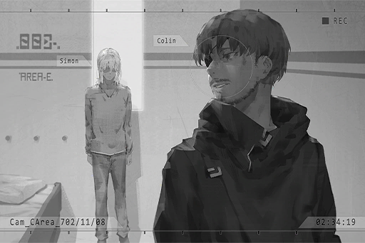

**Xenon** 
......

*\[Signal Lost\]*

[*(Click here to go back to the top)*](#toc)

## <a id="xos034"/>[#034] Audio\_CArea\_702\_11\_08\_1
### Requirements
|Character|Level|
|---------|:---:|
|**Xenon**| 32  |

### Log Content
**[Control System]** 
*Level A Alarm, Level A Alarm. A convict has escaped. 
Level A Alarm, Level A Alarm. A convict has escaped.*

*\[Hurried Footsteps\]*

**Xenon** 
Ha... Ha...

*\[Alarms\]*

**Agent A** 
He should still be nearby! Deploy more drones and expand the search area!

**Xenon** 
......

*\[Loads Gun\]*

**Agent N** 
Don't move. Both hands on your head.

**Xenon** 
......! 
Tch...

*\[Hacking\]*

**Agent N** 
Woah!

**Agent A** 
Captain! W... what happened!?

**Agent N** 
He sabotaged the lighting system.

**Agent A** 
How did he...

**Agent N** 
Those trespassers down there are here to help him! I'll handle this place. You guys go after the ones underground!

**Agent A** 
Yes, sir!

*\[→Signal Switch\]*

*\[Hurried Footsteps\]*

**Agent N** 
Stop right there!

**Xenon** 
......!

**Agent N** 
It's a dead end ahead. Nowhere for you to run now.

**Xenon** 
......

*\[Hacking\]*

*\[Punch\]*

**Xenon** 
Argh!

*\[Removes Helmet\]*

**Agent N** 
Trying to hack me? You thought I don't know about you and your little tricks?

**Xenon** 
... Nate...?

*\[Handcuffs\]*

*\[Signal Lost\]*

[*(Click here to go back to the top)*](#toc)

## <a id="xos035"/>[#035] Audio\_CArea\_702\_11\_08\_2
### Requirements
|Character|Level|
|---------|:---:|
|**Xenon**| 32  |

### Log Content
**Xenon** 
... Hey, where are you taking me?

**Agent N** 
Shut up and just come with me.

*\[→Signal Switch\]*

**Agent N** 
We're here. Now, stand still.

**Xenon** 
......?

*\[Punch\]*

**Xenon** 
Ugh!

**Agent N** 
This one is for your father. 
If he is still alive, I'm certain this is what he will do.

**Xenon** 
......

**Agent N** 
Because of my position, I never had the opportunity to talk to you since your arrest, until now 
Speak. What the hell is all this stuff about? Before Kyle died, he truly believed that his son has changed for good. Is this your response to his expectations? By causing all this nonsensical mess?

**Xenon** 
... You haven't changed one bit.

*\[Lights fire\]*

**Agent N** 
...... (Inhales) 
If it's so easy to change, I would never be able to hold his position to this day.

**Xenon** 
... Sorry, I didn't mean for things to turn out this way.

**Agent N** 
That is not what I want to hear. What happened exactly?

**Xenon** 
It's a bit complicated.

**Agent N** 
You have until this cigarette burns out to explain.

*\[»»» Fast Forward»»»\]*

**Xenon** 
... That's more or less it. The real Æsir is definitely still hiding somewhere right now. He is using the window created by all this chaos to carry out his next plan... We have no idea what secrets A.R.C. is hiding either.

**Agent N** 
...... (Exhales)

**Agent N** 
...... Kyle often used to say, "No matter what kind of justice we uphold,"...

**Xenon** 
"we are always the villain in someone else's story." 
...... His favorite saying.

**Agent N** 
Later, I was able to understand this saying in an even deeper way. This means that every single villain has something they upheld as their justice.

**Xenon** 
......

**Agent N** 
How should I believe that the story you just told is not a load of crap?

**Xenon** 
... You don't have to believe. You just have to know, that for the sake of pursuing the truth, I am willing to give up my most treasured things. Even if I become a villain in your eyes, I will not stop.

**Agent N** 
......

**Xenon** 
If you don't unlock these handcuffs now, this case will never end. By then, it doesn't matter if it's your justice or mine; they will all be reduced to ashes.

**Agent N** 
Those eyes... you two are indeed father and son after all.

*\[Unlocks handcuffs\]*

**Xenon** 
......!

*\[Punch\]*

**Xenon** 
Argh!?

**Agent N** 
The previous punch didn't draw any blood. This one should do. Hey, you punch me a few times too.

**Xenon** 
......Huh?

**Agent N** 
Quick.

**Xenon** 
......

*\[Punch\]*

**Agent N** 
... Man, do you really eat properly? 
Whatever, just need to cause an injury. This way, I can treat it as if we had a brawl. Oh, and my helmet too. You can break it somehow, right?

**Xenon** 
I can...

**Agent N** 
Go down this door. I will command them to go somewhere else.

**Xenon** 
......

**Agent N** 
The justice I... or Kyle upheld may no longer exist anymore.  
However, if it's you, maybe there is still hope.

**Xenon** 
... Thanks.

**Agent N** 
Oh, one more thing. "Willing to give up my most treasured things." Don't say that until you've lost something for real.

*\[Signal Lost\]*

[*(Click here to go back to the top)*](#toc)

## <a id="xos036"/>[#036] Audio\_Port33\_702\_11\_10\_1
### Requirements
|Character|Level|
|---------|:---:|
|**Xenon**| 33  |

### Log Content
**Cherry** 
The transporter is over there. Thank god we made it in time. Let's go, Mad Dog. The cargo is in the last car.

**Xenon** 
......

*\[Door Opens\]*

*\[Moves Cargo\]*

**Hunter** 
Hnnngh\~ Dang, this s\*\*\* is heavy...

**Cherry** 
Don't be such a p\*\*\*\*.

**Hunter** 
Okay, cargo in perfect shape. Now get moving.

**ConneR** 
Oh, I see. Using this route to smuggle... how did I not think of this? 
Very clever idea, Miss Pauline.

**Xenon** 
Hey, is that... a human inside there?

**Hunter** 
So what? It's none of your business.

**Xenon** 
......

**Hunter** 
What are you trying to do? I advise you don't try anything stupid!

**Cherry** 
... Simon, we've gone this far already. This is the only way to get you out of here.

**Xenon** 
... Nothing. Now go.

**Hunter** 
...... Hmph.

*\[Drags Cargo\]*

**Cherry** 
Alright, let's board the transporter. This ride will take us back to a transportation hub. We will board another ride there that'll take us into Node 03.

**Xenon** 
What about you?

**ConneR** 
I'll figure out a way to sneak into Node 13 from there. I'm currently a criminal after all.

*\[Signal Lost\]*

[*(Click here to go back to the top)*](#toc)

## <a id="xos037"/>[#037] Audio\_Port33\_702\_11\_10\_2
### Requirements
|Character|Level|
|---------|:---:|
|**Xenon**| 33  |

### Log Content
**Cherry** 
... Want some water?

**Xenon** 
...... 
Yeah. Thanks.

**Cherry** 
......

**Xenon** 
......

**Xenon** 
Where's that guy?

**Cherry** 
In the next car. He said that it's too crowded here.

**Xenon** 
It's certainly quite uncomfortable. It's stuffy and narrow.

**Cherry** 
Can't help it. After all, this system is meant to transport goods, not people. Bear with it. It'll probably take a few hours before we arrive at the hub.

**Xenon** 
This thing sure does travel far.

**Cherry** 
This is my first time taking the return trip. Before this, I was responsible for picking up the cargo, and that's it.

**Xenon** 
Like that ridiculous transaction we just witnessed back there?

**Cherry** 
... Sorry; can only ask you to pretend that you didn't see anything.

**Xenon** 
Nope. I already placed a tracker inside and filed an anonymous report to the admins. The transaction is likely going to be intercepted.

**Cherry** 
......! You serious!? Wow, I didn't notice that at all.

**Xenon** 
... What concerned me more is the fact that you're still doing this kind of stuff, even after what happened...

**Cherry** 
... You also knew about that all this time, right? That's why you were avoiding me...

**Xenon** 
I really want to convince myself that I don't know, but that doesn't seem to be an option now.

**Cherry** 
......

**Xenon** 
They ask you to come and interfere with my actions, right?

**Cherry** 
Sigh... more or less... I don't want to lie.

**Xenon** 
Haha, then sorry to break it to you, but you kinda suck.

**Cherry** 
Hey, you can't blame me. You self\-imploded before I ever had the chance to interfere... Getting yourself arrested and locked up for pursuing the truth... That's so dumb...

**Xenon** 
You have a point... I still can't quite get over that.

**Cherry** 
Never imagine that you'd be defeated in the world of the internet.

**Xenon** 
No, the one that defeated me was not just that... the admins, A.R.C., and those thoughts in my mind, I failed to overcome any of these. I was too focused on the things I believed were the most important, yet ended up being toyed around by them...

**Cherry** 
What do you plan to do next? With you running away to Node 03, aren't you even further away from the truth now?

**Xenon** 
... I don't know. However, once I get there, I won't interfere with the organization's activity in Node 08 for quite some time. There's no need for you to keep following me anymore, right?

**Cherry** 
......! 
... Simon, although it's the organization's request that gave me the motive to contact you again, in all honesty... I... 

**Xenon** 
......

**Cherry** 
... Forget it. It's pointless to say these things now too...

**Xenon** 
......

**Cherry** 
......

**Xenon** 
"The real me"...

**Cherry** 
......?

**Xenon** 
"You can't accept this, can you? The real me"... You asked me that exact question in the past, right? Back then, I didn't really give you an answer either.

**Cherry** 
......

**Xenon** 
You've always used "the real me" to deny and run away from the Sherry we knew and spent time with, the Sherry who's cheerful, positive and strong\-willed. It's like you're trying to tell us that all of that was fake.

**Cherry** 
......

**Xenon** 
But to me, that's the "real" you. It's also the you I once liked. As with the you who has been doing all these "bad" things, that's also the real you. It's just one that I don't know much about yet... or it's just one that you don't want to let me know about. 

**Xenon** 
I am willing to believe that you have your own reasons for doing these things, but you'll have to prove it to me with your actions. After all, the one thing we both hate the most is a relationship that's all talk and no action, isn't it?

**Cherry** 
... Yes, you're right...

**Xenon** 
Although Neumann is "that" kind of person, the information he provided and his ability make me believe that there's still an opportunity for me to get closer to the truth. I will cooperate with his actions, for now at least... I feel like we two made a pretty great duo when investigating the Æsir incident. Judging by how much you distrust him, you'll help me, right?

**Cherry** 
......! 
... Yes! You're indeed the type that worries people a lot.

**Xenon** 
Let's start over from zero... Partners?

*\[High Five\]*

**Cherry** 
... Partners!

**Xenon** 
I'll go and check what he's doing in the next car. You must be exhausted. Get some rest.

*\[Signal Lost\]*

[*(Click here to go back to the top)*](#toc)

## <a id="xos038"/>[#038] Cam\_Port33\_702\_11\_17
### Requirements
|Character|Level|
|---------|:---:|
|**Xenon**| 34  |

### Log Content
**Cherry** 
The transporter is almost here. Didn't think we would actually survive these seven days without a hitch. 
... R, thanks a lot.

**ConneR** 
I've only done this by myself before. Hunting for food for three people turned out to be a bit tougher than I thought. However, it made for a good experience.

**Xenon** 
... Thanks for the help. We ought to be on our way.

**ConneR** 
Don't let down your guard too soon. Did you young fellas not notice? Starting from two days ago... we've got company.

**Xenon** 
......?

**ConneR** 
Some other "rats" are also here...

*\[Things Crashing\]*

**Member A** 
HEY! Be careful!

**Cherry** 
......!?

**ConneR** 
Speak of the devil…

**Xenon** 
... Are they... "gravediggers"? What do we do? They seem like serious trouble. They all got guns too.

**Cherry** 
Let's go. It's none of our business.

**Xenon** 
What's in those crates...

**Cherry** 
Simon, the transporter is almost here. It's best that we don't get into a fight with them. Just pretend that we didn't see anything... Right? R? 
...... R?

*\[→Signal Switches\]*

**Member A** 
Be careful! This cargo is easily worth ten times more than your life ever will.

**Member B** 
I know, I know.

**ConneR** 
Greetings\~ Gentlemen. Enjoying the night?

**Member C** 
... Who's there!?

*\[Loads Gun\]*

**ConneR** 
Hoho\~! How scary. No need to be so nervous. I'm one of your peers. Just want to make some friends; nothing wrong with that, right? I'm quite interested in what you folks have in those crates. Are you down for a trade?

**Member A** 
Trade my a\*\*! DIE!!

*\[Gunshot\]*

**ConneR** 
... My oh my, such hostile people. I originally planned to offer a high price so we could all benefit from this. Well, guess I shouldn't expect rats to understand the beauty of human language...

*\[Gunshot\]*

**Member B** 
Shoot him up! Damnit! Why is there somebody else at this place?

**Member C** 
How would I know!?

*\[Gunshot\]*

**ConneR** 
... This numbers disadvantage is certainly a bit annoying.

*\[Lights off\]*

**Member** 
......!?

**Xenon** 
Now!

*\[Gunshot\]*

**Member** 
Argh!

**ConneR** 
......?

**Xenon** 
You can come out now. All of them have been dealt with.

**ConneR** 
(Whistles) So the drone killer can kill people too.

**Cherry** 
This is a pulse pistol. They merely fainted. Why did you act on your own all of a sudden!?

**ConneR** 
You fellas could've left after you got the map. I can handle these rats myself just fine. You're the one who turned off the lights, aren't you?

**Xenon** 
I didn't do it for your sake. It seems that they planned to transport the weapons in these crates to 08. Can't just ignore them.

**ConneR** 
Oh? Then what do you plan to do?

*\[Gunshot\]*

**Cherry** 
Destroy them all.

**ConneR** 
Awww... what a pity. There was some pretty good stuff in those crates. For example, this baby right here.

**Xenon** 
......! When did you take that? Put it down. Sherry will destroy it.

**ConneR** 
Sorry, but my response is no. I'd like to remind you that you still owe me a favor. Consider this gun a payment for everything I did for you.

**Xenon** 
......

**ConneR** 
Alright, it's about time I leave too. You two should get to 03 as soon as possible. Once my investigation produces some results, I will contact you two. Before that, feel free to do as you wish... as long as you don't get into trouble.

**Cherry** 
What trouble...?

**ConneR** 
*\*Chuckles\** Well, you fellas have "trouble" written all over your faces. Farewell, and take care.

*\[Footsteps\]*

**Xenon** 
... He left.

**Cherry** 
Hey... Simon, check out this news.

**Xenon** 
... "A few hours ago, there had been several eyewitness reports from Node 08 that reported abnormal flight patterns from drones. Just now, we've also been gradually receiving news regarding the drones' attacks on the cities."... Is this real? What is going on?

**Cherry** 
JOE! Quick, call him and ask him about this.

**Xenon** 
On it!

*\[Signal Lost\]*

[*(Click here to go back to the top)*](#toc)

## <a id="xos039"/>[#039] Multi\_File\_X039
### Requirements
|Character|Level|
|---------|:---:|
|**Xenon**| 35  |

### Log Content
*\[→Audio\_Kyle\_688\_04\_16\]*

*\[Door Opens\]*

**Xenon** 
I'm home.

**Doris** 
Simon... Why are you all messed up!? Did you get in a fight again?

**Xenon** 
......

**Shannon** 
Brother...

**Doris** 
Who is it!? I'll file a report to the Academy tomorrow...

**Xenon** 
Forget it. I was the one who started the fight.

**Doris** 
Why?

**Xenon** 
They were bullying Shannon in the Academy.

**Shannon** 
Brother, I told you it's alright! They were just joking with me...

**Xenon** 
Throwing your drawings into the river, I don't think that's a very funny joke.

**Doris** 
Shannon... is that true? Why didn't you tell me about this?

**Shannon** 
It really is nothing serious. Please don't make a big deal out of it. I don't want to be embarrassed in class...

**Doris** 
Once your father comes back, I'll have a talk with him...

**Xenon** 
Forget about it. Compared to us, he cares more about the bad guys in the city... My guess is that he's not coming back today either.

**Doris** 
Simon...

**Xenon** 
Sorry, I don't mean to complain... He is doing the right thing. 
I'll go upstairs now. I'm sleeping soon, so no need to cook dinner for me.

**Doris** 
Simon...! Wait a minute!

**Shannon** 
Mom! Let me talk to him... I'll treat his wounds while I'm at it too.

*\[→Signal Switches\]*

**Xenon** 
... Oww.

**Shannon** 
Just bear with it a little... 
Brother, you... lost the fight, didn't you?

**Xenon** 
......

**Shannon** 
You really... don't have to do this kind of thing anymore. I don't want to see you get hurt again...

**Xenon** 
Those people, if you just ignore them, they will definitely become the bad guys dad is hunting down now. But I don't know any other way. I'm so damn useless. I can't even beat them in a fight... Owww...

**Shannon** 
Brother, you're looking down on yourself again. You're not useless at all. You're no.1 in the entire grade in Programming Language, and you're an amazing guitar player. Unlike me... all I do is draw some insects. Can't blame the people in my class for finding that disgusting...

**Xenon** 
Don't flatter me. My guitar skills are anything but good. Both mom and dad just treat it as loud noise.

**Shannon** 
At least I really like your music. Besides, they didn't stop you from playing despite the things they said. That in itself shows that they are not against it. 
Those people in my class, they more or less have issues within their own families. I think that at their core, they are still good people. They won't become those sorts of bad guys.

**Xenon** 
You're bullied this badly, yet you still think like that. These kinds of naive ideas will get you in serious danger someday...

**Shannon** 
Many people view cockroaches and spiders as disgusting pests for no particular reason other than their appearances and living habits. However, to cockroaches and spiders, they never had the right to choose. That's their only way of life. Even if they can't understand each other, they are still trying their best to live. I feel like it's the same for people, of how we treat one another. 

**Xenon** 
No, cockroaches are actually pretty disgusting... right? You're the weird one for not being scared of them...

*\[Slaps on patch\]*

**Xenon** 
Ouch! That hurt!

**Shannon** 
Last one! Hmph! 
All in all, I forbid you to pick fights with other people for my sake anymore. If I found out, I'll fill your room with cockroaches!

**Xenon** 
......

*\[→Audio\_05St\_688\_04\_30\]*

*\[Crash\]*

**Shannon** 
Waah!

**Student A** 
You've been getting real cocky, aren't you? Huh!? Did you think that would scare us?

**Shannon** 
......

**Student B** 
Ugh, the more I look at you, the grosser you get... Hey! Grab her and hold her down. Heard you really like bugs, is it? Then I'll pour some in your mouth to see if you really like them that much...

**Xenon** 
Stop it!

**Student C** 
You again? Did you not get enough of my punches last time?

*\[Loads Gun\]*

**Student A** 
Hey! He has a gun...!

**Student B** 
... He... hehe, so what? Do you know how to use it? Do you have the balls to shoot...?

**Xenon** 
... Umm...

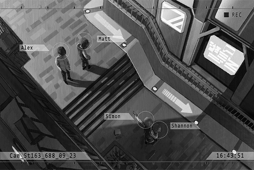

**Shannon** 
Brother, no!

*\[Punch\]*

**Xenon** 
Blargh...!

**Student C** 
Imitating daddy and playing Mr. Police Officer? How cute. 
Ooh, this is a pretty nice gun... I think I'll take it, haha.

*\[Alarm\]*

**Student A** 
Yikes! It's his dad! RUN!

*\[Runs\]*

**Kyle** 
...... 
Simon... give me back the gun.

**Xenon** 
......

**Kyle** 
Do you have any idea what you're doing?

*\[Signal Lost\]*

[*(Click here to go back to the top)*](#toc)

## <a id="xos040"/>[#040] Multi\_File\_X040
### Requirements
|Character|Level|
|---------|:---:|
|**Xenon**| 36  |

### Log Content
*\[→Audio\_Capt.Wood\_688\_05\_01\]*

**Andrew** 
And that's it for the Serious Crime Unit's operation report. Meeting's over. Jackson, you stay. I have something to tell you.

**Kyle** 
......

*\[»»» Fast Forward»»»\]*

**Andrew** 
So the gun was stolen by Simon?

**Kyle** 
Yes. I've already taught him a serious lesson. He is now grounded.

**Andrew** 
Good thing it didn't become a major issue. 
Jackson, of all my subordinates, you're the one I think most highly of. Don't let this kind of minor mishap get in the way again. Many people are jealous of you, and they are more than happy to see you fail so they can climb up themselves.

**Kyle** 
Captain, those students who were bullying my children in the Academy, I saw their faces.

**Andrew** 
... We've discussed this already. Student issues are the responsibility of the Juvenile Crime Unit. We have bigger cases to deal with on our hands.

**Kyle** 
I don't understand. This is something we could've stopped. Why are we pushing it away just because it belongs to a different unit?

**Andrew** 
...... 
I'm retiring in a few years. Before that, I'll do whatever I can to make you the successor of my position. Listen closely, even if it's someone from the Administration Bureau, as long as it's not a member of our unit, do not trust them easily. If you can't understand this, you'll never do well in this job.

**Kyle** 
......

**Andrew** 
... I know you're very concerned about your kids. However, you're the only person who has a legitimate chance of bringing "Law Enforcement" back on the right tracks. As with the Academy's students, I'll ask the Juvenile Crime Unit to handle them. You just need to focus on completing the Serious Crime Unit's missions. That's the most efficient way for you to earn credits. 

**Kyle** 
......

**Andrew** 
Time's up. You should meet up with the others. 
One more thing... Isn't it better for you to directly show your children that you really do care about them? They'll never feel how much you care about them if you keep a stern face in front of them all the time... This is coming from someone who also has a family himself.

**Kyle** 
... Understood.

*\[→Audio\_AB08\_688\_05\_19\]*

**Agent A** 
Walk forward! Get in!

**Student A** 
I get it! Stop pushing me, you bum!

*\[Door Opens\]*

**Kyle** 
... It's that student.

**Agent B** 
Hey, SCU guy, what do you want? You have no business here.

**Kyle** 
That student is the main culprit behind my daughter's bullying at the Academy... 
Don't tell me... did my daughter...?

**Agent A** 
I have no idea what you're talking about. He's under arrest for a busted drugs transaction.

**Kyle** 
Drugs transaction?

**Agent B** 
An anonymous connection sent a series of transaction records to our system. We traced that connection, found the address and this brat... Alex's the name, right? Got busted by us right on the site.

**Agent A** 
Hey, what are you doing spilling the beans to this guy? 
In short, this is a pretty major catch. You SCU folks and your arrogant a\*\*es better watch out cause you aren't the only ones solving cases.

**Kyle** 
... Did you reverse track that connection? Following a tip with unknown origins is way too risky! Besides, how did that anonymous person manage to hack into your system?

**Agent A** 
... Shut up. You don't get to tell us how to do OUR jobs! Jackson, I know you're cocky, but this is not over. When all is said and done, the one who climbs to the top may not be you. Remember that well.

**Kyle** 
......

*\[→Signal Switches\]*

**Agent A** 
Alex Flynn, do you know why you are here?

**Student A** 
Huh? How would I know?

**Agent A** 
Stop pretending. An anonymous tip has provided us with records of you selling drugs on the dark web. The evidence is all here.

**Student A** 
Ha, you guys think this tiny bit of evidence is enough to arrest me?

**Agent A** 
You do have a point. This certainly isn't enough. Information from the dark web doesn't qualify as valid evidence in front of a jury. Therefore, we've prepared some other exhibits. 

*\[Places item\]*

**Student A** 
...!?

**Agent A** 
Heard you had a good time messing around with classmates when you were at the Academy. Remember anything about this little box?

**Student A** 
Hey, what are you gonna do? Take that thing away!

**Agent A** 
What's the matter? This item belongs to your, right? 
You took this box and told your mates to catch some bugs. You then used them to bully a female classmate, correct?

**Student A** 
......

**Agent A** 
Although there were no fingerprints on the box, we were able to analyze it and discovered traces of the "goods" you sold. 
So? Remember anything now?

**Student A** 
... What the f\*\*\* does that have to do with me...

**Agent A** 
Still can't remember anything, can you? Then perhaps I should put those bugs back inside to remind you of the scenario.

**Student A** 
WAAH! Don't come near me!

**Agent A** 
Looks like they weren't kidding when they said you really hate insects... 
A good kid shouldn't bully a classmate for this kind of reason, especially someone with a criminal record like you. 
From the looks of it, your dad is lowly scum himself too. So? What do you think? Plead guilty now and you can have a touching reunion with him in the restricted area. 

**Student A** 
N... no! WAAAAHHHHHH!!

*\[Signal Lost\]*

[*(Click here to go back to the top)*](#toc)

## <a id="xos041"/>[#041] Multi\_File\_X041
### Requirements
|Character|Level|
|---------|:---:|
|**Xenon**| 37  |

### Log Content
*\[→Audio\_Capt.Wood\_690\_04\_02\]*

**Andrew** 
This is the criminal activity we're pursuing this time.

*\[Data projection\]*

**Andrew** 
A group of organizations that mainly operates in Node 03. Through some not\-yet recreated or abandoned tunnels beneath the Nodes, they conduct a smuggling business. They have an organization as their respondent in Node 08 as well. As of now, the most suspicious one is obviously "Baro", a name everyone must be very familiar with. As you can see here, they're the ones who collect all the direct profits at the end of these transactions.

**Kyle** 
A criminal group from 03 has extended its influence all the way here...?

**Andrew** 
That's right. Due to the extremely uncooperative attitude of 03's Administration Bureau, that area has basically become a lawless place. That's none of our business, but having that situation invade 08 will create quite a headache for us.

**Agent M** 
All these sporadic incidents... Can't believe we never found out about them before...

**Andrew** 
No, this is a mistake on my behalf. The Ando family has always kept a balance among the underground organizations, a balance that doesn't require us to resort to violence. After all, we don't want a conflict between the two sides to disturb civilians. However, relying on the underground society itself is a mistake. Someone in Baro wants to destroy this peace, which is why they're constant taunting the Administration Bureau like this. Right now, we can no longer ignore them.

**Kyle** 
This data on their profits... They didn't even bother hiding them. This is clearly a declaration of war against us...

**Andrew** 
In short, this data contains all the suspicious figures reported by my "informant". This includes buyers, sellers, missing people and other related witnesses. Jackson, I'll have you in charge of this case. Do you accept this?

**Kyle** 
Have me in charge? Captain, what about you?

**Andrew** 
I have some other jobs to deal with this month... It's a case about some crucial encrypted data being stolen from A.R.C.'s servers. However, that should be ending soon. Once I'm done with that, I'll return to join the investigation.

**Kyle** 
... Understood. With Martin and I, as well as the members we have right now, it should be enough.

**Agent M** 
Leave it to us, captain.

**Andrew** 
With you two together on the job, no need for me to worry. 
Martin, your son... Nate, he's currently a trainee, right? Judging by his grades, he'll be an excellent Law Enforcement Agent like you in no time.

**Agent M** 
I'm flattered, captain. That brat still has a lot to learn.

**Andrew** 
Jackson, perhaps this is the case to take down Baro once and for all. If so, you'll move one step closer to my position. Do your best.

**Kyle** 
Yes, Sir!

**Andrew** 
Right... I know I shouldn't say this in a meeting, but the Serious Crime Unit members present here are the comrades I trust most... Regarding this investigation, try your best to let other people in the Bureau know. I suspect that these smuggling and trafficking transactions were able to go through because of an accomplice within the Administration Bureau.

**Agent M** 
......!!

**Andrew** 
I believe that said accomplice is definitely not present in this room. However, I suggest you be careful yourselves. The people from other units may not be as trustworthy...

**Kyle** 
... Understood.

*\[→Audio\_Capt.Jackson\_692\_08\_12\]*

*\[Door Knock\]*

**Agent M** 
Captain, not done with work yet?

**Kyle** 
The criminals won't be so considerate as to take a break when we do... Also, when we're in private, don't call me captain. Just refer to me as you normally do.

**Agent M** 
Sorry, no can do. We're still in the Bureau. Besides, aren't you supposed to get used to it by now?

**Kyle** 
It has been two years since Captain Wood was killed in action... No, since we took over this case. Yet we still haven't had any major breakthroughs. I'm too ashamed to even face Captain Wood, much less get used to this...

**Agent M** 
Don't say that. After you took over the position, the crime rate is far lower than what it previously was.

**Kyle** 
But as a result, I created more enemies, be it on the outside or on the inside.

**Agent M** 
Yeah, yeah. You give yourself way too much pressure. Come on, go grab a drink.

**Kyle** 
Now? Let me put these files...

**Agent M** 
I'll handle it for you! Go!

**Kyle** 
Hey, don't drag me...

*\[→Audio\_HNote\_692\_08\_12\]*

**Kyle** 
... Is this the type of place you like to go to after work? Guess you're no different than the other folks in the Bureau.

**Agent M** 
What do you mean "this type of place"? The resident singers here are the best! Especially the female singer making a guest appearance today, you better listen closely!

*\[Singing\]*

**Kyle** 
......! 
Ah\~ this certainly is a beautiful voice...

**Helena** 
Thank you. That's my little sister.

**Agent M** 
Oh! Helena, another night shift today? Must be tough.

**Helena** 
You too, agent Martin. Thank you for coming so often\~ Here, it's a treat. Don't tell the owner! 
Then, I'll leave you two to it. Enjoy!

**Agent M** 
Thanks! 
Kyle, to be honest, I brought you here because there's something I want to tell you. Something that's best not talked about inside the Bureau.

**Kyle** 
... What is it? Being so serious all of a sudden.

**Agent M** 
Here is some information I got through some of my connections. Take a look first.

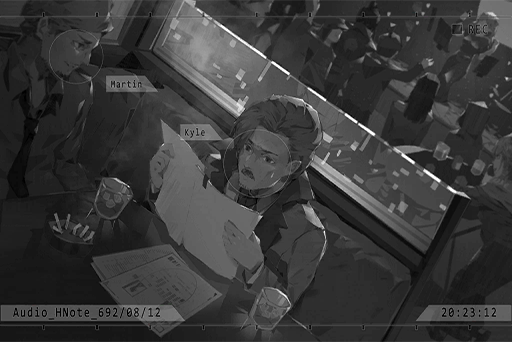

**Kyle** 
Paper documents...? 
......! These are... Hey, did you file an application for all this?

**Agent M** 
Don't be silly. Following that system will get you nothing but jack s\*\*\*. 
Captain Wood was indeed correct. Those Baro bastards in charge of smuggling have an accomplice within the Bureau. Thus, I decided to meet you in private to discuss this... Are you going to report me?

**Kyle** 
Course not, great job! With this information, we finally have a clear direction! Who's the one in this photo...?

**Agent M** 
Don't know yet. The computer analysis couldn't figure out the identity due to the angle. Despite that, these pieces of evidence all point to the fact that this person is their "Mediator". Judging by how familiar he is with the underground tunnels, I presume that this person probably worked there in the past.

**Kyle** 
This means the search range is now reduced significantly! As long as we can get a list of former employees...

**Agent M** 
We'll be able to catch the big one using this guy.

*\[Signal Lost\]*

[*(Click here to go back to the top)*](#toc)

## <a id="xos042"/>[#042] Multi\_File\_X042
### Requirements
|Character|Level|
|---------|:---:|
|**Xenon**| 38  |

### Log Content
*\[→Audio\_Capt.Jackson\_693\_09\_31\]*

**Agent M** 
So it finally came, eh...?

**Kyle** 
Yeah... they say that they're transferring you to the Intelligence Unit. My guess is that you've been doing your "homework" a bit too well.

**Agent M** 
Damn it... I knew there was definitely someone pulling the strings. I just never thought it'd be from that high up... This is trouble.

**Kyle** 
Judging from their attitude, they're not suspicious of me yet. You hand me the information and get yourself away from this right now.

**Agent M** 
No, we'll definitely get him in the next operation! For the past year, we've been catching a bunch of nobodies that has provided nothing in helping us solve the cases. You know yourself too, don't you!? Someone's carefully protecting the "Mediator".

**Kyle** 
Martin, don't be stubborn. You still have Delia and Nate to take care of. Don't lose your job for this.

**Agent M** 
... If we're talking about having a wife and children, aren't you the same, captain?

**Kyle** 
But our positions are different. In my position, I'm responsible for carrying on Captain Wood's ideals. 

**Agent M** 
Ha, haha... Aren't you a crafty one, captain? Only now do you bring up your superior rank... 
Then what about my feelings? What if I want to carry on some of that responsibility as well? Are those feelings not important?

**Kyle** 
... Of course not...

**Agent M** 
Two weeks... no! Ten days, figure out a way to get me ten more days. I'll definitely get you the guy.

**Kyle** 
... What are you trying to do? Don't act on your own.

**Agent M** 
Ten days.

*\[Door Closes\]*

**Kyle** 
Hey! Martin! 
Sigh...

*\[→Audio\_Graveyard\_693\_10\_15\]*

**Agent** 
Let us mourn for this brave agent. His bravery will forever remain in our hearts. Salute!

*\[Gunshot\]*

**Delia** 
*\*Sobs\*... \*Sobs\*...*

**Nate** 
*\*Sobs\**... Dad...

*\[»»» Fast Forward»»»\]*

**Xenon** 
... Smoke?

**Nate** 
... I have my own. Yikes, you're still smoking those crappy cigarettes...?

**Xenon** 
Nate... your dad was a good agent. I'm sorry we lost him.

**Nate** 
No, we didn't lose him. He will always be in my heart, and I will fill his vacant position.

**Xenon** 
You're a lot stronger than I thought. I can rest assured now.

**Nate** 
Yeah... can't say the same about my mom though. Back then, when my dad first decided to join the Serious Crime Unit, they got into a big argument... Better not let her see your dad; she's gonna go insane...

**Xenon** 
... Got it. Speaking of my dad, I haven't seen him since the funeral. He probably took the loss pretty hard too... Uncle Martin was his most trustworthy subordinate.

**Nate** 
I'm probably gonna be alright. You should go stay by his side.

**Xenon** 
Nah... To be honest, I haven't had a proper conversation with him for quite some time as well. Even if I were going to console him, I wouldn't have any idea how.

**Nate** 
Haha, that's right. You're smack\-dab in the middle of your rebellious phrase... 
I advise you to treasure every opportunity you spend together with your family. Don't end up like me.

**Xenon** 
......

**Nate** 
Ah, sorry... I shouldn't have said those things...

**Xenon** 
No, I understand. Even though I don't know how to communicate with him, my respect for him never changed. Everything he did... I admire it all, to be honest——But the way he does things can be just so...

**Nate** 
Yeah, really serious and proper. That's the type of person your dad is, and that's why he has such a strong sense of justice. I believe this is something worth learning from.

**Xenon** 
Yeah... I agree. 
It's about time I get going. Say hi to your mom for me.

**Nate** 
Simon...

**Xenon** 
Hmm?

**Nate** 
Although I'm already a Law Enforcement Agent trainee, my dad never talked to me about his work. I want to know... who killed him.

**Xenon** 
... What do you mean?

**Nate** 
I heard that he died because he broke the rules to privately investigate a smuggling group... The higher\-ups seem to have a hand in all this as well.

**Xenon** 
......

**Nate** 
It's unlikely that he's the only one pursuing this case. I think that your dad must know about it. If you can...

**Xenon** 
... I told you before; I haven't talked to my dad for a long time. You want me to all of a sudden ask him about that? You're asking the impossible.

**Nate** 
No, not by asking. What if you investigate it? Let "X"...

**Xenon** 
... Don't mention that name again. Didn't we agree on that?

**Nate** 
... My bad. Forget that I ever said these things.

**Xenon** 
I will. Nate, what you should be is an agent of the law, not an agent of revenge.

**Nate** 
Haha... Never thought I would get lectured by a brat like you one day. 
... I know.

*\[Signal Lost\]*

[*(Click here to go back to the top)*](#toc)

## <a id="xos043"/>[#043] Multi\_File\_X043
### Requirements
|Character|Level|
|---------|:---:|
|**Xenon**| 39  |

### Log Content
*\[→Audio\_53St.\_696\_05\_10\]*

**Student A** 
Shannon, bye\-bye\~ See you next week.

**Shannon** 
Okay! See you next week!

*\[Engine sounds\]*

**Kyle** 
Shannon, want a ride?

**Shannon** 
Dad!? What are you doing here!?

*\[→Signal Switches\]*

**Shannon** 
Jeez, stop picking me up with the admins' car! 
My classmates all laugh at me for this.

**Kyle** 
I'm worried about you. The security in this area has been getting worse and worse too...

**Shannon** 
Isn't that your fault, for not doing your job well?

**Kyle** 
Haha... well, that I am guilty of. 
However, I'm relieved to see that you have many friends at school.

**Shannon** 
I'm already far passed that age where I get bullied all the time. Dad, don't just remember things from that time. I'm not a child anymore.

**Kyle** 
Speaking of which, things back then were truly... got to thank Simon for that. Do you still see him?

**Shannon** 
Yep! He's doing great. He often invites me to see their practices or performances. Their band is really awesome, and all the members are really fun people! Especially Sis Cherry! It looks like their da... ah!

**Kyle** 
Da...?

**Shannon** 
N... Nothing! All in all, dad should go listen to their next performance too!

**Kyle** 
I don't have that kind of time... Besides, isn't it just some noisy music?

*\[Play Music\]*

**Kyle** 
Hey! What are you doing!?

**Shannon** 
Ah, what a coincidence. I turn on your music player and the first song just so happens to be "noisy music"\~

**Kyle** 
......

**Shannon** 
If it wasn't for the guitar you gifted him, he wouldn't have gone into music in the first place. Say, isn't it about time you two stop giving each other the silent treatment?

**Kyle** 
... Hmph, if he wants to come back, he can come back whenever he wants.

**Shannon** 
Here we go again\~ Who would want to live with you if you have that attitude...

*\[Brakes\]*

**Shannon** 
Wahh! W\-what's the matter!?

**Kyle** 
......!! 
Shannon... get out the car.

**Shannon** 
......?

**Kyle** 
It's that guy...

**Shannon** 
Dad...?

**Kyle** 
Get out the car, now! Listen carefully; don't do anything else, go straight back home, got it?

*\[Car Door\]*

**Shannon** 
......

*\[Signal Lost\]*

[*(Click here to go back to the top)*](#toc)

## <a id="xos044"/>[#044] Multi\_File\_X044
### Requirements
|Character|Level|
|---------|:---:|
|**Xenon**| 39  |

### Log Content
**????** 
Haaa... Haa...

*\[Running\]*

**Kyle** 
Stop right there!

*\[Running\]*

*\[→Signal Switches\]*

**Kyle** 
This is a dead\-end. There's nowhere for you to run! Show yourself!

**????** 
......

**Kyle** 
I'm throwing a tear gas grenade in three seconds. If you don't want to end up a sobbing mess, stop hiding... "Mediator"! Three... Two...

*\[Things crashing\]*

**Shannon** 
... Eek!?

**????** 
......! 
Stay away!

**Kyle** 
......!? Let go of her!

**????** 
I told you to stay away! Do you not care about what's going to happen to this girl!? I will pull the trigger!!

**Kyle** 
... Didn't I tell you to go straight back home...?

**Shannon** 
I... I was worried about dad. I\-I'm sorry...

**????** 
... Dad? Umm... 
I\-is this your daughter? If you want her to be safe, don't come near me. Let me go...

**Kyle** 
Shut up! It's you... you killed Martin...

**????** 
......? 
No... I\-I didn't kill anyone! *\*breathes heavily\**...

**Kyle** 
Let go of her now! You think I can't hit you at this distance!?

**Shannon** 
Kyaa!

**Kyle** 
......! 
Mediator... you're not the only one, right? As long as you confess the names of your comrades, I'll consider asking the Bureau to make your sentence lighter.

**????** 
No... *\*breathes heavily\**... As long as you stop pursuing me, I won't harm your daughter.

**Kyle** 
Tch...

**????** 
What's the matter? *\*breathes heavily\**... There isn't anybody coming to help you, right? You really think you have the upper hand in this situation? You don't want... something bad...  hah... had... to happen to your daughter, don't you? That's right... nobody wants... Therefore... back off! I'm leaving...

**[Administration Bureau]** 
*This is the Administration Bureau call center. What is the situation?*

**Shannon** 
Oh no! The sound...

**????** 
You little...! You made a call through the virtual internet!

**Shannon** 
WAAHHH!

**Kyle** 
Shannon！！

*\[Gunshot\]*

*\[Signal Lost\]*

[*(Click here to go back to the top)*](#toc)

## <a id="xos045"/>[#045] Multi\_File\_X045
### Requirements
|Character|Level|
|---------|:---:|
|**Xenon**| 40  |

### Log Content
*\[→Audio\_Hospital01\_696\_05\_10\]*

**Cherry** 
Father! What happened!?

**ER Doctor** 
I don't know. Some people found him collapsed on side of the road covered in blood.

**Xenon** 
Gunshot wound......?

**Cherry** 
......

**ER Doctor** 
I'm sorry, Miss Pauline. Your father has already lost too much blood. We need to do an emergency blood transfusion right away, but we don't have any AB type blood in our storage that matches his condition...

**Xenon** 
My blood type is AB!

**ER Doctor** 
Really!? Are you willing to undergo a blood transfusion checkup...

**Xenon** 
Whatever! Let's get on it!

*\[»»»Fast Forward»»»\]*

**Cherry** 
*\*sob\*... \*sob\*...*

**Xenon** 
The doctor said it's nothing major, it'll be alright.

**Cherry** 
Okay…

**ER Nurse** 
Miss Pauline, you may visit your father now. You've got 10 minutes.

**Cherry** 
Thank you!

**ER Nurse** 
Sir, we're sorry. Only family members are allowed.

**Cherry** 
He's the one who gave the blood!

**Xenon** 
Sherry, it's okay. I'm still feeling a bit dizzy. I'll just rest here. Go on.

**Cherry** 
Okay!

*\[»»»Fast Forward»»»\]*

**Xenon** 
……

**[News]** 
*...... Earlier today, a male agent who had sustained an injury was found lying here. By the time paramedics rushed to the scene, there were already no signs of life.*

**Xenon** 
......?

**[News]** 
*By his side is a young girl who is in complete shock. She appears to have sustained no physical injuries, but her emotional state is very unstable. It's currently suspected that this girl may be the agent's daughter.*

**Xenon** 
!?

**[News]** 
*The Administration Bureau is still in the process of clarifying the... Yes? Got it. 
New information just came in. The agent who died in the line of duty was named Kyle Jackson. The girl by his side is his daughter, Shannon Jackson......*

**Xenon** 
Dad!? Shannon!?

*\[»»»Fast Forward»»»\]*

**Cherry** 
... Simon? Where did he go?

*\[→Audio\_Hospital01\_696\_05\_17\]*

**Jacob** 
I'm sorry, we're still unable to determine the reason behind your daughter's unique symptoms. She has suffered no brain damage, but her brain is just unable to disconnect with the virtual internet. She may need to remain in the hospital for a while so we can observe her symptoms.

**Doris** 
*\*sob\*... \*sob\*...*

**Xenon** 
……

**Jacob** 
I'm very sorry about what happened to Mr. Jackson... he was a good agent.

**Doris** 
Thank you. That's what everybody says...

*\[→Audio\_Hospital01\_696\_09\_15\]*

**Doris** 
Doctor.

**Jacob** 
Good morning.

**Xenon** 
Has there been any progress?

**Jacob** 
Yes, as for Shannon's condition, we've designated it "Virtual\-internet Related Post Traumatic Stress Disorder", or "VR PTSD" for short. We suspect that the symptoms are residual effects of excessive emotional trauma clashing with the virtual Internet.

**Xenon** 
……

**Jacob** 
I'm sorry. As of now, I can't allow you two to see her. Anything that can arouse her memory could potentially cause her to have an emotional breakdown. We're currently still doing our best to look for things she could come in contact with in her daily life that can evoke a normal reaction. The information you provided us has been a big help.

**Xenon** 
Have you discovered anything?

**Jacob** 
Yes. We've discovered that when she hears Simon's music, her emotions will be significantly more stabilized. She's able to maintain a stable emotional state even without the use of sedatives.

**Xenon** 
If possible, let me play for her in person. Maybe that can get more of a reaction out of her.

**Jacob** 
No. Even if she so much as sees your faces, she will...

**Xenon** 
... So it's alright as long as I don't show my face?

*\[Signal Lost\]*

[*(Click here to go back to the top)*](#toc)

